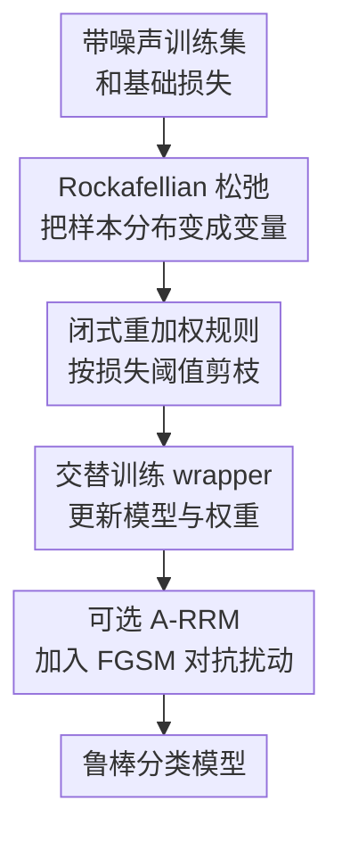

# Enhancing Learning with Noisy Labels via Rockafellian Relaxation

**会议**: ICLR2026  
**OpenReview**: [https://openreview.net/forum?id=g4EpGiN5X3](https://openreview.net/forum?id=g4EpGiN5X3)  
**代码**: 待确认  
**领域**: 优化 / 噪声标签学习  
**关键词**: 噪声标签, 损失重加权, Rockafellian Relaxation, 分布鲁棒优化, 对抗训练  

## 一句话总结
本文提出 Rockafellian Relaxation Method (RRM)，把任意监督训练损失包成一个可重加权的 min-min 优化问题，通过自动下调高损失可疑样本的权重，在真实噪声、合成噪声和部分对抗扰动场景下提升分类模型的鲁棒性。

## 研究背景与动机
**领域现状**：带噪声标签学习通常围绕两条路线展开：一类方法改造网络结构、正则项或损失函数，让模型不那么快记住错误标签；另一类方法在训练过程中估计样本是否可信，再通过样本选择、半监督学习或 loss reweighting 降低错误样本的影响。

**现有痛点**：很多强方法虽然效果好，却依赖额外假设。例如 Meta-Weight-Net 一类方法需要干净验证集来学习权重，DivideMix / ProMix / CC 等方法会先筛出较干净样本再做半监督训练，但筛选集合本身仍可能混入污染样本。工业数据里最麻烦的地方正在于此：标签来源复杂、噪声比例未知、干净验证集昂贵，方法越依赖外部干净信号，落地门槛越高。

**核心矛盾**：神经网络训练时，高损失样本既可能是难样本，也可能是错标签样本。简单丢掉高损失样本会伤害真正困难但有价值的数据；完全平均所有样本又会让错误标签在训练后期被记忆。本文想解决的是：能否在不假设干净验证集、不改模型结构的情况下，把经验分布从“所有样本均匀可信”松弛成“允许把部分概率质量从可疑样本上移走”的优化问题。

**本文目标**：作者希望提供一个 architecture-independent 的 wrapper：给定任意以监督损失为核心的训练方法，只改它的 supervised loss 权重，不强迫使用特定网络、特定任务或特定鲁棒损失。同时，这个 wrapper 最好能解释为什么会剪掉某些样本、如何用噪声比例估计控制剪枝比例，以及能否和对抗训练一起使用。

**切入角度**：论文从 Rockafellian Relaxation 和 optimistic distributionally robust optimization 的视角出发，把“训练集经验分布是否可信”看成优化变量。与其固定每个样本概率为 $1/N$，不如允许学习一个新的分布 $p$，但让它偏离原经验分布时支付 total variation 代价。这样，模型可以在高损失样本很可疑时把它们权重降到零，又不会无约束地挑一个过分乐观的数据分布。

**核心 idea**：用 Rockafellian Relaxation 把普通经验风险最小化改写为“参数优化 + 样本分布优化”的交替过程，让训练自动把概率质量从疑似噪声标签样本转移到低损失可信样本上。

## 方法详解

### 整体框架
RRM 的输入是一组可能被污染的训练样本、一个原本要最小化的预测损失 $J(\theta; x, y)$，以及任意现成训练方法；输出仍然是模型参数 $\theta$，但训练过程中额外维护每个样本的重加权变量 $u_i$。它不是新网络结构，而是一个包在 supervised loss 外面的优化层：先按当前权重训练模型，再根据当前样本损失重新求权重，把损失明显偏高的样本从训练分布中削弱甚至剪掉。

图里的三个贡献节点分别对应下面的关键设计：Rockafellian 松弛定义了可优化的样本分布，闭式重加权规则解释哪些样本会被降权，交替训练 wrapper 与可选 A-RRM 说明它如何嵌入已有方法。输入、输出只是脚手架，不单独作为设计点。

### 关键设计
**1. Rockafellian 松弛：把“平均所有样本”改成“优化一个近邻训练分布”**

普通训练默认每个样本权重都是 $1/N$，训练损失写成 $L(\theta)=\frac{1}{N}\sum_i J(\theta;x_i,y_i)$。如果某些 $y_i$ 是错标签，理想状态其实不是平均所有样本，而是让污染集合 $C$ 中的样本权重接近 0、干净样本重新归一化。问题是 $C$ 不可见，所以 RRM 不直接判断标签真假，而是把样本概率 $p$ 作为内层优化变量，并限制它不能离均匀经验分布太远：

$$
L_{\mathrm{RRM}}(\theta)=\min_{p\in\Delta(N)} \mathbb{E}_{(x,y)\sim p}[J(\theta;x,y)] + \gamma\, d_{TV}(p_N,p).
$$

论文进一步用 $p_i=1/N+u_i$ 改写这个问题，得到对 $u$ 的约束优化：$\sum_i u_i=0$ 且 $1/N+u_i\ge 0$。这一步的含义很直观：$u_i<0$ 是从第 $i$ 个样本身上拿走概率质量，$u_i>0$ 是把概率质量补给其他样本；$\gamma$ 则控制“挪动概率质量”有多贵。与传统 loss reweighting 不同，这里的权重不是启发式打分，而是来自一个带 total variation 惩罚的优化目标，因此能把样本剪枝和分布松弛统一起来解释。

**2. 闭式重加权规则：用 $c_{\min}+\gamma$ 阈值筛掉高损失可疑样本**

内层优化乍看需要解线性规划，但论文证明了固定 $\theta$ 时，最优 $u$ 有非常清晰的结构。令 $c_i=J(\theta;x_i,y_i)$、$c_{\min}=\min_i c_i$，那么损失超过 $c_{\min}+\gamma$ 的样本会被归入 $\chi(\theta)=\{i:c_i>c_{\min}+\gamma\}$，存在一个最优解会把这些样本的权重降到 $0$，即令 $u_i=-1/N$；被拿走的总概率质量 $|\chi|/N$ 再均匀转移到最小损失样本集合上。

这个结果给 RRM 带来两个好处。第一，重加权可以用一次遍历损失列表完成，不必在大数据集上频繁调用昂贵优化器。第二，$\gamma$ 的作用非常可解释：如果 $\gamma$ 很大，几乎没有样本满足高于阈值的条件，RRM 退化成普通训练；如果 $\gamma$ 较小，更多高损失样本被剪掉。论文还提出用污染比例估计 $C'$ 自动调节 $\gamma$，把阈值设到大约 $(1-C')$ 分位附近，从而让剪掉的样本比例至少接近预期污染比例。这样，RRM 不需要干净验证集，只需要一个可以保守估计的噪声率，就能控制剪枝强度。

**3. 交替训练 wrapper：只替换监督损失，不绑定模型或鲁棒训练方法**

RRM 的训练过程是 block coordinate descent：固定 $u$ 时，用带权监督损失更新模型参数 $\theta$；固定 $\theta$ 时，根据当前所有样本损失更新 $u$。这使它能包在很多已有算法外面。对于普通 CCE、MAE、MSE，它直接把平均监督损失替换成 $\sum_i (1/N+u_i)J_i$；对于 ProMix、DivideMix、CC 这类含有 supervised component $L_X$ 的方法，它只包住有标签监督部分，保留原方法的半监督项和辅助项。

这种 wrapper 设计是本文最实用的一点。RRM 并不声称自己替代所有 noisy-label 方法，而是让已有方法的“干净样本集合仍有噪声”这个弱点再被一层损失重加权修正。论文实验也按这个逻辑展开：既测试 CCE 这种普通基线被 RRM 增强后的效果，也测试 ProMix、DivideMix、CC 等强方法被 RRM 包装后是否还能继续涨点。

**4. A-RRM 扩展：在对抗扰动训练中同步抑制错标签样本**

论文还把 RRM 扩展到 A-RRM。区别很小：在 GradientSteps 中，对每个 batch 先用 FGSM 生成 $x_i+\epsilon\cdot \mathrm{sign}(\nabla_x J(\theta;x_i,y_i))$ 这样的扰动样本，再用当前样本权重做 SGD 更新。也就是说，A-RRM 同时面对两种污染：特征侧有对抗扰动，标签侧有错误标签。

这个设计背后的判断是，单纯 adversarial training 可能会在带噪声标签时把错误标签也训练得更“稳定”，尤其当训练扰动强度和测试扰动强度不匹配时，模型表现会塌。A-RRM 的重加权步骤让模型在对抗训练过程中仍能逐渐识别并压低高损失污染样本的权重，因此比只做 AT 更不容易被错标签拖走。

### 损失函数 / 训练策略
RRM 训练的核心目标是交替近似求解：

$$
\min_{\theta}\min_{u\in U}\sum_{i=1}^{N}(1/N+u_i)J(\theta;x_i,y_i)+\frac{\gamma}{2}\|u\|_1.
$$

实际算法先初始化 $u=0$。每一轮先运行若干 epoch 的 GradientSteps，用当前权重训练 $\theta$；然后执行 Re-weight，根据当前损失 $c_i$ 和阈值 $c_{\min}+\gamma$ 计算 $u^*$；最后用 $u\leftarrow \mu u^*+(1-\mu)u$ 平滑更新权重。若有污染比例估计 $C'$，论文建议把 $\gamma$ 自动设成分位数阈值与最小损失的差，并令 $\mu=1$，从而精确控制剪枝比例。

对抗版本 A-RRM 只是在 GradientSteps 里加入 FGSM 输入扰动，训练扰动参数是 $\epsilon$。论文强调 Re-weight 不需要每个 batch 都做，而是在若干 epoch 后执行一次；实验里 CIFAR-10 的 Re-weight 平均只带来约 3.88 秒额外开销，说明这个 wrapper 的计算瓶颈仍是常规神经网络训练，而不是重加权本身。

## 实验关键数据

### 主实验
论文实验覆盖真实噪声数据集、合成噪声数据集、对抗扰动与标签噪声混合场景，以及附录中的文本和医学弱标注任务。主线结论是：RRM 对 CCE、MSE 这类普通损失提升明显，对 DivideMix、CC 等强 noisy-label 方法也能继续提供增益，但对 MAE 这样的本身较鲁棒损失并非总是稳定提升。

| 数据集 / 设置 | 指标 | 本文 RRM 包装后 | 原方法 / 之前结果 | 提升 |
|--------|------|------|----------|------|
| CIFAR-100N Noisy Fine, ProMix | Test Acc. | 74.19 | 73.79 | +0.40 |
| CIFAR-100N Noisy Fine, DivideMix | Test Acc. | 73.98 | 71.13 | +2.85 |
| CIFAR-10N Worst, DivideMix | Test Acc. | 94.75 | 92.56 | +2.19 |
| Clothing1M, CC | Test Acc. | 75.69 | 75.40 | +0.29 |
| Clothing1M, CCE | Test Acc. | 71.48 | 68.94 | +2.54 |
| Food-101N, CCE | Test Acc. | 84.21 | 81.67 | +2.54 |

在真实噪声上，最有代表性的是 CIFAR-100N 和 Clothing1M。CIFAR-100N 中，RRM 包 ProMix 和 DivideMix 都达到或接近表中最强结果；Clothing1M 中，RRM 包 CC 后从 75.4 提到 75.69，几乎追平 LRA-diffusion 的 75.7。Food-101N 上，CCE+RRM 从 81.67 提到 84.21，虽然仍低于 LRA-diffusion 和 SURE，但说明即使不使用复杂 noisy-label pipeline，重加权也能给普通监督训练明显帮助。

### 消融实验
| 配置 | 关键指标 | 说明 |
|------|---------|------|
| CIFAR-10, 10% 噪声, CCE | 89.94 → 92.20 | RRM 明显提升普通交叉熵训练 |
| CIFAR-10, 20% 噪声, CCE | 86.98 → 90.44 | 噪声升高后提升幅度更大 |
| CIFAR-10, 30% 噪声, CCE | 81.90 → 88.49 | 高噪声下 RRM 抑制错误标签记忆 |
| CIFAR-10, 20% 噪声, MSE | 89.43 → 91.43 | MSE 也从重加权中受益 |
| CIFAR-10, 30% 噪声, MAE | 88.28 → 82.98 | MAE 上不稳定，说明 wrapper 不是无条件增益 |
| MNIST-10, 20% 噪声, $\epsilon_{test}=0$ | AT 58 vs A-RRM 96 | 标签噪声与对抗训练混合时，重加权避免 AT 崩塌 |
| MNIST-10, 30% 噪声, $\epsilon_{test}=0.1$ | AT 20 vs A-RRM 82 | 训练/测试扰动强度不匹配时优势尤其明显 |

### 关键发现
- RRM 对普通损失函数的帮助最稳定，尤其是 CCE 和 MSE；这符合直觉，因为普通经验风险最容易在后期记住错标签。
- 对已经带有样本选择或半监督机制的方法，RRM 仍可作为二次过滤器发挥作用，说明原方法筛出的 supervised subset 里可能仍有污染样本。
- MAE 的结果更复杂：在部分噪声水平下 RRM 反而降低准确率，提示“高损失即噪声”的假设对某些鲁棒损失不一定匹配。
- A-RRM 的 MNIST 实验显示，普通 adversarial training 在有标签噪声时可能严重崩塌，而重加权能把多数污染样本的 $u_i$ 推到接近 $-1/N$，相当于从训练中移除。
- Table 6 的 $u$ 轨迹很关键：20% 污染下，到第 49 轮有 9286 / 9600 个污染样本落入接近零权重区间，而大多数干净样本保持接近名义权重 $1/N$。

## 亮点与洞察
- RRM 的亮点不是提出一个复杂网络，而是把 noisy-label reweighting 写成了一个有优化解释的分布松弛问题。这样一来，剪枝规则、阈值参数和 total variation 惩罚之间的关系都能被理论结果解释。
- Theorem 3.1 和 Corollary 3.1.1 让方法从“需要解线性规划”变成“一次遍历损失即可重加权”。这对大规模训练很重要，因为 wrapper 如果每轮都昂贵，就很难作为通用插件使用。
- 论文把 RRM 与 optimistic Wasserstein DRO 联系起来，这个视角很有启发：不是只防最坏分布，而是在允许的邻域内寻找对训练最有利、但仍受约束的数据分布。对错标签问题来说，这比传统 worst-case DRO 更贴合“数据里有一部分其实应该被纠正或移除”的直觉。
- RRM 对强方法也能涨点，说明不少 noisy-label pipeline 的瓶颈不是架构能力，而是 supervised component 里残留的错误标签权重。这给实际系统一个简单策略：先保留已有训练代码，再在监督损失外面加一层可解释重加权。
- A-RRM 的结果提醒我们，对抗训练和标签噪声不是独立问题。若训练扰动强度与部署环境不匹配，AT 可能把错标签影响放大；样本重加权则提供了一种在训练中动态“撤销坏样本”的机制。

## 局限与展望
- RRM 的核心判据仍然依赖样本损失。高损失样本可能是错标签，也可能是少数类、难样本或分布尾部样本；如果任务本身存在长尾或类不平衡，过强剪枝可能损害公平性和泛化。
- 自动调参需要污染比例估计 $C'$。论文展示了保守估计仍有效，但估计偏大时收益下降；真实场景下如何稳定估计 $C'$ 仍是落地问题。
- 实验覆盖了图像、文本和医学弱标注，但主文里的强结论主要来自分类任务。对于结构化预测、生成任务或多标签细粒度任务，单个样本 loss 的可比性会更复杂。
- RRM 把概率质量转移到最小损失样本集合上，这在理论上清晰，但可能强化 easy sample 的主导地位。未来可以考虑把回收的概率质量分配给低损失但多样的样本，而不是只集中到最小损失集合。
- 当前 A-RRM 采用 FGSM 作为对抗扰动示例。若换成 PGD、更复杂的数据增强或现代鲁棒训练策略，RRM 的稳定性和额外收益还需要更系统验证。

## 相关工作与启发
- **vs Meta-Weight-Net / Ren et al. reweighting**: 这些方法通常需要干净验证集来学习样本权重，本文不依赖 clean validation set，而是用 total variation 惩罚下的内层优化得到权重，优势是落地约束更少，劣势是依赖 loss 阈值假设。
- **vs DivideMix / ProMix / CC**: 它们把 noisy-label learning 转成样本划分或半监督学习问题，本文不是替代这些 pipeline，而是包住它们的 supervised loss，进一步削弱被选入干净集合但仍可疑的样本。
- **vs GCE / MAE / ELR 等鲁棒损失**: 鲁棒损失从损失函数形状上减少错标签影响，RRM 从样本分布上改训练权重。两者可以组合，但实验也说明组合不一定总是单调变好，尤其是 MAE。
- **vs adversarial training**: AT 关注特征扰动鲁棒性，RRM 关注标签污染。A-RRM 的启发是二者可以放进同一个训练循环：先构造扰动样本，再根据损失轨迹剪掉疑似污染标签。
- **对后续工作的启发**: 这个方法适合当作“低侵入式鲁棒训练层”迁移到已有系统，尤其是那些已经有复杂训练 recipe、但数据标签质量不稳定的场景。更进一步，可以把 RRM 的权重轨迹当作数据质量诊断信号，用来发现系统性标注错误或弱标注偏差。

## 评分
- 新颖性: ⭐⭐⭐⭐☆ 把 noisy-label reweighting 和 Rockafellian / optimistic DRO 连接得很清楚，机制不花哨但理论解释扎实。
- 实验充分度: ⭐⭐⭐⭐☆ 覆盖真实噪声、合成噪声、对抗扰动和附录应用，但主实验仍集中在分类准确率，缺少更多长尾和公平性分析。
- 写作质量: ⭐⭐⭐⭐☆ 方法推导和阈值解释比较清楚，实验表格信息密集；部分符号和算法排版略粗糙，需要读者自己把 $p$、$u$、$\gamma$ 的关系串起来。
- 价值: ⭐⭐⭐⭐☆ 作为不改架构的训练 wrapper 很实用，尤其适合给已有 noisy-label 或普通监督 pipeline 加一层低成本鲁棒性增强。

<!-- RELATED:START -->

## 相关论文

- [\[ICML 2026\] Learning Locally, Revising Globally: Global Reviser for Federated Learning with Noisy Labels](../../ICML2026/optimization/learning_locally_revising_globally_global_reviser_for_federated_learning_with_no.md)
- [\[ICLR 2026\] Enhancing Communication Compression via Discrepancy-aware Calibration for Federated Learning](enhancing_communication_compression_via_discrepancy-aware_calibration_for_federa.md)
- [\[AAAI 2026\] Data Heterogeneity and Forgotten Labels in Split Federated Learning](../../AAAI2026/optimization/data_heterogeneity_and_forgotten_labels_in_split_federated_learning.md)
- [\[ICLR 2026\] The Power of Small Initialization in Noisy Low-Tubal-Rank Tensor Recovery](the_power_of_small_initialization_in_noisy_low-tubal-rank_tensor_recovery.md)
- [\[ICLR 2026\] Online Black-Box Prompt Optimization with Regret Guarantees under Noisy Feedback](online_black-box_prompt_optimization_with_regret_guarantees_under_noisy_feedback.md)

<!-- RELATED:END -->
