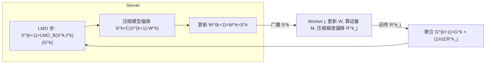

# Error Feedback for Muon and Friends

**会议**: ICLR 2026  
**OpenReview**: [https://openreview.net/forum?id=rex7s82Iav](https://openreview.net/forum?id=rex7s82Iav)  
**代码**: 待确认  
**领域**: 优化  
**关键词**: 分布式优化、通信压缩、Error Feedback、Muon、非欧几里得 LMO

## 一句话总结
本文提出 **EF21-Muon**——首个把 error feedback 推广到非欧几里得几何的、带严格收敛保证的通信高效分布式 LMO 优化器，关掉压缩即退化为 Muon/Scion/Gluon，在 NanoGPT 上实现最高 7× 通信节省且精度无损。

## 研究背景与动机
**领域现状**：Muon 及其衍生的 Scion、Gluon 用层级、几何感知的 LMO（线性最小化预言机）更新替代 Adam 的全局矩估计，在大规模深度学习（尤其 LLM 预训练）上推动了前沿；它们统一可视为基于非欧几里得范数球上 LMO 的 Gluon 家族。

**现有痛点**：现代训练靠规模驱动、必须分布式，而分布式的核心瓶颈是**通信**——每步要在机器间传输 $d$ 维的参数/梯度。但 Muon 这类方法**还没有有原则的分布式框架**：仅有的几个分布式变体（基于 ZeRO-1 的 Distributed Muon、MuLoCo、Dion）都是启发式的，**没有任何收敛保证**。

**核心矛盾**：通信压缩 + error feedback（EF21）在欧几里得设定下已成熟，但 Muon 的威力恰恰来自**非欧几里得**的 LMO 步；如何把压缩与 error feedback 移植到非欧几里得几何，且不破坏 Muon 的理论与实践优势，是一个开放难题。

**本文目标**：在不牺牲 Muon 理论/实践收益的前提下，给出**可证明收敛**且**实践有效**的通信高效分布式版本。

**核心 idea**：把 EF21 的"压缩+误差反馈"机制与 LMO 型更新融合，得到双向压缩（worker→server 压梯度、server→worker 压模型偏移）的 EF21-Muon，并首次将 error feedback 的分析框架推广到任意范数诱导的非欧几里得设定。

## 方法详解

### 整体框架
EF21-Muon 在 client-server 架构下，把每一步拆成三件事：服务器用聚合的梯度估计 $G^k$ 做 **LMO 型更新**得到新模型 $X^{k+1}$；服务器把"模型偏移"压缩后广播给所有 worker；每个 worker 在最新模型上算带动量的随机梯度、压缩"梯度偏移"后回传，服务器聚合更新梯度估计。整个过程**永不传输未压缩消息**，且 error feedback 保证压缩误差被逐步纠正。

### 关键设计
**1. 非欧几里得 LMO 型更新：保留 Muon 的几何感知**
更新核心是范数约束的线性最小化预言机：
$$X^{k+1} = X^k + t^k\,\mathrm{LMO}_{B(0,1)}(G^k),\quad \mathrm{LMO}_{B(X,t)}(G):=\arg\min_{Z\in B(X,t)}\langle G,Z\rangle$$
其中 $B(X,t):=\{Z:\|Z-X\|\le t\}$。当 $\|\cdot\|$ 取谱范数 $\|\cdot\|_{2\to2}$ 时，$\mathrm{LMO}_{B(0,1)}(G^k)=-U^k(V^k)^\top$（来自动量矩阵的 SVD $G^k=U^k\Sigma^k(V^k)^\top$），即恢复原始 Muon；换其他算子范数则得到 Scion/Gluon。框架由 LMO 中的范数参数化，从而统一覆盖一大类压缩方法。

**2. 双向压缩 + Error Feedback：通信高效且可证明**
worker 侧压缩"动量偏移" $R^{k+1}_j=C^k_j(M^{k+1}_j-G^k_j)$，server 侧压缩"模型偏移" $S^k=C^k(X^{k+1}-W^k)$。沿用 EF21 的偏移压缩思想：被压缩的不是量本身，而是它与上一估计的差，因而误差被反馈进下一步并随迭代收敛到零。这是 **error feedback 首次被推广到欧几里得之外**，支持标准收缩压缩器以及本文新提出的一类非欧几里得压缩器。

**3. 层级 (layer-wise) 各向异性分析：贴合深网真实几何**
正文给出把所有参数统一处理的简化版（Algorithm 1），但主算法（Algorithms 2/3，确定性/随机梯度）是**按层**设计与分析的：把 $X=[X_1,\dots,X_p]$ 看作各层矩阵 $X_i\in\mathbb{R}^{m_i\times n_i}$ 在乘积空间上的集合，每层配自己的范数 $\|\cdot\|_{(i)}$。这与 Muon"逐层施加"的实践一致，并允许引入各向异性的平滑假设，得到更紧的保证。

**4. 双平滑机制下的收敛保证：对齐欧式最优率**
理论覆盖两种机制：非欧几里得平滑（Theorems 3/5）与更一般的非欧几里得 $(L_0,L_1)$-平滑（Theorems 4/6）。确定性梯度下达到 $O(1/K^{1/2})$、随机梯度下 $O(1/K^{1/4})$，**匹配 EF21 在欧式设定的 SOTA 率**，并在合适范数下可能更快；关掉压缩则恢复未压缩 Muon/Scion/Gluon 的 SOTA 保证。层级版本（Theorems 14/17/19/24）进一步把这些结果纳入更一般的各向异性分析。

## 实验关键数据

### 主实验

| 数据集/任务 | 指标 | 本文 (EF21-Muon) | Baseline (未压缩 Muon/Scion/Gluon) | Δ |
|------------|------|------|----------|---|
| NanoGPT @ FineWeb 预训练 | worker→server 通信量 | 最高省 7× | 1× | -7× 通信 |
| NanoGPT @ FineWeb 预训练 | 精度 / 验证 loss | 与基线持平 | 基线 | 无退化 |

### 消融实验

| 配置 | 指标 | 说明 |
|------|------|------|
| 多种压缩器（含新非欧压缩器） | 通信 vs 精度 | 系统比较不同压缩器在相同范数下的通信-精度权衡 |
| 关闭压缩 | 收敛 | 退化为 Muon/Scion/Gluon，验证框架的恢复性 |
| 范数选择（谱范数等） | 收敛速度 | 合适范数下可获得比欧式更快的收敛 |

### 关键发现
- 双向压缩可在 NanoGPT 上把 worker→server 通信压到原来的 1/7，且验证精度不掉。
- error feedback 是"无损压缩"的关键：误差被反馈纠正，使压缩不破坏收敛保证。
- 收敛率在两种平滑机制下都对齐欧式 SOTA，理论层面给出了"压缩不付理论代价"的证据。
- 异构（heterogeneous）设定下各 worker 的本地目标可任意不同，框架仍成立，契合多数据中心/联邦学习场景。
- 范数选择是"免费的杠杆"：在合适范数下收敛常数可优于欧式，把几何先验直接转化为速度收益。

### 收敛保证速览

| 算法 | 平滑机制 | 收敛率 | 恢复欧式 SOTA | 恢复未压缩 SOTA |
|------|----------|--------|----------------|------------------|
| 确定性梯度 | 非欧平滑 | $O(1/K^{1/2})$ | ✓ | ✓ |
| 确定性梯度 | 非欧 $(L_0,L_1)$-平滑 | — | ✓ | ✓ |
| 随机梯度 | 非欧平滑 | $O(1/K^{1/4})$ | ✓ | ✓ |
| 随机梯度 | 非欧 $(L_0,L_1)$-平滑 | — | ✓ | ✓ |

## 亮点与洞察
- **首个**带严格收敛保证的非欧几里得 LMO 分布式优化器，填补 Muon 家族"有实践无理论"的分布式空白。
- error feedback **首次走出欧几里得**，这一推广本身具有独立的方法论价值。
- 统一框架：一个 EF21-Muon 通过范数参数化恢复 Muon/Scion/Gluon，并附带它们的首个通信高效分布式实现。
- 层级各向异性建模把"深网不同层几何不同"这一直觉写进了假设与界，理论更贴合实践。

## 局限与展望
- 实验规模仅到 NanoGPT/FineWeb，尚未在数十亿参数 LLM 真实多机环境验证 7× 是否仍成立。
- 仍是 client-server 中心化范式，未覆盖去中心化/3D 并行（如 Dion 关注的场景）。
- $(L_0,L_1)$-平滑等假设虽更一般，但常数估计与实际范数选择的指导仍偏理论。
- 新非欧压缩器的工程实现开销与通用收缩压缩器的对比可进一步系统化。

## 相关工作与启发
- **vs Muon / Scion / Gluon**: 三者被统一为 Gluon 家族的 LMO 实例；本文不改其单机更新，而是补上"分布式 + 压缩 + 误差反馈 + 收敛证明"这一层，关压缩即还原它们。
- **vs Distributed Muon (ZeRO-1) / MuLoCo / Dion**: 这些是启发式分布式 Muon，无收敛保证；EF21-Muon 提供首个有原则、可证明的替代。
- **vs EF21 (Richtárik et al.)**: 继承其偏移压缩与误差反馈思想，并把分析从欧几里得推广到任意范数的非欧几里得（及层级）设定。

## 评分
- 新颖性: ⭐⭐⭐⭐⭐ 首次把 error feedback 推到非欧几里得，并给 Muon 家族首个可证明分布式框架，理论缺口填补干净。
- 实验充分度: ⭐⭐⭐⭐ NanoGPT 上系统比较多压缩器、7× 节省无损精度，但缺大规模真实多机 LLM 验证。
- 写作质量: ⭐⭐⭐⭐ 动机、贡献、定理表格条理清晰，符号体系严谨；理论密度高，对非专业读者门槛偏高。
- 价值: ⭐⭐⭐⭐⭐ 直击大规模分布式训练通信瓶颈，又为 Muon 家族奠定理论基础，理论与工程双重价值。

<!-- RELATED:START -->

## 相关论文

- [\[ICLR 2026\] MuonBP: Faster Muon via Block-Periodic Orthogonalization](muonbp_faster_muon_via_block-periodic_orthogonalization.md)
- [\[ICLR 2026\] How Muon's Spectral Design Benefits Generalization: A Study on Imbalanced Data](how_muons_spectral_design_benefits_generalization_a_study_on_imbalanced_data.md)
- [\[ICML 2026\] FOAM: Frequency and Operator Error-Based Adaptive Damping Method for Reducing Staleness-Oriented Error for Shampoo](../../ICML2026/optimization/foam_frequency_and_operator_error-based_adaptive_damping_method_for_reducing_sta.md)
- [\[ICLR 2026\] Convergence of Muon with Newton-Schulz](convergence_of_muon_with_newton-schulz.md)
- [\[ICLR 2026\] LoRA meets Riemannion: Muon Optimizer for Parametrization-independent Low-Rank Adapters](lora_meets_riemannion_muon_optimizer_for_parametrization-independent_low-rank_ad.md)

<!-- RELATED:END -->
