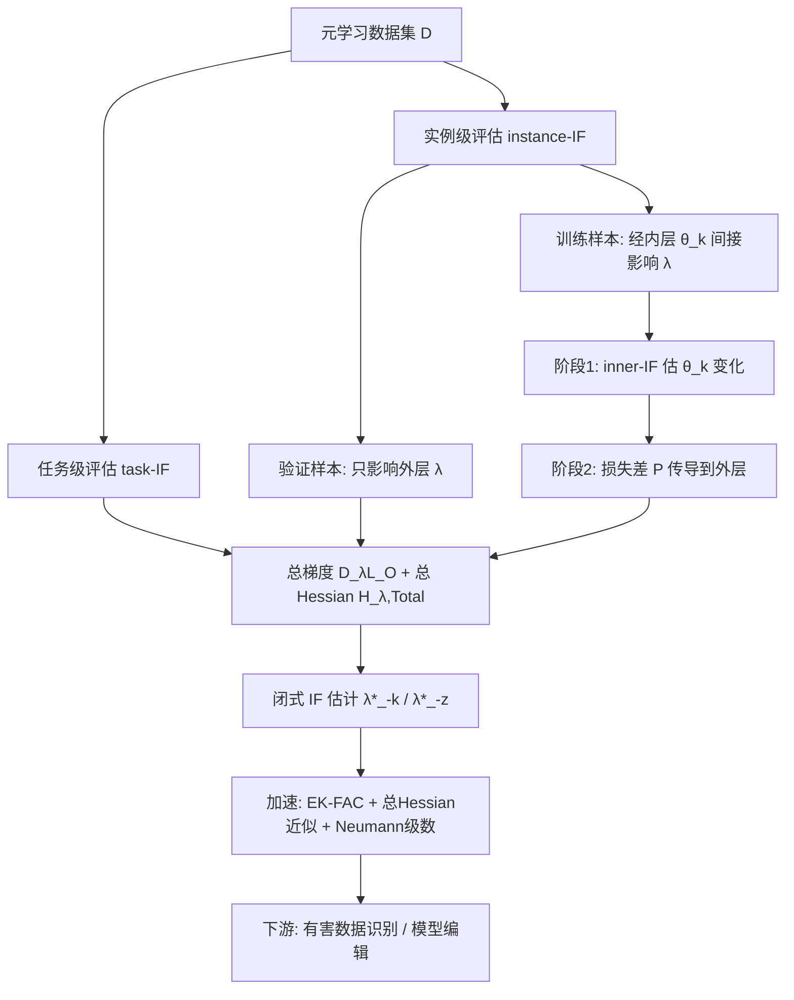

# Evaluating Data Influence in Meta Learning

**会议**: ICLR 2026  
**OpenReview**: [https://openreview.net/forum?id=0gh7haE5tc](https://openreview.net/forum?id=0gh7haE5tc)  
**代码**: 待确认  
**领域**: 双层优化 / 数据归因 / 元学习  
**关键词**: 影响函数, 数据归因, 元学习, 双层优化, MAML, 数据评估, 模型编辑  

## 一句话总结
把影响函数从单层 M-estimator 推广到元学习的双层优化结构，提出 task-IF 和 instance-IF 两套闭式公式，用「总梯度 / 总 Hessian」精确刻画一个任务或一条样本对元参数的直接与间接贡献，并用 EK-FAC + Neumann 级数加速，实现免重训的有害数据识别与模型编辑。

## 研究背景与动机

**领域现状**：元学习（以 MAML 为代表）把「学会学习」建模成双层优化（BLO）——内层用元参数 $\lambda$ 在每个小样本任务上训出任务专属参数 $\theta_i(\lambda)$，外层在验证集上聚合所有任务的表现来优化共享的 $\lambda$。随着 meta-dataset 规模膨胀，任务数量巨大，但任务之间贡献极不均衡，且大数据集里夹杂错误标签噪声。

**现有痛点**：要识别「哪些任务/样本在拖后腿」就需要训练数据归因工具。影响函数（Influence Function, IF）本是最高效的归因手段——靠梯度信息估计去掉某点后模型的变化，无需重训，远快于 Shapley Value。但 IF 当年是为**单层 M-estimator** 设计的，它的整套推导建立在「最优点处梯度为零」$\nabla L(\hat\theta)=0$ 这个前提上。

**核心矛盾**：元学习的双层结构让这个前提失效。元参数 $\lambda$ 和任务参数 $\theta_i(\lambda)$ 互相依赖，外层总损失 $L_{\text{Total}}$ 同时依赖 $\lambda$ 和 $\{\theta_i(\lambda)\}$，在最优点 $\lambda^*$ 处**直接梯度并不为零** $\partial_\lambda L_{\text{Total}}\neq 0$，因此经典 IF 的 Taylor 展开根本展不开。更麻烦的是，训练样本根本不显式出现在外层目标里——它对元参数的影响是「隔着一层任务参数」间接传导的，没法直接 up-weight。

**本文目标**：在 BLO 框架下建立一套通用、闭式、可扩展的元学习数据归因框架，分别在**任务级**和**实例级**精确量化贡献。

**核心 idea**：**用「总梯度」替代「直接梯度」**——关键观察是虽然直接梯度非零，但**总梯度在最优点处为零** $D_\lambda L_{\text{Total}}(\lambda^*)=0$，把这个总梯度（含 $\theta_i(\lambda)$ 对 $\lambda$ 的依赖项）和对应的「总 Hessian」代回 IF 推导，就能恢复出适用于双层结构的影响函数；对训练样本则设计**两阶段闭式估计**，先算它对任务参数的影响，再把这份影响经外层损失差传导到元参数。

## 方法详解

### 整体框架
论文沿着元学习数据的天然层级——「整个数据集 = 多个任务数据集，每个任务 = 训练集 ∪ 验证集」——把归因拆成三种情形分别给闭式解：(1) **任务级 task-IF**：去掉整个第 $k$ 个任务对 $\lambda^*$ 的影响；(2) **验证样本 instance-IF**：验证样本只出现在外层、只直接影响 $\lambda$，复用 task-IF 思路；(3) **训练样本 instance-IF**：训练样本藏在内层、间接影响 $\lambda$，需两阶段传导。三者的共同骨架是「总梯度 + 总 Hessian」这套对双层结构的修正。

### 关键设计

**1. 总梯度与总 Hessian：让 IF 在双层结构里成立的地基。** 经典 IF 之所以能写成 $-H_{\hat\theta}^{-1}\nabla\ell(z_m;\hat\theta)$，全靠最优点处 $\nabla L(\hat\theta)=0$。双层结构破坏了这一点，但作者发现**总梯度**仍然归零。对第 $i$ 个任务的外层损失 $L_O^i$，其总梯度为 $D_\lambda L_O^i = \partial_\lambda L_O^i + \frac{d\theta_i(\lambda)}{d\lambda}\cdot\partial_{\theta_i}L_O^i$，其中关键的雅可比项由内层最优性条件给出 $\frac{d\theta_i(\lambda)}{d\lambda} = -\partial_\lambda\partial_{\theta_i}L_I\cdot H_{i,\text{in}}^{-1}$（$H_{i,\text{in}}$ 是内层 Hessian）。这一项正是「元参数变一点、任务参数跟着变多少」的链式传导，是 direct-IF 漏掉的核心。相应地把直接 Hessian 升级为**总 Hessian** $H_{\lambda,\text{Total}}=\sum_i D_\lambda D_\lambda L_O^i$，它展开后含一阶/二阶/乃至三阶偏导的交叉项，完整刻画了双层耦合。

**2. task-IF：把一整个任务当成「一个数据点」up-weight。** 去掉第 $k$ 个任务等价于让外层里 $L_O(\lambda,\theta_k(\lambda);D_k^{\text{val}})$ 这一项消失。仿照原始 IF 对该项加扰动 $\epsilon$ 并做 Taylor 展开，但用上面修正后的总梯度和总 Hessian，得到闭式 $\text{task-IF}(D_k)=-(\delta I+H_{\lambda,\text{Total}})^{-1}\cdot D_\lambda L_O(\lambda^*,\theta_k(\lambda^*);D_k^{\text{val}})$，于是重训后的元参数可免重训估计为 $\lambda^*_{-k}\approx\lambda^*-\text{task-IF}(D_k)$。对照实验里**direct-IF**（公式 2，忽略 $\theta_i$ 对 $\lambda$ 依赖的朴素推广）在 Omniglot 上精度只有 0.54，而 task-IF 达 0.78、逼近重训的 0.79，直接验证了「总梯度修正」是不可省的。

**3. 训练样本的两阶段闭式传导：解决「样本不显式出现在外层」难题。** 训练样本 $\tilde z$ 藏在内层、无法直接 up-weight 外层损失。作者拆成两步：**阶段一**用经典 IF 算它对任务参数的影响 $\text{inner-IF}(\tilde z;\theta_k)=-H_{k,\text{in}}^{-1}\nabla_{\theta_k}\ell(\tilde z;\theta_k)$（此时 $\lambda$ 固定，内层就是普通单层问题）；**阶段二**的巧思是——既然外层损失不随 $\tilde z$ 显式变化，那就估计「任务参数从 $\theta_k$ 变到 $\theta_k^-$ 导致的外层损失差」$P(\lambda,\theta_k;\tilde z)=-\nabla_\theta L_O^\top\cdot\text{inner-IF}(\tilde z;\theta_k)$，把这个**损失差项**当作要 up-weight 的对象加进外层目标并用系数 $\zeta$ 加权，令 $\zeta\to0$ 求导即得 $\text{instance-IF}(\tilde z)=-H_{\lambda,\text{Total}}^{-1}\cdot D_\lambda P(\lambda^*,\theta_k(\lambda^*);\tilde z)$。验证样本因只出现在外层，则退化为 task-IF 的样本版 $-(\delta I+H_{\lambda,\text{Total}})^{-1}\nabla\ell(\tilde z;\theta_k)$。

**4. 三阶导与 iHVP 的加速：让框架真正能跑大模型。** 总 Hessian 含 $\frac{d^2\theta_i}{d\lambda^2}$ 这类**三阶偏导**，且全程反复出现逆 Hessian-向量积（iHVP），直接算既贵又不稳。作者三管齐下：用 **EK-FAC** 做内层 iHVP 的免存储近似；针对总 Hessian 提出**近似定理 5.1**，把含三阶导的 $H'$ 项替换成 $\Gamma=\sum_i\|\partial_\theta L_O^i\|_1\cdot I$——因为三阶导信息量相对一二阶有限，用梯度幅值的对角近似既抓住主要影响又大幅简化；最后用 **Neumann 级数** $\tilde H^{-1}v\approx\sum_{j=0}^J(I-\tilde H)^j v$ 把 iHVP 展成逐项累加，全程无需显式存储大 Hessian，显著降内存。注意总 Hessian 因涉及跨层交互、不满足 EK-FAC 的层独立假设，所以这里改用 Neumann 而非 EK-FAC。

## 实验关键数据

### 主实验表格（任务级 + 实例级，4 数据集，精度 / 运行时间秒）

| 评估级别 | 方法 | Omniglot Acc | Omniglot RT | MINI-ImageNet Acc | MINI-ImageNet RT |
|---|---|---|---|---|---|
| 任务级 | Retrain（真值） | 0.7908 | 316.74 | 0.3071 | 682.56 |
| 任务级 | **Task-IF** | **0.7804** | **65.69** | **0.2668** | **74.63** |
| 任务级 | Direct-IF | 0.5422 | 7.46 | 0.2214 | 10.24 |
| 任务级 | EKFAC IF | 0.4872 | 631.90 | 0.1868 | 1937.42 |
| 任务级 | TRAK | 0.3076 | 1022.52 | 0.2592 | 1154.17 |
| 任务级 | TracIn | 0.7690 | 375.42 | 0.2592 | 1154.16 |
| 实例级 | Retrain(Train) | 0.7852 | 251.76 | 0.3263 | 392.24 |
| 实例级 | **Instance-IF(Train)** | **0.7686** | **4.49** | **0.2854** | **7.17** |
| 实例级 | Retrain(Val) | 0.7895 | 260.48 | 0.3222 | 358.49 |
| 实例级 | **Instance-IF(Val)** | **0.7790** | **5.53** | **0.2767** | **7.47** |

任务设定：用各归因方法识别并剔除训练集中 40% 有害数据后重训测精度；task-IF / instance-IF 也可直接编辑模型免重训。

### 消融实验表格（有害任务/样本识别，MNIST 80% 任务翻转标签）

| 检查训练数据比例 | IS（按影响分排序剔除）测试精度 | Random 测试精度 |
|---|---|---|
| 25% | ≈62.5% | ≈55% |
| 检查 40% 时识别出的错标任务比例 | ≈100% | ≈40% |
| 检查 95% 时识别出的错标任务比例 | — | ≈45% |

### 关键发现
- **精度逼近重训、时间省 75%-80%**：task-IF 在 Omniglot 上 0.7804 vs 重训 0.7908，运行时间从 316.74 砍到 65.69；MINI-ImageNet 从 682.56 砍到 74.63。
- **direct-IF 是反面教材**：虽最快（7 秒级），但精度全面崩塌（Omniglot 仅 0.54），印证忽略「任务参数对元参数依赖」会致命，总梯度修正不可省。
- **instance-IF 极致高效**：训练样本归因仅需 4.49 秒（重训需 251.76 秒），精度 0.7686 接近重训 0.7852。
- **影响分（IS）识别有害数据远胜随机**：检查 25% 数据时 IS 比随机高 7.5 个百分点；检查 40% 即识别近 100% 错标任务，而随机查 95% 才约 45%。

## 亮点与洞察
- **「总梯度替直接梯度」是真正的理论支点**：抓住「双层最优点处直接梯度非零、但总梯度为零」这一观察，把整套 IF 机制平滑迁移到 BLO，是首个把影响函数系统引入双层优化的工作。
- **训练样本两阶段传导设计巧妙**：面对「样本不显式出现在外层」的根本困难，转而 up-weight「任务参数变化导致的外层损失差」$P$ 而非样本本身，是绕开显式扰动的关键技巧。
- **理论与工程并重**：不止给闭式解，还正视三阶导与 iHVP 的算力墙，用 EK-FAC + 总 Hessian 对角近似 + Neumann 级数三件套把框架推到可扩展规模。
- **下游应用清晰落地**：有害任务/样本识别、模型编辑（免重训删数据）、元参数可解释性，都直接由同一套 IF 导出。

## 局限与展望
- **总 Hessian 近似有精度损失**：定理 5.1 把三阶导项粗暴替换成梯度幅值对角阵 $\Gamma$，虽实用但理论误差未严格刻画，复杂任务下可能失真。
- **数据集偏小且经典**：实验止步 Omniglot / MNIST / MINI-ImageNet / FC100 这类小样本基准，未验证在大规模现代模型/数据上的稳定性，论文也自承「影响估计稳定性依赖模型收敛行为」。
- **MINI-ImageNet 上精度差距偏大**：task-IF 0.2668 vs 重训 0.3071，复杂特征分布下间接影响估计的可靠性仍待提升。
- **仅限 MAML 类基于优化的元学习**：度量型元学习（Prototypical / Matching Networks）不在 BLO 框架内，方法不直接适用。
- **展望**：可探索更紧的总 Hessian 近似、向大模型 meta-finetuning 场景扩展、与机器遗忘（unlearning）结合做可验证的数据删除。

## 相关工作与启发
- **元学习**：MAML（Finn 2017）把元学习正式建模为双层优化，催生 Meta-SGD、PMAML、Warped Gradient Descent 等优化型方法；本文正是站在 MAML 的 BLO 视角上做归因。
- **影响函数**：Koh & Liang(2017) 把 IF 引入深度学习用于错标检测、模型解释、机器遗忘；LiSSA、EK-FAC、kNN 等做效率优化。本文是**首个把 IF 引入双层优化**的工作，填补了 IF 只适用单层 M-estimator 的空白。
- **启发**：「总梯度/总导数」这套对隐式依赖的处理思路，可迁移到其他 BLO 应用（超参优化、数据选择、RL），凡是「上层最优点直接梯度非零、需要经下层最优性条件传导」的场景都能借鉴。

## 评分
- 新颖性: ⭐⭐⭐⭐ 首个把影响函数系统推广到双层优化/元学习，「总梯度替直接梯度」的洞察干净有力，训练样本两阶段传导设计有巧思。
- 实验充分度: ⭐⭐⭐ 4 数据集 + 5 基线对比 + 有害数据识别消融较完整，但数据集偏小偏经典，未上大规模现代模型，MINI-ImageNet 精度差距偏大。
- 写作质量: ⭐⭐⭐⭐ 问题拆解层次清晰（任务级/验证样本/训练样本三分），定理与动机衔接顺畅，从「为何 direct-IF 失效」到「总梯度修正」推导自然。
- 价值: ⭐⭐⭐⭐ 给元学习数据归因提供了首套闭式、可加速的工具，免重训识别有害任务/样本与模型编辑的实用价值明确，理论框架可外推到更广的 BLO 场景。

<!-- RELATED:START -->

## 相关论文

- [\[ICLR 2026\] Binomial Gradient-Based Meta-Learning for Enhanced Meta-Gradient Estimation](binomial_gradient-based_meta-learning_for_enhanced_meta-gradient_estimation.md)
- [\[ICLR 2026\] Generalizable Heuristic Generation Through LLMs with Meta-Optimization](generalizable_heuristic_generation_through_llms_with_meta-optimization.md)
- [\[ICLR 2026\] $\mu$LO: Compute-Efficient Meta-Generalization of Learned Optimizers](mulo_compute-efficient_meta-generalization_of_learned_optimizers.md)
- [\[ICLR 2026\] Fast Data Mixture Optimization via Gradient Descent](fast_data_mixture_optimization_via_gradient_descent.md)
- [\[ICLR 2026\] Unified Analyses for Hierarchical Federated Learning: Topology Selection under Data Heterogeneity](unified_analyses_for_hierarchical_federated_learning_topology_selection_under_da.md)

<!-- RELATED:END -->
