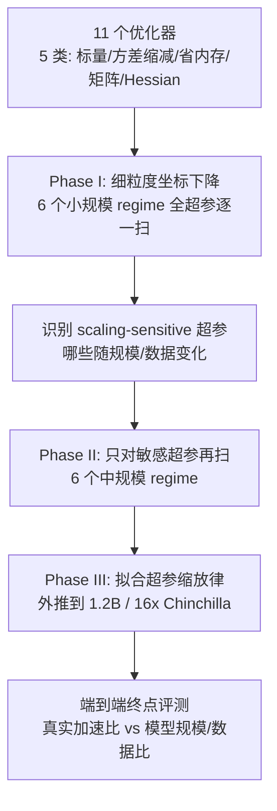

# Fantastic Pretraining Optimizers and Where to Find Them

**会议**: ICLR 2026  
**OpenReview**: [https://openreview.net/forum?id=2J51qUZ0iG](https://openreview.net/forum?id=2J51qUZ0iG)  
**代码**: 待确认  
**领域**: optimization  
**关键词**: 预训练优化器, 超参数调优, AdamW, Muon, Soap, 矩阵预条件, 加速比, 缩放规律  

## 一句话总结
在统一公平的超参数调优和端到端评测协议下系统对比 11 个深度学习优化器，揭示新优化器宣称的 1.4–2× 加速大多源于"弱基线"，真实加速不超过 1.4× 且随模型规模增大衰减到 1.1×；同时确认矩阵类优化器（Muon/Soap/Kron）确实优于标量类。

## 研究背景与动机
- **领域现状**: 预训练占大模型训练成本 95% 以上，AdamW 长期是事实标准；近两年涌现大量新优化器（Sophia、Soap、Muon、MARS、Cautious、SWAN、DION 等），纷纷宣称相比 AdamW 有 1.4–2×（甚至 3×）的加速。
- **现有痛点**: 尽管这些"加速"看起来诱人，业界主流大模型（DeepSeek、Llama）几乎没采用，只有 Kimi K2 和 GLM 4.5 用了 Muon。作者指出问题出在评测方法本身：① **超参数调优不对等**——常把 learning rate、weight decay 等共享超参固定成同一常数跨优化器使用，导致 AdamW 基线被严重欠调；② **评测设置受限或误导**——多数实验只在小模型、低数据量（1× Chinchilla）下做，且用训练中间 checkpoint 比较。
- **核心矛盾**: 一个简单的事实——仅调一个超参（peak LR）就能让 GPT-3 recipe 中的 AdamW 基线获得近 2× 加速——说明很多"新优化器 2× 加速"其实只是赢了一个被故意/无意调弱的基线，而非真实算法优势。
- **本文目标**: 建立一个严格可控的评测协议，回答两个问题：(1) 如何保证每个优化器都在其各自最优超参下被公平比较？(2) 加速比如何随模型规模和数据-模型比（Chinchilla ratio）变化？
- **核心 idea**: **公平比较需要"每个优化器各自充分调优 + 跨规模/跨数据比 + 在训练终点而非中间评测"**——在此协议下重新测量真实加速，并从结果中提炼优化器设计的真规律（矩阵预条件优于标量）。

## 方法详解

### 整体框架
本文不是提出新优化器，而是设计一套**三阶段超参数调优 + 多维度缩放评测**的基准方法学。在 Llama 2 架构（0.1B–1.2B，4 种规模）× 4 种 Chinchilla 比（1/2/4/8×）的网格上，对 11 个优化器各自做坐标下降式超参搜索，以训练终点的 C4-EN 验证损失（下游性能的已知代理）为主指标，用"达到给定损失所需 token 数"度量加速比。三阶段逐级把昂贵的全量搜索浓缩到"只调真正随规模变化的超参"，再外推到 1.2B。

### 关键设计

**1. 三阶段坐标下降调优：把"对每个优化器都调到最优"做成可负担的事。** 公平比较的核心难点是穷举调优代价爆炸。Phase I 在 6 个小规模 regime（130M/300M/500M 的 1×，以及 130M 的 2/4/8×）上对每个优化器的每个超参做"固定其余、单维扫网格"的坐标下降，仅当验证损失改善超过 $\Delta_1=3\times10^{-3}$ 才接受新值，反复迭代到收敛，得到每个 regime 的坐标局部最优。这保证了**每个优化器都在自己的最优点被比较**，而非套用别家的超参。

**2. Scaling-sensitive 超参识别：区分"需要随规模重调"与"调一次就够"。** 作者观察到两点：损失只对一部分超参敏感；敏感超参里大多数最优值跨规模稳定。形式化地，对每个 regime $r$ 定义近优集合 $C_r=\{c: L(c)\le L^*_r+\Delta_2\}$（$\Delta_2=6.4\times10^{-3}$）；若某超参 $c_h$ 存在一个公共值 $v_h$ 能落进所有 regime 的 $C_r$，则它是 scaling-insensitive，否则是 **scaling-sensitive**。结果如 AdamW 的 LR/warmup/weight decay/batch size 是敏感的，Muon 只有 LR 敏感。Phase II 只对这些敏感超参在中规模（300M/500M 的 2/4/8×）继续坐标下降，大幅省算力。

**3. 缩放律外推到 1.2B（Phase III）：避免在最贵的规模上盲调。** 把 Phase I/II 得到的敏感超参最优值随模型规模/数据比的变化拟合成缩放律，外推到 1.2B 参数、16× Chinchilla 这种前人没测过的高数据比 regime，从而能在大模型上直接用接近最优的超参，使大规模加速比的测量也是公平的。

**4. 端到端、跨 regime 的加速度量：拒绝中间 checkpoint 误导。** 加速比统一定义为"AdamW 达到某目标损失所需 token 数 ÷ 待测优化器所需 token 数"，且必须在**训练终点**（学习率衰减完成后）测量。作者展示在 LR decay 过程中不同优化器的损失曲线会多次交叉（Figure 6），用中间 checkpoint 排名会与终点排名翻转——这是很多"加速"声明的隐藏陷阱。优化器被归为 5 类（标量 AdamW/Lion、方差缩减 NAdamW/Mars/Cautious、省内存 Lion/Adam-mini、矩阵 Muon/Scion/Kron/Soap、Hessian 近似 Sophia），其中矩阵类的共性是用矩阵乘法预条件梯度，如 Muon 的 Newton-Schulz 迭代 $\mathrm{NS}(M)=M(aM+bM^\top M+c(M^\top M)^2)$ 近似 $\arg\max_{\|O\|_{op}=1}\mathrm{Tr}(O^\top M)$，更新为 $w_{t+1}=w_t-\eta\,\mathrm{NS}^{(5)}(\beta_2 m_t+(1-\beta_2)g_t)$。

## 实验关键数据

### 主实验设置

| 维度 | 配置 |
|------|------|
| 架构 | Llama 2，32 层，序列长 4096，130M/300M/520M/1.2B |
| 数据 | DCLM-baseline + StarCoder + ProofPile 2，Llama3 tokenizer，类 OLMo 2 混合 |
| 数据比 | 1×/2×/4×/8× Chinchilla（最优≈20 token/参数），外推到 16× |
| 硬件 | JAX + TPU v5（fp32 参数 / bf16 激活） |
| 主指标 | C4-EN 验证损失；附 ARC/HellaSwag/PIQA 等 10 个下游基准 |
| 优化器 | 11 个，分 5 类 |

### 关键结果

| 发现 | 数据 |
|------|------|
| AdamW 基线欠调 | 仅调 peak LR（GPT-3 recipe 6e-4 → 8e-3）即得近 2× 加速 |
| 真实加速上限 | 对充分调优的 AdamW，任何替代优化器加速 ≤ 1.4×（远低于宣称的 2×） |
| 加速随规模衰减 | Muon/Soap 在 0.1B 约 1.3–1.4×，到 1.2B 仅 ~1.1×（8× Chinchilla） |
| 超参不可盲转 | Lion 最优 weight decay ≈0.6，AdamW ≈0.1，固定共享超参不公平 |
| 矩阵 vs 标量 | 标量类充分调优后彼此接近（平均加速 <1.2×）；矩阵类一致 ~1.3×（<520M） |
| 最优优化器随数据比漂移 | Muon 在低 Chinchilla 比最优，但 8× 及以上被 Kron/Soap 反超 |

### 关键发现
- **"2× 加速"基本是弱基线幻觉**：把基线调对后，加速空间被压缩到 ≤1.4×，且这点优势随模型变大持续蒸发。
- **矩阵预条件是真规律**：所有最快的优化器（Muon、Soap、Kron）都用矩阵而非逐元素标量做预条件，且在过训练（高数据比）下三者收敛到相近损失。
- **评测时机决定结论**：训练中途比较可能给出与终点相反的排名，过往很多结论受此污染。

## 亮点与洞察
- **方法学贡献大于算法贡献**：它没造新优化器，却给整个"优化器加速"赛道立了一套可复现的公平评测标尺，直接戳破了多篇 2× 加速论文的水分。
- **"scaling-sensitive 超参"是个实用抽象**：把"哪些超参必须随规模重调、哪些一次定终身"显式化，既省算力又解释了为何盲转超参不公平。
- **加速比随规模衰减的趋势**对工业界尤其有价值——说明在真正的大模型上，换优化器的收益远小于小规模实验的暗示，解释了为何业界迟迟不采用。

## 局限与展望
- 规模上限到 1.2B，距真正前沿（数百 B）仍有差距，1.2B 处 1.1× 的趋势能否进一步衰减到 ~1× 还需验证。
- 仅在 TPU v5、较大 batch 设置下评测；并发工作 Semenov et al. (2025) 在小 batch GPU 上得到 Mars > Muon 的相反排名，说明结论对 batch size/硬件敏感，普适性有边界。
- 主指标是 C4-EN 损失（下游代理），虽追踪了下游基准，但极端高数据比下损失-下游的对应关系仍有不确定性。

## 相关工作与启发
- **优化器谱系**：从 SGD/Nesterov/Adagrad 到 Adam/AdamW，再到方差缩减（MARS）、省内存（Adam-mini）、矩阵预条件（Shampoo/Muon/Scion/Soap）、Hessian 近似（Sophia）——本文把它们统一放进一个评测框架。
- **再评测方法学传承**：延续 Schmidt et al. (2021)、Kasimbeg et al. (2025) 等"严格再评测推动社区"的传统，类似 SAM 之前对泛化度量的批判性审视。
- **启发**：任何宣称加速的优化器论文都应报告"基线调优协议 + 终点评测 + 跨规模加速衰减曲线"，否则结论不可信；矩阵预条件是当前最稳健的加速来源，值得继续在大规模上压测。

## 评分
- **新颖性**: ⭐⭐⭐⭐ — 不是新算法，而是高质量的系统性再评测，结论（弱基线幻觉、加速随规模衰减、矩阵预条件为真）有澄清整个赛道的价值。
- **实验充分度**: ⭐⭐⭐⭐⭐ — 11 优化器 × 4 规模 × 4 数据比 × 三阶段坐标下降，调优与评测协议极其严谨，是该问题迄今最完整的基准。
- **写作质量**: ⭐⭐⭐⭐ — 问题动机清晰、图表信息量大、三阶段方法层层递进，可读性强。
- **价值**: ⭐⭐⭐⭐⭐ — 直接影响工业界优化器选型决策，并为后续优化器评测设立了标准协议。

<!-- RELATED:START -->

## 相关论文

- [\[NeurIPS 2025\] Fantastic Features and Where to Find Them: A Probing Method to Combine Features from Multiple Foundation Models](../../NeurIPS2025/optimization/fantastic_features_and_where_to_find_them_a_probing_method_to_combine_features_f.md)
- [\[ICLR 2026\] A Convergence Analysis of Adaptive Optimizers under Floating-Point Quantization](a_convergence_analysis_of_adaptive_optimizers_under_floating-point_quantization.md)
- [\[ICLR 2026\] Towards Dynamic Interleaving Optimizers](towards_dynamic_interleaving_optimizers.md)
- [\[ICLR 2026\] Cautious Optimizers: Improving Training with One Line of Code](cautious_optimizers_improving_training_with_one_line_of_code.md)
- [\[ICLR 2026\] $\mu$LO: Compute-Efficient Meta-Generalization of Learned Optimizers](mulo_compute-efficient_meta-generalization_of_learned_optimizers.md)

<!-- RELATED:END -->
