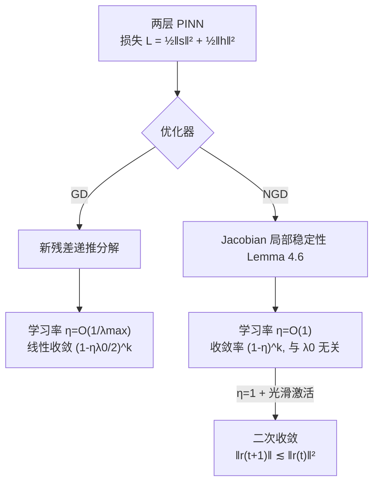

# Fast Convergence of Natural Gradient Descent for Over-parameterized Physics-Informed Neural Networks

**会议**: ICLR 2026  
**OpenReview**: [https://openreview.net/forum?id=KWWfLgkySm](https://openreview.net/forum?id=KWWfLgkySm)  
**代码**: 待确认  
**领域**: 优化理论 / 物理信息神经网络 (PINN)  
**关键词**: 自然梯度下降, 过参数化, PINN, 收敛分析, NTK, Gram 矩阵, 二阶优化  

## 一句话总结
本文为训练两层 PINN 的自然梯度下降 (NGD) 建立了首个收敛性理论，证明其学习率可取 $O(1)$、收敛速率与样本量和 Gram 矩阵最小特征值无关，并在光滑激活下达到二次收敛——比一阶梯度下降快得多。

## 研究背景与动机
**领域现状**：过参数化理论的一条主线（Du et al. 2018、Gao et al. 2023 等）借助神经正切核 (NTK) 证明了随机初始化的梯度下降 (GD) 能以线性速率收敛到全局最优，这一框架也被推广到了求解偏微分方程 (PDE) 的 PINN 训练上。

**现有痛点**：这些线性收敛结论虽然漂亮，但学习率 $\eta$ 被卡在 $O(\lambda_0)$ 量级（$\lambda_0=\lambda_{\min}(H^\infty)$ 是极限 Gram 矩阵的最小特征值），而 $\lambda_0$ 既依赖样本量又往往极小。论文给出的实测数据很说明问题：1D Poisson 方程中 $\lambda_{\min}=3.47\times10^{-11}$，意味着 GD 必须用极小的学习率才能保证收敛，训练慢得难以接受。

**核心矛盾**：PINN 的损失里含 PDE 算子带来的一阶、二阶导数项，使损失景观比普通回归问题病态得多，进一步收紧了一阶方法对学习率的限制；而二阶的 NGD 虽在 $L^2$ 回归上被证明能用 $O(1)$ 学习率并摆脱 $\lambda_0$ 依赖（Zhang et al. 2019、Cai et al. 2019），但**在 PINN 场景下 NGD 的收敛性一直是悬而未决的开放问题**——因为损失中的导数项让 Jacobian 的稳定性分析无法照搬回归的做法。

**本文目标**：在过参数化两层 PINN 上同时改进 GD 的学习率/宽度要求，并首次给出 NGD 的收敛性证明，量化它相对 GD 的加速。

**核心 idea**：**残差递推 + Jacobian 局部稳定性**——对 GD 设计新的残差分解递推公式把学习率门槛从 $O(\lambda_0)$ 抬到 $O(1/\lambda_{\max})$；对 NGD 则放弃 Zhang et al. 的"全局" Jacobian 稳定性，改用对每个权重向量逐个控制的"局部"稳定性，从而消化掉 PDE 导数项带来的扰动放大，证出与 Gram 矩阵无关的收敛速率。

## 方法详解

### 整体框架
论文围绕两层神经网络 $\phi(x;w,a)=\frac{1}{\sqrt m}\sum_{r=1}^m a_r\sigma(w_r^\top x)$ 训练 PINN：把 PDE 内部残差 $s_p(w)$ 和边界残差 $h_j(w)$ 拼成损失 $L(w)=\frac12(\|s(w)\|_2^2+\|h(w)\|_2^2)$，定义 Gram 矩阵 $H(w)=JJ^\top$。全文沿三条线递进：先对 GD 给出改进的线性收敛（Section 3），再对 NGD 给出与 Gram 矩阵无关的收敛（Section 4），最后在 $\eta=1$ 时证明光滑激活下的二次收敛。三者共享同一套"过参数化下 Gram/Jacobian 在训练全程几乎不变"的 NTK 式分析骨架，区别只在控制对象是 Gram 矩阵（GD）还是 Jacobian 矩阵（NGD）。

### 关键设计

**1. GD 的残差递推：把学习率从 $O(\lambda_0)$ 抬到 $O(1/\lambda_{\max})$**。Gao et al. (2023) 照搬 Du et al. (2018) 回归问题的证明，要求 $\eta=O(\lambda_0)$，而 $\lambda_0$ 小到 $10^{-11}$ 量级根本没法用。论文的关键观察是：PINN 损失已被样本量归一化，于是 $\|H^\infty\|_2=\lambda_{\max}(H^\infty)$ 可被 Gram 矩阵的迹 $\mathrm{tr}(H^\infty)$ 控制成一个与样本量 $n_1,n_2$ 无关的显式常数。通过一个新的残差分解递推，Theorem 3.7 证明只要 $\eta=O(1/\|H^\infty\|_2)$ 就有 $L(k)\le(1-\eta\lambda_0/2)^k L(0)$。由于 $\lambda_{\max}$ 是常数而 $\lambda_0$ 随样本量衰减，$\eta=O(1/\lambda_{\max})$ 实质上比 $O(\lambda_0)$ 大了好几个数量级（1D Poisson 上 $1/\lambda_{\max}=5.78\times10^{-5}$ vs $\lambda_0=3.47\times10^{-11}$）。同时宽度要求也从 $\tilde\Omega((n_1{+}n_2)^4/\cdots)$ 改善到近乎与 $n_1{+}n_2$ 对数无关、只显式依赖维度 $d$，靠的是用 sub-Weibull 随机变量的集中不等式替换原文复杂的高斯截断 + Hoeffding 论证。

**2. 光滑激活下 Gram 矩阵正定性的统一框架**。GD/NGD 收敛的前提都是极限 Gram 矩阵 $H^\infty$ 严格正定 ($\lambda_0>0$)。论文把这一结论从 ReLU³ 推广到一大类光滑激活：只要 $\sigma$ 满足 Assumption 4.3（三阶导有界、各阶导 Lipschitz、解析非多项式、且某种衰减比条件），Lemma 4.4 就保证只要没有两个样本平行，$H^\infty$ 严格正定。Remark 4.5 验证 logistic、softplus、tanh、swish 等常用激活都满足该假设，且这个正定性框架不局限于论文考虑的 PDE，可自然推广到其他 PDE 形式。

**3. Jacobian 的逐权重局部稳定性：NGD 收敛的技术核心**。回归问题里 Zhang et al. (2019) 用"全局" Jacobian 稳定性（$\|w-w(0)\|_2$ 小 $\Rightarrow$ $\|J(w)-J(0)\|_2$ 小）。但 PINN 损失含一阶、二阶导数，每个 Jacobian 块 $\partial s_p/\partial w_r$、$\partial h_j/\partial w_r$ 都包含激活的高阶导，权重的微小扰动会被导数放大，破坏全局 Lipschitz 条件。论文转而在 Lemma 4.6 中对**每个权重向量 $w_r$ 逐个**约束扰动：当 $\|w_r-w_r(0)\|_2<R$ 时，ReLU³ 下 $\|J(w)-J(0)\|_2\le CM\sqrt R$，光滑激活下 $\|J(w)-J(0)\|_2\le CdR$。这种更"局部"、更精细的稳定性既消化了导数项的扰动，又不像全局稳定性那样反过来给学习率加额外约束。

**4. NGD 的与 Gram 无关收敛及 $\eta=1$ 时的二次收敛**。NGD 的更新为 $w(k{+}1)=w(k)-\eta J(k)^\top(J(k)J(k)^\top)^{-1}\binom{s(k)}{h(k)}$。基于局部稳定性，Theorem 4.7 证明 $\eta\in(0,1)$ 时 $L(k)\le(1-\eta)^k L(0)$——收敛率**只取决于 $\eta$，完全独立于样本量 $n$ 和 $\lambda_0$**，这正是 NGD 比 GD 快的根源（GD 速率 $1-\eta\lambda_0/2$ 受制于极小的 $\lambda_0$）。论文还点明 NGD 与 ENGD（Müller & Zeinhofer 2023）在 Moore–Penrose 伪逆/Woodbury 恒等式下等价，且 NGD 的 $J J^\top\in\mathbb R^{(n_1+n_2)\times(n_1+n_2)}$ 在过参数化下不会奇异，而 Gauss-Newton 的 $J^\top J\in\mathbb R^{m(d+2)\times m(d+2)}$ 随 $m$ 增大趋于奇异——这是数值稳定性上的关键优势。进一步当 $\eta=1$、激活光滑时，Corollary 4.9 给出二次收敛 $\|r(t{+}1)\|_2\le\frac{CB^4}{\sqrt{m\lambda_0^3}}\|r(t)\|_2^2$，此时即便宽度 $m$ 有限也成立（而 $\eta\to1$ 会让 Theorem 4.7 的宽度要求发散变空洞）。

## 实验关键数据

### 主实验：各优化器相对 $L^2$ 误差

| 方程 | SGD | Adam | L-BFGS | NGD |
|---|---|---|---|---|
| 1D Poisson | 1.28e-01 | 6.46e-02 | 2.63e-04 | **1.67e-05** |
| 2D Poisson | 1.45e-01 | 5.32e-03 | 3.17e-03 | **1.12e-04** |
| 1D Heat | 5.43e-01 | 6.91e-03 | 4.98e-03 | **3.42e-04** |
| 2D Helmholtz | 8.48e+00 | 1.06e+00 | 3.35e+00 | **6.67e-03** |
| 10D Poisson | 1.35e-02 | 3.15e-03 | nan | **9.91e-04** |

NGD 在全部五个方程上误差最低，普遍比次优方法低 1–2 个数量级；L-BFGS 在 10D Poisson 上发散 (nan)。

### 学习率鲁棒性

| $\eta$ | 1.0 | 0.5 | 0.1 | 0.05 | 0.01 | 0.005 | 0.001 |
|---|---|---|---|---|---|---|---|
| SGD | nan | nan | nan | nan | 1.19e-02 | 6.91e-02 | 7.36e-02 |
| Adam | 1.01e+00 | 1.00e+00 | 1.00e+00 | 1.01e+00 | 1.64e-02 | 3.25e-02 | 1.49e-02 |
| NGD | 1.97e-03 | 1.18e-03 | 3.24e-04 | 1.87e-04 | 1.12e-04 | 1.22e-04 | 1.68e-04 |

NGD 在 $\eta$ 跨三个数量级时都稳定收敛，而 SGD/Adam 在大学习率下直接发散——**实证印证了 $\eta=O(1)$ 的理论结论**。

### 网络宽度研究

| $m$ | 20 | 80 | 320 | 1280 | 2560 |
|---|---|---|---|---|---|
| NGD 误差 | 1.59e-03 | 5.18e-04 | 3.08e-04 | 1.78e-04 | **7.05e-05** |

误差随宽度单调下降，验证过参数化越充分逼近能力越强。

### 关键发现
- **收敛速度**：SGD/Adam 跑 10000/20000 epoch (lr=1e-3)，NGD 只需 100/200 epoch (lr=0.1) 就更优，与 Theorem 3.7/4.7 一致；
- NGD 对超参选择高度鲁棒，回避了一阶方法调学习率的痛点。

## 亮点与洞察
- **填补理论空白**：首次证明 NGD 在训练 PINN 时收敛，且收敛率与 Gram 矩阵 $\lambda_0$ 和样本量解耦，光滑激活下达到二次收敛。
- **"归一化"这一观察很关键**：正是 PINN 损失被样本量归一化，才让 $\lambda_{\max}$ 退化为与 $n$ 无关的常数，使 $\eta=O(1/\lambda_{\max})$ 的改进成立——一个容易被忽视却起决定作用的细节。
- **局部 vs 全局稳定性**：把 Jacobian 稳定性从全局改造成逐权重的局部版本，是绕开 PDE 导数项扰动放大的技术钥匙，对后续二阶 PINN 优化分析有方法论价值。
- **数值稳定性论证**：清晰指出 NGD 的 $JJ^\top$ 不奇异而 Gauss-Newton 的 $J^\top J$ 在过参数化下趋于奇异，从实践可扩展性角度解释了为何选 NGD 形式。

## 局限与展望
- **仅限两层网络**：分析框架建立在两层（单隐层）PINN 上，深层网络的 NGD 收敛仍待探索。
- **宽度对维度 $d$ 依赖变差**：因损失含导数项，宽度要求对 $d$ 的依赖比回归问题更重，高维 PDE 下过参数化代价较高。
- **$\eta\to1$ 的张力**：Theorem 4.7 在 $\eta$ 趋近 1 时宽度要求发散变空洞，二次收敛需单独的 Corollary 处理，二者衔接不完全平滑。
- **PDE 类型受限**：聚焦特定形式的对流-扩散型 PDE（含 Poisson/Heat/Helmholtz 实验），更一般非线性 PDE 的理论保证尚需推广。
- **实验规模**：实验以低维经典方程为主，缺乏大规模或工程级 PDE 的验证。

## 相关工作与启发
- **过参数化收敛理论**：Du et al. (2018, 2019)、Allen-Zhu et al. (2019)、Arora et al. (2019) 等基于 NTK (Jacot et al. 2018) 证明 GD 全局收敛；本文在 PINN 场景对 GD/NGD 做了精细化改进。
- **PINN 优化**：Gao et al. (2023) 首次分析两层 PINN 的 GD 收敛，本文直接在其基础上改进学习率与宽度。Müller & Zeinhofer (2023) 提出 energy NGD、Rathore et al. (2024) 提出 NysNewtonCG，本文补上了 NGD 在 PINN 上缺失的理论收敛保证。
- **NGD 在回归上的理论**：Zhang et al. (2019)（ReLU）与 Cai et al. (2019)（光滑激活，GGN）证明回归问题 NGD 的 $O(1)$ 学习率；本文把这一结论艰难地从回归推广到含导数项的 PINN。
- **启发**：二阶/自然梯度方法在病态损失景观（如含微分算子的科学计算问题）上的优势，可能远未被充分挖掘；"损失归一化—谱半径常数化—学习率放宽"这条逻辑链对其他结构化损失的优化分析也有借鉴意义。

## 评分
- **新颖性**: ⭐⭐⭐⭐⭐ 首次建立 PINN 场景下 NGD 的收敛理论，解决了一个公开问题，局部 Jacobian 稳定性的技术思路有原创性。
- **实验充分度**: ⭐⭐⭐ 五个经典 PDE + 学习率/宽度消融，结论与理论吻合，但方程规模偏小、缺乏工程级验证。
- **写作质量**: ⭐⭐⭐⭐ 理论推导严谨、与前人结果对比清晰（大量 Remark 量化改进），但作为理论文阅读门槛较高。
- **价值**: ⭐⭐⭐⭐ 为科学计算中的二阶优化提供坚实理论支撑，对 PINN 训练加速有指导意义，理论贡献大于即时工程影响。

<!-- RELATED:START -->

## 相关论文

- [\[ICLR 2026\] On the Convergence Direction of Gradient Descent](on_the_convergence_direction_of_gradient_descent.md)
- [\[ICLR 2026\] Fast Data Mixture Optimization via Gradient Descent](fast_data_mixture_optimization_via_gradient_descent.md)
- [\[ICLR 2026\] Directional Convergence, Benign Overfitting of Gradient Descent in leaky ReLU two-layer Neural Networks](directional_convergence_benign_overfitting_of_gradient_descent_in_leaky_relu_two.md)
- [\[ICML 2026\] On the Convergence Rate of LoRA Gradient Descent](../../ICML2026/optimization/on_the_convergence_rate_of_lora_gradient_descent.md)
- [\[ICLR 2026\] On the Convergence Behavior of Preconditioned Gradient Descent Toward the Rich Learning Regime](on_the_convergence_behavior_of_preconditioned_gradient_descent_toward_the_rich_l.md)

<!-- RELATED:END -->
