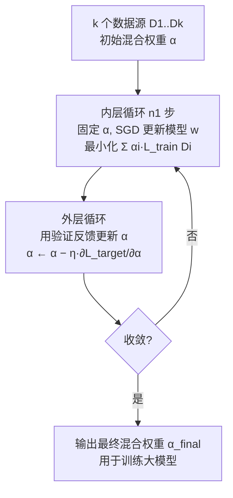

# Fast Data Mixture Optimization via Gradient Descent

**会议**: ICLR 2026  
**OpenReview**: [https://openreview.net/forum?id=5gFKVyohGd](https://openreview.net/forum?id=5gFKVyohGd)  
**代码**: 待确认  
**领域**: 数据混合优化 / LLM 预训练与后训练 / 双层优化  
**关键词**: 数据混合, 双层优化, 重参数化, 梯度优化, 代理模型, 数据中心  

## 一句话总结
FASTMIX 把"选数据混合比例"重参数化成"给各数据源的 loss 加权重"，从而让混合比例变得可微，只训练**一个**代理模型、用梯度下降同时优化模型和混合比例，把搜索成本从几百 GPU-hour 降到 1～2 GPU-hour 而性能反超。

## 研究背景与动机
**领域现状**：大模型的能力高度依赖训练数据，而"从多个数据源里按什么比例混合"对预训练和后训练（SFT）效果影响巨大。早期靠人工试错（manual heuristics），近年转向自动化的代理（proxy）方法：先用小模型在候选混合比例下试训，再据此推断大模型的最优比例。

**现有痛点**：主流代理方法虽然稳定泛化好，但代价高得离谱——DoReMi 训一个小代理调权重；RegMix 要训**几百个**（论文里用 512 个）不同比例的代理模型再拟合回归外推；CLIMB 用迭代缩小搜索区域把代理数降到 64 个。即便如此，预训练搜索仍要 70～720 GPU-hour，后训练更要 115+ GPU-hour，随模型/数据规模膨胀几乎不可用。

**核心矛盾**：混合比例 $\alpha$ 本质是**采样概率**，是非可微的离散量，没法像模型参数那样直接反向传播。于是大家只能退而求其次用贪心启发式或 policy-gradient（打分函数）估计来更新 $\alpha$，样本效率低、数据源一多就scale 不动，搜索成了整条管线的计算瓶颈。

**本文目标**：在保留代理方法可靠性的前提下，把搜索成本砍到接近"训一个模型"的量级。

**核心 idea（重参数化使混合比例可微）**：作者证明——在"对每个数据源均匀采样"的前提下，**按比例 $\alpha$ 采样训练**在期望意义上**等价于**对每个源的 loss 乘上系数 $\alpha_i$ 后求和。这样 $\alpha$ 就从离散采样概率变成了连续的、可微的 loss 权重，可以和模型参数一起被 SGD/Adam 端到端联合优化。

## 方法详解

### 整体框架
FASTMIX 把数据混合选择写成一个**加权双层优化（weighted bilevel optimization）**：内层在当前混合比例下更新模型参数，外层用验证集反馈更新混合比例。整套流程只训练一个代理模型，交替执行内外两层循环，外层把权重质量重新分配给"对验证集最有帮助"的数据源。

### 关键设计

**1. 重参数化：把采样比例变成可微的 loss 权重——这是全文的支点。** 原始双层问题（式 1）里，内层 $w^*(\alpha)=\arg\min_w L_{train}(D,w\mid\alpha)$ 依赖按 $\alpha$ 采样，$\alpha$ 不可微。作者给出等价改写（式 2）：$w^*(\alpha)=\arg\min_w \sum_{i=1}^k \alpha_i L_{train}(D_i,w)$，其中每个源都以 $1/k$ 均匀采样，$\alpha_i$ 只是该源 loss 的系数。等价性证明很直接：按 $\alpha$ 混合采样时的期望训练损失 $L_{train}(D,w\mid\alpha)=\mathbb{E}_{i\sim\text{Cat}(\alpha)}\mathbb{E}_{x\sim D_i}[\ell(x,w)]=\sum_i \alpha_i L_{train}(D_i,w)$，正是各源损失的凸组合。于是"调采样概率"被翻译成"调 loss 权重"，$\alpha$ 立刻可微，标准优化器即可联合更新 $w$ 和 $\alpha$。

**2. 交替迭代优化与 $n_2=1$ 的闭式外层梯度——让外层更新既快又稳。** 直接解双层问题仍困难，作者用 Alg.1 交替：内层固定 $\alpha$ 跑 $n_1$ 步 SGD 更新 $w$；外层每隔一段用验证损失更新 $\alpha$：$\alpha^{t+1}\leftarrow\alpha^t-\eta_\alpha^t\,\partial L_{target}(w^{t+n_2})/\partial\alpha^t$。关键洞察是：当外层步长 $n_2=1$ 时，外层梯度有**闭式解**，$\frac{\partial L_{target}(w^{t+1})}{\partial\alpha_i^t}=-\eta_w^t\,\nabla_w\ell_{val}(V,w^{t+1})\cdot\nabla_w L_{train}(D_i,w^t)$。它的物理含义非常漂亮：$\alpha_i$ 的梯度正比于**验证集梯度与第 $i$ 源训练梯度的对齐程度（点积）**——两者方向一致（点积为正）就上调该源权重，相反就下调，近正交则几乎不动。这等于自动把质量挪向"训练信号最能降低验证损失"的数据源。一旦 $n_2>1$，闭式解不存在，得靠 BPTT（显存爆炸）或有限差分（慢且不稳），所以作者**尽量固定 $n_2=1$**；消融也证实 $n_2=1$ 性能最高（48.1），$n_2=40$ 掉到 44.2。

**3. 熵正则 + 训练损失辅助目标——防止过拟合验证集、提升泛化。** 只盯验证性能容易过拟合验证集的偶然特性。作者把搜索目标设计为 $L_{target}(w)=\ell_{val}(w)+\beta\,L_{train}(w)+\lambda\sum_{i=1}^k\alpha_i\log\alpha_i$。其中熵项 $\sum\alpha_i\log\alpha_i$ 惩罚过度尖峰的分布，鼓励混合权重更均匀、多用几个源以增强鲁棒（$\lambda$ 取很小如 $10^{-5}$，太大如 1.0 会让搜索不收敛）；训练损失项 $\beta L_{train}$ 衡量模型对整体混合的拟合，与验证信号互补，减少对小验证集的过度依赖（$\beta$ 取中等如 0.1～0.3 最佳）。两者合力让搜出来的混合不仅在验证 benchmark 强，还能稳健迁移到域外任务。

**4. 非可微情形的处理——让框架落地到离散指标和长 horizon。** 当验证指标是离散的（如 accuracy）不可微时，有限差分慢且数值不稳，作者改用**可微代理目标**（如 QA 任务用 SFT loss 作平滑替代，但与离散指标对齐）；当外层 horizon $n_2>1$ 不可避免时，与其用 BPTT 或有限差分，不如尽量回退到 $n_2=1$ 以拿到闭式梯度和最稳定的优化行为。这两条工程取舍保证了方法在预训练/后训练的真实设置里都能用。

## 实验关键数据

### 主实验表格

预训练（Pile 17 子集，1M 代理模型搜索→1B 模型在 25B token 上训，14 个下游 benchmark 平均分）：

| 方法 | 平均分 ↑ | 平均排名 | 搜索成本 (GPU-h) ↓ | 代理模型数 |
|------|---------|---------|-------------------|-----------|
| DoReMi | — | — | 7.4 | 1 |
| RegMix | 47.2 | — | 720.5 | 512 |
| CLIMB | 47.5 | — | 71.9 | 64 |
| **FASTMIX (ours)** | **48.2** | **1** | **1.3** | **1** |

后训练 SFT（Qwen2.5-Math 7B，8 个 SFT 域，math/code/STEM 四 benchmark 平均）：

| 方法 | 平均分 ↑ | 搜索成本 (GPU-h) ↓ |
|------|---------|-------------------|
| DoReMi | — | 6.7 |
| RegMix | — | 115.9 |
| CLIMB | 59.9 | 117.4 |
| **FASTMIX (ours)** | **65.4 (+5.5)** | **2.2** |

预训练相比 RegMix 提速 **×550**、相比 CLIMB **×55**；后训练相比 RegMix/CLIMB 提速约 **×52**，且分数还领先。

### 消融实验表格

| 消融项 | 设置 | 结果 |
|--------|------|------|
| 内层 $n_1$ | 1 → 20 → 40+ | 47.3 → 峰值 48.2 → 超过 40 后下降 |
| 外层 $n_2$ | 1 / 10 / 20 / 40 | 48.1（$n_2{=}1$ 最佳）→ 44.2（$n_2{=}40$） |
| 熵系数 $\lambda$ | $10^{-7}$～0.1 / 1.0 | $<10^{-5}$ 稳健；1.0 不收敛 |
| 辅助损失 $\beta$ | 0.001～0.6 | 0.1～0.3 最佳 |
| 随机初始化 | 11 次 (E0–E10) | 均值 48.34，标准差仅 0.48（RegMix 45.44） |

### 关键发现
- 预训练 14 个 benchmark 中 **9 个最优**，平均排名 1，证明泛化稳定。
- 后训练只用数学 benchmark（GSM8K + gaokao2023en）作搜索信号，结果在 **coding（LiveCodeBench）和 STEM-QA（GPQA-Diamond）上也全部最优**——说明搜到的混合是"根本能力提升"而非过拟合优化信号。
- 11 次随机初始化标准差仅 0.48，证明梯度搜索对起点几乎不敏感，鲁棒性强。

## 亮点与洞察
- **一个等价证明撬动整个问题**：把"非可微采样比例"重写成"可微 loss 权重"，看似简单的期望恒等式直接把数据混合从黑盒搜索变成可端到端梯度优化的问题，这是方法漂亮的根。
- **闭式外层梯度的几何直觉极强**：$\alpha_i$ 的更新方向就是"验证梯度 × 源训练梯度"的对齐度，等价于自动做了一次数据源级别的"影响力打分"，且无需额外训练。
- **效率提升不是渐进而是数量级**：从训几百个代理 → 训一个代理，×55～×550 的加速让数据混合优化第一次在大模型规模下"可负担"。
- **泛化性是意外之喜**：math-only 信号搜出的混合迁移到 code/STEM，说明该框架找的是数据的内在价值而非 benchmark 的捷径。

## 局限与展望
- **强依赖 $n_2=1$**：闭式梯度只在单步外层成立，多步 horizon 仍是 BPTT/有限差分的老大难，长依赖的数据动态效应可能被忽略。
- **后训练代理模型偏大**：SFT 阶段没有 10M 级小代理，只能用 1.5B 代理搜、7B 评，代理与目标模型间的 scale gap 可能影响最优性，且也限制了 baseline（RegMix/CLIMB 被迫减到 64 代理）的公平性。
- **均匀采样假设**：等价性建立在"每源以 $1/k$ 均匀采样"上，当源极度不平衡或源内分布漂移时，loss 权重与真实采样比例的等价可能打折。
- **离散指标仍需代理目标**：accuracy 等不可微指标要换成 SFT loss 这类平滑替代，替代与真实指标的偏差未充分量化。
- 展望：把闭式梯度扩展到稳定的多步外层、在线动态混合，以及更大模型/更多源上的验证。

## 相关工作与启发
- **代理方法**：DoReMi（小代理调域权重）、RegMix（数百代理拟合回归外推）、CLIMB（聚类 + 迭代缩小搜索区域）——FASTMIX 与它们同属代理范式但把代理数压到 1。
- **动态方法**：IDEAL（用影响函数估计域贡献并在线再平衡）、Aioli、在线 data mixing——它们去掉独立搜索阶段但通常不如代理方法稳，FASTMIX 试图兼得稳定与高效。
- **双层优化 / 超参优化**：Maclaurin、Franceschi、Pedregosa、DARTS（Liu et al. 2018）等可微双层优化思想是其方法论根基。
- **启发**：把"离散选择问题重参数化成连续可微目标"是一条通用且强大的范式，可迁移到数据筛选、课程学习、域权重、甚至 RLHF 数据配比等更多数据中心场景。

## 评分
- **新颖性**: ⭐⭐⭐⭐ 重参数化等价证明 + 闭式外层梯度组合干净有力，把数据混合从黑盒搜索变成可微优化，思想原创性强（虽然单点改写而非颠覆性新框架）。
- **实验充分度**: ⭐⭐⭐⭐ 覆盖预训练 + 后训练两阶段、14 个下游 benchmark、4 项消融 + 11 次随机初始化，效率与性能对比扎实；略欠更大模型规模与多步 $n_2$ 的深入验证。
- **写作质量**: ⭐⭐⭐⭐ 动机—重参数化—算法—梯度直觉层层递进，等价证明与闭式梯度推导清晰，图表直观。
- **价值**: ⭐⭐⭐⭐⭐ 把数据混合搜索成本降一两个数量级且性能反超，对大模型预训练/后训练的数据配比工程有直接、可观的实用价值。

<!-- RELATED:START -->

## 相关论文

- [\[ICLR 2026\] Fast Convergence of Natural Gradient Descent for Over-parameterized Physics-Informed Neural Networks](fast_convergence_of_natural_gradient_descent_for_over-parameterized_physics-info.md)
- [\[ICLR 2026\] On the Convergence Direction of Gradient Descent](on_the_convergence_direction_of_gradient_descent.md)
- [\[ICLR 2026\] Corner Gradient Descent](corner_gradient_descent.md)
- [\[ICLR 2026\] Egalitarian Gradient Descent: A Simple Approach to Accelerated Grokking](egalitarian_gradient_descent_a_simple_approach_to_accelerated_grokking.md)
- [\[ICLR 2026\] On the Convergence Behavior of Preconditioned Gradient Descent Toward the Rich Learning Regime](on_the_convergence_behavior_of_preconditioned_gradient_descent_toward_the_rich_l.md)

<!-- RELATED:END -->
