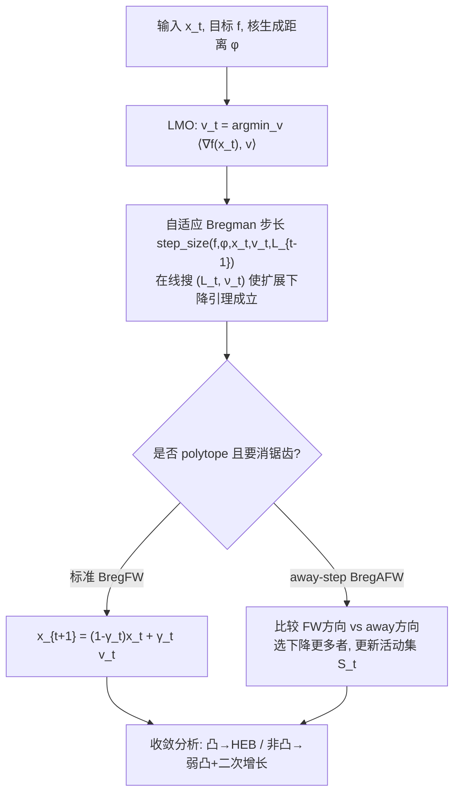

# Fast Frank–Wolfe Algorithms with Adaptive Bregman Step-Size for Weakly Convex Functions

**会议**: ICLR 2026  
**OpenReview**: [https://openreview.net/forum?id=9asuGOncOi](https://openreview.net/forum?id=9asuGOncOi)  
**代码**: 基于 [FrankWolfe.jl](https://github.com/ZIB-IOL/FrankWolfe.jl)（评估代码随附 supplementary）  
**领域**: optimization  
**关键词**: Frank–Wolfe, 条件梯度法, Bregman 距离, 相对光滑(L-smad), 弱凸优化, 自适应步长, 线性收敛  

## 一句话总结
把 Frank–Wolfe 算法从"梯度 Lipschitz + 凸"的经典假设里解放出来——只要目标函数对某个核生成距离满足"相对光滑(L-smad)"且弱凸，本文用自适应 Bregman 步长就能在凸/非凸下给出从次线性到线性的收敛保证，并首次为一类非凸问题证明了 FW 的局部线性收敛。

## 研究背景与动机
**领域现状**：Frank–Wolfe（FW，又称条件梯度法）是一类"免投影"一阶方法——它不需要投影 oracle，只需一个线性最小化 oracle（LMO），在很多约束集（如多胞形、谱面体）上 LMO 远比投影便宜，因此实践中常比投影梯度法更快、且因仿射不变性而数值稳健。为了加速，社区在两条线上改进经典 FW：一是精炼步长规则（short-step 用 Lipschitz 常数 $L$，Pedregosa 等提出自适应估计 $L$）；二是消除逼近最优面时的"锯齿"震荡（Wolfe 的 away-step FW，Lacoste-Julien & Jaggi 证明其线性收敛）。

**现有痛点**：几乎所有 FW 收敛率都建立在两条强假设上——梯度 $\nabla f$ 全局 Lipschitz 连续（$L$-smooth），以及 $f$ 凸。但很多重要应用根本不满足：$\ell_p$ 损失（$1<p<2$ 时 $f$ 只 $C^1$ 不 $C^2$，梯度在紧集上也不 Lipschitz）、相位恢复、非负矩阵分解、盲反卷积等，要么不是 $C^2$、要么强行套用 $L$-smooth 得到的 $L$ 过于保守拖慢性能。对非凸 $f$，过去只有次线性结果，简单沿用现有分析无法突破次线性。

**核心矛盾**：FW 的理论框架被"欧氏几何 + Lipschitz 梯度 + 凸"锁死，而真实问题的几何由 Bregman 距离刻画、且常常弱凸甚至非凸——经典理论与实际可用性之间存在鸿沟。

**本文目标**：能否在放松 $L$-smooth 和凸性这两条假设的同时，仍然拿到 FW 的线性收敛保证？

**核心 idea**：**用 Bregman 距离替换欧氏距离，把假设从 $L$-smooth 换成更宽的 $L$-smooth adaptable（L-smad，相对光滑）**——即存在核生成距离 $\phi$ 使 $L\phi-f$ 和 $L\phi+f$ 都凸；同时把凸性放宽到弱凸（$f+\tfrac{\rho}{2}\|\cdot\|^2$ 凸）。难点在于 Bregman 距离不再有 $\nu=1$ 这种漂亮性质，需要引入并在线估计"缩放指数 $1+\nu$"。

## 方法详解

### 整体框架
本文不改 FW 的骨架（求 LMO 顶点 → 朝顶点凸组合移动），而是替换两个部件：用 **Bregman 距离 $D_\phi(x,y)=\phi(x)-\phi(y)-\langle\nabla\phi(y),x-y\rangle$** 度量几何，用 **自适应 Bregman 步长策略** 在线搜索未知的 $(L,\nu)$。在此之上给出两个算法——标准 Bregman FW（BregFW）和 Bregman away-step FW（BregAFW）——并在凸（HEB 条件）与非凸（弱凸 + 局部二次增长）两套假设下完成全谱收敛分析。

### 关键设计

**1. L-smad 替换 L-smooth：把"梯度 Lipschitz"换成"相对于 $\phi$ 的光滑"。** 经典 FW 依赖下降引理 $f(x)-f(x^+)\ge\gamma\langle\nabla f(x),x-v\rangle-\tfrac{L\gamma^2}{2}\|v-x\|^2$，本质要 $\nabla f$ Lipschitz。本文改用 L-smad 的扩展下降引理：当 $(f,\phi)$ 是 L-smad 时有 $f(x)-f(x^+)\ge\gamma\langle\nabla f(x),x-v\rangle-L\gamma^{1+\nu}D_\phi(v,x)$，其中 $x^+=(1-\gamma)x+\gamma v$。这里关键的结构差异是 Bregman 距离满足 $D_\phi((1-\gamma)x+\gamma y,x)\le\gamma^{1+\nu}D_\phi(y,x)$，**指数 $1+\nu$ 在一般 Bregman 距离下不能像欧氏那样退化为 2**（欧氏对应 $\nu=1$、$\phi=\tfrac12\|\cdot\|^2$）。$-\log x$、$\tfrac14 x^4$ 这类既非 $L$-smooth 也可能非 $C^2$ 的函数，只要选对 $\phi$ 就落入 L-smad 类，从而被纳入 FW 的可分析范围。

**2. Bregman short / 自适应步长：对未知 $L,\nu$ 的在线回溯搜索。** 对扩展下降引理右端关于 $\gamma$ 求最大，得到 Bregman short 步长 $\gamma=\min\big\{\big(\tfrac{\langle\nabla f(x),x-v\rangle}{L(1+\nu)D_\phi(v,x)}\big)^{1/\nu},\gamma_{\max}\big\}$，但它需要知道 $L$。由于 $L$ 的精确值/紧上界往往未知，且低估会发散、高估会变慢，本文把 Pedregosa 等的欧氏自适应思想推广到 Bregman：`step_size` 过程从 $M=\eta\tilde L$、$\kappa=1$ 起，反复计算试探步长并检查 $D_f(x^+,x)\le M\gamma^{1+\kappa}D_\phi(v,x)$，不满足就 $M\leftarrow\tau M,\ \kappa\leftarrow\beta\kappa$ 收缩，直到通过为止——它同时搜 $L$ 和 $\nu$，且因 L-smad 性质保证一定终止。理论上（Thm 3.3）总评估次数 $n_t$ 几乎线性于 $t$，沿用 $\eta=0.9,\tau=2$ 时渐近不超过 16% 的迭代需要多于一次线搜，开销可控。它是"即插即用"的：插进 Algorithm 1 的两行之间即可，$\phi=\tfrac12\|\cdot\|^2$ 时正好退化回欧氏自适应步长。

**3. Bregman away-step FW：用 Bregman 几何消除锯齿。** 当约束 $P$ 是多胞形时，标准 FW 逼近最优面会锯齿震荡。Algorithm 3 维护活动集 $S_t\subset\mathrm{Vert}\,P$，每步同时算 FW 顶点 $v^{FW}_t=\arg\min_v\langle\nabla f(x_t),v\rangle$ 和 away 顶点 $v^A_t=\arg\max_{v\in S_t}\langle\nabla f(x_t),v\rangle$，比较二者哪个下降更多来决定走 FW 方向还是"远离坏顶点"方向，并相应更新凸组合系数 $\lambda$ 与活动集（含 drop step）。与已有 away-step FW 的唯一实质区别是步长更新换成了 Bregman 版（line 8 用 $D_\phi$）。它把欧氏 away-step FW 作为 $\nu=1$ 的特例包含进来。

**4. 全谱收敛分析：把率与几何参数 $(\nu,q)$ 显式挂钩。** 凸情形（Assumption HEB，参数 $q\ge1$）下：**当 HEB 指数 $q$ 恰等于 Bregman 缩放指数 $1+\nu$ 时总线性收敛**；$q>1+\nu$ 时早期（$t\le t_0$）线性、之后 $O(\epsilon^{(1+\nu-q)/(\nu q)})$，仍快于已有次线性率（Thm 4.2 标准、Thm 4.4 away-step，后者率含多胞形的金字塔宽度 $\delta$）。非凸情形假设 $f$ 弱凸 + 局部 $\mu$-二次增长（即 $q=2$ 的 HEB），在 $\rho/\mu<1$ 时给出**局部线性收敛**（Thm 5.3/5.4）。论文强调这是 FW **首次**为某类非凸问题证明线性率，技术上靠新引入的 Proposition C.8 与对弱凸类的 Lemma C.2/C.3 绕开"非凸下无法导出原始间隙不等式"的障碍；即便取欧氏距离，这一非凸线性结果也是全新的。所有率在 $\nu=1$ 时都回收到已有欧氏结论，体现"严格泛化"。

## 实验关键数据

实验环境：Julia 1.11 + FrankWolfe.jl，MacBook Pro（Apple M2 Max / 64GB）。统一参数 $\beta=\eta=0.9,\tau=2,\gamma_{\max}=1$，终止准则 FW gap $\le10^{-7}$。对比对象含 EucFW、ShortFW、OpenFW、ProjGD、MD 及其 away-step 变体。

### 主实验（收敛性对比，定性结论）

| 问题 | 设置 | 关键现象 |
|------|------|----------|
| $\ell_p$ 损失（gas sensor，$m,n=13910,128$，$p=1.1$，$\ell_2$ 球约束 $b_{\max}=130/200$） | $f$ 凸但 $C^1$ 非 $C^2$，$\nabla f$ 在紧集上不 Lipschitz | ShortFW、EucFW **不收敛**；**只有 BregFW 有理论保证**，原始间隙与 FW 间隙均最小 |
| 相位恢复（$f=\tfrac14\sum_i(|\langle a_i,x\rangle|^2-b_i)^2$，K-sparse polytope $K=2000$） | 非凸、弱凸（$\rho\ge\sum_i\|a_i\|^2|b_i|$），$\phi=\tfrac14\|x\|^4+\tfrac12\|x\|^2$ | $(m,n)=(1000,10000)$ 与 $(2000,10000)$ 两组下，自适应 Bregman 步长的间隙最小，BregFW 在 1000 步前已停 |

### 消融 / 补充实验

| 维度 | 内容 | 结论 |
|------|------|------|
| 步长策略对比 | 自适应 Bregman vs Bregman short vs 欧氏 short/open-loop | 自适应版在未知 $L,\nu$ 时既避免发散又避免过保守，间隙最小 |
| 更多任务（附录 F） | 非负线性反问题、低秩最小化、NMF | 一致地优于现有 FW 变体 |
| away-step 必要性 | OpenAFW（开环 away-step，无 drop step） | 仅作对照，缺乏收敛理论，验证 drop step 对 away-step 优良性质的重要性 |

### 关键发现
- 当经典 FW（依赖 Lipschitz 梯度）在 $\ell_p$、$p=1.1$ 上直接发散时，Bregman 版凭借匹配几何的 $\phi$ 仍稳定收敛——印证"选对核生成距离"是把不可分析问题变可分析的关键。
- 非凸相位恢复上提前停机，呼应理论上的局部线性收敛。

## 亮点与洞察
- **假设松绑是真正的贡献**：L-smad ⊃ $L$-smooth、弱凸 ⊃ 凸，且任意紧集上的 $C^2$ 函数都弱凸——这让 FW 的适用面从"漂亮的凸光滑问题"扩展到一大类实际的非凸/非光滑问题，而 $\rho$ 只用于理论、算法本身不需估计它。
- **率与几何的精确对齐**：把收敛阶显式写成 HEB 指数 $q$ 与 Bregman 缩放指数 $1+\nu$ 的函数，并指出 $q=1+\nu$ 是线性收敛的"共振点"，给出了"如何选 $\phi$ 去匹配 $f$ 的增长"的设计指南。
- **非凸 FW 线性收敛的首次结果**，即使退化到欧氏距离也是新的，填补了长期空白。
- **工程友好**：自适应步长即插即用、$\nu=1$ 严格回收欧氏经典结论，迁移成本低。

## 局限与展望
- **需估计 $\nu$**：步长依赖缩放指数 $\nu$，而 $\nu$ 由 $\phi$ 的选择决定、需在线搜索，增加了实现与调参负担；$q=1+\nu$ 的"共振"条件虽自然，但 $q>1+\nu$ 时后期只剩次线性。
- **非凸假设较强**：局部线性收敛依赖弱凸 + 局部二次增长（$q=2$ HEB），作者指出该条件来自弱凸结构，放宽恐难，只覆盖"相当受限的子类"。
- **展望**：引入 DC（凸差）优化（参考 Maskan 等 2025 把 DC 融入 FW）有望进一步放松非凸假设；以及对更一般核生成距离/约束几何（如均匀凸集）的扩展。

## 相关工作与启发
- **相对光滑(L-smad)谱系**：Bauschke–Bolte–Teboulle 的扩展下降引理、Bolte 等的 Bregman 近端梯度，是本文把 FW 搬到 Bregman 几何的理论基石；本文把这套"相对光滑"工具第一次系统地装进 FW + away-step 框架。
- **FW 加速线**：Pedregosa 等的自适应步长（欧氏）、Lacoste-Julien & Jaggi 的 away-step 线性收敛（金字塔宽度）、Kerdreux 等在 HEB/均匀凸集下的率——本文都作为 $\nu=1$ 特例被统一并泛化。
- **启发**：当一个一阶方法被"欧氏 + Lipschitz"卡住时，换 Bregman 几何 + 相对光滑往往能松绑假设并匹配问题真实几何；而"把收敛率写成几何指数的函数"这一视角，可迁移到其他投影自由/约束优化方法的分析中。

## 评分
- **新颖性**: ⭐⭐⭐⭐⭐ —— 首次为一类非凸问题证明 FW 线性收敛，且把 L-smad + 弱凸 + 自适应 Bregman 步长系统整合进 FW/away-step，假设严格更宽、结论严格泛化已有结果。
- **实验充分度**: ⭐⭐⭐ —— 覆盖 $\ell_p$、相位恢复及附录多任务，清晰展示"经典 FW 发散而 Bregman 版收敛"，但规模偏中小、以收敛曲线定性为主，缺大规模/统计显著性汇报。
- **写作质量**: ⭐⭐⭐⭐ —— 动机—假设—算法—理论—实验链条完整，Table 1 把全谱率一览无遗；但理论符号密集（$\nu,q,t_0$ 等），对非优化背景读者门槛较高。
- **价值**: ⭐⭐⭐⭐ —— 把免投影方法扩展到一大类实际非光滑/非凸问题，并给出"选 $\phi$ 匹配 $f$"的可操作指南，对约束优化与信号处理应用有实用与理论双重价值。

<!-- RELATED:START -->

## 相关论文

- [\[ICLR 2026\] Beyond Short Steps in Frank-Wolfe Algorithms](beyond_short_steps_in_frank-wolfe_algorithms.md)
- [\[ICLR 2026\] Shuffling the Data, Stretching the Step-Size: Sharper Bias in Constant Step-Size SGD](shuffling_the_data_extrapolating_the_step_sharper_bias_in_constant_step-size_sgd.md)
- [\[ICLR 2026\] High-dimensional limit theorems for SGD: Momentum and Adaptive Step-sizes](high-dimensional_limit_theorems_for_sgd_momentum_and_adaptive_step-sizes.md)
- [\[ICLR 2026\] Nesterov Finds GRAAL: Optimal and Adaptive Gradient Method for Convex Optimization](nesterov_finds_graal_optimal_and_adaptive_gradient_method_for_convex_optimizatio.md)
- [\[ICLR 2026\] Strongly Convex Sets in Riemannian Manifolds](strongly_convex_sets_in_riemannian_manifolds.md)

<!-- RELATED:END -->
