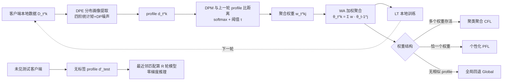

# Federated Learning with Profile Mapping under Distribution Shifts and Drifts

**会议**: ICLR 2026  
**OpenReview**: [https://openreview.net/forum?id=thoPskdIcE](https://openreview.net/forum?id=thoPskdIcE)  
**代码**: [https://github.com/dariofenoglio98/FEROMA](https://github.com/dariofenoglio98/FEROMA)  
**领域**: 联邦学习 / 分布式优化 / 数据异质性  
**关键词**: Federated Learning, Distribution Shift, Distribution Drift, Distribution Profile, Clustered FL, Personalized FL, Test-time Adaptation  

## 一句话总结
FEROMA 把"模型该和谁聚合"这件事从"客户端/簇身份"解耦到"数据分布画像"上：每个客户端提取一个轻量、差分隐私的分布 profile，用 profile 间的相似度自动决定本轮该走聚类聚合、个性化还是全局聚合，从而在客户端间分布漂移（shift）和时间漂移（drift）同时存在时都能稳健工作，且开销与 FedAvg 相当。

## 研究背景与动机
**领域现状**：联邦学习（FL）让多客户端在不共享原始数据的前提下协同训模，但真实部署里客户端数据几乎不是 IID 的，存在两类异质性——客户端之间的**分布偏移（distribution shift）**（不同客户端分布不同）和单个客户端随时间的**分布漂移（distribution drift）**（同一客户端分布随轮次演化）。

**现有痛点**：现有方法分三类各有短板。聚类 FL（CFL）能处理 shift，但通常要预先知道簇数量、聚类计算昂贵、还要为每客户端传输/维护多个模型，难以应对训练或测试期的 drift；个性化 FL（PFL）给每个客户端调一个本地模型，本地数据够多时强，但模型过度客户端特化、对没见过的新客户端泛化差，且没有冷启动/测试期的模型分配机制；测试期自适应 FL（TTA-FL）专门处理测试漂移，但依赖在线适配或额外客户端交互，部署不实用，且常忽略训练期的 shift/drift。

**核心矛盾**：这些方法大多绑定某一种特定的非 IID 类型，需要先验知识（簇数、异质性类型），且在泛化性、适应性、效率三者间难以同时兼顾——而真实 FL 部署恰恰要求三者都要。更关键的是，**训练期与测试期 drift 同时出现**这一最贴近现实的设定，此前从未被联合研究过。

**本文目标**：设计一个轻量、通用的 FL 框架，在**不依赖客户端身份、不依赖簇数/分布类型先验**的前提下，同时处理训练与测试期的 shift 和 drift。

**核心 idea**：**把模型身份从"客户端/簇"重新挂到"数据分布画像"上**。每个客户端把本地数据压缩成一个低维、稳定、差分隐私的 distribution profile，用 profile 之间的相似度来驱动聚合加权与测试期模型分配——相似的分布共享模型，不相似的自然分开，框架据此**自动在聚类/个性化/全局三种聚合策略间切换**。

## 方法详解

### 整体框架
FEROMA 每一轮做三件事：先用 **DPE（分布画像提取器）** 把每个客户端的本地数据压成一个 profile 向量 $d_t^{(k)}$；再用 **DPM（分布画像映射）** 把当前轮 profile 与上一轮所有 profile 比距离，算出聚合权重 $w_t^{(k,j)}$；最后按这些权重做**加权聚合（WA）**得到该客户端的初始模型，客户端在此基础上本地训练（LT）。测试期则对未见客户端提取一个无标签 profile，直接最近邻匹配最后一轮训练出的模型，零梯度推理。整个流程不需要簇数、不需要客户端身份、不需要测试标签。

### 关键设计

**1. 分布画像提取器（DPE）：用五条公理把数据压成隐私安全的分布指纹。** FEROMA 不直接比客户端的模型参数或梯度，而是把数据集映射成一个低维 profile $d_t^{(k)} = \phi_\psi(D_t^{(k)}) \in \mathbb{R}^d$。论文把"什么样的 profile 才好用"形式化成五条要求并都给了实现与理论界：**(R1) 分布保真**——profile 间的欧氏距离要近似底层分布的真实距离（如 2-Wasserstein），$\mathbb{E}\big[|\,\|d_{t_1}^{(k_1)}-d_{t_2}^{(k_2)}\|_2 - \Delta(P_{t_1}^{(k_1)},P_{t_2}^{(k_2)})\,\big] \le \xi$，实现里证明了与 2-Wasserstein 双 Lipschitz 等价，MNIST 上 $\xi<1.1$；**(R2) 标签无关**——必须能只用特征 $x$ 生成一个子向量 $d'^{(k)}_t = \phi_\psi(x_t^{(k)}, 0)$，这样测试期没标签也能匹配；**(R3) 受控随机性**——同一数据集每次提取是带噪随机向量，协方差有界 $\mathrm{Cov}(d|D)\preceq \rho^2 I_d$，防止跨轮精确指纹化；**(R4) 差分隐私**——满足样本级 $(\varepsilon,\delta)$-DP，可用高斯/拉普拉斯机制 $d_t^{(k)} = \bar\phi_\psi(D_t^{(k)}) + \mathcal{N}(0,\sigma^2 I_d)$ 实现，多对一映射同时遮蔽客户端身份；**(R5) 紧致**——维度 $d \ll |\theta|$（实现里 $d/|\theta|\le 3.5\times10^{-3}$），通信/计算开销相对模型可忽略。具体实现用的是"隐空间四阶统计矩 + DP 噪声"的四步提取。这五条共同保证 profile 既能可靠测分布相似度，又不泄露原始数据和身份。

**2. 训练期分布映射：用 softmax 相似度 + 阈值，让聚合权重自己长成 CFL/PFL/Global。** 提取完当前轮所有 profile 后，把它们映射到上一轮的 profile 集合上，用归一化距离定义关联权重：
$$w_t^{(k,j)} = \frac{\exp\big(-D(d_t^{(k)}, d_{t-1}^{(j)})\big)}{\sum_{j'\in A_{t-1}}\exp\big(-D(d_t^{(k)}, d_{t-1}^{(j')})\big)}$$
其中 $D(\cdot,\cdot)$ 是距离函数（如欧氏距离），$A_{t-1}$ 是上一轮活跃客户端集合。弱相似的 profile 也会拿到小权重，聚合时会引入噪声，所以再加一个阈值 $\tau$ 把过小的权重清零并重新归一：$\tilde w_t^{(k,j)} = w_t^{(k,j)}$ 若 $\ge\tau$ 否则 $0$，只在足够相似的 profile 间共享更新。聚合就是 $\theta_t^{(k)} = \sum_{j\in A_{t-1}} \bar w_t^{(k,j)}\cdot\theta_{t-1}^{(j)}$。**妙处在于聚合策略是涌现出来的而非手设的**：检查每个客户端权重的支撑集——若多个权重存活，等价于聚类 FL（聚合同分布的几个模型）；若恰好只有一个非零权重，就是继承单个最相似模型，等价于个性化 FL；若没有任何足够相似的 profile，则回退到全局平均。一个统一公式按数据自动恢复出三种经典 FL 策略，不需要任何先验。

**3. 测试期分布映射：对未见客户端做零梯度的最近邻模型分配。** 测试时来一个全新的、无标签的客户端，FEROMA 先用 (R2) 的能力提取它的无标签 profile $d'^{(k)}_{\text{test}} = \phi_\psi(x_{\text{test}}^{(k)}, 0)$，然后在最后一轮 $R$ 的所有 profile 里找最近邻 $j^* = \arg\min_{j\in A_R} D(d'^{(k)}_{\text{test}}, d'^{(j)}_R)$，直接把模型 $\theta_R^{(j^*)}$ 拿来推理。整个过程**不需要任何梯度步、不需要在线适配、不需要标签**，用的是 DP 保护过的 profile，天然推广到未见客户端。论文也坦诚：纯无标签匹配抓不住"X 相同 Y 不同"的概念漂移，但只要给一个很小的测试期带标签验证集就能无缝修正关联、大幅提升性能；且这种分布感知的初始化点还能作为下游无监督 TTA 方法的更好起点。

## 实验关键数据

### 主实验表格
6 个数据集（MNIST/FMNIST/CIFAR-10/CIFAR-100/CheXpert/Office-Home），对比 10 个 SOTA，结果是在所有 drift 频率、非 IID 类型、严重度上的无加权平均（无 cherry-pick）：

| 方法 | MNIST | FMNIST | CIFAR-10 | CIFAR-100 | CheXpert | Office-Home |
|------|-------|--------|----------|-----------|----------|-------------|
| FedAvg | 71.8±5.5 | 63.7±6.4 | 33.0±5.3 | 28.2±4.7 | 59.1±3.0 | 41.0±1.3 |
| CFL（最强基线之一） | 76.6±3.9 | 65.6±4.8 | 33.9±4.7 | 28.9±3.5 | 62.3±2.2 | 34.8±1.0 |
| FedEM | 30.7±7.0 | 46.1±7.0 | 23.0±4.8 | 31.7±3.6 | 53.3±2.2 | 15.5±2.9 |
| FedDrift | 57.0±7.7 | 47.6±7.2 | 29.2±4.9 | 20.2±3.5 | 72.3±0.8 | 42.1±2.4 |
| ATP | 72.1±10.5 | 61.1±12.1 | 28.7±5.1 | 16.7±3.8 | N/A | 40.8±4.3 |
| **FEROMA** | **90.7±1.8** | **79.9±2.8** | **44.2±3.8** | **39.9±2.5** | **72.4±0.6** | **42.4±1.4** |

FEROMA 在 MNIST/FMNIST/CIFAR-10 上比最强基线 CFL 分别高 14.1/14.3/10.3 个百分点，CIFAR-100 上比 FedEM 高 8.2 pp，且**方差普遍最低**（稳定性最好）。

### 消融实验表格
MNIST 上跨三个非 IID 严重度（低/中/高）× 三种漂移频率（20 轮里漂移 5/10/20 次），节选：

| 设定 | FedAvg | CFL | ATP | **FEROMA** |
|------|--------|-----|-----|-----------|
| 低-5/20 | 72.1±8.0 | 79.1±4.3 | 70.8±12.8 | **90.6±2.9** |
| 中-10/20 | 73.6±5.3 | 78.3±3.6 | 77.6±5.3 | **90.6±1.8** |
| 高-20/20（最难） | 68.6±6.5 | 74.5±2.9 | 70.4±8.4 | **90.8±0.8** |

基线在漂移最频繁、异质性最高时明显退化，FEROMA 几乎不掉（始终 ~90%，方差极小）。客户端规模实验：从 10 扩到 100 客户端，FEROMA 50 客户端仍 >90%、100 客户端仍 >85%，在最大规模比 CFL 高 10+ pp；训练时间与 FedAvg 相当，而多数基线随客户端数急剧变慢（FedDrift 在 50/100 客户端因计算量过大跑不动）。

### 关键发现
- **自动策略切换是稳健性来源**：FEROMA 不靠固定策略，而是逐轮按 profile 结构自动恢复聚类/个性化/全局，因此在固定策略基线退化的高异质、不稳定场景下仍能保持强性能。
- **效率来自轻量 profile**：通信开销 $d/|\theta|\le 3.5\times10^{-3}$、计算相对一个本地 epoch 可忽略，使它在大规模场景仍保持 FedAvg 级开销。
- **质性对比（Table 3）**：FEROMA 是唯一同时勾选"分布偏移 + 漂移 + 测试期适应 + 低通信 + 服务端/客户端低计算 + 可扩展"全部属性的方法。

## 亮点与洞察
- **"解耦模型与客户端身份"是一个干净的视角转换**：一旦把模型挂到分布 profile 上，CFL/PFL/Global 不再是互斥的设计选择，而是同一加权公式在不同权重稀疏度下的特例——这把三类方法统一进了一个连续谱。
- **DPE 的五公理设计很扎实**：分布保真、标签无关、受控随机、差分隐私、紧致五条同时满足，且每条都有理论界和实现，让"用 profile 代替原始数据做相似度"既隐私安全又可靠。
- **首次联合处理训练 + 测试期的 shift 和 drift**，且不需要簇数/分布类型先验、不需要测试标签、不需要在线适配，实用性强。
- **测试期一次性最近邻分配**特别契合冷启动和未见客户端，零梯度、零通信。

## 局限与展望
- **强依赖 DPE 质量**：profile 靠一个少量预训练模型把数据嵌入隐空间，若模型欠训练（任务难/数据少）或过简单/过复杂，隐空间可能不能充分反映分布，profile 退化会拖累整个映射的准确性。
- **纯无标签匹配抓不住"X 相同 Y 不同"的概念漂移**：需要额外一个小的测试期带标签验证集来修正，纯标签无关设定下有盲区。
- **未见全新分布**：FEROMA 把模型关联到训练期见过的分布，对完全没出现过的分布，最近邻匹配只能挑"最不坏"的已有模型，没有真正的外推机制。
- **展望**：把 profile 提取做得更鲁棒（不依赖单一预训练模型）、与下游无监督 TTA 更深度结合，是自然的延伸方向。

## 相关工作与启发
FEROMA 串起了 FL 处理数据异质性的三条主线并指出各自短板：**CFL**（FedRC/FedEM/FeSEM/CFL/IFCA/FedDrift）靠模型参数或训练指标聚类，但假设固定簇数、聚类昂贵、要维护多模型；**PFL**（pFedMe/APFL/FedProto 等）个性化但客户端开销大、缺冷启动/测试期分配机制；**TTA-FL**（ATP/CoLA 等）处理测试漂移但要在线适配。FEROMA 用连续分布 profile 做软关联，既避免显式聚类、又能按需达到个性化效果、还支持零更新的测试期适配，把三者的优点收进一个框架。对后续工作的启发：**用轻量分布描述子替代"参数/梯度比较"来驱动聚合**是个通用且隐私友好的范式，可迁移到联邦域适应、个性化推荐、跨机构医疗建模等同样面临 shift+drift 的场景。

## 评分
- **新颖性**: ⭐⭐⭐⭐ —— "把模型身份从客户端/簇解耦到分布 profile，让聚类/个性化/全局成为同一加权公式的特例"是干净且有解释力的视角；首次联合处理训练+测试期 shift 和 drift。
- **实验充分度**: ⭐⭐⭐⭐ —— 6 数据集（含 2 个真实世界）× 10 SOTA × 4 类非 IID × 3 严重度 × 3 漂移频率 × 客户端规模扩展，覆盖广、含开销测量，无 cherry-pick；可补充更大模型/更复杂任务下 DPE 质量的敏感性分析。
- **写作质量**: ⭐⭐⭐⭐ —— 五公理把 DPE 形式化得清晰，pipeline 图与策略涌现的解释到位，局限交代坦诚。
- **价值**: ⭐⭐⭐⭐ —— 在 FedAvg 级开销下显著提升异质动态场景的精度与稳定性，对真实 FL 部署实用性强，且范式可迁移。

<!-- RELATED:START -->

## 相关论文

- [\[CVPR 2026\] Fed-ADE: Adaptive Learning Rate for Federated Post-adaptation under Distribution Shift](../../CVPR2026/optimization/fed-ade_adaptive_learning_rate_for_federated_post-adaptation_under_distribution_.md)
- [\[NeurIPS 2025\] FLUX: Efficient Descriptor-Driven Clustered Federated Learning under Arbitrary Distribution Shifts](../../NeurIPS2025/optimization/flux_efficient_descriptor-driven_clustered_federated_learning_under_arbitrary_di.md)
- [\[ICLR 2026\] Incentives in Federated Learning with Heterogeneous Agents](incentives_in_federated_learning_with_heterogeneous_agents.md)
- [\[ICLR 2026\] DeepAFL: Deep Analytic Federated Learning](deepafl_deep_analytic_federated_learning.md)
- [\[ICLR 2026\] Unified Analyses for Hierarchical Federated Learning: Topology Selection under Data Heterogeneity](unified_analyses_for_hierarchical_federated_learning_topology_selection_under_da.md)

<!-- RELATED:END -->
