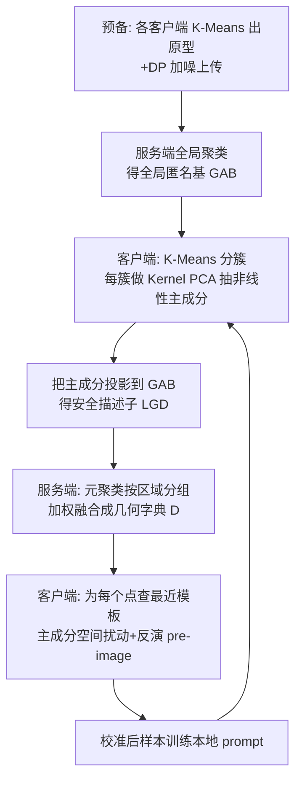

# FedMC: Federated Manifold Calibration

**会议**: ICLR 2026  
**OpenReview**: [https://openreview.net/forum?id=rxwwncarWj](https://openreview.net/forum?id=rxwwncarWj)  
**代码**: 待确认  
**领域**: 联邦学习 / 数据异构 / 流形学习  
**关键词**: Federated Learning, Data Heterogeneity, Manifold Calibration, Kernel PCA, Federated Prompt Learning  

## 一句话总结
针对联邦学习中"用全局线性几何先验（点/椭球）做校准会把样本推出流形、生成 OOD 伪样本"这一痛点，FedMC 用客户端局部 Kernel PCA 学非线性流形几何、在服务端聚合成隐私安全的"几何字典"，让客户端按数据点查表做**贴合流形的校准**，作为即插即用模块稳定提升一众 FL/FPL 方法。

## 研究背景与动机
**领域现状**：联邦学习（FL）中客户端数据 non-IID 是头号障碍。一类有前景的思路是"共享全局统计先验"指导本地训练——早期共享一阶矩（类原型/类中心），近期升级到共享二阶矩（协方差），用一个全局超椭球刻画分布"形状"并沿主成分方向做校准 $x' = x + \sum_{m=1}^{d}\epsilon_m\sqrt{\lambda_m}u_m$。

**现有痛点**：无论一阶还是二阶，这些方法都隐含一个**全局线性假设**——用单一、全局一致的简单模型（一个点或一个椭球）去概括整个复杂分布。但真实高维数据通常集中在一个低维**弯曲流形** $\mathcal{M}$ 上，而非均匀填满欧氏空间。

**核心矛盾**：在弯曲流形上，有意义的距离是沿曲面的测地距离，而 PCA 依赖欧氏距离。以 S 形流形为例，全局 PCA 会错误地把流形两端之间的欧氏"捷径"当成主成分 $u_1$——这条路径穿过没有数据的空洞。沿此方向校准，扰动向量 $d\in\mathrm{span}(U)$ 几乎必然含有把点推离流形的法向分量 $d_\perp$，**系统性地生成在真实分布下概率为零的 OOD 伪样本**，逼模型去学标签与特征之间的虚假关联。

**本文目标**：从"依赖有缺陷的全局线性模型"转向"理解并利用数据局部、非线性几何"的新范式，在严格隐私约束下实现真正贴合流形的校准。

**核心 idea**：**[局部非线性几何]** 客户端用 local Kernel PCA 抓住流形局部曲率；**[全局几何字典]** 服务端把各客户端的局部几何聚成一本"流形地图集"；**[按需查表校准]** 客户端为每个数据点动态查询字典，得到上下文相关的几何先验，确保校准发生在流形之上——整套流程在隐私受限的联邦框架内完成。

## 方法详解

### 整体框架
FedMC 作用在图像 embedding 空间（不改原图、不改冻结的 CLIP 编码器），把客户端有偏的本地 embedding 集 $D_k$ 校准成更贴合全局流形的增强集 $\hat{D}_k$，再用它训练本地 prompt。框架含一个预备阶段（构造全局匿名基 GAB）+ 两个迭代阶段：(I) 服务端联邦聚合局部几何 → 几何字典；(II) 客户端按字典做贴合流形的校准。

### 关键设计

**1. 全局匿名基 GAB：为联邦几何通信造一套"公共坐标系"。** 联邦下协同学几何的根本难题是——没有共享坐标系就没法比较不同客户端的几何，但直接共享由本地数据点定义的几何信息又会泄露隐私。FedMC 先让每个客户端 $k$ 对本地 embedding 做 K-Means 得原型 $\{c_{k,j}\}$，再加校准高斯噪声满足 $(\epsilon,\delta)$-差分隐私：$\tilde{c}_{k,j} = c_{k,j} + \mathcal{N}(0,\sigma^2 I)$，只上传匿名原型。服务端把成千上万个匿名原型汇总后再做一次全局 K-Means，取 $N_{base}$ 个最显著质心组成全局匿名基 $B_g=\{b_1,\dots,b_{N_{base}}\}$。由于 GAB 是从所有客户端混合且加噪的原型池中蒸馏出来的，任一基点都无法溯源到某个客户端的原始数据，从而提供一套隐私安全、所有人共享的几何"公共语言"。

**2. KPCA 抽局部非线性几何 + 投影到 GAB 的安全描述子。** 客户端先把本地数据 $D_k$ 用 K-Means 切成 $m$ 个簇（每簇近似一块几何一致的流形 patch）。对每簇用 RBF 核 $k(x,y)=\exp(-\gamma\lVert x-y\rVert_2^2)$ 构 Gram 矩阵、中心化后做特征分解 $\bar{K}_j\alpha_{j,i}=\lambda_{j,i}\alpha_{j,i}$，隐式定义高维特征空间 $\mathcal{H}$ 里的非线性主成分 $v_{j,i}=\sum_a (\alpha_{j,i})_a\Phi(x_a)$——它们正是描述局部流形 patch 最大方差方向的正交基。关键的隐私一招是：直接传 $\alpha_{j,i}$ 和基点 $\{x_a\}$ 会泄露数据，于是把每个主成分**投影到公共 GAB** 上得到 $N_{base}$ 维系数 $(\beta_{j,i})_s=\langle v_{j,i},\Phi(b_s)\rangle_{\mathcal{H}}=\sum_a(\alpha_{j,i})_a k(x_a,b_s)$。这一步把依赖私有数据 $\{x_a\}$ 的几何信息，转化成纯粹用公共匿名基表达的标准化坐标向量，**既解耦了隐私、又让各客户端的几何报告直接可比可聚合**。客户端最终只上传局部几何描述子 $\mathrm{LGD}_j=(\tilde{c}_j, n_j, \{(\lambda_{j,i},\beta_{j,i})\}_{i=1}^{d})$。

**3. 服务端融合成几何字典：按区域分组的加权一致。** 服务端是"策展人"，把众多 LGD 融合成一本紧凑、全局一致的几何字典——它不是简单平均，而是把流形不同区域映射到各自共识几何形状的结构化地图集。先对匿名原型 $\{\tilde{c}_j\}$ 做元聚类（meta-clustering），识别哪些 LGD 描述同一宏观区域。因为所有 $\beta_{j,i}$ 已标准化到同一 GAB 坐标系，融合就简化成稳健的加权平均：$\beta^*_{l,i}=\frac{\sum_{j\in l}n_j\lambda_{j,i}\beta_{j,i}}{\sum_{j\in l}n_j\lambda_{j,i}}$，$\lambda^*_{l,i}=\frac{\sum_{j\in l}n_j\lambda_{j,i}}{\sum_{j\in l}n_j}$。权重同时考虑样本数 $n_j$ 与局部方差 $\lambda_{j,i}$，让数据更密、几何更显著的区域贡献更大；论文还证明该加权平均是某加权最小二乘问题的最优解，为融合策略给出理论依据。最终每个宏观区域装配成字典条目 $\mathrm{Entry}_l=(g_l,\{(\lambda^*_{l,i},\beta^*_{l,i})\}_{i=1}^{d})$ 下发给所有客户端。

**4. 客户端贴合流形的校准：地图导航式的查表-扰动-反演。** 拿到几何字典后，校准像"看地图导航"：对本地点 $x$ 先做动态几何查询，找最近宏观原型 $l^*=\arg\min_l\lVert x-g_l\rVert_2^2$ 锁定最相关模板（这里欧氏距离只用来高效定位，不用来定义流形内蕴形状，局部尺度上它是测地距离的合理代理）。随后在检索到的主成分张成的子空间（近似局部切空间）里三步走：用核技巧算投影 $p_i=\langle\Phi(x),v^*_{l^*,i}\rangle_{\mathcal{H}}=\sum_s(\beta^*_{l^*,i})_s k(x,b_s)$；在主成分空间扰动 $p'_i=p_i+\epsilon_i\sqrt{\lambda^*_{l^*,i}}$，$\epsilon_i\sim\mathcal{N}(0,1)$；重构高维特征 $\Phi(x)'\approx\sum_i p'_i v^*_{l^*,i}$。由于 $\Phi(x)'$ 在高维特征空间无法直接用，需解 pre-image 反演问题 $x'=\arg\min_z\lVert\Phi(z)-\Phi(x)'\rVert_{\mathcal{H}}^2$，预计算目标内积 $T_s$ 后用梯度下降最小化 $\mathcal{L}(x')=\sum_s (k(x',b_s)-T_s)^2$。因为扰动发生在 KPCA 近似的局部切空间内，更新方向贴着流形内蕴几何走，避免了全局线性方法那种系统性的 OOD 样本；校准后 $(x',y)$ 用于训练本地 prompt。

## 实验关键数据

### 主实验表格

Label Skew（CIFAR-100 / Tiny-ImageNet，CLIP ViT-B/16，准确率 %）：

| 方法 | CIFAR-100 β=0.5 | β=0.3 | β=0.1 | Tiny-ImageNet β=0.5 | β=0.3 | β=0.1 |
|------|------|------|------|------|------|------|
| FedVTP (Base) | 84.90 | 84.26 | 81.01 | 80.97 | 80.26 | 77.58 |
| GGEUR (FedVTP, 线性基线) | 85.21 | 84.55 | 82.55 | 81.15 | 80.35 | 78.02 |
| **FedMC (FedVTP)** | **86.72** | **85.90** | **85.08** | **81.53** | **80.85** | **80.12** |

Domain Skew（部分，β=0.1）：

| 方法 | Office-31 | Office-Home | DomainNet |
|------|------|------|------|
| FedVTP (Base) | 94.58 | 88.92 | 83.82 |
| GGEUR (FedVTP) | 94.71 | 89.15 | 83.85 |
| **FedMC (FedVTP)** | **96.12** | **91.03** | **85.93** |

### 消融实验表格

FedMC 作为通用 FL 增强模块（Office-Home-LDS，β=0.1，准确率 %）：

| FL 算法 | Base | +GGEUR | +FedMC |
|------|------|------|------|
| FedAvg | 70.14 | 83.99 | **85.11** |
| SCAFFOLD | 74.82 | 83.96 | **85.25** |
| MOON | 76.83 | 78.08 | **80.73** |
| FedDyn | 65.99 | 84.09 | **86.32** |
| FedOPT | 65.59 | 84.20 | **86.58** |
| FedNTD | 75.46 | 82.46 | **84.91** |
| FedProto | 69.40 | 83.35 | **85.92** |

### 关键发现
- **越异构越赢**：β 从 0.5 降到 0.1 时所有方法都掉点，但 FedMC 掉得最少，与基线差距随之拉大——在 Tiny-ImageNet β=0.1 上比 FedVTP 高 1.74%，在 CIFAR-100 β=0.1 上比线性基线 GGEUR 高 2.53%，直接验证"建模非线性流形 > 全局线性近似"。
- **domain skew 优势更大**：DomainNet β=0.1 上领先 GGEUR 2.05%——原型平均/线性假设在不同客户端流形（照片 vs 素描）下失效，而几何字典能学到 domain-specific 的几何签名。
- **超越一阶统计共享**：相比已用原型（一阶矩）缓解异构的强基线 FedProto，FedMC 仍带来显著额外增益，说明只共享"数据位置"不够，捕捉刻画"形状"的高阶几何才提供更根本的校准信号。

## 亮点与洞察
- **问题诊断到位**：把"几何感知 FL 校准失败"精准归因到隐含的全局线性假设——用 S 形流形+欧氏捷径的图示，把"为什么会生成 OOD 伪样本"讲得直观又有理论支撑（法向分量 $d_\perp$）。
- **隐私与几何聚合的巧妙耦合**：GAB + 投影系数 $\beta$ 同时解决了"如何匿名共享几何"和"如何让各家几何可聚合"两个问题——把私有数据相关的主成分变成公共坐标系下的标准向量，是全文最漂亮的一步。
- **即插即用**：作为校准模块嫁接到 FPL（FedVTP）和 7 个经典 FL 算法上都稳定涨点，通用性强。

## 局限与展望
- **计算开销**：每个数据点都要做 KPCA + pre-image 迭代反演（核技巧+梯度下降），客户端计算成本随本地数据量上升，论文把可扩展性实验放到附录，实际大规模部署的开销值得关注。
- **超参敏感性**：RBF 核带宽 $\gamma$、簇数 $m$、基大小 $N_{base}$、保留主成分数 $d$ 等共同决定"局部尺度"的刻画，缺乏自适应选择机制。
- **验证范围**：主战场是 FPL（基于冻结 CLIP 的图像 embedding 空间），在从零训练的视觉模型 / 更大模型上是否同样有效仍待验证；DP 噪声强度与几何保真度之间的权衡也未深入分析。

## 相关工作与启发
- **几何感知 FL**：GGEUR / Ma et al. 用全局协方差超椭球做校准是直接对标的线性基线，FedMC 是它的非线性升级。
- **联邦原型方法**：FedProto 等共享一阶矩（类原型）是更早的"位置先验"，FedMC 论证了"形状先验"的必要性。
- **联邦提示学习 FPL**：FedVTP / PromptFL / FedTPG / FedPR 等关注 prompt 的设计与聚合，FedMC 指出更根本的问题是异构数据上 prompt 本身被学偏，从数据校准源头去偏。
- **启发**：流形学习（Kernel PCA、pre-image 反演）+ 差分隐私 + 联邦聚合的组合，为"如何在隐私约束下共享并融合高阶几何结构"提供了一个可复用的范式，可迁移到联邦域适应、联邦表示学习等需要共享分布结构的场景。

## 评分
- 新颖性: ⭐⭐⭐⭐ 把"全局线性假设失败"诊断清楚并提出非线性流形校准的范式转变，GAB+投影系数的隐私几何聚合机制设计新颖。
- 实验充分度: ⭐⭐⭐⭐ 覆盖 label/domain/混合三类异构、6 个数据集，并在 FPL+7 个经典 FL 算法上验证通用性；但多为附属增益对比，缺与更多非线性几何方法的横向比较。
- 写作质量: ⭐⭐⭐⭐ 动机层层递进、图示直观、公式与方法对应清晰，pre-image 反演等细节交代到位。
- 价值: ⭐⭐⭐⭐ 即插即用、稳定涨点，为联邦异构校准提供了更忠实的几何基础，实用性与启发性兼具。

<!-- RELATED:START -->

## 相关论文

- [\[ICLR 2026\] Enhancing Communication Compression via Discrepancy-aware Calibration for Federated Learning](enhancing_communication_compression_via_discrepancy-aware_calibration_for_federa.md)
- [\[ICLR 2026\] Riemannian Optimization on Relaxed Indicator Matrix Manifold](riemannian_optimization_on_relaxed_indicator_matrix_manifold.md)
- [\[ICLR 2026\] Towards Understanding the Calibration Benefits of Sharpness-Aware Minimization](towards_understanding_the_calibration_benefits_of_sharpness-aware_minimization.md)
- [\[ICLR 2026\] DeepAFL: Deep Analytic Federated Learning](deepafl_deep_analytic_federated_learning.md)
- [\[ICLR 2026\] Incentives in Federated Learning with Heterogeneous Agents](incentives_in_federated_learning_with_heterogeneous_agents.md)

<!-- RELATED:END -->
