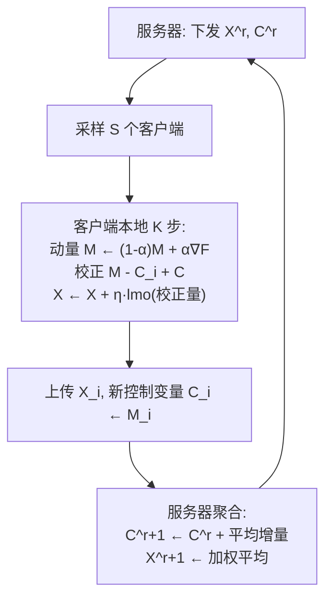

# FedMuon: Federated Learning with Bias-corrected LMO-based Optimization

**会议**: ICLR 2026  
**OpenReview**: [https://openreview.net/forum?id=9k7bvBVenZ](https://openreview.net/forum?id=9k7bvBVenZ)  
**代码**: 待确认  
**领域**: optimization  
**关键词**: 联邦学习, Muon, LMO, 偏差校正, Newton-Schulz, SCAFFOLD, 收敛分析  

## 一句话总结
本文指出把 Muon（基于线性最小化预言机 LMO 的优化器）直接当作 FedAvg 的本地优化器无法收敛（因为 LMO 是有偏算子），提出用类 SCAFFOLD 控制变量做偏差校正的 FedMuon，并首次证明它对任意次数的 Newton-Schulz 迭代都能收敛、迭代越多收敛越快。

## 研究背景与动机
**领域现状**：Muon 是近期崛起的优化器，把动量 SGD 的动量投影到正交矩阵空间（即在谱范数下求解 LMO），在大模型预训练中比 AdamW、Shampoo 更快更准，被证明等价于简化版 Shampoo、是特定范数下的 LMO 优化器、也是信赖域方法的特例。自然地，人们想把它搬到分布式 / 联邦学习里加速大规模训练。

**现有痛点**：把 Muon 分布式化并不容易。Ahn et al. (Dion) 能分布式求解 LMO，但不支持多步本地更新且通信开销巨大；Thérien et al. 的 MuLoCo 允许客户端像 Local SGD 一样多步更新，但只在所有客户端共享同一数据集的同质设定下有效，缺乏理论保证。一旦客户端数据异质（联邦学习的本质特征），这类直接做法就会失效。

**核心矛盾**：LMO 是一个**有偏算子**——各客户端动量分别求 LMO 再平均，并不等于先平均动量再求 LMO，即 $\frac{1}{n}\sum_i \mathrm{lmo}(M_i) \neq \mathrm{lmo}(\frac{1}{n}\sum_i M_i)$。动量 $M_i$ 本是局部梯度 $\nabla f_i(X)$ 的估计，但 $\frac{1}{n}\sum_i \mathrm{lmo}(M_i)$ 不再对齐全局梯度 $\nabla f(X)$，于是在异质数据下优化会停滞。本文形式化证明了这一点（定理 1）：存在一组凸函数使得直接做法（命名为 LocalMuon）永远停在初始点，且 $\|\nabla f(X^{(r)})\|^2 \geq \Omega(\zeta_\star^2)$，其中 $\zeta_\star^2 = \frac{1}{n}\sum_i \|\nabla f_i(X^\star)\|^2$ 度量客户端异质性。

**本文目标**：设计一个既能纠正 LMO 偏差、又能在联邦异质设定下可证收敛的 Muon 变体，并刻画近似求解 LMO（用有限次 Newton-Schulz 迭代）对收敛的影响。

**核心 idea**（**偏差校正 + 任意精度可收敛**）：借鉴 SCAFFOLD 的控制变量思想，把 LMO 作用在「校正后的动量」而非原始动量上，从而消除有偏；并通过谱范数与 Newton-Schulz 的特殊性质，证明对任意迭代次数 $T \geq 0$ 都能收敛。

## 方法详解

### 整体框架
FedMuon 在 FedAvg 的客户端-服务器循环里，给每个客户端 $i$ 维护一个控制变量 $C_i^{(r)}$ 估计其局部梯度方向、给服务器维护全局控制变量 $C^{(r)}$ 估计全局梯度方向。客户端本地多步更新时，不是把 LMO 作用在动量 $M_i$ 上，而是作用在校正项 $M_i - C_i^{(r)} + C^{(r)}$ 上；这个校正后的量是全局梯度 $\nabla f(X)$ 的良好估计，从而消除了 LMO 的偏差。服务器端聚合参数与控制变量，支持部分客户端参与（每轮采样 $S$ 个客户端）。

### 关键设计

**1. 控制变量偏差校正：让 LMO 作用在去偏后的方向上**。FedMuon 的核心一行是 $X_i^{(r,k+1)} \leftarrow X_i^{(r,k)} + \eta\, \mathrm{lmo}\!\left(M_i^{(r,k+1)} - C_i^{(r)} + C^{(r)}\right)$。这里 $C_i^{(r)}$ 与 $C^{(r)}$ 分别近似局部梯度 $\nabla f_i(X)$ 和全局梯度 $\nabla f(X)$（每轮更新为 $C_i^{(r+1)} \leftarrow M_i^{(r,K)}$，服务器侧 $C^{(r+1)} \leftarrow C^{(r)} + \frac{1}{N}\sum_{i\in S_r}(C_i^{(r+1)}-C_i^{(r)})$）。由于 $M_i^{(r,k+1)} - C_i^{(r)} + C^{(r)}$ 抵消了客户端本地梯度的漂移、对齐到全局方向，再过 LMO 就不会把各客户端引向各自的局部最优。一个干净的退化关系印证了它的合理性：去掉 LMO 并令 $\alpha=1$ 时，FedMuon 精确退化为原版 SCAFFOLD。值得强调的是，与既有「在服务器端加动量」的 SCAFFOLD-momentum 变体不同，FedMuon 是在 LMO 输入端做校正，这正是处理 LMO 有偏性的关键。

**2. 任意范数下的可证收敛**。在光滑性假设（用对偶范数度量梯度差 $\|\nabla f_i(X)-\nabla f_i(Y)\|_\star \leq L\|X-Y\|$）和无偏有界方差假设下，定理 2 给出全客户端参与时的收敛率，主导项为 $O\big((\frac{Lr_0\tilde\sigma^2}{nRK})^{1/4}\big)$，与 FedAvg、SCAFFOLD 几乎同形，且随客户端数 $n$ 增大而改善。差别仅在于多了一个因子 $\rho = \sup_X \frac{\|X\|_\star}{\|X\|_F}$（因为分析的是梯度的对偶范数）。更有意思的是：取谱范数时其对偶是迹范数，于是 FedMuon 度量的是 $\|\nabla f(X)\|_{\mathrm{trace}}$、SCAFFOLD 度量的是 $\|\nabla f(X)\|_F$；当 Hessian 近似低秩（少数主导奇异值）时 $L \approx L_F$，FedMuon 反而能比 SCAFFOLD 更快收敛——这为 Muon 的强经验表现提供了理论解释。

**3. 任意 Newton-Schulz 迭代次数都收敛**。实际中 LMO 用 Newton-Schulz 迭代近似（仅含矩阵乘法、GPU 友好）：$G^{(t+1)} = aG^{(t)} + b(G^{(t)}G^{(t)\top})G^{(t)} + c(G^{(t)}G^{(t)\top})^2 G^{(t)}$。本文最 surprising 的结论（定理 3）是：对**任意** $T \geq 0$，FedMuon 都收敛。其关键不等式为 $-\|G\|_{\mathrm{trace}} \leq \langle G, -G^{(T)}\rangle \leq -\|G\|_p$ 且 $\|-G^{(T)}\|_{sp}\leq 1$，说明哪怕只迭代几次甚至 $T=0$（此时输出就是归一化梯度 $-G/\|G\|_F$），方向仍是合法的下降方向。收敛度量从 $T$ 通过 Schatten $p$-范数刻画：$p = 1 + \frac{\log(1-(1-\kappa)^{1.5^T})}{\log\kappa}$，$T=0$ 时 $p=2$（Frobenius 范数），$T\to\infty$ 时 $p\to1$（迹范数），即迭代越多、度量范数越强、收敛越快，最多可改进 $\sqrt{\min\{d_1,d_2\}}$ 倍。这比此前唯一分析 inexact LMO 的工作（要求 NS 迭代足够多次）给出了更强的「任意次数皆收敛」断言。

## 实验关键数据

### 主实验（FashionMNIST + LeNet / CIFAR-10 + ResNet-18，n=16 采样 S=8，K=5 本地步）

| 方法 | 同质 (β=10) | 异质 (β=0.1) |
|------|------------|-------------|
| FedAvg (Momentum SGD) | 较低 | 较低 |
| FedAvg (Adam) | 中 | 中 |
| SCAFFOLD (Momentum SGD) | 中 | 中 |
| SCAFFOLD (Adam) | 中 | 中 |
| LocalMuon | 较好 | **明显掉队（不收敛）** |
| **FedMuon** | **最佳** | **最佳** |

FedMuon 在所有设定下测试精度均最高；LocalMuon 在同质设定尚可，但异质设定下显著落后，印证定理 1（LocalMuon 在异质下不收敛）。

### 消融实验（Newton-Schulz 迭代次数 T，FashionMNIST + LeNet）

| 设定 | 最佳 T | 现象 |
|------|--------|------|
| 同质 (β=10) | T=4 | 精度随 T 升高 |
| 异质 (β=0.1) | T=2 | 精度随 T 升高后趋稳 |

$T=0$ 时 FedMuon 已能训练；从 $T=0$ 提到 $T=1$ 精度显著跳升，与定理 3 一致（任意 $T$ 可收敛、$T$ 越大越快）。

### 关键发现
- 把 LMO 优化器直接塞进 FedAvg（LocalMuon / MuLoCo）在异质联邦下会停滞，是 LMO 有偏性的必然后果。
- 偏差校正后 Muon 的优势可迁移到联邦场景，超过 FedAvg(Adam)、SCAFFOLD(Adam)。
- Newton-Schulz 近似求解 LMO 不破坏收敛性，仅影响收敛速度，给出了精度-计算的可调权衡。

## 亮点与洞察
- **诊断到位**：先用一个干净的下界定理（定理 1）刻画「直接用 Muon 为何失败」，把问题精确归因到 LMO 的有偏性，再对症下药，逻辑链条完整。
- **退化关系优雅**：去掉 LMO、$\alpha=1$ 即退化为 SCAFFOLD，说明 FedMuon 是把成熟的方差缩减框架与 LMO 优化器自然嫁接。
- **理论新意强**：首次证明 LMO 优化器在 inexact（任意 Newton-Schulz 次数）下仍可收敛，并用 Schatten $p$-范数把「近似精度 ↔ 收敛范数强度」连续刻画出来，$T=0$ 退化为归一化梯度这一观察很直观。

## 局限与展望
- **实验规模偏小**：仅 FashionMNIST/CIFAR-10 + LeNet/ResNet-18，未在 Muon 真正擅长的大规模 LLM 预训练 / 大矩阵参数上验证，而 Muon 的优势恰在大模型场景最突出。
- **通信/存储成本未充分讨论**：SCAFFOLD 式控制变量需要客户端与服务器维护额外状态并传输 $C_i$，在通信受限的联邦场景的开销-收益未细致评估。
- **$\kappa$ 最坏情况悲观**：$p$ 中的 $(1-\kappa)^{1.5^T}$ 在 $\kappa\to0$ 时需要很大 $T$，最坏情形下近似精度对收敛的影响仍可能严重；实际中靠经验观察（$T$ 从 0 到 1 即大幅提升）来弥补。
- 客户端采样 $S<n$ 的一般情形理论结果放在附录，正文以 $S=n$ 简化呈现。

## 相关工作与启发
- **Muon 及 LMO 优化器**：Liu et al. (2025)、Pethick et al. (2025)、Jordan et al. (2024) 把 LMO 用于无约束神经网络训练；本文是首个把它系统搬入联邦学习并配可证收敛的工作。
- **联邦方差缩减**：SCAFFOLD（Karimireddy et al. 2020）的控制变量是本文去偏机制的直接来源；与在服务器端加动量的 SCAFFOLD-momentum 变体（Cheng et al. 2024 等）路线不同。
- **分布式 Muon**：Dion（Ahn et al. 2025）与 MuLoCo（Thérien et al. 2025）是同期工作，但前者不支持多步本地更新、后者只适用同质数据；FedMuon 填补了异质联邦这一空白。
- **启发**：当一个「非线性/有偏」算子（如 LMO、归一化、投影）被嵌入分布式平均时，先做控制变量去偏再施加算子，是一个可复用的设计范式；本文还示范了如何把近似求解器（Newton-Schulz）的精度纳入收敛分析。

## 评分
- 新颖性: ⭐⭐⭐⭐ 首次揭示 Muon/LMO 优化器在异质联邦下因有偏而不收敛，并给出可证收敛的偏差校正方案 + 任意 Newton-Schulz 次数收敛的新分析，理论贡献清晰且有原创性。
- 实验充分度: ⭐⭐⭐ 主实验与 T 消融能很好支撑理论，但数据集/模型规模偏小，缺大模型场景与通信成本评估。
- 写作质量: ⭐⭐⭐⭐ 问题诊断→方法→理论→实验逻辑顺畅，定理动机解释到位，退化关系与直觉说明清楚。
- 价值: ⭐⭐⭐⭐ 把当下最热的 Muon 优化器扩展到联邦学习并打牢理论基础，对联邦优化与分布式 Muon 两个社区都有参考价值。

<!-- RELATED:START -->

## 相关论文

- [\[ICLR 2026\] Byzantine-Robust Federated Learning with Learnable Aggregation Weights](byzantine-robust_federated_learning_with_learnable_aggregation_weights.md)
- [\[ICLR 2026\] Incentives in Federated Learning with Heterogeneous Agents](incentives_in_federated_learning_with_heterogeneous_agents.md)
- [\[ICLR 2026\] DeepAFL: Deep Analytic Federated Learning](deepafl_deep_analytic_federated_learning.md)
- [\[AAAI 2026\] FedPM: Federated Learning Using Second-order Optimization with Preconditioned Mixing of Local Parameters](../../AAAI2026/optimization/fedpm_federated_learning_using_second-order_optimization_with_preconditioned_mix.md)
- [\[ICLR 2026\] Enhancing Communication Compression via Discrepancy-aware Calibration for Federated Learning](enhancing_communication_compression_via_discrepancy-aware_calibration_for_federa.md)

<!-- RELATED:END -->
