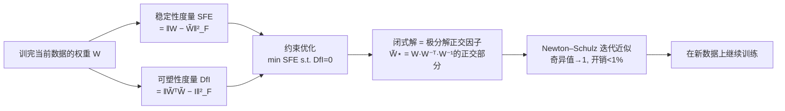

# FIRE: Frobenius-Isometry Reinitialization for Balancing the Stability–Plasticity Tradeoff

**会议**: ICLR 2026  
**OpenReview**: [https://openreview.net/forum?id=CfZLxT3zIZ](https://openreview.net/forum?id=CfZLxT3zIZ)  
**代码**: [https://isaac7778.github.io/fire/](https://isaac7778.github.io/fire/)  
**领域**: 持续学习 / 可塑性损失 / 权重重初始化  
**关键词**: stability-plasticity tradeoff, loss of plasticity, reinitialization, dynamical isometry, Newton–Schulz, continual learning  

## 一句话总结
FIRE 把"该把权重往回重置多少"这个长期靠手调的难题，重写成一个有闭式解的约束优化问题——在保持与旧权重最接近（最小化 Frobenius 误差）的前提下，把权重投影到正交（等距）流形上恢复可塑性，用 Newton–Schulz 迭代高效近似，几乎零调参地在视觉/语言/RL 三类持续学习任务上同时压过 naive 训练和标准重初始化方法。

## 研究背景与动机

**领域现状**：在非平稳数据流上训练的神经网络必须同时兼顾两个互相打架的属性——**稳定性**（stability，保住已学到的知识，避免灾难性遗忘）和**可塑性**（plasticity，能继续吸收新任务的信息）。当过去的数据仍可访问时（基础模型、机器人 agent 等大量真实场景），稳定性的意义不再是"防遗忘"，而是"用旧表征加速对新任务的收敛"；此时主要瓶颈反而是**可塑性损失**（loss of plasticity）：模型越训越僵，新分布拟合不动。

**现有痛点**：缓解可塑性损失的方法分两类，各有死穴。

- **正则化类**（L2init、Parseval 正交约束等）：在整个训练过程中持续把参数/特征拽向初始化或正交几何。约束太强会拖慢收敛、徒增算力，太弱又防不住可塑性退化。
- **重初始化类**（S&P、DASH 等）：新数据到来时把权重重置回某个早期检查点。好处是不干扰当前优化、开销低、适配快，但陷入一个**调参两难**：重置太激进会抹掉有用知识（稳定性崩），太保守又恢复不了可塑性（白重置）。

**核心矛盾**：重置的"力度"本质是一个稳定性 vs 可塑性的连续权衡，但既有方法都把它当成一个需要人工网格搜索的超参，既不可靠也不可迁移——在视觉上调好的力度搬到 LLM 或 RL 就失效。

**本文目标**：把重初始化从"调一个标量力度"升级成"解一个原则化的约束优化问题"，让重置点自动落在高稳定 × 高可塑的交点上，无需逐任务调参。

**核心 idea**：**用两个可量化、且其中一个可微的指标分别刻画稳定性与可塑性**——稳定性用当前权重与旧权重的平方 Frobenius 误差（SFE）衡量；可塑性用权重偏离等距的程度（DfI）衡量，并从理论上证明降低 DfI 同时能平滑损失曲率、减少休眠神经元、提升特征有效秩。于是"恢复可塑性同时少丢知识"就等价于**在 DfI=0 的约束下最小化 SFE**，而这正好是经典的正交 Procrustes 问题，有闭式极分解解。

## 方法详解

### 整体框架

FIRE 的思路是：先把稳定性和可塑性各自落到一个具体的矩阵量上（SFE 与 DfI），证明这两个量分别上界/下界住"特征表征相似度"和"损失曲率/有效秩/神经元活跃度"，于是稳定-可塑权衡被翻译成一个干净的约束优化——**在权重严格正交（DfI=0）的约束下，找离原权重最近的那个解**。这个问题等价于正交 Procrustes，解就是权重的极分解正交因子 $\tilde W^\star = W(W^\top W)^{-1/2}$；为避免在大网络上直接算矩阵平方根逆，用 Newton–Schulz 迭代把奇异值整体推向 1 来近似。整个操作只在"训完旧数据、即将学新数据"的那一刻施加一次，额外开销 <1% 训练时间。

### 关键设计

**1. SFE：用与旧权重的 Frobenius 距离作为稳定性度量，并证明它上界住表征漂移**。FIRE 把稳定性定义为当前权重 $W$ 与重置后权重 $\tilde W$ 之间的平方 Frobenius 误差 $\mathrm{SFE}(W,\tilde W)=\lVert W-\tilde W\rVert_F^2$，越小说明越贴近旧表征。光是"权重接近"还不足以保证"表征接近"，作者用 Theorem 1 补上这一环：两个 $L$ 层网络输出特征的归一化协方差差异被 SFE 上界住——$\lVert C_\Theta^\ell-C_{\tilde\Theta}^\ell\rVert_F\le \tfrac{4\lVert Z\rVert_F}{m_\ell}\sqrt{\ell}\,S^{\ell-1}\sqrt{\mathrm{SFE}}$（输入归一化、激活 1-Lipschitz 时）。这说明在固定架构与权重尺度下，**最小化 SFE 单调收紧表征漂移的上界**，因此 SFE 是一个"既好算又有理论背书"的稳定性代理；而且斜率正比于谱范数，谱范数越大、表征对 SFE 越敏感，越该压 SFE。

**2. DfI：把"可塑性"翻译成可微的偏离等距度量，一举打通曲率/有效秩/休眠神经元**。已有的可塑性指标（损失曲率、休眠神经元、特征有效秩）都依赖即将到来的数据且不可微，没法直接当优化目标。FIRE 改用偏离等距度量 $\mathrm{DfI}(W)=\lVert W^\top W-I\rVert_F^2$——纯粹由权重决定、处处可微。关键在于三条定理证明降低 DfI 同时改善所有传统可塑性信号：Theorem 2 用 $\nu_k=1+\sqrt{\mathrm{DfI}(W_k)}$ 把 Hessian 谱范数（损失曲率）逐层上界住，DfI 越小曲率越平滑；Theorem 3 证明 $\varepsilon=\sqrt{\mathrm{DfI}(W)}<1$ 给出特征有效秩 srank 的下界，DfI 越小有效秩越高；Theorem 4 证明降低 DfI 会同时收紧每个神经元活跃度 $s_j$ 的上下界 $\sqrt{\tfrac{1-\varepsilon}{1+\varepsilon}}\le s_j\le\sqrt{\tfrac{1+\varepsilon}{1-\varepsilon}}$，压缩神经元间活跃度差异从而减少休眠神经元。一个可微量同时管住三个原本不可优化的可塑性病灶，这是 FIRE 能写成优化问题的根基。

**3. 约束优化 + 极分解闭式解：把重置力度从超参变成"投影到等距流形上的最近点"**。有了两个度量，权衡自然成形：$\min_{\tilde W}\lVert W-\tilde W\rVert_F^2 \;\text{s.t.}\; \tilde W^\top\tilde W=I$，即在严格正交（DfI=0、可塑性拉满）的约束下找离旧权重最近（SFE 最小、稳定性拉满）的点。这恰是经典正交 Procrustes 问题，闭式解为极分解正交因子 $\tilde W^\star=W(W^\top W)^{-1/2}$。作者强调贡献不在于这个经典解本身，而在于**重新诠释它为一种平衡稳定-可塑的原则化机制**：它把 $W$ 的谱整体推向各向同性（低 DfI）的同时保持在原子空间附近（低 SFE），正好落在图 1 高稳定流形与高可塑流形的交点上，从而绕开"过保守 / 过激进"两个陷阱。

**4. Newton–Schulz 近似：把矩阵平方根逆替换成几步矩阵乘法，<1% 开销且几乎免调参**。直接算 $(W^\top W)^{-1/2}$ 在大网络上太贵，FIRE 用 Newton–Schulz 迭代近似：令 $X_0=W/\lVert W\rVert_F$，反复执行 $X_{k+1}=aX_k+bX_k(X_k^\top X_k)$（$a=1.5,\,b=-0.5$），逐步把 $W$ 的奇异值推向 1、逼近正交。卷积层则沿空间维按 kernel 独立正交化。这一近似把整个重置压到 <1% 训练时间；而且消融显示 FIRE 对迭代步数极其鲁棒，**仅 5 步**就拿到主要收益——这意味着 FIRE 实际上只有"迭代步数"一个超参，且几乎不用调（LLM 实验里固定 5 步、零调参就压过精调力度的 S&P）。

## 实验关键数据

> 论文结果以学习曲线图（Figure 2–5）呈现，无数值主表，下面按图归纳趋势。评测覆盖视觉、语言、RL 三大域，统一假设"可访问过去数据"。

### 主实验（三大域）

| 域 | 设置 / 架构 | 对比基线 | FIRE 结论 |
|---|---|---|---|
| 持续视觉 | CIFAR-10/ResNet-18、CIFAR-100/ViT-Tiny、Tiny-ImageNet/VGG-16；warm-start(10%)/continual/class-incremental | S&P、DASH、Parseval、L2init、CBP、SNR、ReDo、Muon | 多数基准全面最优；ViT-Tiny 上略逊 DASH、与 S&P 持平；重置后几乎无掉点 |
| 持续预训练 LLM | GPT-0.1B：WikiText-103 预训练 → OpenWebText+WikiText 续训（best/30k/60k 检查点） | base、full reset、S&P | **零调参固定 5 步**即超过精调的 S&P；即便从 60k（可塑性损失更重）出发仍强；full reset 在此场景失效 |
| 强化学习 | DQN/Atari(Asterix,BeamRider,DemonAttack)、SAC+SimBa/HumanoidBench(balance,walk,run)，高 Replay Ratio，训练中点重置一次 | full reset、S&P、Plasticity Injection | 全面优于或持平 S&P；Asterix 超 full reset；Plasticity Injection 表现差 |

### 消融实验

| 消融 | 结论 |
|---|---|
| Newton–Schulz 迭代步数（Fig 5a） | 对步数高度鲁棒，**仅 5 步**即获强收益，步数再多边际提升有限 |
| 稳定/可塑/曲率三量同测（Fig 5b） | FIRE 同时拿到**最低 DfI + 最低 SFE**，且损失曲率比 S&P 更平滑；DASH 曲率虽平滑但 SFE 最高（抹知识、重置后不稳） |

### 关键发现
- **理论与实践一致**：FIRE 实测同时压低 DfI（可塑性）与 SFE（稳定性）并平滑曲率，验证了"降 DfI⇒平滑曲率/高秩/少休眠"的定理。
- **持续设置里 full reset 与 DASH 重置后会急剧掉点**，S&P 不掉点但整体次优，FIRE 几乎不掉点——印证它真正平衡了两端。
- **节点级重置（CBP/SNR/ReDo）与 Muon 整体表现差**：维持"可训练性"对泛化收益有限；把 Newton–Schulz 用在权重重置（FIRE）远比用在梯度上（Muon）有效。
- **full reset 在 LLM 续训中失效**：抹掉全部先验带来的不稳定，盖过了恢复可塑性的收益，连已退化的 base 都打不过。

## 亮点与洞察
- **把模糊的"重置力度"焊死成一个有闭式解的约束优化**，这是方法论层面的关键升级：稳定性、可塑性各有可量化指标，权衡点不再靠人猜。
- **DfI 这个"可微的可塑性代理"是真正的钥匙**——它把三个原本不可优化的可塑性病灶（曲率、有效秩、休眠神经元）用一个权重量统一管住，并有定理支撑，这让"优化可塑性"第一次落地。
- **几乎零调参且跨域统一**：唯一超参是迭代步数，且 5 步就够，在视觉/语言/RL 三类性质迥异的任务上都用同一套机制压过各自的强基线，迁移性极强。
- **复用经典正交 Procrustes/极分解，工程上极轻**：<1% 开销、几行 Newton–Schulz，落地门槛低。

## 局限与展望
- **强依赖"可访问过去数据"假设**：作者明确这是 FIRE 的核心限制，未在受限/无旧数据（标准防遗忘）场景下评测；这类场景下 SFE 作为稳定性代理是否仍成立存疑。
- **LLM 实验仅用 GPT-0.1B 小模型**：是否能 scale 到大模型、是否适用续训之外的持续微调，尚未验证。
- **DfI=0 是硬约束（严格正交）**：把所有层都强行推到等距可能并非所有架构/层（如已高度各向异性的层）都最优，ViT 上逊于数据相关的 DASH 即是信号——纯权重侧、数据无关的重置在 Transformer 上可能不如带数据指导的方法。
- **结果以曲线图为主、缺数值主表**：跨方法的定量差距与显著性较难精确比较。

## 相关工作与启发
- **重初始化类**：S&P（Shrink & Perturb，缩放+扰动回中间检查点）、DASH（数据相关收缩）是直接对手；FIRE 的差异是把"重置到哪"从启发式力度变成约束优化的投影。
- **正则化类**：Parseval 正交正则、L2init——与 FIRE 共享"趋向正交/初始化"的目标，但 Parseval 是全程持续施加约束（拖慢收敛），FIRE 只在数据切换点投影一次。
- **可塑性损失诊断**：休眠神经元（ReDo/Sokar）、有效秩崩塌（Kumar）、损失曲率（Lyle）——FIRE 用 DfI 把这些信号统一成可微目标，是把"诊断指标"升级为"优化目标"的范例。
- **Newton–Schulz 同源工作**：Muon 优化器把 Newton–Schulz 用在梯度上；FIRE 用在权重重置上并实证后者更有效，提示"正交化作用在哪一步"很关键。
- **启发**：把一个长期靠超参网格搜索的设计（重置力度）重写为"找最近的满足某结构约束的点"是一种通用范式；只要能为目标属性找到一个可微的几何代理（这里是等距/正交），就能把启发式调参变成有闭式解的优化。

## 评分
- **新颖性**: ⭐⭐⭐⭐⭐ 把稳定-可塑权衡重写成约束优化、并用 Dfis 把三个不可微可塑性指标统一成一个可微正交代理，视角原创且有定理支撑。
- **实验充分度**: ⭐⭐⭐⭐ 覆盖视觉/语言/RL 三大域、多协议、多强基线，消融也直击稳定/可塑两量；扣分在于以曲线图为主缺数值主表、LLM 仅小模型、未测无旧数据场景。
- **写作质量**: ⭐⭐⭐⭐ 从度量→定理→优化→近似的逻辑链条清晰，图 1 直观；定理较密集对读者门槛偏高。
- **价值**: ⭐⭐⭐⭐⭐ 近乎零调参、<1% 开销、跨域统一压过标准重初始化，对持续学习/可塑性维护是实用且原则化的方案。

<!-- RELATED:START -->

## 相关论文

- [\[ICLR 2026\] Activation Function Design Sustains Plasticity in Continual Learning](activation_function_design_sustains_plasticity_in_continual_learning.md)
- [\[ICLR 2026\] Seesaw: Accelerating Training by Balancing Learning Rate and Batch Size Scheduling](seesaw_accelerating_training_by_balancing_batch_size_and_learning_rate_schedulin.md)
- [\[ICLR 2026\] Generalization Below the Edge of Stability: The Role of Data Geometry](generalization_below_the_edge_of_stability_the_role_of_data_geometry.md)
- [\[ICML 2026\] Stability Analysis of Sharpness-Aware Minimization](../../ICML2026/optimization/stability_analysis_of_sharpness-aware_minimization.md)
- [\[ICML 2026\] AdaGC: Enhancing LLM Pretraining Stability via Adaptive Gradient Clipping](../../ICML2026/optimization/adagc_enhancing_llm_pretraining_stability_via_adaptive_gradient_clipping.md)

<!-- RELATED:END -->
