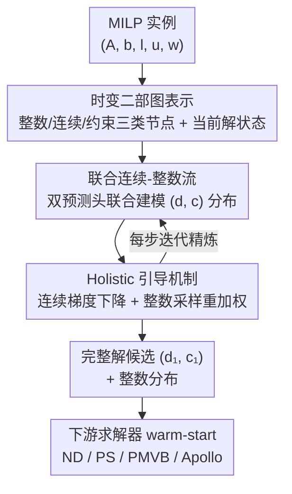

# FMIP: Joint Continuous-Integer Flow for Mixed-Integer Linear Programming

**会议**: ICLR 2026  
**OpenReview**: [https://openreview.net/forum?id=kyvW6S0u3z](https://openreview.net/forum?id=kyvW6S0u3z)  
**代码**: https://github.com/Lhongpei/FMIP  
**领域**: 优化 / 生成模型 / Flow Matching  
**关键词**: 混合整数线性规划, 流匹配, 联合分布建模, 引导采样, 学习型启发式

## 一句话总结
针对现有生成式 MILP 启发式只建模整数变量、忽视整数-连续变量耦合的痛点，FMIP 用流匹配在「整数+连续」混合解空间上联合建模解的分布，并借助这一完整解候选设计 holistic 引导机制把生成轨迹推向"更优且更可行"的解，在 8 个标准基准上把 primal gap 平均压低 41.34%。

## 研究背景与动机

**领域现状**：混合整数线性规划（MILP）是建模"既有离散选择、又有连续量"的决策问题的基础工具，但它是 NP-hard 的，精确求解器（如 Gurobi、分支定界）严重依赖启发式来在有限时间里找到高质量解。近年来一条很有前景的路线是用深度学习预测启发式解，给下游求解器做 warm-start：尤其是扩散模型 / 流匹配这类生成式方法，把"一步预测一个完整解"这个难题改写成"从噪声出发、多步迭代精炼"的过程，更擅长在复杂约束空间里导航。

**现有痛点**：以 DIFUSCO、IP-Guided-Diff 为代表的现有生成式方法有一个致命的结构性缺陷——它们只建模**整数变量**的分布。但 MILP 的解 $x=(x_I, x_C)$ 同时包含整数部分 $x_I$ 和连续部分 $x_C$，目标函数 $w^\top x$ 和约束 $Ax\le b$ 的取值都同时依赖两者。只建模整数变量，等于把连续变量当成"事后再补"的附属物。

**核心矛盾**：整数与连续变量之间存在强耦合关系，是 MILP 结构的根本一环。只建模一半信息，会造成**信息瓶颈**：一方面无法表达 MILP 解"一对多"（多个最优解）的本质，单点预测天然受限；另一方面，更关键的是——任何引导机制要判断"这个解好不好"，都需要完整的 $x=(x_I,x_C)$ 来算目标值和约束违反，缺了连续变量，引导本身就是残缺的、给不出实例级的优化反馈。

**本文目标**：把生成式 MILP 启发式从"只建模整数"升级为"联合建模整数+连续"，并在此基础上让引导机制能用上完整的、逐实例的目标与约束信息。

**切入角度**：作者指出，从纯整数规划（ILP）到 MILP 看似只是"多加几个连续变量"的平凡延伸，但联合建模其实是一个被此前工作集体忽略的关键缺口。补上它能一举解锁两件事：从单点预测转向分布建模、以及利用实例级优化信息做引导。

**核心 idea**：用流匹配在整数与连续变量的混合空间上**联合**学习解的分布，再用生成出的完整解候选驱动一个 holistic 引导机制，在采样过程中持续把轨迹推向"目标更小、约束更满足"的方向。

## 方法详解

### 整体框架
FMIP 把"为一个 MILP 实例找高质量解"建模成一个在混合解空间上的流匹配生成过程。输入是一个 MILP 实例 $M=(A,b,l,u,w)$，先表示成一张**区分整数 / 连续两类变量节点 + 约束节点**的二部图；输出是一个完整的解候选 $(d_1, c_1)$（整数+连续）以及整数变量上的概率分布，交给下游求解器做 warm-start。

中间的核心是：从纯噪声 $G_0$ 出发，沿时间 $t\in[0,1]$ 模拟一个 ODE，逐步把噪声图演化成高质量解的分布 $p_1(G_1)$。模型在共享图主干上挂两个预测头——连续头回归去噪后的连续值 $\hat c_1(G_t)$，整数头输出整数解的类别分布 $\hat p(d_1\mid G_t)$——从而在每一步都能给出一个**完整**的解候选。正因为每步都有完整候选，作者就能在采样的每一步插入 holistic 引导：对连续变量做梯度下降、对整数变量做采样-重加权，把轨迹拉向更优更可行的区域。整个框架对图主干（GCN/GAT/…）和下游求解器都是无关的、可插拔的。

### 关键设计

**1. 时变图表示：把"实例静态结构"和"生成动态状态"装进同一张图**

MILP 实例本身的稀疏结构（哪个变量出现在哪条约束里）可以用一张二部图 $G=(V_I,V_C,V_{con},E)$ 编码——变量节点和约束节点之间，当且仅当该变量在该约束里系数非零时连边。FMIP 在此基础上做的关键一步是**显式区分整数变量节点 $V_I$ 与连续变量节点 $V_C$**，让它们成为不同类型、可用不同参数处理的节点（这正是默认主干 Tri-GCN 区别于普通 Bi-GCN 的地方）。

更重要的是，它把生成过程的动态状态也注入图里：在时刻 $t$ 定义解图 $G_t=(G, d_t, c_t)$，其中 $d_t, c_t$ 是当前时刻整数、连续变量的取值，作为变量节点的附加特征。这样一来，同一张图既承载了"这道题长什么样"的静态拓扑，又承载了"现在解走到哪一步了"的动态信息，使得后续每一步去噪/引导都能基于完整上下文进行。

**2. 联合连续-整数流：在混合解空间上同时建模两类变量的分布**

这是全文基石，直接针对"只建模整数变量"的信息瓶颈。FMIP 在 $(d,c)$ 的混合空间上构造概率路径 $p_{t\mid 1}(G_t\mid G_1)$，把简单噪声分布 $p_0$ 变换到高质量解分布 $p_1$。由于流匹配天然能同时处理连续与离散数据，作者对两类变量用各自的条件路径：连续变量用高斯先验、插值路径 $c_t\mid c_1\sim\mathcal N(t c_1, (1-t)^2 I)$，对应闭式目标向量场 $v_t(c_t\mid c_1)=\frac{c_1-c_t}{1-t}$；整数变量用类别均匀先验，对应一个目标速率矩阵 $R_{t\mid 1}$（见原文 Eq. 2，⚠️ 公式细节以原文为准）。

模型用一个共享图主干 + 两个预测头从带噪状态 $G_t$ 预测目标解 $(d_1,c_1)$，训练时最小化一个联合损失：

$$\mathcal L(\theta)=\mathbb E_{t,G_1}\left[\frac{\|\hat c_1(G_t)-c_1\|_2^2}{1-t}-\omega\log\hat p(d_1\mid G_t)\right]$$

即"连续变量的回归损失 + 整数变量的交叉熵损失"，$\omega$ 平衡两项。推理时从 $t=0$ 模拟前向 ODE 到 $t=1$，每步用模型预测的 $\hat c_1, \hat p(d_1\mid G_t)$ 估出向量场与速率矩阵来更新状态，并用 cosine 调度把更多步分配到 $t=1$ 附近的低噪区以提质。与一步式判别预测相比，这个生成式公式的关键优势就在于它支持多步迭代精炼，从而能挂上下面的 holistic 引导。

**3. Holistic 引导机制：用完整解候选把轨迹推向"更优且更可行"**

因为联合建模让模型在任意步 $t$ 都能给出一个完整候选 $(\hat d,\hat c)$，FMIP 就能直接从 MILP 公式本身（目标 + 约束）导出实例级引导——这正是只建模整数的前作做不到的。作者定义一个目标函数把"目标值最小"和"约束违反最小"合在一起：

$$f(d,c)=w^\top x+\gamma\sum_{i=1}^{m}\left[\max(0, A_{i,*}x-b_i)\right]^2$$

其中 $\gamma$ 权衡目标项与约束违反项。引导对两类变量分别施加：**连续变量用基于梯度的引导**，每步对 $f$ 关于预测连续值做梯度下降，再用 $\text{Project}_{l,u}(\cdot)$ 投影回上下界内，$c_{t+\Delta t}\leftarrow\text{Project}_{l,u}(c_t-\rho_t\nabla_{c_t}f)$；**整数变量用采样-重加权**，每步从当前整数分布采一批 $B$ 个候选，按各候选的 $f$ 值（温度 $\psi$）对速率矩阵 $\hat R$ 重新加权，把类别分布推向更优的整数取值，再投影满足约束。

此外作者还观察到固定 $\gamma$（默认 50）在长采样轨迹上会失衡，于是提出**自适应平衡**：每步比较目标项与约束违反项的量级，谁占主导就按因子 $\alpha$ 调 $\gamma$（目标项主导则 $\gamma\leftarrow\gamma\times\alpha$ 加强约束满足，反之 $\gamma\leftarrow\gamma/\alpha$），累积调整以稳定深步数生成。

### 损失函数 / 训练策略
训练目标即上文式 $\mathcal L(\theta)$：连续变量回归损失（按 $\frac{1}{1-t}$ 加权）+ 整数变量交叉熵，$\omega$ 平衡两项，$t\sim U(0,1)$。推理用 cosine 时间离散化（低噪区多分步），叠加 holistic 引导。整个方法对图主干和下游求解器无关，可即插即用。

## 实验关键数据

### 主实验
在 8 个标准 MILP 基准（CA / GIS / MIS / FCMNF / SC / LB / IP / MIPLIB）上，配 4 种下游求解器（ND/PS/PMVB/Apollo）评测，主干用 Tri-GCN，指标为 primal gap（越低越好），相对改进 Rel.Imprv. 相对最强基线计算。整体相对最强 ML 基线**平均提升 41.34%**。在简单基准上 FMIP 与最优基线持平，在更难的 LB、IP 上优势显著。

| 基准 (求解器 ND/400s) | 指标 GAP↓ | FMIP | 最优基线 | 相对改进 |
|--------|------|------|----------|------|
| MIS | GAP | **0.40** | 9.70 | 95.88% |
| SC | GAP | **0.10** | 0.25 | 60.00% |
| LB | GAP | **0.40** | 6.44 | 93.79% |
| IP | GAP | **0.25** | 0.88 | 71.59% |
| MIPLIB | Rel.GAP | **5.42%** | 5.85% | 0.43% |

在 PS/PMVB/Apollo 下也一致领先：如 PS+IP 把 GAP 从基线 1.47 压到 **0.18**（74.86%），Apollo+IP 直接把 GAP 打到 **0.00**（100%）。

### 消融实验
在 IP 数据集上对四个变体做消融（Table 4）：

| 配置 | ND GAP↓ | PS GAP↓ | PMVB GAP↓ | Apollo GAP↓ | 说明 |
|------|---------|---------|-----------|-------------|------|
| Full FMIP | **0.25** | **0.18** | **0.67** | **0.00** | 完整模型 |
| w/o Feasibility Guidance | 1.01 | 0.93 | 1.73 | 1.23 | 去掉约束可行性引导 |
| w/o Objective Guidance | 0.91 | 1.02 | 8.58 | 0.79 | 去掉目标引导 |
| w/o Guidance | 0.84 | 0.24 | 0.71 | 0.37 | 去掉整个引导机制 |
| w/o Continuous | 0.69 | 0.54 | 1.21 | 0.71 | 退回整数-only 模型 |

### 关键发现
- **联合建模是地基，引导是放大器**：`w/o Continuous`（退回整数-only）在多个求解器下都明显劣于完整模型，且它从结构上就用不了 holistic 引导——直接证明"捕捉整数-连续耦合"对 MILP 高质量解预测是本质性的。
- **目标引导与可行性引导缺一不可**：单独去掉任一引导项 GAP 都明显变差，尤其 `w/o Objective Guidance` 在 PMVB 下 GAP 暴涨到 8.58，说明目标引导对某些求解器极其关键。
- **采样步数存在甜区**：步数太少精炼不足、太多会让引导把分布推得过于尖锐、损失多样性而陷入局部最优；固定 $\gamma$ 时 IP 上目标值从 Step-12 的 11.79 涨到 Step-32 的 13.25，而自适应平衡（$\alpha=2.0$）能把 Step-32 拉回 11.92，验证了动态平衡对稳定长轨迹生成的必要性。
- **推理开销可忽略**：FMIP 推理时间与 DIFUSCO/IP-Guided-Diff 同量级，且通常不到下游求解器总时间的 1%，几乎"免费"换来大幅提升。

## 亮点与洞察
- **"只建模一半"是真痛点**：作者敏锐地指出 ILP→MILP 看似平凡、实则隐藏着"联合建模"这个被集体忽略的缺口——只建模整数变量不仅信息不全，更致命的是让引导机制根本算不准"解好不好"。这个洞察简单却切中要害。
- **联合建模与引导是因果链而非两个独立卖点**：正因为每步能产出完整候选 $(\hat d,\hat c)$，才能直接用 MILP 公式本身算 $f$ 来引导——联合建模"解锁"了 holistic 引导，二者是一根逻辑链。
- **连续/整数分而治之的引导设计可复用**：连续变量用梯度下降+投影、整数变量用采样-重加权，这套"对连续用梯度、对离散用 reweight"的混合引导范式，可迁移到其他含混合变量的生成式组合优化任务。
- **即插即用的工程价值**：对 4 种图主干、4 种下游求解器都验证有效，意味着它是一个通用增强层而非绑死某个 backbone 的方案。

## 局限与展望
- 作者承认两个方向待改进：图表示还可更好地捕捉任务特定特征；以及缺一个为 FMIP 量身定制的下游求解器（目前都是套用现成求解器）。
- 自己发现的局限：方法聚焦**有界整数变量**的 MILP（无界需借 bit-wise 预测或连续松弛+取整扩展，未深入验证）；引导超参（$\gamma$、$\rho_t$、温度 $\psi$、步数）较多，自适应平衡只在 IP+PS 上系统验证，跨数据集的鲁棒性还需更广覆盖。
- 采样步数与解质量呈非单调关系，需要为每个数据集调甜区，部署时增加调参成本。

## 相关工作与启发
- **vs DIFUSCO / IP-Guided-Diff**: 它们是为整数（ILP）设计的扩散/引导扩散框架，只建模整数变量分布；本文把连续变量也纳入联合流建模，从而能用完整解算实例级目标+约束反馈。区别在于"建模整数 vs 联合建模整数+连续"，本文优势是补上耦合信息、解锁 holistic 引导，代价是模型与引导更复杂。
- **vs SL（监督学习判别基线）**: SL 用 GNN 一步前向直接预测变量赋值；本文是多步生成式精炼，把难的一步任务拆成可管理的多步，更擅长在复杂约束空间导航。
- **vs 分支定界内部组件学习（变量分支 / 割平面选择）**: 那条线改造求解器内部策略；本文属于"预测高质量启发式解做 warm-start"这条线，与求解器解耦、可即插即用。

## 评分
- 新颖性: ⭐⭐⭐⭐⭐ 首个对 MILP 整数+连续变量联合建模的生成框架，"联合建模解锁 holistic 引导"的逻辑链清晰且切中前作盲点
- 实验充分度: ⭐⭐⭐⭐⭐ 8 基准 × 4 求解器 × 4 主干 + 消融 + 步数/自适应平衡分析，覆盖全面
- 写作质量: ⭐⭐⭐⭐ 动机与方法叙述清楚，公式完整；部分引导公式细节需对照原文
- 价值: ⭐⭐⭐⭐⭐ 通用即插即用、推理开销可忽略、平均降 primal gap 41.34%，对真实 MILP 应用实用价值高

<!-- RELATED:START -->

## 相关论文

- [\[ICLR 2026\] Constraint Matters: Multi-Modal Representation for Reducing Mixed-Integer Linear programming](constraint_matters_multi-modal_representation_for_reducing_mixed-integer_linear_.md)
- [\[ICML 2026\] Provably Data-Driven Lagrangian Relaxation for Mixed Integer Linear Programming](../../ICML2026/optimization/provably_data-driven_lagrangian_relaxation_for_mixed_integer_linear_programming.md)
- [\[ICML 2025\] Integer Programming for Generalized Causal Bootstrap Designs](../../ICML2025/optimization/integer_programming_for_generalized_causal_bootstrap_designs.md)
- [\[ICLR 2026\] High-dimensional Mean-Field Games by Particle-based Flow Matching](high-dimensional_mean-field_games_by_particle-based_flow_matching.md)
- [\[ICLR 2026\] Never Saddle for Reparameterized Steepest Descent as Mirror Flow](never_saddle_for_reparameterized_steepest_descent_as_mirror_flow.md)

<!-- RELATED:END -->
