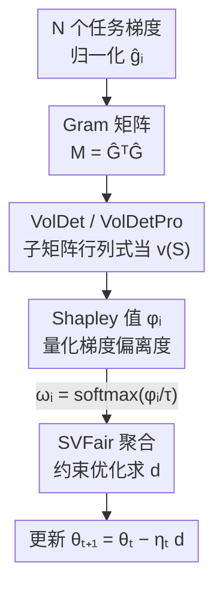

# From Gradient Volume to Shapley Fairness: Towards Fair Multi-Task Learning

**会议**: ICLR 2026  
**OpenReview**: [https://openreview.net/forum?id=2PdLKGdtqW](https://openreview.net/forum?id=2PdLKGdtqW)  
**代码**: 见论文补充材料（supplementary material）  
**领域**: 优化 / 多任务学习  
**关键词**: 多任务学习, 梯度冲突, Shapley 值, 公平优化, Gram 矩阵

## 一句话总结
针对多任务学习里梯度冲突导致"强任务霸占更新方向、弱任务被反复牺牲"的不公平问题，本文提出 SVFair：用归一化梯度张成的平行多面体体积（Gram 行列式）当 Shapley 合作博弈的效用函数，单次前向就能算出每个任务梯度偏离整体的程度，并据此重新分配更新权重，在监督学习和强化学习多个基准上同时拿到最好的 MR 和 $\Delta m\%$。

## 研究背景与动机
**领域现状**：多任务学习（MTL）让一个模型同时学多个任务，共享表征带来效率和泛化收益。主流优化路线分两类——loss-based（在损失层面调任务权重，如 UW、DWA）和 gradient-based（直接操作任务梯度，如 MGDA、PCGrad、CAGrad、Nash-MTL、FairGrad、PIVRG）。

**现有痛点**：共享一套参数不可避免地把所有任务的优化动力学耦合在一起，不同目标的梯度会互相冲突，于是某些任务持续主导更新方向、另一些任务被反复压制——这就是"任务级优化不公平"。它不仅拖垮最差任务的表现，在安全/任务攸关的场景里还会损害 MTL 的可靠性。

**核心矛盾**：现有方法大多只盯着最终性能，没有显式量化"单个任务梯度到底偏离整体梯度多少"。而那些试图度量冲突的方法（余弦相似度、内积）只能做**成对**分析，无法刻画整个任务集合的全局冲突结构，更给不出"某一**子集**任务如何与其余任务共同作用"的联盟级视角——而公平本应在这个层级定义。任务一多（如 CelebA 的 40 个任务），成对度量在可扩展性和效率上都吃不消。

**本文目标**：设计一个框架，既能从几何角度刻画任意任务**联盟**的梯度冲突，又能把这个联盟效用接到一条有原则的公平分配规则上去分配梯度更新。

**切入角度**：作者把"梯度冲突"和"公平分配"分别对应到两个成熟工具——几何上的平行多面体体积（衡量一组向量有多发散），博弈论里的 Shapley 值（量化每个参与者对总效用的边际贡献）。关键洞察是：可以用一个**只依赖梯度几何、与训练结果无关**的体积量当 Shapley 的效用函数，从而绕开"为每个子集都重训一遍模型"的指数代价。

**核心 idea**：用 Gram 行列式体积当 Shapley 效用函数，量化每个任务梯度对整体的偏离度，再用得到的 Shapley 权重重平衡更新方向，让优化朝公平的 Pareto 改进走。

## 方法详解

### 整体框架
SVFair 是一个可插入任意 gradient-based MTL 优化器的梯度聚合框架。每个训练步里，它先采样所有任务的梯度并归一化、拼成 Gram 矩阵 $M=\hat{G}^\top\hat{G}$；然后对任意任务子集 $S$，用对应子矩阵 $M_S$ 的行列式 $\det(M_S)$ 当 Shapley 合作博弈的效用 $v(S)$——这一步是全文的支点，因为它把"算冲突"从"重训模型"压成"在一个 Gram 矩阵上取子矩阵+算行列式"；接着对每个任务 $i$ 算 Shapley 值 $\phi_i$（任务梯度偏离整体的程度），用 $\phi_i$ 经 softmax 得到高阶权重 $\omega_i$；最后把 $\omega_i$ 代入一个带约束的优化问题求解聚合方向 $d$，更新参数 $\theta_{t+1}=\theta_t-\eta_t d$。

整条链路只需**一轮**梯度采样和 Gram 构造，所有子集的 $v(S)$ 都靠简单索引同一个 Gram 矩阵得到，无需任何 per-subset 重训。

### 关键设计

**1. VolDet：用平行多面体体积把"成对冲突"升级成"联盟级冲突"**

成对的余弦/内积只看两两关系，看不到整个任务集合的协同与对抗结构，且任务一多就算不动。作者改用一个几何量：把 $N$ 个归一化梯度 $\hat{g}_i=g_i/\|g_i\|$ 张成一个平行多面体，它的体积平方恰好等于 Gram 矩阵的行列式——$\mathrm{Vol}^2(\hat{g}_1,\dots,\hat{g}_N)=\det(M)$。直觉很清楚：梯度越对齐，这个体积越坍缩趋于 0；梯度越发散（冲突越大），体积越大。于是对任意子集 $S$，直接取子矩阵 $M_S$ 算行列式当效用：

$$v(S):=\mathrm{Vol}^2(S)=\det(M_S).$$

它的妙处在于天然满足 Shapley 所需的集合函数形式，且**只由梯度几何决定、不依赖任何训练结果或损失值**——这正是它能把 Shapley 效用从需要重训的性能下降量 $\Delta m$（复杂度 $O(C\cdot 2^N)$，$C$ 是单次训练成本）压到单次前向的根本原因。

**2. VolDetPro：给纯体积补上"符号盲点"**

纯体积是符号无关（sign-agnostic）的：因为 $\det(M_S)=\det(\hat{G}_S^\top\hat{G}_S)=\det(\hat{G}_S)^2$，对任意列翻转 $\hat{g}_i\to-\hat{g}_i$ 不变。后果是：两组梯度即便一组两两夹钝角（负余弦、对抗更强）、另一组不是，只要正交分量相同，体积/行列式就一样大，VolDet 区分不出谁冲突更狠。VolDetPro 在保留 VolDet 效率和 Shapley-ready 形式的前提下，只对**负相似度对**加一个轻量惩罚：

$$v(S)=\det(M_S)+\frac{\sqrt{|I(S)|}+|S|}{|S|}\Big|\sum_{(i,j)\in I(S)}(M_S)_{ij}\Big|,$$

其中 $I(S)$ 是 $M_S$ 严格上三角里负相似度对（对抗对）的下标集。求和项 $\sum (M_S)_{ij}$ 累计负相似度的幅度（冲突强度），$\sqrt{|I(S)|}$ 以亚线性增长编码"有多少对抗对"（冲突覆盖面），亚线性是为了避免 $|S|$ 一大惩罚就爆炸。当没有对抗对（$I(S)=\varnothing$）时它退化成 VolDet，否则随对抗对的数量和幅度平滑增大，从而区分"体积相同但对抗强度不同"的配置。

**3. SVFair：把 Shapley 值接进带约束的梯度聚合**

有了 $v(S)$，对每个任务按经典 Shapley 公式（式 2）算出 $\phi_i$，它度量任务梯度 $g_i$ 偏离整体梯度 $G$ 的程度——$\phi_i$ 越大说明该任务越"格格不入"、越该被赋予更高影响力。作者把它经温度 softmax 转成权重 $\omega_i=\exp(\phi_i/\tau)/\sum_j\exp(\phi_j/\tau)$，代入一个最小化问题求聚合方向：

$$\arg\min_{d}\;\frac{1}{N}\sum_{i=1}^{N}\frac{\omega_i}{g_i^\top d},\quad \text{s.t.}\;g_i^\top d>0,\;\forall i.$$

约束 $g_i^\top d>0$ 保证每个任务的损失都在下降（一阶 Taylor 下 $\ell_i$ 的变化约为 $-\eta g_i^\top d$）。把 $d$ 限制在半径 $\epsilon$ 的球面上、用 KKT 条件求解，最终化简出 $\alpha_i=\omega_i/(g_i^\top d)^2$，并满足 $(G^\top G\alpha)^2=\omega/\alpha$（逐元素），聚合方向 $d=\sum_i\alpha_i g_i$。理论上（定理 1，需任务梯度线性独立等假设）该过程收敛到 Pareto 平稳点。与 FairGrad/PIVRG 直接用性能下降量当高阶权重不同，SVFair 注入的是一条**几何定义、联盟级、可单次计算**的公平信号。

### 损失函数 / 训练策略
算法 1 是逐步：算归一化梯度矩阵 → 算 Gram 矩阵 → 用 VolDet/VolDetPro 当效用算 Shapley 值 → 解式 7 得权重 $\alpha_t$ → 聚合 $d_t=G(\theta_t)\alpha_t$ → 更新参数。大任务场景（如 CelebA 40 任务）用 Monte Carlo 子集采样估计 Shapley 值（本文采样数 $K=1000$）以控成本；RL 场景用 SGD（lr=0.1、momentum=0.5、20 epoch）求解 $(G^\top G\alpha)^2=\omega/\alpha$。温度 $\tau$ 控制权重锐度：Shapley 值差异大、冲突尖锐时建议用大 $\tau$，任务较均衡时用小 $\tau$。

## 实验关键数据

### 主实验
在监督学习（NYU-v2、Cityscapes、Office-31、CelebA）和强化学习（MT10）上对比 13 种 MTL 方法。指标：MR（平均排名，越低越好）和 $\Delta m\%$（相对单任务基线 STL 的平均性能下降，越低越好，负值表示超过 STL）。

| 数据集 | 指标 | SVFair(VolDet) | SVFair(VolDetPro) | 之前最好(PIVRG) |
|--------|------|------|------|------|
| NYU-v2 (3任务) | MR ↓ / $\Delta m\%$ ↓ | **1.44** / **-8.81** | 2.22 / -8.29 | 3.56 / -6.50 |
| Cityscapes (2任务) | $\Delta m\%$ ↓ | -2.08 | **-2.40** | -0.45 |
| Office-31 (3任务) | MR ↓ / $\Delta m\%$ ↓ | 1.67 / -1.53 | **1.33** / **-1.62** | 6.17 / 0.68 |
| CelebA (40任务) | $\Delta m\%$ ↓ | **-0.63** | 0.11 | 0.37 |
| MT10 (RL) | success rate ↑ | **0.97** | **0.97** | 0.96 |

NYU-v2 上 SVFair(VolDet) 拿到近乎完美的平均排名（1.44）和最好的 $\Delta m\%=-8.81$；一个有意思的观察是以往方法普遍在 Segmentation/Depth 上提升、却几乎不动 Surface Normal（甚至不如 STL），暴露明显的任务不平衡，而 SVFair 在所有指标上都稳超 STL。Cityscapes 上它更偏向更难的 Depth 任务，有效缓解梯度冲突。

### 消融 / 分析实验

| 配置 | 关键发现 | 说明 |
|------|---------|------|
| VolDet vs VolDetPro | 互有胜负 | VolDetPro 在 Cityscapes/Office-31 略优，VolDet 在 NYU-v2/CelebA 略优 |
| 温度 $\tau$ 扫描 | $\tau$ 因数据集而异 | Cityscapes/CelebA 大 $\tau$(5.0) 最好，Office-31 只有小 $\tau$(0.5) 有正收益 |
| 单 epoch 运行时间 | 开销可接受 | CelebA(K=1k) SVFair 870s vs FairGrad 810s，一次性训练成本仍占主导 |
| 集成到 RLW/DWA/UW | 普遍提升 | 把 $\omega_i$ 作为损失权重 $L'=\omega\odot L$ 注入 loss-based 方法，$\Delta m\%$ 普遍变好 |

### 关键发现
- **几何效用是核心贡献**：把 Shapley 效用从"性能下降量 $\Delta m$"（需 $O(C\cdot 2^N)$ 重训）换成"Gram 行列式体积"，是 Shapley 值能落地 MTL 的关键——既保留冲突敏感性又只需单次训练。
- **VolDetPro 的价值在对抗强的场景**：纯体积区分不了"夹钝角"的强对抗配置，符号感知惩罚在这类场景才显出优势；在对抗不明显的数据集上二者接近。
- **可作为即插即用的公平模块**：Shapley 全局冲突权重能无缝注入 RLW/DWA/UW 等已有方法并稳定提升，说明"量化梯度偏离"这条信号是通用的。
- **效率代价小**：单 epoch 比 FairGrad 仅多几个百分点；大任务靠 MC 采样（K=1000）控住枚举成本。

## 亮点与洞察
- **几何 × 博弈论的双视角缝合**：把"梯度冲突"映射成平行多面体体积、把"公平分配"映射成 Shapley 值，两个成熟工具各司其职，且通过 Gram 行列式这一座桥让 Shapley 效用变得可单次计算——这是全文最巧的一步。
- **体积平方=Gram 行列式这个恒等式被用对了地方**：它让"任意任务子集的冲突"退化成"对一个 Gram 矩阵取子矩阵算行列式"，把指数级重训直接消掉，可迁移到任何需要"子集效用"的合作博弈式权重分配场景。
- **符号盲点的发现与轻量修补**：作者明确指出纯体积对列翻转不变（看不出钝角对抗），并用只在负相似度上激活、其余为零的惩罚补上，是个干净的"最小改动修盲点"范例。

## 局限与展望
- **依赖梯度线性独立假设**：收敛性定理建立在"非 Pareto 平稳点处任务梯度线性独立"等假设上，真实大模型里是否普遍成立存疑。
- **温度 $\tau$ 需逐数据集调**：实验显示最优 $\tau$ 在不同基准间差异很大（0.5 到 5.0），缺乏自适应选择机制，实际部署需额外扫参。
- **大任务靠采样近似**：CelebA 等场景用 Monte Carlo 估计 Shapley 值，$K=1000$ 是经验取值，采样误差对最终公平性的影响、以及 $K$ 与任务数的关系还没系统刻画。
- **VolDet/VolDetPro 谁更好不确定**：两者在不同数据集互有胜负，缺一个先验判据告诉用户该选哪个。

## 相关工作与启发
- **vs FairGrad / PIVRG**：它们也注入高阶公平信息，但用的是"性能下降量 $\Delta m$"当效用，需要昂贵的多次评估；SVFair 改用几何体积当效用，把高阶信号做成单次可算、联盟级、与训练结果解耦，复杂度大幅下降。
- **vs PCGrad / CAGrad / 余弦内积类**：这些只做成对冲突分析（投影/相似度），抓不到整个任务集合的全局结构；SVFair 用 Gram 子矩阵的行列式直接刻画任意子集的联盟级冲突。
- **vs MGDA / Nash-MTL**：它们以找到 Pareto 平稳点为目标，弱任务梯度变小后往往停滞、Pareto 前沿覆盖不全；SVFair 在 toy 例子上能沿前沿平滑遍历、更均衡地补偿弱任务。
- **vs 既有 Shapley×MTL 尝试**：以往工作浅尝把 Shapley 用于 MTL，但受指数复杂度所限未深度融合；本文用几何效用打通了 Shapley 与 MTL 优化的可计算连接。

## 评分
- 新颖性: ⭐⭐⭐⭐⭐ 首次把 Shapley 值深度接进 MTL 梯度优化，并用 Gram 体积当效用解决可计算性，视角缝合干净。
- 实验充分度: ⭐⭐⭐⭐ 覆盖监督+RL 共 5 个基准并验证即插即用，但 $\tau$/采样/两版度量的选择缺更系统的分析。
- 写作质量: ⭐⭐⭐⭐ 几何直觉（Fig.1）和动机链条清晰，符号略密但推导自洽。
- 价值: ⭐⭐⭐⭐⭐ 提供一条"几何定义、联盟级、单次可算"的公平信号，且能作为模块增强已有方法，实用性强。

<!-- RELATED:START -->

## 相关论文

- [\[ICLR 2026\] Scaling Multi-Task Bayesian Optimization with Large Language Models](scaling_multi-task_bayesian_optimization_with_large_language_models.md)
- [\[ICLR 2026\] Gradient-Sign Masking for Task Vector Transport Across Pre-Trained Models](gradient-sign_masking_for_task_vector_transport_across_pre-trained_models.md)
- [\[ICLR 2026\] Riemannian Federated Learning via Averaging Gradient Streams](riemannian_federated_learning_via_averaging_gradient_streams.md)
- [\[ICLR 2026\] On the Convergence Behavior of Preconditioned Gradient Descent Toward the Rich Learning Regime](on_the_convergence_behavior_of_preconditioned_gradient_descent_toward_the_rich_l.md)
- [\[ICLR 2026\] Binomial Gradient-Based Meta-Learning for Enhanced Meta-Gradient Estimation](binomial_gradient-based_meta-learning_for_enhanced_meta-gradient_estimation.md)

<!-- RELATED:END -->
