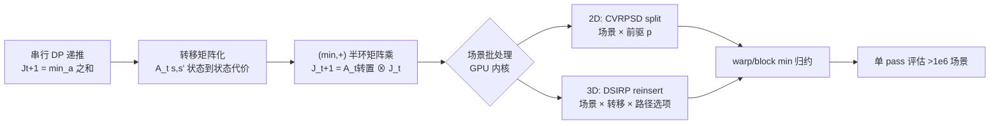

# From Sequential to Parallel: Reformulating Dynamic Programming as GPU Kernels for Large-Scale Stochastic Combinatorial Optimization

**会议**: ICLR 2026  
**OpenReview**: [https://openreview.net/forum?id=T9FDmsmoBj](https://openreview.net/forum?id=T9FDmsmoBj)  
**代码**: [https://github.com/Jingyi-poly/2-stage-IRP-GPU](https://github.com/Jingyi-poly/2-stage-IRP-GPU)  
**领域**: 随机组合优化 / GPU 并行 / 动态规划  
**关键词**: 随机规划, 样本平均近似(SAA), 动态规划, GPU 内核, min-plus 半环, 车辆路径, 库存路径  

## 一句话总结
把"逐场景串行求解第二阶段整数子问题"的随机组合优化瓶颈，重写成 (min,+) 半环上的矩阵-向量乘法，并设计场景批处理的硬件感知 GPU 内核，让 Bellman 更新在单次 GPU pass 内并行评估超过 $10^6$ 个场景，带来一到五个数量级的加速。

## 研究背景与动机
**领域现状**：场景式随机规划(SP)常用样本平均近似(SAA)——抽 $m$ 个场景，对每个场景求解第二阶段(recourse)问题再取平均。理论上 SAA 解随场景数以 $O(1/\sqrt{m})$ 收敛到真优，场景越多偏差越小、决策越稳。

**现有痛点**：当第二阶段嵌套一个 NP-hard 组合结构(如车辆路径、库存补货)时，对每个场景都做一次精确整数求解代价极高。为了让计算可行，大量 SP 文献被迫把第二阶段退化成线性或简化模型，牺牲真实性，反过来又拖累第一阶段决策质量。而真实世界里需求分布复杂、无法用简单参数族刻画，只用几百几千个场景根本不够。

**核心矛盾**：要么要"全保真整数 recourse"(真实但算不动)，要么要"大场景集"(统计上必需但算不起)，二者难以兼得。已有的 GPU 优化加速都集中在连续优化，离散、组合、场景式问题没有对应框架。

**本文目标**：在不依赖代理学习模型、不做结构松弛的前提下，让全保真整数第二阶段模型在 $10^6$ 量级场景下计算可行。

**核心 idea**：关键观察是——一旦第一阶段决策固定，各场景的第二阶段评估彼此**独立**，而其中大量依赖动态规划(DP)。**把串行 DP 重写为 (min,+) 矩阵运算**，再把"场景 × DP 转移 × 路径/动作选项"这几维并行性同时暴露给 GPU，用 warp/block 级归约 + 数值安全掩码实现批量 Bellman 更新。

## 方法详解

### 整体框架
论文给出一套通用配方：先把有限时段 DP 的前向递推改写成"状态到状态"的转移代价矩阵，使每个阶段的更新变成 (min,+) 半环下的矩阵-向量乘；然后把这个矩阵乘按"场景"和"转移"等维度铺到 GPU 线程上，用片上归约求每个场景的 Bellman 极小值。框架被实例化到两个代表性问题：随机需求车辆路径(CVRPSD)的 split 算子(2D 并行)，以及动态随机库存路径(DSIRP)的库存再插入 DP(3D 并行)。

### 关键设计

**1. 转移矩阵化 + (min,+) 半环重写：把串行递推变成可批处理的矩阵乘。** 原始有限时段 DP 的递推是 $J^\omega_{t+1}(s')=\min_{s,a:\,g_t(s,a)=s'}\{J^\omega_t(s)+c^\omega_t(s,a)\}$，动作 $a$ 的存在使它天然串行、形状不规则。本文先把动作折叠进"状态到状态"的转移代价 $A^\omega_t(s,s')=\inf_{a:g_t(s,a)=s'} c^\omega_t(s,a)$(无可行转移记 $+\infty$)，递推就化为 $J^\omega_{t+1}(s')=\min_s\{J^\omega_t(s)+A^\omega_t(s,s')\}$。把状态空间索引化后，这恰好是 (min,+) 半环上的矩阵-向量积 $J^\omega_{t+1}=(A^\omega_t)^\top\otimes J^\omega_t$，其中 $\otimes$ 把普通乘法换成加法、求和换成取 min。这一步的妙处在于：不可行/不存在的转移统一用 $+\infty$ 掩码，变长状态空间通过 padding 对齐成规则张量，从而让 GPU 的张量广播 + 维度方向 min-reduction 直接吃下整批场景。

**2. CVRPSD split 算子的 2D 并行：场景 × 前驱状态。** 车辆路径后处理常要把一条"巨型 tour" $\sigma$ 切成容量可行的子路。定义状态 $i$ 为已服务到 $\sigma_i$，动作是选一个切点 $p<i$ 结束上一条路、从 $p{+}1$ 开新路。子路代价 $W^\omega(p,i)$ 只有在 $\sum_{k=p+1}^{i} q^\omega_{\sigma_k}\le Q$(容量不超)时才可行，否则掩码为 $+\infty$。更新写成掩码 (min,+) 归约 $J^\omega(i)=(A^\omega(\cdot,i))^\top\otimes J^\omega(0{:}i{-}1)$。在固定目标状态 $i$ 时，计算在笛卡尔积 $\Omega\times\{p:p<i\}$ 上分解：每个线程算一个 $(\omega,p)$ 对，加载 $A^\omega(p,i)$ 与部分代价 $J^\omega(p)$ 求和，再对 $p$ 做 warp/block 级 min 归约得到该场景的 $J^\omega(i)$。场景沿列并行、前驱在块内归约、状态行沿 DP 前沿独立推进——这就是 2D 并行(场景 × 转移)。

**3. DSIRP 再插入 DP 的 3D 并行：场景 × 库存转移 × 路径选项。** 库存路径里，某个有缺货风险的客户 $i$ 要在补货计划上做局部再插入，需权衡"早送→持有成本高"与"晚送→缺货概率高"。每天决策是否补货、补多少($q^t_i\in\{0,\,U_i-I^{t-1}_i\}$，要么不送要么补满)、走哪条路；库存按 $I^{t,\omega}_i=\max\{0,I^{t-1,\omega}_i+q^t_i-d^{t,\omega}_i\}$ 随场景演化。把动作空间折叠成转移矩阵 $A^{t,\omega}_i(I,J)$ 时，每个条目本身可能还要在一组候选路径 $r\in\mathcal{R}$ 上取 min。于是计算在 $\Omega\times\{I\to J\}\times\mathcal{R}$ 三维笛卡尔积上分解：每个线程算一个三元组 $(\omega,I\to J,r)$，先对路径选项 $r$ 做一级 min 归约、再对前驱状态 $I$ 做二级归约，得到 $J^{t+1}_i(J)$。这种两级归约把额外的"路径选择"维度也向量化进同一个内核。

**4. 硬件感知的 Bellman 归约：数值安全掩码 + 片上归约。** 内核用 warp/block 级归约把 Bellman 极小值留在片上(on-chip)，配合 coalesced 内存访问提升算术强度；不可行转移用 $+\infty$ 掩码保证数值安全(不会污染 min)。论文还给出 GPU 显存研究：$10^6$ 场景的现实实例能塞进标准 11GB GPU，确认显存不是规模瓶颈，并把"DP 子程序→高吞吐 GPU 原语"的转换总结成通用配方。

## 实验关键数据

硬件：AMD Ryzen 7 9700X(8 核)CPU + NVIDIA RTX 2080Ti(11GB)GPU，全部 C++/CUDA 实现。对比 CPU 单线程、CPU 8 线程、CPU 矩阵实现与 GPU 矩阵实现。

### 主实验：加速比

| 任务 | 场景规模 | GPU vs 单线程 CPU | GPU vs 多线程 CPU | GPU vs CPU 矩阵 |
|------|----------|-------------------|-------------------|------------------|
| CVRPSD split | $10^6$ | ~65× (峰值附近) | ~15× | — |
| DSIRP reinsert | $2\times10^5$ | ~9.3×10⁴ (≈28370×–24744× 区间) | ~5000–6900× | ~3.1–3.9× |

CVRPSD 上 GPU 曲线随场景数近似线性增长，$10^6$ 场景仍在秒级；CPU 单线程升到分钟级、8 线程因同步与内存带宽很快饱和。DSIRP 因 3D 并行 + 高算术强度 + 片上归约，加速更夸张，达四到五个数量级。

### 决策质量(SAA 收敛与时间预算)

| 实验 | 结论 |
|------|------|
| SAA 偏差(DSIRP, 随机/正态需求) | 少量场景系统性低估真期望，随场景数增大逐步稳定，符合一致性理论 |
| 收敛速率 | 场景从几百到几万，估计以 $O(1/\sqrt{m})$ 逼近真优，log 图显示大样本仍持续改进、无早停平台 |
| 固定场景数决策 | 用 1/100/1000 场景求解、在 $10^6$ 外样本集评估(x-n128, x-n105)，场景越多解越稳越低 |
| 固定时间预算 | 同样 wall-clock 下 GPU 始终更接近真优；CPU 单线程停滞、多线程仅小幅改进 |

### 关键发现
- 大场景集在统计上**必需**(降偏差、保一致性)，本文证明它在计算上也**可行**。
- 计算杠杆直接转化为决策质量：同时间预算内能评估更多场景 + 更多第一阶段候选，SAA 解稳定更优。
- 与 CVRPSD 的 extensive-form MILP(Gurobi)及 DSIRP 的 SOTA 算法(Coelho et al., 2012)对比，本文在更大场景集下仍可解且常得更优解。
- 加速来源拆解清晰：DSIRP 的巨大增益主要来自 (i) 3D 并行(场景×库存转移×路径选项)、(ii) coalesced 访存带来的高算术强度、(iii) warp/block 级归约把 Bellman 极小值留在片上，三者叠加才有四到五个数量级提升。
- GPU 矩阵实现相对 CPU 矩阵实现仍有稳定 ~3.1–3.9× 增益，说明收益不仅来自"矩阵化算法"本身，硬件级并行的贡献同样关键。

## 亮点与洞察
- **"串行 DP → (min,+) 矩阵乘"是真正的破题点**：它把一个看似不可并行的递推，转成 GPU 最擅长的批量张量运算，且掩码机制干净处理了可行性与变长状态。
- **多维并行的层次划分清晰**：2D(场景×前驱) vs 3D(场景×转移×路径)对应两类问题结构，给出了"该问题有几维并行就铺几维"的可迁移配方。
- **把"算得快"严格连到"解得好"**：不止报加速比，还用 SAA 偏差/收敛 + 固定时间预算实验闭环论证计算优势如何转化为决策优势。
- **务实**：$10^6$ 场景塞进 11GB 消费级 GPU，显存不是瓶颈，落地门槛低。

## 局限与展望
- **仅验证两类 DP 算子**(CVRPSD split、DSIRP reinsert)，更一般的 recourse 结构(如带复杂约束的多商品流、随机调度)能否同样高效仍待验证。
- **依赖问题具有规整的 (min,+) 结构**：当转移代价本身需要昂贵子优化、或状态空间极不规则时，padding/掩码可能造成大量浪费。
- **第一阶段仍靠外层启发式/枚举**：本文加速的是第二阶段评估，第一阶段搜索策略本身未深入优化。
- 展望：把配方扩展到 GPU 上的多阶段(>2 阶段)随机 DP、与可微优化/学习型 warm-start 结合，或自动从 DP 描述生成 GPU 内核。

## 相关工作与启发
- **随机规划 / SAA**：Birge & Louveaux, Shapiro et al. 等奠定 SAA 理论；本文延续其一致性结论但突破其计算限制。
- **DP 经典**：Held–Karp(TSP)、伪多项式背包、Bellman/Dijkstra 最短路，以及车辆/库存路径中的 split 算子、资源约束最短路 pricing。
- **GPU 优化加速**：此前集中在连续优化(如一阶法/内点法的 GPU 化)，本文填补离散组合场景式问题的空白。
- **启发**：(min,+) 半环是连接"DP 串行递推"与"GPU 批量线性代数"的通用桥梁——任何能写成半环矩阵乘的算法都可能借此并行化，这对图算法、序列对齐、调度等领域有迁移价值。

## 评分
- **新颖性**: ⭐⭐⭐⭐ — "串行 DP 重写为 (min,+) GPU 内核"思路本身有半环 DP 先例，但把它系统落到场景式随机组合优化、并暴露 2D/3D 多维并行，是扎实且少有人做的工程-理论结合。
- **实验充分度**: ⭐⭐⭐⭐ — 两类代表问题、与 Gurobi/SOTA 对比、加速比 + SAA 收敛 + 固定时间预算三类证据闭环，较完整；但问题覆盖面偏窄。
- **写作质量**: ⭐⭐⭐⭐ — 公式推导清晰，2D/3D 并行配图直观，动机-方法-验证链条连贯。
- **价值**: ⭐⭐⭐⭐ — 让 $10^6$ 场景的全保真整数 recourse 在消费级 GPU 上可行，对运筹/物流落地有直接实用价值，且配方可迁移。

<!-- RELATED:START -->

## 相关论文

- [\[ICLR 2026\] FrontierCO: Real-World and Large-Scale Evaluation of Machine Learning Solvers for Combinatorial Optimization](frontierco_real-world_and_large-scale_evaluation_of_machine_learning_solvers_for.md)
- [\[ICLR 2026\] NeuCLIP: Efficient Large-Scale CLIP Training with Neural Normalizer Optimization](neuclip_efficient_large-scale_clip_training_with_neural_normalizer_optimization.md)
- [\[ICLR 2026\] Symmetry-Aware Bayesian Optimization via Max Kernels](symmetry-aware_bayesian_optimization_via_max_kernels.md)
- [\[ICLR 2026\] A Memory-Efficient Hierarchical Algorithm for Large-scale Optimal Transport Problems](a_memory-efficient_hierarchical_algorithm_for_large-scale_optimal_transport_prob.md)
- [\[ICML 2026\] Efficient Stochastic Optimisation via Sequential Monte Carlo](../../ICML2026/optimization/efficient_stochastic_optimisation_via_sequential_monte_carlo.md)

<!-- RELATED:END -->
