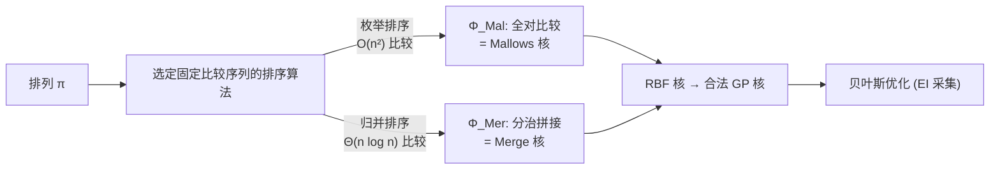

# From Sorting Algorithms to Scalable Kernels: Bayesian Optimization in High-Dimensional Permutation Spaces

**会议**: ICLR 2026  
**OpenReview**: [https://openreview.net/forum?id=7QtKdabBP9](https://openreview.net/forum?id=7QtKdabBP9)  
**代码**: [https://github.com/XieZikai/MergeBO](https://github.com/XieZikai/MergeBO)  
**领域**: 贝叶斯优化 / 排列空间优化 / 高斯过程核设计  
**关键词**: Bayesian Optimization, Permutation Space, Mallows Kernel, Merge Sort, Gaussian Process, High-Dimensional  

## 一句话总结
把"比较型排序算法"重新解读为排列的特征生成器，从而把 SOTA 的 Mallows 核统一为枚举排序的特例，并用归并排序导出长度只有 $\Theta(n\log n)$ 的 **Merge Kernel**，在高维排列贝叶斯优化中以数量级更小的特征维度大幅超越 Mallows 核。

## 研究背景与动机
- **领域现状**: 贝叶斯优化（BO）用高斯过程（GP）作代理模型、用采集函数在最少评估次数下逼近黑盒最优，已广泛用于超参调优、组合材料发现、催化剂设计等。把 BO 扩展到一个新搜索空间，本质上等价于为该空间设计一个合适的核函数。
- **现有痛点**: 排列空间（TSP、设施分配、加序实验等）虽然无处不在却长期欠研究。当前 SOTA 是 BOPS-H 用的 **Mallows 核**，它把排列映射成对所有 $\binom{n}{2}$ 对元素做穷举比较的特征向量，复杂度 $\Omega(n^2)$。低维下有效，但维度 $n$ 一大就出现巨大统计冗余（$2^{n^2}\gg n!$）且计算上不可行。通用离散 BO（如 COMBO 用图编码）又抓不住排列的结构约束。
- **核心矛盾**: 排列核既要**无信息损失地**编码顺序关系，又要在高维下保持**紧凑、可计算**——而穷举式 $O(n^2)$ 表示天然违背后者。
- **本文目标**: 提出一个排列核的统一设计框架，并实例化出一个特征长度达到信息论下界的高效核，使 BO 能处理大规模排列问题（大规模特征排序、组合式神经架构搜索）。
- **核心 idea**: **【洞察】任何基于比较的排序算法都由一串固定的元素比较序列定义，记录每次比较的二元结果就得到一个排列特征向量**；选用比较树确定的算法（如归并排序）即可得到既定长又紧凑的表示，而 Mallows 核恰好对应"枚举排序"。

## 方法详解

### 整体框架
论文把"排列核设计"问题转化为"选一个比较型排序算法当特征生成器"。给定排列 $\pi$，让排序算法跑一遍并记录每次比较是否发生交换，得到二元特征向量 $\Phi(\pi)\in\{0,1\}^d$，再套一个 RBF 核 $K(\pi,\pi')=K_{\text{RBF}}(\Phi(\pi),\Phi(\pi'))$。由于 RBF 核严格正定、且正定性在确定性映射 $\Phi$ 复合下保持，这样构造的核自动满足 Mercer 条件，是合法核。框架的关键约束是排序必须执行**固定比较序列**，于是 Mallows 核（枚举排序，$d=\binom{n}{2}$）只是其中一个端点，而归并排序给出另一端点 $d=\Theta(n\log n)$。

### 关键设计

**1. 排序即特征：用 RBF 把 Mallows 核重写成统一框架的特例。** 出发点是观察到 Mallows 核 $K_{\text{Mal}}(\pi,\pi')=\exp(-l\,d(\pi,\pi'))$（$d$ 为 Kendall-$\tau$ 不一致对数）可以等价改写为对全对比较特征 $\Phi_{\text{Mal}}(\pi)\in\{0,1\}^{\binom{n}{2}}$ 套 RBF 核：在重参数化 $l=\tfrac{1}{2\ell^2}$ 下，$K_{\text{Mal}}(\pi,\pi')=\exp\!\big(-\|\Phi_{\text{Mal}}(\pi)-\Phi_{\text{Mal}}(\pi')\|^2/2\ell^2\big)=K_{\text{RBF}}(\Phi_{\text{Mal}}(\pi),\Phi_{\text{Mal}}(\pi'))$。这一步的意义在于：既然 Mallows 核 = "穷举所有元素对比较"+RBF，那么换任何一种比较策略都能得到合法核，而枚举排序（逐个元素与其余全部比较再定位）正是这种穷举策略，于是 Mallows 核被自然解读为"枚举排序导出的核"。

**2. 固定比较图约束：为什么只能用归并/双调排序而排除快排。** 要让 $\Phi(\pi)$ 各坐标含义一致、可比距离，排序算法必须对任意输入都执行**相同的比较序列**——否则两个特征向量同一位置编码的是不同含义。这直接排除了快排这类自适应算法。论文实现了一个**稳定化归并排序**，在每个 merge 步强制做 $L+R-1$ 次冗余比较（每次比较两子序列的当前首元素），从而保证每个特征位稳定地编码同一处局部结构决策。这是把"排序算法"安全用作核特征的工程关键。

**3. Merge Kernel：分治递归拼接出 $\Theta(n\log n)$ 的无损紧凑编码。** 特征构造镜像归并排序的递归：(1) 把序列对半切；(2) 递归生成左右半的特征 $\Phi_{\text{Left}},\Phi_{\text{Right}}$；(3) 归并两个已排序半段，把每次比较的二元结果记入 $\Phi_{\text{Merge}}$；最终 $\Phi_{\text{Mer}}=[\Phi_{\text{Left}},\Phi_{\text{Right}},\Phi_{\text{Merge}}]$。以 $\pi=(1,4,3,2)$ 为例：切成 $(1,4),(3,2)$，左半得 $[0]$、右半得 $[1]$，末次归并 $(1,4)$ 与 $(2,3)$ 产生 $[0,1,1,1]$，拼接得 $\Phi_{\text{Mer}}=[0,1,0,1,1,1]$。核仍为 $K_{\text{Mer}}=K_{\text{RBF}}(\Phi_{\text{Mer}}(\pi),\Phi_{\text{Mer}}(\pi'))$。

**4. 达到信息论下界，代价是放弃右不变性。** 由于比较型排序的时间复杂度下界为 $\Omega(n\log n)$，而二元无损编码全部 $n!$ 个排列需要至少 $\log_2(n!)=\Omega(n\log n)$ 位（Stirling 近似），Merge 特征长度恰好触到这个下界——既无损又最短。但代价明确：传统排列距离应满足**右不变性**（同时右乘相同置换不改变距离），而完全右不变 + 无损只能由 $O(n^2)$ 穷举比较得到。Merge 核为了效率舍弃了部分右不变性，因此论文把 Merge↔Mallows 视为一条"特征选择"谱：往 $\Phi_{\text{Mer}}$ 里逐步补回缺失的比较位，就是用计算效率"赎回"右不变性、逐渐逼近 $\Phi_{\text{Mal}}$ 的过程。

## 实验关键数据

### 特征长度对比（Merge 的核心优势）

| 问题 | 维度 $n$ | Merge 特征长度 | Mallows 特征长度 |
|------|------|------|------|
| TSP | 15 | 45 | 105 |
| QAP | 15 | 45 | 105 |
| FP | 30 | 119 | 435 |
| CR | 30 | 119 | 435 |
| TTP | 280 | **2009** | **39060** |

维度越高优势越大：$n=280$ 时 Merge 特征仅为 Mallows 的约 1/19。

### 主实验：Simple Final Regret（20/50 trials，越小越好）

| 问题 | Merge | Mallows | Random | TuRBO | 胜/平/负 |
|------|------|------|------|------|------|
| TSP$_{n=15}$ | 0.077±0.125 | **0.013±0.039** | 0.329 | 1.213 | 1/12/7 |
| QAP$_{n=15}$ | 14.9±5.5×10³ | **8.1±4.1×10³** | 18.1×10³ | 14.2×10³ | 1/3/16 |
| FP$_{n=30}$ | **24.0±9.7** | 30.1±12.8 | 35.7 | 20.5 | 10/4/6 |
| CR$_{n=30}$ | **6.1±2.2** | 6.1±3.0 | 52.2 | 33.9 | 9/3/8 |
| TTP1$_{n=280}$ | **23.0±11.3×10³** | 88.9×10³ | — | 54.8×10³ | 50/0/0 |
| TTP2$_{n=280}$ | **14.9±7.2×10⁴** | 56.5×10⁴ | — | 36.8×10⁴ | 50/0/0 |
| TTP3$_{n=280}$ | **8.0±3.2×10⁴** | 28.1×10⁴ | — | 19.1×10⁴ | 50/0/0 |

### 关键发现
- **低维平手**: 在 $n=15$ 的 TSP/QAP 上 Mallows 凭完整右不变性领先；到 $n=30$ 的 FP/CR，Merge 已反超或持平，验证"随维度升高优势浮现"的中心论点。
- **高维碾压**: 三个 $n=280$ 的 TTP 上 Merge 在全部 50 次 trial 上击败 Mallows（50/0/0），且 final regret 普遍优于 Mallows 一半以上，同时优于通用高维 BO 算法 TuRBO。
- **不是单纯"压缩"的功劳**: Random 基线（从 Mallows 特征里随机抽到与 Merge 同维度）表现明显更差，说明 Merge 的增益来自归并保留的**结构化信息**而非维度缩减本身；且 Random 缺乏结构一致性，在 TTP 的连续松弛投影中根本无法定义合法投影，无法适用于高维。

## 亮点与洞察
- **概念统一**: "排序算法 = 排列特征生成器"是一个简洁而有解释力的视角，把 SOTA Mallows 核降格为枚举排序这一极端特例，给排列核设计开了一整个设计空间。
- **触及信息论下界**: Merge 核的 $\Theta(n\log n)$ 同时是排序比较次数下界与无损编码长度下界，"最短且无损"有理论背书。
- **诚实的 trade-off 叙事**: 论文不回避 Merge 牺牲右不变性这一弱点，反而把 Merge↔Mallows 解释成一条可插值的特征选择谱，理论上自洽、也给后续工作留了明确接口。

## 局限与展望
- **低维劣势真实存在**: 在 $n\le15$ 的小问题上 Mallows 因完整右不变性仍更优，Merge 的定位明确是"高维才香"。
- **右不变性的边际价值未量化**: "逐步补比较位赎回右不变性"只是定性图景，缺少量化每增加一次比较带来多少不变性增益的分析工具，被列为未来工作。
- **比较序列依赖切分方式**: 归并的固定比较图依赖对半切分顺序，特征对元素初始排布有路径依赖，不同切分策略的影响（附录 B.1 略有讨论）仍可深挖。
- **复现差异**: 作者指出与原 BOPS-H 论文存在数值差异，归因于未公开的实现细节（如问题实例选择），实验主要在自家统一框架内做受控对比。

## 相关工作与启发
- **承接 BOPS-H / Mallows 核**（Deshwal et al., 2022）: 本文直接以其为主基线并将其纳入统一框架，是"在 SOTA 之上做概念重构"的范例。
- **对照通用离散/高维 BO**: 与 COMBO（图编码离散 BO）、TuRBO（高维连续 BO + 连续松弛）对比，凸显排列专用紧凑核的价值。
- **启发**: "把一个经典算法的执行轨迹当作特征/编码"是可迁移的思路——任何具有固定执行路径的确定性算法都可能被改造成结构化嵌入，用于树、图、序列等其它组合空间的核设计。

## 评分
- **新颖性**: ⭐⭐⭐⭐⭐ "排序算法即排列特征生成器"的统一视角既漂亮又有解释力，把 SOTA 收编为特例并导出触及信息论下界的新核。
- **实验充分度**: ⭐⭐⭐⭐ 覆盖低维合成/真实问题与高维 TTP，含 Random 与 TuRBO 等关键消融/对照，统计检验严谨；略缺更大规模与更多排序算法实例的横向对比。
- **写作质量**: ⭐⭐⭐⭐⭐ 动机—理论—权衡—实验逻辑闭环，trade-off 叙事诚实清晰，公式与示例到位。
- **价值**: ⭐⭐⭐⭐ 直接解锁高维排列 BO（大规模特征排序、组合 NAS）这一此前不可行的场景，框架可扩展性强。

<!-- RELATED:START -->

## 相关论文

- [\[ICLR 2026\] Symmetry-Aware Bayesian Optimization via Max Kernels](symmetry-aware_bayesian_optimization_via_max_kernels.md)
- [\[ICLR 2026\] High-dimensional Mean-Field Games by Particle-based Flow Matching](high-dimensional_mean-field_games_by_particle-based_flow_matching.md)
- [\[ICLR 2026\] Local Entropy Search over Descent Sequences for Bayesian Optimization](local_entropy_search_over_descent_sequences_for_bayesian_optimization.md)
- [\[ICLR 2026\] High-dimensional limit theorems for SGD: Momentum and Adaptive Step-sizes](high-dimensional_limit_theorems_for_sgd_momentum_and_adaptive_step-sizes.md)
- [\[ICLR 2026\] Incorporating Expert Priors into Bayesian Optimization via Dynamic Mean Decay](incorporating_expert_priors_into_bayesian_optimization_via_dynamic_mean_decay.md)

<!-- RELATED:END -->
