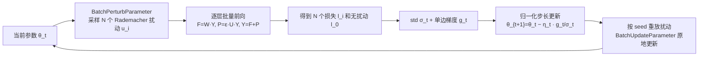

# FZOO: Fast Zeroth-Order Optimizer for Fine-Tuning Large Language Models towards Adam-Scale Speed

**会议**: ICLR 2026  
**OpenReview**: [https://openreview.net/forum?id=NMlF3YjS8E](https://openreview.net/forum?id=NMlF3YjS8E)  
**代码**: [https://github.com/DKmiyan/FZOO](https://github.com/DKmiyan/FZOO)  
**领域**: 优化方法 / 零阶优化 / LLM 高效微调  
**关键词**: 零阶优化, ZO, MeZO, normalized-SGD, Rademacher 扰动, 显存高效微调  

## 一句话总结
FZOO 用「批量单边估计 + Rademacher（±1）扰动」把零阶优化器拉到接近 Adam 的收敛速度——既靠批损失标准差自适应步长把收敛所需前向次数砍掉一个量级，又靠 ±1 扰动把多次前向并成一次批量矩阵乘，让单卡全参数微调 LLM 在推理级显存下变得现实。

## 研究背景与动机
**领域现状**：微调 LLM 的主流仍是 Adam 这类一阶优化器，但反向传播要缓存全部激活和梯度，显存常常飙到推理的 10 倍以上——微调 OPT-30B 就要吃掉 633 GB 显存，直接撞上"显存墙"。绕过这堵墙有两条路：PEFT（如 LoRA）只更新一小撮权重，但仍需反向传播、且在难任务上常落后全参数微调；零阶优化（ZO，如 MeZO）则彻底不要反向，只用前向差分估计梯度，把显存压回推理级。

**现有痛点**：ZO 省显存的代价是慢得离谱。MeZO 用固定学习率，在 RoBERTa-large 上收敛比 Adam 慢约 20×，需要几十倍的步数。慢有三处根源：(1) **步长不自适应**——Adam 靠动量做自适应步长但占显存，ZO 却退化成低效的固定步长；(2) **扰动采样贵**——经典 ZO 用高斯噪声，每次梯度估计都要生成大量扰动并做完整矩阵-向量乘，即便批量执行也省不下这部分算力，吃不到硬件并行；(3) **工程未优化**——理论上一步 Adam（≈4 次前向）只比一步 MeZO（2 次前向）慢一倍，但由于前向没优化好，MeZO 实测单步反而比 Adam 还慢。

**核心矛盾**：ZO 的"省显存"和"慢收敛"看似是一对必然 trade-off，本文要问的是——**这个 trade-off 真的无法被根本改善吗？**

**本文目标**：做一个工程上打磨到位的 ZO 优化器，在推理级显存下逼近 Adam 量级的收敛速度。

**核心 idea**：**normalized-SGD 是关键启发**——它不用 Adam 那套贵动量，仅靠梯度归一化就能做出有效的自适应步长，且比 Adam 更省显存。FZOO 把 normalized-SGD 的思想搬进 ZO 域：用一批前向损失的标准差当作"梯度归一化"的代理来自适应步长（**减少收敛所需总前向数**），同时用 ±1 的 Rademacher 扰动替换高斯噪声（**把每批计算并行加速**）。

## 方法详解

### 整体框架
FZOO 在每一步做两件事：先用 BatchPerturbParameter 一次性算出 $N$ 个 Rademacher 扰动下的损失 $\{l_i\}$，由这批损失的标准差 $\sigma_t$ 自适应缩放步长；再用 BatchUpdateParameter 按种子重放扰动、把参数原地更新。两个改进正交叠加：自适应步长（减少 step 数）×Rademacher 批量并行（减少单 step 耗时），分别命中"收敛慢"和"单步慢"两个瓶颈。

### 关键设计

**1. 批量单边估计 + 标准差自适应步长：把 normalized-SGD 搬进 ZO 域。** MeZO 用对称双边差分 $\hat\nabla L=\frac{L(\theta+\epsilon z)-L(\theta-\epsilon z)}{2\epsilon}z$，两次前向才得一个估计。FZOO 改用单边估计——以无扰动损失 $l_0=L(\theta_t;B_t)$ 为基准，对 $N$ 个 Rademacher 向量算 $l_i=L(\theta_t+\epsilon u_i;B_t)$，梯度估计为 $g_t=\frac{1}{\epsilon N}\sum_{i=1}^N (l_i-l_0)u_i$。关键创新在步长：用这批损失的方差 $\sigma_t^2=\frac{1}{N-1}\sum_i (l_i-\bar l)^2$ 来归一化更新，$\theta_{t+1}=\theta_t-\eta_t\frac{g_t}{\sigma_t}$。直觉上，平坦区 $\sigma_t$ 小→步子大，陡峭区 $\sigma_t$ 大→步子小，复刻了 Adam 的自适应性却不需要动量。作者用 Proposition 3.2 给出理论支撑：$\sigma_t^2=|g_t|^2\cdot\epsilon^2\cdot\frac{N-1}{N}$，因此 $\frac{g_t}{\sigma_t}$ 本质就是一个被常数缩放的归一化随机梯度——FZOO 是 normalized-SGD 在零阶域的严格推广。变体 FZOO-R 进一步复用上一 mini-batch 一半的损失来估方差，半数前向就拿到整批方差估计。

**2. Rademacher（±1）扰动让多次前向坍缩成一次批量矩阵乘。** 这是单步提速的核心。经典 ZO 每个扰动单独跑一次前向，无法批量并行。FZOO 把每层计算拆成无扰动部分 $F^{(j)}=W^{(j)}Y^{(j-1)}$ 和扰动部分 $P^{(j)}$。若用高斯噪声，$P^{(j)}$ 仍是一次完整矩阵-向量乘，批量化几乎省不下；换成 ±1 的 Rademacher 向量后，扰动 $P^{(j)}=\epsilon(UY^{(j-1)})$（$U$ 是 $u_i$ 构成的块对角符号矩阵）只改符号位——退化成一次按位翻号的加/减，而非第二次矩阵乘，因为加法远比乘法便宜。这样 $N$ 个扰动的逐层前向能沿 batch 维拼在一起并行执行，把原本 $N$ 次串行前向压成一次批量计算。

**3. 三重提速因子叠加，逼近甚至反超 Adam 墙钟时间。** FZOO 把总加速拆成三个可乘因子：单边估计把前向次数减半（$f$）、并行批量执行带来的加速（$p$）、Rademacher 把矩阵乘换成加法带来的加速（$r$），合起来是 $f\times\min(p,r)$。在 OPT-125M、$N=8$ 上，仅批量方案（$\min(p,r)$）就比"8 扰动 + 8 前向"基线快 1.92×。配合自适应步长把总步数砍掉一个量级，FZOO 在 RoBERTa-large 上前向步数比 MeZO 快 18×，已逼近 Adam（20×）的水平；叠加 1.92× 并行后有望在墙钟时间上反超 Adam。

**理论保证**：在 $L$-smooth 与有界方差假设下，Theorem 3.6 证明 FZOO 满足 $\frac{1}{T}\sum_t \mathbb{E}\|\nabla L(\theta_t)\|^2\le \frac{4\sigma^*}{\sqrt T}(\cdots)$，要达到 $\varepsilon$ 精度需 $T=O(\varepsilon^{-2})$，与 SGD 在非凸优化下的收敛率一致。

## 实验关键数据

覆盖 RoBERTa-large、OPT 全家族（350M–66B）、Phi-2、Llama3 共多种模型，跨 11 个下游任务（分类 / 多选 / 生成）。所有方法在对齐 MeZO 的固定前向预算下评测（RoBERTa-large 200k 步，其余 40k 步）。

### 主实验表格

RoBERTa-large（350M，k=16，5 次平均准确率）：

| 方法 | SST-2 | SST-5 | SNLI | MNLI | RTE | TREC | Average |
|---|---|---|---|---|---|---|---|
| Zero-shot | 79.0 | 35.5 | 50.2 | 48.8 | 51.4 | 32.0 | 49.5 |
| FT (6×M) | 91.9 | 47.5 | 77.5 | 70.0 | 66.4 | 85.0 | 74.9 |
| HiZOO (2×M) | 93.2 | 46.2 | 74.6 | 64.9 | 66.8 | 79.8 | 70.9 |
| MeZO | 90.5 | 45.5 | 68.5 | 58.7 | 64.0 | 76.9 | 67.4 |
| **FZOO** | **93.3** | **47.6** | **75.9** | 64.9 | **67.9** | 78.8 | **71.4** |

FZOO 平均比 MeZO 高约 5.9%，在 SNLI/MNLI 上领先超 10.7%，逼近 HiZOO 但显存只在推理级。

更大模型（1000 样本，11 任务平均）：

| 模型 | Adam | MeZO | HiZOO-L | FZOO |
|---|---|---|---|---|
| Phi-2 (2.7B) | 71.2 | 70.7 | 71.4 | **73.0** |
| Llama3 (8B) | 81.6 | 75.4 | 75.2 | **77.2** |
| OPT-13B | 74.0 | 68.8 | 67.0 | **70.7** |

FZOO 平均比 MeZO 高 2.75%。在 OPT-30B/66B 全参微调上，FZOO 比 MeZO 平均高 2.43%、单任务最高 +13.2%（66B SST-2 91.2→93.6）。

### 消融实验表格

提速来源拆解与单步代价（$N=8$）：

| 任务 | SNLI | COPA | WIC | CB |
|---|---|---|---|---|
| FZOO 实际加速 | 20× | 10× | 9× | 8× |
| 潜在加速（叠并行） | 40× | 20× | 18× | 16× |

单步前向数 9 次（比 MeZO 多 4.5×），但墙钟只多 3×——并行实现把多出来的前向"吃掉"了。与更广的 ZO 变体比（SST-2/COPA）：FZOO 比 ZO-Adam 全参微调平均 +5.77%、prefix +4.21%，且只用 40.5% 显存；runtime 仅为 ZO-SGD 的 0.56×（最快）。作为"即插即用"组件替换混合 FO-ZO 框架 Addax 内部的 MeZO，OPT-2.7B 上平均准确率从 72.71→74.11（偏 FO 设置）、68.37→71.16（偏 ZO 设置）。

### 关键发现
- **速度-显存 trade-off 可被根本改善**：FZOO 在推理级显存下把 ZO 收敛拉到 Adam 量级（RoBERTa-large 18× vs Adam 20×）。
- **非可微目标也能优化**：以 F1 直接当优化目标，FZOO 在 OPT 各尺度上平均 F1 比 MeZO 高 5.53%。
- **正交可叠加**：FZOO 既能配 prefix-tuning 进一步省显存，也能无缝替换混合 FO-ZO 框架中的 ZO 组件并稳定提升。

## 亮点与洞察
- **把"损失标准差"当成自适应步长的免费信号**：批量前向本来就要算多个损失，顺手取标准差就拿到了 normalized-SGD 式的步长归一化，几乎零额外成本，这是从 normalized-SGD 到 ZO 的精妙迁移。
- **Rademacher 扰动的工程价值被讲透**：±1 不只是"另一种噪声"，而是把扰动从矩阵乘降级为加法、从而打开批量并行的大门——这是把 ZO 单步真正提速的关键 insight，常被忽视。
- **理论与工程双闭环**：既证明了与 normalized-SGD 的等价性和 $O(\varepsilon^{-2})$ 收敛率，又给出实测墙钟数据，论证完整。

## 局限与展望
- **单步墙钟仍偏慢**：Table 5 显示 FZOO 单步墙钟时间实际比 Adam/MeZO 更长（如 OPT-1.3B 1.66s vs MeZO 0.72s），其优势全靠总步数大幅减少；在前向本身很贵的超大模型上这笔账需要更细的核查。
- **潜在加速尚未完全兑现**：Table 6 显示"实际 vs 潜在"加速仍有 2× 差距，主实验为公平比较用的是非并行变体，并行实现的端到端收益还没在所有任务上跑满。
- **任务上仍有掉点**：在 ReCoRD、DROP 等任务上 FZOO 未必胜过 MeZO，方差归一化对不同损失景观的适配性有待进一步分析。
- **面向预训练的展望**：作者指出该思路指向"显存高效预训练"，但论文只验证了微调，预训练规模下的稳定性与收敛仍是开放问题。

## 相关工作与启发
- **一阶自适应方法**：Adam/AdamW 靠动量做自适应步长但占显存；normalized-SGD 仅靠梯度归一化就能媲美 Adam——这是 FZOO 的直接思想源头。
- **零阶优化**：经典 SPSA 估计器、MeZO（首个证明纯前向可高精度微调 LLM、省显存最高 12×）、HiZOO（用对角 Hessian 线索加速）——FZOO 在 MeZO 基线上同时改步长和扰动。
- **批量化 ZO**：ReLIZO（复用/关联方向提样本效率）、DeepZero（坐标级并行 + 特征复用扩展 ZO），与 FZOO 的"激活复用 + 批量并行"哲学相通。
- **启发**：把"自适应性"从需要存状态的动量，重新理解为可由前向统计量（损失标准差）廉价获得的归一化——这一视角对所有显存受限的优化场景都有借鉴意义。

## 评分
- **新颖性**: ⭐⭐⭐⭐ 把 normalized-SGD 严格迁移进 ZO 域、并用 Rademacher 扰动打开批量并行，两点结合是扎实的新组合，理论等价性证明加分。
- **实验充分度**: ⭐⭐⭐⭐ 覆盖 350M–66B 多家族模型、11 任务、可微/非可微目标、显存与墙钟全测，还验证了与 prefix-tuning 和 Addax 的正交性。
- **写作质量**: ⭐⭐⭐⭐ 动机三点拆解清晰、提速因子 $f\times\min(p,r)$ 讲法直观、理论与实验衔接顺畅。
- **价值**: ⭐⭐⭐⭐ 让单卡推理级显存下的高速全参数微调变得现实，对资源受限场景实用价值高，并为显存高效预训练指出方向。

<!-- RELATED:START -->

## 相关论文

- [\[ICML 2026\] Learning a Zeroth-Order Optimizer for Fine-Tuning LLMs](../../ICML2026/optimization/learning_a_zeroth-order_optimizer_for_fine-tuning_llms.md)
- [\[ICLR 2026\] Bi-LoRA: Efficient Sharpness-Aware Minimization for Fine-Tuning Large-Scale Models](bi-lora_efficient_sharpness-aware_minimization_for_fine-tuning_large-scale_model.md)
- [\[ICCV 2025\] Zeroth-Order Fine-Tuning of LLMs in Random Subspaces](../../ICCV2025/optimization/zeroth-order_fine-tuning_of_llms_in_random_subspaces.md)
- [\[ICML 2026\] LiMuon: Light and Fast Muon Optimizer for Large Models](../../ICML2026/optimization/limuon_light_and_fast_muon_optimizer_for_large_models.md)
- [\[ICLR 2026\] New Hybrid Fine-Tuning Paradigm for LLMs: Algorithm Design and Convergence Analysis Framework](new_hybrid_fine-tuning_paradigm_for_llms_algorithm_design_and_convergence_analys.md)

<!-- RELATED:END -->
