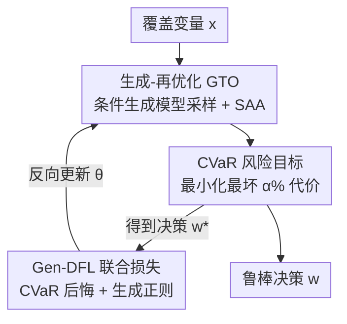

# Gen-DFL: Decision-Focused Generative Learning for Robust Decision Making

**会议**: ICLR 2026  
**OpenReview**: [https://openreview.net/forum?id=GU2197a3Lm](https://openreview.net/forum?id=GU2197a3Lm)  
**代码**: https://github.com/kingofspace0wzz/gen_dfl  
**领域**: 决策聚焦学习 / 随机优化  
**关键词**: 决策聚焦学习, 鲁棒优化, 生成模型, CVaR, 不确定性建模

## 一句话总结
Gen-DFL 把传统决策聚焦学习（DFL）里的"单点预测"换成一个条件生成模型，让模型直接学出优化参数的完整条件分布并从尾部高风险区域采样，再用 CVaR 目标做端到端训练，从而在高维、风险敏感的决策问题上显著降低决策后悔（regret）。

## 研究背景与动机

**领域现状**：很多现实决策（供应链、电网调度、投资组合、交通规划）都要"先用机器学习预测未知参数 $c$（如需求、成本、收益），再拿预测值喂给优化器求决策 $w$"。最朴素的做法叫 predict-then-optimize（PTO）：预测和优化两段分开，预测器只管最小化 MSE。决策聚焦学习（DFL）则把两段拼成一个端到端管线，直接对"决策后悔"求导，让预测服务于下游决策质量，而不是服务于预测精度本身。

**现有痛点**：DFL 虽然在低维、良态优化问题上优于 PTO，但有两个硬伤。其一是**可扩展性**：DFL 本质上还是输出一个单点估计 $\hat c=g_\theta(x)$，在高维参数空间里受维度灾难拖累，无法刻画参数之间复杂的依赖结构，容易给出过度自信的估计。其二是**风险敏感性**：DFL 训练目标是平均情况下的决策代价，对尾部风险（最坏的那部分场景）没有任何显式建模，而金融、电网等高风险领域恰恰最在乎最坏 $\alpha\%$ 的结果。

**核心矛盾**：解决风险问题的经典工具是鲁棒优化（RO），它求解 $\min_w \max_{c\in U(x)} f(c,w)$，对不确定集 $U(x)$ 里的最坏情况做保护。但 RO 的不确定集要么靠启发式手工指定、抓不住真实数据动态，要么因为只盯着单个最坏点而**过度保守**。于是"建模尾部风险"和"避免过度保守"之间形成了一个 trade-off：单点 DFL 太冒进，硬不确定集 RO 太悲观。

**本文目标**：在高维、风险敏感设定下，既能显式管理尾部风险，又不至于过度保守，给出一个比 DFL 和 RO 都更灵活的端到端框架。

**切入角度**：与其用"固定的不确定集"硬框住可能的参数值，不如用深度生成模型把不确定性当作**可学习的分布** $p_\theta(c|x)$，从中按需采样高风险区域的样本，把"最坏情况"软化成"最坏 $\alpha\%$ 的分位区域"。

**核心 idea**：用"生成-再优化"（generate-then-optimize, GTO）替代"预测-再优化"，把决策目标写成对 $p_\theta(c|x)$ 的 CVaR 优化，并设计一个同时含决策后悔与生成损失的联合目标做端到端训练。

## 方法详解

### 整体框架

Gen-DFL 的输入是覆盖变量 $x$，输出是一个鲁棒决策 $w$。它把传统 DFL 的"预测器输出点估计"这一环，替换为"条件生成模型 + CVaR 优化"，整个流程在两步之间交替迭代直到收敛：

1. **Generate-Then-Optimize（GTO）**：用条件生成模型 $p_\theta(c|x)$ 采出一批样本 $\{c_k\}_{k=1}^{K}$，再用样本平均近似（SAA）求解 CVaR 优化问题，得到当前决策 $w^\star_\theta$。
2. **Model Learning**：在得到决策 $w^\star_\theta$ 后，用一个联合损失（决策后悔 + 生成正则）反向更新生成模型参数 $\theta$，让生成出的样本既贴近真实数据分布、又能导出高质量决策。

关键在于决策目标不再是最小化期望代价，而是最小化最坏 $\alpha\%$ 的代价，即 CVaR：

$$w^\star(x;\alpha) := \arg\min_w \mathrm{CVaR}_{c\sim p(c|x)}[f(c,w);\alpha].$$

这个 $\alpha$ 是一个统一旋钮：$\alpha\to 0$ 时退化成只看单个最坏点的鲁棒优化，$\alpha\to 1$ 时退化成标准的期望优化。Gen-DFL 因此在"保守"和"概率化风险感知"之间架了一座可调的桥。

### 关键设计

**1. 生成-再优化（GTO）：用可学习分布替换单点估计**

这一设计直击 DFL 的"单点预测扛不住高维与尾部"痛点。传统 Pred-DFL 只输出一个点估计 $\hat c$，这在目标函数线性时尚可（因为线性目标只依赖 $c$ 的期望，方差和高阶矩都无关紧要），但一旦目标非线性、维度升高，单点就丢掉了刻画风险所必需的分布信息。Gen-DFL 直接把确定性预测换成生成模型 $p_\theta(c|x)$，对它采样后用 SAA 求解 $w^\star_\theta(x;\alpha)=\arg\min_w \mathrm{CVaR}_{c\sim p_\theta(c|x)}[f(c,w);\alpha]$。与 RO 需要预先指定不确定集 $U(x)$ 不同，这里的不确定性是"学出来的"——模型能根据经验数据自适应地把概率质量摆到真正的高风险区域，而不是死框一个几何形状。

框架是模型无关的，作者本文选用**条件归一化流（CNF）**来建模 $p(c|x)$：它通过一个可逆映射 $g_\theta:\mathcal C\to\mathcal Z$ 把简单基分布（如高斯）变换成复杂目标分布，并按换元公式给出可精确计算的似然 $p_\theta(c|x)=p_Z(g_\theta(c;x))\,\big|\det \tfrac{\partial g_\theta(c;x)}{\partial c}\big|$。CNF 的可逆性 + 可精确求似然让它既能表达任意复杂的高维分布，又能稳定训练（后面实验也验证了 CNF 优于用 ELBO 近似的 VAE）。

**2. CVaR 风险目标：把"最坏情况"软化成"最坏 α% 的分位区域"**

这一设计解决"RO 只盯单个最坏点、过度保守"的痛点。Gen-DFL 用条件风险价值 CVaR 来量化尾部：给定置信水平 $\alpha$，

$$\mathrm{CVaR}[f(c,w);\alpha] = \mathbb E\big[f(c,w)\,\big|\,f(c,w)\ge \mathrm{VaR}_\alpha\big],$$

即"超过 VaR 阈值那部分尾部"的期望损失。把决策目标定为最小化这一尾部期望（式 5），相比 RO 的硬 min-max，它对不确定性的刻画更"软"也更概率化：不是只对一个极端点负责，而是对最坏 $\alpha\%$ 这一整片区域负责。$\alpha$ 越小越强调最坏结果、越保守；$\alpha=1$ 则回到对全分布的期望后悔。正因如此，这个目标统一了鲁棒优化与期望优化两个极端，让使用者按任务需要的风险等级自由调档。

**3. Gen-DFL 联合损失与对比式代理：让生成既贴数据又服务决策**

前两个设计搭好了"生成 + CVaR 优化"的骨架，但要端到端训练还有两个工程障碍。第一，真实分布 $p(c|x)$ 通常拿不到，无法直接算后悔。为此作者引入一个**辅助代理模型** $q(c|x)$，先在可得数据上训练好、之后固定，用它来估计 CVaR 形式的后悔 $\mathrm{Regret}_{\theta,q}(x;\alpha)$，于是总目标写成决策后悔 + 生成正则两项的加权：

$$\ell_{\text{Gen-DFL}}(\theta;q,\alpha) := \beta\cdot\mathbb E_x[\mathrm{Regret}_{\theta,q}(x;\alpha)] + \gamma\cdot \ell_{\text{gen}}(\theta),$$

其中 $\ell_{\text{gen}}(\theta)$ 是生成模型自身的损失（如负对数似然、VAE 的 ELBO 或扩散模型的 score-matching），起正则作用、防止生成分布偏离真实数据太远；$\beta,\gamma$ 平衡"决策导向"和"拟合数据"两股力量（$\beta=0$ 时退化成纯生成模型、决策质量最差，增大 $\beta$ 持续改善下游决策）。

第二，要对决策后悔反传，需要算 $\partial w^\star_\theta/\partial c$，但穿过组合优化映射求导链条复杂。借鉴 Mulamba 等人的对比思路，作者用一个**代理对比损失**绕开：相对一个目标解 $w^\star$，从其它非目标解集合 $\mathcal S\subset \mathcal W\setminus\{w^\star\}$ 里取负样本 $w_s$，最小化目标解与负样本在 CVaR 下的代价差，从而无需直接对组合优化求导即可训练。

### 损失函数 / 训练策略

整体目标即上面的式 (7)：$\beta$ 加权的 CVaR 后悔项 + $\gamma$ 加权的生成损失项。实验中固定 $\gamma=1$，主要扫 $\beta$。训练采用 GTO 与 Model Learning 两步交替（详见原文 Algorithm 1）；评测用代理模型 $q(c|x)$ 来算平均相对后悔。理论上作者证明：代理损失与真损失之差被 $p,q$ 之间的 Wasserstein-1 距离上界控制（定理 5.1），且 Gen-DFL 相对 Pred-DFL 的后悔差随参数方差 $\|\mathrm{Var}[c|x]\|$、维度 $d_c+d_x$ 增大、风险水平 $\alpha$ 减小而越拉越开（定理 5.4），从理论上解释了"越难的问题 Gen-DFL 优势越大"。

## 实验关键数据

### 主实验

在 3 个合成任务（Portfolio、Fractional Knapsack、Shortest-Path）和 2 个真实任务（Energy 能耗调度、COVID 资源分配）上，以**平均相对后悔（越低越好）** 为指标对比多种 SOTA Pred-DFL 基线。高方差设定（$\sigma=20$）下部分代表性结果：

| 任务 | SPO+ | Diff-DRO | 2Stage(PTO) | Gen-DFL |
|------|------|----------|-------------|---------|
| Portfolio Deg-2 | 6.92 | 8.30 | 16.90 | **3.71** |
| Portfolio Deg-8 | 6.98 | 8.65 | 16.17 | **3.59** |
| Shortest-Path Deg-2 | 3.23 | 2.91 | 10.07 | **1.87** |
| Shortest-Path Deg-8 | 81.78 | 39.81 | 45.75 | **13.36** |
| Knapsack Deg-4 | 20.37 | 18.45 | 16.58 | **15.21** |
| Energy | 1.56 | 1.49 | 1.91 | **1.09** |
| COVID Resource | 17.94 | 16.41 | 18.46 | 16.86 |

Gen-DFL 在 Portfolio 上相对 Diff-DRO 最多降 58.5%、相对 SPO+ 最多降 48.5%；在高维的 Shortest-Path Deg-8 上相对 SPO+ 降 **83.7%**（13.36 vs 81.78），印证它靠"建模完整分布 $p(c|x)$"克服了维度灾难。而在 Knapsack Deg-2 这类低维任务上提升较温和（对 SPO+/Diff-DRO 仅 19.6% / 10.3%），说明生成建模的收益主要来自高维、强非线性的优化地形。

与传统数据驱动鲁棒优化（LRO、E2E-CRO、E2E-Conformal）相比（图 5），Gen-DFL 不学固定几何的不确定集去解硬 min-max，而是学完整生成模型直接刻画复杂不确定性并最小化 CVaR，随多项式次数升高仍保持低后悔。

### 消融实验

| 配置 | 现象 | 说明 |
|------|------|------|
| $\beta=0$ | 各风险等级后悔最差 | 退化成纯生成模型，完全不顾决策代价 |
| $\beta$ 增大 | 各风险等级决策质量持续改善 | 决策导向项越强、下游决策越好 |
| 训练 $\alpha=0.5$ vs $1.0$ | $\alpha=0.5$ 更优、风险越高差距越大 | 小 $\alpha$ 训练增强对尾部的鲁棒性 |
| 采样数 200 → 800 | 各风险等级后悔一致下降 | SAA 样本越多、不确定性建模越准 |
| 生成模型 CNF vs VAE | CNF 优于 VAE | 精确似然训练胜过 ELBO 近似 |

### 关键发现
- **维度越高、方差越大、风险越敏感，Gen-DFL 优势越明显**：与定理 5.4 的后悔差上界完全吻合，Shortest-Path Deg-8 上的 83.7% 降幅是最有力的实证。
- **$\beta$ 是决策质量的主开关**：$\beta=0$（纯生成）最差，说明真正起作用的是把决策代价注入生成模型训练，而非生成模型本身。
- **核心贡献在范式而非具体生成器**：CNF 比 VAE 好，但作者强调框架是模型无关的，主要价值在 Gen-DFL 这套"生成 + CVaR + 端到端"的范式。
- COVID 任务上各方法接近、Gen-DFL 不占优，提示在低维或不确定性结构简单的真实任务上收益有限。

## 亮点与洞察
- **用 $\alpha$ 一个旋钮统一了 RO（$\alpha\to0$）和期望优化（$\alpha\to1$）**：把过去两套割裂的方法论收进一个连续谱，使用者按风险偏好调档，这个视角很优雅且可迁移到其它风险敏感学习任务。
- **"把不确定集变成可学习分布"是核心范式转换**：RO 时代不确定集靠手工，Gen-DFL 让数据自己说话、自适应地把概率质量摆到高风险区，避免了启发式不确定集的过度保守。
- **代理对比损失绕开组合优化求导**：借负样本对比来训练，规避了 $\partial w^\star/\partial c$ 的复杂依赖链，这一 trick 可复用到其它需要穿过离散/组合优化反传的端到端任务。
- **理论与实验闭环**：定理给出后悔差随方差/维度/风险增大的上界，实验在 Shortest-Path 高维设定上正好观察到最大降幅，理论预测与现象对得很准。

## 局限与展望
- **依赖代理模型 $q(c|x)$ 的质量**：真分布不可得时整套后悔评估都建立在 $q$ 上，定理 5.1 也表明误差被 $W(p,q)$ 控制——若 $q$ 拟合得差，Gen-DFL 的优势会被侵蚀，但论文未深入讨论 $q$ 失配的鲁棒性。
- **生成 + SAA 带来额外计算开销**：每步都要从生成模型采样并解 CVaR 优化，相比单点 Pred-DFL 成本更高，论文未给出训练/推理时间对比。
- **低维、简单不确定性任务收益有限**：COVID 任务上几乎与基线持平，说明该框架更适合高维强非线性场景。
- **生成模型选型未充分探索**：本文只对比了 CNF 与 VAE，扩散等其它生成器以及不同优化方案留作未来工作。

## 相关工作与启发
- **vs Pred-DFL（SPO+ / NCE / MAP / 排序类）**：它们都基于单点预测 + 平均情况后悔，Gen-DFL 改用完整条件分布 + CVaR 尾部后悔，区别在于"建模整个 $p(c|x)$ 而非一个 $\hat c$"，在高维风险敏感场景优势显著、低维优势收窄。
- **vs Diff-DRO（可微分布鲁棒优化层）**：Diff-DRO 把 DRO 作为可微层嵌入，仍偏向构造分布的不确定球；Gen-DFL 直接学生成模型刻画不确定性、用 CVaR 软化最坏情况，实验上 Portfolio 最多领先 58.5%。
- **vs 传统/数据驱动 RO（LRO / E2E-CRO / E2E-Conformal）**：RO 学固定几何的不确定集解硬 min-max、易过度保守；Gen-DFL 学完整分布并直接最小化 CVaR，随问题非线性升高仍稳健。

## 评分
- 新颖性: ⭐⭐⭐⭐⭐ 把生成模型嵌入 DFL、用 CVaR 统一 RO 与期望优化，范式转换清晰
- 实验充分度: ⭐⭐⭐⭐ 合成 + 真实任务覆盖较全、消融到位，但缺计算开销与代理失配分析
- 写作质量: ⭐⭐⭐⭐ 动机—方法—理论—实验闭环清楚，符号略密
- 价值: ⭐⭐⭐⭐ 对高维风险敏感决策（金融/电网/调度）有直接实用价值

<!-- RELATED:START -->

## 相关论文

- [\[ICLR 2026\] Diffusion-DFL: Decision-focused Diffusion Models for Stochastic Optimization](diffusion-dfl_decision-focused_diffusion_models_for_stochastic_optimization.md)
- [\[ICLR 2026\] Conformal Robustness Control: A New Strategy for Robust Decision](conformal_robustness_control_a_new_strategy_for_robust_decision.md)
- [\[ICLR 2026\] Distributionally Robust Optimization via Generative Ambiguity Modeling](distributionally_robust_optimization_via_generative_ambiguity_modeling.md)
- [\[ICLR 2026\] Generative Bayesian Optimization: Generative Models as Acquisition Functions](generative_bayesian_optimization_generative_models_as_acquisition_functions.md)
- [\[ICML 2026\] Bulk-Calibrated Credal Ambiguity Sets: Fast, Tractable Decision Making under Out-of-Sample Contamination](../../ICML2026/optimization/bulk-calibrated_credal_ambiguity_sets_fast_tractable_decision_making_under_out-o.md)

<!-- RELATED:END -->
