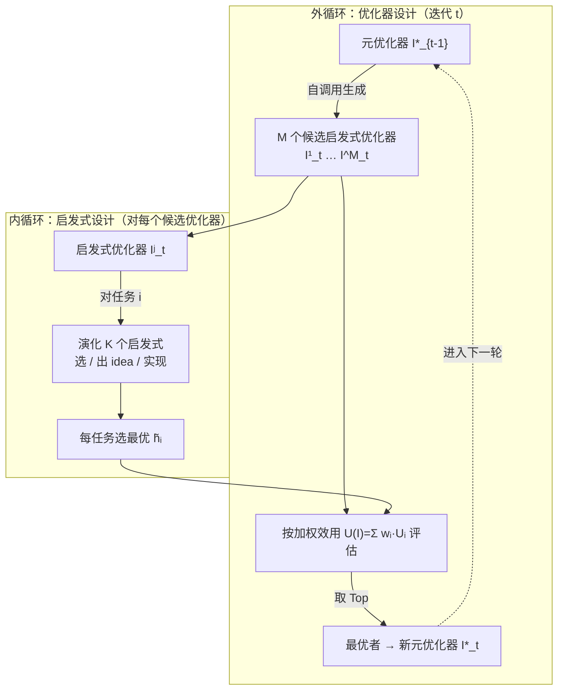

# Generalizable Heuristic Generation Through LLMs with Meta-Optimization

**会议**: ICLR 2026  
**代码**: [https://github.com/yiding-s/MoH](https://github.com/yiding-s/MoH)  
**领域**: optimization  
**关键词**: 组合优化, 启发式生成, 大语言模型, 元优化, 元学习, LLM-EC, 跨规模泛化  

## 一句话总结
MoH 把 LLM 生成启发式的层级从"用固定进化算法演化启发式"上抬一层，让 LLM 在外层迭代地"造优化器"——通过自调用产生一群多样的启发式优化器，再用多任务效用挑出最优的当作下一轮的元优化器，从而摆脱手工预设进化框架的约束、显著提升跨规模泛化能力。

## 研究背景与动机
**领域现状**：用 LLM 自动设计组合优化（COP）启发式是近两年的热门方向。FunSearch 首次证明可行后，主流做法演化为 LLM-EC 框架（EoH、ReEvo、HSEvo、MCTS-AHD 等）——用 LLM 充当进化计算里的交叉、变异算子，在一个固定大小的启发式种群上迭代，逐步演化出能解 TSP、BPP、CVRP 这类 NP-hard 问题的启发式代码。

**现有痛点**：这些方法被两件事卡住。一是**搜索空间被人工预设的进化框架钉死**——比如固定的"先交叉后变异"工作流，限制了对多样化启发式的探索，难以挖到更强的算法；二是**优化过程只面向单一任务**（固定规模的 COP），导致演化出的启发式泛化差。论文用 EoH 在 TSP 上做了实验（Fig. 1）：在 TSP100 上训出的启发式，随着测试规模增大到 500、1000，最优性 gap 急剧拉大；即便混入跨规模数据训练，大规模上依然力不从心。

**核心矛盾**：启发式优化器（heuristic-optimizer，即进化框架本身）是人手工定死的，而"什么样的优化框架最适合当前 COP 簇"恰恰应该被搜索，但现有工作把这一层当成了不可动的常量。

**本文目标**：让 LLM 不仅生成启发式，还**自动设计生成启发式的优化器**，并在多任务设置下训练，使得最终学到的优化器（及其产出的启发式）能稳健泛化到训练中未见过的更大规模任务。

**核心 idea**：**【元优化 + 自调用】**把优化器分成两级——"启发式优化器"负责为具体 COP 演化启发式，"元优化器"负责适配和改进这些启发式优化器。MoH 让元优化器通过 **(self-)invocation** 自己生成一群候选启发式优化器，用它们在所有下游任务上演化启发式、按加权效用打分，胜出者升级为下一轮的元优化器，形成一个"优化器层面的进化"外循环。

## 方法详解

### 整体框架
MoH 是一个外层"造优化器"、内层"造启发式"的两级嵌套优化循环。外循环里，当前元优化器 $I^*_{t-1}$ 通过自调用生成 $M$ 个候选启发式优化器；每个候选进入内循环，对 $N$ 个下游任务各演化出 $K$ 个启发式并选出最优；把各任务最优启发式的效用按任务权重加权汇总成该优化器的总效用，效用最高者成为新的元优化器 $I^*_t$。关键巧思在于：启发式和优化器共用同一套"个体结构 + 种群管理 + 函数签名"，使得优化器可以把自己作为输入递归地改进自己。

**N.1 两级优化目标：把"找启发式"升格成"找优化器"**。传统 LLM-EC 解决的是单任务启发式设计：用固定优化器 $I$ 在搜索空间 $\mathcal{H}_i$ 里找最优启发式 $\tilde{h}^I_i = \arg\max_{h^I_i \in \mathcal{H}_i} U_i(h^I_i, D_i)$，其中效用 $U_i$ 定义为解的最优性 gap 取负。MoH 不再把 $I$ 当常量，而是直接搜索优化器本身，目标改写为 $I^* \leftarrow \tilde{I} = \arg\max_I \sum_{i=1}^N w_i \cdot U_i(\tilde{h}^I_i, D_i)$。这里任务权重 $w_i = s_i / \sum_j s_j$ 按问题规模 $s_i$ 加权，让大规模任务在效用聚合中占更大话语权——这正是泛化能力的来源：优化器是被"偏向大规模"的多任务效用选出来的，而非在某个固定规模上过拟合。之所以不能简单把多任务数据一锅混着训，是因为 No Free Lunch 定理决定了单个启发式难以同时适配差异很大的任务，混合数据反而拉低整体表现。

**N.2 统一个体结构与递归式优化器签名**。MoH 让启发式和优化器共享同一种"个体"定义：每个个体都是 (代码实现 String, 核心策略的自然语言描述 String, 效用分 Float) 三元组，启发式种群 $\mathcal{H}$ 和优化器种群 $\mathcal{P}$ 都固定保留 10 个个体。优化器被表达成一个统一签名的可调用函数 `optimize_algorithm(population, utility, language_model, subtask_prompt, subtask)`，返回过程中发现的最优个体。关键设计是这个签名对元优化器和启发式优化器完全通用，且支持**递归调用**——元优化器可以在第一轮外循环里把自己的实现通过 `population` 参数喂进去，让 LLM 在"已有优化器代码"基础上做精炼或重写。种群管理用堆维护：新个体来了就和当前最差个体比效用，更优则替换并重排，保证种群始终是按效用排序的精英集合。

**N.3 三步生成流程：选个体 → 出 idea → 写实现**。无论外循环造优化器还是内循环造启发式，LLM 的生成都走标准化三步。**①个体选择**：当前（元）优化器用自己 LLM 生成的策略从种群里挑有潜力的候选，平衡"利用高效用个体"和"探索多样个体"。**②Idea 生成**：先让 LLM 用自然语言提出探索性或精炼性的算法思路——这步至关重要，因为 LLM 的算法迭代高度依赖用自然语言articulate 出来的推理，纯在代码空间重复采样探索面太窄。**③实现生成**：在 idea 和任务专属 prompt 引导下，LLM 通过自调用产出新的代码实现。外循环与内循环的差异主要在两点：优化目标不同（外层造优化器、内层用每个优化器去改所有任务的启发式），以及调用频率不同（外层每轮只调一次元优化器产 $M$ 个优化器，内层每个优化器要对每个任务各产 $K$ 个启发式，调用频率高得多）。正因为优化器结构开放，MoH 自动涌现出的元优化器五花八门——有的像传统 EC，有的演化成蚁群、粒子群、模拟退火、禁忌搜索，甚至混合策略（混合策略在评测中表现最好）。

## 实验关键数据

### 主实验表格
TSP（训练 20/50/100/200，泛化到 500/1000），最优性 gap 越低越好：

| 方法 | 类型 | TSP100 Gap | TSP500 Gap | TSP1000 Gap | 平均 Gap |
|------|------|-----------|-----------|------------|---------|
| EoH | 构造式 | 12.974% | 15.196% | 16.390% | 13.420% |
| ReEvo | 构造式 | 13.133% | 15.232% | 16.076% | 13.343% |
| MCTS-AHD | 构造式 | 12.499% | 15.240% | 16.060% | 12.568% |
| **MoH (Ours)** | 构造式 | **11.444%** | **14.224%** | **15.049%** | **11.792%** |
| ReEvo-KGLS | 改进式 | 0.003% | 0.976% | 1.595% | 0.466% |
| MCTS-AHD-KGLS | 改进式 | 0.006% | 0.867% | 1.389% | 0.411% |
| **MoH-KGLS (Ours)** | 改进式 | **0.002%** | **0.805%** | **1.363%** | **0.391%** |

Online BPP（excess bins 占比，越低越好）：MoH 平均 **0.453%**，全面碾压 EoH(0.680%)、HSEvo(1.125%)、MCTS-AHD(1.006%)、ReEvo(1.240%)。CVRP/Offline BPP 上 MoH 在几乎所有规模取得最优或近最优目标值。

### 消融实验表格
TSP（GLS 设置，TSP100/200 训练），MoH-GLS gap：

| 设置 | 100 | 200 | 500 | 1000 |
|------|-----|-----|-----|------|
| 种群=1, w. idea | 0.120% | 0.563% | 2.355% | 3.300% |
| 种群=5, w. idea | 0.058% | 0.337% | 1.475% | 2.338% |
| 种群=10, **w/o idea** | 0.043% | 0.390% | 1.644% | 2.420% |
| **Default (种群=10, w. idea)** | **0.035%** | **0.332%** | **1.045%** | **1.710%** |

不同 LLM（MoH-GLS）：4o-mini 在大规模 TSP1000 上(1.710%)反而优于更强的 o1-mini(2.119%)、Deepseek-V3(2.527%)、Qwen-Plus(3.277%)。

### 关键发现
- **跨规模泛化是最大卖点**：规模越大优势越明显（TSP1000 改进式 gap 比最强 baseline 再降一截），印证了"按规模加权的多任务效用"确实把优化器推向了泛化友好的方向。
- **自然语言 idea 不可省**：去掉 idea 后大规模 gap 明显恶化，说明 LLM 的算法探索靠语言推理驱动，而非代码空间盲采样。
- **更强 LLM ≠ 更好启发式**：o1-mini 倾向产出更长更复杂的优化策略，但复杂度并不转化为下游启发式质量，4o-mini 在大规模上反而更稳。
- **涌现多样优化范式**：MoH 自动"发明"出蚁群、粒子群、模拟退火、禁忌搜索乃至混合策略，验证了上抬一层确实打开了搜索空间。

## 亮点与洞察
- **抽象层级的上移**是核心贡献：以往是"LLM + 固定进化框架 → 启发式"，MoH 变成"LLM → 优化器 → 启发式"，把人手工设计的进化工作流也纳入自动搜索。
- **递归自调用 + 统一个体结构**很优雅：元优化器和启发式优化器同构，使得"优化器改进优化器"在工程上自然成立，几乎零额外抽象成本。
- **任务权重设计直击泛化本质**：用问题规模加权效用，等价于在优化器选择阶段就植入了"偏好大规模友好策略"的归纳偏置，是泛化提升的机制性解释。

## 局限与展望
- **额外一层带来开销**：虽然论文称计算开销可控（限制 1000 次启发式评估），但外层造优化器的探索本质上比单层更贵，预算受限时优势可能收窄。
- **依赖 LLM 自调用的稳定性**：生成的优化器行为随 prompt、历史优化器、LLM 版本波动，可复现性和确定性弱于固定 EC 框架。
- **任务簇仍需人工划定**：多任务里的下游任务（如 TSP20/50/100/200）和权重定义仍靠人设定，跨问题类型（TSP↔BPP↔CVRP）的统一元优化只在附录初步讨论。
- **效用函数局限于 gap**：当前效用是最优性 gap 取负，对运行时间、可解释性等多目标场景尚未纳入。

## 相关工作与启发
- **承接 FunSearch / EoH / ReEvo / HSEvo / MCTS-AHD**：MoH 的对标对象就是这条 LLM-EC 启发式生成主线，差异在于把"优化器"也变成被搜索的对象。
- **元学习思想的迁移**：外层选优化器、内层用优化器解任务的两级结构，本质是 learning-to-optimize / meta-learning 在"LLM 生成代码"语境下的落地。
- **对自动算法设计（AAD）的启发**：证明了 LLM 可以在"算法框架"这一更高抽象层做有效搜索，并自发涌现出经典元启发式范式，为后续"让 LLM 设计优化器/求解器"提供了可行模板。

## 评分
- **新颖性**: ⭐⭐⭐⭐⭐ 把 LLM 启发式生成从"演化启发式"上抬到"演化优化器"，元优化 + 递归自调用的设定在该方向是清晰且有概念深度的推进。
- **实验充分度**: ⭐⭐⭐⭐ 覆盖 TSP/BPP(online/offline)/CVRP 多问题、构造式与改进式、多 LLM、跨规模泛化，消融到位；跨问题/跨分布的统一元优化仅在附录初探，略有保留。
- **写作质量**: ⭐⭐⭐⭐ 两级优化的动机—形式化—实现链条清晰，Fig.1/Fig.2 把痛点和框架讲得直观，问题formulation 严谨。
- **价值**: ⭐⭐⭐⭐ 在 LLM 自动算法设计这一活跃方向给出可复现、可泛化的新范式，对组合优化与 learning-to-optimize 社区都有实用与启发价值。

<!-- RELATED:START -->

## 相关论文

- [\[AAAI 2026\] Instance Generation for Meta-Black-Box Optimization through Latent Space Reverse Engineering](../../AAAI2026/optimization/instance_generation_for_meta-black-box_optimization_through_latent_space_reverse.md)
- [\[ICML 2026\] PathWise: Planning through World Model for Automated Heuristic Design via Self-Evolving LLMs](../../ICML2026/optimization/pathwise_planning_through_world_model_for_automated_heuristic_design_via_self-ev.md)
- [\[ICLR 2026\] AutoEP: LLMs-Driven Automation of Hyperparameter Evolution for Metaheuristic Algorithms](autoep_llms-driven_automation_of_hyperparameter_evolution_for_metaheuristic_algo.md)
- [\[ICLR 2026\] Evaluating Data Influence in Meta Learning](evaluating_data_influence_in_meta_learning.md)
- [\[ICLR 2026\] Binomial Gradient-Based Meta-Learning for Enhanced Meta-Gradient Estimation](binomial_gradient-based_meta-learning_for_enhanced_meta-gradient_estimation.md)

<!-- RELATED:END -->
