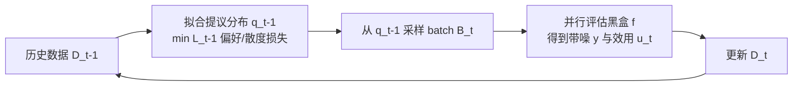

# Generative Bayesian Optimization: Generative Models as Acquisition Functions

**会议**: ICLR 2026  
**OpenReview**: [https://openreview.net/forum?id=GBWkRRJrdu](https://openreview.net/forum?id=GBWkRRJrdu)  
**代码**: 待确认  
**领域**: 优化 / 贝叶斯优化 / 生成模型  
**关键词**: Bayesian Optimization, 生成模型, DPO, 黑盒优化, 批量优化, 蛋白质设计  

## 一句话总结
GenBO 把生成模型直接训练成「采样密度正比于采集函数」的提议分布，借鉴 DPO 的思路用噪声效用值一步训练，无需先拟合回归/分类代理模型，从而在高维、组合、大批量黑盒优化（如蛋白质设计）中既简单又可扩展。

## 研究背景与动机
**领域现状**：贝叶斯优化（BO）依赖高斯过程等概率代理模型，靠后验不确定性构造采集函数（如 PI、EI），再最大化采集函数选下一个查询点。当任务允许并行评估时，可以一次提交一个 batch；而面对高维、组合或离散设计空间（蛋白质、分子），经典 BO 难以扩展。

**现有痛点**：一条有前景的路线是训练生成模型作为提议分布、直接采样一批候选，避开「全局优化采集函数」这个难题。但既有的生成式黑盒优化方法（CbAS、VSD、LaMBO-2）几乎都是**两阶段**：先拟合一个回归或分类代理（近似 $p(y\ge\tau|x)$ 或 $f$），再在其之上训练生成器。

**核心矛盾**：两阶段管线把两个模型的近似误差叠加在一起，还额外消耗算力——既增加了出错的来源，又抬高了成本，而代理模型本身在高维空间中往往就不准。

**本文目标**：提出一个**单模型**框架，直接从（带噪的）观测效用值训练生成模型，让其密度逼近正比于采集函数的目标分布，彻底去掉中间代理。

**核心 idea**：**「生成模型即采集函数」**——把 BO 的采集函数 $a_t(x)=\mathbb{E}[u_t(y)|x,D_t]$ 看作伪似然，目标分布 $p^*_t(x)\propto p_0(x)a_t(x)$；**借 DPO 把代理消掉**——像 DPO 用语言模型自身充当奖励模型那样，直接用成对偏好损失或散度损失训练生成器逼近该目标，无需显式奖励/分类模型。

## 方法详解

### 整体框架
GenBO 把 BO 重新解释为对「最优解位置 $x^*$」的直接推断：以 $p_0$ 为先验，以采集值 $a_t(x)$ 为基于效用的伪似然，目标分布 $p^*_t(x)\propto p_0(x)a_t(x)$。算法每轮先用历史数据拟合提议分布 $q_{t-1}=\arg\min_q L_{t-1}(q)$，从中采样一个 batch，评估效用后更新数据，循环 $T$ 轮。关键在于损失 $L_t$ 怎么设计——分**偏好式**（DPO 风格、用效用差的符号）与**散度式**（直接匹配 $p^*_u$、用效用幅值）两类。

### 关键设计

**1. 效用即采集，密度即提议：统一的目标分布**。GenBO 不再去近似 $f$，而是把任何可写成期望效用的采集函数 $a_t(x)=\mathbb{E}[u_t(y)|x,D_t]$ 直接当作训练信号。以 PI 为例，由贝叶斯公式 $a(x)=p(y\ge\tau|x)\propto p(x|y\ge\tau)/p_0(x)$，于是「学一个采样 $p(x|y\ge\tau)$ 的生成模型」与「学一个改进事件的分类器」是等价的，但生成模型能直接在高密度（高效用）区域采样，省去对非凸采集曲面的全局优化。推广到一般非负效用即得目标 $p^*_t(x)\propto p_0(x)a_t(x)$（或 $\propto p_0(x)\exp a_t(x)$ 以容纳负效用）。常用效用包括 PI $u=\mathbb{I}[y\ge\tau]$、EI $u=\max(y-\tau,0)$、平滑版 sEI $u=\mathrm{softplus}(y-\tau)$、以及均值 $u=y$。

**2. 偏好式损失（PL / 鲁棒 rPL）：把 DPO 搬进 BO**。一般分类损失里的配分函数无法像 DPO 那样消掉，因此需要成对对比目标。把数据组织成成对样本 $(x_{i,1},x_{i,2})$ 及其效用 $u_{i,j}=u(y_{i,j})$，用 Bradley-Terry 偏好损失训练：
$$\ell^{PL}_i(q)=-\log\sigma\!\Big(\eta\,\mathrm{sign}(\Delta u_i)\big[\log\tfrac{q(x_{i,1})}{p_0(x_{i,1})}-\log\tfrac{q(x_{i,2})}{p_0(x_{i,2})}\big]\Big)$$
其中 $\Delta u_i=u_{i,1}-u_{i,2}$。这恰好让生成模型逼近 $p^*_u(x)\propto p_0(x)\exp(\tfrac1\eta\mathbb{E}[u(y)|x])$，全程不需要奖励模型。由于 BO 只能观测带噪 $y$，效用差的符号会以概率 $p_\mathrm{flip}$ 翻转，原始 DPO 损失在此有偏；GenBO 采用 Chowdhury 等人的鲁棒版本，对正负方向损失加权 $\ell^{rPL}_i=\frac{(1-p_\mathrm{flip})\ell^{PL}(q,\Delta u_i)-p_\mathrm{flip}\ell^{PL}(q,-\Delta u_i)}{1-2p_\mathrm{flip}}$，在温和假设下无偏且对观测噪声鲁棒。

**3. 散度式损失（前向 KL / 平衡前向 KL）：用上效用幅值**。偏好损失只看符号、丢掉了效用大小，散度式则让 $q$ 直接匹配 $p^*_u\propto p_0(x)a(x)$。由于没有 $p^*_u$ 的样本，用当前提议 $q_{t-1}$ 的样本做自适应重要性采样，得无偏目标 $\ell^{fKL}_i(q)=-\tfrac{p_0(x_i)}{q_{i-1}(x_i)}u(y_i)\log q(x_i)$，其全局最优可证收敛到 $p^*_u$。但 PI/EI 在 $y<\tau$ 处效用为 0、不惩罚低效用区，模型可能在差区域留高密度；为此从 Bregman 散度（凸函数 $u\log u$）导出**平衡前向 KL**，额外加一项软惩罚 $\ell^{bfKL}_i(q)=-\tfrac{p_0(x_i)}{q_{i-1}(x_i)}u(y_i)\log q(x_i)+\tfrac{q(x_i)}{q_{i-1}(x_i)}$，在长序列高维任务中收益最明显。实践中往往丢掉重要性权重 $1/q_{i-1}$ 以促进向最优点的后验集中（reward-weighted regression 的单调效用提升保证）。

**4. 收敛性保证：逼近目标且趋向最优**。理论分析假设模型对数密度 $g_\theta$ 落在与真值 $g^*$ 共享的 RKHS 中，损失对第一参数严格凸、正则强凸。Lemma 1 给出损失的强凸性与唯一极小；Theorem 1 表明最优参数的逼近误差像核方法一样集中，其中 $\|m\|_{H_n^{-1}}$ 项对应 GP 式的预测方差、在密度有下界时趋零。再借 reward-weighted regression 的结果（训练提议最大化 $\mathbb{E}[u(y)\log q(x)]$ 产生单调递增的期望效用），说明提议会逐步集中到 $f$ 的全局最优区域，简单遗憾可消失。

## 实验关键数据

### 主实验表格
评测指标为简单遗憾 $r_t=f(x^*)-\max_{i\le n_t}f(x_i)$ 与累积最大值，5 个随机种子。

| 任务 | 设置 | GenBO 表现 | 主要对手 |
|------|------|-----------|---------|
| ALOHA 文本优化 | 5 字母，$\lvert\mathcal{X}\rvert>1.18\times10^7$，$D_0{=}64,B{=}8,T{=}10$ | rPL+EI 最快改进，PI 末段达到精确最优 | VSD 后期亦可，CbAS 因仅用末批数据落后 |
| Ehrlich 蛋白（闭式）| $M{=}15/32/64$，$D_0{=}128,B{=}128,T{=}32$ | KL 类损失最佳，长序列下 bfKL+指数正则优势明显 | 匹配/超过 VSD、CbAS、LaMBO-2、随机 |
| FoldX 稳定性 | mRouge 蛋白 $M{=}228$，$D_0{=}88,B{=}64,T{=}20$ | GenBO 较吃力 | VSD/CbAS 更好（低多样性纯利用占优）|
| FoldX SASA | 同上 | 多数 GenBO 变体大幅且更快领先 | 优于全部基线，无信息先验更利于外推 |

### 消融实验表格

| 消融维度 | 关键发现 |
|---------|---------|
| 阈值 $\tau_t$ 退火 | 任务偏好更激进利用（终值分位 >90%）；GenBO 对退火方案不敏感，VSD 需更陡升至 >95% |
| 先验 $p_0$ | ALOHA 与 SASA 上无信息先验 $p_0\propto1$ 反而最好，说明利于外推 |
| batch size $B$ | 单调改善，尤其 $B\ge32$ 大批量收益显著 |
| 运行时间 | GenBO 因省去中间代理，平均比 VSD **快约 3 倍** |
| 多样性 | 稳定性任务低多样性（纯利用）更好；SASA 任务高多样性（探索）更好 |

### 关键发现
- **去代理 = 又快又准**：单模型不仅减少近似误差，运行时间约为 VSD 的 1/3。
- **损失各有所长**：偏好式（rPL）对噪声鲁棒、文本任务收敛快；散度式（KL/bfKL）用上效用幅值，在高维长序列蛋白任务上更强。
- **先验需慎选**：可注入专家知识，但在偏外推的任务上无信息先验反而最佳，说明先验设错会拖累。
- **平衡 KL 的密度惩罚在高维更关键**：长序列（$M=64$）下，bfKL 对低效用区的软惩罚能避免模型在差区域堆密度，收益随维度上升而放大。
- **大批量是优势而非负担**：batch size 越大表现单调越好，与「生成式提议天然适合一次产大批候选」的设计初衷一致。

## 亮点与洞察
- **「生成模型即采集函数」的统一视角**：把 BO 的采集函数当伪似然、生成模型当提议分布，给一大类生成式黑盒优化方法（CbAS/VSD/LaMBO-2）提供了统一解释。
- **DPO 跨界**：首次系统地把 DPO 的「自身即奖励模型」重参数化搬进 BO，去掉中间代理且带来 Bradley-Terry 的理论保证，并用鲁棒版本应对 BO 固有的观测噪声。
- **generic 而非 diffusion-specific**：与 LaMBO-2 等绑定扩散的方法不同，框架对任意有密度的生成模型通用，并预留了 proper scoring rule 推广到扩散/流匹配的接口。

## 局限与展望
- **先验与超参敏感**：部分变体需在优化前固定先验 $p_0$；效用函数与温度 $\eta$ 的设置影响明显，相关理论尚待深入。
- **采集策略受限**：当前框架要求采集函数能写成期望效用，无法直接覆盖 Thompson 采样、UCB 等非期望效用形式。
- **遗憾界不完整**：理论证到目标分布收敛与简单遗憾消失，但次线性累积遗憾所需的速率控制留作未来工作。
- **稳定性任务偏弱**：在 FoldX 稳定性这类纯利用占优的任务上，GenBO 不及 VSD/CbAS，说明探索-利用平衡仍需调。

## 相关工作与启发
- **隐空间 BO（LSBO，LaMBO-2 等）**：在学到的低维流形上做 BO，受限于隐空间固定导致的样本效率差、重构误差；GenBO 全程在观测空间推断，规避这些问题。
- **扩散用于 BBO**：靠回归代理导出的效用引导扩散过程，方法绑定扩散；GenBO 面向任意生成模型。
- **LLM + BO**：用 LLM 注入先验或自适应选采集函数；最相关的是用 LLM 偏好建模做蛋白工程的 reward-model-free 方法，但其依赖通用 LLM，而 GenBO 面向无语言接口的任务专用生成优化。
- **启发**：把「对齐」领域成熟的 DPO/偏好优化工具迁移到决策与优化问题，是一条值得继续挖掘的跨界路径——凡是「想让采样密度正比于某个评分」的场景都可能套用这套单模型配方。

## 评分
- 新颖性: ⭐⭐⭐⭐ — 「生成模型即采集函数」+ DPO 去代理的视角统一且新颖，理论与实践结合扎实。
- 实验充分度: ⭐⭐⭐⭐ — 覆盖文本、闭式蛋白、真实 FoldX 三类任务，含退火/先验/batch/时间多维消融；但仅蛋白与文本域，缺连续/混合空间的更广验证。
- 写作质量: ⭐⭐⭐⭐ — 从 DPO 到 BO 的推导清晰，损失家族层次分明；理论部分较密集，工程细节多放附录。
- 价值: ⭐⭐⭐⭐ — 单模型、快 3 倍、可扩展到大批量高维组合优化，对蛋白/分子设计等实际场景有直接吸引力。

<!-- RELATED:START -->

## 相关论文

- [\[ICLR 2026\] Distributionally Robust Optimization via Generative Ambiguity Modeling](distributionally_robust_optimization_via_generative_ambiguity_modeling.md)
- [\[ICLR 2026\] Adaptive Acquisition Selection for Bayesian Optimization with Large Language Models](adaptive_acquisition_selection_for_bayesian_optimization_with_large_language_mod.md)
- [\[ICLR 2026\] Local Entropy Search over Descent Sequences for Bayesian Optimization](local_entropy_search_over_descent_sequences_for_bayesian_optimization.md)
- [\[ICLR 2026\] Incorporating Expert Priors into Bayesian Optimization via Dynamic Mean Decay](incorporating_expert_priors_into_bayesian_optimization_via_dynamic_mean_decay.md)
- [\[ICLR 2026\] From Sorting Algorithms to Scalable Kernels: Bayesian Optimization in High-Dimensional Permutation Spaces](from_sorting_algorithms_to_scalable_kernels_bayesian_optimization_in_high-dimens.md)

<!-- RELATED:END -->
