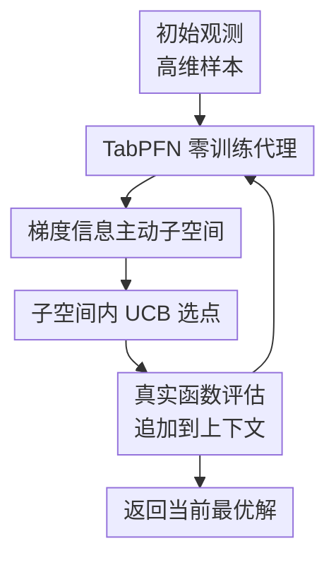

# GIT-BO: High-Dimensional Bayesian Optimization with Tabular Foundation Models

**会议**: ICLR2026  
**OpenReview**: [https://openreview.net/forum?id=9iTdKS4SRQ](https://openreview.net/forum?id=9iTdKS4SRQ)  
**代码**: 待公开  
**领域**: 高维贝叶斯优化 / 表格基础模型  
**关键词**: 高维贝叶斯优化、TabPFN、表格基础模型、主动子空间、UCB

## 一句话总结
GIT-BO 用冻结的 TabPFN v2 作为零训练贝叶斯优化代理模型，再从其预测均值梯度中估计低维主动子空间，并在该子空间内用 UCB 选点，从而在最高 500 维的合成与工程优化任务上取得比多种 GP-based 高维 BO 方法更好的性能-时间折中。

## 研究背景与动机
**领域现状**：贝叶斯优化常用于昂贵黑盒函数优化，例如机器学习超参、工程设计、材料搜索和控制策略搜索。经典 BO 通常依赖高斯过程（Gaussian Process, GP）作为代理模型，用后验均值与不确定性来决定下一次查询点，因此在低维、小样本场景里很有吸引力。

**现有痛点**：问题一旦进入上百维，GP 代理的优势会迅速变弱。一方面，核矩阵训练和超参数更新的开销随样本量与维度上升而变重；另一方面，核函数、长度尺度、稀疏先验、信任域大小或嵌入维度等选择会显著影响结果。SAASBO、TuRBO、BAxUS、随机嵌入和加性分解都在尝试缓解这个问题，但它们仍然要在“发现低维结构”和“维持可靠代理”之间付出调参和计算成本。

**核心矛盾**：高维 BO 真正需要的是两种能力同时成立：代理模型要能快速吸收已有观测并给出有用不确定性，搜索策略又要知道哪些方向值得探索。Tabular Foundation Model（TFM）尤其是 TabPFN v2 提供了前者，因为它可以把观测历史当作上下文，在一次前向传播中输出预测均值和方差；但仅靠冻结 TFM 直接在高维空间做全局 BO，又容易因为高维无关方向太多而退化。

**本文目标**：作者想回答一个更具体的问题：TabPFN 这类冻结表格基础模型能否真正用于高维黑盒优化？如果能，它是否需要与传统高维 BO 的结构发现思想结合？最终目标不是只证明 TabPFN 推理快，而是让它在 100 到 500 维的真实工程任务中也能稳定找到好解。

**切入角度**：论文观察到，TabPFN 虽然权重冻结，但它对候选点的预测均值仍然可以对输入求梯度。这个梯度场反映了当前上下文下模型认为目标函数最敏感的方向。如果把这些梯度聚合成 Fisher-information-style 的矩阵，就可以提取一个 gradient-informed active subspace，让搜索集中在少数有效方向上。

**核心 idea**：用 TabPFN v2 负责“零训练后验预测”，用预测均值梯度负责“主动子空间发现”，再用 UCB 在子空间里选下一个查询点，把基础模型的快速 in-context inference 和高维 BO 的低维结构假设结合起来。

## 方法详解

### 整体框架
GIT-BO 的输入是一个 $D$ 维黑盒优化问题和一批初始观测点，输出是在固定查询预算内找到的最佳样本。每一轮中，它先把已有观测作为 TabPFN v2 的上下文，对大量候选点一次性预测均值与方差；随后对预测均值关于输入求梯度，用梯度外积估计主动子空间；最后在该低维子空间中采样候选并用 UCB 选出下一次真实函数评估点。

这张图里真正的贡献节点是三个：TabPFN 零训练代理、梯度信息主动子空间、子空间内 UCB 选点。初始采样、真实函数评估和返回最优解只是 BO 的标准脚手架；论文的核心变化在于不再反复训练 GP，而是让冻结 TabPFN 给出可微后验，再把可微信号转成低维搜索方向。

### 关键设计
**1. TabPFN 零训练代理：把优化历史变成 in-context 后验**

传统 BO 每增加一个观测点，往往要重新拟合 GP 或重新估计核超参数；在高维场景里，这一步既慢又脆弱。GIT-BO 直接使用 TabPFN v2 作为代理模型，把当前观测集 $D_{obs}=\{(x_i,y_i)\}_{i=1}^n$ 当作上下文，把候选点集合 $X_{cand}=\{x_j\}_{j=1}^m$ 作为查询输入。TabPFN 的冻结模型 $q_\theta$ 一次前向传播就给出所有候选点的预测均值与方差：$\mu_m(x), \sigma_m^2(x) \sim q_\theta(Y_{cand}\mid X_{cand},D_{obs})$。

这个设计的关键不是“换一个回归器”这么简单，而是把 BO 的后验更新从在线训练问题改成上下文推理问题。随着每轮新样本被追加进 $D_{obs}$，TabPFN 的参数不变，但预测会随上下文变化，近似完成贝叶斯更新。这样做减少了 GP retraining 和手动 kernel/prior 调参的成本，也为后面的梯度子空间提供了一个统一、可微、可重复调用的代理。

**2. 梯度信息主动子空间：用预测均值梯度找真正该搜索的方向**

只用 TabPFN 直接在 $D$ 维空间里做 BO 仍然不够，因为高维候选空间里绝大多数方向可能与目标函数无关。GIT-BO 从 TabPFN 的预测均值 $\mu_m(x)$ 出发，对输入求梯度 $\nabla_x\mu_m(x)$，然后用梯度外积的期望近似 Fisher information matrix：$H=\mathbb{E}_\mu[\nabla_x\mu_m(x)\nabla_x\mu_m(x)^\top]$。如果某些方向上的梯度长期更大，说明当前代理认为目标函数沿这些方向变化更敏感。

得到 $H$ 后，算法取其前 $r$ 个特征向量组成梯度信息子空间 $V_r$。主实验中作者固定 $r=10$，以避免在 60 个任务上为每个问题单独调参。之后搜索不再直接在原始 $D$ 维空间中铺开，而是在低维超立方体中采样 $z\sim U([-1,1]^r)$，再映射回原空间 $X_{GI}=x_{ref}+V_rz$，其中 $x_{ref}=\bar{x}_{obs}$ 是已有观测的中心。这个中心化映射让搜索围绕目前已经探索到的区域展开，同时又沿着模型判断最敏感的方向移动。

**3. 子空间内 UCB 选点：把 TabPFN 的均值和不确定性用于下一次查询**

有了子空间候选 $X_{GI}$ 后，GIT-BO 用 Upper Confidence Bound 选择下一次真实评估点。对每个候选点，TabPFN 给出预测均值 $\mu(x)$ 和标准差 $\sigma(x)$，采集函数为 $\alpha_{UCB}(x)=\mu(x)+\beta\sigma(x)$。均值项鼓励利用当前看起来好的区域，方差项鼓励探索模型还不确定的位置；主实验采用固定探索系数，论文中写作上对应约 $\beta=2.33$，附录也讨论了 sampling-UCB 与 quantile-UCB 的关系。

这个 UCB 不是在整个高维空间里盲目最大化，而是在 $V_r$ 张成的低维候选集合中比较。这样一来，探索的不确定性仍来自 TabPFN 的 posterior-like 输出，但候选点已经被梯度子空间过滤过。换句话说，GIT-BO 把“在哪里搜索”交给梯度主动子空间，把“选哪个点”交给 UCB，两者共同避免了 vanilla TabPFN 在高维中被无关方向稀释的问题。

### 一个完整示例
假设要优化一个 300 维工程设计目标，初始用 Latin Hypercube Sampling 得到 200 个设计点并完成真实仿真评估。第 1 轮时，GIT-BO 把这 200 个 $(x,y)$ 放进 TabPFN 的上下文，同时从原始搜索域中抽取一批 Sobol 候选点。TabPFN 一次前向传播给出这些候选点的 $\mu(x)$ 与 $\sigma^2(x)$，随后算法对 $\mu(x)$ 关于 300 个输入维度反向传播，得到一批 300 维梯度。

这些梯度被聚合成 $300\times300$ 的矩阵 $H$。如果前 10 个特征向量解释了主要变化方向，算法就把它们组成 $V_{10}$。接着在 10 维空间里均匀采样许多 $z$，通过 $x_{ref}+V_{10}z$ 投回 300 维，形成一组更像“沿重要方向扰动”的候选设计。最后，UCB 在这批候选里选出 $\mu(x)+\beta\sigma(x)$ 最大的点，真实评估后把新样本追加进上下文。下一轮再重复同样流程，子空间会随 TabPFN 的新梯度更新而变化。

这个例子体现了本文和随机嵌入方法的差别：子空间不是预先随机定死，也不是靠额外模型训练得到，而是每一轮从 TabPFN 当前后验均值的梯度中重新估计。它也体现了本文和普通 TabPFN-BO 的差别：TabPFN 不是独自承担所有高维搜索压力，而是被用作一个快速、可微的后验引擎。

### 损失函数 / 训练策略
GIT-BO 本身没有在线训练损失，因为 TabPFN v2 在 BO 过程中保持固定权重。每一轮的“更新”来自上下文扩展：新评估的 $(x_{next},y_{next})$ 被加入 $D_n$，下一次前向传播时 TabPFN 会基于更长上下文输出新的预测均值、方差和梯度。

算法层面的关键超参包括初始样本数、迭代预算、子空间维度 $r$、候选采样数量和 UCB 探索强度 $\beta$。论文主实验统一使用 200 个 LHS 初始样本、500 次迭代预算、固定 $r=10$，并在相同 CPU/GPU 资源上比较各算法。附录显示 $r$ 过大例如 $r=40$ 会稀释子空间搜索效果，而较小或方差阈值自适应的 $r$ 往往更好；但主文固定 $r=10$ 是为了避免按任务调参带来的不公平。

## 实验关键数据

### 主实验
论文在 60 个问题变体上评估 GIT-BO，包括 9 类可扩展合成函数、Rover 的多维版本，以及电力系统、MOPTA08、Mazda、Walker 等真实工程任务。所有方法用相同 200 个初始样本、20 个随机种子、500 次迭代预算，并在相同 H100 GPU 节点配置下运行。

| 评估维度 | GIT-BO | 主要对比方法 | 结论 |
|--------|--------|--------------|------|
| 60 个问题整体最终性能排名 | 1.92 | SAASBO / TuRBO / Vanilla BO / BAxUS / Random | GIT-BO 整体排名最好，最终解质量最稳 |
| 性能-运行时间 Pareto | 位于 Pareto frontier | TuRBO 也在 frontier | GIT-BO 偏性能最优，TuRBO 偏速度优势 |
| 合成任务子集 | 非所有任务第一 | BAxUS 在合成任务上更强 | GIT-BO 鲁棒，但 Styblinski-Tang、Michalewicz 等任务暴露分布限制 |
| 真实工程任务子集 | 排名第一 | BAxUS 在工程任务上退到较后 | GIT-BO 对电力、汽车设计等真实任务泛化更好 |
| 维度范围 | 最高 500D | 同样预算比较 | 随维度增加仍能保持较稳定收敛 |

从迭代收敛曲线看，GIT-BO 在 Ackley 100-500D 中起初不一定领先，但维度增加后相对优势更明显；在 Rosenbrock 200D、Dixon-Price 400D、Rastrigin 500D 等合成任务上能取得很强曲线。真实工程侧，它在多个电力系统和汽车设计任务上表现突出，但 Rover 上表现不佳。

运行时间视角下，BAxUS 有时可以达到接近或更好的最终 regret，但往往需要额外约一小时量级的 wall-clock time；GIT-BO 通常能在几分钟内达到竞争性或更好的 regret。这个结果支撑了论文的核心卖点：不是单纯追求最省时间，也不是单纯追求最终 regret，而是在高维昂贵优化中提供更好的性能-时间折中。

### 消融实验
| 配置 | 关键指标 | 说明 |
|------|---------|------|
| vanilla TabPFN v2 + EI/UCB | 在高维中收敛慢、最终 regret 较差 | 说明冻结 TabPFN 单独使用还不足以解决高维搜索 |
| GIT-BO + GI subspace | 相比无 GI subspace 的版本 regret 约好 8.6 倍 | 梯度信息主动子空间是主要贡献 |
| 子空间维度 $r=5$ | 固定 $r$ 中平均排名 3.25 | 小子空间常常有效，但可能偏保守 |
| 子空间维度 $r=10$ | 平均排名 5.5 | 主实验固定采用，强调公平和无需调参 |
| 子空间维度 $r=40$ | 平均排名 8.0 | 子空间过宽会稀释搜索方向 |
| 92.5% 方差阈值自适应 $r$ | 平均排名 1.75 | 自适应选择有潜力优于固定 $r$ |
| UCB $\beta=1.65$ 或 $1.96$ | 平均排名 2.0 / 2.25 | 中等探索更优 |
| UCB $\beta=2.45$ | 平均排名 4.75 | 过强探索会损害性能 |
| uniform / random / Sobol 子空间采样 | 无统一赢家 | uniform 更稳定，random 和 Sobol 有时更好但方差更大 |

### 关键发现
- 梯度信息主动子空间是 GIT-BO 的关键，而不是 TabPFN v2 本身。附录中 vanilla TabPFN v2 即使用 EI 或 UCB，也无法稳定处理高维 BO；加入 GI subspace 后才恢复稳定收敛。
- 合成 benchmark 和真实工程 benchmark 的排名差异很大。BAxUS 在合成任务上表现强，但工程任务排名下降；GIT-BO 在真实任务上更占优，说明只在经典合成函数上调优并不能完全代表实际工程优化能力。
- 固定 $r=10$ 并不是最优超参。附录显示较小 $r$ 或方差解释阈值可以更好，但作者为了公平没有在主实验中逐任务调参；这意味着 GIT-BO 还有自动选择子空间维度的改进空间。
- UCB 探索强度需要适中。主文使用保守固定设置，消融发现更小的 $\beta$ 往往更好，说明当前版本可能偏探索，后续可以用自适应探索策略提升效率。

## 亮点与洞察
- 最巧妙的地方是把 TabPFN 的“可微预测均值”转成高维 BO 的结构信号。很多 TFM-for-BO 工作只强调一次前向推理快，但本文进一步利用梯度来发现低维有效方向，让基础模型不只是代理模型，还是搜索空间压缩器。
- GIT-BO 对 GP-based 高维 BO 的批评比较务实：不是说 GP 不好，而是指出高维下反复训练 GP、调核、选 prior、调信任域都很昂贵。TabPFN 通过 in-context inference 消掉一大块在线训练成本，主动子空间再弥补其高维结构感不足。
- 实验设计覆盖了 60 个问题变体，并显式报告性能排名、运行时间排名、Pareto frontier、迭代收敛和 runtime 收敛。这比只给若干合成函数 regret 曲线更有说服力，也更贴近工程优化场景。
- 论文的负面结果也有价值：Rover、Styblinski-Tang 和 Michalewicz 上的失败提醒读者，TabPFN 的预训练分布和偏置会影响 BO 代理质量。TFM 不是万能 surrogate，它的收益取决于上下文预测和梯度场是否真的反映目标函数结构。
- 这个思路可以迁移到其他 foundation-model surrogate 场景。只要代理模型能输出不确定性并对输入求梯度，就可以尝试类似“冻结模型 + 梯度结构发现 + acquisition search”的组合，例如材料设计、仿真校准、控制策略搜索或混合变量优化。

## 局限与展望
- TabPFN v2 仍有输入维度上限，本文实验最高到 500D；如果目标问题达到上千维或包含复杂离散/混合变量，当前实现未必直接适用。
- 内存占用是实际瓶颈。TabPFN 推理需要较大 GPU memory，论文也指出即使不训练，它的 inference 仍可能慢于 TuRBO 或 Vanilla BO 中的简单 GP 拟合。
- 子空间维度 $r$ 和 UCB 探索强度仍需人工指定。主实验固定 $r=10$ 和保守探索设置是公平的，但消融说明这些选择并非最优，自动维度选择和自适应 $\beta$ 会是直接改进方向。
- GIT-BO 的理论分析依赖 TabPFN 近似 GP posterior、函数 RKHS 有界、梯度子空间有效等假设。这些假设帮助解释方法，但真实 TabPFN 的预训练分布和工程任务分布之间仍可能存在 mismatch。
- 当前实验把约束和多目标问题转成单目标无约束形式，例如用 penalty transform 或平均加权。未来如果要面向真实工程设计，更自然的扩展是 constrained BO、mixed-variable BO 和 multi-objective BO，而不是先把任务简化。

## 相关工作与启发
- **vs SAASBO**: SAASBO 用稀疏轴对齐 prior 自动发现相关维度，仍然属于 GP 代理和高维稀疏先验路线；GIT-BO 则用 TabPFN 取代在线 GP 训练，并用预测梯度的特征方向构造子空间。前者更有 GP 解释性，后者运行时间和工程任务表现更好。
- **vs TuRBO**: TuRBO 通过局部 trust region 避免在全局高维空间拟合 GP，是很强的速度基线；GIT-BO 不依赖局部 trust region，而是通过梯度信息子空间收缩搜索方向。论文结果显示 TuRBO 在速度上仍有吸引力，GIT-BO 则更偏最终性能。
- **vs BAxUS / random embedding BO**: BAxUS 从低维嵌入开始并逐步扩展子空间，适合存在低维结构的合成问题；GIT-BO 的子空间来自当前代理梯度，随观测更新而变化。二者都利用低维结构，但 GIT-BO 的方向更数据驱动，也更依赖代理梯度质量。
- **vs PFNs4BO / TabPFN-based BO**: 早期 PFN-for-BO 工作主要展示 in-context Bayesian inference 能加速 BO；本文的增量是把 TabPFN v2 推到 500D，并指出 vanilla TabPFN 在高维不够，需要与 active subspace 机制结合。
- **启发**: 对高维优化而言，“foundation model surrogate + classical optimization structure”可能比单独替换代理模型更可靠。未来很多方法也许会沿着这个模式发展：用预训练模型提供快速后验，用传统优化理论提供搜索约束和可解释结构。

## 评分
- 新颖性: ⭐⭐⭐⭐☆ 把 TabPFN v2、预测均值梯度和主动子空间结合得很自然，单个组件并非全新，但组合切中高维 BO 的痛点。
- 实验充分度: ⭐⭐⭐⭐⭐ 60 个问题变体、20 个随机种子、真实工程任务和多类消融都比较完整，且同时报告性能与 runtime。
- 写作质量: ⭐⭐⭐⭐☆ 主线清楚，算法图和伪代码易懂；不足是部分理论假设较强，主文对实现细节需要依赖附录。
- 价值: ⭐⭐⭐⭐⭐ 对昂贵工程优化和高维 BO 很有实用价值，也为表格基础模型如何进入优化闭环提供了一个清晰范式。

<!-- RELATED:START -->

## 相关论文

- [\[ICLR 2026\] From Sorting Algorithms to Scalable Kernels: Bayesian Optimization in High-Dimensional Permutation Spaces](from_sorting_algorithms_to_scalable_kernels_bayesian_optimization_in_high-dimens.md)
- [\[ICLR 2026\] DiffBED: Scaling Bayesian Experimental Design to High-Dimensions](diffbed_scaling_bayesian_experimental_design_to_high-dimensions.md)
- [\[ICLR 2026\] Scaling Multi-Task Bayesian Optimization with Large Language Models](scaling_multi-task_bayesian_optimization_with_large_language_models.md)
- [\[ICLR 2026\] Adaptive Acquisition Selection for Bayesian Optimization with Large Language Models](adaptive_acquisition_selection_for_bayesian_optimization_with_large_language_mod.md)
- [\[ICLR 2026\] DES-LOC: Desynced Low Communication Adaptive Optimizers for Foundation Models](des-loc_desynced_low_communication_adaptive_optimizers_for_foundation_models.md)

<!-- RELATED:END -->
