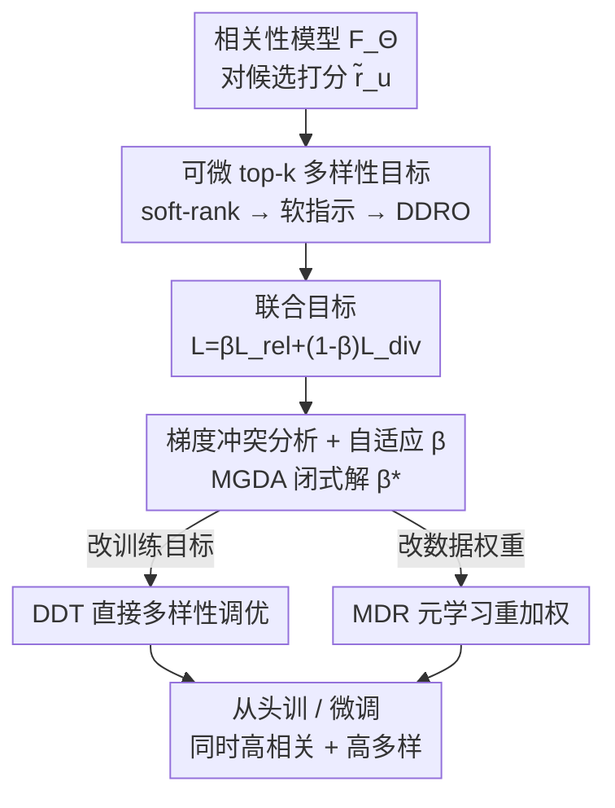

# Gradient-Based Diversity Optimization with Differentiable Top-$k$ Objective

**会议**: ICLR 2026  
**OpenReview**: [https://openreview.net/forum?id=cuzWopwoZG](https://openreview.net/forum?id=cuzWopwoZG)  
**代码**: 待确认  
**领域**: 优化 / 多目标学习 / 可微排序  
**关键词**: 可微排序, top-k 多样性, 多目标优化, MGDA, 推荐系统

## 一句话总结
把"top-$k$ 集合的多样性"这个本来不可导的目标，用可微排序（soft-rank）松弛成可以直接塞进梯度训练的损失，再用 MGDA 自适应地平衡"相关性 vs 多样性"两个对立梯度，从而无需改模型结构、无需后处理就能在训练里同时优化两者；在五个推荐数据集上以几乎不掉精度的代价显著提升多样性。

## 研究背景与动机
**领域现状**：在推荐、检索、排序这类"从大量候选里挑 top-$k$"的任务里，模型几乎都只奔着"相关性/准确率"去训练（用 MSE 或排序损失拟合 ground-truth 评分）。多样性只能事后补救：要么用 MMR、DPP 这类 **后处理重排**，对已经训好的相关性排序做二次挑选；要么用 **模型专属的学习方法**，把多样性目标硬编进某个特定架构里。

**现有痛点**：后处理方法（MMR/DPP）是 model-agnostic、好实现，但天花板被初始相关性排序卡死，而且加多样性几乎必然掉准确率——这是被反复观察到的现象（Chen et al., 2017）。学习类方法效果更好，但要么改架构、要么上对抗训练，是 model-specific 的，收敛慢、对"相关性—多样性权衡系数"极其敏感。数据侧的去偏/重加权又只针对分布偏差，并不直接对准 top-$k$ 多样性。

**核心矛盾**：根子上是一个 **不可导 + 多目标冲突** 的双重难题。多样性定义在 `topk(·)` 这个离散选择算子上，没法求梯度，所以无法和相关性一起做端到端梯度优化；而即使能优化，相关性梯度和多样性梯度方向常常是对立的，简单线性加权一定会牺牲一方。

**本文目标**：造一个 **统一、可微、模型无关** 的框架，让"相关性 + top-$k$ 多样性"能在标准梯度训练里一起优化，既支持从头训也支持在已训好的相关性模型上微调。

**切入角度**：作者从"可微排序"（Blondel et al., 2020 的 soft-rank）出发——既然离散排序可以被松弛成对置换多胞形的投影，那 top-$k$ 指示函数也能被松弛成可导的软指示，多样性目标就自然变得可导。再借多目标优化里的 MGDA 来处理两个梯度的冲突。

**核心 idea**：用 soft-rank 把 top-$k$ 多样性变成可微的代理目标（DDRO），并把它和相关性损失组成联合目标，用 MGDA 自适应求解权衡系数 $\beta$，保证两个目标"共同下降"并收敛到 Pareto-稳定点。

## 方法详解

### 整体框架
方法要解决的是"如何让一个不可导、且与相关性相冲突的多样性目标，进入标准梯度训练"。整体转法是：模型先对所有候选打相关性分 $\tilde r_u$ → 用 soft-rank 把分数转成软排名、再转成可微的 top-$k$ 软指示 $\tilde l_u$ → 用软指示算出可微多样性目标 DDRO → 把 DDRO（取负）和相关性损失组成联合损失 → 用 MGDA 在线求最优权衡 $\beta^\star$ 后做梯度更新。在这套可微目标之上，作者给出两条互补的落地策略：**DDT** 直接改训练目标，**MDR** 不改目标、改数据权重。两条策略既能从头训，也能在相关性预训练模型上微调。

### 关键设计

**1. 可微 top-$k$ 多样性目标（DDRO）：把离散选择松弛成可导代理**

痛点直接：多样性定义在"被选中的 top-$k$ 集合"上，而选哪 $k$ 个是离散操作，挡住了梯度。先看离散版多样性——给定物品两两亲和矩阵 $S$，top-$k$ 集合 $Z_u(k)$ 的多样性是平均成对不相似度

$$D_S(Z_u(k)) = \frac{2}{k(k-1)}\sum_{i=1}^{m}\sum_{j=1}^{m} l_u(i)\,l_u(j)\,(1-S_{i,j})$$

其中 $l_u=\mathrm{topk}(\tilde r_u)$ 是 0/1 指示向量，正是它不可导。作者用可微排序把硬指示换成软指示：先把预测分数 $\tilde r_u$ 投影到置换多胞形 $P_m$（所有 $(1,\dots,m)$ 排列的凸包）上，得到熵正则的软排名

$$\tilde z_u^{(\varepsilon)} = \mathrm{softrank}(\tilde r_u) := \arg\min_{r\in P_m}\Big(\tfrac{1}{\varepsilon}\langle \tilde r_u, r\rangle + H(r)\Big),$$

再用一个缩放 sigmoid 把"软排名是否落在前 $k$"变成连续指示 $\tilde l_u(i)=\sigma_\tau(k-\tilde z_u(i))$，$\sigma_\tau(x)=[1+\exp(-x/\tau)]^{-1}$。把 $D_S$ 里的硬指示换成 $\tilde l_u$ 就得到可微多样性目标 DDRO。这样有效是因为：soft-rank 保留了 $O(n\log n)$ 时间、$O(n)$ 空间的复杂度，且有逼近保证——当 $\varepsilon\to 0$，软排名收敛到真实离散排名（Lemma 1）；论文实验也确认 $\varepsilon=1/n$ 时排名逼近误差几乎为零，DDRO 与离散 DRO 高度吻合。代价是 $\varepsilon$ 必须选好：$k$ 越大需要越小的 $\varepsilon$，否则多样性度量会失真。

**2. 梯度冲突分析与自适应 $\beta$：用 MGDA 保证"共同下降"**

有了可微目标，作者把相关性与多样性写成联合损失

$$L_{\mathrm{JOINT}}(\beta,\Theta) = \beta\,L_{\mathrm{rel}}(\Theta) + (1-\beta)\,L_{\mathrm{div}}(\Theta),$$

实践里 $L_{\mathrm{rel}}=L_{\mathrm{MSE}}$、$L_{\mathrm{div}}=-L_{\mathrm{DDRO}}$。难点是这两个目标天然对立：相关性梯度 $g_{\mathrm{rel}}$ 与多样性梯度 $g_{\mathrm{div}}$ 方向不一致时，任何固定的线性组合都会偏袒一方。作者记梯度模长 $a=\|g_{\mathrm{rel}}\|$、$b=\|g_{\mathrm{div}}\|$、余弦相似度 $\rho$，给出让组合梯度 $g_\beta=\beta g_{\mathrm{rel}}+(1-\beta)g_{\mathrm{div}}$ 同时让两个损失都下降的 $\beta$ 可行区间（Lemma 3：对齐时全可行，对立时区间收缩）。但仅"可行"还不够均衡，于是选最大化"每步最小下降量"的 $\beta$，得到二目标特化的 MGDA 闭式解

$$\beta^\star = \frac{b(b-a\rho)}{a^2+b^2-2ab\rho}.$$

这样有效在于：$\beta^\star$ 把相关性和多样性的一阶下降量拉平，给出平衡更新，并且在递减步长下能保证收敛到 Pareto-稳定点（Corollary 4）。和"手调固定 $\beta$"相比，自适应 $\beta$ 不用反复试参，且实验里 $\beta^\star$ 始终落在 Lemma 3 的可行区间内，随训练从偏相关逐渐滑向偏多样。

**3. DDT（直接多样性调优）：改训练目标**

这条最直接——直接对联合损失 $L_{\mathrm{JOINT}}$ 做梯度优化，用上面的自适应 $\beta^\star$（或省算力时用固定 $\beta$）更新模型参数 $\nabla_\Theta L_{\mathrm{JOINT}}$。它针对的痛点是"现有学习类方法要改架构"：DDT 完全不碰模型结构，只在损失层加一项联合相关性—多样性目标，因此 model-agnostic，既能从头训也能微调。实验显示 DDT 在神经网络模型上多样性增益最强。

**4. MDR（元多样性重加权）：不改目标、改数据分布**

DDT 改的是目标，MDR 换个思路：保留标准的纯相关性训练循环，但给每个用户—物品对 $(u,i)$ 学一个权重 $w_{u,i}\in[0,1]$，优化重加权后的相关性损失

$$L^{w}_{\mathrm{MSE}} = \sum_{(u,i)\in B} w_{u,i}\,(R_{u,i}-\tilde R_{u,i})^2.$$

这针对的痛点是"多样性能否不靠改目标、而靠纠数据偏差获得"。做法是元学习的内外环：内环用一步更新拿到临时模型 $\Theta'$，外环把联合损失 $L_{\mathrm{JOINT}}$ 当 **元目标**，对权重 $w$ 求梯度得到每个样本的"效用分"，再归一化使一个 mini-batch 内权重和为 1——联合目标只用来更新权重，从不直接作用于模型参数。直觉是给"小众/长尾"物品加权以提高它们的曝光机会。作者用一个受控案例（所有物品评分相同但属不同多样性簇）验证：一步元更新后，权重会自动偏向"增加簇间覆盖"的物品、压低同簇冗余物品，无需任何显式簇监督。实验里 MDR 对矩阵分解这类简单低秩模型尤其受益。

### 损失函数 / 训练策略
框架对相关性损失不挑：主实验用 MSE，但任意 pointwise 或排序损失（如 BPR）都能替换。两种部署设定：(i) 从头训——相关性与多样性联合优化；(ii) 微调——在相关性预训练模型上为多样性做适配，实验表明微调能更好保住预训练模型的相关性，从头训则容易收敛到更差的稳定点。

## 实验关键数据

### 主实验
五个推荐数据集（Coat / Yahoo-R2 / Netflix / MovieLens / KuaiRec）、两类模型（MF、NCF），亲和矩阵 $S$ 用 genre/category 的 Jaccard 相似度预计算。下表为 $k=10$、$\beta=0.2$、对预训练 MF 微调 100 epoch 的相关性—多样性对比（值越高越好，节选）：

| 方法 | MovieLens 多样性 | MovieLens 相关性 | KuaiRec 多样性 | KuaiRec 相关性 | Yahoo-R2 多样性 | Yahoo-R2 相关性 |
|------|------|------|------|------|------|------|
| NMF（仅相关性） | 0.62 | 0.98 | 0.89 | 0.84 | 0.09 | 0.76 |
| DPP（后处理） | 0.98 | 0.95 | 1.00 | 0.75 | **1.00** | 0.58 |
| DGRec（图学习） | 0.73 | 0.47 | 0.91 | 0.18 | 0.33 | 0.83 |
| **DDT（本文）** | **1.00** | **1.00** | 0.98 | **0.95** | 0.98 | **0.85** |
| **MDR（本文）** | 0.97 | 0.99 | 0.97 | 0.85 | 0.86 | 0.82 |

DDT 在几乎所有数据集/指标上拿到最好或次好，关键是 **多样性涨上去的同时相关性几乎不掉**；而 DPP 在 Yahoo-R2 拿满多样性却把相关性砸到 0.58，DGRec 在 KuaiRec 多样性 0.91 但相关性崩到 0.18——典型的"换皮多样性"。

### 多样性增益随 $k$ 与"超出目标范围"分析
固定 $\beta=0.5$、微调 10 epoch、变 $k\in\{5,10,20,30,40\}$，报告相对相关性基线的归一化多样性增益（%）：

| 设定 | 数据集 | top-$k$（目标内）增益 | $k{+}1\sim2k$（目标外）增益 | 说明 |
|------|------|------|------|------|
| NMF, $k{=}20$ | Yahoo-R2 | 78.5 (3.8) | 47.1 (2.7) | 初始多样性极低(0.09)，增益最猛 |
| NMF, $k{=}5$ | MovieLens | 41.4 (13.1) | 25.6 (10.4) | 稀疏场景仍显著 |
| NMF, $k{=}10$ | Netflix | 13.8 (1.0) | 4.2 (1.7) | 稠密场景 |

### 关键发现
- **增益会"溢出"到目标范围之外**：只优化 top-$k$，但 $k{+}1\sim2k$ 这些没被显式优化的物品多样性也普遍上升，说明优化重塑了整条排序，而非只挪动被优化的那 $k$ 个。Coat 因规模小、物品池有限，目标外增益在 0 附近波动，是个例外。
- **微调 > 从头训**：微调能保住预训练模型的相关性，从头训会收敛到更差的相关性稳定点；两者多样性水平相近，提示多样性正则可能拖累从头训的相关性收敛。
- **$\varepsilon$ 是命门**：$\varepsilon=1/n$ 时 soft-rank 逼近误差近乎为零，且存在一段较大 $\varepsilon$ 仍保持小误差（可换取数值稳定与更平滑梯度）；但 $k$ 越大需要越小 $\varepsilon$，选错会让多样性度量误差任意大。
- **固定 $\beta$ 的鲁棒性**：recall 在很宽的 $\beta$ 区间里低方差稳定，只有 $\beta\to 0$（几乎纯多样性）才明显掉精度；DDT 在神经网络上多样性优于 MDR，MDR 则对简单低秩模型更划算。

## 亮点与洞察
- **把"不可导的集合级目标"变成可微损失的范式**：soft-rank + 缩放 sigmoid 软指示这套组合，本质上给所有"定义在 top-$k$ 选择上的指标"（不止多样性，覆盖率、长尾曝光等同理）提供了可微化模板，可迁移到检索、主动学习、子集选择等任意 top-$k$ 任务。
- **二目标 MGDA 闭式解 + Pareto 保证**：把多目标优化的理论（共同下降可行区间、minimax 选 $\beta$、Pareto-稳定）干净地落到"相关性 vs 多样性"上，给出 $\beta^\star=\frac{b(b-a\rho)}{a^2+b^2-2ab\rho}$ 这种可直接算的更新规则，省掉了反复调权衡系数的痛苦。
- **目标内优化带来目标外泛化**：只显式优化 top-$k$ 却能改善更深位置的多样性，这个"溢出"现象很有启发——说明梯度优化学到的是比显式目标更广义的多样性结构，而非局部 hack。
- **DDT/MDR 的对偶视角**："改目标"与"改数据权重"两条路都能拿到多样性，且 MDR 对简单模型更有效——把"多样性来自目标还是来自数据偏差纠正"这个问题做成了可对比的实验。

## 局限与展望
- **多样性靠预定义亲和矩阵 $S$**：$S$ 用 genre/category 的 Jaccard 相似度算，多样性的"语义"完全由这个先验决定；没有类别标注或类别噪声大的场景如何定义 $S$，论文未深入。
- **评测局限在推荐**：方法声称 model-agnostic、适用于一般排序/选择任务，但所有实验、数据集、baseline 都是推荐系统，跨任务（如文档检索、主动学习子集选择）的实证缺位。
- **$\varepsilon$ 敏感性是真实成本**：大 $k$ 下要很小的 $\varepsilon$ 才能保住逼近精度，而过小 $\varepsilon$ 又带来数值不稳，实际部署需要按 $k$ 仔细调，论文给了趋势但没给自动选 $\varepsilon$ 的方案。
- **从头训收敛更差**：作者承认多样性正则会拖累从头训的相关性收敛，目前的优解是"先相关性预训练再微调"，但这要求已有一个好的相关性模型。

## 相关工作与启发
- **vs 后处理重排（MMR / DPP / DUM）**：它们对已训好的相关性排序做二次挑选，model-agnostic 但被初始排序质量卡死，且加多样性几乎必然掉相关性（实验里 DPP 在 Yahoo-R2 多样性满分却相关性 0.58）；本文把多样性放进训练梯度里，多样性涨而相关性几乎不动。
- **vs 模型专属学习方法（如 DGRec 等图模型）**：它们把多样性编进特定架构或上对抗训练，model-specific、收敛慢；本文不改架构、不加推理开销，可直接接入标准训练管线。
- **vs 多目标优化（标量化 / 进化算法 / MGDA 应用于公平性、收益）**：MGDA 此前多用于"准确率 vs 公平/收益"，本文首次把它用在"相关性 vs 多样性"，并配上可微多样性目标，补上了 MGDA 一直没碰的多样性维度。

## 评分
- 新颖性: ⭐⭐⭐⭐ 可微 top-$k$ 多样性 + 二目标 MGDA 的组合干净且通用，是把两条成熟技术接到新问题上的漂亮工作
- 实验充分度: ⭐⭐⭐⭐ 五数据集两模型、含 $\beta$/$k$/$\varepsilon$ 消融与目标外泛化分析，但全在推荐域内，跨任务声称未验证
- 写作质量: ⭐⭐⭐⭐ 理论（Lemma/Corollary）与实验衔接清晰，问题—目标—方法链条完整
- 价值: ⭐⭐⭐⭐ 给"top-$k$ 选择类指标可微优化"提供了可复用范式，对推荐去同质化有直接实用价值

<!-- RELATED:START -->

## 相关论文

- [\[ICML 2026\] Diversity-Driven Offline Multi-Objective Optimization via Nested Pareto Set Learning](../../ICML2026/optimization/diversity-driven_offline_multi-objective_optimization_via_nested_pareto_set_lear.md)
- [\[ICLR 2026\] Neural Multi-Objective Combinatorial Optimization for Flexible Job Shop Scheduling Problems](neural_multi-objective_combinatorial_optimization_for_flexible_job_shop_scheduli.md)
- [\[ICML 2026\] Accelerated Multiple Wasserstein Gradient Flows for Multi-objective Distributional Optimization](../../ICML2026/optimization/accelerated_multiple_wasserstein_gradient_flows_for_multi-objective_distribution.md)
- [\[ICML 2026\] A Fully First-Order Layer for Differentiable Optimization](../../ICML2026/optimization/a_fully_first-order_layer_for_differentiable_optimization.md)
- [\[ICLR 2026\] Gradient-Normalized Smoothness for Optimization with Approximate Hessians](gradient-normalized_smoothness_for_optimization_with_approximate_hessians.md)

<!-- RELATED:END -->
