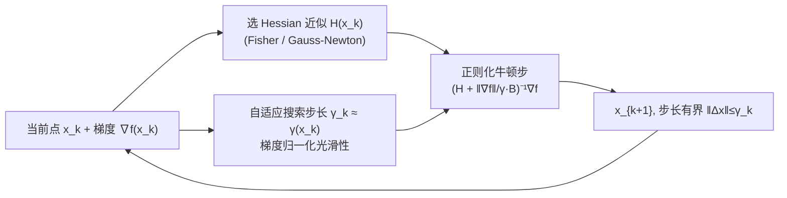

# Gradient-Normalized Smoothness for Optimization with Approximate Hessians

**会议**: ICLR 2026  
**OpenReview**: [https://openreview.net/forum?id=Epu8Lm6VMK](https://openreview.net/forum?id=Epu8Lm6VMK)  
**代码**: [https://github.com/epfml/grad-norm-smooth](https://github.com/epfml/grad-norm-smooth)  
**领域**: optimization  
**关键词**: 二阶优化, 近似 Hessian, 梯度正则化牛顿法, 全局收敛, 自适应步长, Fisher/Gauss-Newton  

## 一句话总结
本文提出"梯度归一化光滑性"(Gradient-Normalized Smoothness)这一与具体问题类无关的局部刻画，让带梯度正则化、使用近似 Hessian 的牛顿型方法自动适配到正确的光滑性类，从而在凸/非凸目标上恢复精确牛顿法的最优全局收敛率。

## 研究背景与动机
- **领域现状**：二阶方法（牛顿型）利用曲率信息能大幅加速收敛，配上立方正则化或梯度正则化后还能获得强全局复杂度保证；但要在大规模场景落地，必须用 Fisher、Gauss-Newton、拟牛顿等**近似 Hessian** 来替代真实 Hessian。
- **现有痛点**：针对近似 Hessian 的收敛理论相当有限——通常担心 Hessian 误差会"拖垮"收敛，使二阶方法退化到梯度下降的 $O(1/\varepsilon^2)$ 慢速率；而且每种新光滑性类（Hölder Hessian、Quasi-Self-Concordant、$(L_0,L_1)$-光滑等）往往都要单独设计方法、单独证收敛。
- **核心矛盾**：人们既想要"一套通用方法自动适配各种问题类与各种 Hessian 近似"，又希望它在 Hessian 不精确时仍能保住精确牛顿法的最优率，而不是被近似误差牵着退化。
- **本文目标**：建立一个**与问题类无关**的统一框架，把"梯度场的局部信息"和"Hessian 近似误差"翻译成方法的全局行为，使近似二阶方法获得通用全局收敛保证。
- **核心 idea**：**【局部半径刻画】** 定义一个新量 $\gamma(x)$——围绕当前点、使梯度场线性近似 $\nabla f(x+h)\approx\nabla f(x)+H(x)h$ 相对误差仍小的最大球半径——直接用它当二阶步长，方法便自动适配到最优光滑性类与近似程度。

## 方法详解

### 整体框架
方法本身极简：用一个由"梯度范数 / 步长"构成的标量正则项去稳定带近似 Hessian 的牛顿步，迭代为
$$x_{k+1}=x_k-\Big(H(x_k)+\tfrac{\|\nabla f(x_k)\|_*}{\gamma_k}B\Big)^{-1}\nabla f(x_k).$$
其中 $H(x_k)\succeq 0$ 是 Hessian 近似，$\gamma_k>0$ 是二阶步长（保证 $\|x_{k+1}-x_k\|\le\gamma_k$）。理论的全部精华都浓缩进"如何选 $\gamma_k$"：理想取值是新定义的梯度归一化光滑性 $\gamma(x_k)$，实践中用自适应搜索逼近。

### 关键设计

**1. 梯度归一化光滑性 γ(x,g)：把"线性近似在多大球内仍可信"量化成步长。** 这是全文的概念基石。对点 $x$ 与方向 $g$，定义
$$\gamma(x,g):=\max\Big\{\gamma\ge 0:\ \|\nabla f(x+h)-\nabla f(x)-H(x)h\|_*\le\tfrac{\|g\|_*\|h\|}{\gamma},\ \forall h\in B_\gamma\cap O_{x,g}\Big\},$$
即在以 $x$ 为心、半径 $\gamma$ 的欧氏球（再交一个局部椭球区域 $O_{x,g}$ 约束方向）内，梯度场线性化 $\nabla f(x)+H(x)h$ 的相对误差不超过 $\|g\|_*\|h\|/\gamma$ 的最大半径。取 $g=\nabla f(x)$ 即得算法用的 $\gamma(x):=\gamma(x,\nabla f(x))$。它的意义在于：$\gamma(x)$ 大表示线性近似在大范围内可信、几乎不需正则化（接近严格极小点时 $\gamma\to+\infty$，自动切换为纯牛顿步、保留二次局部收敛）；$\gamma(x)$ 小则提示需要更强正则化。关键是这一刻画**不依赖任何具体问题类参数**，却能把局部几何与 Hessian 近似一并编码进步长。

**2. 用 γ(x) 统一吸收"两类误差"——Hessian 不精确 + Taylor 截断。** 作者证明 $\gamma(\cdot)$ 在常见运算下行为良好：尺度不变、仿射代换、函数求和与 Hessian 扰动下都满足"调和平均"型下界。其中 Hessian 不精确性质最关键：若把精确 Hessian 换成满足 $\|H_1(x)-H_2(x)\|\le\|\nabla f(x)\|\cdot\gamma_{12}(x)^{-1}$ 的近似 $H_2$，则 $\gamma_2(x)\ge[\gamma_1(x)^{-1}+\gamma_{12}(x)^{-1}]^{-1}$。这说明 Taylor 近似误差（光滑性带来）与 Hessian 近似误差被放进**同一个标量** $\gamma$ 里以调和平均的方式合并——二者本质同源，不必分开处理。由此自然导出问题类的"主导关系"：当光滑性程度 $\alpha\ge$ Hessian 近似程度 $\beta$ 且 $C_1\approx 0$ 时，光滑性主导、误差被淹没，方法获得与**精确牛顿法相同**的全局率（Figure 1 的相图）。

**3. γ(x) 的结构化下界 → 自动恢复各问题类的最优率。** 作者把各经典问题类统一写成"梯度范数单项式的调和平均"下界：
$$\gamma(x)\ \ge\ \pi(\|\nabla f(x)\|_*):=\Big(\sum_{i}M_{1-\alpha_i}\|\nabla f(x)\|_*^{-\alpha_i}\Big)^{-1}.$$
最小的指数 $\alpha=\min_i\alpha_i$ 决定光滑性类，其余指数贡献 Hessian 不精确项。逐一代入即覆盖：Hölder 连续 Hessian（$\tfrac12\le\alpha\le1$）、Hölder 三阶导（$\tfrac13\le\alpha\le\tfrac12$）、Quasi-Self-Concordant（$\alpha=0$）、$(L_0,L_1)$-光滑、广义自和谐函数（novel）。例如 Lipschitz Hessian 给 $\gamma(x)\ge\sqrt{2\|\nabla f(x)\|_*/L_{2,1}}$，对应立方正则牛顿的 $O(1/\varepsilon^{1/2})$。由于 $\gamma$ 是局部量，目标同时属于多类时它自动取最优者。

**4. 近似 Hessian 的可验证条件与实例化。** 实践上多数有用近似满足简洁条件
$$\|\nabla^2 f(x)-H(x)\|_*\le C_1+C_2\|\nabla f(x)\|_*^{1-\beta},\quad 0\le\beta\le1.$$
作者给出多个满足该条件的近似：有限和结构下的 **Fisher 近似** $H=\sum_i\nabla f_i\nabla f_i^\top$（逻辑回归/softmax 取 $\beta=0,\ C_1=f^\star$，数据可分时 $f^\star$ 极小甚至为 0）；**Gauss-Newton / 非线性算子** 组合（$f=\tfrac1p\|u(x)\|^p$ 与 LogSumExp $f=s(u(x))$ 取 $C_1=0,\beta=0$）。结合 $\gamma$ 的调和平均性质，总复杂度 = 精确牛顿复杂度 + 两个由 $C_1,C_2,\beta$ 决定的附加项（Corollary 2），从而把逻辑回归、softmax 等用近似 Hessian 也拉到**全局线性率**——这在仅一阶 oracle 访问下尤为可观。

## 实验关键数据
代码开源于 epfml/grad-norm-smooth，实验用于验证理论（凸与非凸基准，含 Rosenbrock 扩展、Chebyshev 多项式难题等）。

### 主实验（收敛对比）

| 设置 | 问题 | 对比对象 | 结论 |
|---|---|---|---|
| 精确 Hessian + 函数搜索 $\gamma_k=\gamma(x_k)$ | LogSumExp（softmax 线性模型） | Doikov et al. 2024a 的自适应规则 $\gamma_k=1/M_k$、$\gamma_k=\|\nabla f\|_*/M_k$ | 本文 $\gamma_k$ 预测出最优值，且是其他自适应经验值的上界 |
| 非精确 Hessian + 函数搜索 | LogSumExp | 同上 | 与精确 Hessian 几乎同速，验证误差被 $\gamma$ 吸收 |
| 精确 Hessian | 非线性方程组（Example 7） | 梯度法 | 二阶方法收敛显著更快（$\sim100$ 步降到 $10^{-9}$ 量级 vs 梯度法停滞） |

### 复杂度对照（凸、近似 Hessian，本文 vs 精确情形）

| 问题类 | 精确情形 $(C_1=C_2=0)$ | 本文（近似 Hessian） |
|---|---|---|
| Bounded Hess. variation | $O(M_0D^2/\varepsilon)$ | $O((M_0+C_2)D^2/\varepsilon+C_1D^2/\varepsilon)$ |
| Lipschitz Hessian | $O(M_{1/2}D^{3/2}/\varepsilon^{1/2})$ | $O((M_{1/2}+C_2)D^{3/2}/\varepsilon^{1/2}+C_1D^2/\varepsilon)$ |
| Gen.-SC, $0<\alpha\le1/2$ | $O(M_{1-\alpha}D^{1+\alpha}/\varepsilon^\alpha)$ | 同 + 附加 $C_1,C_2$ 项 |
| Quasi-SC, $\alpha=0$ | $\tilde O(M_1D)$ | $\tilde O((M_1+C_2)D+C_1D^2/\varepsilon)$ |

### 关键发现
- **相图（Figure 1）**：当光滑性程度 $\alpha\ge$ Hessian 近似程度 $\beta$ 时，问题类主导、近似误差被淹没，方法达到与全牛顿相同的率；反之 Hessian 不精确主导。
- 单一自适应步长规则即可同时复现精确牛顿、梯度下降两端，并自动落在二者之间的正确率上。

## 亮点与洞察
- **一个标量统一两类误差**：把 Taylor 截断误差与 Hessian 近似误差都编码进 $\gamma(x)$，揭示二者的内在同源性，是概念层面的优雅简化。
- **问题类无关 + 自动适配**：无需预先知道目标属于哪个光滑性类、哪个参数，方法靠局部 $\gamma(x)$ 自动选最优率，省去"一类问题一套方法"的重复劳动。
- **理论与实用近似对齐**：Fisher / Gauss-Newton 这些机器学习常用近似恰好满足条件，逻辑回归/softmax 由此获得全局线性率，且方法形式上仍是一阶（只需 Hessian-向量积）。

## 局限与展望
- 理论假设每步精确求解线性系统（或用 CG 近似），实际大规模问题中线性求解开销与近似精度对总复杂度的影响仍需更细致刻画。
- 关键量 $\gamma(x)$ 需自适应搜索逼近，搜索成本与稳定性虽在附录讨论，但对超大维度问题的可扩展性有待进一步实证。
- $C_1>0$（如逻辑回归 $C_1=f^\star$）时仍带 $O(1/\varepsilon)$ 项，仅在数据良好可分使 $f^\star\approx0$ 时才退化为线性率。
- 实验偏向中小规模合成/经典难题，缺少深度网络等大规模真实任务的验证。

## 相关工作与启发
- **梯度正则化牛顿法**（Polyak 2009; Doikov & Nesterov 2023; Doikov et al. 2024a; Doikov 2023）是本文方法形式与精确情形率的基础。
- **立方正则化 / 信赖域**（Nesterov & Polyak 2006; Cartis et al. 2011; Conn et al. 2000）是全局化牛顿法的两大经典路线，本文步长有界性与信赖域思想相通。
- **近似 Hessian 谱系**：拟牛顿、谱预条件、Fisher/Gauss-Newton、草图/子空间方法等，本文为其中满足条件 (12) 的近似提供了统一全局率。
- **新兴问题类**：相对光滑、$(L_0,L_1)$-光滑、广义自和谐——本文表明"最自然的优化格式本身就是通用的"，可自动适配而无需额外参数。
- 启发：在算法设计时，与其为每个 Hessian 近似单独证收敛，不如寻找一个能同时吸收近似误差与光滑性误差的"几何半径"量，让步长规则自动承担适配工作。

## 评分
- **新颖性**: ⭐⭐⭐⭐⭐ 梯度归一化光滑性是一个真正新的、问题类无关的局部刻画，把两类误差统一进单一标量并自动恢复多种最优率，概念贡献突出。
- **实验充分度**: ⭐⭐⭐ 实验聚焦于验证理论（LogSumExp、非线性方程组等），凸/非凸基准齐全但规模偏小，缺大规模深度学习验证。
- **写作质量**: ⭐⭐⭐⭐ 理论脉络清晰，相图与复杂度表把"近似程度 vs 光滑性程度"的主导关系讲得直观。
- **价值**: ⭐⭐⭐⭐ 为近似二阶方法提供统一全局收敛理论，对逻辑回归/softmax 等给出全局线性率，对优化理论与实践都有指导意义。

<!-- RELATED:START -->

## 相关论文

- [\[ICML 2026\] RMNP: Row-Momentum Normalized Preconditioning for Scalable Matrix-Based Optimization](../../ICML2026/optimization/rmnp_row-momentum_normalized_preconditioning_for_scalable_matrix-based_optimizat.md)
- [\[ICLR 2026\] Gradient-Based Diversity Optimization with Differentiable Top-$k$ Objective](gradient-based_diversity_optimization_with_differentiable_top-k_objective.md)
- [\[ICLR 2026\] Nesterov Finds GRAAL: Optimal and Adaptive Gradient Method for Convex Optimization](nesterov_finds_graal_optimal_and_adaptive_gradient_method_for_convex_optimizatio.md)
- [\[ICLR 2026\] Fast Data Mixture Optimization via Gradient Descent](fast_data_mixture_optimization_via_gradient_descent.md)
- [\[NeurIPS 2025\] Learning Sparse Approximate Inverse Preconditioners for Conjugate Gradient Solvers on GPUs](../../NeurIPS2025/optimization/learning_sparse_approximate_inverse_preconditioners_for_conjugate_gradient_solve.md)

<!-- RELATED:END -->
