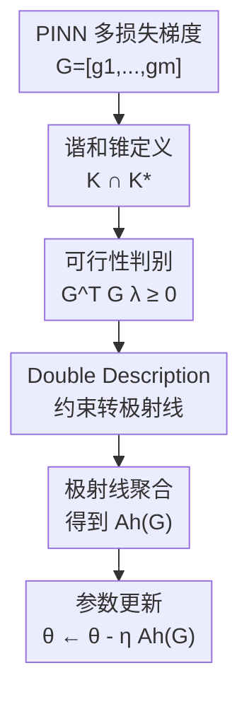

# Harmonized Cone for Feasible and Non-conflict Directions in Training Physics-Informed Neural Networks

**会议**: ICLR2026  
**OpenReview**: [https://openreview.net/forum?id=PRYl1mO1go](https://openreview.net/forum?id=PRYl1mO1go)  
**代码**: 补充材料提供可复现实验代码  
**领域**: 优化 / Physics-Informed Neural Networks  
**关键词**: PINN训练, 多目标优化, 梯度冲突, 损失重加权, 锥几何  

## 一句话总结
这篇论文把 PINN 多损失训练中的“可由非负损失权重实现”和“不会让任一损失上升”统一成谐和锥（harmonized cone），并提出 HARMONIC 用 Double Description 方法在该锥内构造更新方向，在多个 PDE / IDE 基准上通常优于现有重加权和多目标梯度方法。

## 研究背景与动机
**领域现状**：Physics-Informed Neural Networks（PINNs）用神经网络表示 PDE 解，并通过自动微分把 PDE 残差、初始条件、边界条件以及辅助物理约束写进训练损失。典型训练目标不是单一 loss，而是若干个物理相关 loss 的组合；例如一个方程可能同时有 PDE residual、initial loss、boundary loss，复杂任务还会加入积分约束、观测数据约束或辅助变量约束。

**现有痛点**：多损失让 PINN 训练很容易出现梯度病态。一类方法做自适应重加权，例如 LRA、NTK、ReLoBRaLo，通过调整各 loss 系数缓解尺度不平衡；但它们只保证更新来自非负加权和，不能保证该方向真的同时降低每个 loss。另一类方法借鉴多目标优化，例如 MGDA、PCGrad、CAGrad、Aligned-MTL、ConFIG，试图让更新方向与每个 loss 梯度都不冲突；但仅追求 non-conflict 时，得到的方向未必能写成各 loss 梯度的非负组合，可能对应某些“负权重”的隐含目标，训练会偏离原本的 PINN 物理约束。

**核心矛盾**：PINN 不是普通多任务学习里“任务之间可以折中”的设置。PDE 残差、边界条件、初始条件都应同时趋近于零，因此一个好的更新方向至少要满足两件事：第一，它应当是可行的，即能解释为 $\nabla_\theta \sum_j \lambda_j L_j$ 且 $\lambda_j \ge 0$；第二，它应当不冲突，即与每个单独梯度 $g_j=\nabla_\theta L_j$ 的内积非负，沿负方向更新时不会一边优化一个约束一边破坏另一个约束。以往方法往往只守住其中一半。

**本文目标**：作者想回答一个更几何化的问题：给定所有 loss 的梯度集合，哪些方向同时“可由非负重加权产生”并且“对每个 loss 都非冲突”？如果这样的区域存在，如何以可计算的方式从该区域中选出训练方向？进一步，还要证明这个策略在非凸目标上具有 Pareto-stationary 收敛性质，并验证它不会给 PINN 训练带来明显额外开销。

**切入角度**：论文从锥几何出发观察多损失梯度。所有非负加权梯度张成一个 primal gradient cone $K$，代表可行方向；所有与每个 loss 梯度内积非负的方向构成 dual gradient cone $K^*$，代表非冲突方向。于是“好方向”自然就是 $K \cap K^*$。这个交集不是启发式权重，也不是 pairwise projection，而是直接刻画 PINN 多损失训练最想要的方向集合。

**核心 idea**：用 primal cone 和 dual cone 的交集定义谐和锥 $H$，再把当前梯度约束转成 extreme rays 并聚合，从而每一步都在“可行且非冲突”的区域内更新 PINN 参数。

## 方法详解

### 整体框架
HARMONIC 的输入是当前迭代所有 loss 对网络参数的梯度矩阵 $G=[g_1,\ldots,g_m]$，输出是一个用于替代普通加权梯度的更新方向 $A_h(G)$。它先把“非负损失权重”和“所有 loss 非冲突”写成同一个锥约束，再用 Double Description 方法把约束形式转成生成射线，最后把这些射线映射回参数空间并归一化聚合。整个流程的重点不是重新设计 PINN 架构，而是在每一次反向传播后修正多损失梯度的合成方式。

这张图里的贡献节点和下面的关键设计一一对应：谐和锥给出目标区域，可行性判别把区域转成可操作约束，Double Description 与极射线聚合负责实际生成更新方向。PINN 的采样点、网络结构、Adam / SGD 等训练脚手架并不是本文创新，论文主要替换的是“多个 loss 梯度如何合成一步更新”。

### 关键设计
**1. 谐和锥：把可行和非冲突统一成同一个几何区域**

论文先定义 $m$ 个 loss 的梯度矩阵 $G=[g_1,\ldots,g_m]$，其中 $g_j=\nabla_\theta L_j$。所有非负重加权方向构成 primal gradient cone：$K=\{G\lambda\mid \lambda\in\mathbb{R}_+^m\}$。如果更新方向落在 $K$ 中，它就能被解释为某个非负加权总损失的梯度，这一点对应 PINN 训练里“不要为了降低一个物理约束而给另一个约束负权重”的可行性要求。

另一方面，dual gradient cone 定义为 $K^*=\{y\in\mathbb{R}^d\mid G^\top y\ge 0_m\}$。当方向 $y$ 落在 $K^*$ 中，它与每个 loss 梯度的内积都是非负的；在梯度下降使用 $-y$ 更新时，每个 loss 在一阶近似下都不会被推高。本文的关键定义是谐和锥 $H=K\cap K^*$，等价写作 $H=\{z\mid G^\top z\ge 0_m, D^\top z\ge 0_m\}$，其中 $D$ 是 $G^\top$ 的 Moore-Penrose 伪逆。这个定义把以往“重加权”和“non-conflict”两条线合成一个判据：只在 $K$ 里还不够，只在 $K^*$ 里也不够，必须在交集中。

**2. 可行性判别：用 $G^\top G\lambda\ge 0$ 直接检查重加权是否会冲突**

在实际训练中，最自然的可行方向是 $G\lambda$，因为它就是各 loss 梯度的非负组合。问题是，$G\lambda$ 虽然自动属于 $K$，却未必属于 $K^*$；也就是说，一个看似合法的 loss weighting 仍可能让某个 loss 的梯度内积为负。论文的 Theorem 1 给出简洁条件：当 $\lambda\ge 0$ 时，$G\lambda\in H$ 当且仅当 $G^\top G\lambda\ge 0_m$。

这个条件非常有用，因为它把参数空间里高维方向是否在谐和锥中，降成了 $m$ 维 loss 空间里的约束。直观上，$G^\top G$ 是 loss 梯度之间的 Gram 矩阵，里面记录了哪些 loss 梯度互相同向、正交或冲突。若某组权重 $\lambda$ 让 $G^\top G\lambda$ 出现负分量，说明合成方向虽然是非负权重形成的，但对某个具体 loss 来说仍是冲突的。类似地，Theorem 2 从 dual cone 侧给出 $D^\top D w\ge 0_m$，解释为什么只保证 non-conflict 的方向也可能不可行。

**3. Double Description 与极射线聚合：把锥约束转成可执行更新**

HARMONIC 不是在每一步求一个黑盒优化问题，而是把谐和锥的半空间表示转成极射线表示。具体地，它构造关于 $\lambda$ 的约束矩阵 $A=[I_m; G^\top G/\|G\|^2]$，其中 $I_m$ 保证 $\lambda\ge 0$，Gram 约束保证 $G\lambda$ 不冲突。Double Description 方法逐行处理这些半空间约束，把当前 ray set 分成正侧、零侧和负侧；当一条已有射线违反新约束时，就用正侧和负侧射线组合生成新的候选射线，并剪掉重复项，最终得到 $\Pi=[\pi_1,\ldots,\pi_p]$。

得到 $\Pi$ 后，算法把每个 loss-space 射线映射回参数空间：$r_j=G\pi_j$。这些 $r_j$ 就是谐和锥中的 extreme rays。HARMONIC 将它们归一化求和得到方向 $\hat d$，再用所有 loss 梯度在该方向上的投影和进行缩放：$A_h(G)=(\mathbf{1}_m^\top G^\top \hat d)\hat d$。这样的聚合避免了只选某一条极射线导致退化，也让更新方向落在谐和锥内部，从而同时维持可行与非冲突。

**4. 非退化与收敛保证：避免“某个 loss 被完全牺牲”**

许多多目标梯度方法表面上满足一部分几何性质，但可能退化成只照顾一个 loss。例如 MGDA 在某些梯度配置下会选择 convex hull 中最小范数点，却可能几乎完全对齐到最小梯度，导致其他 loss 缩放因子为零。本文强调 non-degenerate scaling：每个 loss 都应保留非平凡贡献，尤其在 PINN 中，初值、边界、PDE residual 任何一项长期被压掉都会破坏物理解。

理论上，作者证明谐和锥非空且存在非平凡元素。Theorem 4 从 convex gradient hull $U=\{G\lambda\mid \lambda\ge 0,\mathbf{1}^\top\lambda=1\}$ 出发，取其中最小范数点 $u^*$，并说明在满秩假设下 $\|u^*\|>0$ 且 $u^*\in H$。Theorem 3 进一步给出非凸设置下的收敛界：若总梯度 Lipschitz 且步长 $\eta\le 2/\mu$，HARMONIC 要么收敛到 Pareto-stationary point，要么满足平均总梯度范数随 $T$ 以 $O(1/\sqrt{T})$ 的意义下降。对 PINN 训练而言，这给“每一步都在谐和锥里走”提供了比经验 trick 更硬的支撑。

### 损失函数 / 训练策略
论文没有改变 PINN 的物理损失形式，而是改变多损失梯度的合成策略。一般 PINN 仍然包含 PDE 残差损失、初始条件损失、边界条件损失以及任务相关辅助损失；每次反向传播分别得到 $g_j=\nabla_\theta L_j$ 后，HARMONIC 用 $A_h(G)$ 替代普通的加权和梯度更新参数：$\theta^{(t+1)}=\theta^{(t)}-\eta^{(t)}A_h(G^{(t)})$。

实验设置遵循 PINNacle / A-PINN 基准：主实验使用 3 层、每层 50 个神经元的网络，训练 50,000 次迭代，激活函数为 tanh，初始化为 Glorot normal，优化器主要沿用对应基准设置。作者在学习率 $10^{-3}$ 和 $10^{-4}$ 下比较，主表报告每个方法的最好结果。对不同 PDE，loss 数量为 3 或 4；附录还测试了 8 个 loss 的 Navier-Stokes 设置，用于说明 Double Description 步骤在更多 loss 分量下仍可接受。

## 实验关键数据

### 主实验
主实验覆盖 PINNacle 中的 Wave1d-C、Poisson2d-C、HNd、HInv，以及 A-PINN 中的 Volterra1d。指标是 5 个随机种子上的 relative L2 error，数值越低越好。最能体现差异的是 Poisson2d-C：大量 baseline 卡在 $0.5$ 到 $0.7$ 左右，而 HARMONIC 降到 $0.0214$。

| 数据集 | 指标 | HARMONIC | 最强/代表性对比 | 提升解读 |
|--------|------|----------|----------------|----------|
| Wave1d-C | relative L2 error | 0.0655 (0.0293) | ConFIG 0.0668 (0.0279) | 与最强 non-conflict 方法基本持平，略优 |
| Poisson2d-C | relative L2 error | 0.0214 (0.0179) | Aligned-MTL 0.2847 (0.2363) | 大幅降低误差，说明可行性约束很关键 |
| HNd | relative L2 error | 0.0005 (0.0000) | ReLoBRaLo 0.0004 (0.0000) / CAGrad 0.0005 (0.0001) | 接近最优，差异很小 |
| Volterra1d | relative L2 error | 0.0003 (0.0001) | ReLoBRaLo 0.0002 (0.0000) | 接近最优，稳定优于多数 MOO 方法 |
| HInv | relative L2 error | 0.0461 (0.0098) | ConFIG 0.0466 (0.0068) | 略优于 ConFIG，明显优于重加权失败情形 |

论文还报告了完整 baseline：MultiAdam、LRA、ReLoBRaLo、MGDA、PCGrad、CAGrad、IMTL-G、Aligned-MTL、ConFIG。整体趋势是 non-conflict 方法通常比单纯重加权强，但只靠 non-conflict 仍会在某些数据集上出现不可行更新；HARMONIC 的优势集中体现在这些“需要同时守住两类约束”的场景。

### 消融实验
论文没有做传统的“去掉模块 A/B”消融，而是做了更贴近核心假设的干预实验：当 baseline 的更新方向 $A(G)$ 离开谐和锥 $H$ 时，用 HARMONIC 把更新拉回 $H$ 内，观察性能是否改善。结果显示，对 ReLoBRaLo、CAGrad、ConFIG 这三类不同 baseline，加上谐和锥约束后通常更好，尤其 Poisson2d-C 改善很明显。

| 配置 | Poisson2d-C relative L2 | 说明 |
|------|-------------------------|------|
| ReLoBRaLo | 0.6602 (0.0221) | 单纯自适应重加权，可能冲突 |
| H-ReLoBRaLo | 0.0948 (0.1763) | 离开 $H$ 时切换到 HARMONIC，误差显著下降 |
| CAGrad | 0.7806 (0.1553) / 主表最佳学习率为 0.6969 (0.0197) | 受均值梯度牵引，可能不保证全部条件 |
| H-CAGrad | 0.0312 (0.0122) | 谐和锥约束后接近 HARMONIC 主结果 |
| ConFIG | 0.6954 (0.4296) / 主表最佳学习率为 0.6856 (0.0274) | 保证 non-conflict，但可能不可行 |
| H-ConFIG | 0.0094 (0.0022) | 在该任务上比原 ConFIG 大幅更稳 |

### 关键发现
- Poisson2d-C 是最有说服力的案例：原始 ReLoBRaLo / ConFIG 在训练中多次出现 $A(G)\notin H$，test relative L2 先降后停滞；一旦离开 $H$ 就用 HARMONIC 纠正，误差可以继续下降到接近零。
- toy example 显示，仅用可行的 conic combination 会被大范数 loss 主导，仅用 non-conflict 方向又可能在 Pareto front 之外提前收敛；HARMONIC 从多个初始点都收敛到 Pareto front。
- 计算开销并没有明显爆炸。主表中 HARMONIC 每 100 epoch 的耗时与 ConFIG、Aligned-MTL 接近，通常远快于 MGDA 和 CAGrad 这类每步带迭代优化的办法。
- 在两个 loss 的设置下，HARMONIC、DCGD、ConFIG 的表现非常接近，因为此时几何条件退化得更简单；论文真正的价值主要在三个及以上 loss 的 PINN 设置。

## 亮点与洞察
- 这篇论文最漂亮的地方是把 PINN 多损失训练中两个常被混在一起的问题拆清楚了：loss weighting 的“非负权重可解释性”和 MOO 的“每个 loss 不冲突”不是同一个条件。用 $K\cap K^*$ 表达后，很多 baseline 为什么会失败变得非常直观。
- HARMONIC 对 ConFIG 这类方法的批评很有启发：一个方向可以让所有 loss 的内积为正，但仍然不能由原始 loss 梯度的非负组合产生。对 PINN 来说，这相当于更新方向不再对应原来的物理约束组合，短期 loss 可能下降，泛化或 test error 却会变差。
- Double Description 的使用很巧妙。作者没有把问题写成每步昂贵的通用约束优化，而是利用 loss 数量 $m$ 通常远小于参数维度 $d$ 的结构，在 $m$ 维约束上找 extreme rays，再映射回参数空间。
- 谐和锥可以迁移到其他多损失训练场景，尤其是那些“所有目标都必须同时满足”而不是“目标之间可以偏好折中”的问题，例如多物理场约束学习、带守恒律的神经算子训练、约束强化学习中的多安全约束优化。

## 局限与展望
- 方法依赖每个 loss 的独立梯度，因此一次迭代中需要拿到 per-loss gradients。对超大模型或 loss 数很多的任务，这部分内存和反向传播调度成本可能比表格中的小型 PINN 更明显。
- Double Description 的复杂度随 loss 数量和约束形状可能增长。论文在最多 8 个 loss 的 NS2d-C 上展示了可接受开销，但还没有证明几十个甚至上百个目标时依然实用。
- 实验主要集中在 PINNacle / A-PINN 这类中小规模 PDE / IDE 基准，网络结构也较小。真实工程 PDE、复杂几何、高维多物理耦合问题中，梯度噪声、采样策略和优化器状态可能带来额外变量。
- HARMONIC 当前默认所有 loss 都应被同等地保持可行且非冲突，但有些任务确实需要偏好，例如某些边界条件比辅助正则更重要。作者也在未来工作中提到，可以把 preference-guided MOO 融入谐和锥内部的方向选择。
- 理论分析建立在梯度矩阵满秩、总梯度 Lipschitz 等假设上，实际训练中 loss 梯度可能相关性极强甚至退化。论文给了存在性和收敛性解释，但退化数值情形下的稳定实现仍值得进一步研究。

## 相关工作与启发
- **vs LRA / NTK / ReLoBRaLo**: 这些方法关注 loss 权重和梯度尺度平衡，更新通常仍在 primal cone $K$ 内，因此具备非负加权解释；但它们不检查 $G^\top A(G)$ 是否逐项非负，所以可能发生 conflict。HARMONIC 保留可行性，同时额外要求 non-conflict。
- **vs MGDA**: MGDA 在 convex hull 中找最小范数点，能提供可行且非冲突的方向，但可能退化到只照顾某个梯度，导致部分 loss 的 scaling factor 为零。HARMONIC 强调 non-degenerate scaling，希望每个 PINN 约束都不被彻底牺牲。
- **vs PCGrad / CAGrad / IMTL-G**: 这些方法通过投影、均值附近搜索或方向-尺度平衡来缓解梯度冲突，但多数是启发式，不同时保证可行、非冲突和非退化。HARMONIC 的优势是把三个要求写成明确几何约束。
- **vs Aligned-MTL / ConFIG**: 它们更明确地追求 non-conflict，尤其 ConFIG 让更新与各 loss 梯度有正投影；但论文指出这种方向可能落在 primal cone 外，无法解释为原始 loss 的非负重加权。HARMONIC 用 $K\cap K^*$ 修补了这类不可行问题。
- **vs DCGD**: DCGD 也有 dual cone 几何分析，并在两个 loss 上效果接近 HARMONIC / ConFIG；但它难以直接扩展到三个以上 loss。HARMONIC 的 Double Description 设计正是为了处理 PINN 中更常见的多 loss 场景。

## 评分
- 新颖性: ⭐⭐⭐⭐⭐ 用谐和锥把可行重加权和非冲突更新统一起来，概念清晰且针对 PINN 痛点。
- 实验充分度: ⭐⭐⭐⭐ 覆盖多个 PDE / IDE、学习率、干预实验和耗时分析，但大规模真实工程案例还不多。
- 写作质量: ⭐⭐⭐⭐ 论文主线很清楚，几何解释和失败案例直观；部分证明和公式排版较密，需要读者有 MOO / cone 基础。
- 价值: ⭐⭐⭐⭐⭐ 对 PINN 多损失训练很有实用价值，也给更一般的约束型多目标优化提供了可复用视角。

<!-- RELATED:START -->

## 相关论文

- [\[ICLR 2026\] Fast Convergence of Natural Gradient Descent for Over-parameterized Physics-Informed Neural Networks](fast_convergence_of_natural_gradient_descent_for_over-parameterized_physics-info.md)
- [\[ICLR 2026\] Difference Predictive Coding for Training Spiking Neural Networks](difference_predictive_coding_for_training_spiking_neural_networks.md)
- [\[ICLR 2026\] Rapid Training of Hamiltonian Graph Networks using Random Features](rapid_training_of_hamiltonian_graph_networks_using_random_features.md)
- [\[ICLR 2026\] Directional Convergence, Benign Overfitting of Gradient Descent in leaky ReLU two-layer Neural Networks](directional_convergence_benign_overfitting_of_gradient_descent_in_leaky_relu_two.md)
- [\[ICLR 2026\] LDT: Layer-Decomposition Training Makes Networks More Generalizable](ldt_layer-decomposition_training_makes_networks_more_generalizable.md)

<!-- RELATED:END -->
