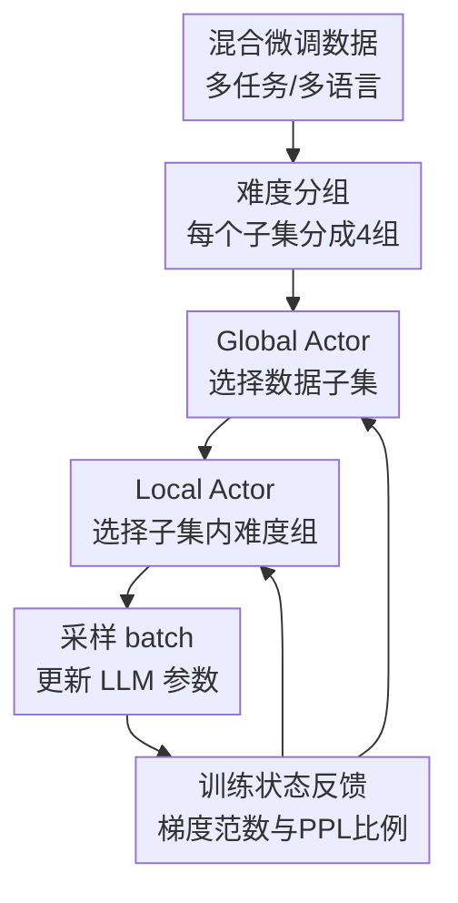

# HBO: Hierarchical Balancing Optimization for Fine-Tuning Large Language Models

**会议**: ICLR2026  
**OpenReview**: [https://openreview.net/forum?id=JnhahbMvRE](https://openreview.net/forum?id=JnhahbMvRE)  
**代码**: https://github.com/weixuan-wang123/HBO  
**领域**: LLM 微调优化 / 数据采样 / 多任务训练  
**关键词**: 层级采样, 双层优化, 数据混合, LLM微调, 动态课程学习

## 一句话总结
HBO 把 LLM 指令微调中的数据混合问题拆成“跨数据集怎么采样”和“每个数据集内部按难度怎么采样”两层，用 Global Actor 与 Local Actor 根据训练状态动态更新采样概率，在多语言和多任务微调上稳定优于静态采样与已有动态数据混合方法。

## 研究背景与动机
**领域现状**：大模型的监督微调通常不再只依赖单一数据集，而是把多种任务、领域、语言的 instruction-response 数据混在一起训练。这样的混合数据能带来更好的泛化能力：模型既见过通用聊天数据，也见过数学、金融、医学或不同语言的数据，最终在下游任务上更不容易只会一种能力。

**现有痛点**：混合数据的难点在于“该让模型多看谁”。最朴素的比例采样会让大数据集天然占据训练预算，小语种、小领域或稀缺任务容易被淹没；均匀采样又可能过度放大小数据集，带来噪声或过拟合。已有动态数据混合方法主要调整不同数据集之间的权重，也就是做 global balancing，但它们往往默认一个数据集内部是相对均质的。

**核心矛盾**：真实的指令数据不是这样。即使同属一个语言或一个任务，样本内部也有容易题、困难题、质量差异和学习进度差异。只在数据集级别重分配采样概率，相当于只解决了“哪一桶数据该多采”，却没有解决“桶里面哪些样本更适合当前训练阶段”。这会限制动态采样的上限。

**本文目标**：作者希望让 LLM 在微调过程中根据自身训练状态自动决定数据使用策略：一方面跨数据集分配训练预算，避免大数据源主导训练；另一方面在每个数据集内部按样本难度和学习进度分配采样概率，让模型既不过早抛弃简单样本，也能持续关注尚未学好的困难区域。

**切入角度**：HBO 的核心观察是，数据混合并不是单层选择问题，而是天然具有层级结构：先选数据子集，再选子集内部的难度组。若把 LLM 与训练数据视作环境，把采样分布视作可学习策略，就可以用轻量 actor 根据模型的实时反馈来更新采样概率，而不是提前手工设定一个固定温度。

**核心 idea**：用双层优化和 REINFORCE，把“跨数据集采样”和“数据集内难度采样”分别交给 Global Actor 与 Local Actor 学习，并用梯度范数和困惑度改善比例作为两级 reward，引导 LLM 在微调中自适应地平衡数据混合。

## 方法详解

### 整体框架
HBO 的输入是一组混合训练数据 $D=\{D_i\}_{i=1}^{N}$。每个数据子集 $D_i$ 可以对应一种语言、一个任务或一个领域；在每个子集内部，作者再用 SuperFiltering / IFD 难度信号把样本均分成若干难度组，主实验使用 4 组，从最容易到最困难。

训练时，HBO 不是直接从所有样本中采 batch，而是先由 Global Actor 采样一个子集 $\tilde{i}$，再由该子集对应的 Local Actor 采样一个难度组 $\tilde{j}$，最后从 $D_{\tilde{i},\tilde{j}}$ 中取 batch 更新 LLM。每隔固定步数，系统会在各个子集和难度组上计算 reward，并用 policy gradient 更新 actor，让下一阶段的采样分布向“当前更值得学”的区域移动。

从优化形式看，HBO 把模型参数 $\theta$ 的训练放在内层，把采样策略参数 $\psi_{global}$ 和 $\psi_{local}$ 的学习放在外层。内层目标是在当前采样分布下最小化 SFT loss；外层目标是找到一组采样策略，使训练后的模型在混合数据上表现更好。因为“采样哪个子集 / 哪个组”本身不可直接对 actor 微分，作者用 REINFORCE 形式更新策略：$\psi \leftarrow \psi + \gamma R \nabla_{\psi}\log p_{\psi}(\cdot)$。

### 关键设计
**1. 层级采样：把数据混合从一层权重拆成“子集-难度组”两层**

过去的动态混合方法通常只学习每个数据集的采样概率。例如在多语言微调中，actor 可能决定英语、中文、俄语、斯瓦希里语各采多少；在多任务微调中，actor 决定通用、数学、金融、医学各采多少。HBO 认为这还不够，因为同一个数据集内部也有学习价值差异。于是它把每个 $D_i$ 进一步切成 $M_i$ 个组，主实验用 SuperFiltering 指标均分为 4 个难度层级，Group 1 最容易，Group 4 最困难。

这种层级结构让采样决策更细：Global Actor 负责回答“当前哪个数据子集更需要训练预算”，Local Actor 负责回答“在这个子集内部，应该更看容易样本、中过渡样本，还是困难样本”。两层组合后，HBO 可以表达比单层数据集权重更丰富的训练策略。例如它可以同时降低英语整体采样比例，但在英语内部提高困难组比例；也可以提高小语种采样比例，同时保留其中容易样本来稳定学习。

**2. Global Actor：用梯度 L2 范数衡量某个子集还有多少可学内容**

全局层面需要一个信号告诉 actor：哪个数据子集当前更值得被采样。HBO 使用在子集 $D_i$ 上随机 batch 的 loss 梯度 L2 范数作为 global reward：$R_{global}(i)=\|\nabla_{\theta}L(B_i;\theta)\|_2$。直觉是，如果模型已经很好地拟合某个子集，该子集上的梯度会变小；如果模型在某个子集上仍有明显学习空间，梯度范数会更大。

这个选择比直接看 loss 更像“学习动态”的信号。loss 高可能来自噪声、任务本身难或标注不一致，但梯度范数强调当前参数还能从这批数据中得到多强的更新推动。Global Actor 得到较大的 $R_{global}$ 后，会提高对应子集的采样概率；当模型逐渐掌握该子集，梯度变小，采样重心自然转移到其他仍需训练的数据源。

**3. Local Actor：用当前 PPL / 初始 PPL 的比例衡量组内学习进度**

局部层面的目标不是简单地“困难样本越多越好”。如果一直采最难的样本，模型可能训练不稳；如果只保留看似高价值的困难样本，又会丢掉简单样本带来的覆盖性和基础能力。HBO 因此把 local reward 设计成当前模型困惑度与初始模型困惑度的比例：$R_{local}(i,j)=\frac{1}{K}\sum_{k=1}^{K}\frac{PPL(y_k;x_k,\theta)}{PPL(y_k;x_k,\theta_0)}$。

这个比例的含义是“相对起点还剩多少没学会”。如果某个难度组上的 PPL 已经相对初始模型明显下降，说明训练进展快，reward 会变小，Local Actor 会减少该组采样；如果某个组改善有限，比例仍高，actor 就会给它更多机会。这样的局部信号避免了固定 curriculum 的僵硬：模型不是预设先易后难，而是在训练中根据实际改善情况决定容易组和困难组的轮换。

**4. 轻量 actor 与周期更新：用小网络学习采样策略而不改模型主体**

HBO 的两个 actor 都是两层全连接网络，只负责输出对应采样单元的概率分布，不参与最终推理，也不是 RLHF 里的 reward model。每一步训练先按 actor 分布采样数据并更新 LLM；每隔 $F_{global}$ 或 $F_{local}$ 步，再分别计算全局和局部 reward，用 REINFORCE 更新 actor 参数。主实验中两个 actor 都每 200 步更新一次，actor 学习率为 $1\times10^{-4}$，LLM 全参数微调用 AdamW、学习率 $1\times10^{-5}$、batch size 16、训练 3 个 epoch。

这种设计的好处是实现成本相对可控：actor 带来的额外训练时间约为静态平衡采样的 15%。它没有要求训练一个复杂的样本打分器，也没有改变 LLM 的损失函数主体，而是把优化压力放在“更聪明地选数据”上。附录的更新频率实验也说明，过于频繁更新会增加运行开销，而 200 步左右能在性能和效率之间取得较好折中。

### 损失函数 / 训练策略
基础 SFT 目标仍是标准负对数似然。对单个 instruction-response 对 $(x_k,y_k)$，模型最小化 $-\log p(y_k|x_k;\theta)$；在多数据集设置下，HBO 不改变 token-level loss，而是改变每个 batch 来自哪个数据子集和哪个难度组。

静态温度采样的基准概率为 $q(i)=M_i/\sum_n M_n$，温度调整后为 $q_{\tau}(i)=q(i)^{1/\tau}/\sum_n q(n)^{1/\tau}$。HBO 用 $\tau=1$ 初始化 Global Actor 和 Local Actor 的采样分布，然后在训练过程中动态更新。每次 actor 更新的统一形式是 $\psi \leftarrow \psi + \gamma R \nabla_{\psi}\log p_{\psi}(\cdot)$，其中 $R$ 可以是全局梯度范数，也可以是局部 PPL 比例。

局部难度分组来自 SuperFiltering 指标，本质上是用小模型计算 IFD 分数。IFD 比较有无 instruction context 时生成 response 的困惑度：$IFD(y_i|x_i)=PPL(y_i|x_i)/PPL(y_i)$。分数越高，表示 instruction 对生成 response 的帮助越小，样本更难；分数越低，说明 instruction 提供了更直接的线索，样本更容易。作者用 Qwen2.5-0.5B 计算这个难度信号，再把每个子集均分为 4 组。

## 实验关键数据

### 主实验
论文在两个设置上验证 HBO。Multilingual 设置使用 Aya Dataset 与 WildChat，覆盖英语、阿拉伯语、德语、西班牙语、印地语、俄语、斯瓦希里语、中文 8 种语言，并在 MMMLU、XCOPA、XStoryCloze、XNLI、MGSM 上零样本评估。Multitask 设置混合 General、Math、Finance、Medical 四类英文数据，在 MMLU、GSM8K、MultiFin-EN、MedMCQA 上评估。模型 backbone 包括 EuroLLM-9B、Llama-3.1-8B 与 Qwen2.5-7B。

| Backbone | 设置 | HBO 平均分 | 最强 baseline 平均分 | 提升 |
|----------|------|------------|----------------------|------|
| EuroLLM-9B | Multilingual $\mu_{ML}$ | 49.37 | 48.50 | +0.87 |
| EuroLLM-9B | Multitask $\mu_{MT}$ | 50.16 | 49.10 | +1.06 |
| Llama-3.1-8B | Multilingual $\mu_{ML}$ | 48.07 | 46.94 | +1.13 |
| Llama-3.1-8B | Multitask $\mu_{MT}$ | 52.28 | 50.94 | +1.34 |
| Qwen2.5-7B | Multilingual $\mu_{ML}$ | 55.21 | 54.26 | +0.95 |
| Qwen2.5-7B | Multitask $\mu_{MT}$ | 60.37 | 59.27 | +1.10 |

从表中可以看到，HBO 在所有 backbone 和两类设置上都超过最强 baseline，且论文报告这些平均指标相对最佳 baseline 的提升具有统计显著性。更细的任务结果也显示，HBO 不只是靠某一个任务拉高均值：例如在 Llama-3.1-8B 的 multitask 设置中，HBO 的 GSM8K 达到 56.94，接近或超过动态 baseline；在 Qwen2.5-7B 的 multilingual 设置中，MGSM 从若干 baseline 的 40-46 区间提升到 48.07。

| 方法 | Llama-3.1-8B $\mu_{ML}$ | MMMLU | MGSM | XCOPA | XStoryCloze | XNLI |
|------|--------------------------|-------|------|-------|-------------|------|
| Prop. | 46.25 | 40.78 | 18.00 | 62.70 | 64.63 | 45.11 |
| MoS | 46.44 | 42.60 | 17.87 | 64.30 | 65.58 | 41.86 |
| MoS+ | 46.94 | 41.25 | 17.73 | 64.10 | 64.96 | 46.64 |
| HBO | 48.07 | 44.28 | 20.40 | 63.00 | 65.98 | 46.67 |

### 消融实验
Global Actor 和 Local Actor 的消融说明两层采样都不是摆设。完整 HBO 在 Llama-3.1-8B multilingual 设置下为 48.07；去掉 Local Actor 后降到 47.22，去掉 Global Actor 后降到 47.46；两个都去掉时退回 46.25，相当于只剩比例采样。

| Global Actor | Local Actor | $\mu_{ML}$ | MMMLU | MGSM | XNLI | 说明 |
|--------------|-------------|------------|-------|------|------|------|
| ✓ | ✓ | 48.07 | 44.28 | 20.40 | 46.67 | 完整 HBO |
| ✓ | ✗ | 47.22 | 43.15 | 19.47 | 45.14 | 只做跨数据集动态平衡 |
| ✗ | ✓ | 47.46 | 43.43 | 19.13 | 46.44 | 只做数据集内难度平衡 |
| ✗ | ✗ | 46.25 | 40.78 | 18.00 | 45.11 | 比例采样 baseline |

难度组数量也有明显影响。1 组相当于没有局部分层，$\mu_{ML}$ 为 47.22；2 组为 47.09；4 组达到 48.07；8 组和 16 组分别为 47.45 和 47.87。这个结果支持作者的解释：太粗的分组捕捉不到内部异质性，太细的分组会切碎学习信号，4 组是较好的折中。

### 关键发现
- Global Actor 学到的采样分布不是固定偏向小数据或大数据，而是随训练阶段迁移。可视化显示，在多语言设置中，采样重心会逐渐从英语等高资源语言转向低资源语言；在多任务设置中，也会在 General、Math、Medical、Financial 之间动态重分配。
- Local Actor 出现了类似周期性 curriculum 的行为。以 Llama-3.1-8B 的 English subset 为例，困难组和容易组的采样概率会大约每 800 步交替上升，这说明 HBO 没有简单执行“越来越难”的单调课程，而是在不同难度层之间来回补齐学习缺口。
- HBO 对初始采样 prior 较鲁棒。Llama-3.1-8B multilingual 设置下，HBO 在 $\tau=1$、$\tau=10$、$\tau=\infty$ 下的 $\mu_{ML}$ 分别为 48.07、47.98、48.06，都明显高于 Prop. 的 46.25，而 MoS 对温度更敏感。
- 容易样本并非无用。作者逐步丢弃最容易样本，并保持训练 compute 不变，发现丢弃 25% 容易样本后 $\mu_{ML}$ 从 48.07 降到 47.41；丢弃 75% 后降到 46.55，接近 baseline。这说明容易样本对多样性和稳定能力仍有贡献。
- 附录显示 HBO 对模型尺寸和 reward 选择也比较稳定。Llama-3.2-1B、3B、Llama-3.1-8B 上 HBO 都优于启发式采样，且 8B 的增益更大；全局 reward 用 L2 norm、局部 reward 用 PPL Ratio 的组合最好，但其他 reward 组合也能超过最强启发式 baseline。

## 亮点与洞察
- HBO 的亮点在于把“数据混合”从数据集级别推进到数据集内部。很多 LLM 微调工作会讨论数据比例，但较少同时处理一个数据源内部的难度异质性；本文的层级 actor 设计把这两个问题放在同一个优化框架里。
- 全局 reward 和局部 reward 的语义分工很清楚。梯度范数回答“哪个数据集还在推动模型学习”，PPL 比例回答“哪个难度组相对初始状态还没学好”，两者都来自模型训练状态，不需要额外人工标注。
- 论文对“容易样本”的分析很有价值。当前不少数据筛选方法会强调难样本或高质量样本，但 HBO 的实验提醒我们：在混合微调中，容易样本可能提供覆盖性、语言分布和稳定梯度，直接丢掉会损害整体能力。
- 这套方法可以迁移到其他训练阶段。比如预训练数据混合、偏好学习数据混合、代码/数学/多语言联合训练，都可以用“全局来源 + 局部难度/质量桶”的层级策略来替代单层比例表。

## 局限与展望
- HBO 需要在训练过程中周期性计算各子集和各组的 reward，并维护额外 actor，因此相比静态采样有额外开销。论文报告约 15% 总训练时间 overhead；在更大规模预训练或更多数据源场景下，这个成本可能更明显。
- 局部难度分组依赖 SuperFiltering / IFD 这样的预先打分。虽然附录显示 PPL 和 loss 也能作为分组指标，但如果难度分数与真实学习价值错位，Local Actor 学到的组级策略仍会受限。
- 当前实验主要覆盖 SFT 场景，任务包括多语言和多任务指令微调。对于 RLHF、DPO、长上下文训练或多模态微调，reward 的定义、分组粒度和 actor 更新频率是否仍然合适，还需要进一步验证。
- 方法按组学习采样概率，而不是直接对单个样本做在线选择。这样更稳定也更便宜，但会损失组内细粒度差异；未来可以考虑“层级组采样 + 组内轻量样本重加权”的混合方案。
- 论文主要报告 accuracy 类任务平均指标，对训练稳定性、灾难遗忘、不同数据源的公平性和下游安全性讨论较少。若用于真实产品微调，还需要加入更多行为和风险评估。

## 相关工作与启发
- **vs 静态比例 / 温度 / 均匀采样**: 静态方法在训练开始前固定采样概率，无法根据模型学习状态调整；HBO 从相同的温度分布初始化，但训练中持续更新两层 actor，因此能在不同阶段改变关注点。
- **vs MultiDDS / MultiUAT**: 这些动态方法也会调整不同数据集之间的分布，但主要解决 global balancing。HBO 的差异在于额外引入每个数据集内部的 Local Actor，把样本难度和学习进度纳入采样决策。
- **vs MoS / MoS+**: MoS 类方法同样关注 fine-tuning 数据使用优化，但 HBO 的 reward 与层级结构更明确：全局用梯度范数捕捉子集学习动态，局部用 PPL ratio 捕捉难度组进展。实验中 HBO 在三种 backbone 和两类设置上都超过 MoS 系列。
- **vs 数据筛选方法**: 数据筛选常常一次性保留“更有价值”的样本，可能会丢掉容易样本。HBO 的发现是，容易样本在训练中仍可能阶段性有用，因此更适合作为动态采样对象，而不是被永久删除。

## 评分
- 新颖性: ⭐⭐⭐⭐☆ 层级 global-local 动态采样思路清楚，把已有数据混合优化推进到数据集内部异质性层面。
- 实验充分度: ⭐⭐⭐⭐☆ 三个 backbone、两类设置、九个任务和多组消融较扎实，但更大规模训练和非 SFT 场景还未覆盖。
- 写作质量: ⭐⭐⭐⭐☆ 方法动机、reward 设计和实验结论都比较清楚，部分表格很密，读者需要自己梳理主线。
- 价值: ⭐⭐⭐⭐☆ 对实际 LLM 微调的数据配比有直接启发，尤其适合多语言、多领域、数据规模差异大的训练混合。

<!-- RELATED:START -->

## 相关论文

- [\[ICLR 2026\] FZOO: Fast Zeroth-Order Optimizer for Fine-Tuning Large Language Models towards Adam-Scale Speed](fzoo_fast_zeroth-order_optimizer_for_finetuning_large_language_models_towards_ad.md)
- [\[ICLR 2026\] Adaptive Acquisition Selection for Bayesian Optimization with Large Language Models](adaptive_acquisition_selection_for_bayesian_optimization_with_large_language_mod.md)
- [\[ICLR 2026\] Scaling Multi-Task Bayesian Optimization with Large Language Models](scaling_multi-task_bayesian_optimization_with_large_language_models.md)
- [\[ICLR 2026\] Bi-LoRA: Efficient Sharpness-Aware Minimization for Fine-Tuning Large-Scale Models](bi-lora_efficient_sharpness-aware_minimization_for_fine-tuning_large-scale_model.md)
- [\[ICLR 2026\] Arbitrary-Order Block SignSGD for Memory-Efficient LLM Fine-Tuning](arbitrary-order_block_signsgd_for_memory-efficient_llm_fine-tuning.md)

<!-- RELATED:END -->
