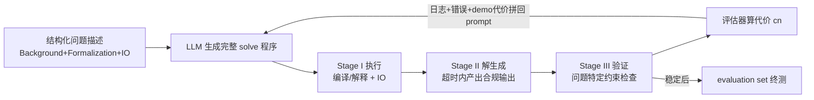

# HeuriGym: An Agentic Benchmark for LLM-Crafted Heuristics in Combinatorial Optimization

**会议**: ICLR 2026  
**OpenReview**: [https://openreview.net/forum?id=HWxHUO15Yy](https://openreview.net/forum?id=HWxHUO15Yy)  
**代码**: 开源 benchmark（链接见论文仓库）  
**领域**: 组合优化 / LLM Agent / 评测基准  
**关键词**: 组合优化, 启发式生成, Agentic Benchmark, LLM 评测, 迭代式精炼, Quality-Yield Index  

## 一句话总结
HeuriGym 把 LLM 丢进一个"读题—写代码—执行反馈—迭代修正"的 agentic 闭环里，让它从零为 9 个真实组合优化问题（EDA、生物、物流等）手写完整启发式算法，并用新指标 QYI 衡量解的质量与可行率——结果连最强的 GPT-o4-mini-high 和 Gemini-2.5-Pro 也只有 0.6 分（专家为 1.0），暴露出 LLM 在工具使用、长程规划和自适应推理上的硬伤。

## 研究背景与动机
**领域现状**：评估 LLM 推理与 agent 能力的主流基准分两类。一类是有标准答案的客观题（AIME、HumanEval、GPQA Diamond、HLE），另一类是主观偏好打分（Chatbot Arena、LLM-as-a-judge）。

**现有痛点**：客观题基准正在快速饱和——SOTA 模型在 AIME/HumanEval 上已超 80%，连号称"博士级"的 HLE 也在几个月内从 3% 飙到 25%，且静态题库面临训练数据污染风险；而主观偏好评测方差极高，评判常被回答结构、emoji 等表面因素带偏，在需要专业知识的技术任务上可靠性差。

**核心矛盾**：现实世界的工程任务要求**迭代推理、创造性算法设计、自适应工具使用**，解既不唯一也无预定义，这恰恰是两类现有基准都覆盖不到的盲区。

**本文目标**：构造一个既有**明确目标函数**、又有**巨大解空间**的评测范式，能同时考察 LLM 的工具增强推理、多步规划、指令遵从和基于运行时反馈的迭代精炼四个维度。

**核心 idea**：**组合优化天然兼具"目标清晰"与"解空间巨大"两大特性**，是理想载体。作者刻意避开 TSP/SAT 这类被预训练语料"背烂"的经典问题，转而选取被引量 <1000 的冷门但真实的 CO 问题，强迫模型**真正推理而非背答案**；并把评测从单轮静态改成**交互式 agentic 闭环**，让模型生成完整自洽的优化程序（自定义数据结构 + 端到端流水线），而非像 FunSearch/ReEvo 那样只在模板里填空。

## 方法详解

### 整体框架
HeuriGym 是一个三阶段流水线 + 反馈回路：模型读到结构化问题描述后，按标准函数签名 `solve(input_file, solution_file)` 生成完整启发式程序；程序经编译/解释执行后，由**验证器**检查约束、**评估器**计算目标代价；执行日志、验证结果、小样本 demo 集上的代价会被拼回 prompt，驱动模型进入下一轮迭代精炼。

### 关键设计

**1. 无脚手架的从零生成：只给接口、不给套路。** 与以往工作手工提供部分实现或限制设计空间不同，HeuriGym 的 user prompt 只暴露函数名、输入路径、输出路径，**不给任何数据结构或算法提示**。模型必须整体性地推理——自己解析输入、构建内部表示、从零设计并实现启发式。System prompt 则注入机器配置（CPU 核数、内存上限）、可用库及版本号、执行超时等环境约束，逼模型生成既正确又不违反运行时限制的现实解。这种设计让基准更贴近"成败取决于能否挖掘问题特定结构"的真实 CO 场景。

**2. SOLVEs@i：把"会不会做"拆成三个里程碑。** 传统 PASS@k 只看能否命中标准答案，无法刻画多轮 agentic 推理。作者定义 $\text{SOLVEs@}i := \frac{1}{N}\sum_{n=1}^{N}\mathbb{1}(\text{在前 }i\text{ 轮内通过阶段 }s)$，其中 $s\in\{\text{I},\text{II},\text{III}\}$ 分别对应**执行通过**（编译/IO 正常）、**解生成**（超时内产出合规输出）、**验证通过**（满足全部约束）。这样能精确定位 agent 到底卡在哪一关，把"调试能力""约束理解""迭代修复"逐级显影。

**3. Quality-Yield Index：可行率与解质量的调和平均。** 仅有 SOLVEs@i 不反映解的好坏，作者再引入两个量：$\text{QUALITY}=\frac{1}{\hat N}\sum_{n=1}^{\hat N}\min(1, c^\star_n/c_n)$ 衡量 LLM 解代价 $c_n$ 相对专家解代价 $c^\star_n$ 的接近度（封顶为 1，即与专家持平算满分），$\text{YIELD}=\hat N/N$ 即通过验证的实例占比。最终 QYI 取二者的加权调和平均：$\text{QYI}=\frac{(1+\beta^2)\cdot\text{QUALITY}\cdot\text{YIELD}}{\beta^2\cdot\text{QUALITY}+\text{YIELD}}$，默认 $\beta=1$。这套类 F-score 的设计对"质量高但能解的少"或"能解的多但质量差"的失衡情形施以更重惩罚，专家基线被锚定为 QYI=1.0 以凸显差距。

**4. 防记忆的问题选取准则 + human-in-the-loop 题面校验。** 候选问题须满足：最高被引论文 <1000 次（排除已进训练语料的教科书问题）、可用纯自然语言+LaTeX 无歧义表述、解空间巨大（单实例可达 $10^{65000}$ 量级）、demo 集与 evaluation 集规模差至少一个数量级、附带可复现的专家基线。题面经人类标注后再用较弱模型（DeepSeek-V3）反复标注歧义并迭代消歧——其假设是"若弱模型都能确认题面无歧义，强模型自然能理解"，且该流程只用于澄清描述、绝不用于提升求解性能。

## 实验关键数据

### 主实验
9 个问题、218 个评测实例，评测 9 个 2024 末至 2025 中发布的 SOTA 模型，温度固定为 0。SOLVEs@i 结果（节选）：

| 模型 | SOLVE_III@10 | SOLVE_III@1 | SOLVE_II@1 |
|------|---|---|---|
| GPT-o4-mini-high | **74.8%** | **53.2%** | **93.1%** |
| DeepSeek-R1 | 73.4% | 44.0% | 60.6% |
| Gemini-2.5-Flash | 67.4% | 25.2% | 56.4% |
| Gemini-2.5-Pro | 65.1% | 20.2% | 42.7% |
| Claude-3.7-Sonnet | 60.1% | 9.2% | 41.3% |
| LLaMA-4-Maverick | 35.8% | 6.0% | 13.3% |

QYI 上限仅 **0.62（Gemini-2.5-Pro）**，即最优模型平均也只有专家解的 ~60% 效果；LLaMA-3.3/4-Maverick 的 QYI <0.30。迭代显著有效：GPT-o4-mini-high 的 SOLVE_III 从 @1 的 53.2% 升到 @10 的 74.8%。

### 进化框架对比
统一用 Gemini-2.5-Pro 为底座，外层进化循环 10 轮、种群 10：

| 框架 | SOLVE_III@10 | QYI |
|------|---|---|
| Gemini-2.5-Pro（基线） | **0.6514** | **0.6170** |
| HSEvo | 0.5000 | 0.4491 |
| EoH | 0.4954 | 0.4492 |
| ReEvo | 0.4771 | 0.4486 |

进化框架反而比裸基线更差——根因是它们**不吸收程序执行反馈**、跨迭代打断上下文，导致反复在同一个有缺陷的初始程序上打补丁；且这些框架原本只针对 <20 行的玩具问题（TSP、装箱），而 HeuriGym 通常需要 300+ 行代码。

### 消融实验（pickup and delivery，QYI）

| 配置 | QYI |
|------|-----|
| 5 demos / 10 轮反馈 | **0.4196** |
| 3 demos / 10 轮 | 0.2829 |
| 0 demos / 10 轮 | 0.2351 |
| 5 demos / 5 轮 | 0.3330 |
| 5 demos / 1 轮 | 0.2350 |

demo 数量和反馈轮数都对性能有显著正向贡献。

### 关键发现
- **质量—可行率权衡**：温度升高（T=0→1）提升多样性与质量但降低可行率（更多无效输出），贪心解码 yield 最高但质量次优——这是 LLM 必须直面的根本矛盾。
- **错误归因**：主要失败模式为幻觉 API（调用不存在/过时的库）、算法逻辑错误、约束误解、超时。
- **案例研究（technology mapping）**：GPT-o4-mini-high 能从朴素 6-LUT 映射逐步演化到带剪枝的 DP 启发式，最终在 yield 与 quality 间取得最佳平衡，证明 LLM 确能学习并精炼启发式，但仍差专家工具 ~40%。

## 亮点与洞察
- **范式选得精准**：用"目标清晰 + 解空间巨大"的组合优化破解了客观题饱和与主观题高方差的两难，且"被引 <1000"这条防记忆红线把"会推理"和"会背书"切得很干净。
- **指标设计有诊断力**：SOLVEs@i 三阶段拆解让人一眼看出 agent 卡在执行、生成还是约束满足；QYI 用调和平均同时压住"质量"和"可行率"，比单一 ELO/PASS@k 信息量大得多。
- **无脚手架是真考试**：要求生成 300+ 行完整自洽程序，而非模板填空，直接把 FunSearch 式进化框架打回原形，揭示了"上下文断裂 + 不吸收执行反馈"是这类方法的死穴。

## 局限与展望
- **仅跑 Python**：易于上手但有执行开销，C++ 仅给出初步结果，因依赖领域库、生成高效正确并行 C++ 困难而难以完整集成。
- **pipeline 仍是基线配置**：未纳入高级 prompting / 多智能体 / 摘要压缩 / 自动 prompt 工程，作者明确把这些作为可在 HeuriGym 上继续探索的方向。
- **代理指标的真实性差距**：当前用形式化的高效代理指标，但科学领域需物理实验验证、EDA 需后端综合确认，真实质量与代理分数间仍有 gap。
- **测试时扩展空间**：迭代自精炼可视为一种 test-time scaling，未来可接入 best-of-N、beam search、进化算法、外部 autotuner 及自验证机制。

## 相关工作与启发
- **与 ALE-Bench / CO-Bench 的区分**：后两者聚焦经典 CO 问题的 metaheuristic 分数优化与 ELO 打分，HeuriGym 则瞄准科学与工程领域的高影响、需发现问题特定结构的实用 CO 问题，并用细粒度 SOLVEs@i / QYI 揭示 agent 在哪一阶段失败、距专家多远。
- **对 LLM-for-CO 两条路线的批判**：相比"形式化 + 依赖精确求解器"（受 NL4Opt 启发的一系列工作）和"模板填空式启发式发现"（FunSearch、AlphaEvolve、ReEvo），HeuriGym 移除了模板与脚手架，更贴近真实 CO 工程。
- **启发**：这套"验证器 + 评估器 + 反馈回路"天然是研究 LLM 自验证、test-time scaling、多智能体协作的共享试验台，对想做 agentic 科学/工程推理的研究者是现成的硬骨头基准。

## 评分
- **新颖性**: ⭐⭐⭐⭐⭐ 把组合优化作为评测载体、配合防记忆准则和无脚手架设定，加上 SOLVEs@i / QYI 双指标，整体范式设计有原创性。
- **实验充分度**: ⭐⭐⭐⭐ 覆盖 9 问题 218 实例 × 9 模型，含进化框架对比、温度/demo/反馈轮数消融与错误归因、案例研究，相当扎实；扣分点在多数消融受预算限制只在单一代表模型上做。
- **写作质量**: ⭐⭐⭐⭐ 动机—范式—指标—实验的逻辑链清晰，Table 1 的横向定位和指标公式交代到位。
- **价值**: ⭐⭐⭐⭐⭐ 暴露了 SOTA LLM 在真实 CO 上仅达专家 60% 的硬差距，开源基准可作为长期演进的公共试验台，对 agentic 推理与科学/工程 LLM 评测有持续价值。

<!-- RELATED:START -->

## 相关论文

- [\[NeurIPS 2025\] Evaluating LLMs for Combinatorial Optimization: One-Phase and Two-Phase Heuristics for 2D Bin-Packing](../../NeurIPS2025/optimization/evaluating_llms_for_combinatorial_optimization_one-phase_and_two-phase_heuristic.md)
- [\[ICLR 2026\] ConRep4CO: Contrastive Representation Learning of Combinatorial Optimization Instances across Types](conrep4co_contrastive_representation_learning_of_combinatorial_optimization_inst.md)
- [\[AAAI 2026\] Pareto-Grid-Guided Large Language Models for Fast and High-Quality Heuristics Design in Multi-Objective Combinatorial Optimization](../../AAAI2026/optimization/pareto-grid-guided_large_language_models_for_fast_and_high-quality_heuristics_de.md)
- [\[ICLR 2026\] NExCO: Native Solution Expansion for Diffusion-based Combinatorial Optimization](nexco_native_solution_expansion_for_diffusion-based_combinatorial_optimization.md)
- [\[ICLR 2026\] Multi-Action Self-Improvement for Neural Combinatorial Optimization](multi-action_self-improvement_for_neural_combinatorial_optimization.md)

<!-- RELATED:END -->
