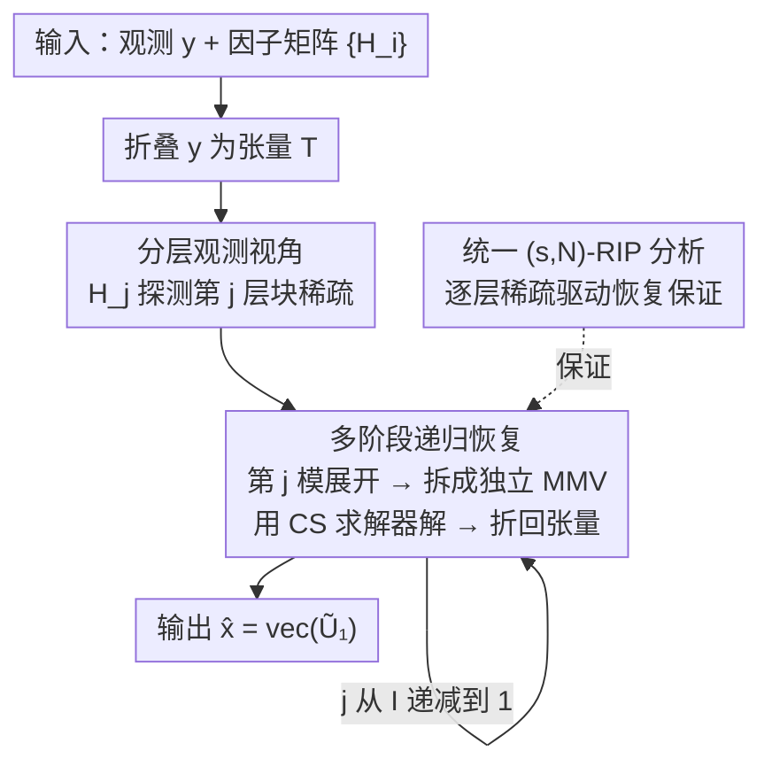

# Hierarchical Multi-Stage Recovery Framework for Kronecker Compressed Sensing

**会议**: ICLR 2026  
**OpenReview**: [https://openreview.net/forum?id=40e58sTE5F](https://openreview.net/forum?id=40e58sTE5F)  
**领域**: 优化与稀疏恢复  
**关键词**: Kronecker 压缩感知, 稀疏恢复, 分层稀疏, RIP 分析, 张量展开  

## 一句话总结
本文为 Kronecker 压缩感知（KCS）提出"分层观测"视角，指出 Kronecker 积测量矩阵的每个因子矩阵实际在不同层级上探测信号稀疏，由此设计出一个把高维恢复拆成逐层 MMV 子问题的多阶段恢复框架（MSR），能统一处理标准/分层/Kronecker 支撑三种稀疏模型，并给出统一的 $(s,N)$-RIP 理论保证；在精度持平 SOTA 的同时把运行时间降低一到三个数量级。

## 研究背景与动机
**领域现状**：Kronecker 压缩感知用多个因子矩阵的 Kronecker 积 $H=\otimes_{i=I}^{1}H_i$ 作为测量矩阵，从带噪线性观测 $y=Hx+n$ 中恢复稀疏向量 $x$。它天然契合多维信号采集场景（通信中的传感器阵列、成像中的可分离滤波器），能在捕获多维结构的同时压低采样复杂度。除了"任意位置稀疏"的标准模型，实际信号常表现出更规整的结构：分层稀疏（如大规模机器通信里"先选活跃设备、每个设备再发稀疏信号"的两级结构）、以及 Kronecker 支撑稀疏（支撑集本身是若干二值支撑向量的 Kronecker 积，常见于雷达成像/无线通信中跨维可分离的信号）。

**现有痛点**：一是**维度爆炸**——$x$ 的长度随因子矩阵数量与尺寸指数增长（$N_i=O(N)$ 时达 $O(N^I)$），通用求解器直接吃整张 $H$，复杂度高到难以承受（如 KroOMP 仍是 $O(N^I)$，KroSBL 时间和空间都是 $O(M^I N^I)$）。二是**结构利用不充分**：多数 KCS 方法忽略 $H$ 的 Kronecker 结构、退化为通用稀疏求解；而像 HiHTP 这类利用分层结构的方法又没用上 Kronecker 结构，仍然代价高。三是**碎片化**：现有算法几乎都只为单一稀疏模型量身定做，换个稀疏模型就要换套路，缺乏统一框架，更没有横跨三种模型的统一 RIP 分析与带保证的恢复算法。

**核心矛盾**：Kronecker 积同时带来了"维度灾难"和"可被利用的结构"两面，但现有方法要么不碰结构（省事但慢且无保证），要么只啃下其中一种结构（专而不通），无法在"低复杂度、跨模型通用、有理论保证"三者上同时达标。

**本文目标**：找到一个统一框架，既能借 Kronecker 结构压低复杂度，又能在标准/分层/Kronecker 支撑三种稀疏下复用，同时给出可证明的恢复保证。

**切入角度**：作者观察到，把 $y=Hx$ 写成张量模乘形式后，对张量做第 $j$ 模展开会发现——因子矩阵 $H_j$ 作用在一个矩阵 $U_j$ 上，而 $U_j$ 中"整行为零"恰好对应"$x$ 的第 $j$ 层块整块为零"。也就是说，**每个因子矩阵只负责探测某一个层级的块稀疏**。

**核心 idea**：用"分层观测视角"把一个高维耦合的恢复问题，沿因子矩阵逐层拆成一串低维的多测量向量（MMV）子问题，逐级求解。

## 方法详解

### 整体框架
方法分两部分：一是用"分层观测视角"重新理解 Kronecker 测量到底在做什么，二是据此设计**多阶段恢复算法（Multi-Stage Recovery, MSR）**，外加一套统一的 RIP 理论分析为算法兜底。

恢复流程的直觉是：把测量 $y$ 按各因子矩阵的维度折叠成张量 $T$，然后**从最高层 $j=I$ 一路降到 $j=1$**，每一阶段只处理一个因子矩阵 $H_j$。在第 $j$ 阶段，对当前张量做第 $j$ 模展开得到 $T_{(j)}=H_j U_j + N_{(j)}$；由 Lemma 1，这个式子可拆成 $\prod_{i=I}^{j+1}N_i$ 个**互相独立**的 MMV 子问题（对 Kronecker 支撑稀疏则是单个共享支撑的 MMV），用任意现成压缩感知求解器解出 $\tilde U_j$，再把它折回张量，进入下一层。最后输出 $\hat x=\mathrm{vec}(\tilde U_1)$。因为每阶段只面对一个小因子矩阵和一组低维 MMV，整体复杂度从 $O(N^I)$ 量级降到 $O(MN^I)$ 量级。

### 关键设计

**1. 分层观测视角：每个因子矩阵只探测一个层级的块稀疏**

针对"现有方法把 $H$ 当黑箱、忽略 Kronecker 结构"这一痛点，作者先把稀疏向量 $x$ 做**分层块划分**：先切成 $N_I$ 个等长的"第 $I$ 层块"，每块再切成 $N_{I-1}$ 个第 $I-1$ 层块，递归到底层就是单个元素。再把无噪版本写成张量模乘 $T=X\times_1 H_1\cdots\times_I H_I$，对第 $j$ 模展开可得

$$T_{(j)}=H_j\, X_{(j)}\Big(I_{\prod_{i=I}^{j+1}N_i}\otimes \textstyle\bigotimes_{i=j-1}^{1}H_i^\top\Big)=H_j U_j + N_{(j)}.$$

关键结论（Lemma 1）是：$U_j$ 可按列块切分，**某个列块里非零行的数目，正好等于对应那一组兄弟块中非零块的数目**。换言之 $U_j$ 的零行 ⟺ $x$ 在第 $j$ 层的某个块整块为零，于是 $H_j$ 捕捉的就是第 $j$ 层块的稀疏模式。这一视角的价值在于：它把"一个 $H$ 整体测一个高维 $x$"重新解释成"$I$ 个因子矩阵在 $I$ 个层级上分别测块稀疏"，为统一处理不同稀疏模型提供了同一把尺子——三种稀疏模型的差异，最终都落在"每层 MMV 是独立支撑还是共享支撑"上。

**2. 多阶段恢复算法 MSR：把高维恢复拆成逐层独立的 MMV 子问题**

有了分层视角，恢复就不必一次性求解高维 $x$。MSR（Algorithm 1）把 $y$ 折成张量后，按 $j=I,I-1,\dots,1$ 逐层迭代：第 $j$ 步对张量做第 $j$ 模展开、求解 $T_{(j)}=H_j U_j+N_{(j)}$ 得到估计 $\tilde U_j$、再折回张量供下一层用。由 Lemma 1，标准/分层稀疏下该式分解为 $\prod_{i=I}^{j+1}N_i$ 个**独立 MMV**（可串行也可并行），Kronecker 支撑稀疏下因支撑跨块共享而退化为单个 MMV。框架的灵活性在于 MMV 求解器是**可插拔**的：搭配 SBL/IHT/HTP/OMP 就得到 MSSBL/MSIHT/MSHTP/MSOMP 四个变体，对应不同稀疏模型选最合适的内核。复杂度收益相当直接——以 Kronecker 支撑稀疏恢复为例，从 KroSBL 的时间空间双 $O(M^I N^I)$ 降到 MSSBL 的时间 $O(MN^I)$、空间 $O(N^I)$；分层稀疏下 MSHTP 时间 $O(MN^I)$、空间 $O(M^{I-1}N)$，全面优于 HiHTP（$I=2$ 时 $O(M^2N^2)$）。收益来自两点：用张量操作吃掉 Kronecker 结构降维，以及借 Lemma 1 把问题摊成低维 MMV。

**3. 统一 $(s,N)$-RIP 分析：用逐层稀疏而非总稀疏给出恢复保证**

针对"现有方法各管一种模型、且大多无理论保证"的缺口，作者提出广义的 $(s,N)$ 稀疏模型与 $(s,N)$-RIP 条件，其中 $s=(s_I,\dots,s_1)$ 刻画每一层块的稀疏度。标准、分层、Kronecker 支撑稀疏都被纳为它的特例（或并集）。核心定理给出 RIC 上界

$$\delta_{(s,N)}(H)\le \prod_{i=I}^{1}\big(1+\delta_{s_i}(H_i)\big)-1,$$

它表明**真正驱动恢复的是各层级的稀疏度 $s_i$，而不是总稀疏度 $s$**；并由 $\delta_s$ 关于 $s$ 单调不减，这个界还略紧于已有的标准稀疏 RIC 界 $\prod_i(1+\delta_s(H_i))-1$。基于此进一步给出 MSIHT/MSHTP 的逐迭代误差界，证明当迭代数 $k\to\infty$ 时误差收敛到噪声功率的常数倍。尤其可贵的是，它为经典 IHT/HTP 都搞不定（阈值算子 NP-hard，如 $I=2$ 时等价于最大权二分团问题）的 Kronecker 支撑稀疏模型也提供了恢复保证；代价是逐层求解会带来误差传播，可能需要更多迭代或更小 RIC 的因子矩阵——不过实验显示这种放大在实践中并不明显。

## 实验关键数据

实验在合成数据上对三种稀疏模型分别评测，指标为运行时间与归一化平方误差 $\text{NSE}=\|x-\hat x\|_2^2/\|x\|_2^2$，SNR 从 3 dB 扫到 25 dB。标准/分层稀疏取 $I=2,M=64,N=80,s=15$；Kronecker 支撑稀疏取 $I=3,M=15,N=18,s=4$。

### 主实验
精度（NSE）方面，各 MSR 变体与对应 SOTA **持平或更优**；速度上则大幅领先。下表为平均运行时间（秒）节选：

| 稀疏模型 | 方法 | 7 dB | 15 dB | 23 dB |
|--------|------|------|-------|-------|
| 标准 | MSOMP（本文） | 0.41 | 0.33 | **0.057** |
| 标准 | KroOMP | 108.05 | 39.98 | 0.75 |
| 标准 | MSSBL（本文） | 1.10 | 0.22 | 0.114 |
| 分层 | MSHTP（本文） | **0.031** | **0.025** | **0.017** |
| 分层 | HiHTP | 0.549 | 0.544 | 0.457 |
| 分层 | HTP | 1.717 | 0.845 | 0.531 |
| 分层 | MSIHT（本文） | 0.051 | 0.051 | 0.043 |
| 分层 | IHT | 8.241 | 8.292 | 8.279 |
| K-支撑 | MSSBL（本文） | 0.059 | 0.028 | 0.005 |
| K-支撑 | SVD-KroSBL | 26.x | — | — |

可见：标准稀疏下 MSOMP 比 KroOMP 快一到三个数量级而 NSE 相当；分层稀疏下 MSHTP 比 HTP 快两个数量级、比 HiHTP 快一个数量级，MSIHT 比 IHT 快两个数量级；Kronecker 支撑稀疏下 MSSBL 比 AM-/SVD-KroSBL 快两到三个数量级且 NSE 可比。

### 扩展性实验（随维度缩放）
| 配置 | 观察 | 说明 |
|------|------|------|
| $I=3$, SNR=20 dB, $N\in\{50,\dots,110\}$ | NSE 稳定、runtime 平缓增长 | 验证 MSSBL/MSHTP/MSIHT 在 $\bar N=N^I$ 增大时仍高效 |
| 理论误差传播 vs 实测 | 实测未见明显放大 | 印证 Section 4 中"误差传播在实践中不显著"的判断 |

### 关键发现
- **速度优势来自结构利用**：复杂度从 $O(N^I)$/$O(M^IN^I)$ 量级降到 $O(MN^I)$ 量级，是逐层 MMV 拆解 + 张量降维的直接结果，这也是运行时间领先一到三个数量级的根因。
- **精度不以速度为代价**：三种模型下 NSE 与对应 SOTA 基本持平，说明分层拆解没有牺牲恢复质量。
- **理论与实践的小落差**：误差界提示逐层恢复会累积误差，但维度缩放实验里并未观测到明显放大，说明最坏情况分析偏保守。

## 亮点与洞察
- **"换视角即降复杂度"**：本文没有发明新求解器，而是用分层观测视角把一个高维耦合问题重排成一串低维独立 MMV，复杂度断崖式下降——这是把"问题结构"而非"算法技巧"当成一等公民的典范。
- **统一框架的可插拔性**：MMV 内核可任意替换（SBL/IHT/HTP/OMP），让同一框架覆盖三种稀疏模型，工程上极具复用价值。
- **RIP 的层级化重写**：把驱动恢复的量从"总稀疏度"细化为"逐层稀疏度"，不仅给出更紧的界，也为结构化稀疏（尤其经典方法搞不定的 Kronecker 支撑）首次提供了带保证的恢复路径，这套"按层拆 RIP"的思路可迁移到其他带 Kronecker/张量结构的逆问题。

## 局限与展望
- **逐层误差传播**：理论误差界随阶段累积、与问题维度同阶放大，虽在实验中不明显，但对极端噪声或深层（大 $I$）场景可能需要更多迭代或更优因子矩阵。
- **MMV 的 RIP 未能更紧**：对 Kronecker 支撑稀疏，虽有额外的联合稀疏结构，但 RIP 最坏情况分析无法据此改进界，"为 MMV 模型推更强的 RIP 条件"仍是开放问题。
- **仅合成数据验证**：实验为可控合成信号，缺少真实成像/通信数据上的端到端验证；且 IHT/HTP 类变体需已知真实稀疏度 $s$ 作为输入，实用中需额外估计。

## 相关工作与启发
- **vs KroOMP / KroSBL（He & Joseph 2025a, Caiafa & Cichocki 2013）**：它们也用张量操作但仍是高复杂度（$O(N^I)$ 或 $O(M^IN^I)$）且无统一保证；本文借分层 MMV 拆解把复杂度降一两个量级，并补上 RIP 保证。
- **vs HiHTP / HTP / IHT（Roth et al. 2020）**：HiHTP 用分层阈值但不吃 Kronecker 结构，代价更高；本文 MSHTP/MSIHT 既用分层又用 Kronecker 结构，速度快一到两个数量级。
- **vs He & Joseph 2025c（$I=2$ 的 KCS 分析）**：其分析与算法解耦、且依赖特定矩阵性质难以推广到 $I>2$；本文给出算法与分析耦合、可推广到任意阶 $I$ 的统一框架。

## 评分
- 新颖性: ⭐⭐⭐⭐ 分层观测视角把因子矩阵与层级稀疏一一对应，统一了三种稀疏模型，角度新颖。
- 实验充分度: ⭐⭐⭐ 三模型 + 维度缩放都覆盖，但仅合成数据、缺真实场景验证。
- 写作质量: ⭐⭐⭐⭐ 视角—算法—理论三段递进清晰，符号体系完整。
- 价值: ⭐⭐⭐⭐ 一到三个数量级提速 + 带保证的统一框架，对压缩感知/张量逆问题有实用与理论双重价值。

<!-- RELATED:START -->

## 相关论文

- [\[ECCV 2024\] Handling the Non-smooth Challenge in Tensor SVD: A Multi-objective Tensor Recovery Framework](../../ECCV2024/optimization/handling_the_non-smooth_challenge_in_tensor_svd_a_multi-objective_tensor_recover.md)
- [\[ICLR 2026\] The Power of Small Initialization in Noisy Low-Tubal-Rank Tensor Recovery](the_power_of_small_initialization_in_noisy_low-tubal-rank_tensor_recovery.md)
- [\[AAAI 2026\] MOTIF: Multi-strategy Optimization via Turn-based Interactive Framework](../../AAAI2026/optimization/motif_multi-strategy_optimization_via_turn-based_interactive_framework.md)
- [\[ICLR 2026\] HOTA: Hamiltonian Framework for Optimal Transport Advection](hota_hamiltonian_framework_for_optimal_transport_advection.md)
- [\[CVPR 2026\] Beyond Single Solution: Multi-Hypothesis Collaborative Deep Unfolding Network for Image Compressive Sensing](../../CVPR2026/optimization/beyond_single_solution_multi-hypothesis_collaborative_deep_unfolding_network_for.md)

<!-- RELATED:END -->
