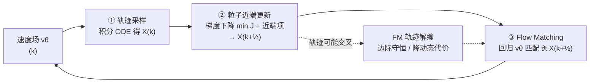

# High-dimensional Mean-Field Games by Particle-based Flow Matching

**会议**: ICLR 2026  
**OpenReview**: [https://openreview.net/forum?id=WA0AYaYAtS](https://openreview.net/forum?id=WA0AYaYAtS)  
**代码**: [https://github.com/jiajia-yu/mfg_flow_matching](https://github.com/jiajia-yu/mfg_flow_matching)  
**领域**: 优化 / 平均场博弈 / 生成建模  
**关键词**: Mean-Field Games, Flow Matching, Fictitious Play, Optimal Transport, Lagrangian Coordinates, Convergence Analysis  

## 一句话总结
把高维平均场博弈（MFG）的求解重写成拉格朗日坐标下的粒子优化问题，用「粒子近端下降 + Flow Matching 拟合速度场」交替迭代来近似 fictitious play，既能高维可扩展地求解势博弈/非势博弈，又能证明其收敛速率。

## 研究背景与动机
**领域现状**：平均场博弈研究的是「连续多智能体系统」的纳什均衡——每个无差别玩家在给定群体分布 $\rho$ 时寻找最优策略 $\hat v$，而群体分布又被所有玩家的策略反过来决定，均衡定义为「最优控制解 $\hat\rho$ 与群体 $\rho$ 自洽」的不动点。它统一了最优控制、Wasserstein 梯度流（JKO）、带传输正则的归一化流等一大批问题，应用横跨经济学、生成建模、强化学习。

**现有痛点**：高维 MFG 难解的根子在它的**不动点结构**。朴素不动点迭代 $\rho^{(k+1)}=\hat\rho^{(k)}$ 可能不收敛；经典做法 fictitious play 用 $\rho^{(k+1)}=(1-\alpha_k)\rho^{(k)}+\alpha_k\hat\rho^{(k)}$ 来稳定，但每步都要算**精确最优响应（best response）**，高维下代价高到不可行。两类主流实现各有死穴：(1) PDE 路线把均衡转成 HJB-FP 耦合方程，靠网格求解器，**维度灾难**；(2) 变分/流方法要求 MFG 有变分形式（只在势博弈/MFC 这种特例存在），且目标对 $\rho$ 非线性耦合，训练要**反传穿过 PDE/ODE 求解器**，昂贵。

**核心矛盾**：既想要 fictitious play 的收敛保证，又付不起每步求精确最优响应、且不想被「必须有变分结构」绑死。

**本文目标**：提出一个高维可扩展、不依赖变分结构、且带收敛证明的 MFG 迭代神经求解器。

**核心 idea**：**【近端最优响应】** 不求全局最优响应，只在当前状态的**局部邻域**里找「近端最优响应」（proximal best response）——这正是 fictitious play 小步长时「精确响应没必要」的洞察；**【粒子 + Flow Matching 双更新】** 在拉格朗日坐标下，每次迭代先用一阶梯度信息更新粒子轨迹，再训练一个 Flow Matching 神经网络去拟合更新后轨迹的速度场，FM 的「轨迹解缠」效应保证边际分布守恒、把交叉轨迹平均化，从而既能 batch 训练加速收敛，又能在理论上打通拉格朗日与欧拉两种坐标。

## 方法详解

### 整体框架
方法把 MFG (1) 改写到**拉格朗日坐标**：用特征映射 $X(x,t)$ 表示从 $x$ 出发的单个粒子轨迹，把个体代价 $\mathcal J(\tilde X;\rho)$ 写成对初始分布 $\mu$ 的期望（动态代价 $\frac12\|\partial_t X\|^2$ + 交互代价 $F[\rho_t]$ + 终端代价 $G[\rho_1]$）。然后用一个**近端不动点方案**交替三步：①用当前速度场 $v^{(k)}$ 积分 ODE 采样轨迹 → ②对粒子做带近端项的梯度下降（近端最优响应）→ ③用 Flow Matching 回归一个神经速度场 $v_\theta$ 去匹配更新后轨迹的速度。三步循环逼近 fictitious play，但每步只走一小步而非求精确最优响应。

### 关键设计

**1. 拉格朗日重写：把 MFG 变成可采样期望的粒子问题，绕开网格。** 欧拉坐标 $v(x,t)$ 依赖固定空间网格，高维下不可行；本文转到拉格朗日坐标 $X\in C_X=H^1(0,1;L^2(\mu))$，每条轨迹 $X(x,\cdot)$ 是从 $x$ 出发的可微曲线。这样个体代价写成 $\mathcal J(\tilde X;\rho)=\mathbb E_{x\sim\mu}\big[\int_0^1(\frac12\|\partial_t\tilde X\|^2+F[\rho_t](\tilde X))dt+G[\rho_1](\tilde X(x,1))\big]$，整个目标变成对粒子的期望，可以用有限样本 + 时间离散直接估计，天然适配高维。代价是只要求每条轨迹自身可微，**轨迹之间允许交叉**——此时未必存在速度场 $v$ 使 $(X,v)$ 满足 ODE 约束，这个缺口正是第 3 点要补的。

**2. 近端最优响应：用 fictitious play 的洞察换掉昂贵的精确响应。** 直接套 fictitious play 要算精确最优响应 $\hat X^{(k)}$ 再平均，太贵；本文观察到「只要每步相对当前目标有小幅改善，即使目标本身在变也能收敛到不动点」，于是把最优响应替换成带近端正则的局部下降：
$$X^{(k+\frac12)}=\arg\min_{X\in C_X}\ \mathcal J(X;\rho^{(k)})+\frac{1}{2\alpha_k}\big(\|X-X^{(k)}\|^2_{\mu\otimes[0,1]}+\|X_1-X_1^{(k)}\|^2_\mu\big)$$
实现上就是几步梯度下降。由一阶展开可得下降方向：中间时刻粒子沿 $(\partial_{tt}X)_t-\nabla F[\rho_t](X_t)$ 演化，终端时刻沿 $-((\partial_t X)_1+\nabla G[\rho_1](X_1))$。每次只需评估 $F[\rho_t],G[\rho_1]$ 及其（次）梯度——例如 KL 终端代价 $G(\rho)=\mathrm{KL}(\rho\|\nu)$ 用神经分类器近似 $\log\frac{d\rho}{d\nu}$ 再自动微分取梯度（Example 3.1），非局部核耦合 $F[\rho](x)=\int w(x,y)d\rho(y)$ 用粒子经验均值估计（Example 3.2）。

**3. Flow Matching 轨迹解缠：补上「粒子↔速度场」的缺口并降代价。** 粒子更新后轨迹可能交叉，没有对应速度场。本文用 FM 回归一个网络速度场：
$$v^{(k+1)}=\arg\min_v\ \mathbb E_{x\sim\mu}\int_0^1\big\|v(X^{(k+\frac12)}(x,t),t)-\partial_t X^{(k+\frac12)}(x,t)\big\|^2 dt$$
关键性质（Lemma 4.1）：对任意 $\tilde X$，FM 得到的 $(\tilde\rho,\tilde v)$ 满足连续性方程、**边际密度 $\tilde\rho_t=(\tilde X_t)_\#\mu$ 守恒**，且 $\mathcal J(\tilde\rho,\tilde v;\rho)\le\mathcal J(\tilde X;\rho)$——也就是说在交叉点处「对速度取平均」会**降低动态代价、保持交互/终端代价不变**。这既保证三步合起来目标单调下降，又因为只在轨迹交叉时才真正起作用，所以实践中**降频做 FM**（每隔若干步一次）即可。理论上这条性质还打通了欧拉与拉格朗日：在正则性下两种解可互相诱导、势 MFG 的最优值在两坐标系下相等（Theorem 4.3）。

**4. 收敛速率证明：从次线性到线性。** 在最优控制设定（$F,G$ 不依赖 $\rho$）下，Lemma 4.4/4.5 证明粒子近端步和 FM 步都使目标单调下降，进而（Theorem 4.6）给出**次线性收敛** $\min_{k\le K}\{\|X^{(k+\frac12)}-X^{(k)}\|^2+\dots\}\le 2\alpha(\mathcal J(X^{(0)})-\underline{\mathcal J})/K$；若 $F,G$ 额外 $\lambda$-强凸，则升级为**线性（指数）收敛** $\|X^{(k)}-X^*\|^2\le\frac{1}{(1+2\lambda\alpha)^k}\|X^{(0)}-X^*\|^2$。一般 MFG 的完整收敛仍是 open question，但部分中间结果（descent property）已适用。

## 实验关键数据

### 主实验表格（图像到图像翻译 FID，越低越好）
任务用 KL 终端代价把 image-to-image translation 表成 MFG 传输问题，先用 VAE 编码到隐空间再学传输动力学。

| 方法 | Handbag→Shoes | Male→Female |
|------|---------------|-------------|
| **Ours** | **12.44** | **9.68** |
| Q-Flow* | 12.34 | 9.66 |
| OT-CFM | 13.01 | 12.88 |
| SI | 15.87 | 16.39 |
| Rectified Flow | 13.91 | 14.01 |
| SB-CFM | 12.70 | 11.55 |
| Disco GAN* | 22.42 | 35.64 |
| Cycle GAN* | 16.00 | 17.74 |
| NOT* | 13.77 | 13.23 |

本文 FID 与最强的 Q-Flow 基本持平，明显优于其余 OT/流/GAN 基线（尤其在 Male→Female 上）。

### 消融与机制验证
- **轨迹解缠（Figure 1）**：训练初期粒子轨迹大量交叉，经 20 个外循环后 FM 把轨迹理顺、速度场重采样轨迹平滑——直观印证「FM 降动态代价、保边际」的理论。
- **非势 MFG（Figure 3，§5.2）**：$\mathbb R^2$ 上用非对称核 $w(x,y)=\exp(a^\top(x-y))$ 构造非势博弈，终端代价 $G(x)=\lambda_G(a^\top x-c)^2$ 把玩家推向超平面 $a^\top x=c$。算法收敛到残差约 $10^{-1}$ 的均衡；密度沿 $a$ 方向压缩、沿 $a^\perp$ 扩散，符合「匹配群体节奏同时推进到目标线」的策略直觉。
- **Toy（§5.1）**：$\mathbb R^2$ 上 $4\times4$ 棋盘格 → 各向同性高斯，学到的传输图在源/目标间连续插值（Figure 2）。

### 关键发现
- 即便每步只做近端最优响应（而非精确响应），方法仍稳定收敛，验证了 fictitious play 的核心洞察可被廉价近似。
- FM 步只在轨迹交叉时贡献改善，故可低频执行——把生成建模里的 Flow Matching 工具迁来当「轨迹正则器」，而非传统的端点插值器。

## 亮点与洞察
- **视角转换**：把 MFG 求解从「解 HJB-FP 偏微分方程」彻底搬到「拉格朗日粒子优化 + 期望估计」，从根上规避维度灾难，是高维可扩展性的来源。
- **FM 的非常规用法**：标准 Flow Matching 是给定源/目标分布做插值；这里端点分布未知，FM 被当作「轨迹解缠 + 边际守恒」的算子来用，且其降代价性质直接进入收敛证明，理论与算法咬合得很紧。
- **统一性**：一个框架同时覆盖最优控制（OC）、势 MFG/MFC（含带传输正则的归一化流、JKO 格式）、以及一般非势 MFG，覆盖面广。
- **理论扎实**：不仅给算法，还给了欧拉-拉格朗日等价性 + 次线性/线性收敛速率，少见地为高维神经 MFG 求解器提供了收敛保证。

## 局限与展望
- **内存开销大**：粒子数 × 时间步数大时，存储所有轨迹的内存成本显著。
- **收敛保证有缺口**：理论收敛只覆盖最优控制设定，一般 MFG 的完整收敛仍是 open question（仅有 descent property 等中间结果）。
- **理想化分析**：收敛分析针对理想近端不动点方案，未计入采样误差、有限差分、FM 拟合不准等实际误差源。
- **实验规模有限**：仅在 toy、非势 2D 玩具例和两个图像翻译任务上验证，缺更大规模真实应用。

## 相关工作与启发
- **Fictitious play 谱系**：从 Brown(1949) 到 Cardaliaguet & Hadikhanloo(2017) 用 PDE 证明 MFC 收敛、Lavigne & Pfeiffer(2023) 揭示其与广义 Frank-Wolfe 等价、Yu et al.(2024) 推广到非势 MFG——本文是这条线在「高维 + 神经 + 拉格朗日」方向的延续。
- **流/无仿真方法**：相比 Ruthotto et al.(2020)、Huang et al.(2023) 等要求变分结构并反传穿 PDE/ODE，本文用 FM 直接匹配样本速度，避开求解器反传；相比 SOC 里的 control matching / adjoint matching（Domingo-Enrich et al.），本文处理更广的一阶 MFG 且允许 $F,G$ 依赖 $\rho$。
- **启发**：把生成建模社区成熟的 Flow Matching 当作「优化迭代里的轨迹正则算子」是个可迁移的范式——凡是「拉格朗日粒子轨迹会交叉、需要恢复确定性速度场」的场景（轨迹优化、采样、动力学反问题）都可能复用这套「粒子下降 + FM 解缠」的交替结构。

## 评分
- **新颖性**: ⭐⭐⭐⭐ — 把 Flow Matching 重新诠释为 MFG 求解中的轨迹解缠算子、并嵌进近端 fictitious play，视角新且把理论与算法咬合得很紧。
- **实验充分度**: ⭐⭐⭐ — 玩具例 + 非势 MFG + 两个图像翻译任务能验证机制与可扩展性，但任务数和规模偏少，FID 与最强基线持平而非领先。
- **写作质量**: ⭐⭐⭐⭐ — 动机、坐标转换、三步算法与收敛证明组织清晰，理论叙述严谨。
- **价值**: ⭐⭐⭐⭐ — 为高维 MFG 提供了少见的「可扩展 + 带收敛保证」求解器，统一覆盖 OC/势/非势博弈，对计算最优传输与生成建模均有借鉴意义。

<!-- RELATED:START -->

## 相关论文

- [\[ICLR 2026\] Convergence of Regret Matching in Potential Games and Constrained Optimization](convergence_of_regret_matching_in_potential_games_and_constrained_optimization.md)
- [\[ICML 2026\] Mirror Mean-Field Langevin Dynamics](../../ICML2026/optimization/mirror_mean-field_langevin_dynamics.md)
- [\[ICLR 2026\] High-dimensional limit theorems for SGD: Momentum and Adaptive Step-sizes](high-dimensional_limit_theorems_for_sgd_momentum_and_adaptive_step-sizes.md)
- [\[ICLR 2026\] From Sorting Algorithms to Scalable Kernels: Bayesian Optimization in High-Dimensional Permutation Spaces](from_sorting_algorithms_to_scalable_kernels_bayesian_optimization_in_high-dimens.md)
- [\[ICLR 2026\] Never Saddle for Reparameterized Steepest Descent as Mirror Flow](never_saddle_for_reparameterized_steepest_descent_as_mirror_flow.md)

<!-- RELATED:END -->
