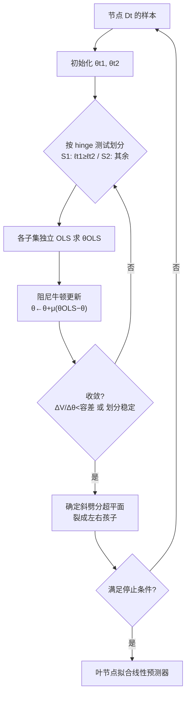

# Hinge Regression Tree: A Newton Method for Oblique Regression Tree Splitting

**会议**: ICLR 2026  
**代码**: [https://github.com/Hongyi-Li-sz/Hinge-Regression-Tree](https://github.com/Hongyi-Li-sz/Hinge-Regression-Tree)  
**领域**: optimization / 可解释机器学习  
**关键词**: 斜决策树, 回归树, Newton 法, 高斯-牛顿, hinge 函数, 分段线性, 通用逼近  

## 一句话总结
把斜回归树每个节点的劈分重写成"两个线性预测器取 max/min 包络"的非线性最小二乘问题，并证明交替拟合恰好等价于固定划分下的**阻尼牛顿（高斯-牛顿）法**，从而用带回溯线搜索的迭代更新得到既快又稳、还带 $O(\delta^2)$ 通用逼近率的紧凑斜回归树。

## 研究背景与动机
**领域现状**：决策树因可解释性和刻画非线性的能力成为监督学习里最有影响力的模型之一，经典 CART 的轴对齐递归划分至今仍是基石。斜决策树（oblique tree）把"单特征阈值"升级为"特征线性组合的超平面"，在特征相关或被旋转时能用更紧凑的结构换取更好的预测。

**现有痛点**：找到最优斜超平面是 NP-hard 的，于是实践方法要么靠慢速搜索（OC1 随机搜索、进化算法），要么靠缺乏理论保证的启发式与凸代理。近年的优化派——可微斜树 DGT（过参数化 + 直通估计）、把斜树写成神经网络的 DTSemNet——虽然能端到端训练，却依赖近似、特定网络结构，缺少对节点级优化本身的清晰刻画。

**核心矛盾**：斜劈分既要**表达力强**（能拟合复杂非线性），又要**优化高效且有理论支撑**，但现有方法往往只能二选一——要么收敛行为说不清，要么表达力受限于轴对齐或近似训练。

**本文目标**：给斜回归树一个既能直接优化、又有收敛与逼近双重理论保证、还能产出更紧凑模型的节点劈分算法。

**核心 idea**：**[把劈分=非线性最小二乘]** 每个节点不再"选阈值"，而是学两个线性函数 $\ell_{t1},\ell_{t2}$，用它们的 hinge 包络 $\max/\min$ 当基函数去拟合数据；**[劈分超平面自然涌现]** 两线相等处 $\tilde x^\top(\theta_{t1}-\theta_{t2})=0$ 就是斜劈分边界；**[交替拟合=阻尼牛顿]** 因为 hinge 在固定划分内是分段线性、二阶导为零，高斯-牛顿近似精确成立，迭代退化为"朝当前划分 OLS 解走一步"。

## 方法详解

### 整体框架
HRT 自顶向下递归建树：每个内部节点把落入该节点的样本送进一轮"节点级牛顿迭代"，反复在"按当前参数把数据分成两半（hinge 测试）"与"在每半上各拟合一个线性模型（OLS）"之间交替，收敛后得到一条斜劈分超平面，把节点裂成左右孩子，直到触发停止条件（最大深度 / 最小样本 / RMSE 阈值）。沿根到叶的 hinge 门复合起来，等价于一串线性映射 + ReLU 门构成的电路，因而获得 ReLU 式表达力。

### 关键设计

**1. Hinge 基函数：把节点劈分写成非线性最小二乘。** 在内部节点 $D_t$ 上，目标不是挑特征和阈值，而是找两组参数 $\theta_{t1},\theta_{t2}\in\mathbb R^{d+1}$ 定义两个线性函数 $\ell_{t1}(x)=\tilde x^\top\theta_{t1}$、$\ell_{t2}(x)=\tilde x^\top\theta_{t2}$，去最小化非线性最小二乘 $V(\theta)=\tfrac12\sum_{x_j\in D_t}(y_j-h(x_j,\theta))^2$，其中基函数 $h(x_j,\theta)=\max(\tilde x_j^\top\theta_{t1},\tilde x_j^\top\theta_{t2})$ 或对应的 $\min$。这个 hinge 自身就内蕴了一条决策边界——两线相等的超平面 $\tilde x^\top(\theta_{t1}-\theta_{t2})=0$，样本落在哪一侧就用哪条线预测，于是"劈分超平面"和"叶子里的线性模型"被同一个优化问题一次性解出来，而不是先分裂再拟合。这种 max/min 包络让节点能同时贴合局部的凸与凹结构。

**2. 优化即牛顿法：高斯-牛顿近似在固定划分内精确成立。** 直接最小化 $V$ 因不可微而困难，作者把它拆成交替过程：先按当前参数把数据切成 $S_1(\theta)=\{x_j:\tilde x_j^\top\theta_{t1}\ge\tilde x_j^\top\theta_{t2}\}$ 与 $S_2$，在每个固定划分内 $V$ 对各自参数可微。关键观察是——hinge 在固定划分内是局部线性的，二阶导为零，因此高斯-牛顿对 Hessian 的近似不再是近似而是**精确**。代入梯度结构后牛顿更新塌缩成异常简洁的形式
$$\theta^{(k+1)}=\theta^{(k)}+\mu\big(\theta^{(k)}_{\text{OLS}}-\theta^{(k)}\big),$$
其中 $\theta^{(k)}_{\text{OLS}}$ 是当前两个子集各自独立算出的 OLS 最优解，$(\theta^{(k)}_{\text{OLS}}-\theta^{(k)})$ 正是固定划分下的牛顿方向 $-[\nabla^2V]^{-1}\nabla V$。更新完再按新参数重新分配划分，如此交替。当步长 $\mu=1$ 时直接令 $\theta^{(k+1)}=\theta^{(k)}_{\text{OLS}}$，即单步牛顿——这把"看似启发式的交替拟合"坐实成有名字的二阶优化方法。

**3. 步长策略：固定阻尼 vs 自动回溯线搜索，换稳定性。** 同一牛顿方向下提供两种选 $\mu^{(k)}$ 的方式：(i) 固定阻尼因子 $\mu\in(0,1]$（如 0.1/0.5/1，在验证集上当超参挑），实现简单高效；(ii) 自动回溯线搜索（实验里记作 "auto"），从 $\mu^{(k)}=1$ 起几何衰减，直到找到一个让节点级 RMSE 严格下降的有效劈分。理论分析正是针对这个线搜索变体：在温和假设下，阻尼牛顿产生**单调下降且收敛**的节点级目标序列，且当划分稳定后迭代收敛到对应的 OLS 极小点。实验也印证了"为什么要阻尼"——在 sinc 这类有剧烈振荡的不稳定问题上，单步 $\mu=1$ 会让划分在头几步坍缩成糟糕的全局线性拟合，$\mu=0.5$ 陷入极限环，只有小步长才稳健收敛；而在光滑问题上 $\mu=1$ 反而几步就到最优，体现经典的速度-稳定性权衡。

**4. 数值稳健性与通用逼近：ridge 正则 + $O(\delta^2)$ 逼近率。** 所有 OLS 拟合可选地换成 ridge，把闭式解改为 $(X_i^\top X_i+\alpha I_0)^{-1}X_i^\top y$，在强共线或叶子样本少时抬高最小特征值、稳定法方程；若节点优化在 $T_{\max}$ 步内没进展，则回退到中位数劈分保证树继续生长。理论侧证明了该分段线性模型类是连续函数的通用逼近器：对 $C^2$ 函数 $g$，只要把域 $K$ 划成直径 $\le\delta$ 的区域并满足设计矩阵的最小特征值下界 $\lambda_{\min}(X_i^\top X_i)\ge cN_i$，就存在树函数 $f$ 使 $\sup_{x\in K}|f(x)-g(x)|\le C\delta^2$。这个显式 $O(\delta^2)$ 率把"树越细、拟合越准"量化了出来，也解释了为何 ridge 的特征值下界假设是逼近误差与估计误差匹配的关键。

## 实验关键数据

### 合成函数逼近（2D/3D，RMSE↓ / R²↑，对比 CART 与 XGBoost）

| 函数 | CART RMSE | XGB RMSE | HRT RMSE | HRT R² |
|------|-----------|----------|----------|--------|
| sinc | 0.0325 | 0.0289 | **0.0280** | 0.9876 |
| twisted sigmoid | 0.0312 | 0.0286 | **0.0258†** | **0.9983†** |
| f1(x1,x2) | 0.8552 | 0.3018 | **0.1646†** | **0.9998†** |
| f2(x1,x2) | 0.2721 | 0.0859 | **0.0757†** | **0.9946†** |
| f3(x1,x2) | 0.0752 | 0.0537 | **0.0528†** | 0.9917 |
| f4(x1,x2) | 0.0789 | 0.0556 | 0.0555 | 0.9973 |

HRT 在多数合成任务上以**单棵树**逼平甚至显著超过 XGBoost 集成（†表示 $p<0.05$ 显著优于最佳基线），尤其在 3D 振荡曲面 f1/f2 上 RMSE 大幅领先。

### 真实回归数据集（RMSE↓，对比 8 个基线）

| 数据集 (Nf, Ns) | DTSemNet | DGT | TAO-O | XGB | HRT (ours) |
|------|----------|-----|-------|-----|-----------|
| Abalone (8, 4k) | 2.14 | 2.15 | 2.18 | 2.20 | **2.11** |
| CPUact (21, 8k) | 2.65 | 2.91 | 2.71 | 2.57 | **2.56** |
| Ailerons (40, 14k) | 1.66 | 1.72 | 1.76 | 1.72 | **1.64†** |
| YearPred (90, 515k) | 8.99 | 9.05 | 9.11 | 9.01 | **8.97** |
| Airfoil (5, 2k) | 3.83 | 3.72 | 3.13 | 2.77 | **2.63** |
| Fried (10, 41k) | 1.51 | 2.27 | N/A | 1.09 | **1.09†** |

HRT 作为**单棵斜树**在多数真实数据集上击败可微斜树（DTSemNet/DGT）、TAO、CART、M5、linear-tree 等单树基线，并在若干数据集上追平 XGBoost 集成。

### 关键发现
- **步长 = 速度↔稳定性旋钮**：不稳定问题（sinc）必须 $\mu<1$ 防划分坍缩，光滑问题（twisted sigmoid）$\mu=1$ 单步牛顿几步收敛。
- **紧凑性**：HRT 用比集成更小的结构达到相当或更好的精度，验证了斜劈分 + 局部线性拟合的效率优势。
- **理论-实践吻合**：阻尼牛顿的单调下降与 $O(\delta^2)$ 逼近率在实验上都得到印证。

## 亮点与洞察
- **"启发式交替拟合"被正名为二阶优化**：指出固定划分内 hinge 二阶导为零、高斯-牛顿近似精确，是把朴素的"交替 OLS"升级成有收敛保证牛顿法的关键洞察，理论很干净。
- **一个最小二乘同时给出边界和叶子模型**：劈分超平面从 $\theta_{t1}=\theta_{t2}$ 处自然涌现，避免了"先分裂再拟合"的两阶段割裂。
- **双重理论保证**：既有节点级收敛证明，又有全局 $O(\delta^2)$ 通用逼近率，在斜树文献里少见地把优化与逼近两端都补齐。
- **可解释性**：相比 hinging hyperplane 的加性叠加，HRT 用树结构 + 显式子区域表达式，保留了树的可解释性。

## 局限与展望
- **只做回归**：方法围绕最小二乘和线性叶子展开，分类任务需另行适配。
- **特征值下界假设**：通用逼近率依赖 $\lambda_{\min}(X_i^\top X_i)\ge cN_i$，强共线或小叶子时可能失效，需靠 ridge 补救，但 $\alpha$ 又引入新超参。
- **单树而非集成**：虽强调紧凑，但与 XGBoost 等集成相比在大规模数据上仍非全面碾压；把 HRT 作为基学习器做 boosting/bagging 是自然的下一步。
- **局部最优**：交替优化本质是坐标式下降，仅保证节点级收敛到局部 OLS 解，全局树结构仍受贪心建树限制。

## 相关工作与启发
- **斜回归树**：OC1（随机搜索）、GUIDE（统计检验选特征）、TAO（交替优化）、DGT 与 DTSemNet（可微/神经网络化）。HRT 的差异点是把核心劈分写成直接的非线性最小二乘并显式对应阻尼牛顿，理论更扎实。
- **分段线性与 hinge**：hinging hyperplane（Breiman 1993）、SVM 的 hinge loss、ReLU 激活都属同一谱系；HRT 用 $\max(a,b)=a+\sigma(b-a)$ 把 hinge 门等价为单 ReLU 单元，沟通了树与神经网络的表达力分析。
- **启发**：当一个"看似工程化的交替更新"能被证明等价于某个有名优化方法时，往往能顺势拿到收敛性与速率的免费理论红利——这个"把启发式映射到经典优化"的思路值得迁移到其它结构学习问题。

## 评分
- **新颖性**: ⭐⭐⭐⭐ — "节点劈分=非线性最小二乘 + 固定划分内高斯-牛顿精确"是漂亮且少见的重构，把斜树的优化讲清楚了。
- **实验充分度**: ⭐⭐⭐ — 合成 + 多真实数据集、对比 8 个强基线较全面，但主要停留在单树回归，缺集成与分类的广度验证。
- **写作质量**: ⭐⭐⭐⭐ — 动机、方法、理论、实验衔接顺畅，理论陈述清晰。
- **价值**: ⭐⭐⭐⭐ — 给可解释斜回归树提供了既高效又有双重理论保证的实用工具，对偏好单树可解释模型的场景有直接价值。

<!-- RELATED:START -->

## 相关论文

- [\[ICLR 2026\] Towards Better Branching Policies: Leveraging the Sequential Nature of Branch-and-Bound Tree](towards_better_branching_policies_leveraging_the_sequential_nature_of_branch-and.md)
- [\[ICLR 2026\] Birch SGD: A Tree Graph Framework for Local and Asynchronous SGD Methods](birch_sgd_a_tree_graph_framework_for_local_and_asynchronous_sgd_methods.md)
- [\[ICLR 2026\] Non-Asymptotic Analysis of Efficiency in Conformalized Regression](non-asymptotic_analysis_of_efficiency_in_conformalized_regression.md)
- [\[ICLR 2026\] Distributionally Robust Linear Regression with Block Lewis Weights](distributionally_robust_linear_regression_with_block_lewis_weights.md)
- [\[ICLR 2026\] Newton Method Revisited: Global Convergence Rates up to $O(1/k^3)$ for Stepsize Schedules and Linesearch Procedures](newton_method_revisited_global_convergence_rates_up_to_o1k3_for_stepsize_schedul.md)

<!-- RELATED:END -->
