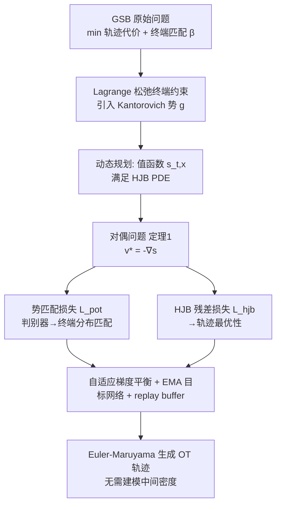

# HOTA: Hamiltonian Framework for Optimal Transport Advection

**会议**: ICLR 2026  
**OpenReview**: [https://openreview.net/forum?id=Og1klGbvlM](https://openreview.net/forum?id=Og1klGbvlM)  
**代码**: [https://github.com/nazarblch/HOTA](https://github.com/nazarblch/HOTA)  
**领域**: 优化 / 最优传输 / 动力学生成建模  
**关键词**: Generalized Schrödinger Bridge, Hamilton-Jacobi-Bellman, 最优传输, Kantorovich 势, 非光滑势函数  

## 一句话总结
HOTA 把广义 Schrödinger Bridge 的对偶问题重写成「Kantorovich 势 + HJB 值函数」的联合优化，用 RL 式的 replay buffer + 目标网络 + 自适应梯度平衡稳定训练，做到无需建模中间密度、能处理非光滑势函数，同时严格保证终端分布匹配。

## 研究背景与动机
**领域现状**：最优传输（OT）已成为引导概率流的天然框架。静态 Monge-Kantorovich OT 只关心边界耦合，产生的是直线路径，完全忽略数据流形的几何结构。Benamou-Brenier 的动力学 OT 把它改写成概率路径上的时间变分问题，能在带曲率、障碍或势场的非平凡几何上操作轨迹，这与随机最优控制（SOC）里的广义 Schrödinger Bridge（GSB）问题紧密相连。

**现有痛点**：GSB 通常引入一个状态势函数 $U(x)$ 来编码空间几何和物理约束（如分子模拟里的硬核排斥、steric clash），这些约束天然是不连续/非光滑的。主流解法走 HJB 对偶路线（DeepGSB、NLSB），但有两个硬伤：(1) 优化动态不稳定，高维下梯度方差大、样本效率差；(2) 缺乏严格的终端分布匹配准则，导致耦合不精确。另一条线 GSBM 走交替优化（先固定边际学漂移、再更新边际），但**要求势函数处处可微**，且交替迭代极其昂贵（收敛慢）。

**核心矛盾**：既要保留 HJB 的理论严谨性和处理非光滑势的能力，又要解决它训练不稳、终端不精确的老毛病——两者此前难以兼得。

**本文目标**：在两测度之间、几何由势函数定义的 GSB 问题上，提出一个新的 HJB 框架，既显式求解 GSB，又修复学习稳定性问题，并通过有理论支撑的目标函数确保终端分布精确匹配。

**核心 idea**：**【对偶绑定】** 把 GSB 的对偶形式重新组织成 Kantorovich 势与 HJB 值函数的绑定——让 HJB 约束变成一个内建正则项，从而得到一个对梯度优化友好、且天然不依赖密度估计的稳定目标。

## 方法详解

### 整体框架
HOTA 从 GSB 原始问题（最小化轨迹积分代价 $L=\|v_t\|^2+U(x_t)$ 并匹配终端分布）出发，用 Lagrange 乘子（即 Kantorovich 势 $g$）松弛终端约束，得到鞍点问题；再借动态规划定义值函数 $s(t,x)$，证明其满足 HJB 偏微分方程，并把内层对控制的最小化解析地解出 $v_t^*=-\nabla_x s(t,x_t)$。最终对偶问题（定理 1）变成：势匹配项当判别器保证终端分布匹配，HJB 残差项保证轨迹最优。训练上把它当成「最优控制 + RL」的混合：用 Euler-Maruyama 模拟轨迹、replay buffer 存历史、EMA 目标网络稳定回归、自适应梯度平衡两个损失。

### 关键设计

**1. 对偶绑定：把 HJB 约束变成内建正则项。** 这是全文的理论支点。通过松弛终端约束引入 Kantorovich 势 $g$，再用值函数 $s(t,x)$ 的边界条件 $s(1,x)=-g(x)$ 把势函数和值函数「焊死」成同一个网络。定理 1 给出的对偶目标
$$\max_{s(1,\cdot)}\ \mathbb{E}_{x_0\sim\alpha}\Big[\int_0^1 L(t,x_t,-\nabla_x s)\,dt + s(1,x_1)\Big] - \mathbb{E}_{y\sim\beta}\big[s(1,y)\big]$$
里，第一项扮演判别器、强制 $T_\#\alpha=\beta$，第二项（即 HJB 约束）负责轨迹最优。关键的实践技巧是：在 HJB 约束被满足的前提下，积分代价项已经被「记账」并最小化，因此**势匹配损失里可以省掉显式的积分项**，只需简单的终端势差 $L_{\text{pot}}=\frac{1}{n}\sum_k s_\theta(1,x_T^k)-\frac{1}{n}\sum_k s_\theta(1,y^k)$。由此得到的目标完全无需建模 $t\in(0,1)$ 的中间密度，这正是它绕过密度估计、能吃非光滑势的根本原因。

**2. HJB 残差损失的双向对称写法 + 角加速度正则。** 值函数要逼近 HJB PDE 的黏性解，损失直接惩罚 PDE 残差：
$$\frac{\partial s_\theta}{\partial t}-\frac{1}{2}\|\nabla_x s\|^2+U(x)+\frac{\sigma^2}{2}\mathrm{tr}\{\nabla^2 s\}+\lambda_a\|a\|$$
这里特意写成**主网络 $s_\theta$ 与目标网络 $s$ 交叉配对的两项之和**（一项 $\nabla_x s$ 用目标、一项用主网络），让优化更像监督回归而非自举追逐自己。其中 $U(x)$ 直接进残差、不需要对 $U$ 求导，所以势函数即使几乎处处不可微也能用；$\mathrm{tr}\{\nabla^2 s\}$ 这一二阶项靠 JAX 自动微分算，开销 <5%。附加的角加速度项 $a=\frac{d}{dt}\frac{\nabla s_\theta}{\|\nabla s_\theta\|}$ 以系数 $\lambda_a$ 鼓励轨迹拉直（可选）。

**3. RL 式三件套稳定高维训练：replay buffer + EMA 目标网络 + 数据 replay。** 因为不建模中间密度，训练点需要落在「流（轨迹）集中的区域」才有效。HOTA 早期用 $\alpha,\beta$ 之间的线性插值粗略估计流区域，之后改从 replay buffer $\mathcal{B}$ 采样历史轨迹点；每轮把当前策略 $v_t=-\nabla s$ 生成的一条轨迹存进 buffer。目标网络 $s$ 以 EMA 方式更新参数 $\theta\leftarrow\gamma\theta+(1-\gamma)\theta$，复刻 DQN 把自举目标固定住的思路，把不稳定的 PDE 拟合变成稳定的回归。这套设计正是消融里证明对 feasibility 最关键的部分。

**4. 自适应梯度平衡：让两个损失的梯度尺度自动对齐。** $L_{\text{pot}}$（势匹配）和 $L_{\text{hjb}}$（HJB 残差）量纲、尺度差异巨大，直接相加会被某一项主导。HOTA 用两者梯度范数之比的 EMA 作为缩放因子
$$\nabla_\theta L_{\text{pot}}+\lambda_{\text{hjb}}\,\mathrm{EMA}\!\Big(\frac{\|\nabla_\theta L_{\text{pot}}\|}{\|\nabla_\theta L_{\text{hjb}}\|}\Big)\nabla_\theta L_{\text{hjb}}$$
把 HJB 梯度动态缩放到与势匹配梯度同量级再求和，保证既满足最优性条件、又满足边界约束的稳定收敛。

## 实验关键数据

### 主实验：低维带几何约束基准（feasibility / optimality，越低越好）
6 个数据集，前三个（Stunnel/Vneck/GMM）光滑、后三个（BabyMaze/Slit/Box）几乎不可微：

| 指标 | 方法 | Stunnel | Vneck | GMM | BabyMaze | Slit | Box |
|------|------|---------|-------|-----|----------|------|-----|
| Feasibility $W_2$ | NLSB | 30.54 | 0.02 | 67.76 | >1 | 0.013 | 0.024 |
| | GSBM | 0.03 | 0.01 | 4.13 | 0.01 | 0.01 | 0.02 |
| | **HOTA** | **0.006** | **0.002** | **0.19** | **0.004** | **0.0004** | **0.002** |
| Optimality（积分代价） | GSBM | 460.88 | 155.53 | 229.12 | 6.5 | 4.9 | 3.8 |
| | **HOTA** | **383.25** | **115.09** | **80.44** | **4.87** | **3.06** | **2.84** |

HOTA 在 feasibility 与 optimality 上**全面领先**；GMM 上 optimality 从 229 降到 80，体现对邻近点轨迹分离的优势。运行效率上比 GSBM 快 **50–100×**。

### 高维可扩展性（Sphere 数据集，Normalized $W_2$ / Optimality）

| 维度 | HOTA $W_2$ | GSBM $W_2$ | HOTA Opt | GSBM Opt |
|------|-----------|-----------|----------|----------|
| 10 | 0.001 | 0.99 | 3.37 | 20.9 |
| 1000 | 0.051 | 0.21 | 3.17 | 22.1 |

维度升到 1000 仍稳定；另在 1000 维 opinion depolarization 任务上有效。

### 图像翻译（FID，越低越好）

| 任务 | HOTA | 最强 baseline |
|------|------|---------------|
| CelebA Male→Female (64×64) | **6.28** | EUOT 8.44 |
| CelebA Female→Anime (64×64) | **11.67** | ENOT 13.12 |

### 消融实验（Stunnel/Vneck/GMM，feasibility）

| 变体 | Stunnel | Vneck | GMM |
|------|---------|-------|-----|
| HOTA 完整 | **0.006** | **0.002** | **0.19** |
| w/o buffer | 0.076 | 16.47 | 1.248 |
| w/o 梯度平衡 | 3.60 | 0.026 | 2.64 |
| w/o EMA 目标网络 | 0.018 | 0.004 | 0.65 |

### 关键发现
- replay buffer 对 feasibility 最关键，去掉后 Vneck 直接发散（16.47）。
- 梯度平衡对 Stunnel feasibility 影响最大（去掉后从 0.006 飙到 3.60）。
- 三件套缺一不可，但作用在不同数据集上各有侧重。

## 亮点与洞察
- **理论闭环漂亮**：把 Kantorovich 势的边界条件直接当成 HJB 值函数的终端条件，一个网络同时身兼「判别器」和「值函数」，对偶目标自然分解为 feasibility（判别器）+ optimality（HJB）两块，结构清晰。
- **省掉积分项的洞察**：在 HJB 约束满足下积分代价已被隐式最小化，因此势匹配损失只需终端势差——这是把无需建模中间密度落地为简洁损失的关键一步。
- **把 RL 工程经验迁移到 OT 求解**：replay buffer + 目标网络 EMA 这套 DQN 稳定技巧，被巧妙用来稳定 HJB 残差拟合，是跨领域借力的好范例。
- **非光滑势是真实需求**：$U(x)$ 不求导直接进残差，使分子模拟、黑盒 LLM 势、LiDAR 点云扫描面等不可微约束都能纳入。

## 局限与展望
- **网络设计敏感**：对时间的 Fourier 特征编码等设计选择较敏感，值函数要同时支撑最优控制估计和当 Kantorovich 势，需要能聚合丰富时空信息的架构。
- **理论假设较强**：当前依赖 $s\in C^{1,2}$ 等正则性条件，作者计划放宽到更弱的正则性假设。
- **架构有提升空间**：未来引入更结构化的神经架构以进一步改善可扩展性与稳定性。
- 仅在单卡 A100 80GB 上验证，更大规模工业场景的表现待考。

## 相关工作与启发
- **动力学 OT 谱系**：Benamou-Brenier 动力学 OT → Schrödinger Bridge → GSB（加入状态势 $U$）。HOTA 属于 HJB 对偶解法这一支，对手是 DeepGSB、NLSB、GSBM。
- **与 GSBM 的关键区别**：GSBM 要求势处处可微且交替优化昂贵；HOTA 单目标联合优化、吃非光滑势、快 50–100×。
- **与 SOC 的联系**：Adjoint Matching、SOCM 等 SOC 方法存在方差估计不稳定问题，HOTA 用 Kantorovich 势和保证 feasibility。
- **启发**：对于「约束以势函数形式给出且可能不可微」的生成/控制任务，把约束塞进 PDE 残差而非要求可微分，是个值得复用的思路；RL 的稳定化技巧（target network、replay）在连续控制/PDE 求解里同样有效。

## 评分
- **新颖性**: ⭐⭐⭐⭐ — 对偶绑定（Kantorovich 势=HJB 终端条件）让 HJB 约束变内建正则项，加上把 RL 稳定技巧迁移到 GSB 求解，组合新颖且自洽。
- **实验充分度**: ⭐⭐⭐⭐ — 覆盖 6 个低维带几何约束基准、1000 维 Sphere/opinion、两个图像翻译任务，消融拆清三件套贡献；但 baseline 部分结果直接引自原论文、个别任务缺对照。
- **写作质量**: ⭐⭐⭐⭐ — 从原始问题到对偶定理推导清晰，feasibility/optimality 两个指标定义明确，算法伪代码完整。
- **价值**: ⭐⭐⭐⭐ — 解决非光滑势 + 终端精确匹配 + 高维稳定三个实际痛点，且有 50–100× 加速，对计算生物、机器人、生成建模等 OT 应用有直接价值。

<!-- RELATED:START -->

## 相关论文

- [\[ICLR 2026\] Neural Hamilton–Jacobi Characteristic Flows for Optimal Transport](neural_hamilton--jacobi_characteristic_flows_for_optimal_transport.md)
- [\[ICLR 2026\] Elastic Optimal Transport: Theory, Application, and Empirical Evaluation](elastic_optimal_transport_theory_application_and_empirical_evaluation.md)
- [\[ICLR 2026\] A Scalable Constant-Factor Approximation Algorithm for $W_p$ Optimal Transport](a_scalable_constant-factor_approximation_algorithm_for_w_p_optimal_transport.md)
- [\[ICLR 2026\] Neural Optimal Transport Meets Multivariate Conformal Prediction](neural_optimal_transport_meets_multivariate_conformal_prediction.md)
- [\[ICLR 2026\] A Memory-Efficient Hierarchical Algorithm for Large-scale Optimal Transport Problems](a_memory-efficient_hierarchical_algorithm_for_large-scale_optimal_transport_prob.md)

<!-- RELATED:END -->
