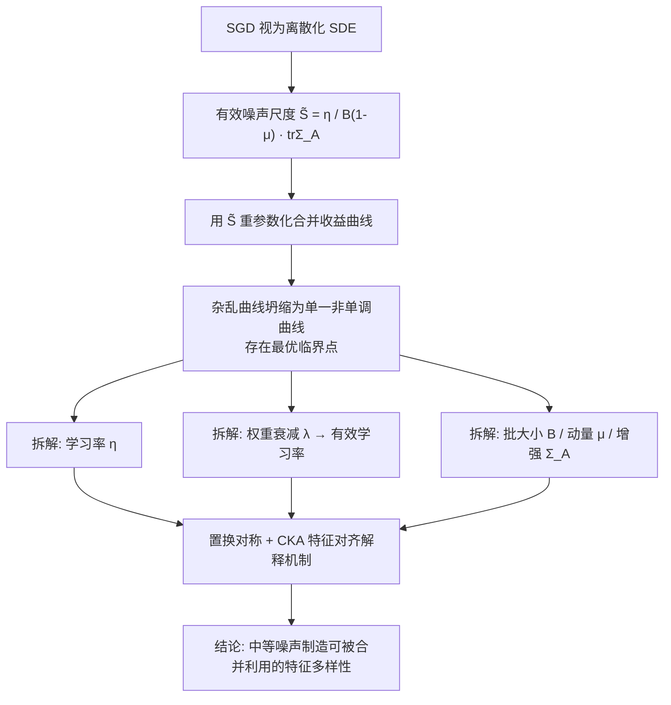

# How does the optimizer implicitly bias the model merging loss landscape?

**会议**: ICLR 2026  
**OpenReview**: [https://openreview.net/forum?id=RU76KTF1Da](https://openreview.net/forum?id=RU76KTF1Da)  
**代码**: 待确认  
**领域**: optimization  
**关键词**: 模型合并, 损失景观, 优化隐式偏置, 有效噪声尺度, 线性模式连接, 任务算术  

## 一句话总结
本文提出用单一物理量「有效噪声尺度」统一刻画学习率、权重衰减、批大小、动量、数据增强等优化超参对**模型合并**的影响，证明合并收益是该噪声的**非单调**函数（存在最优临界点），从而把优化器的隐式偏置从「单个极小点的平坦性」推广到「不同解之间的全局损失景观几何」。

## 研究背景与动机
**领域现状**：模型合并（model merging）通过对独立训练的模型做权重平均（线性插值）或任务向量相加（任务算术），在不增加推理成本的前提下融合多个模型的能力，已被广泛用于刷分和多任务融合。其理论基础是「模式连接」（mode connectivity）——独立解之间存在低损失路径，尤其是 Frankle 等人发现的「线性模式连接」（LMC），即共享初始优化轨迹的解可被一条直线低损失路径连接。

**现有痛点**：合并能否成功在实践中高度依赖反复试错——practitioner 必须训练并评估一大堆候选模型，才能挑出哪些能合并。一个根本性的未解问题是：**为什么有些性能相近的模型能合并、有些却失败？**

**核心矛盾**：LMC 的发现暗示「优化动力学（而非仅最终收敛点）塑造了解之间的景观几何」，但学习率、权重衰减、批大小这些公认会影响优化动力学的因子，对**合并损失景观**的作用却完全没被理清。已有工作只把优化噪声与单个极小点的平坦性/泛化挂钩，没人研究它如何影响**解与解之间**的全局景观。

**本文目标**：系统刻画优化器各组件如何隐式地决定独立训练的解是否落入「可合并兼容区」。

**核心 idea**：**【统一变量】** 不把超参当成各自独立的旋钮，而是发现它们共同调制同一个底层量——**有效噪声尺度** $\tilde S = \frac{\eta}{B(1-\mu)}$（叠加数据增强带来的梯度协方差 $\mathrm{tr}\,\Sigma_A$），并以此预测合并成败。

## 方法详解

### 整体框架
本文是一项**机理性实证研究**而非新算法。其骨架是：先从随机微分方程（SDE）视角把 SGD 视为带扩散项的随机过程，导出一个能吸收所有噪声来源的标量「有效噪声尺度」$\tilde S$；再用它作为横轴去重参数化合并收益曲线，发现原本杂乱无章的多条曲线坍缩成一条**非单调**曲线（存在最优临界点）；最后逐一拆解每个优化组件（学习率、权重衰减、批大小、动量、增强），在视觉/语言/迁移学习/任务算术四类场景验证它们都通过 $\tilde S$ 表现出同一定性趋势，并用置换对称与特征对齐（CKA）解释「中等噪声为何最利于合并」的表征层机制。

### 关键设计

**1. 有效噪声尺度：把所有优化组件压成一个标量。** 论文从 Mandt 等人的随机优化框架出发，把 minibatch 梯度写成 $g_t = \nabla L(\theta_t) + \xi_t$，其中噪声协方差 $\mathrm{Cov}[\xi_t] \approx \Sigma_A(\theta_t)/B$。把 SGD 更新看作离散化的 SDE，其扩散强度正比于学习率 $\eta$、反比于批大小 $B$，并在动量参数化下被 $(1-\mu)^{-1}$ 进一步放大，剩下的幅度由任务/数据相关的梯度协方差迹 $\mathrm{tr}\,\Sigma$ 决定。于是把所有效应汇总为 $S_{\text{eff}} \propto \frac{\eta}{B(1-\mu)}\mathrm{tr}\,\Sigma_A(\theta_t)$，当增强 $A$ 跨实验固定时 $\mathrm{tr}\,\Sigma_A$ 近似常数，得到可直接横向比较的实用代理量 $\tilde S = \frac{\eta}{B(1-\mu)}$。关键观察是：单独看学习率或批大小（图 1a/b）合并收益毫无规律——同样增大学习率，$B=16$ 时收益单调下降、$B=128/256$ 时反而上升；可一旦把横轴换成 $\tilde S$（图 1c），所有曲线对齐成一条**非单调**曲线，收益随噪声上升到临界点后又回落，证明 $\tilde S$ 才是真正的统一控制量。

**2. 权重衰减经由「有效学习率」注入噪声，且只对尺度不变网络生效。** 传统认为权重衰减 $\lambda\|\theta\|_2^2$ 是抑制过拟合，但现代网络普遍带归一化层因而**权重尺度不变**（$f(x,\alpha\theta)=f(x,\theta)$）。在尺度不变网络里，若 $\lambda=0$，梯度范数随权重范数增长而衰减（$\|\nabla L\|_2^2 \propto 1/\|\theta\|_2^2$），导致有效学习率趋零；加大 $\lambda$ 恰好维持有效学习率、从而维持随机噪声不衰减。论文据此预测「大权重衰减 ⇒ 更易合并」，并在 TinyImageNet 上验证 $\lambda=5\mathrm{e}{-4}$ 比其他取值多 +1.2% 的中位数收益；而对非尺度不变的 MLP，不同 $\lambda$ 对合并几乎无差别，干净地佐证了「权重衰减是通过有效学习率而非直接正则化来影响合并」这一机制。

**3. 批大小、动量、增强是同一噪声的不同注入口。** 小批大小使梯度方差 $\mathrm{Var}(\hat g)\propto \sigma^2/B$ 上升（$B=16$ 中位收益 +1%，$B=256$ 几乎为零）；大动量 $\mu=0.9$ 改变 SGD 的有效噪声特性，合并收益 +1.0% 远超低动量的 +0.2%；数据增强通过随机变换为梯度协方差 $\Sigma_A$ 注入额外方差，既提单模型精度又保住合并收益，且无增强时仅靠大学习率也能拿到正收益。三者与学习率噪声互补，共同塑造局部与全局景观——这把「优化噪声」从单一旋钮升级为可由多个组件叠加调控的系统性变量。

**4. 任务算术景观对初始化敏感，揭示「大学习率需配好初始化」。** 在迁移学习（预训练初始化，如 CLIP/ConvNeXt）下，大学习率解对任务算术插值系数 $\alpha$ 更鲁棒、景观更平坦（图 7a）；但在非迁移（同任务）设定下趋势反转，大学习率反而落在更尖锐的极小点（图 7b）。这说明 $\theta_{\text{base}}$ 至关重要——大学习率必须搭配合适初始化才能塑造平滑景观。进一步合并不同任务的模型时（CLIP 在 FMoW 与 RESISC45 上微调，用 TA/TIES 合并），中等偏大的学习率（$\eta=3\mathrm{e}{-5}$）给出最佳归一化精度，但会失去与其他噪声水平模型的兼容性；且 TIES 比 TA 更能抵消大学习率引入的噪声（最佳点 88.0% vs 85.9%，+2%）。

**5. 机制解释：中等噪声制造「可被合并利用的特征多样性」。** 用基于权重匹配的 re-basin 对齐两个独立初始化的 ResNet18，发现大有效噪声让极小点更宽、置换对齐路径更平坦，更易满足线性模式连接；同时用线性 CKA 测两分支倒数第二层激活的特征对齐度，发现增大有效噪声会**同时**提升合并收益并**降低**特征对齐——即低噪声训练产生高度对齐、冗余的表征（合并无增益），而中等/临界噪声制造出彼此互补的多样特征，正是合并能够利用的来源。这一表征层证据把「非单调收益曲线」与「特征多样性 vs 冗余」的权衡对应起来。

## 实验关键数据

### 主实验表格（线性插值合并，固定 $\alpha=0.5$，中位数精度增益）

| 设定 | 大噪声/大学习率收益 | 小噪声/小学习率收益 | 备注 |
|------|------|------|------|
| CIFAR100 / ResNet18 | $\eta=2\mathrm{e}{-1}$: +1.2% | $\eta=1\mathrm{e}{-2}$: +0.2% | 单模型精度均 ≈75% |
| TinyImageNet / DenseNet121（权重衰减） | $\lambda=5\mathrm{e}{-4}$: +1.2% | 其他 $\lambda$: +0.5% | 仅尺度不变网络成立 |
| CIFAR100 / 批大小 | $B=16$: +1% | $B=256$: ≈0 | 固定 200k 步 |
| CIFAR100 / 动量 | $\mu=0.9$: +1.0% | 低/零动量: +0.2% | — |
| TinyStories / 2 层 GPT（语言） | 大 $\eta$/大 $\lambda$ loss 增益更优 | 小值可忽略 | $\eta=1\mathrm{e}{-3}$ 收敛到 loss 2.20 |

### 消融/分析实验表格

| 分析维度 | 关键结果 |
|------|------|
| 学习率 vs 批大小（图 1） | 单独看无趋势；换成 $\tilde S$ 后曲线对齐，呈非单调（存临界点） |
| 迁移学习（CLIP ViT-B/16 → FMoW） | 精度增益与学习率 Pearson 相关 $r=0.981$；但最佳合并模型用中等 $\eta=3\mathrm{e}{-5}$ |
| 任务算术初始化对比（图 7） | 迁移：大 $\eta$ 更平坦；非迁移：大 $\eta$ 更尖锐 |
| 跨任务合并 TA vs TIES（图 8） | 最佳点 TIES 88.0% vs TA 85.9%（+2%）；相似且中等偏大 $\eta$ 配对最佳 |
| 特征对齐（CKA） | 噪声↑ ⇒ 合并收益↑ 且 特征对齐↓（特征更多样） |

### 关键发现
1. **非单调与临界点**：合并收益随有效噪声先升后降，存在一个明确的最优临界点——噪声太小或太大都几乎没有合并收益。
2. **大学习率/大权重衰减能识别更兼容的解**：即便两组解在测试集上泛化性能相近，大噪声训练得到的解更易合并。
3. **大学习率 ≠ 总是更好**：迁移学习中精度增益与学习率近乎完美线性相关（$r=0.981$），但最佳**合并后性能**来自中等学习率（最大学习率单模型最差）。
4. **机制**：中等噪声 ⇒ 更宽的盆地 + 更易置换对齐 + 更多样（低对齐）的特征 ⇒ 合并可利用的多样性最大。

## 亮点与洞察
- **统一性极强**：把五六个看似独立的优化超参压成单一标量 $\tilde S$，并用「曲线坍缩」这一干净的实证现象证明其解释力，是本文最漂亮的地方。
- **理论视角的扩展**：把「优化噪声 → 单极小点平坦性/泛化」的经典认知，扩展到「优化噪声 → 解间全局景观 → 合并兼容性」，这是对模式连接文献的实质性补充。
- **可操作的实践启示**：与其盲目试错挑可合并的模型，不如直接调 $\tilde S$ 到临界区；并且揭示了「大学习率要配好初始化」「TIES 比 TA 更抗噪」等可立即落地的经验法则。
- **机制闭环**：用 CKA 特征对齐把「非单调收益」与「特征多样性 vs 冗余」对应起来，给出了表征层的因果直觉而非仅相关性。

## 局限与展望
- **实验规模偏小**：主要在 ResNet18/DenseNet121/小 GPT、CIFAR/TinyImageNet/TinyStories 上验证，缺少大规模 LLM、扩散模型等当代 SOTA 上的证据。
- **$\tilde S$ 是近似代理**：$\mathrm{tr}\,\Sigma_A$ 被当成常数处理，跨任务/跨架构时该近似可能失效，临界点的绝对位置也依赖具体设定，难以先验给出。
- **缺乏可直接优化的算法**：本文是「解释 + 预测」性质，尚未给出一个「自动把训练动力学推到合并最优噪声」的具体优化器/调度器，论文也将此列为未来方向。
- **任务算术结论依赖初始化方向相反**：迁移与非迁移设定下大学习率的平坦性趋势相反，说明 $\tilde S$ 单量并不能完全决定任务算术景观，初始化是另一个未被纳入标量的关键变量。

## 相关工作与启发
- **模式连接 / 线性模式连接**（Garipov, Draxler, Frankle, Neyshabur）：本文的理论地基，把 LMC「共享轨迹 ⇒ 线性可连」推进到「优化噪声 ⇒ 何时可连」。
- **Re-basin / 置换对称**（Entezari, Ainsworth, Theus）：被用作机制分析工具，证明大噪声简化置换对齐。
- **优化噪声与泛化**（Keskar, Jastrzebski, Smith & Le, Mandt）：本文继承其 SDE/有效学习率框架，但把落点从单极小点改到解间景观。
- **模型合并应用**（Wortsman model soups, Ilharco task arithmetic, Yadav TIES）：本文为这些方法「何时奏效」提供了优化动力学层面的解释。
- **启发**：任何依赖「多个独立解兼容性」的方法（联邦学习、集成蒸馏、checkpoint 平均）都可借鉴「用有效噪声尺度预测兼容性」的思路；也提示在设计训练调度时把「合并友好性」作为显式目标。

## 评分
- **新颖性**: ⭐⭐⭐⭐ — 用单一「有效噪声尺度」统一所有优化组件、并把噪声从单极小点平坦性推广到解间全局景观，视角新颖且解释力强。
- **实验充分度**: ⭐⭐⭐⭐ — 跨视觉/语言/迁移/任务算术四类场景、多架构多数据集、含置换与 CKA 机制分析，覆盖面广；扣分在缺大模型规模验证。
- **写作质量**: ⭐⭐⭐⭐ — 逻辑主线（统一量 → 拆解 → 机制）清晰，图表组织得当，叙述循序渐进。
- **价值**: ⭐⭐⭐⭐ — 既深化了对优化隐式偏置的理论理解，又给出「调 $\tilde S$ 到临界区」「大学习率配好初始化」「TIES 抗噪」等可立即使用的实践指南。

<!-- RELATED:START -->

## 相关论文

- [\[CVPR 2026\] Globscope: Toward a Global View of the Loss Landscape](../../CVPR2026/optimization/globscope_toward_a_global_view_of_the_loss_landscape.md)
- [\[CVPR 2026\] BD-Merging: Bias-Aware Dynamic Model Merging with Evidence-Guided Contrastive Learning](../../CVPR2026/optimization/bd-merging_bias-aware_dynamic_model_merging_with_evidence-guided_contrastive_lea.md)
- [\[CVPR 2026\] Model Merging in the Essential Subspace](../../CVPR2026/optimization/model_merging_in_the_essential_subspace.md)
- [\[CVPR 2026\] ACE-Merging: Data-Free Model Merging with Adaptive Covariance Estimation](../../CVPR2026/optimization/ace-merging_data-free_model_merging_with_adaptive_covariance_estimation.md)
- [\[ICML 2026\] Sharp Description of Local Minima in the Loss Landscape of High-Dimensional Two-Layer ReLU Networks](../../ICML2026/optimization/sharp_description_of_local_minima_in_the_loss_landscape_of_high-dimensional_two-.md)

<!-- RELATED:END -->
