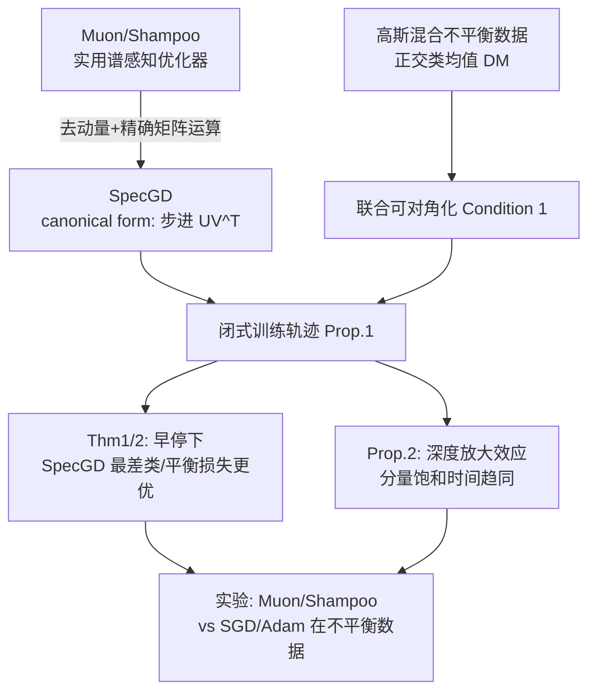

# How Muon's Spectral Design Benefits Generalization: A Study on Imbalanced Data

**会议**: ICLR 2026  
**OpenReview**: [https://openreview.net/forum?id=YzjS4jcfmS](https://openreview.net/forum?id=YzjS4jcfmS)  
**代码**: 待确认  
**领域**: 优化理论 / 泛化分析  
**关键词**: Muon, Shampoo, Spectral Gradient Descent, 隐式正则化, 类别不平衡, 谱感知优化器  

## 一句话总结
本文把 Muon/Shampoo 抽象成 Spectral Gradient Descent（SpecGD），在高斯混合不平衡数据上给出闭式训练轨迹，证明 SpecGD 以**相同速率学习所有谱分量**（而 GD 优先学主分量），从而在早停时取得更优的最差类/类平衡泛化，并揭示这正是 Muon 在不平衡数据上超越 SGD 的机制。

## 研究背景与动机

**领域现状**：以 Muon、Shampoo 为代表的谱感知（spectrum-aware）矩阵值优化器在深度分类器和大语言模型上展现出显著训练加速，相比 SGD+momentum 甚至 Adam 都有优势。它们与 SGD/Adam 的本质区别在于：后者把参数向量化后逐元素（entry-wise）操作，而 Muon/Shampoo 直接在层级的**矩阵参数**上工作。

**现有痛点**：尽管经验上很成功，"谱感知优化器何时比标准方法泛化得更好"这一根本问题始终没有答案。已有理论工作（Fan et al. 2025、Tsilivis et al. 2024）刻画了 SpecGD 的隐式偏置——驱动权重走向谱范数意义下的 max-margin 分类器，但有两个局限：① 只描述训练**终末阶段**的行为，而实践常用早停；② 隐式偏置结果**不直接保证泛化**（即便线性设定下最小谱范数解也可能不唯一）。

**核心矛盾**：Muon/Shampoo 的研究大多停留在优化性质（收敛、可扩展性）层面，其**泛化行为及背后机制**仍被严重忽视。一个干净、可解析、能精确量化"何时谱方法更优"的设定缺失。

**本文目标**：找出 SpecGD 在泛化上明确优于（欧氏）GD 的具体设定，并把这种优势精确量化、归因到可解释的机制。

**核心 idea**：作者用三层简化抽象搭出可解析的舞台——**【抽象 1：不平衡数据当试验场】** 用类别/群组不平衡数据作为 testbed；**【抽象 2：SpecGD 当 canonical form】** 把 Muon/Shampoo 去掉动量与近似、用精确矩阵运算后归约为 SpecGD（每步更新 $UV^\top$，其中 $U\Sigma V^\top$ 是梯度的截断 SVD），正如 SignGD 是 Adam 的 canonical form；**【抽象 3：高斯混合 + 联合可对角化】** 在此框架下挑出一个能写出闭式轨迹的高斯混合数据模型，精确比较 SpecGD 与 GD。

## 方法详解

### 整体框架

本文不是提新算法，而是搭一套**可解析的理论分析框架**：先把实用优化器统一进 normalized steepest descent（NSD）的视角，再在高斯混合不平衡数据模型上推导 GD 与 SpecGD 的闭式训练轨迹，最后用这些轨迹证明早停下的泛化差距并扩展到深度模型。

### 关键设计

**1. 统一视角：NSD 把所有优化器归约为"对不同范数的归一化最速下降"**，这是整套理论的入口。归一化最速下降的更新写作 $W_{t+1}=W_t-\eta\Delta_t$，其中 $\Delta_t:=\arg\max_{\|\Delta\|\le 1}\langle\nabla_t,\Delta\rangle$。取不同范数就得到不同优化器：Frobenius 范数给出 NGD（$\Delta_t=\nabla_t/\|\nabla_t\|_F$），max 范数给出 SignGD（$\Delta_t=\mathrm{sign}(\nabla_t)$），谱范数给出 SpecGD（$\Delta_t=U_tV_t^\top$，即梯度 SVD 去掉奇异值）。加上动量项 $M_t=\beta M_{t-1}+(1-\beta)\nabla_t$ 后，谱范数版本就是 Muon（$\beta=0$ 时退化为 SpecGD）。这一统一让"Muon 为何不同"变成"谱范数最速下降在做什么"的可分析问题。

**2. 高斯混合数据模型 + 联合可对角化条件，让闭式轨迹成为可能**。数据模型 (DM) 设 $k$ 个类、类先验 $p_c$，每类样本是以正交类均值 $\mu_c$（$\|\mu_c\|=\mu$、$\mu_i\perp\mu_j$）为中心的各向同性高斯 $x|y\sim\mathcal N(\mu_y,\sigma_x^2 I)$，并定义少数类 $m=\arg\min_c p_c$、信噪比 $\mathrm{SNR}=\mu^2/\sigma_x^2$。关键引理证明此模型满足 Condition 1（联合可对角化）：总体矩 $\Sigma_{yx}=US_{yx}V^\top$、$\Sigma_{xx}=VS_{xx}V^\top$ 共享同一组正交基，且谱值满足 $s^{yx}_c=\mu p_c$、$s^{xx}_c=\mu^2 p_c+\sigma_x^2$——即**谱分量按类先验降序排列，少数类对应最不显著的分量**。作者特意把 Saxe et al. 的经验矩条件搬到**总体统计**上，从而能直接谈测试损失，而 Gidel et al. 在 MNIST/CIFAR 上验证过该条件的弱化版近似成立，故并非空中楼阁。

**3. 核心结论——SpecGD"齐头并进"学所有分量，GD"先肥后瘦"**。在零初始化、Condition 1 下，GD 的轨迹（梯度流近似）为 $\overline W_t[c,c]\approx\frac{s^{yx}_c}{s^{xx}_c}(1-e^{-\eta s^{xx}_c t})$，分量 $c$ 的学习速率正比于 $s^{xx}_c$，于是**主分量学得快、弱分量学得慢**。而 Proposition 1 给出 SpecGD 的闭式轨迹 $\overline W_t[c,c]=\eta t\cdot\mathbb 1[t\le\frac{s^{yx}_c}{\eta s^{xx}_c}]+\frac{s^{yx}_c}{s^{xx}_c}\cdot\mathbb 1[t>\frac{s^{yx}_c}{\eta s^{xx}_c}]$——所有分量都以**相同斜率 $\eta$ 线性增长**直到各自饱和。两者虽渐近收敛到同一解，但 SpecGD 让少数类（弱分量）在早期就被同步学到。

**4. 早停泛化定理：把"齐头并进"翻译成可量化的损失差距**。借助单类损失 $L_c(t)=\frac12[(1-\mu\alpha_c(t))^2+\sigma_x^2\sum_j\alpha_j^2(t)]$（$\alpha_c=\overline W[c,c]$），Theorem 1 证明在 $\mu\ge1$、$k\ge 3\mu$、$p_m\le\frac{1}{5\mathrm{SNR}+6k}$ 等条件下，设 $t^\star=s^{yx}_m/s^{xx}_m$ 为 SpecGF 刚好拟合少数类的时刻，则对所有 $t\in(0,t^\star]$ 差距随时间**线性增长**：$L^{GF}_m(t)-L^{Spec}_m(t)\ge\mu t/4$、$L^{GF}_{bal}(t)-L^{Spec}_{bal}(t)\ge\mu t/2$。Theorem 2 进一步排除"优势只来自归一化"的质疑：即便给 GD 配上归一化（NGD），SpecGD 仍在 $L^{NGF}_m-L^{Spec}_m\ge\mu t/2$、平衡损失同量级上胜出——因为 NGD 的轨迹形状与 GD 相同，只是更快，仍然先学主分量。

**5. 深度放大效应：层数越多，分量饱和时间越趋同**。把模型扩成深度 $L$ 的线性网 $W=\prod_i W_i$，Proposition 2（双线性 $L=2$，对应 UFM 无约束特征模型）显示 SpecGD 下分量 $c$ 的饱和时间从线性模型的 $t_c=\frac1\eta\frac{s^{yx}_c}{s^{xx}_c}$ 变为 $t_c\approx\frac1\eta\sqrt{s^{yx}_c/s^{xx}_c}$，一般深度下 $t_c\propto(s^{yx}_c/s^{xx}_c)^{1/L}$。少数类与多数类饱和的相对间隔 $\Delta T=\big(\frac{\mathrm{SNR}+1/p_m}{\mathrm{SNR}+1/p_M}\big)^{1/L}-1$ 随 $L$ 增大而缩小——即**深度同时加速所有分量学习、并拉近不同分量的饱和时刻**，使少数类更早被学到。

## 实验关键数据

### 主实验：群组/类别不平衡上 Muon vs SGD/Adam/Shampoo

| 设定 | 数据集 | 模型 | 关键指标 | 主要发现 |
|------|--------|------|----------|----------|
| 群组不平衡（spurious） | Colored-MNIST（99% 数字-颜色相关） | MLP | 少数组准确率 | Muon 早期即在少数组超越 NMD/Signum |
| 类别 STEP 不平衡（20:1） | CIFAR-10 / CIFAR-100 | ResNet-18/50 | 少数类准确率 | Muon 早期显著缩小少数-多数类差距 |
| 群组不平衡（spurious） | MNIST-CIFAR Dominoes | ResNet-34 | 最差组 / 解码最差组准确率 | Muon/Shampoo/Adam 解码精度远高于 SGD，说明学到 core 特征；SGD 依赖 spurious |
| 子群鲁棒性 | MultiNLI（BERT 微调） | BERT-base | 最差组准确率 | Muon/Shampoo > SGD；Adam 略优于 Muon |
| 子群鲁棒性 | CelebA（ResNet-50 微调） | ResNet-50 | 最差组准确率 | Muon/Shampoo > SGD；FT epoch 增多后 Muon ≈ Adam |

### 消融 / 机制验证实验

| 实验 | 设定 | 验证的理论点 |
|------|------|--------------|
| 线性模型 NGD/SignGD/SpecGD（交叉熵，重尾不平衡，20 类） | $p_c\propto1/c$, $d=200$ | 早停 SpecGD 的类平衡/最差类测试精度高于其他更新规则任意停点（Fig.4） |
| 迭代轨迹 $\overline W_t[c,c]$ 追踪（$d=k=3$） | $p=(0.5,0.3,0.2)$ | SpecGD 齐速、(N)GD 先学主分量；三者最终收敛同解（Fig.2） |
| 有限样本 + 随机初始化 vs 理论轨迹 | App. C | 理论动态与经验观测高度吻合；Muon($\beta=0.9$)≈SpecGD |
| 2 层 vs 4 层 MLP（Colored-MNIST） | 深度对比 | 深度加速少数分量学习、缩小饱和间隔，验证 Prop.2/深度效应（Fig.6） |

### 关键发现
- **机制归因**：在 spurious 相关数据里，spurious 特征（如颜色）是**主谱分量**、core 特征（如数字形状）是弱分量；SGD 优先学主分量 → 依赖捷径，Muon 齐速学习 → 抓住 core 特征，从而最差组泛化更好。
- **优势集中在早期**：所有方法渐近收敛同解，SpecGD 的泛化红利主要体现在**早停**阶段，差距随时间先增后随饱和收敛。
- **不是归一化的功劳**：NGD 收敛更快但轨迹形状不变，仍输给 SpecGD，证明优势来自谱设计本身。
- **语言建模延伸**：把类别不平衡推广到 next-token prediction（词频长尾），谱方法对长尾 token 的学习同样更均衡。

## 亮点与洞察
- **抽象选得极准**：用"不平衡数据 + 总体统计联合可对角化"把一个看似难解的"何时泛化更好"问题压成可写闭式解的形式，且数据模型能严格满足理论条件，避免了纯凑条件的尴尬。
- **canonical form 类比优雅**：SignGD↔Adam、SpecGD↔Muon/Shampoo 的平行结构，让谱方法的分析能复用 max-margin/隐式偏置的成熟工具链。
- **机制可解释**：把"Muon 为何更好"落到"谱分量学习速率"这一可观测量上，并通过 spurious=主分量、core=弱分量的映射，把抽象理论接回真实的 spurious correlation 现象。
- **深度效应有反直觉点**：深度对 GD 与 SpecGD 的作用方式不同——SpecGD 下深度把不同分量的饱和时刻拉近，这对理解深网为何在不平衡数据上表现不同提供了新角度。

## 局限与展望
- **理论限定在平方损失 + 总体设定 + 线性/双线性/深度线性模型**，并依赖联合可对角化（Condition 1，即残差 $\|B\|=0$），真实非线性深网只能近似满足。
- **数据模型理想化**：正交类均值、各向同性高斯，现实数据的相关结构与该假设有差距；虽用 MNIST/CIFAR 的弱条件做了佐证，但严格性仍有缺口。
- **优势依赖早停且场景受限**：渐近上所有方法等价，SpecGD 的红利只在早停 + 不平衡/spurious 场景显著；在 MultiNLI 上 Adam 反而更优，说明结论并非普适。
- **从 SpecGD 到实用 Muon 有 gap**：实用 Muon 含动量与 Newton-Schulz 近似，理论只在 $\beta=0$、精确 SVD 下严格成立，作者用经验补足但缺解析保证。
- **展望**：把分析推广到交叉熵/非线性激活、放宽联合可对角化、刻画动量与近似迭代对谱学习速率的影响，将让该框架更贴近实践。

## 相关工作与启发
- **隐式偏置谱系**：GD→$\ell_2$ max-margin（Soudry et al. 2018），Adam→$\ell_\infty$ max-margin（Zhang et al. 2024），SpecGD→谱范数 max-margin（Fan et al. 2025）。本文补上"终末偏置之外、早停阶段的泛化动态"这一缺环。
- **深度线性网动态**：Saxe et al. 2013、Gidel et al. 2019 给出 GD 在联合可对角化下的阶段式学习轨迹，本文把同一工具迁移到 SpecGD 并扩到总体统计。
- **谱感知优化器**：Shampoo（Gupta et al. 2018）、Muon（Jordan et al. 2024；Pethick et al. 2025）此前多从优化/可扩展性角度研究，本文专攻其泛化机制。
- **spurious correlation / 子群鲁棒性**：Colored-MNIST、Dominoes、CelebA、MultiNLI 等基准把"core vs spurious=弱 vs 主谱分量"的解释落地，与 Ng et al. 2024 的谱观察呼应。
- **启发**：① 优化器选择本身是一种隐式正则化，"学什么分量、何时学"比"收敛到哪"对泛化更关键；② 在长尾/不平衡/有捷径的任务上，谱感知优化器 + 早停可能是比重采样/重加权更原生的解法；③ 用 canonical form 抽象复杂优化器，是分析新优化器泛化行为的可复用范式。

## 评分
- **新颖性**: ⭐⭐⭐⭐⭐ 首次把 Muon/Shampoo 的泛化优势精确量化并归因到"谱分量齐速学习"，canonical-form 抽象与早停泛化定理都很原创。
- **实验充分度**: ⭐⭐⭐⭐ 覆盖合成线性模型、CIFAR STEP、Colored-MNIST、Dominoes、CelebA、MultiNLI、语言建模，理论-经验对照扎实；非线性深网仅近似验证略有缺口。
- **写作质量**: ⭐⭐⭐⭐ 三层抽象的动机链条清晰，定理与机制解释衔接顺畅；公式密度高，对非理论读者门槛较陡。
- **价值**: ⭐⭐⭐⭐⭐ 给"何时该用谱感知优化器"提供了可解释、可量化的理论依据，对优化器选择与不平衡/spurious 学习均有指导意义。

<!-- RELATED:START -->

## 相关论文

- [\[ICLR 2026\] Generalization Below the Edge of Stability: The Role of Data Geometry](generalization_below_the_edge_of_stability_the_role_of_data_geometry.md)
- [\[NeurIPS 2025\] Implicit Bias of Spectral Descent and Muon on Multiclass Separable Data](../../NeurIPS2025/optimization/implicit_bias_of_spectral_descent_and_muon_on_multiclass_separable_data.md)
- [\[ICLR 2026\] Error Feedback for Muon and Friends](error_feedback_for_muon_and_friends.md)
- [\[ICLR 2026\] MuonBP: Faster Muon via Block-Periodic Orthogonalization](muonbp_faster_muon_via_block-periodic_orthogonalization.md)
- [\[ICLR 2026\] Towards Understanding the Calibration Benefits of Sharpness-Aware Minimization](towards_understanding_the_calibration_benefits_of_sharpness-aware_minimization.md)

<!-- RELATED:END -->
