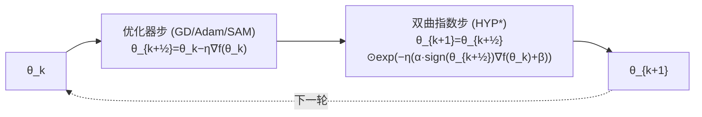

# Hyperbolic Aware Minimization: Implicit Bias for Sparsity

**会议**: ICLR 2026  
**OpenReview**: [https://openreview.net/forum?id=XKB5Hu0ACY](https://openreview.net/forum?id=XKB5Hu0ACY)  
**代码**: 随论文附带（附录 G）  
**领域**: optimization  
**关键词**: 隐式偏置, 稀疏训练, 镜像流, 黎曼梯度流, 双曲几何, 符号翻转, 过参数化  

## 一句话总结
HAM 用一个轻量的"双曲镜像步"和普通优化器步交替执行，在不增加任何参数/显存的前提下复现了 `m⊙w` 逐点过参数化带来的稀疏隐式偏置，同时修好了它在原点附近"逆度量塌缩、参数卡死无法翻符号"的老毛病，让稠密训练和稀疏训练都涨点。

## 研究背景与动机

**领域现状**：现代深度学习的泛化很大程度依赖过参数化带来的隐式偏置（implicit bias）——优化器和过参数化耦合后，会在训练动力学上施加隐式正则，从而改善泛化。最近的稀疏训练把这个思路用到极致：PILoT 和 Sign-In 把每个权重 $\theta$ 重写成两个参数的逐点乘积 $m\odot w$，这等价于一个**双曲镜像映射**（hyperbolic mirror map），能在训练中从隐式 $L_2$（稠密）偏置平滑过渡到隐式 $L_1$（稀疏）偏置，显著提升稀疏网络的泛化。

**现有痛点**：`m⊙w` 这套过参数化有两个硬伤。其一，它在原点附近的**逆度量塌缩**——`m⊙w` 对应的黎曼逆度量是 $g^{-1}(\theta)=\sqrt{\theta^2+\gamma^2}$，当初始化尺度参数 $\gamma\to 0$ 且权重 $\theta$ 很小时，逆度量远小于 1，导致参数在 0 附近移动极慢、**卡死在 0 处无法翻转符号**（sign flip），而符号学习恰恰是稀疏训练能否成功的关键瓶颈。其二，它把参数量直接翻倍，带来额外显存与计算开销。Sign-In 试图通过周期性把 $\gamma$ 重置回 1 来缓解逆度量塌缩，但这种"硬扰动"不稳定，效果有限。

**核心矛盾**：既想要 `m⊙w` 那套有益的双曲几何（促进符号翻转 + 隐式稀疏偏置），又不想要它的逆度量塌缩和翻倍参数。

**本文目标**：提炼 `m⊙w` 隐式偏置的本质结构，做成一个即插即用、零额外参数的优化步，且根治原点附近的减速问题。

**核心 idea**：**[交替双曲步]** 把 `m⊙w` 的梯度流改写成一个可以直接作用在 $\theta$ 上的**指数更新步**，再把它和任意一阶优化器步**交替**执行——梯度步负责把卡在 0 的参数推离原点完成符号翻转，双曲指数步负责注入双曲几何与稀疏偏置，两者配合实现"符号对了就精修幅值，符号错了就快速归零去纠错"。

## 方法详解

### 整体框架

HAM 的核心是把"过参数化的隐式偏置"从"显式造两套参数"解耦成"在原参数空间上交替两个更新步"。每一步先走一个标准优化器步（GD/Adam/SAM 皆可）得到中间点 $\theta_{k+1/2}$，再叠加一个轻量的双曲指数步把结果拉回双曲几何。整个过程不引入新参数，复用已算好的梯度和符号，因此显存零开销、额外 flops 与参数量成线性、可忽略。

### 关键设计

**1. 从 `m⊙w` 反推出免过参数化的指数更新：把双曲几何"解耦"出来。** 出发点是 `m⊙w` 在加权重衰减 $\beta$ 后的梯度流积分形式 $\theta_t = u_0^2\odot\exp(-2\int_0^t\nabla f\,ds-4\beta t) - v_0^2\odot\exp(2\int_0^t\nabla f\,ds-4\beta t)$。作者借助 Wu & Rebeschini 揭示的"该双曲梯度流同时也是指数梯度下降"这一联系，证明（Thm 3.1）：只要初始化满足 $m_0=\mathrm{sign}(\theta_0)w_0=\sqrt{|\theta_0|}$，那么单步指数更新 $\theta_{k+1}=\theta_k\exp(-\eta(2\,\mathrm{sign}(\theta_k)\nabla f(\theta_k)+4\beta))$ 与原 `m⊙w` 动力学**一阶等价**（离散误差 $O(\eta^2)$）。这一步的意义是：不必再维护 $m,w$ 两套参数，直接在 $\theta$ 上写出等价更新。但纯指数更新对应 $\gamma=0$，会完全禁止符号翻转——参数一旦到 0，更新量正比于 $\theta=0$ 就永远卡住。

**2. 交替机制：用梯度步"踹一脚"破解原点卡死。** 这是 HAM 真正的新颖点。把指数步和一个普通梯度步交替起来：
$$\theta_{k+\frac12}=\theta_k-\eta\nabla f(\theta_k)\quad(\text{GD});\qquad \theta_{k+1}=\theta_{k+\frac12}\odot\exp\big(-\eta(\alpha\,\mathrm{sign}(\theta_k)\nabla f(\theta_k)+\beta)\big)\quad(\text{HYP}).$$
直觉是：指数步给参数加了一个尺度缩放，当符号正确时它精细打磨幅值；当符号错误时它驱动参数指数级快速趋零；而在趋零的"半路上"，单纯指数步会卡在 0，此时穿插的梯度步提供一个非零位移把参数推过 0 完成符号翻转。一句话概括这套交替更新：**符号对就学幅值，符号错就快速归零以便纠错**。其中超参 $\alpha$ 控制收敛速度与"双曲感知强度"，$\beta$ 类似 PILoT 那样注入显式稀疏正则。

**3. 显存友好的实际部署形式（HYP*）：用半步符号替代整步符号。** 朴素的 (HYP) 同时依赖 $\theta_k$ 和 $\theta_{k+1/2}$，需要两份内存。作者把 $\mathrm{sign}(\theta_k)$ 替换成 $\mathrm{sign}(\theta_{k+1/2})$，得到实际部署的
$$\theta_{k+1}=\theta_{k+\frac12}\odot\exp\big(-\eta(\alpha\,\mathrm{sign}(\theta_{k+\frac12})\nabla f(\theta_k)+\beta)\big)\quad(\text{HYP*}),$$
这样只需复用当前权重的符号即可，**零额外显存**。更妙的是，这个改动不只是省内存：把符号与"评估是否该加速"的梯度对齐，反而促成了更稳定、更有意义的符号翻转（附录 D），理论分析（Thm B.6）依旧成立。相比之下 `m⊙w` 直接翻倍参数，SAM 则要近乎翻倍单步计算。

**4. 双曲逆度量与可调的 L2↔L1 隐式偏置：理论刻画为什么有效。** 取 $\eta\to0$，HAM 的黎曼梯度流为（Thm 4.2）
$$d\theta_t=-(1+\alpha|\theta_t|)\odot\nabla f(\theta_t)\,dt-\beta\theta_t\,dt,$$
即逆度量 $g^{-1}_{\text{HAM}}(\theta)=1+\alpha|\theta|$。对比三者：GD 是 $1$，`m⊙w` 是 $\sqrt{\theta^2+\gamma^2}$（会塌缩到远小于 1），而 HAM 始终 $\geq 1$ 且**不受噪声/正则影响**——这从根上解决了逆度量塌缩，保证收敛速率至少和 GD 一样（Thm 4.3，PL 条件下线性速率 $\Lambda$）。同时其对应的 Bregman 函数 $R_\alpha$ 在 $\alpha\to0$ 时正比于 $\|\theta\|_{L_2}^2$、$\alpha\to\infty$ 时正比于 $\|\theta\|_{L_1}$（Thm 4.6），说明 $\alpha$ 平滑插值出从稠密到稀疏的隐式偏置。实践中因离散化，纯靠 HAM 难以单独压出强稀疏，故定位为"稀疏几何的引导者"，与各类稀疏化方法配合使用最佳。

## 实验关键数据

### 主实验：稠密训练（ResNet50 / ImageNet, Top-1 %）

| 方法 | 100 ep | 200 ep | +SAM 100 ep | +SAM 200 ep |
|------|--------|--------|-------------|-------------|
| Baseline | 76.72±0.19 | 77.27±0.13 | 77.10±0.21 | 77.94±0.16 |
| **HAM** | **77.51±0.11** | **77.86±0.05** | **77.92±0.15** | **78.56±0.12** |

HAM 在所有列上都超过基线，且与 SAM **互补**（SAM-HAM 取得最佳 78.56），同时 HAM 单步几乎零额外开销，而 SAM 单步代价翻倍。

### 稀疏化实验：Dense-to-Sparse / PaI / DST（ResNet50 / ImageNet, Top-1 %）

| 类型 | 方法 | s=0.8 | s=0.9 | s=0.95 |
|------|------|-------|-------|--------|
| PaI | Random | 73.87 | 71.56 | 68.72 |
| PaI | Random+Sign-In | 74.12 | 72.19 | 69.38 |
| PaI | **Random+HAM** | **74.84** | **72.72** | **70.05** |
| DtS | AC/DC | 75.83 | 74.75 | 72.59 |
| DtS | AC/DC+Sign-In | 75.9 | 74.74 | 72.88 |
| DtS | **AC/DC+HAM** | **77.2** | **76.66** | **75.45** |
| DST | RiGL | 75.02 | 73.7 | 71.89 |
| DST | **RiGL+HAM** | **76.22** | **74.83** | 72.93 |
| Cont. | STR | 75.49 | 72.4 | 64.94 |
| Cont. | **STR+HAM** | **76.37** | **75.01** | **71.41** |

AC/DC+HAM 提升最猛（s=0.95 时 72.59→75.45，+2.86），作者归因于 AC/DC 的稠密阶段能充分发挥 HAM 的几何优势；STR 在高稀疏度 s=0.95 时崩到 64.94，加 HAM 拉回 71.41，提升惊人。

### 关键发现

- **符号翻转**：Random PaI（90% 稀疏，100 epoch）下，HAM 在各训练区间持续比 baseline 和 Sign-In 翻转更多符号（Fig. 2a），实证支撑其加速原点附近学习的理论。
- **互补机制**：HAM 走"隐式稀疏偏置 + 原点加速"，SAM 走"找平坦解"，二者方向正交，叠加最优。
- **通用性**：附录还在 ViT 预训练、LLM 微调、图/节点分类上验证了 HAM 作为通用优化原则的适用性；$\alpha$ 在不同任务上稳定（最优约 200），$\beta$ 需像权重衰减一样微调。

## 亮点与洞察

- **"解耦"思路漂亮**：把过参数化的好处（双曲几何）从"造两套参数"中剥离出来，用一个交替指数步在原参数空间复现，既省显存又可控，是 implicit bias 工程化的范例。
- **诊断 + 对症**：先定位 `m⊙w` 的根因是"逆度量在原点塌缩导致符号卡死"，再精确给出 $g^{-1}=1+\alpha|\theta|\geq1$ 的解药，理论闭环干净。
- **即插即用**：能挂在 GD/Adam/SAM 任意一阶优化器后面，零参数、近零 flops，且和 SAM 互补，落地门槛极低。
- **$\alpha$ 一旋钮调 L2↔L1**：把隐式偏置的"稀疏强度"做成连续可调超参，比 `m⊙w` 那种被噪声/初始化牵着走的隐式 $\gamma$ 更可控。

## 局限与展望

- **难单独压稀疏**：因离散化，$\alpha\to\infty$ 的强 $L_1$ 偏置在实践中需极小学习率才收敛，HAM 自身压不出强稀疏，必须搭配 AC/DC/RiGL/STR 等稀疏化方法，定位是"引导者"而非"主力"。
- **$\beta$ 需调**：$\alpha$ 跨任务稳定，但 $\beta$ 仍需像权重衰减一样针对数据集调（ImageNet 用 1e-3，CIFAR100 用 16e-3）。
- **理论限于线性回归**：隐式偏置与收敛性证明主要在欠定线性回归与 PL/凸假设下给出，深网非凸场景的严格保证仍是开放问题。
- **镜像映射可拓展**：作者提出未来可用不同镜像映射注入任务/优化器特定的"感知"（如鲁棒性、动量、归一化），是一条有潜力的算法-理论双线方向。

## 相关工作与启发

- **稀疏训练谱系**：PaI（SNIP/SynFlow/随机剪枝）、DtS（IMP/LRR/AC/DC/CAP）、DST（RiGL/SET/MEST）、连续稀疏化（PILoT/STR/CS/spred），HAM 直接对标并增强其中的 SOTA。
- **`m⊙w` 过参数化**：PILoT、Sign-In 是 HAM 的直接前身，HAM 抽取其双曲几何精华、抛弃翻倍参数与硬扰动。
- **镜像流 / 隐式偏置**：Li et al. (2022) 的镜像流即黎曼梯度流框架是理论基石；HAM 还能从自然梯度（Fisher 信息）、贝叶斯（IVON）、指数梯度下降（Kivinen & Warmuth）多视角解读。
- **两步/交替方法**：与 SAM、proximal、ADMM、软阈值、birth-death 动力学并列，但 HAM 工作在权重级、目标是稀疏几何而非平坦解，且与 SAM 实证互补。
- **启发**：用"等价改写 + 交替执行"把昂贵的过参数化压成零开销优化步，这套"诊断逆度量→设计对症几何"的范式，可推广到其它过参数化（如低秩、张量分解）的隐式偏置工程化。

## 评分
- **新颖性**: ⭐⭐⭐⭐⭐ 把 `m⊙w` 的双曲隐式偏置解耦成免参数的交替指数步，并精确诊断+修复逆度量塌缩，思路与理论都很原创。
- **实验充分度**: ⭐⭐⭐⭐ ImageNet/CIFAR100 上稠密+三类稀疏方法全面验证，附 ViT/LLM/图分类拓展；但核心理论只在线性回归，缺更大规模 LLM 主实验。
- **写作质量**: ⭐⭐⭐⭐ 动机—诊断—推导—理论—实验逻辑清晰，Table 1/2 与 Fig 1 把对比讲得很直观，部分公式推导偏密。
- **价值**: ⭐⭐⭐⭐⭐ 零开销、即插即用、与 SAM 互补、稳定涨点，对稀疏训练社区和 implicit bias 理论都有实打实的贡献。

<!-- RELATED:START -->

## 相关论文

- [\[ICLR 2026\] Minor First, Major Last: A Depth-Induced Implicit Bias of Sharpness-Aware Minimization](minor_first_major_last_a_depth-induced_implicit_bias_of_sharpness-aware_minimiza.md)
- [\[ICLR 2026\] Towards Understanding the Calibration Benefits of Sharpness-Aware Minimization](towards_understanding_the_calibration_benefits_of_sharpness-aware_minimization.md)
- [\[ICLR 2026\] MASAM: Multimodal Adaptive Sharpness-Aware Minimization for Heterogeneous Data Fusion](masam_multimodal_adaptive_sharpness-aware_minimization_for_heterogeneous_data_fu.md)
- [\[ICLR 2026\] Implicit Bias of Per-sample Adam on Separable Data: Departure from the Full-batch Regime](implicit_bias_of_per-sample_adam_on_separable_data_departure_from_the_full-batch.md)
- [\[ICLR 2026\] Bi-LoRA: Efficient Sharpness-Aware Minimization for Fine-Tuning Large-Scale Models](bi-lora_efficient_sharpness-aware_minimization_for_fine-tuning_large-scale_model.md)

<!-- RELATED:END -->
