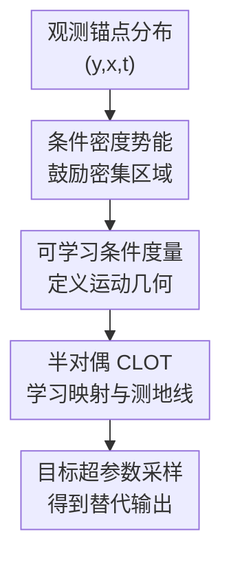

# Hyperparameter Trajectory Inference with Conditional Lagrangian Optimal Transport

**会议**: ICLR 2026  
**OpenReview**: [https://openreview.net/forum?id=P5B97gZwRb](https://openreview.net/forum?id=P5B97gZwRb)  
**代码**: https://github.com/harrya32/hyperparameter-trajectory-inference  
**领域**: 优化 / 最优传输 / 超参数轨迹推断  
**关键词**: 超参数轨迹推断、条件最优传输、Lagrangian dynamics、神经最优传输、推理时适配  

## 一句话总结

这篇论文提出 Hyperparameter Trajectory Inference (HTI)：把连续超参数看成“时间”，用条件 Lagrangian 最优传输学习神经网络输出分布随超参数变化的轨迹，从而在不重新训练原模型的情况下近似得到未观测超参数设置下的输出。

## 研究背景与动机

**领域现状**：许多神经网络的行为并不只由输入决定，还被训练时固定的超参数深刻影响。强化学习里的奖励权重、分位数回归里的目标分位点、生成模型里的 dropout 强度，都会改变训练得到的模型参数，进而改变条件输出分布 $p_{\theta_\lambda}(y|x)$。传统做法通常是在若干超参数上分别训练模型，或者只在部署前选定一个折中设置。

**现有痛点**：问题在于，很多超参数实际对应的是用户偏好或环境约束，而这些偏好在部署后可能变化。比如医疗治疗策略中，某位患者更需要保护免疫细胞，另一位患者更需要快速压低肿瘤；如果每次偏好变化都重新训练一个强化学习策略，成本会非常高。普通插值或条件生成模型虽然可以在输出空间里做平滑过渡，但它们并不关心中间分布是否像真实训练出来的神经网络输出。

**核心矛盾**：HTI 的难点不是“给定两个点连一条线”，而是要从少量已观测的超参数分布中推断一条可行的条件概率路径。神经网络训练景观复杂，超参数诱导的输出变化通常是非线性的；同时同一个超参数变化在不同输入条件 $x$ 下可能走不同的轨迹。因此，方法既要利用最优传输的 least-action 偏置，又要避免路径穿过低密度、不可行的输出区域。

**本文目标**：作者把这个问题形式化为 Hyperparameter Trajectory Inference：给定若干锚点超参数 $\Lambda_{obs}$ 上的条件输出样本，学习一个替代模型 $\hat p(y|x,\lambda)$，使其能在未观测的连续超参数 $\lambda$ 上近似原神经网络的输出分布。这个目标既包含条件轨迹推断，也包含推理时快速调节模型行为。

**切入角度**：论文从 trajectory inference 和 optimal transport 出发，把超参数 $\lambda$ 当作时间变量，把不同超参数下的输出分布看作同一群体在时间上的边缘分布。为了让推断出的路径更可信，作者把路径代价从固定欧氏距离换成可学习的 Lagrangian cost，并把条件变量 $x$ 融入传输映射、Kantorovich 势函数和测地线估计中。

**核心 idea**：用条件 Lagrangian 最优传输同时学习“什么样的移动代价合理”和“分布之间应该如何移动”，从而把稀疏超参数锚点补成一条可用于推理时采样的条件输出轨迹。

## 方法详解

### 整体框架

论文的方法可以理解为一个面向条件轨迹推断的神经 CLOT 框架。输入是若干观测时间/超参数 $t_k$ 上的样本三元组 $(y_i,x_i,t_i)$，其中 $y_i$ 是某个神经网络在输入条件 $x_i$ 下的输出或动作；输出则是一组相邻锚点之间的条件最优传输映射和测地线生成器，推理时给定目标 $t^*$ 或 $\lambda^*$，就能从最近的已观测锚点出发生成目标超参数下的样本。

核心训练过程分成三件事：先用核密度估计构造条件势能 $\hat U(q|x)$，鼓励路径经过数据密集区域；再学习度量矩阵 $G_{\theta_G}(q|x)$，定义条件动能 $K(q,\dot q|x)$；最后在这个 Lagrangian cost 下联合训练 Kantorovich 势函数、传输映射和 spline 测地线近似。推理阶段不再做昂贵优化，而是直接用学到的映射和路径网络在区间内取样。

形式上，作者使用的 Lagrangian 是

$$
L(q_t,\dot q_t|x)=K(q_t,\dot q_t|x)-U(q_t|x)=\frac{1}{2}\dot q_t^T G(q_t|x)\dot q_t-U(q_t|x).
$$

给定起点 $y_0$ 和终点 $y_1$，传输代价不是直接的 $\|y_0-y_1\|^2$，而是所有连接曲线中的最小作用量：

$$
c(y_0,y_1|x)=\inf_{q:q_0=y_0,q_1=y_1}\int_0^1 L(q_t,\dot q_t|x)dt.
$$

这使得“最短路径”由数据几何和密度结构共同决定，而不是被欧氏空间里的直线强行规定。

### 关键设计

**1. 条件密度势能：让推断路径偏向真实数据流形**

普通最优传输在高维输出空间里很容易得到看似短、实际不可行的路径：两端点都来自真实模型输出，但中间可能穿过训练模型从未产生过的低密度区域。论文用条件核密度估计构造势能项 $\hat U(q|x)$ 来处理这个问题：

$$
\hat U(q|x)=\alpha \log(\hat p(q|x)+\epsilon),
$$

其中 $\hat p(q|x)$ 用 Nadaraya-Watson 估计得到，输出空间和条件空间分别由 Gaussian kernel $K_{h_y}$ 与 $K_{h_x}$ 平滑。因为 Lagrangian 中是 $K-U$，高密度区域对应更高的 $U$、更低的有效作用量，所以测地线会自然倾向于穿过观测样本密集的区域。

这个设计的意义在于，它把 manifold hypothesis 变成了路径代价的一部分。模型不是事后约束采样点“别跑太远”，而是在学习传输路径时就把“经过像真实输出的地方”设为更便宜的运动方式。对于 HTI 来说，这很关键：未观测超参数下的输出应该像某个真实神经网络可能产生的输出，而不是锚点输出之间的线性平均。

**2. 条件 Lagrangian 最优传输：同时学习路径代价和传输映射**

论文不是固定一个 cost 再解 OT，而是把 cost 本身也作为要从数据中学习的对象。对每对相邻观测边缘分布 $\mu_k(\cdot|x)$ 与 $\mu_{k+1}(\cdot|x)$，方法用半对偶 COT 形式学习 Kantorovich 势函数 $g_{\theta_g,k}$，同时学习传输映射 $T_{\theta_T,k}(y_k|x)$ 和 spline 测地线生成器 $S_{\theta_S}$。

训练目标是一个交替的 min-max 过程：固定度量 $G_{\theta_G}$ 时，势函数要最大化半对偶目标，从而更准确地估计当前 cost 下的 CLOT；固定势函数时，度量网络要最小化相邻锚点之间的总传输代价，把 least-action 偏置压进学到的几何里。论文把总体目标写成

$$
\min_{\theta_G}\sum_k \mathbb E_x\left[\max_{\theta_{g,k}} \mathbb E_{y_k\sim\mu_k}[g^c_{\theta_{g,k}}(y_k|x)] + \mathbb E_{y_{k+1}\sim\mu_{k+1}}[g_{\theta_{g,k}}(y_{k+1}|x)]\right].
$$

这里的关键是“条件”并不只是给网络多喂一个输入。每个势函数、映射网络和路径网络都通过 FiLM 层接受 $x$，因此同一个超参数区间在不同条件下可以拥有不同的运动方向和曲率。以强化学习为例，同样把奖励权重从 $0$ 调到 $5$，不同患者状态或机器人状态下的动作分布变化可以完全不同。

**3. Amortized c-transform 与 spline 测地线：把嵌套优化变成可训练近似**

CLOT 的精确定义里有两层优化：为了算 $g^c(y_0|x)$，需要在终点 $y_1'$ 上最小化 $c(y_0,y_1'|x)-g(y_1'|x)$；而为了算 $c$，又需要在所有连接曲线上最小化作用量。直接把这两层都放进训练会非常慢。论文沿用并扩展 Pooladian et al. 的 amortization 思路，用神经网络给这些优化提供近似解。

具体来说，传输映射网络 $T_{\theta_T,k}$ 先预测一个终点，随后用少量 L-BFGS 步骤细化出更好的 $T_{c,k}(y_k|x)$；这个细化结果反过来作为 $T_{\theta_T,k}$ 的回归目标。路径方面，论文用 cubic spline 表示连接 $y_k$ 和 $T_{\theta_T,k}(y_k|x)$ 的曲线，其参数由 $S_{\theta_S}(y_k,y_{k+1},x)$ 输出，并通过最小化作用量训练。

这个设计把理论上昂贵的最优控制问题折叠成了“训练时少量优化 + 网络学习摊销”的形式。更重要的是，推理时完全不需要 L-BFGS：只需选中目标超参数所在区间，从左侧锚点采样 $y_k$，用 $T_{\theta_T,k}$ 得到区间终点，再用 $S_{\theta_S}$ 生成 spline 并在归一化位置 $s^*=(t^*-t_k)/(t_{k+1}-t_k)$ 上取值。

**4. 高维可用的正定度量参数化：避免退化又允许各向异性几何**

学习 Lagrangian 的动能项时，度量矩阵 $G_{\theta_G}$ 必须是对称正定的。如果网络可以任意缩小所有方向的特征值，就会出现退化解：把 $G$ 推向零矩阵，任何移动都几乎没有代价。旧的 NLOT 做法主要面向二维空间，用固定特征值和一个旋转角来避免退化，但这无法自然扩展到高维输出。

论文把 $G_{\theta_G}$ 写成特征分解形式 $G_{\theta_G}=R_{\theta_G}E_{\theta_G}R_{\theta_G}^T$。其中 $E_{\theta_G}$ 是正的对角矩阵，并被约束为特征值总和等于一个非零 eigenvalue budget；$R_{\theta_G}$ 则由一串 Givens rotation 组成，旋转角由网络输出。这样一来，度量始终保持正定和非零体积，同时还能学习哪些方向移动便宜、哪些方向移动昂贵。

这对 HTI 的实用性很重要。分位数回归实验里的输出是 3-step forecast，不再只是二维点；如果度量参数化只能在二维玩具数据上工作，方法就很难支撑真实神经网络输出分布的轨迹推断。作者的参数化让同一套 CLOT 框架可以覆盖二维合成数据、二维连续控制动作，以及更高维的预测输出。

### 损失函数 / 训练策略

训练由外层和内层交替组成。内层对每个相邻时间区间更新 Kantorovich 势函数 $g_{\theta_g,k}$、传输映射 $T_{\theta_T,k}$ 和路径网络 $S_{\theta_S}$；外层更新度量网络 $G_{\theta_G}$。势函数最大化半对偶目标，传输映射最小化与 L-BFGS 细化终点之间的回归误差，路径网络最小化 spline 曲线的作用量。

映射损失可以概括为

$$
L_{map}(\theta_{T,k})=\mathbb E[(T_{\theta_T,k}(y_k|x)-T_{c,k}(y_k|x))^2],
$$

路径损失则是

$$
L_{path}(\theta_S)=\mathbb E[S(q_\phi|x)],\quad \phi=S_{\theta_S}(y_k,T_{\theta_T,k}(y_k|x),x).
$$

算法最终返回每个区间的传输映射和共享的测地线生成器。采样时，若目标 $t^*$ 位于 $[t_k,t_{k+1}]$，先从 $p_{t_k}(\cdot|x)$ 抽样 $y_k$，预测区间终点 $\hat y_{k+1}=T_{\theta_T,k}(y_k|x)$，再用 spline 路径 $q_\phi$ 在 $s^*$ 处取 $\hat y_{t^*}$。这也是论文宣称能实现推理时快速行为调节的直接原因。

## 实验关键数据

### 主实验

论文先用条件半圆合成数据验证 CTI 的基本能力，再在 HTI 场景中测试奖励权重、分位数目标和 dropout 三类超参数。主结果最能说明问题的是：完整方法 $K_\theta-\hat U$ 通常在稀疏锚点下优于直接回归、CFM、MFM 和 NLOT；当任务主要需要密度流形偏置时，带 $\hat U$ 的简化版本也非常强。

| 任务 | 指标 | 本文最好结果 | 最强基线 / 对照 | 结论 |
|------|------|--------------|------------------|------|
| 条件半圆 CTI | NLL ↓ | $K_\theta-\hat U$: -0.662 | $K_I-\hat U$: -0.532 | 同时学习度量和密度势能最能恢复弯曲条件轨迹 |
| Cancer RL reward weighting | Reward ↑ | $K_\theta-\hat U$: 102.49 | $K_I-\hat U$: 83.62 | 完整方法最接近真实策略随 NK 惩罚权重变化的行为 |
| Reacher reward weighting | Reward ↑ | $K_\theta-\hat U$: -6.093 | $K_\theta$: -6.158 | 学到的条件几何在连续控制动作插值上最稳 |
| ETTm2 quantile regression | MSE ↓ | $K_\theta-\hat U$: 0.608 | $K_\theta$: 0.620 | 高维输出下完整 CLOT 仍优于流匹配基线 |
| Two moons dropout | WD ↓ | $K_I-\hat U$: 0.060 | $K_\theta-\hat U$: 0.079 | dropout 插值中密度势能是主要贡献 |

在 Cancer 实验中，作者只训练 $\lambda_{nk}\in\{0,5,10\}$ 三个 PPO 策略，每个策略收集 1000 个 state-action 样本，然后评估 $\{1,2,3,4,6,7,8,9\}$ 上的替代策略。完整方法的平均 reward 为 102.49，而训练一个新的 PPO 策略约需 3.5 小时，训练替代模型约需 15 分钟。论文还指出，图中真实曲线需要训练 11 个 PPO 策略约 38 GPU hours，而 HTI 只需 3 个 PPO 策略加一个替代模型约 11 GPU hours。

### 消融实验

合成半圆实验清楚拆开了两个 inductive bias：$\hat U$ 负责把路径吸向数据密集区域，$K_\theta$ 负责学习非欧氏曲率。度量参数化消融则比较了固定特征值的旧式表示和本文可学习特征值预算表示。

| 配置 | 关键指标 | 说明 |
|------|----------|------|
| $K_I$ | 半圆 NLL 105.713，CD 0.323 | 欧氏直线路径，没有密度偏置，几乎无法恢复半圆轨迹 |
| $K_\theta$ | 半圆 NLL 23.008，CD 0.158 | 只学度量，能捕捉一部分曲率，但仍会穿过不合适区域 |
| $K_I-\hat U$ | 半圆 NLL -0.532，CD 0.016 | 只用密度势能，能避开低密度区域，效果大幅提升 |
| $K_\theta-\hat U$ | 半圆 NLL -0.662，CD 0.016 | 同时使用 least-action 和 dense traversal，综合最好 |
| 固定特征值度量 | Cancer reward 98.72，Reacher reward -6.122 | 旧式二维参数化可以工作，但表达力较弱 |
| 可学习特征值预算度量 | Cancer reward 102.49，Reacher reward -6.093 | 本文参数化多数二维任务更好，并能扩展到高维 |

### 关键发现

- 密度势能 $\hat U$ 是防止路径不可行的关键组件。半圆和 dropout 实验都显示，只要输出分布明显位于低维流形上，鼓励路径经过高密度区域就能带来显著收益。
- 学习条件度量 $G_{\theta_G}$ 对需要捕捉弯曲动力学和条件相关运动的任务很重要。它不只是让路径变平滑，而是在 cost 层面定义“什么方向的移动更自然”。
- HTI 在锚点稀疏时价值最大。附录的 sparsity investigation 显示，锚点很多时各方法差距变小；锚点变少后，本文方法退化最慢。
- 该方法目前只处理单个连续超参数。多超参数扩展需要把多维超参数空间映射到一维“时间”或直接发展多维轨迹推断框架，论文也承认这是后续工作。

## 亮点与洞察

- 把“调超参数”从标量性能优化扩展到“输出分布轨迹推断”是本文最有意思的地方。Bayesian optimization 通常学习 $J(\lambda)$ 这样的目标函数代理，而 HTI 学的是 $p_{\theta_\lambda}(y|x)$，所以部署后可以换评价函数或偏好，不必重新训练整条代理。
- 条件 Lagrangian cost 的设定很自然地统一了两种先验：least-action 让路径不要乱绕，dense traversal 让路径不要穿过不像真实数据的地方。相比简单 CFM 只学一个向量场，这种 cost-first 的做法更适合“中间分布也必须可信”的轨迹推断问题。
- 势能项用核密度估计而不是另训练一个密度模型，是一个务实选择。它把局部样本密度直接接进作用量，虽然可能受带宽影响，但结构简单、可解释，也能从消融中看到清楚效果。
- 高维正定度量参数化是这篇方法能走出二维玩具问题的关键工程点。用 Givens rotation 组合出旋转矩阵，再用固定特征值预算防退化，比单纯加正则更干净。
- 这套思想可迁移到很多“训练时偏好，部署时变化”的场景。比如鲁棒性强度、生成模型 fidelity-diversity trade-off、RL discount factor、医疗策略偏好，都可以被看成某种超参数诱导的条件输出路径。

## 局限与展望

- 作者承认当前 HTI 只适用于单个连续超参数。实际模型经常有多个相互作用的超参数，例如 reward 权重、约束阈值和温度参数同时变化；把多维超参数压成一维曲线会损失局部几何，直接做多维条件轨迹推断才是更完整的方向。
- 实验设置整体还偏受控。Cancer、Reacher、ETTm2 和 two moons 能展示机制，但离大规模真实部署仍有距离；尤其在高维文本生成、图像生成或复杂策略模型上，输出分布的 geometry 可能更难用当前 spline geodesic 近似。
- 核密度势能依赖带宽 $h_y,h_x$ 和权重 $\alpha$。如果条件空间很高维或样本很少，Nadaraya-Watson 估计会变得脆弱，路径可能被错误密度吸引。未来可以考虑学习式条件密度估计或局部自适应带宽。
- 方法训练仍包含 min-max 优化、L-BFGS 细化和多个网络的交替更新，虽然推理快，但训练稳定性和超参敏感性值得进一步分析。对普通用户来说，它比直接回归 surrogate 更难调。
- HTI 本质上是假设未观测超参数下的模型行为可以由锚点分布平滑推断。如果超参数诱导的动力学存在相变、模式崩塌或混沌变化，再强的轨迹先验也可能无法从稀疏锚点恢复真实路径。

## 相关工作与启发

- **vs 传统 trajectory inference**: 传统 TI 多用于从稀疏时间点恢复群体动力学，例如单细胞发育轨迹；本文把“时间”换成神经网络超参数，并进一步要求轨迹依赖条件 $x$。区别在于，HTI 的目标不是解释自然过程，而是构建可部署的神经网络输出替代模型。
- **vs Neural Lagrangian OT / NLOT**: Pooladian et al. 已经提出用 Lagrangian cost 学习 OT，但主要处理非条件、低维场景。本文把它扩展到 conditional OT，并加入数据依赖势能和更高维的度量参数化，因此更适合实际 HTI。
- **vs Conditional Flow Matching**: CFM 学条件向量场，可以生成目标分布，但通常不保证中间轨迹符合真实超参数变化。本文强调中间边缘分布本身就是任务目标，因为用户可能要在任意 $\lambda$ 上取样。
- **vs Bayesian hyperparameter optimization**: BO 关心某个标量目标在超参数空间里的最优点，HTI 关心整个条件输出分布如何随超参数变化。前者适合找一次性最优设置，后者更适合部署后根据新偏好做快速行为调节。
- **启发**: 如果一个系统里存在“训练成本高，但部署时偏好经常变”的超参数，不一定只能继续做更多模型训练；可以考虑把各超参数模型的输出样本当作稀疏观测，学习一个行为轨迹 surrogate，再把偏好调节推迟到推理阶段。

## 评分

- 新颖性: ⭐⭐⭐⭐⭐ 提出 HTI 这个任务很有辨识度，并把条件 Lagrangian OT 用到超参数诱导输出轨迹上，问题设定和方法结合都比较新。
- 实验充分度: ⭐⭐⭐⭐ 覆盖合成 CTI、强化学习、分位数回归和生成模型 dropout，消融清楚；但大规模真实高维任务还不足。
- 写作质量: ⭐⭐⭐⭐ 数学脉络清晰，算法和附录细节充足；不过方法部分嵌套优化较多，初读门槛偏高。
- 价值: ⭐⭐⭐⭐⭐ 对需要推理时调节模型行为的场景很有启发，尤其适合医疗策略、控制系统和不确定性预测这类重训练成本高的应用。

<!-- RELATED:START -->

## 相关论文

- [\[ICLR 2026\] Neural Optimal Transport Meets Multivariate Conformal Prediction](neural_optimal_transport_meets_multivariate_conformal_prediction.md)
- [\[ICLR 2026\] HOTA: Hamiltonian Framework for Optimal Transport Advection](hota_hamiltonian_framework_for_optimal_transport_advection.md)
- [\[ICLR 2026\] Elastic Optimal Transport: Theory, Application, and Empirical Evaluation](elastic_optimal_transport_theory_application_and_empirical_evaluation.md)
- [\[ICLR 2026\] Neural Hamilton–Jacobi Characteristic Flows for Optimal Transport](neural_hamilton--jacobi_characteristic_flows_for_optimal_transport.md)
- [\[ICLR 2026\] Sobolev Gradient Ascent for Optimal Transport: Barycenter Optimization and Convergence Analysis](sobolev_gradient_ascent_for_optimal_transport_barycenter_optimization_and_conver.md)

<!-- RELATED:END -->
