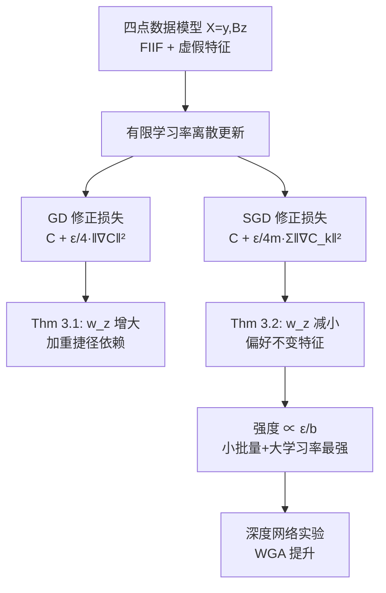

# Implicit Regularization of SGD Reduces Shortcut Learning

**会议**: ICLR 2026  
**代码**: [github.com/mirzanahal/sgd-implicit-regularization-shortcuts](https://github.com/mirzanahal/sgd-implicit-regularization-shortcuts)  
**领域**: optimization / 优化理论  
**关键词**: 隐式正则化, SGD, 捷径学习, 虚假相关, 批量大小, 学习率, 群组鲁棒性  

## 一句话总结
本文证明 SGD 的隐式正则化（强度正比于学习率÷批量大小 $\epsilon/b$）会系统性压制模型对虚假特征的依赖，从而在不损失精度的前提下提升群组鲁棒性——而全批量 GD 不仅没有这种好处，反而可能加重捷径依赖。

## 研究背景与动机
**领域现状**：机器学习的泛化目标是让模型在多种分布下都稳定工作，但模型常常依赖"捷径"（spurious/shortcut features）——在训练分布里与标签相关、却在不同环境间不稳定的特征。即便存在能完美预测标签的不变特征（Fully Informative Invariant Feature, FIIF），基于梯度的优化器仍倾向于选择同时利用虚假特征的解，因为虚假特征往往能增大间隔（margin）、进而降低指数损失/交叉熵损失，使含捷径的解对梯度优化更"有吸引力"。

**现有痛点**：过去研究主要分析数据侧因素——虚假相关强度 $\rho$、特征几何（缩放因子 $B$）——对捷径依赖的影响，而把梯度优化器当作收敛到 max-margin 解的"黑盒"。经验上人们观察到**更大的学习率能减少捷径依赖、提升鲁棒性**（Idrissi 2022, Puli 2023, Barsbey 2025），但现有理论框架无法解释这一现象，优化器超参数究竟如何调控捷径学习仍是开放问题。

**核心矛盾**：训练超参数（批量大小 $b$、学习率 $\epsilon$）对捷径依赖的作用机制不明——为什么大学习率反而更鲁棒？批量大小扮演什么角色？GD 和 SGD 是否表现一致？

**本文目标**：从优化器**隐式正则化**（implicit regularization）的视角，给出 GD 与 SGD 如何调控虚假特征依赖的严格刻画，并把理论延伸到深度网络的真实基准上。

**核心 idea**：**有限学习率下 GD/SGD 都不精确沿原损失 $C(w)$ 的梯度流走，而是近似沿一个"被修正的损失"——原损失加上一个隐式正则项。GD 的正则项惩罚全批量梯度范数 $\|\nabla C(w)\|^2$（偏好平坦极小），SGD 额外惩罚各 mini-batch 梯度范数的均值（压制小批量间的梯度方差）。正是这个 SGD 独有、强度正比于 $\epsilon/b$ 的方差惩罚项，把最优解推向更小的虚假特征权重 $w_z$、更大的不变特征权重 $w_y$。**

## 方法详解

### 整体框架
论文以经典的**四点数据模型**（Four-Point Model）为理论载体：数据 $X=[y,\,Bz]$ 落在二维空间，$X_1=y$ 是不变特征，$X_2=Bz$ 是虚假特征，$z$ 以概率 $1-\rho$ 等于 $y$、以 $\rho$ 翻转；$B>1$ 放大虚假特征影响。在线性分类器 + 指数损失下，分析 GD 与 SGD 各自的隐式正则化修正损失如何移动最优解 $w^*=[w_y^*,w_z^*]$，先在线性模型给出非渐近保证（Theorem 3.1 / 3.2），再用 MLP/ResNet/BERT 在 CMNIST、Waterbirds、CelebA、Multi-NLI 等基准上验证。

### 关键设计

**1. 隐式正则化的 GD/SGD 分解：从"黑盒优化器"到"被修正的损失"。** 论文的理论基石是把有限步长优化器重新解释为沿修正损失的梯度流。连续极限下梯度流由 ODE $\frac{d}{dt}\tilde w(t)=-\nabla C(\tilde w(t))$ 描述，而 GD 的离散更新 $w^{(t+1)}=w^{(t)}-\epsilon\nabla C(w^{(t)})$ 引入了偏离，等价于沿修正损失 $C_{\mathrm{GD}}(w)=C(w)+\frac{\epsilon}{4}\|\nabla C(w)\|^2$ 走——它把轨迹从大梯度范数区域推开，偏好平坦极小。SGD 的修正损失则是 $C_{\mathrm{SGD}}(w)=C(w)+\frac{\epsilon}{4m}\sum_{k=0}^{m-1}\|\nabla_b C_k(w)\|^2$，其中 $m=n/b$ 是 mini-batch 数、$\nabla_b C_k$ 是第 $k$ 个小批量上的梯度。关键差异在于 SGD 惩罚的是**各小批量梯度范数的均值**而非全批量梯度范数，这等价于压制小批量间的梯度方差，正是这一项让 SGD 与 GD 行为分道扬镳。

**2. 方差驱动项的符号分析：为什么 SGD 把解推离捷径。** 在四点模型里，SGD 修正损失可精确分解为 $C_{\mathrm{SGD}}(w)=C_{\mathrm{GD}}(w)+\frac{\epsilon\,\mathrm{Var}(\rho_{1:m})}{4}f(w;B,\hat\rho)$，其中 $\mathrm{Var}(\rho_{1:m})$ 是各小批量上 $\rho$ 估计的方差，第二项幅度按 $\epsilon/b$ 缩放。论文证明函数 $f(\cdot)$ 的极小会把最优解推向**更小的 $w_z$（少依赖虚假特征）和更大的 $w_y$（多依赖不变特征）**。直觉上，小批量注入的梯度方差恰好抵消了捷径解的吸引力：捷径解在不同子群（多数群/少数群）间梯度差异大，方差惩罚因此对它施加更重的代价，而群组鲁棒解在各小批量上梯度更一致，被赋予更小的惩罚。

**3. GD 与 SGD 的非渐近保证：方向相反的两个定理。** Theorem 3.1 证明在 $\rho\in(0,\frac13)$、$B$ 足够大、$n$ 足够大时，GD 解满足 $w^*_{z,\mathrm{GD}}-w^*_z\ge C\epsilon\sqrt{\rho(1-\rho)}+O(\epsilon^2)$，即 GD **加重**虚假特征依赖，且恶化程度随学习率 $\epsilon$ 线性增长。Theorem 3.2 则给出 SGD 的相反界 $w^*_{z,\mathrm{SGD}}-w^*_z\le C_1\epsilon\sqrt{\rho(1-\rho)}-\frac{C_2 B\epsilon}{b}\sqrt{\rho(1-\rho)}+O(\epsilon^2+B^{-1})$。当 $B$ 大或 $b$ 小时负项主导，使 $w^*_{z,\mathrm{SGD}}<w^*_z$，即 SGD 把解推向不变特征；效果同样随 $\epsilon$ 线性增强。两个定理共同揭示：**捷径抑制是 SGD 随机性的独有产物，而非梯度下降本身的性质**。

**4. 批量大小上界：捷径越强、需要的批量越小。** Corollary 3.3 把上述条件具体化为对 $b$ 的显式上界 $b\le\tilde\Theta\!\left(\frac{B}{\rho(1-\rho)}\right)$——只有批量小于该阈值，SGD 才被保证降低虚假特征依赖。这给出可操作的直觉：虚假相关越强（$\rho$ 越小或 $B$ 越大），就需要越小的批量来确保 SGD 有效压制捷径；大批量则退化回 GD 区间，好处消失。论文还在 $n,m\to\infty$ 的一般情形下证明，只要群组鲁棒解 $w_{\mathrm{good}}$ 在每个小批量上"多数群-少数群"梯度差异都一致小于捷径解 $w_{\mathrm{bad}}$，SGD 修正损失就会偏好前者，而全批量 GD 缺乏这一方差依赖效应、反而放大对 $w_{\mathrm{bad}}$ 的偏好。

## 实验关键数据

### 主实验表格（不同批量下的最佳 WGA，$\rho=5\%$，每个批量取六个学习率中最高 WGA）

| 批量 $b$ | CMNIST | Domino | Waterbirds | CelebA | CIFAR10 |
|---|---|---|---|---|---|
| 8 | 67.5 | **59.3** | **79.7** | 46.0 | **80.1** |
| 16 | **68.4** | 56.3 | 77.7 | **51.9** | 78.9 |
| 32 | 68.0 | 49.4 | 73.2 | 45.3 | 79.6 |
| 64 | 67.5 | 51.9 | 67.9 | 40.5 | 78.8 |
| 128 | 66.0 | 50.0 | 70.4 | 44.3 | 76.3 |
| 256 | 64.7 | 43.4 | 68.2 | 45.0 | 77.9 |
| **Δ(最大-最小)** | +3.7 | +15.9 | +11.5 | +11.4 | +3.8 |

最高 WGA 一致出现在小批量（8 或 16），最低值通常在 64 及以上——小批量系统性抬高群组鲁棒性的"天花板"。

### 消融实验表格（语言数据集 Transformer，固定学习率）

| 批量 $b$ | Multi-NLI WGA | Multi-NLI ACC | CivilComments WGA | CivilComments ACC |
|---|---|---|---|---|
| 8 | **76.75** | 82.18 | **60.72** | 91.76 |
| 16 | 76.58 | 82.40 | 59.73 | 92.12 |
| 32 | 76.50 | 81.74 | 54.89 | 92.34 |
| 64 | 75.80 | 81.93 | 53.40 | 92.30 |
| 128 | 75.78 | 80.96 | 53.70 | 92.02 |
| 256 | 75.17 | 79.34 | — | — |
| **Δ** | +1.58 | — | +7.32 | — |

BERT 上同样呈现"批量越小 WGA 越高"，证明效应不限于卷积网络。

### 关键发现
- **学习率与鲁棒性呈非单调关系**：当 ACC 达到近最优后，WGA 随学习率继续上升直到一个最优点，超过后训练失稳、ACC 与 WGA 双双下降（Figure 2），且偏置数据集上的提升比平衡数据集更显著。
- **WGA 比 ACC 对超参更敏感**：一旦学习率进入保证 in-distribution 泛化的区间，WGA 随批量/学习率的波动远大于 ACC——说明鲁棒性提升来自压制捷径的独立机制，而非整体泛化的副产品。
- **隐式正则项与 WGA 负相关**：实测的隐式正则化估计量 $\hat R$ 与 WGA 在五个数据集上均呈负 Pearson 相关（Figure 4），直接印证"收敛到隐式正则更优的极小 ⇒ 更鲁棒"。

## 亮点与洞察
- **把"大学习率更鲁棒"这一悖论说清楚了**：长期被当作经验玄学的现象，被归因到 SGD 隐式正则化的方差惩罚项，并给出 $\epsilon/b$ 这个干净的强度刻度。
- **GD 与 SGD 的定性分野有理论支撑**：两个方向相反的非渐近界（Thm 3.1 vs 3.2）说明捷径抑制是随机性独有的，澄清了"是优化器还是随机性在起作用"的争论。
- **可操作的实践启示**：小批量 + 调好的较大学习率本身就是一种"免费"的捷径缓解，能减少对显式去偏方法（DFR、JTT 等）和穷举超参搜索的依赖。

## 局限与展望
- 理论严格性集中在四点模型 + 线性分类器 + 指数损失的 stylized 设定，深度网络/交叉熵下只有"温和假设"的一般性论证，缺乏同等强度的非渐近保证。
- 批量上界 $b\le\tilde\Theta(B/\rho(1-\rho))$ 依赖对 $B$、$\rho$ 的认知，而真实数据中虚假相关强度难以直接测量，落地时仍需调参。
- 实验聚焦"近最优 in-distribution 泛化"区间，对欠训练/发散区间不下结论；小批量带来的训练时间开销与鲁棒性收益之间的权衡未系统量化。
- 仅考察单一虚假特征场景，多个相互纠缠的捷径特征下 SGD 隐式正则化是否仍单调有效，留待后续。

## 相关工作与启发
- **隐式正则化基础**：Barrett & Dherin (2021) 的 GD 修正损失、Smith et al. (2021) 的 SGD mini-batch 梯度方差刻画是本文的直接出发点，本文把它们接到捷径学习上。
- **四点模型与捷径理论**：Puli et al. (2023)、Nagarajan et al. (2021)、Xue et al. (2024) 用该模型分析数据侧因素 $B,\rho$，本文把视角切换到优化超参 $b,\epsilon$。
- **显式去偏方法**：Kirichenko et al. (2023, DFR)、Qiu et al. (2023) 等需要重训练或穷举搜索，本文提示 SGD 的天然正则化可作为更轻量的替代或互补。
- **启发**：把"优化器超参 → 隐式正则项 → 解的归纳偏置"这条链路显式写出，是分析其他归纳偏置现象（如 grokking、平坦极小泛化）的可复用范式。

## 评分
- **新颖性**: ⭐⭐⭐⭐⭐ 首次把"大学习率/小批量更鲁棒"严格归因到 SGD 隐式正则化的方差惩罚项，并用方向相反的两个非渐近定理把 GD/SGD 分野讲透，视角新颖且解释力强。
- **实验充分度**: ⭐⭐⭐⭐ 覆盖 CMNIST/Domino/Waterbirds/CelebA/CIFAR10 + 语言数据集，跨 MLP/ResNet/BERT，并用 $\hat R$-WGA 相关直接验证机制；但缺少与 DFR/JTT 等显式去偏方法的同台对比。
- **写作质量**: ⭐⭐⭐⭐ 理论推导清晰、图示（隐式正则化等高线、梯度流轨迹）直观，定理-推论-实验逻辑闭环；部分定理常数 $\Theta(1)$ 的依赖关系略抽象。
- **价值**: ⭐⭐⭐⭐⭐ 既深化了对 SGD 归纳偏置的理论理解，又给出"小批量+调大学习率即可缓解捷径"的低成本实践方案，对鲁棒性研究与日常训练都有指导意义。

<!-- RELATED:START -->

## 相关论文

- [\[NeurIPS 2025\] The Rich and the Simple: On the Implicit Bias of Adam and SGD](../../NeurIPS2025/optimization/the_rich_and_the_simple_on_the_implicit_bias_of_adam_and_sgd.md)
- [\[ICLR 2026\] Birch SGD: A Tree Graph Framework for Local and Asynchronous SGD Methods](birch_sgd_a_tree_graph_framework_for_local_and_asynchronous_sgd_methods.md)
- [\[ICLR 2026\] Hyperbolic Aware Minimization: Implicit Bias for Sparsity](hyperbolic_aware_minimization_implicit_bias_for_sparsity.md)
- [\[ICLR 2026\] SGD with Adaptive Preconditioning: Unified Analysis and Momentum Acceleration](sgd_with_adaptive_preconditioning_unified_analysis_and_momentum_acceleration.md)
- [\[ICLR 2026\] High-Probability Bounds for the Last Iterate of Clipped SGD](high-probability_bounds_for_the_last_iterate_of_clipped_sgd.md)

<!-- RELATED:END -->
