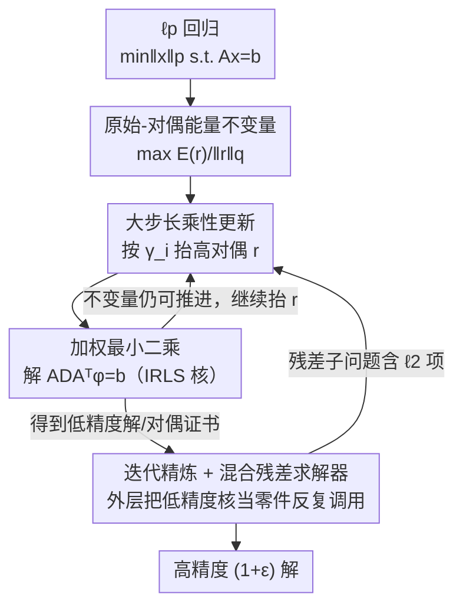

# Improved ℓp Regression via Iteratively Reweighted Least Squares

**会议**: ICLR 2026  
**OpenReview**: [https://openreview.net/forum?id=l5zZ2EEijD](https://openreview.net/forum?id=l5zZ2EEijD)  
**代码**: 复用 https://github.com/fast-algos/pIRLS （实验基于此实现搭建）  
**领域**: 优化理论 / 凸优化  
**关键词**: ℓp 回归, 迭代重加权最小二乘 (IRLS), 原始-对偶, 迭代精炼, 线性系统求解

## 一句话总结
这篇论文为 $p\in(1,\infty)$ 的 $\ell_p$ 回归设计了一套全新的、基于原始-对偶视角的 IRLS 算法：它用一个轻量的乘性更新规则就把迭代复杂度做到了 $O\!\big(p^2 n^{\frac{p-2}{3p-2}}\log\frac{n}{\epsilon}\big)$，**首次让一个实用的 IRLS 方法同时达到了此前只有复杂理论算法才有的最优迭代界**，实验上比经典的 p-IRLS 和 CVX 都明显更快。

## 研究背景与动机

**领域现状**：$\ell_p$ 回归问题——在约束 $Ax=b$ 下最小化 $\|x\|_p$——是机器学习里的基础问题，远不止经典的 $p=2$ 最小二乘。它出现在半监督学习的 $\ell_p$-Laplacian 正则、图聚类、鲁棒回归等大量场景。求解这类凸问题的主流迭代算法，每一步的计算量都由"解一个线性系统"主导，因此**衡量算法快慢的核心指标就是它需要调用多少次线性系统求解器**。

**现有痛点**：这个方向一直存在一条"理论 vs 实践"的鸿沟。一边是 Adil 等人（SODA 2019 / J. ACM 2024）给出的算法，它有目前最好的理论迭代界 $O\!\big(p^2 n^{\frac{p-2}{3p-2}}\log\frac{n}{\epsilon}\big)$，但依赖复杂的子程序、塞进了很多只为证明服务的超参数，实际跑起来必须手动调参，**没有可用的实现**。另一边是 Adil 等人（NeurIPS 2019）的 p-IRLS，它工程上简洁、比 CVX 这类通用求解器快得多，但为了换取效率牺牲了理论保证，迭代界退化成更差的 $O\!\big(p^3 n^{\frac{p-2}{2p-2}}\log\frac{n}{\epsilon}\big)$。

**核心矛盾**：既要 IRLS 那种"每步只解一个加权最小二乘、实现轻量"的实用性，又要拿到最优的理论迭代界——这两者在过去的技术路线里似乎不可兼得。根因在于：以往的低精度算法普遍依赖对 $\|x\|_p^p$ 做 Taylor 展开来推导和约束更新量，这条路线本身就限制了步长能开多大。

**本文目标**：给出一个对所有 $p\in(1,\infty)$ 都适用的 IRLS 框架，让它**既保持 IRLS 的轻量实现，又匹配 SOTA 理论迭代界**。

**切入角度**：作者不再走 Taylor 展开，而是从问题的**对偶形式**入手。把 $\min_{x:Ax=b}\|x\|_{2p}^2$ 写成 $\max_{r\ge 0} \frac{E(r)}{\|r\|_q}$，其中能量函数 $E(r)=\min_{x:Ax=b}\langle r, x^2\rangle$、$\ell_q$ 是 $\ell_{p/2}$ 的对偶范数。更新规则不是凭空设计的，而是**从一个为对偶目标维护的"不变量"自然推导出来**的。

**核心 idea**：用"原始-对偶 + 能量不变量"代替"Taylor 展开"，让对偶变量每步能按大的多项式因子放大（即开很大的步长），从而在保持每步只解一个加权最小二乘的同时大幅减少迭代次数。

## 方法详解

### 整体框架

算法围绕一个反复出现的核心动作：**每次迭代都解一个加权最小二乘 $x=\arg\min_{x:Ax=b}\langle r, x^2\rangle$**，等价于解线性系统 $ADA^\top\phi=b$（$D$ 为非负对角阵）——这正是 IRLS 的精髓。论文在这个核心上搭了两套求解器：

- **低精度求解器（poly $1/\epsilon$，定理 1.1）**：由外层二分搜索（Algorithm 1）+ 内层原始-对偶子求解器（Algorithm 2）组成。它直接求解尺度无关（scale-free）的纯 $\ell_p$ 目标。
- **高精度求解器（log $1/\epsilon$，定理 1.2）**：套用迭代精炼框架（Algorithm 3）作为外壳，每一步把问题归约为一个**混合 $\ell_p+\ell_2$ 残差子问题**，再用一个改造过的 IRLS 残差求解器（Algorithm 4）解它——而这个残差求解器的内核，正是复用了低精度求解器里的原始-对偶思路。

也就是说，低精度的原始-对偶 IRLS 是地基，高精度算法把它当作"零件"嵌进迭代精炼里，从而把误差依赖从 poly $1/\epsilon$ 压到 log $1/\epsilon$。下图给出实验真正评测的高精度管线，自上而下对应下面三个关键设计：

### 关键设计

**1. 原始-对偶能量框架与不变量：把"该怎么更新"从一个待维护的对偶不变量里推出来**

以往低精度算法靠 Taylor 展开 $\|x\|_p^p$ 推更新，步长受限。本文换成对偶视角：由对偶性 $\min_{x:Ax=b}\|x\|_{2p}^2=\max_{r\ge0}\frac{E(r)}{\|r\|_q}$，其中能量 $E(r)=\min_{x:Ax=b}\langle r,x^2\rangle$ 随 $r$ 增大而单调增大。算法给定一个对最优值 $\|x^*\|_{2p}$ 的猜测 $M$，从均匀初值 $r^{(0)}=\tfrac{1}{n^{1/q}}$ 出发，**只做一件事：在不破坏下面这个不变量的前提下，尽量把 $r$ 的坐标往上抬**：

$$E(r^{(t+1)})-E(r^{(t)})\ \ge\ M^2\big(\|r^{(t+1)}\|_q-\|r^{(t)}\|_q\big).$$

这个不变量的妙处在于它**可以沿坐标分解**（论文用了两个关于目标增量与对偶范数增量的下界来拆开），于是"全局维护不变量"被化简为"逐坐标满足一个局部条件"。一旦再也抬不动 $r$，就说明已经逼出了对应的小范数原始解；反之若 $r$ 的 $\|r\|_q$ 涨得足够大，不变量的伸缩（telescoping）性质保证 $\frac{E(r)}{\|r\|_q}\ge\big(\frac{M}{1+\epsilon}\big)^2$，得到一份"不可行性证书"，从而知道猜测 $M$ 可以调大。外层 Algorithm 1 就在区间 $\big[\|x^{(0)}\|_2/n^{\frac12-\frac1{2p}},\ \|x^{(0)}\|_2\big]$ 上对 $M$ 做二分，只需 $O(\log\log n+\log\frac1\epsilon)$ 次子问题调用。整套更新规则因此不是"凑"出来的，而是从这个对偶不变量自然长出来的。

**2. 大步长乘性更新：脱离镜像下降的平滑约束，让对偶变量每步按多项式因子跳**

确定了"维护不变量"这个目标后，怎么抬 $r$ 才最快？作者给每个坐标定义一个"性价比"量

$$\gamma_i^{(t)}=\frac{\|r^{(t)}\|_q^{\,q-1}}{\big(r_i^{(t)}\big)^{q-1}}\cdot\frac{\big(x_i^{(t)}\big)^2}{M^2},$$

并设一个阈值：若 $\gamma_i^{(t)}$ 超过阈值，就把该坐标乘性放大 $r_i^{(t+1)}=r_i^{(t)}\big(\gamma_i^{(t)}\big)^{1/q}$，否则保持不变。关键区别在于：标准的乘性权重（MWU）/镜像下降需要用 mirror map 或对 $\ell_p$ 范数做正则把它"磨光滑"，这会把步长卡死在很小的范围；而本文**不引入任何 mirror map、不做平滑**，因此允许对偶解的坐标在一步里按很大的多项式因子变化。直观地说，别人是小步慢走、本文是大步快跳，这正是迭代次数从 $p^3$ 量级降到 $p^2$ 量级的来源。子求解器（Algorithm 2）据此分三种出口：抬不动了就返回当前原始解（Case 1）、对那些只小幅增长的迭代取原始解的均匀平均作为近似可行解（Case 2）、或返回对偶不可行性证书（Case 3）。收敛性分析把迭代拆成"大缩放" $T_{\text{hi}}$ 与"小缩放" $T_{\text{lo}}$ 两类分别 bound，最终得到定理 1.1 的迭代界。

**3. 迭代精炼 + 混合 $\ell_p+\ell_2$ 残差求解器：把低精度内核嫁接进迭代精炼，换来 log $1/\epsilon$ 的高精度**

低精度求解器对 $\epsilon$ 是 poly 依赖，要做到高精度（log $1/\epsilon$）还差一层。作者沿用 Adil 等人的**迭代精炼**观察：只要有一个能对"混合 $\ell_p$ 与 $\ell_2$ 目标"给出常数因子近似的弱求解器，就能把乘性误差从常数 boost 到 $1+\epsilon$，且只需 $\tilde O_p(\log\frac1\epsilon)$ 次调用。于是整个难点被归约成实现这个弱求解器。Algorithm 3 维护一个对函数值间隙的上界 $M^{(t)}$（满足 $\|x^{(t)}\|_p^p-\|x^*\|_p^p\le 16p\,M^{(t)}$）：每步调残差求解器估计更新 $x\leftarrow x-\Delta$ 能带来的进展，进展太小就把 $M^{(t)}$ 减半收紧上界，进展足够大就执行更新、把间隙再压掉一个 $1-\Omega(1/p)$ 的因子。

真正的技术障碍在残差子问题 $\min_{x:Ax=b}\|x^2\|_p+\langle\theta,x^2\rangle$ 上：多出来的 $\ell_2$ 项 $\langle\theta,x^2\rangle$ 让目标**不再尺度无关**，低精度求解器没法直接拿来用。作者的处理是——注意到这个 $\ell_2$ 项并不影响目标增量的那个坐标分解下界（即设计 1 里用的不等式仍成立），因此只要额外保证 $\|r\|_q\le1$，再配合**对偶解的合适初始化**和**对步长的精细调整**，Algorithm 4 就能在这个非尺度无关目标上复用 Algorithm 2 的同套机制、只需常数近似即可。最终高精度算法做 $O(p^2\log n\log\frac{n}{\epsilon})$ 个子问题、每个子问题 $O\!\big(n^{\frac{p-2}{3p-2}}\big)$ 次线性求解，匹配 SOTA。作者也指出，这个混合 $\ell_p+\ell_2$ 求解器本身在很多正则化机器学习问题里有独立价值。

### 损失函数 / 训练策略
本文是优化算法而非学习模型，没有训练损失。其"目标函数"即 $\ell_p$ 回归本身 $\min_{x:Ax=b}\|x\|_p$；高精度版实际求解 $\min_{x:Ax=b}\|x\|_p^p$ 到 $(1+\epsilon)$ 乘性误差。所有重活都压在重复求解结构化线性系统 $A^\top D A$（$D$ 非负对角）上，可借助现代数值求解器高效完成。

## 实验关键数据

实验只评测高精度的 Algorithm 3，统一取 $\epsilon=10^{-10}$，在 MATLAB 2024a / MacBook Pro M2 上运行，对比对象是 p-IRLS（Adil 2019b）与 CVX 的 SDPT3、SeDuMi 求解器。指标是**迭代次数（即线性系统求解次数）**与**运行时间**。

### 主实验（真实数据集，$p=8$, $\epsilon=10^{-10}$）

六个 UCI 回归数据集，CVX 因耗时过长被排除，仅与 p-IRLS 对比：

| 数据集 (规模) | p-IRLS 迭代 | 本文迭代 | p-IRLS 时间(s) | 本文时间(s) |
|--------|------|------|------|------|
| CT slices (48150×385) | 48 | **36** | 14.3 | **9.2** |
| KEGG Metabolic (57248×27) | 50 | **42** | 2.5 | **1.7** |
| Power Consumption (1844352×11) | 45 | **36** | 32 | **15.7** |
| Buzz Social Media (524925×77) | 50 | **42** | 28 | **18.1** |
| Protein Property (41157×9) | 44 | **36** | 1.6 | **1.1** |
| Song Year (463811×90) | 45 | **36** | 22.5 | **13.3** |

本文在迭代次数和时间上**全面优于** p-IRLS，平均提速 1–2.6 倍；其中 Power Consumption 这种超大规模实例提速约 2 倍。

### 合成数据与缩放分析
在随机矩阵与随机图两类合成实例（$\min\|Ax-b\|_p^p$）上同样对比 p-IRLS 与 CVX：

| 配置 | 现象 | 说明 |
|------|---------|------|
| CVX (SDPT3/SeDuMi) | 迭代少但时间慢得多 | 通用内点法虽迭代少，但每步昂贵，在所有实例上都远慢于两种 IRLS |
| 改变规模 $n$ | 本文与 p-IRLS 差距随 $n$ 增大而拉大 | 矩阵/图越大，本文优势越明显 |
| 改变范数 $p$ | 差距随 $p$ 增大而拉大 | 与理论上 $p^2$ vs $p^3$ 的依赖一致 |
| 正确性 | 误差均在 $\epsilon$ 容限内 | 以 CVX 解的目标值为基准核验 |

### 关键发现
- **复杂度对 $p$ 的依赖是关键差异**：本文迭代界 $\propto p^2$，p-IRLS $\propto p^3$，所以 $p$ 越大本文越占优，实验上的"差距随 $p$ 拉大"正是这一点的体现。
- **每步成本相同、靠减少步数取胜**：两种算法每步都只解一个线性系统，本文的提速完全来自更少的迭代次数（更大的步长），而非更便宜的单步。
- **CVX 不可扩展**：在大实例上 CVX 要么慢到被排除、要么跑不出来，凸显 IRLS 路线在规模上的优势。

## 亮点与洞察
- **"从不变量倒推更新规则"是很漂亮的方法论**：不去硬凑一个更新公式，而是先确定要维护的对偶能量不变量，让更新规则自然涌现——这让算法既简洁又可证。
- **"不平滑"反而更快**：和镜像下降/MWU 必须把 $\ell_p$ 磨光滑的直觉相反，本文故意不引入 mirror map，从而解放步长按多项式因子跳，这是它压低迭代数的核心洞察，值得迁移到其他需要大步长的乘性更新场景。
- **低精度内核作为可复用零件**：把低精度原始-对偶求解器当成"弱求解器"嵌进迭代精炼框架，是"用一个简单核拼出强算法"的范例；附带产出的混合 $\ell_p+\ell_2$ 求解器在正则化回归里可独立使用。
- **弥合理论与实践**：第一次让一个工程上轻量的 IRLS 同时拿到 SOTA 理论界，关闭了 Adil 系列工作里"快的不优、优的不实用"的缺口。

## 局限与展望
- **理论与实测有缝隙**：误差传播等理论界在最坏情况下较松，作者也承认某些放大因子"实际中并未观察到"，说明分析仍偏保守。
- **实验只评测高精度版**：低精度 Algorithm 2 的实际表现没有单独实测，其 poly $1/\epsilon$ 依赖在中等精度任务上的竞争力未知。
- **依赖高效线性求解器**：整套方法的实用性建立在"$A^\top D A$ 型结构化线性系统能被快速求解"之上；对病态或无良好结构的 $A$，单步成本可能成为瓶颈。
- **超参与 $p\to\infty$ 边界**：阈值、初始化等仍含若干常数选择；$p=\infty$ 的退化情形单列在 Remark 中，未在主实验充分展开。

## 相关工作与启发
- **vs Adil 等（NeurIPS 2019, p-IRLS）**：双方都是 IRLS、每步解一个加权最小二乘，但 p-IRLS 用 Taylor 展开推更新、步长受限，迭代界 $O(p^3 n^{\frac{p-2}{2p-2}}\log\frac n\epsilon)$；本文用原始-对偶不变量开大步长，做到 $O(p^2 n^{\frac{p-2}{3p-2}}\log\frac n\epsilon)$，理论更优、实测更快。
- **vs Adil 等（SODA 2019 / J. ACM 2024）**：那条线给出了同样的最优理论界，但依赖复杂子程序与大量理论性超参，没有可用实现；本文用一个轻量迭代方案达到同界，把"最优界"真正落到了能跑的代码上。
- **vs 内点法 / CVX**：通用内点法对任意 $p\notin\{1,2,\infty\}$ 需 $\tilde O(\sqrt n)$ 迭代且单步昂贵，规模一大就失效；本文的 IRLS 在大实例上快几个数量级。
- **vs 镜像下降 / MWU**：本文借鉴了"按性价比抬坐标"的乘性更新精神（类似 width-independent MWU），但刻意不用 mirror map、不正则平滑，从而获得远大于标准镜像下降的步长。

## 评分
- 新颖性: ⭐⭐⭐⭐⭐ 用原始-对偶能量不变量取代 Taylor 展开，从根上换掉了 IRLS 的推导范式
- 实验充分度: ⭐⭐⭐⭐ 合成+真实数据、变 $n$/变 $p$ 都覆盖，但只评测了高精度版、未实测低精度算法
- 写作质量: ⭐⭐⭐⭐ 动机与算法直觉讲得清楚，定理与不变量层层递进；细节密度高，需要一定优化背景
- 价值: ⭐⭐⭐⭐⭐ 真正弥合了 $\ell_p$ 回归"理论最优 vs 工程实用"的长期缺口，附带的混合 $\ell_p+\ell_2$ 求解器有独立用途

<!-- RELATED:START -->

## 相关论文

- [\[NeurIPS 2025\] Least Squares Variational Inference](../../NeurIPS2025/optimization/least_squares_variational_inference.md)
- [\[ICLR 2026\] Neural Sum-of-Squares: Certifying the Nonnegativity of Polynomials with Transformers](neural_sum-of-squares_certifying_the_nonnegativity_of_polynomials_with_transform.md)
- [\[ICLR 2026\] Hinge Regression Tree: A Newton Method for Oblique Regression Tree Splitting](hinge_regression_tree_a_newton_method_for_oblique_regression_tree_splitting.md)
- [\[ICLR 2026\] Non-Asymptotic Analysis of Efficiency in Conformalized Regression](non-asymptotic_analysis_of_efficiency_in_conformalized_regression.md)
- [\[ICLR 2026\] Distributionally Robust Linear Regression with Block Lewis Weights](distributionally_robust_linear_regression_with_block_lewis_weights.md)

<!-- RELATED:END -->
