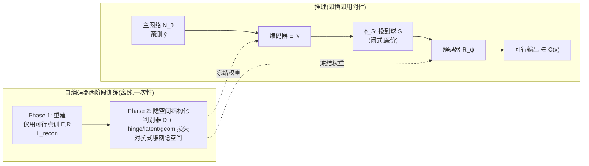

# Improving Feasibility via Fast Autoencoder-Based Projections

**会议**: ICLR 2026  
**OpenReview**: [https://openreview.net/forum?id=dVlkUtsyg7](https://openreview.net/forum?id=dVlkUtsyg7)  
**代码**: [https://github.com/MOSSLab-MIT/Fast-Autoencoder-Based-Projections](https://github.com/MOSSLab-MIT/Fast-Autoencoder-Based-Projections)  
**领域**: optimization  
**关键词**: 约束优化, 可行性投影, 摊销优化, 自编码器, 对抗训练, 安全强化学习  

## 一句话总结
训练一个自编码器把复杂(非凸)可行集"拉直"成一个简单的凸隐空间(球),从而用一次前向解码就把神经网络的不可行输出快速校正回可行域,在亚毫秒级时间内拿到接近 100% 可行率,作为传统投影/求解器的低延迟替代品。

## 研究背景与动机
**领域现状**：机器人、能源系统、工业自动化等学习与控制系统的输出常常必须满足难以满足的(经常是非凸的)操作约束。围绕"如何在学习系统里强制约束"已有三类主流做法：惩罚法(把约束违反加进目标做正则)、可微投影/校正法(把精确求解器作为网络层嵌入)、以及事后修复法(post-hoc repair,用传统求解器把不可行解拉回)。

**现有痛点**：这三类各有硬伤。惩罚法只是"鼓励"可行、不保证可行,实践中可能给出严重违反约束的解;可微投影虽有可行性保证,但要么计算昂贵、要么高度专用于特定约束类(如只能处理凸/球同胚约束);事后修复同样要么慢要么专用,而且训练-测试不匹配会进一步拖累端到端性能。一句话:**没有一个方法能在"通用约束类 + 低延迟 + 不毁掉端到端性能"三者上同时过关。**

**核心矛盾**：精确可行性(formal guarantee)和推理速度之间是对立的——要严格可行就得跑昂贵的求解器/迭代过程;要快就只能放弃保证。但很多真实场景(低延迟控制、或"接近可行即可保证下游性能"的设定)其实并不需要严格可行,而是被昂贵的精确投影拖住了。

**本文目标**：在"近可行就够用、低延迟更值钱"的场景里,提供一个**数据驱动的摊销(amortized)校正映射**,能处理一般(含非凸、不连通)的约束集,且推理极快。

**核心 idea**：**用自编码器当"近似投影器"**。关键观察是:虽然原可行集 $C(x)$ 直接投影很贵,但我们可以学一个变换把它和某个"特别好投影的简单集合"(如球)对应起来。于是训练一个自编码器,把可行集编码进一个**结构化的凸隐空间**;校正时只需把神经网络输出编码进隐空间、在隐空间里做一次廉价精确投影(投到球上)、再解码回原空间——整条路径都是一次性前向运算,因此飞快。这个自编码器是**即插即用的"附件"**,可挂到任意标准神经网络后端到端训练。

## 方法详解

### 整体框架
方法叫 **FAB (Fast Autoencoder-Based projections)**。它考虑反复求解参数化优化问题 $y^\star(x) \in \arg\min_{y\in C(x)} f(y;x)$(RL 里 $x$ 是状态、$y$ 是动作),用网络近似 $x\mapsto y^\star(x)$。核心结构把网络写成 $\hat{y}_\theta := \phi_x \circ N_\theta$:前面是普通前馈网络 $N_\theta$ 给出预测,后面接一个可微的可行性校正过程 $\phi_x$。FAB 把 $\phi_x$ 实例化为 $\phi_x := R_\psi \circ \phi_S \circ E_\gamma$——编码器 $E_\gamma$ 把(预测,参数)映进隐空间 $Z$,$\phi_S$ 把隐点投到一个简单集合 $S$(取 0.5 半径闭球,用闭式投影),解码器 $R_\psi$ 再解回原空间。难点在于:怎么训练 $(\gamma,\psi)$ 才能让"投到 $S$ 里的隐点解码出来真落在 $C(x)$ 内"。FAB 用**两阶段训练**来雕刻隐空间,使得"隐点落在 $S$ 内 $\Leftrightarrow$ 解码后落在可行集内"。

### 关键设计

**1. 两阶段自编码器训练：先学"重建可行集"再学"结构化隐空间"。** FAB 把训练拆成职责清晰的两步,而不是一锅炖。Phase 1 只喂可行点 $T_{feas}$,用标准 L2 重建损失 $L_{recon}(y,x) = \|y - R_\psi(E_\gamma(y,x))\|_2^2$,目的是先让自编码器忠实地"记住"可行集长什么样、保证解码保真度。Phase 2 才在这个基础上去雕刻隐空间的几何结构——如果一上来就同时优化所有目标,重建保真和隐空间约束会互相打架;先把重建打好底,再去结构化,训练更稳。

**2. 对抗式隐空间结构化：判别器划"可行/不可行"的决策边界。** Phase 2 借鉴了 GAN 的思路但并非 minimax 对抗:引入一个判别器 $D_\xi: I\to[0,1]$ 估计"输入是否可行",用可行/不可行标注数据集 $T_{disc}$ 以负对数似然 $L_{disc} = -(c\log D_\xi + (1-c)\log(1-D_\xi))$ 训练它。自编码器和判别器用**各自不同的损失**交替训练,而不是共享一个 minimax 目标。判别器的作用是给自编码器提供"哪边算可行"的监督信号,逼迫解码器学到更鲁棒的可行/不可行边界。消融显示去掉判别器($\text{No } D_\xi$)后 Two Moons 上距离最小化任务的可行率从 88.3% 暴跌到 13.6%,说明这个对抗监督是隐空间能不能"对齐"可行集的关键。

**3. 三个损失协同雕刻隐空间几何：hinge 定位、latent 拉可行、geom 防塌缩。** Phase 2 的自编码器复合损失 $L_{struc}$ 由四项加权组成(含 Phase 1 的 $L_{recon}$),其中三项专门塑形:**hinge 损失**把可行点压进球内、把不可行点推到球外,对 $S=\{z:\|z\|_2\le r\}$ 写成 $L_{hinge} = c\,\mathrm{ReLU}(\|E_\gamma(y,x)\|_2 - r) + (1-c)\,\mathrm{ReLU}(r - \|E_\gamma(y,x)\|_2)$——这是"隐点在球内 $\Leftrightarrow$ 可行"这个等价关系的直接抓手,消融里去掉 hinge 后可行率从 96.8% 崩到 28.4%,是全套损失里最致命的一项。**latent 损失** $L_{latent}(z) = -\log D_\xi(R_\psi(z))$ 从球内采样 $z\sim S$,借判别器监督逼"从球里解码出来的点要可行"。**几何正则项** $L_{geom} = \mathrm{Var}_{z\sim\hat{S}}[\log\det(J_z J_z^\top + \varepsilon I_k)]$($J_z=\nabla_z R_\psi(z)$ 是解码器雅可比)鼓励解码器对可行集做**均匀覆盖**——通过约束局部拉伸/收缩的方差,防止解码器把整个球塌缩到可行集的某一小块、保证可行集被均匀铺满。

**4. 多解码器混合：用专家加权应对不连通可行集。** 作为变体,FAB 可以训练 $\rho$ 个解码器 $R^{(1)}_{\psi_1},\dots,R^{(\rho)}_{\psi_\rho}$ 加一个加权网络 $M_\omega: Z\to\mathbb{R}^\rho$,对隐点算混合权重 $\alpha(z)=\mathrm{softmax}(M_\omega(z))$,最终解码为凸组合 $R_\psi(z)=\sum_i \alpha_i(z)R^{(i)}_{\psi_i}$。直觉是不同解码器可以"专精"隐空间的不同区域,从而更好地拟合像 Two Moons 这种**不连通(disjoint)**的可行集——单解码器要把一个连通的球映到两团分离的可行区会很别扭,多解码器则能各管一团。实验里 2/3 解码器版本在所有约束集上把可行率干到了 100%。

## 实验关键数据

### 主实验表格(约束优化, Two Moons 不连通约束集)
5 个 seed × 测试 1500 问题/seed,RTX 4090。↑Feas 可行率,↓Time 推理毫秒,↓Gap 最优性差距。

| 方法 | Quadratic Feas% / Time(ms) | Linear Feas% / Time | Dist.Min. Feas% / Time |
|------|------|------|------|
| Projected Gradient | 80.5 / 79.07 | 76.3 / 48.23 | 79.2 / 69.79 |
| Penalty (经典) | 20.4 / 78.39 | 10.4 / 61.58 | 14.6 / 38.67 |
| Interior Point | 78.3 / 82.80 | 77.3 / 46.37 | 79.9 / 42.00 |
| Penalty NN | 91.1 / 0.20 | 80.0 / 0.14 | 40.7 / 0.24 |
| FSNet | 98.7 / 4.42 | 98.3 / 3.40 | 99.3 / 4.03 |
| Homeomorphic Proj. | 73.9 / 247 | 76.1 / 240 | 76.1 / 243 |
| **FAB** | **96.8 / 0.55** | **83.5 / 0.43** | **88.3 / 0.41** |
| **FAB: 2 Decoders** | **100.0 / 0.59** | **100.0 / 0.55** | **100.0 / 0.50** |
| **FAB: 3 Decoders** | **100.0 / 0.80** | **100.0 / 0.62** | **100.0 / 0.60** |

亮点:FAB 推理 0.4–0.8 ms,比同样有高可行率的 Homeomorphic Projection(需迭代二分,~240 ms)快**2–3 个数量级**,比 FSNet(迭代求解器,~4 ms)快约一个数量级,且多解码器版在不连通的 Two Moons 上拿到 100% 可行率。

### 消融实验表格(Two Moons)

| 消融设置 | Quadratic Feas% | Linear Feas% | Dist.Min. Feas% |
|------|------|------|------|
| FAB(完整) | 96.8 | 83.5 | 88.3 |
| Phase 1 Only(无 Phase 2) | 82.5 | 69.9 | 64.1 |
| No Hinge Loss | 28.4 | 18.8 | 28.1 |
| No Discriminator $D_\xi$ | 75.1 | 54.4 | 13.6 |

去掉 hinge 损失最致命(可行率全线崩到 ~20-28%);去掉判别器在距离最小化任务上塌到 13.6%;只做 Phase 1 也明显劣于完整版——三项印证了两阶段 + hinge + 对抗判别器各自的必要性。

### 安全 RL(Safety Gymnasium, 50 seeds)
SafetyPointGoal2-v0 环境,Cost 为约束违反次数(越低越安全):

| 算法 | Reward Mean↑ | Cost Mean↓ | Cost Std↓ |
|------|------|------|------|
| PPO | 13.26 | 167.46 | 87.06 |
| TRPO | 15.58 | 164.14 | 88.43 |
| PPO-LAG | 2.24 | 54.10 | 64.50 |
| TRPO-LAG | 2.37 | 89.04 | 187.67 |
| **PPO-FAB** | **-1.12** | **24.32** | **37.84** |

### 关键发现
- **速度是核心卖点**：FAB 在亚毫秒拿到高可行率,比精确可行方法快 1–2 个数量级,验证了"用一次前向解码替代迭代投影"的设想。
- **安全 RL 上违约成本最低、方差最小**：PPO-FAB 的 Cost(24.32)显著低于 PPO/TRPO,甚至略优于拉格朗日安全变体,且 reward 和 cost 的标准差全场最低(最可靠);但代价是策略更保守、reward 均值偏低(甚至为负)——把安全顶到极致换来了收益的牺牲。
- **不连通约束靠多解码器**:单解码器已很强,但 Two Moons 这种分离约束集要靠多解码器混合才上 100%。

## 亮点与洞察
- **把"难投影"问题换元成"易投影"问题**:核心思想优雅——不直接啃非凸可行集,而是学一个同胚式映射把它"拉直"成球,在球里做闭式投影再映回去,本质是用学习换掉了运行时的迭代求解。
- **即插即用 + 端到端兼容**:训练好的自编码器冻结后当附件挂到任意网络上,主网络 $N_\theta$ 在端到端训练中会自适应地"配合"这个校正映射,而不是事后硬掰(避免了 post-hoc 修复的训练-测试不匹配)。
- **对比 Homeomorphic Projection 的定位精准**:最接近的前作只能处理球同胚约束、且要迭代二分;FAB 用一次性(one-shot)解码 + 能处理任意连续约束集(含不连通),把速度和通用性同时往前推了一步。
- **诚实的取舍叙事**:全文明确说自己放弃了 formal guarantee 换速度,只主打"近可行就够用"的低延迟场景,不夸大成"取代精确投影"。

## 局限与展望
- **没有硬保证**:FAB 是近似投影,无法提供可证明的严格可行性,安全攸关场景仍需精确方法。
- **依赖代表性数据**:训练需要可行/不可行点的代表性数据集,覆盖不足会拖累效果(附录有覆盖度实验)。
- **对抗训练不稳定**:Phase 2 的对抗式训练较脆,需要大量超参调优。
- **规模偏小**:实验虽覆盖面广(约束优化 4 类约束 × 3 目标 + 2 个 Safety Gym 任务),但整体规模偏小,缺大规模/高维验证。
- **安全-收益的硬权衡**:RL 上为压低违约成本牺牲了 reward,如何在保证安全的同时少损失收益是开放问题。
- 作者展望:用 input-convex 网络/算子学习等结构化网络提升样本效率与可解释性、引入形式化验证理解学到的映射、以及把校正映射和主网络做自适应协同训练(而非分离训练)。

## 相关工作与启发
- **摊销优化 / learning to optimize**(Amos 2023):FAB 属于这一范式——用 ML 模型当快速函数近似器加速反复求解的参数化优化,核心难点正是"输出如何满足约束"。
- **可微投影 / DC3 / FSNet**(Donti 2021; Nguyen & Donti 2025):嵌入精确求解器作为网络层,有保证但慢/专用;FAB 是同一作者群提出的"放弃保证换速度"的对照方案。
- **Homeomorphic Projection**(Liang 2023/2024):最直接的对照前作,学闭球到约束集的可逆映射 + 二分恢复可行;FAB 在通用性(任意连续集 vs 球同胚)和速度(一次解码 vs 迭代二分)上都做了改进。
- **GAN / 对抗训练**(Goodfellow 2014):隐空间结构化借鉴了"判别器划分布边界"的思想,但用的是非 minimax 的分离损失。
- **安全 RL**(PPO/TRPO + Lagrangian):FAB 作为动作校正附件接到 PPO 上(PPO-FAB),给"在 RL 里强制安全约束"提供了一个不改训练目标、只改动作的轻量路线。
- **启发**:这类"把昂贵的运行时优化摊销进一次离线学习的几何变换"的思路,可迁移到任何需要反复在固定约束集上投影的场景(控制、机器人、组合优化松弛等);而"换元到易投影空间"的元思想也提示我们,与其硬解难约束,不如学一个把约束变简单的坐标系。

## 评分
- **新颖性**: ⭐⭐⭐⭐ 把自编码器当近似投影器、用对抗 + hinge + 几何正则雕刻隐空间使"球内 ⟺ 可行",思路新颖且相对前作(Homeomorphic Projection)定位清晰,one-shot 与任意连续约束集是实打实的推进。
- **实验充分度**: ⭐⭐⭐ 覆盖面好(4 类非凸约束 × 3 目标 + 多维球 + 2 个 Safety Gym 任务,5/50 seeds,消融完整),但作者自陈规模偏小、缺高维大规模验证,RL 上 reward 牺牲也偏大。
- **写作质量**: ⭐⭐⭐⭐ 动机-矛盾-取舍叙述诚实清晰,方法公式与算法伪代码齐全,Figure 1 schematic 把两阶段训练讲明白。
- **价值**: ⭐⭐⭐⭐ 在低延迟、近可行即可的约束控制/优化场景里提供了一个比精确投影快 1-2 个数量级的实用替代,即插即用且开源,对能源/机器人/安全 RL 等落地有现实意义。

<!-- RELATED:START -->

## 相关论文

- [\[ICLR 2026\] Fast Data Mixture Optimization via Gradient Descent](fast_data_mixture_optimization_via_gradient_descent.md)
- [\[ICLR 2026\] Improving LLM-based Global Optimization with Search Space Partitioning](improving_llm-based_global_optimization_with_search_space_partitioning.md)
- [\[ICLR 2026\] Improving Online-to-Nonconvex Conversion for Smooth Optimization via Double Optimism](improving_online-to-nonconvex_conversion_for_smooth_optimization_via_double_opti.md)
- [\[ICLR 2026\] Cautious Optimizers: Improving Training with One Line of Code](cautious_optimizers_improving_training_with_one_line_of_code.md)
- [\[NeurIPS 2025\] VIKING: Deep Variational Inference with Stochastic Projections](../../NeurIPS2025/optimization/viking_deep_variational_inference_with_stochastic_projections.md)

<!-- RELATED:END -->
