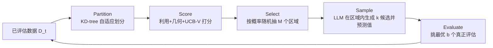

# Improving LLM-based Global Optimization with Search Space Partitioning

**会议**: ICLR 2026  
**OpenReview**: [https://openreview.net/forum?id=y6nhcCdQYd](https://openreview.net/forum?id=y6nhcCdQYd)  
**代码**: [https://github.com/arberzela/mohollm](https://github.com/arberzela/mohollm)  
**领域**: optimization  
**关键词**: 黑盒优化, 大语言模型, 空间划分, KD-tree, 多臂老虎机, 贝叶斯优化  

## 一句话总结
HOLLM 把搜索空间用 KD-tree 自适应切成一堆「子区域元臂」，靠一个 bandit 风格的打分函数挑出有希望的局部区域，再让 LLM 只在这些小区域里采样候选点——从而把 LLM 全局采样「撒不开、撒得偏」的毛病，转化为局部低维采样的优势，在多模态函数和超参优化上稳压全局 LLM 采样与传统贝叶斯优化。

## 研究背景与动机

**领域现状**：黑盒（零阶/无梯度）优化是超参调优、分子设计、策略搜索等场景的共性难题，传统主力是贝叶斯优化（BO，用 GP 当代理 + 采集函数）和进化算法。近期 LLM 被当作代理模型或候选生成器接入优化框架，展现了不依赖固定参数化假设的潜力。

**现有痛点**：LLM 直接做全局采样有两个硬伤。其一，**LLM 采样有强烈偏置**——作者用 Gemini-1.5 模拟在单位立方体上均匀采样，2D 下点就明显扎堆填不满空间，8D 下用 Hausdorff 距离量化更是远离真均匀分布；其二，**高维空间里 LLM 建议稀疏**，只覆盖定义域一小块，且严重依赖精心设计、含领域先验（数据集统计、问题描述）的 prompt，在缺先验的场景鲁棒性存疑。

**核心矛盾**：LLM 编码了关于函数典型行为的有用「元先验」（如局部单峰性），但你没法在高维全局尺度上把这个先验榨出来——直接全局提问，它既撒不均匀又抓不准。

**本文目标**：在不注入任何领域知识的前提下，让 LLM 的采样变得可靠、有覆盖度，并匹配甚至超过 SOTA 的 BO / Trust Region 方法。

**核心 idea**：**「先划分再局部采样」**——把全局高维难题降解为「在哪个小区域里采」+「在小区域内 LLM 采」两步。前者交给经典的 bandit 空间划分（KD-tree + UCB 式打分）来理性分配预算，后者把 LLM 限制在低维小盒子里，既减轻它的采样难度，又自然发挥它的局部元先验。

## 方法详解

### 整体框架

HOLLM（Hierarchical Optimization with LLMs）把每一轮迭代拆成 5 个步骤循环执行：**Partition（划分）→ Score（打分）→ Select（选择）→ Sample（采样）→ Evaluate（评估）**。给定已有评估数据 $D_t=\{(x_i, f(x_i))\}$，算法先用 KD-tree 把空间自适应切成一组叶子（子区域），给每个叶子算一个平衡探索-利用的分数，按分数随机抽出 $M$ 个有希望的区域，让 LLM 在每个区域内提候选点并预测其函数值，最后挑全局最好的 $b$ 个真正去评估、并入数据，进入下一轮。

### 关键设计

**1. 自适应 KD-tree 划分：把空间变成「会缩放的元臂池」。** HOLLM 用 KD-tree 而非 Delaunay 三角剖分或 Voronoi 图，因为后者随维度爆炸而不可行，而 KD-tree 建树是 $O(t\log t)$。每个内部节点选择方差最大的维度 $s$ 做分裂、用该维均值 $\delta$ 当分裂阈值，递归把空间切成轴对齐超矩形：$X_{\text{left}}=\{x: x_s\le\delta\}$，$X_{\text{right}}=\{x: x_s>\delta\}$。叶子的最大容量 $m_t = m_0 + \lfloor\lambda\log(1+t)\rfloor$（默认 $m_0=\lceil d/2\rceil$，$\lambda=0$），用对数增长保证划分不会过早变细。关键在于**每一轮都重新拟合整棵树**：边界随数据漂移、在信息聚集处自动「zooming」细化，避免早早锁死到局部极小；从无穷臂 bandit 视角看，每个超矩形是一个「元臂」，整个池子不可数，发现臂本身成了学习问题的一部分。

**2. 三元合成打分：利用 + 几何探索 + UCB-V 不确定性。** 每个叶子的分数由三项归一化后线性组合：$B_{\ell,t} = \bar\mu_{\ell,t} + \alpha_t(\beta_1\bar V_{\ell,t} + \beta_2 E_{\ell,t})$。**利用项**用区域内观测到的最大改进而非均值——$\mu_{\ell,t}=\max_{i\in I_\ell}(f(x_i)-f_{\min}(t)+\varepsilon)$，因为黑盒目标常异方差，一个特别好的点比整段分布更有信息量。**几何探索项**用叶子体积的 $d$ 次方根 $V_{\ell,t}=(\prod_j(u_{\ell j}-l_{\ell j}))^{1/d}$，即各边长的几何均值，开 $d$ 次方消除维度依赖、让不同维度下数值可比，奖励大而欠采的区域。**统计探索项**借鉴 UCB-V（带方差估计的上置信界），$E_{\ell,t}=\sqrt{\frac{2\sigma^2_{\ell,t}\max(0,\ln(t/(K_t n_{\ell,t})))}{n_{\ell,t}}} + c\cdot\frac{\max(0,\ln(t/(K_t n_{\ell,t})))}{n_{\ell,t}}$，对照「区域平均样本数 $t/K_t$」和「本区域样本数 $n_{\ell,t}$」把探索集中到采样不足的格子，并用方差自适应——小区域只要方差大就值得再采。$\alpha_t$ 按余弦退火从大到小：早期近似利用与两个探索项的均匀混合，后期 $\bar V$ 衰减比 $E$ 更快（几何探索前置、统计校准更持久），临近预算耗尽时退化为贪婪最大化 $\bar\mu$。一句话概括这个分数：「去我见过好东西的地方、去我完全没看过的地方、去我估计还不确定的地方」。

**3. 随机选择 + LLM 局部生成：避免早收敛 + 榨取局部元先验。** Select 步**不取 Top-M 而是按 $p_{\ell,t}=B_{\ell,t}/\sum_r B_{r,t}$ 的类别分布无放回抽 $M$ 个叶子**——随机性保证次优叶子被无限次采到，缓解高度非凸多模态函数上的早熟收敛；因利用项加了 $\epsilon>0$ 且做了 min-max 归一化，每个叶子概率恒正；随 $t$ 增大探索项收缩，分布自然向经验最优叶子尖锐化，趋于近贪婪。Sample 步给 LLM 喂一个结构化 prompt：含 $D_t$ 作为 in-context 样例、目标格子的数值边界 $(l_{is},u_{is})_{s=1}^d$、以及「提 $k$ 个可能高 $f$ 的点」的指令，LLM 同时返回候选位置 $\hat x_i$ 和预测函数值 $\hat f_i$（生成、预测各一个 prompt）。$M$ 个区域共得 $k\cdot M$ 个候选，按预测值留全局最优 $b$ 个真评估。**关键是 LLM 只拿到维度、变量名、区域边界和样例，零任务描述/零数据集统计**，刻意避免 prompt 工程污染，证明增益来自机制而非堆先验。

## 实验关键数据

设置：从 $n_0=5$ 个随机点起步，$T=50$ 次评估，每法跑 10 个种子报均值±标准误；默认 $\alpha_t$ 余弦从 1.0 退火到 0.01，$b=4$、$M=5$、$k=5$，默认 LLM 为 Gemini-2.0-Flash（快、便宜、长上下文）。在 SyneTune 框架内实现并对比。

### 主实验（覆盖三类任务）

| 任务类别 | 基准 | HOLLM 表现 |
|---|---|---|
| 合成函数 (6 个) | Hartmann-3D/6D、Rosenbrock-8D、Rastrigin-10D、Lévy-10D | 一致超过全局 LLM 基线（尤其多模态），方差更小；除 Rastrigin（$10^{10}$ 局部极小）外匹配或超过所有基线 |
| 超参优化 (9D 离散) | FCNet：PROTEIN/NAVAL/PARKINSONS/SLICE | HOLLM 与全局 LLM 均超过 BORE/CQR 等常用最优；单次 50 trials 约 330s、Gemini API 费用 \$0.14 |
| 真实任务 (连续) | Penicillin(7D)、VehicleSafety(5D)、CarSideImpact(7D) | 临界差异图（Critical Difference Diagram）平均排名 **2.42 最高**，优于 BORE/CQR(3.25)、LLM(3.42)、REA(5.58)、RS(5.79)、BoTorch(6.04)、RS+KD-Tree(6.25) |

### 消融实验（Vehicle Safety, Gemini-2.0-Flash）

| 变体 | 改动 | 结论 |
|---|---|---|
| HOLLM (UCB1) | UCB-V 换成 UCB1 | 过度探索稳定但次优区域，收敛慢、终值差——证明方差感知关键 |
| Exploitation Only | 去掉探索 bonus | 弱于完整版 |
| Exploration Only | 去掉利用项 | 弱于完整版 |
| Uniform | 区域均匀选 | **最差**，证明增益来自打分函数的智能预算分配，而非划分或 LLM 本身 |

### 关键发现
- **换非专有 LLM 也稳**：用 Llama-3.1-8B / 3.3-70B / Qwen3-30B 时，全局 LLM 基线立刻停滞失效，而 HOLLM 仍能逼近 Gemini-2.0-Flash 的表现——局部化让弱模型也能用。
- **抗噪声**：注入 $N(0,\sigma^2)$（$\sigma$ 为函数range的 1%）观测噪声，全局 LLM、TPE、RS 都提前 plateau，HOLLM 凭局部上下文得到更可靠的均值估计，持续达到更高目标值。
- **可视化**：1D 多模态例子里，早期划分大、探索性强，后期格子在全局最优附近变细、概率质量集中。

## 亮点与洞察
- **把 LLM 的弱点变成约束、再用经典理论补位**：LLM 撒不开 → 那就别让它撒全局，用 bandit 划分理性分区，LLM 只干它擅长的局部低维采样。这种「分工」哲学很干净。
- **「最大改进」而非「均值」做利用项**，契合优化（而非回归）目标——黑盒里一个好点比整段分布更值钱，与 BO 采集函数、MCTS 的直觉一致。
- **零 prompt 工程是个强声明**：故意不喂领域信息，把性能增益归因于机制本身，避免了「靠精修 prompt 刷分」的常见质疑。
- 每轮全树重拟合的「活化/去活化无穷 KD-tree」视角，把工程 trick 接到了自适应树 bandit 的理论语言上。

## 局限与展望
- **强依赖 LLM 提案质量**：模型有偏或预测值不准会误导搜索、浪费昂贵评估。
- **LLM 推理/金钱成本**在高维大预算下限制可扩展性（虽然此文 \$0.14/run 很便宜）。
- **默认超参虽好但实战可能要调**，否则有早熟或过度探索风险。
- **缺形式化理论保证**，尤其 regret bound——作者明确留作未来工作；这也是相对纯 bandit 方法（HOO/UCB-AIR 有界）的短板。

## 相关工作与启发
- **空间划分 bandit 谱系**：HOO（n-ary 树 + UCB 选叶）、UCB-AIR（无穷臂）、自适应树 bandit、以及 LA-MCTS / Monte Carlo 树 bandit——HOLLM 的 KD-tree + UCB-V 直接继承这条线，创新点是「把划分思想嫁接到 LLM 驱动的采样」。
- **Trust Region BO**（TuRBO）维护多个动态缩放的信任域做高维优化，与 HOLLM 的「局部区域聚焦」异曲同工，但 HOLLM 用 LLM 替代局部 GP。
- **LLM for 黑盒优化**：直接 prompt 生成候选、估计不确定性、设计采集函数、或替代代理模型；HOLLM 与它们的核心区别是**不依赖领域 prompt**且**显式做空间分区**。
- 启发：「让强模型只在它可靠的局部尺度上工作，把全局调度交给可解释的经典算法」这套范式，可迁移到任何「大模型局部强、全局弱」的决策/生成场景。

## 评分
- **新颖性**: ⭐⭐⭐⭐ 把 bandit 空间划分与 LLM 局部采样系统结合，动机（LLM 采样偏置的实证）扎实，组合点清晰；但各组件（KD-tree、UCB-V、LLM 采样）均为已有技术的拼装。
- **实验充分度**: ⭐⭐⭐⭐ 覆盖合成/超参/真实三类任务、多 LLM（含开源）、噪声鲁棒性、组件消融与可视化，对照齐全；规模偏小（$T=50$、5-10D 为主），缺更高维与统计显著性深究。
- **写作质量**: ⭐⭐⭐⭐ 五步框架表述清晰，打分函数三项物理意义解释到位，motivation 的图示有说服力。
- **价值**: ⭐⭐⭐⭐ 给「LLM 做黑盒优化」提供了一个免 prompt 工程、能用弱模型、抗噪的实用配方，对超参优化/科学优化场景有直接落地价值。

<!-- RELATED:START -->

## 相关论文

- [\[ICLR 2026\] Local Entropy Search over Descent Sequences for Bayesian Optimization](local_entropy_search_over_descent_sequences_for_bayesian_optimization.md)
- [\[ICLR 2026\] Improving Online-to-Nonconvex Conversion for Smooth Optimization via Double Optimism](improving_online-to-nonconvex_conversion_for_smooth_optimization_via_double_opti.md)
- [\[ICLR 2026\] HeuriGym: An Agentic Benchmark for LLM-Crafted Heuristics in Combinatorial Optimization](heurigym_an_agentic_benchmark_for_llm-crafted_heuristics_in_combinatorial_optimi.md)
- [\[AAAI 2026\] ECPv2: Fast, Efficient, and Scalable Global Optimization of Lipschitz Functions](../../AAAI2026/optimization/ecpv2_fast_efficient_and_scalable_global_optimization_of_lipschitz_functions.md)
- [\[ICLR 2026\] Improving Feasibility via Fast Autoencoder-Based Projections](improving_feasibility_via_fast_autoencoder-based_projections.md)

<!-- RELATED:END -->
