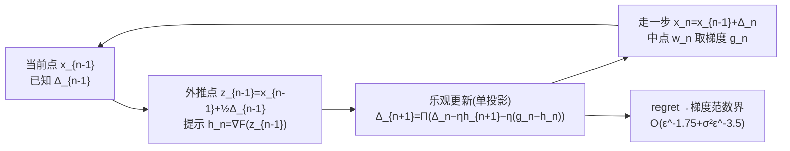

# Improving Online-to-Nonconvex Conversion for Smooth Optimization via Double Optimism

**会议**: ICLR 2026  
**OpenReview**: [https://openreview.net/forum?id=ZAflv4dxQ9](https://openreview.net/forum?id=ZAflv4dxQ9)  
**代码**: 无（理论论文）  
**领域**: optimization  
**关键词**: 非凸优化, online-to-nonconvex, 乐观在线学习, 一阶方法, 随机优化, 复杂度下界  

## 一句话总结
在 Cutkosky 等人的 online-to-nonconvex (O2NC) 框架上，用"双重乐观"的提示函数替换原来复杂的不动点内循环，得到一个统一的一阶算法，复杂度 $O(\varepsilon^{-1.75}+\sigma^2\varepsilon^{-3.5})$，同时拿到确定性的最优速率（去掉了对数因子）和随机情形的最优速率。

## 研究背景与动机

**领域现状**：找光滑非凸函数的 $\varepsilon$-一阶稳定点，标准 GD 需要 $O(\varepsilon^{-2})$、SGD 需要 $O(\varepsilon^{-2}+\sigma^2\varepsilon^{-4})$，二者在各自设定下是最优的。但当**梯度和 Hessian 都 Lipschitz 连续**时可以更快：确定性情形最优是 $O(\varepsilon^{-1.75})$，随机情形最优是 $O(\sigma^2\varepsilon^{-3.5})$。Cutkosky 等人 (2023) 提出的 O2NC 框架把"找稳定点"归约成"在更新方向上的在线学习"，是迈向统一的优雅一步。

**现有痛点**：O2NC 框架虽然概念漂亮，却有三个明显短板。其一，确定性算法依赖一个**求解不动点方程的双层循环**来构造乐观学习器的提示向量，凭空多出一个 $\log(1/\varepsilon)$ 因子；其二，随机算法假设随机梯度的**二阶矩有界** $\mathbb{E}\|\nabla f\|^2\le G^2$，这比标准的方差有界假设更强、实践中更苛刻；其三，确定性和随机两种设定用的是**不同的在线学习算法**，模块性差、难以扩展。

**核心矛盾**：O2NC 的双层循环之所以存在，是因为要把提示 $h_n$ 做得足够接近真实梯度 $g_n=\nabla F(w_n)$，而 $w_n$ 又依赖于尚未确定的更新方向 $\Delta_n$——这是一个循环依赖。原框架用不动点迭代硬解，代价就是额外对数因子加复杂度。

**本文目标**：找一个既简单、又能在确定性和随机两种设定下同时达到已知最优速率的**统一一阶算法**，并去掉那个多余的对数因子和过强的二阶矩假设。

**核心 idea**：**双重乐观（Double Optimism）**。第一重乐观沿用标准乐观在线学习——假设"真实梯度与提示之差缓慢变化"$g_{n+1}-h_{n+1}\approx g_n-h_n$；**第二重乐观**是本文新增——假设"更新方向本身也缓慢变化"$\Delta_n\approx\Delta_{n-1}$（由光滑性支撑），于是直接用**外推点的梯度**当提示，一次梯度调用就够，彻底甩掉不动点内循环。

## 方法详解

### 整体框架

把问题 $\min_x F(x)$ 沿用 O2NC 改写：每步更新 $x_n=x_{n-1}+\Delta_n$，并在中点 $w_n=x_{n-1}+\tfrac12\Delta_n$ 取（随机）梯度 $g_n$，把损失 $\langle g_n,\Delta\rangle$ 喂给一个在线学习器去选下一步方向。收敛性由"K-shifting regret"控制（Proposition 2.1）。本文的全部创新都落在**用什么在线学习器、用什么提示函数**上：用单次投影的乐观梯度更新（替代原框架两次投影），配上由双重乐观导出的外推点提示，并加一个自适应步长版本。

### 关键设计

**1. 单投影乐观梯度更新：把两次投影压成一次。** 原 O2NC 的乐观模板每步要做两次球面投影、维护 $\hat\Delta_n$ 和 $\Delta_n$ 两条序列。本文改用更简洁的乐观梯度变体，只需一次投影：
$$\Delta_{n+1}=\Pi_{\|\Delta\|\le D}\big(\Delta_n-\eta h_{n+1}-\eta(g_n-h_n)\big),\quad n>1.$$
这一式可读成"用提示 $h_{n+1}$ 做乐观预测 + 用观测误差 $g_n-h_n$ 做修正"，正是第一重乐观（假设 $g_{n+1}\approx h_{n+1}+g_n-h_n$）的体现。它的 K-shifting regret 由 Lemma 3.1 给出：
$$\mathrm{Reg}_T\le \frac{4KD^2}{\eta}+\frac{5\eta}{2}\sum_n\|g_n-h_n\|^2-\frac{1}{4\eta}\sum_n\|\Delta_n-\Delta_{n-1}\|^2.$$
关键在于这里**多出一个负项** $-\|\Delta_n-\Delta_{n-1}\|^2$，它在原框架的分析里被直接丢掉了——而本文的全部加速都来自把它捡回来。

**2. 双重乐观的外推点提示：一次梯度调用替掉整个不动点循环。** 目标是只用 $x_{n-1}$ 之前的信息去估计 $g_n=\nabla F(w_n)$，其中 $w_n=x_{n-1}+\tfrac12\Delta_n$。最朴素的做法是直接复用上一步梯度 $h_n=g_{n-1}$，但这只能给出 $O(\varepsilon^{-11/6})$，因为它让 $\|g_n-h_n\|\propto\|\Delta_n+\Delta_{n-1}\|$，**符号是加号**，没法和负项做 telescoping。本文的第二重乐观说：既然光滑性下 $\Delta_n\approx\Delta_{n-1}$，那就用**外推点** $z_{n-1}=x_{n-1}+\tfrac12\Delta_{n-1}$ 的梯度当提示：
$$h_n=\nabla F(z_{n-1})=\nabla F\big(x_{n-1}+\tfrac12\Delta_{n-1}\big).$$
这样由 Lipschitz 梯度得 $\|g_n-h_n\|\propto\|w_n-z_{n-1}\|=\tfrac12\|\Delta_n-\Delta_{n-1}\|$，**正好对上 Lemma 3.1 里的负项**，于是 $\tfrac{5\eta}{2}\|g_n-h_n\|^2$ 能被 $-\tfrac{1}{4\eta}\|\Delta_n-\Delta_{n-1}\|^2$ telescope 抵消（取 $\eta\le 1/\sqrt{3L_1}$）。整个不动点内循环和那个 $\log(1/\varepsilon)$ 因子就此消失，每步只需一次额外梯度查询。

**3. 用方差替换二阶矩：天然统一确定性与随机。** 随机版只把上面的确定梯度换成随机梯度 $h_{n+1}=\nabla f(z_n;\xi_n)$、$g_n=\nabla f(w_n;\xi_n)$，分析里只多出一项 $6\eta T\sigma^2$（Lemma 3.2）。由此**不再需要原框架的二阶矩有界假设 $\mathbb{E}\|\nabla f\|^2\le G^2$，只用标准方差有界 $\sigma^2$**。令 $\sigma^2=0$ 即自动退回确定性算法，确定性与随机共用同一套算法和分析（Algorithm 1）。最终定理给出统一复杂度 $O(\varepsilon^{-1.75}+\sigma^2\varepsilon^{-3.5})$，在确定性下匹配已知最优 $O(\varepsilon^{-1.75})$、随机下匹配下界 $\Omega(\sigma^2\varepsilon^{-3.5})$，并在二者间平滑插值。

**4. 自适应步长：摆脱对全局 Lipschitz 常数和 $\sigma$ 的依赖。** Theorem 3.3 的常数步长依赖全局 $L_1$ 和 episode 长度 $T$，往往过于保守。本文进一步设计 AdaGrad 式步长
$$\eta_n=\frac{\gamma D}{\sqrt{\alpha+\sum_{i=1}^{n\bmod T}\|g_i^k-h_i^k\|^2}},$$
每个 episode 起点重置分母。难点是 $\eta_n$ 无法直接被 $1/\sqrt{3L_1}$ 上界，telescoping 不能照搬；作者用**阈值分段**技巧（借鉴 Kavis 等）：步长小的迭代里负项占主导，步长大的迭代里分母小、正项累积可控。最终 Theorem 4.2 在**不调学习率**的前提下保持同样的 $O(\varepsilon^{-1.75}+\sigma^2\varepsilon^{-3.5})$，且把全局 $L_1$ 换成可能小得多的局部常数 $\hat L_1^*$，朝 Cutkosky & Mehta 提出的"无需知道 $\sigma^2$"开放问题迈出第一步。

## 实验关键数据

本文是纯优化理论工作，没有数值实验，核心结果以**复杂度对比**给出。

### 主结果：复杂度对比

| 方法 | 确定性 | 随机 | 假设 | 是否统一 |
|------|--------|------|------|----------|
| GD / SGD | $O(\varepsilon^{-2})$ | $O(\varepsilon^{-2}+\sigma^2\varepsilon^{-4})$ | 梯度 Lipschitz | 是（但非加速） |
| Cutkosky & Mehta (2020) | $O(\varepsilon^{-2})$ | $O(\sigma^2\varepsilon^{-3.5})$ | — | 否（确定性不加速） |
| O2NC, Cutkosky 等 (2023) | $O(\varepsilon^{-1.75}\log\tfrac1\varepsilon)$ | $O(G^2\varepsilon^{-3.5})$ | 二阶矩有界 $G^2$ | 否（两套算法） |
| **本文** | $O(\varepsilon^{-1.75})$ | $O(\sigma^2\varepsilon^{-3.5})$ | **方差有界 $\sigma^2$** | **是（单一算法）** |
| 下界 (Arjevani 等) | $\Omega(\varepsilon^{-12/7})$ | $\Omega(\sigma^2\varepsilon^{-3.5})$ | — | — |

### 关键发现

- **去掉对数因子**：确定性速率从 $O(\varepsilon^{-1.75}\log(1/\varepsilon))$ 收紧到 $O(\varepsilon^{-1.75})$。
- **平滑插值**：统一界 $O(\varepsilon^{-1.75}+\sigma^2\varepsilon^{-3.5})$ 中令 $\sigma=0$ 退回确定性最优、$\sigma>0$ 时随机项主导并匹配下界。
- **每步仅两次梯度查询**（中点 $w_n$ 与外推点 $z_n$），相比原框架的多步不动点内循环大幅简化。
- **确定性下界差距仍在**：本文 $O(\varepsilon^{-1.75})$ 与下界 $\Omega(\varepsilon^{-12/7})$ 之间仍有 $O(\varepsilon^{-1/28})$ 的间隙，属于该问题的公开 gap，本文未关闭。

## 亮点与洞察

- **"捡回被丢掉的负项"是整篇文章的支点**：原框架分析里 $-\|\Delta_n-\Delta_{n-1}\|^2$ 被当作冗余丢弃，本文意识到只要让提示误差 $\|g_n-h_n\|$ 与 $\|\Delta_n-\Delta_{n-1}\|$ 同阶，就能把这个负项变成加速的来源——这是一个"分析驱动算法设计"的漂亮例子。
- **第二重乐观把循环依赖化解得极其自然**：用 $\Delta_{n-1}$ 外推出 $z_{n-1}$ 来近似还没确定的 $w_n$，既绕开循环依赖、又恰好制造可 telescope 的结构，比硬解不动点优雅太多。
- **统一性带来工程价值**：确定性与随机共用一套代码、只差"梯度是否带噪"，且把过强的二阶矩假设降为标准方差假设，实用门槛明显降低。

## 局限与展望

- **未完全 parameter-free**：自适应步长去掉了对学习率/$L_1$/$\sigma$ 的显式依赖，但 $D$ 和 $T$ 的选取仍依赖问题常数；作者把"进一步自适应 $D,T$、做到完全无参"列为未来方向。
- **确定性 gap 未关闭**：$O(\varepsilon^{-1.75})$ 与下界 $\Omega(\varepsilon^{-12/7})$ 仍有差距，能否进一步加速是开放问题。
- **缺数值验证**：全文为复杂度分析，没有在实际非凸问题上验证常数因子、自适应步长的实际收敛行为，实践收益还需实验佐证。
- **依赖 Hessian-Lipschitz**：加速完全建立在二阶光滑假设上，对仅梯度 Lipschitz 的问题不优于标准 GD/SGD。

## 相关工作与启发

- **O2NC 框架**（Cutkosky 等 2023）是直接出发点，本文是其确定性子程序的简化与随机扩展；后续 Zhang & Cutkosky (2024)、Ahn 等 (2024) 把 SGD-momentum、Adam、Schedule-free SGD 都纳入 O2NC 解释。
- **乐观在线学习**（Rakhlin & Sridharan 2013；Joulani 等 2020；Chiang 等 2012）提供第一重乐观的提示机制，本文在其上叠加第二重乐观。
- **与 Jiang 等 (2025) 的区分**：两者都在 O2NC 上用乐观 OGD，但 Jiang 等聚焦确定性下的**拟牛顿**（提示是二阶近似、在矩阵空间在线学习 Hessian），本文聚焦一阶、覆盖随机+确定，提示构造（外推点梯度 vs 二阶近似）和对负项的利用根本不同。
- **加速非凸一阶法**（Carmon 等 2017；Li & Lin 2022/2023 的 restarting）给出 $O(\varepsilon^{-1.75})$ 的 baseline，但推导冗长、随机扩展不清；本文以更模块化的在线学习视角重新达成。
- **启发**：把"被分析丢弃的负项"当作潜在加速来源、再反过来设计算法以激活它，是一条值得迁移到其它收敛分析（如约束优化、min-max）的方法论。

## 评分
- **新颖性**: ⭐⭐⭐⭐ — 双重乐观 + 外推点提示是干净且原创的想法，用一次梯度调用替掉整个不动点内循环，并首次在单一算法里同时拿到确定性与随机最优速率。
- **实验充分度**: ⭐⭐⭐ — 纯理论工作，复杂度证明完整严谨，但缺数值实验，常数因子和自适应步长的实际表现未验证（理论论文常态）。
- **写作质量**: ⭐⭐⭐⭐ — 动机—痛点—解法链条清晰，对"为什么朴素提示不行、外推点提示为何恰好对上负项"解释到位，Figure 1 和算法框图直观。
- **价值**: ⭐⭐⭐⭐ — 解决了 O2NC 框架的对数因子、过强假设、双算法三大遗留问题，对非凸优化复杂度理论是扎实推进，统一性也降低了实用门槛。

<!-- RELATED:START -->

## 相关论文

- [\[ICLR 2026\] Communication-Efficient Decentralized Optimization via Double-Communication Symmetric ADMM](communication-efficient_decentralized_optimization_via_double-communication_symm.md)
- [\[ICLR 2026\] Improving LLM-based Global Optimization with Search Space Partitioning](improving_llm-based_global_optimization_with_search_space_partitioning.md)
- [\[ICLR 2026\] Decentralized Nonconvex Optimization under Heavy-Tailed Noise: Normalization and Optimal Convergence](decentralized_nonconvex_optimization_under_heavy-tailed_noise_normalization_and_.md)
- [\[ICLR 2026\] Faster Gradient Methods for Highly-Smooth Stochastic Bilevel Optimization](faster_gradient_methods_for_highly-smooth_stochastic_bilevel_optimization.md)
- [\[ICLR 2026\] Online Black-Box Prompt Optimization with Regret Guarantees under Noisy Feedback](online_black-box_prompt_optimization_with_regret_guarantees_under_noisy_feedback.md)

<!-- RELATED:END -->
