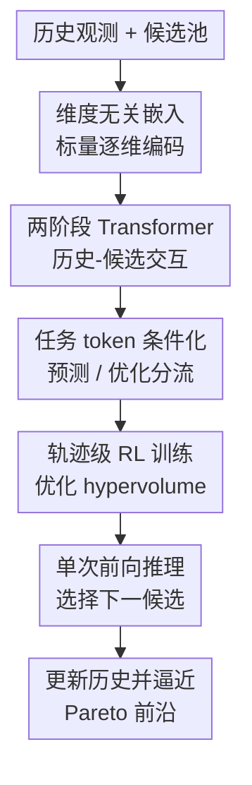

# In-Context Multi-Objective Optimization

**会议**: ICLR2026  
**OpenReview**: [https://openreview.net/forum?id=odmeUlWta8](https://openreview.net/forum?id=odmeUlWta8)  
**代码**: https://github.com/xinyuzc/in-context-moo  
**领域**: 优化 / 多目标黑盒优化  
**关键词**: 多目标优化, 贝叶斯优化, 摊销优化, Transformer, Pareto 前沿  

## 一句话总结
TAMO 把多目标黑盒优化从“每个新任务重新拟合 surrogate + 优化 acquisition”的 MOBO 流程，改成一个离线训练好的维度无关 Transformer policy，在测试时只靠历史观测和候选池做一次前向传播就给出下一次查询，并在多个合成与真实任务上保持接近或更好的 Pareto 质量，同时把提案时间降低约 $50\times$ 到 $1000\times$。

## 研究背景与动机
**领域现状**：多目标黑盒优化常见于药物设计、材料筛选、自动控制和科学实验设计：一个候选设计 $x$ 往往同时对应多个目标 $f(x)=[f_1(x),\ldots,f_{d_y}(x)]$，而这些目标之间很难同时最优。主流样本高效方案是多目标贝叶斯优化（MOBO）：先给每个目标拟合概率 surrogate，通常是 Gaussian process，再用 qNEHVI、qNParEGO、qHVKG 等 acquisition function 选择下一批点，目标是用有限评估预算逼近 Pareto frontier。

**现有痛点**：这套范式在昂贵实验里很有用，但部署成本并不低。每换一个新问题，都要重新拟合 surrogate、重新优化 acquisition，并且 kernel、likelihood、acquisition、初始化策略都会影响性能；当实验闭环要求快速决策，或并行平台需要连续给出候选时，GP refit 和 acquisition optimization 会成为明显延迟来源。更麻烦的是，很多 acquisition 只优化一步收益，虽然 hypervolume 的最终质量取决于整条查询轨迹，但传统方法往往很难显式学习“这一步会怎样影响后面几十步”。

**核心矛盾**：多目标优化需要跨任务复用经验、跨维度适配不同设计空间和目标数，还要能为了最终 Pareto front 做长视野规划；而传统 MOBO 的计算和建模选择大多绑定在单个任务上。已有 amortized BO 方法开始把一部分计算前移到离线训练，但不少方法仍然只处理单目标，或只摊销 acquisition 而保留任务级 surrogate，或固定输入/输出维度，无法把不同历史数据和不同目标数的问题装进同一个优化器。

**本文目标**：作者希望训练一个“通用优化 policy”：它在离线阶段看过大量合成多目标任务，学会如何根据历史观测和候选集选择下一次查询；到了新任务上，不再拟合 GP，也不再手工挑 acquisition，而是直接用一次 forward pass 产出候选。这个 policy 还必须同时支持可变输入维度 $d_x$ 和可变目标维度 $d_y$，否则很难成为科学发现场景里的 plug-and-play optimizer。

**切入角度**：论文的关键观察是，多目标优化本身可以被看成一个 in-context sequential decision problem：历史观测 $D_h=\{(x_h,y_h)\}$ 就是上下文，候选池 $D_q=\{x_q\}$ 是可选动作，下一步选择哪个候选会影响后续整条轨迹的 hypervolume。Transformer 很适合把变长历史和候选池一起编码；如果再设计一个维度无关的 observation embedder，就可以把不同 $d_x$、不同 $d_y$ 的任务映射到同一表示空间里。

**核心 idea**：用一个维度无关 Transformer policy 直接摊销多目标黑盒优化过程，并用强化学习在完整查询轨迹上最大化归一化 hypervolume，从而替代每个任务上的 surrogate 拟合和 acquisition 工程。

## 方法详解

### 整体框架
TAMO（Task-agnostic Amortized Multi-objective Optimization）的输入是当前优化历史 $D_h$、候选查询集 $D_q$、当前步数 $t$ 和总预算 $T$；输出是候选池中每个候选点的 acquisition utility，然后用 softmax 得到 policy $\pi_\theta(x_q\mid D_h,t,T)$。训练时，模型同时做两类任务：一类是 in-context prediction，用上下文点预测目标点的函数值，帮助 backbone 学函数形状；另一类是 optimization policy learning，用 REINFORCE 在整条轨迹上优化归一化 hypervolume。测试时则只保留优化流程：给定历史和候选池，一次前向传播选择概率最大的候选，评估后把新观测并入历史，循环到预算耗尽。

### 关键设计
**1. 维度无关嵌入：让同一个优化器吃下不同输入维度和目标数**

TAMO 最先要解决的是“不同任务长得不一样”的问题。一个材料筛选任务可能有 2 个连续变量和 3 个目标，一个激光等离子体任务可能有 4 个输入和 3 个目标，普通 Transformer 如果直接把 $x$ 和 $y$ 拼成固定向量，就会被维度锁死。作者的做法是把每个标量输入维度和每个标量目标维度分别映射成 token：用可学习的 scalar-to-vector 网络 $e_x:\mathbb{R}\to\mathbb{R}^{d_e}$ 和 $e_y:\mathbb{R}\to\mathbb{R}^{d_e}$ 对 $x$、$y$ 逐维编码，再把这些 token 交给若干 Transformer 层聚合，最后沿维度 token 做 mean pooling 得到单个 observation 表示 $E\in\mathbb{R}^{d_e}$。

这里的细节不是简单“set pooling”。如果完全对维度置换不敏感，模型会分不清第一个输入维度和第二个输入维度，也可能把数值相同的 feature 与 objective 混在一起。因此论文从固定池里随机采样可学习 positional tokens $p_x$ 和 $p_y$，分别注入输入维度和目标维度，既保留跨维度泛化能力，又避免无意义的维度对称性。这样每个 observation 最终只贡献 $O(1)$ 个 token，计算主要随观测数增长，而不是直接随 $d_x+d_y$ 爆炸。

**2. 两阶段 Transformer 解码：先让候选看历史，再用任务 token 控制输出**

TAMO 的 backbone 被拆成 $B_1+B_2$ 层。前 $B_1$ 层负责把历史或上下文信息注入候选：历史 token 先 self-attention 得到集合内部结构，候选 token 再通过 cross-attention 从历史里读取信息。这个阶段对应优化里的核心问题：候选点到底位于当前已知函数景观的什么位置，可能补足 Pareto front 的哪一块。

后 $B_2$ 层则把历史 token 移除，只保留候选/目标 token 和少量 task-specific tokens。对预测任务，额外 token 包括 prediction task token 和要预测的输出维度位置 token $p_y^{(k)}$；对优化任务，额外 token 包括 optimization task token、时间预算 token $g_{time}=\mathrm{MLP}_\theta((T-t)/T)$，以及聚合的输入维度 token $\sum_j p_x^{(j)}$。注意力 mask 让候选 token 在最后阶段只能看这些任务 token，不能继续相互通信，也不能回头访问完整历史。这个设计有两个作用：一是让共享 backbone 能在“预测函数值”和“选择优化动作”之间切换；二是把预算信息显式交给 policy，使它知道现在是早期探索还是后期收敛。

**3. 轨迹级 RL 目标：直接奖励最终 Pareto 质量而不是一步 acquisition**

传统 MOBO 里 acquisition 通常是一步式目标，比如当前选择能带来多少 expected hypervolume improvement。TAMO 则把优化过程写成 MDP：状态是 $s_t=(D_h,t,T)$，动作是在候选集里选一个 $x_t$，查询后得到 $y_t$ 并更新历史。奖励不是单步 improvement，而是当前 Pareto 集覆盖最优 hypervolume 的比例：

$$
r_t=\frac{\mathrm{HV}(P(D_h)\mid r)}{\mathrm{HV}^*_\tau},\quad
\mathrm{HV}^*_\tau=\mathrm{HV}(P(X)\mid r).
$$

参考点 $r$ 取每个目标的 componentwise worst value，使奖励被归一化到 $[0,1]$ 并能跨任务比较。policy 最大化折扣回报 $J(\theta)=\mathbb{E}_{\tau\sim p(\tau)}[\mathbb{E}_{\pi_\theta}\sum_{t=1}^T\gamma^{t-1}r_t]$，梯度用 REINFORCE 估计。因为训练任务是合成函数，最优 hypervolume 可以离线算出，奖励信号比真实昂贵实验里更容易获得。这个目标把“现在选点”与“未来 Pareto front 形状”绑定起来，是 TAMO 区别于只摊销一步 acquisition 的关键。

**4. 预测 warm-up 与联合训练：先学函数景观，再学优化策略**

仅靠稀疏的轨迹奖励训练 Transformer policy 很不稳定，尤其是在多目标、跨维度任务上。TAMO 因此加入一个辅助 in-context regression 任务：从同一个任务分布里采样输入输出对，随机拆成 context set $D_c$ 和 target set $D_p$，让模型根据上下文预测目标点某个输出维度的分布。prediction head 输出 $K$ 组件的一维 Gaussian mixture，最大化目标值 likelihood，训练损失为负对数似然 $L^{(p)}(\theta)$。

训练分两阶段进行。第一阶段只做 prediction warm-up，让维度无关 embedder 和 Transformer 学会从少量上下文重建函数景观；第二阶段把 prediction loss 和 RL loss 相加：$L(\theta)=\lambda_p L^{(p)}(\theta)+L^{(rl)}(\theta)$，其中论文实验固定 $\lambda_p=1.0$。prediction batch 和 optimization batch 来自不同函数 draw，避免奖励泄漏。消融结果也说明这个辅助任务不是装饰：去掉 prediction warm-up 和 prediction term 后，多个合成任务的 simple regret 明显变差。

### 一个完整示例
假设要在一个候选材料库里同时最大化吸油能力、机械强度和水接触角。传统 MOBO 会先用已经测试过的材料拟合三个目标的 GP，再优化 qNEHVI 或 qNParEGO 来挑下一个材料。TAMO 的流程更像“带经验的调度器”：一开始随机测一个材料，把这个 $(x_0,y_0)$ 放进历史；第 1 步时，把历史和 2048 个候选材料一起编码，policy head 给每个候选一个 utility，取概率最大的候选去实验；第 2 步时，新实验结果并入历史，模型重新看当前 Pareto front 已经覆盖了哪些区域，再挑下一点。

如果早期历史里已有一个材料强度很高但吸油弱，另一个材料吸油强但接触角一般，TAMO 不只是找“均值看起来最高”的点，而是根据训练中学到的 hypervolume 轨迹偏好，倾向于选择能补齐 Pareto front 空白区域的候选。到了预算后期，time-budget token 告诉模型剩余步数很少，它会更偏向利用当前 front 附近的候选，而不是继续大范围探索。这个例子也解释了为什么单次 forward pass 并不等于贪心短视：短视 acquisition 是目标定义上的一步式，而 TAMO 的 policy 是用长轨迹奖励训练出来的。

### 损失函数 / 训练策略
预训练任务分布 $p(\tau)$ 由合成 GP 函数生成，输入维度 $d_x\sim U(\{1,2\})$，输出维度 $d_y\sim U(\{1,2,3\})$；输出之间有一半概率独立采样，一半概率来自多任务 GP，kernel 在 RBF、Matérn-3/2、Matérn-5/2 中采样，函数值被归一化到 $[-1,1]^{d_y}$。这种设计让模型在训练时见到不同维度、不同平滑度和不同目标相关性。

prediction head 对每个 target input $x_i^p$ 和输出维度 $k$ 预测混合高斯密度：

$$
p(y^p_{i,k}\mid x_i^p,D_c)=\sum_{\ell=1}^K\phi_{i\ell}\mathcal{N}(y^p_{i,k};\mu_{i\ell},\sigma_{i\ell}^2).
$$

policy head 对每个候选 $x_i^q$ 输出 utility $\alpha_i=\mathrm{MLP}_\theta(\hat{E}_i^q)$，并用 softmax 得到离散候选池上的策略：

$$
\pi_\theta(x_i^q\mid t,T,H_{1:t-1})=\frac{\exp(\alpha_i)}{\sum_{r=1}^{N_q}\exp(\alpha_r)}.
$$

实验中的主模型训练 400000 次迭代，前 393500 次为 prediction warm-up；Transformer 输入维度为 64，encoder-decoder 共 8 层，policy head 3 层，GMM head 使用 $K=20$ 个组件。测试默认候选池大小 $N_q=2048$，预算 $T=100$，初始观测数为 1。推理时采用 greedy action，即选择概率最大的候选点。

## 实验关键数据

### 主实验
论文在合成 GP、多种解析多目标 benchmark、真实 oil sorbent 任务上比较 TAMO、BOFormer、qNEHVI、qNParEGO、qHVKG 和 Random。核心指标是 HV-based simple regret，另一个重点指标是累计 proposal time；后者对 GP 方法包含 surrogate refit 和 acquisition optimization，对 TAMO 主要就是一次 forward pass。

| 任务 | 对比方法 | Pareto / regret 表现 | 提案时间表现 | 结论 |
|------|----------|----------------------|--------------|------|
| GP-DX2-DY2 | BOFormer, qNEHVI, qNParEGO, qHVKG | 与最强 GP baseline 基本持平 | TAMO 低约 $50\times$ 到 $1000\times$ | in-distribution 合成任务上不牺牲质量换速度 |
| Ackley-Rastrigin | 同上 | TAMO 整体最强或并列最强 | 显著更快 | OOD 解析任务上泛化较好 |
| Ackley-Rosenbrock | 同上 | TAMO 整体最强或并列最强 | 显著更快 | 长视野 policy 对复杂 front 有帮助 |
| Branin-Currin | 同上 | qNEHVI / qNParEGO 更好 | TAMO 仍显著更快 | 预训练 GP 长度尺度与该任务不完全匹配 |
| Oil Sorbent | 同上 | TAMO 最好，qNParEGO 接近 | 显著更快 | 仅用合成 GP 预训练也能迁移到真实材料任务 |

| 泛化场景 | 设定 | TAMO 表现 | 主要 caveat |
|----------|------|-----------|-------------|
| 未见输入/输出维度 | 训练见 $d_x\in\{1,2\}$，测试 GP-DX3-DY2 / GP-DX3-DY3 | regret 与最强 GP baseline 接近，统计差异不明显 | 说明维度无关架构确实能跨维迁移 |
| LaserPlasma | $d_x=4,d_y=3$ 的真实物理任务 | 优于 BOFormer，但 regret 落后传统 MOBO | 真实高维任务仍受预训练分布限制 |
| Decoupled observations | 每次可只观测一个目标，单目标成本为 1 | 在 GP-DX2-DY2、Ackley-Rastrigin、Branin-Currin 上接近 coupled TAMO | Ackley-Rosenbrock 上变差，目标最优区域差异大时单目标反馈会偏置搜索 |
| Single-objective BO | GP-DX2-DY1、Forrester、Branin、EggHolder | 与 qEI 竞争，同时提案时间明显更低 | TAMO 框架不局限于多目标 |

### 消融实验
| 配置 / 超参 | 观察到的变化 | 说明 |
|-------------|--------------|------|
| 不使用 prediction warm-up / prediction term | 多个合成任务的 simple regret 明显变差 | 辅助 in-context regression 对学函数景观和稳定 RL 很关键 |
| myopic TAMO（预训练 horizon $T=1$） | 多数单目标和多目标任务不如标准 $T=100$ TAMO | 长视野轨迹奖励比一步式策略更符合 Pareto front 发现过程 |
| batch size $q=1,2,5,10$ | $q=1$ 收敛最快，较大 batch 有轻微退化 | batch 内 fantasy 反馈不如真实反馈，但可换并行实验时间 |
| query set size $N_q=256,512,1024,2048$ | 大多数任务 regret 不敏感，Branin-Currin 小 $N_q$ 会漏好区域 | 候选池越大越慢，但默认 2048 仍远快于 GP 方法 |
| 小模型（每模块 2 层 Transformer） | 仍可用，但困难任务 regret 高于标准模型 | 表示容量对复杂景观和多目标规划有帮助 |
| 修改预训练 prior | 小 lengthscale prior 变差；quadratic-bowl prior 在 GP 和 Ackley 类任务上有帮助但伤害 Branin-Currin | 预训练分布组成直接影响下游迁移 |

### 关键发现
- TAMO 最大的优势不是在所有任务上碾压 GP-based MOBO，而是在 Pareto 质量接近或有时更好的前提下，把每步 proposal 的计算从“拟合 + acquisition optimization”压到一次神经网络前向传播。
- 维度无关设计确实带来了跨维泛化：训练只见过较低输入维度，测试到 $d_x=3$ 乃至 LaserPlasma 的 $d_x=4$ 仍能工作，但真实物理任务上与传统 MOBO 仍有差距。
- 长轨迹 RL 目标是方法成立的核心之一。myopic 版本和去掉 prediction 辅助的版本都说明，仅有 Transformer 架构不足以得到好优化器，训练信号必须对齐 Pareto 轨迹质量。
- 预训练分布不是中性背景。Branin-Currin 上的弱点和 prior composition 消融都表明，TAMO 更像一个“优化 foundation policy”，它的泛化边界取决于离线任务族覆盖了哪些函数形状。

## 亮点与洞察
- **把 MOBO 完整摊销成 policy**：BOFormer 这类方法仍要依赖每个任务的 GP surrogate，而 TAMO 直接从历史到候选 utility，真正把新任务上的提案变成一次 forward pass。这对高通量实验、自动化实验室和快速仿真闭环很有现实价值。
- **输入和输出都维度无关**：很多 BO/NP 类模型只处理固定目标数，或者只在输入维上做泛化；TAMO 同时处理 $d_x$ 和 $d_y$ 的变化，使跨领域 legacy datasets 预训练更可想象。
- **用 hypervolume 轨迹奖励学习非短视行为**：论文没有再手工设计一个更复杂的 acquisition，而是把最终 Pareto front 质量作为 RL 目标。这让“探索哪里、什么时候收敛”变成 policy 从任务分布里学到的行为。
- **prediction 辅助任务的定位很清楚**：作者没有把 in-context regression 当最终目的，而是把它作为优化 policy 的 representation pretraining。这个思路可以迁移到 cost-aware BO、constraint BO 或 multi-fidelity BO：先学可泛化的函数表示，再用特定决策奖励塑形。
- **结果诚实地暴露了 foundation-style optimizer 的边界**：TAMO 不是免费午餐。它在 Branin-Currin 和 LaserPlasma 上的不足说明，离线 synthetic corpus 如果覆盖不到真实任务的结构，摊销 policy 也会出现偏差。

## 局限与展望
- 预训练数据主要来自合成 GP，虽然可控且规模化，但未必覆盖真实科学任务里的非平稳性、离散结构、强噪声、异方差、多输出相关性和复杂约束。未来更有价值的方向是混合真实历史实验数据、仿真数据和更丰富的 synthetic priors。
- 推理目前依赖离散候选池 $D_q$。这适合高通量筛选、库搜索和 catalog search，但对连续高维设计、组合生成、de novo drug design 等场景会受限；需要从候选打分扩展到连续 policy 或生成式 proposal。
- REINFORCE 训练长轨迹 policy 的样本效率和稳定性仍可能是瓶颈。论文能在合成任务里精确计算 $\mathrm{HV}^*_{\tau}$，但真实任务或更复杂约束下很难拿到这样的归一化奖励。
- 高维输入泛化还只是初步展示。LaserPlasma 上落后传统 MOBO 说明，维度无关 embedder 可以“运行”，但不代表已经充分理解高维结构；输入维度分解、局部子空间 policy 或自回归候选生成都值得继续研究。
- 当前实验强调无噪声设定和标准 benchmark。实际闭环实验常有测量噪声、失败评估、成本差异、异步并行和 partial labels，这些都需要在 policy 状态、奖励和训练分布中显式建模。

## 相关工作与启发
- **vs 传统 MOBO（qNEHVI / qNParEGO / qHVKG）**: 传统方法强在理论和小数据 surrogate 建模，每个新任务都能在线适配；TAMO 强在离线摊销和低延迟提案。两者并非完全替代关系，未来可以考虑用 TAMO warm-start GP-MOBO，或在后期用 GP 校正 policy。
- **vs BOFormer**: BOFormer 用 sequence modeling 缓解 MOBO 的短视问题，但仍要拟合任务级 surrogate，且输出维度固定。TAMO 的区别在于 end-to-end policy 和输入/输出双维度无关，因此更接近通用优化器。
- **vs Neural Process / Tabular Foundation Models**: Neural Process 主要摊销预测，TabPFN/TabICL 类模型展示了 in-context pretraining 对小数据任务的潜力；TAMO 把这种思想推进到 sequential decision-making，把“预测得准”进一步转化为“选点选得好”。
- **vs amortized single-objective BO**: NAP、MetaBO、PABBO 等工作证明可以把 BO 的某些步骤摊销，但多目标场景需要处理 Pareto dominance、hypervolume 和目标维变化。TAMO 的启发是，多目标不是简单把标量 reward 换成向量，而要在训练目标里显式对齐 Pareto 轨迹。
- **对科学发现流程的启发**: 如果实验室积累了大量历史优化轨迹，可以把它们视为预训练语料，让优化器学习领域特有的函数形状和 trade-off。真正有用的下一代工具可能不是单篇任务调一个 acquisition，而是“领域级优化模型 + 少量在线校正”。

## 评分
- 新颖性: ⭐⭐⭐⭐⭐ 首次把 end-to-end、multi-objective、输入/输出维度无关和轨迹级摊销 policy 较完整地合在一起，问题定义和架构目标都很清楚。
- 实验充分度: ⭐⭐⭐⭐☆ 覆盖合成、解析、真实任务和多组消融，速度优势展示充分；但真实高维和含噪/约束场景还不够多。
- 写作质量: ⭐⭐⭐⭐☆ 方法结构、MDP 设定和实验逻辑清晰，图表能支撑主张；部分性能结果只能从曲线读趋势，缺少更直接的数值表会影响复现对照。
- 价值: ⭐⭐⭐⭐⭐ 对自动化科学实验和高通量优化很有潜力，尤其适合作为 foundation-style optimizer 的早期雏形。

<!-- RELATED:START -->

## 相关论文

- [\[ICLR 2026\] Neural Multi-Objective Combinatorial Optimization for Flexible Job Shop Scheduling Problems](neural_multi-objective_combinatorial_optimization_for_flexible_job_shop_scheduli.md)
- [\[ICML 2026\] Accelerated Multiple Wasserstein Gradient Flows for Multi-objective Distributional Optimization](../../ICML2026/optimization/accelerated_multiple_wasserstein_gradient_flows_for_multi-objective_distribution.md)
- [\[ICML 2026\] Multi-Objective Bayesian Optimization via Adaptive ε-Constraints Decomposition](../../ICML2026/optimization/multi-objective_bayesian_optimization_via_adaptive_varepsilon-constraints_decomp.md)
- [\[ICML 2026\] Diversity-Driven Offline Multi-Objective Optimization via Nested Pareto Set Learning](../../ICML2026/optimization/diversity-driven_offline_multi-objective_optimization_via_nested_pareto_set_lear.md)
- [\[ICLR 2026\] Gradient-Based Diversity Optimization with Differentiable Top-$k$ Objective](gradient-based_diversity_optimization_with_differentiable_top-k_objective.md)

<!-- RELATED:END -->
