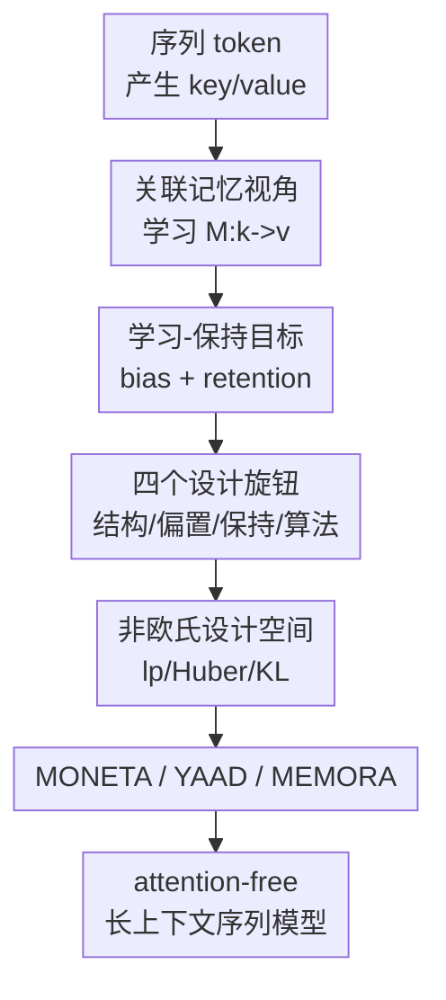

# It's All Connected: A Journey Through Test-Time Memorization, Attentional Bias, Retention, and Online Optimization

**会议**: ICLR2026  
**OpenReview**: [https://openreview.net/forum?id=gZyEJ2kMow](https://openreview.net/forum?id=gZyEJ2kMow)  
**代码**: 待确认  
**领域**: 优化 / 序列模型 / Test-Time Memorization  
**关键词**: 在线优化, 关联记忆, 注意力偏置, 记忆保持, 线性RNN  

## 一句话总结

这篇论文提出 MIRAS，把 Transformer、linear RNN、TTT/Titans 等序列模块统一解释为“测试时在线优化的关联记忆”，并用 attentional bias 与 retention 两个设计轴扩展出 MONETA、YAAD、MEMORA 三个 attention-free 模型，在语言建模、常识推理和长上下文 needle recall 上超过多种现代 recurrent baseline。

## 研究背景与动机

**领域现状**：长上下文序列建模里，Transformer 仍然强在 in-context learning 和精确检索，但 KV cache 随序列长度线性增长、注意力计算随长度二次增长。于是近几年大量工作转向 recurrent 或 linear recurrent backbone，例如 RetNet、Mamba/Mamba2、DeltaNet、Gated DeltaNet、TTT、Titans 等，希望把历史上下文压缩进固定大小的状态或记忆里，用更低的复杂度处理长序列。

**现有痛点**：这些模型表面上公式差异很大：有的写入外积，有的用 forget gate，有的用 delta rule，有的把记忆做成 MLP 并在测试时更新参数。但如果只从架构名字看，很难回答一个更根本的问题：模型到底在“学”什么、在“忘”什么、以及为什么某些遗忘门能稳定工作。更麻烦的是，已有统一框架往往仍停留在点积相似度、$\ell_2$ 回归或欧氏正则这个窄空间里，只能解释已有方法，不能自然地产生新的设计。

**核心矛盾**：固定容量 recurrent memory 的核心矛盾是学习新 token 与保留旧信息之间的冲突。新 token 到来时，记忆需要快速写入新的 key-value 关系；但每次写入都会改变同一个状态，如果更新过猛，就会污染或覆盖过去的上下文。论文认为，这个矛盾本质上不是某个具体架构的小技巧，而是在线优化中的“当前损失项”和“保持旧状态的正则项”之间的权衡。

**本文目标**：作者要做三件事：第一，给 Transformer 和现代 linear RNN 一个统一的关联记忆解释；第二，把 forget gate、retention、test-time memorization 统一到在线优化的正则化视角里；第三，利用这个视角系统探索非欧氏 attentional bias 和 retention gate，验证它们是否能带来更稳的记忆写入和更好的长上下文效果。

**切入角度**：论文从 associative memory 出发，把序列模块看成一个会在测试时学习映射 $M:k\mapsto v$ 的记忆算子。所谓 attentional bias，不再只是 attention score，而是“记忆内部用来判断什么该被写入”的学习目标；所谓 retention，也不再只是手写的遗忘门，而是限制当前记忆偏离过去状态的正则项。这个抽象把很多看似不同的 recurrence 写成同一个优化问题。

**核心 idea**：用在线优化重写序列模型的记忆更新：attentional bias 决定如何学习当前 key-value，retention gate 决定如何保留历史状态，由此既能统一现有架构，也能生成 $\ell_p$、Huber、KL/f-divergence 等新的记忆设计。

## 方法详解

### 整体框架

MIRAS 的整体框架很清晰：把每一层序列模块看成一个参数化记忆 $M(W, k)$，输入 token 产生 key/value 后，模型在测试时对记忆参数 $W$ 做一次或多次在线更新。更新的目标不是单纯拟合当前 token，而是在“当前 key-value 是否被记住”和“旧记忆是否被破坏”之间求解一个局部优化问题。

论文把一个 MIRAS 模块拆成四个设计选择：memory structure 决定记忆容量，例如 vector、matrix、MLP/GLU；attentional bias 决定新信息的学习目标，例如 dot-product、$\ell_2$、$\ell_p$、Huber；retention gate 决定稳定性正则，例如 $\ell_2$、$\ell_q$、KL 或 entropy；memory algorithm 决定如何优化这个目标，例如 GD、momentum、implicit GD、Newton/Muon 等。这样，很多已有模型只是四个选择的不同组合，而 MONETA、YAAD、MEMORA 是作者在这个设计空间里挑出的三个新实例。

### 关键设计

**1. 学习-保持视角：把测试时记忆写入改写成在线优化问题**

论文的第一步是把 associative memory 形式化为一个映射学习问题。给定 key 集合 $K$ 和 value 集合 $V$，记忆 $M$ 通过目标 $L(M(K);V)$ 学会从 key 召回 value；当记忆由参数 $W$ 表示时，每个新到来的 $(k_t, v_t)$ 都可以触发一次测试时参数更新。最朴素的梯度下降是 $W_t=W_{t-1}-\eta_t\nabla \ell(W_{t-1};k_t,v_t)$，其中 $\ell(W;k_t,v_t)=L(M(W,k_t),v_t)$。

关键在于，梯度下降本身等价于一个局部优化问题：

$$
W_t=\arg\min_W \langle W-W_{t-1},\nabla \ell(W_{t-1};k_t,v_t)\rangle + \frac{1}{2\eta_t}\|W-W_{t-1}\|_2^2.
$$

第一项近似“学当前 token”，第二项惩罚“离旧记忆太远”。MIRAS 把这个特殊的线性近似加 $\ell_2$ 正则推广成更通用的形式：

$$
W_t=\arg\min_{W\in\mathcal{W}} \tilde{\ell}_t(W;k_t,v_t)+\mathrm{Ret}_t(W,W_{t-1}).
$$

这里 $\tilde{\ell}_t$ 就是 attentional bias，$\mathrm{Ret}_t$ 就是 retention。这个写法的价值在于，它把“attention 如何聚焦”“RNN 如何遗忘”“TTT/Titans 如何在测试时学习”放到了同一个优化语义下：不是先有某个 gate 再解释它，而是先问在线优化里应该用什么目标和什么正则，再导出更新公式。

**2. Attentional bias 与 retention 解耦：从解释已有模型变成生成新模型**

已有模型大多落在同一个小角落：attentional bias 用 dot-product 或 $\ell_2$，retention 用 $\ell_2$ 或等价的 forget gate。论文在表 1 和附录中展示，Hebbian-like linear attention 可写成 dot-product bias 加 $\ell_2$ retention；DeltaNet/Gated DeltaNet 可写成 MSE 目标加局部 retention；Titans 可写成非线性 MSE 目标、局部/全局 $\ell_2$ retention 和带 momentum 的梯度下降。这说明 MIRAS 不是只给新模型服务，而是先把既有方法放到一张坐标系里。

更重要的是，坐标系一旦建立，设计空间就不再被 $\ell_2$ 和点积锁死。例如 $\ell_p$ attentional bias 写作 $L(M(W,k_t);v_t)=\|M(W,k_t)-v_t\|_p^p$。当记忆是线性映射 $M(W,k_t)=Wk_t$ 时，更新方向会包含 $\mathrm{Sign}(Wk_t-v_t)\odot |Wk_t-v_t|^{p-1}$。这意味着 $p$ 控制误差大小如何影响写入：$p=1$ 时更新只看符号，不让极端误差的幅度支配记忆；更大的 $p$ 会强调大误差样本。retention 也可以从 $\ell_2$ 扩到 $\ell_q$、Bregman divergence、KL/f-divergence 等，让“保留旧记忆”的几何形状随任务变化。

这种解耦很关键，因为 recurrent memory 的失败往往不是容量单一因素造成的。论文实验也支持这一点：TTT 同样使用 MLP memory，但 scaling 弱于 MIRAS 变体，说明“记忆更深”还不够，写入目标和保持目标也必须匹配。

**3. 三个实例化模型：用不同优化几何控制记忆污染**

MONETA、YAAD、MEMORA 是作者在 MIRAS 空间里挑出的三个代表性模型。它们都使用 2-layer MLP memory，带 expansion factor 4、GELU、residual connection 和 LayerNorm，可以看成比向量/矩阵状态更强的可学习记忆；区别在于 attentional bias 和 retention 的几何。

MONETA 用 $\ell_p$ attentional bias 和 $\ell_q$ retention，论文主实验采用 $(p,q)=(3,4)$。它的状态可以写成 $A_t=\beta_t A_{t-1}-\eta_t\nabla \ell(W_{t-1};k_t,v_t)$，再通过 $W_t=A_t/\|A_t\|_q^{q-2}$ 得到当前记忆。直观上，MONETA 不是用欧氏距离平均所有误差，而是让高阶范数改变写入和保持的敏感性，因此在 synthetic noise 的 needle task 上特别强。

YAAD 面向鲁棒性，使用 Huber loss 作为 attentional bias。当预测误差 $\|M(k_t)-v_t\|$ 小于阈值 $\delta_t$ 时，它按 $\ell_2$ 方式细致拟合；当误差超过阈值时，它切到类似 $\ell_1$ 的更新，限制 outlier 对记忆的破坏。这里的 $\delta_t$ 还是 input-dependent 的，模型可以根据上下文动态决定“这次错误是值得学习的新信息，还是应该被当作极端扰动”。

MEMORA 则把记忆约束在缩放概率单纯形上，用 KL divergence 做局部 retention、Shannon entropy 做全局 retention，对应更新近似为 $W_t \leftarrow c\,\mathrm{Softmax}((1-\lambda)\log W_{t-1}-\eta\nabla \ell(W_{t-1};k_t,v_t))$。它的含义是把记忆状态当成一种非负 measure 来维护，retention 不是欧氏空间里的距离，而是分布之间的偏离；这给数值稳定性和概率几何下的记忆管理提供了另一条路。

**4. 统一框架的实证闭环：解释、设计、替换 attention 模块并验证**

MIRAS 不只是一个理论分类表。作者把三种新 memory layer 替换进现代 sequence model block，构成纯 recurrent、attention-free 且可并行化的模型，再与 Transformer++、Mamba/Mamba2、DeltaNet、Gated DeltaNet、TTT、RetNet、GLA、Samba、Gated DeltaNet-H2 等比较。这样实验回答的是一个更具体的问题：如果在线优化视角真能指导架构设计，那么非欧氏 bias/retention 应该能在真实语言建模和长上下文任务中带来收益，而不是只在公式上漂亮。

这种闭环也让论文的理论贡献更有分量。附录里作者展示 Hebbian rule、Delta rule、Titans 等都可视为 MIRAS 特例；正文再用 MIRAS 生成新架构；最后用消融验证 retention gate、MLP memory、Huber 的 input-dependent 阈值和 $\ell_1/\ell_2$ 分支都确实贡献性能。换句话说，它不是“先造模型再找解释”，而是让解释框架直接约束模型搜索。

### 一个完整示例

可以把一个 recurrent memory layer 想成正在读一段长文。读到当前 token 时，上一层给出 key $k_t$ 和 value $v_t$。如果使用普通 $\ell_2$ delta rule，模型会根据 $M(W_{t-1},k_t)$ 与 $v_t$ 的差距做一次梯度更新，同时用 forget gate 或 $\ell_2$ 正则避免 $W_t$ 离 $W_{t-1}$ 太远。

在 MIRAS 里，同一个过程会被显式拆开。若采用 YAAD，模型先检查当前预测误差是否超过阈值 $\delta_t$：如果误差较小，它认为这是正常的新知识，于是用 $\ell_2$ 更新细致写入；如果误差极大，它不让误差幅度直接放大梯度，而是切到受控的 $\ell_1$ 型更新。这样，一段 haystack 里突然出现的噪声片段不会把全部固定容量记忆拉偏，而真正与后续 recall 相关的 key-value 仍可被写入。

若采用 MONETA，模型会通过 $p$ 和 $q$ 改变“新误差”和“旧状态”的几何。实验中 $p=3,q=4$ 在 S-NIAH-PK 这类合成噪声检索上表现突出，可以理解为它比传统 $\ell_2$ 更能把 distractor 对记忆的污染控制住。若采用 MEMORA，记忆状态被维护在单纯形上，更新像一次带 KL retention 的 softmax 投影，适合把记忆看成概率 measure 的场景。

### 损失函数 / 训练策略

训练上，论文把 MIRAS 变体作为 sequence model backbone 训练，而不是单独训练一个检索器。语言建模和常识推理实验使用 FineWeb-Edu，scaling pattern 使用 C4；模型规模包含 120M、340M、760M、1.3B，其中小模型训练 15B tokens，中等模型 30B tokens，大模型 100B tokens。附录给出的结构设置包括 340M/760M 级别的 block 数、hidden dim、head 数和 peak learning rate，例如 350M 使用 24 blocks、1024 hidden dim、16 heads、peak LR $1.5\times 10^{-3}$，780M 使用 24 blocks、1536 hidden dim、peak LR $1.25\times 10^{-3}$。

优化目标仍是标准语言建模或任务评估所需的 next-token prediction，MIRAS 的特殊性在于每层内部的 memory write rule。作者还报告了效率：在 8K context 下，Transformer、Mamba、DeltaNet、Titans 的训练吞吐约为 48、33、39、37 $(10^3\mathrm{T/s})$，MEMORA、YAAD、MONETA 分别约为 34、36、37 $(10^3\mathrm{T/s})$。这些变体没有专门 kernel 也能接近现代 recurrent backbone 的吞吐，说明它们不是纯理论上可行、工程上完全不可扩展的设计。

## 实验关键数据

### 主实验

论文主实验覆盖语言建模 perplexity、LAMBADA/PIQA/HellaSwag/WinoGrande/ARC/SIQA/BoolQ 等常识任务，以及 RULER 的 Single Needle-in-a-Haystack。下面保留最能说明问题的 1.3B 和 760M 结果。

| 模型 | 规模 / tokens | WikiText ppl ↓ | LAMBADA ppl ↓ | HellaSwag acc ↑ | ARC-c acc ↑ | Avg acc ↑ |
|------|---------------|----------------|---------------|-----------------|-------------|-----------|
| Transformer++ | 1.3B / 100B | 18.53 | 18.32 | 50.23 | 35.10 | 52.25 |
| Mamba2 | 1.3B / 100B | 16.56 | 12.56 | 55.67 | 37.88 | 54.89 |
| Gated DeltaNet | 1.3B / 100B | 16.42 | 12.17 | 55.76 | 38.39 | 55.32 |
| Gated DeltaNet-H2* | 1.3B / 100B | 15.91 | 12.55 | 56.88 | 39.07 | 56.18 |
| MONETA | 1.3B / 100B | 15.52 | 11.47 | 56.14 | 40.32 | 56.52 |
| YAAD | 1.3B / 100B | 15.18 | 11.89 | 56.46 | 40.05 | 56.39 |
| MEMORA | 1.3B / 100B | 15.90 | 12.04 | 55.99 | 37.92 | 55.87 |

| 模型 | S-NIAH-PK 8K ↑ | S-NIAH-N 8K ↑ | S-NIAH-W 4K ↑ | 平均 ↑ |
|------|----------------|---------------|---------------|--------|
| Mamba2 | 31.0 | 14.2 | 4.2 | 52.0 |
| DeltaNet | 98.6 | 12.8 | 20.0 | 57.9 |
| Gated DeltaNet | 90.0 | 26.4 | 24.4 | 75.8 |
| TTT | 98.0 | 10.2 | 28.0 | 66.1 |
| MONETA | 98.8 | 92.8 | 70.8 | 93.5 |
| YAAD | 94.4 | 93.2 | 67.4 | 92.9 |
| MEMORA | 92.6 | 93.2 | 70.4 | 92.1 |

### 消融实验

| 配置 | MEMORA Avg | MONETA Avg | 说明 |
|------|------------|------------|------|
| Full Architecture | 51.52 | 52.12 | 完整 MLP memory + retention + RoPE |
| w/o Retention Gate | 49.75 | 50.49 | 去掉 retention 后下降，说明稳定旧记忆不是可有可无 |
| linear memory | 50.11 | 50.26 | 把 MLP memory 换成线性记忆后下降，说明表达性记忆有贡献 |
| w/o RoPE | 51.28 | 51.71 | RoPE 有帮助，但不是主要增益来源 |

| YAAD 配置 | Avg LM | 说明 |
|-----------|--------|------|
| YAAD | 53.98 | 完整 Huber bias + retention + input-dependent threshold |
| - Retention Gate | 50.63 | 最大下降，说明鲁棒 loss 仍需要稳定正则配合 |
| linear memory | 51.57 | MLP memory 比线性记忆更能利用测试时写入 |
| - Input-dependent $\delta$ | 52.19 | 阈值随输入变化有明显收益 |
| 仅 $\ell_2$ 分支 | 52.86 | 去掉 Huber 的鲁棒切换后下降 |
| 仅 $\ell_1$ 分支 | 53.04 | 只保留抗 outlier 更新也不如完整 Huber |

### 关键发现

- MIRAS 三个变体在 1.3B / 100B tokens 下都超过大多数 pure recurrent baseline；MONETA 和 YAAD 甚至超过 hybrid Gated DeltaNet-H2 的平均准确率，说明 attention-free recurrent backbone 通过更好的 memory optimization 仍有竞争力。
- Needle-in-a-Haystack 是最能体现 retention 和 non-Euclidean bias 的实验。MONETA、YAAD、MEMORA 平均准确率都在 92% 以上，而 Mamba2、DeltaNet、TTT 分别为 52.0、57.9、66.1，差距非常大。
- 参数敏感性里，MONETA 的 $p$ 不是越大越好；论文报告 $p=3$ 最好、$p=4$ 最差，说明高阶范数提供设计自由度，但需要调到合适几何。$q$ 对 context length scaling 影响更明显，因为它直接塑造 retention gate。
- MAD synthetic benchmark 上，论文称 MIRAS 变体整体超过 baseline，尤其在 memorization 相关子任务上提升更明显；这与“test-time memorization 需要更好的 bias/retention”这个主张一致。
- 局限也很明确：复杂 in-context retrieval 任务里，quadratic Transformer 仍然最好。MIRAS 改进了 recurrent memory management，但还没有完全替代显式全局 attention 的精确检索能力。

## 亮点与洞察

- **把 forget gate 翻译成正则项**：这点非常有启发。很多论文把 gate 当成经验设计，MIRAS 则说 gate 是在线优化里“别离旧状态太远”的 retention regularizer。这个解释让不同架构之间的比较从公式堆叠变成了优化目标的比较。
- **attentional bias 不是 attention score 的同义词**：论文重新定义了 bias，它指记忆内部偏向学习哪类 key-value 关系的目标函数。这样一来，Huber、$\ell_p$、KL/f-divergence 都能成为“注意力偏置”的候选，而不是只能在 softmax dot-product 附近微调。
- **非欧氏几何直接对应记忆鲁棒性**：MONETA 在 noisy needle recall 上强，YAAD 的 Huber 分支对 outlier 有保护作用，MEMORA 用 KL/entropy 维持概率单纯形。这些设计都把统计鲁棒性和序列记忆污染联系起来，给长上下文模型设计提供了很自然的迁移方向。
- **统一框架有生成能力**：很多理论统一工作只能事后解释已有方法；MIRAS 的价值在于它从解释走到了生成，真正推出了三类可训练、可扩展、性能不错的新模型。
- **对 TTT/Titans 方向很有启发**：如果把测试时更新看成在线优化，那么后续不仅可以换 memory structure，也可以换 approximation、regularizer、optimizer。比如复杂检索任务可能需要把 MIRAS retention 与显式 memory cache、检索式 attention 或可学习读写策略结合。

## 局限与展望

- 论文虽然说 MIRAS 能统一很多架构，但实证重点仍放在三个作者选出的实例上；更大的 design space，例如 Bregman/f-divergence retention、elastic net、不同 optimizer 的组合，还没有系统搜索。
- 复杂 in-context retrieval 仍是短板。作者也承认，在 SWDE、NQ、DROP、SQuAD、TQA 等更接近真实信息检索的问题上，Transformer 仍然领先，这说明固定大小 recurrent memory 很难完全复现全局 attention 的逐 token 精确访问。
- 实验规模已经到 1.3B / 100B tokens，但还没有证明在更大 foundation model 规模上，MIRAS 变体的 scaling 会继续保持优势。尤其是与高度优化的 Transformer/Mamba kernel 相比，实际训练成本、稳定性和部署复杂度还需要更大规模验证。
- 论文主要从 backbone 角度讨论记忆更新，较少分析不同数据分布下应该如何自动选择 $p,q,\delta,\lambda$ 等几何超参。后续可以考虑把这些参数做成任务自适应或层自适应，而不是固定成少数组合。
- 一个自然展望是把 MIRAS 与显式 retrieval/memory cache 结合：用 MIRAS 管理压缩记忆，用外部 cache 或 sparse attention 处理必须精确召回的少数 token，从而弥补 recurrent model 在复杂 in-context retrieval 上的弱点。

## 相关工作与启发

- **vs Transformer**: Transformer 用显式 attention 在上下文中做非参数化检索，长处是精确访问任意历史 token，短处是 KV cache 和注意力计算随长度增长。MIRAS 则把历史压缩进可更新记忆，优势是 attention-free 和固定状态，劣势是在复杂精确检索上仍不如 quadratic attention。
- **vs Mamba2 / RetNet / GLA**: 这些方法可被看成 dot-product bias 加 $\ell_2$ retention 或类似 Hebbian 写入的 MIRAS 特例。本文不是否定它们，而是指出它们共享一个窄的优化几何；一旦换成 $\ell_p$、Huber、KL 等设计，就能得到更鲁棒的记忆更新。
- **vs DeltaNet / Gated DeltaNet**: Delta rule 已经比 Hebbian 写入更会“替换错误 value”，但仍主要基于 $\ell_2$ MSE。MONETA 和 YAAD 相当于把这个 MSE 目标推广到更鲁棒或更高阶的损失，并用 retention gate 显式约束 memory stability。
- **vs TTT / Titans**: TTT 和 Titans 都强调测试时学习，尤其 Titans 的 neural memory 与 surprise 更新和 momentum 很接近 MIRAS 语境。MIRAS 的区别在于把这些机制抽象为四个设计旋钮，并进一步说明 Titans 只是特定 bias、retention 和 optimizer 的实例。
- **启发**: 对未来长上下文模型，值得把“记忆容量”“写入目标”“保持几何”“优化器”分开搜索，而不是只比较某个 recurrence 公式。尤其在有噪声、长序列、多任务混合的数据里，鲁棒统计里的 Huber、$\ell_1/\ell_p$、KL/f-divergence 可能是比手工 gate 更原则化的设计来源。

## 评分

- 新颖性: ⭐⭐⭐⭐⭐ 从在线优化统一 test-time memorization、attention bias 和 retention，并进一步生成新架构，概念整合度很高。
- 实验充分度: ⭐⭐⭐⭐☆ 覆盖语言建模、常识推理、长上下文 recall、MAD、消融和效率，但复杂 in-context retrieval 仍显示短板，设计空间也未完全系统搜索。
- 写作质量: ⭐⭐⭐⭐☆ 主线清晰，表 1 的统一视角很有帮助；但公式和变体较多，部分附录推导对普通读者门槛偏高。
- 价值: ⭐⭐⭐⭐⭐ 对 long-context recurrent backbone、TTT-style test-time learning 和记忆优化都有直接启发，是一篇能改变架构设计思路的框架型论文。

<!-- RELATED:START -->

## 相关论文

- [\[ICML 2026\] Test time training enhances in-context learning of nonlinear functions](../../ICML2026/optimization/test_time_training_enhances_in-context_learning_of_nonlinear_functions.md)
- [\[ICML 2026\] TPV: Parameter Perturbations Through the Lens of Test Prediction Variance](../../ICML2026/optimization/tpv_parameter_perturbations_through_the_lens_of_test_prediction_variance.md)
- [\[CVPR 2025\] Test-Time Augmentation Improves Efficiency in Conformal Prediction](../../CVPR2025/optimization/test-time_augmentation_improves_efficiency_in_conformal_prediction.md)
- [\[ICLR 2026\] Derandomized Online-to-Non-convex Conversion for Stochastic Weakly Convex Optimization](derandomized_online-to-non-convex_conversion_for_stochastic_weakly_convex_optimi.md)
- [\[ICLR 2026\] Landing with the Score: Riemannian Optimization through Denoising](landing_with_the_score_riemannian_optimization_through_denoising.md)

<!-- RELATED:END -->
