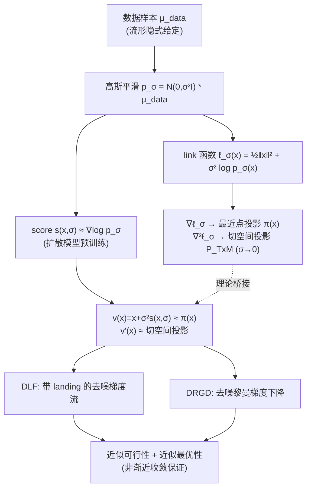

# Landing with the Score: Riemannian Optimization through Denoising

**会议**: ICLR 2026  
**OpenReview**: [https://openreview.net/forum?id=xZNoeX0z9f](https://openreview.net/forum?id=xZNoeX0z9f)  
**代码**: 待确认  
**领域**: optimization  
**关键词**: 黎曼优化, 扩散模型, score function, 数据流形, 去噪, 数据驱动控制  

## 一句话总结
当流形只能通过数据样本隐式给出时，本文用扩散模型学到的 score 函数及其 Jacobian 来近似流形上的「最近点投影」和「切空间投影」，从而把经典黎曼优化搬到了只有数据、没有显式几何的场景，并给出两个推理期算法（DLF / DRGD）与非渐近收敛保证。

## 研究背景与动机

**领域现状**：经典黎曼优化（Riemannian optimization, RO）研究在一个**显式已知**的嵌入子流形 $\mathcal{M}\subseteq\mathbb{R}^d$ 上最小化目标 $\min_{x\in\mathcal{M}} f(x)$。它通过 retraction、切空间投影、指数映射等几何操作让迭代点始终落在流形上（feasible method），从而获得数值鲁棒、可早停、适合实时控制等好处。典型算法是黎曼梯度下降：沿切空间走一步、再 retract 回流形。

**现有痛点**：这套机器全部依赖**显式的几何操作**。但在「数据流形假设」下，真实世界的图像、系统轨迹、翼型形状等都近似落在一个低维流形上，而这个流形只能通过一组样本 $\mu_{\text{data}}$ **隐式**给出——没有解析的投影、retraction 或指数映射可用。经典 RO 因此无法直接落地。已有的流形学习（Isomap、LLE、自编码器、GAN）只关心「学出流形几何 / 坐标卡」，没人从**优化**角度处理 $\min_{x\in\mathcal{M}}f$ 这个约束问题。

**核心矛盾**：一边是成熟但需要显式几何的经典 RO，一边是只有样本、几何隐式的现代生成式 / 设计任务（翼型设计、增材制造、数据驱动控制、贝叶斯反问题）。如何在「只有数据」的情况下，恢复出优化所需的几何操作，是把 RO 推广到这些任务的关键缺口。

**本文目标**：在流形仅由数据分布隐式给定时，重建黎曼优化所需的基本操作（投影、切空间投影），并据此设计带收敛保证的高效优化算法。

**核心 idea**（**link function 桥接几何与 score**）：定义一个把数据分布与几何量绑定的 link 函数 $\ell_\sigma(x)=\tfrac12\|x\|^2+\sigma^2\log p_\sigma(x)$，其中 $p_\sigma=\mathcal{N}(0,\sigma^2 I)*\mu_{\text{data}}$ 是高斯平滑后的数据分布。本文证明：当噪声 $\sigma\to 0$ 时，$\nabla\ell_\sigma$ 收敛到流形上的最近点投影 $\pi(x)$，$\nabla^2\ell_\sigma$ 收敛到切空间投影 $P_{T_x\mathcal{M}}$。而 $\nabla\log p_\sigma$ 正是扩散模型里的 **score function**——于是可以**直接复用预训练 score 网络**来实现这些几何操作，无需任何额外训练。

## 方法详解

### 整体框架
方法分两层：**理论层**把「流形几何操作」翻译成「score 及其 Jacobian」；**算法层**在此基础上设计两个推理期优化算法。给定预训练 score 网络 $s(x,\sigma)\approx\nabla\log p_\sigma(x)$，用 $v(x)=x+\sigma^2 s(x,\sigma)$ 近似最近点投影 $\pi(x)$，用其 Jacobian $v'(x)$ 近似切空间投影。整个流程只需要对网络做**前向推理 + 对输入求梯度**（而非对参数求梯度），因此若已有预训练 score，便可零额外训练地完成流形优化。

### 关键设计

**1. Link 函数：把 score 解读成投影算子（理论基石）。** 整个工作的支点是一个看似简单却深刻的等式。对高斯模糊分布 $p_\sigma=\mathcal{N}(0,\sigma^2 I)*\mu$，借助 Tweedie 公式可得 $x+\sigma^2\nabla\log p_\sigma(x)=\nabla\ell_\sigma(x)=\mathbb{E}\,\nu_{x,\sigma}$，以及 $I+\sigma^2\nabla^2\log p_\sigma(x)=\nabla^2\ell_\sigma(x)=\tfrac{1}{\sigma^2}\mathrm{Cov}(\nu_{x,\sigma})$，其中 $\nu_{x,\sigma}$ 是在噪声模型 $p_\sigma$、先验 $\mu$ 下观测到 $x$ 的后验。本文的核心定理（Theorem 1）证明：当 $\mu$ 的支撑是流形 $\mathcal{M}$ 时，在 $\mathcal{M}$ 的管状邻域上，这两个量**一致地**逼近最近点投影及其 Jacobian——$\|\mathbb{E}\,\nu_{x,\sigma}-\pi(x)\|\le K\sigma|\log\sigma|^3$ 且 $\|\tfrac{1}{\sigma^2}\mathrm{Cov}(\nu_{x,\sigma})-\pi'(x)\|\le K\sigma|\log\sigma|^3$。这把「投影」「retraction」这些几何操作彻底变成了 score 的代数运算，证明依赖对 Laplace 积分法的非渐近精细估计。它的意义在于：之前 Stanczuk 等人只观察到「score 渐近正交于流形」，本文则给出了**带速率的一致逼近**，使得它能支撑后续优化算法的收敛分析。

**2. DLF：带 landing 的去噪梯度流（infeasible 路线）。** 在切空间投影 $P_\sigma(x)=I+\sigma^2\nabla^2\log p_\sigma$ 和投影 $\pi_\sigma(x)=x+\sigma^2\nabla\log p_\sigma$ 的记号下，DLF 定义连续动力学 $\dot x=-v'(x)\nabla f(v(x))+\eta(v(x)-x)$。在精确情形（$v=\pi_\sigma,\ v'=P_\sigma$）这正是惩罚目标 $F_\sigma^\eta(x)=f(\pi_\sigma(x))+\eta\,d_\sigma(x)$ 的梯度流：第一项 $P_\sigma\nabla f(\pi_\sigma)$ 是把目标梯度投影到（近似）切空间，第二项 $\eta(\pi_\sigma-x)$ 是把点往流形上「拽」的 **landing 项**（对应到流形的距离惩罚）。它借鉴了 Ablin & Peyré 的 landing 思想——**不强制每一步都落在流形上**，而是用惩罚项逐渐收紧可行性，从而避免昂贵的 retraction。当 $\sigma=0$ 且初值在流形上时退化为经典黎曼梯度流；当 $\sigma=0$ 但初值只在管状邻域时，切向与法向两项正交，保证到流形距离单调不增、最终「完美着陆」。Theorem 3 给出非渐近保证：流形偏差与黎曼梯度范数都被控制在 $\tilde{O}(\sigma)$ 加上 score 误差 $\epsilon$ 的量级。一个实现上的巧思（Remark 4）是整个右端项只需对网络做**一次前向 + 一次反向**：前向算 $p=v(x)$ 并保留计算图，再对 $y=\langle v(x),g\rangle$（其中 $g=\nabla f(p)$ 被 detach）反传，即可一次性得到 $v'(x)\nabla f(v(x))$。

**3. DRGD：去噪黎曼梯度下降（feasible 路线 + 离散化）。** 实际计算需要离散版本。DRGD 把经典黎曼梯度下降里的 retraction 和切空间投影分别替换成学到的 $v$ 和 $v'$：$x_{k+1}=v\!\big(x_k-\gamma_k v'(x_k)\nabla f(x_k)\big)$。这里 $v$ 充当近似 retraction（把更新后的点拉回流形附近），$v'$ 充当近似切空间投影。它比 DLF 更贴近真实算法实现，且每步同样廉价。Theorem 5 给出平均梯度范数界：$\tfrac1N\sum_k\|\mathrm{grad}_\mathcal{M}f(p_k)\|^2\le 4D/N+(\cdots)\epsilon'$，其中 $\epsilon'=\epsilon+K\sigma|\log\sigma|^3$，随 $N\to\infty$ 与几何操作误差 $\epsilon'\to 0$ 而收敛到零。当 $\epsilon=\sigma=0$ 时，这个界（up to constants）正好退化为经典黎曼梯度下降在已知流形、非凸目标下的标准结果，说明该框架是经典 RO 的严格推广。

## 实验关键数据

### 主实验：数据驱动控制（参考轨迹跟踪）
在有限时域最优控制问题上验证 DRGD：给定离散时间系统的输入输出轨迹样本，求输入 $u$ 使输出 $y$ 跟踪参考轨迹 $r$，目标为 $f(u,y)=\sum_k u_k^\top R u_k+(y_k-r_k)^\top Q(y_k-r_k)$。系统行为流形 $\mathcal{M}_{IO}$ 只通过测量轨迹隐式给定。

| 系统 | 时域 $N_h$ | 迭代预算 | 关键观察 |
|------|-----------|---------|---------|
| 双摆 (double pendulum) | 100 | 3000 | $\|y^*-y_{\text{true}}\|$ 小，解接近真实系统行为流形 |
| 独轮车 (unicycle car) | 100 | 2500 | $y_{\text{true}}$ 对参考 $r$ 的跟踪显著优于训练集最优 $y_0$ |

关键结论：以训练集中目标值最小的轨迹为初值，DRGD 优化得到的输入回代到真实系统后，跟踪误差比训练集最优轨迹更小——体现扩散模型的**泛化能力**（能生成比任何训练样本都好的可行解）。

### 合成实验：正交群 O(n) 上的 Brockett 代价
在 $\mathcal{M}=O(n)\subseteq\mathbb{R}^{n\times n}$、目标 $f(X)=\mathrm{tr}(AXQX^\top)$ 上对比 DLF 与精确 landing flow。

| 设置 | 数据量 | 现象 |
|------|--------|------|
| $n=10$，多个 $\sigma>0$ | 20000 | $\sigma\to 0$ 时近似越来越精确，逼近精确 landing flow |
| $n=20$，$\sigma=0.05$ | 20000 | 能得到**比训练集最优点更低**的目标值 |

### 关键发现
- score + Jacobian 足以替代显式 retraction / 切空间投影，且近似精度随 $\sigma\to 0$ 系统性提升。
- 优化可以「越过」训练数据：生成的可行点目标值低于训练集中任何样本，说明深度网络的强归纳偏置被有效用于约束优化。
- DRGD 对「moderate 偏离流形」鲁棒——中间迭代即便脱离 $\mathcal{M}_{IO}$ 也能恢复。

## 亮点与洞察
- **概念上的「翻译」最漂亮**：把扩散模型里最核心的 score 重新解读为黎曼优化里的投影算子，一行 link 函数同时打通了「几何（投影/切空间）↔ 概率（后验均值/协方差）↔ 学习（score 网络）」三个世界。
- **零额外训练的推理期算法**：只要有预训练 score 就能做流形优化，且只需对网络输入求梯度，不碰参数——契合当下「inference-time scaling」的趋势。
- **理论扎实**：Theorem 1 给出带 $\sigma|\log\sigma|^3$ 速率的一致逼近，进而支撑两个算法的非渐近收敛，且在 $\epsilon=\sigma=0$ 时干净地退化为经典 RO 结果。
- **明确区分「优化」与「后验采样」**：作者专门论述了本文的约束优化形式与 classifier guidance / 贝叶斯反问题里的后验采样 $p_{\text{post}}\propto p_{\text{pre}}\exp(-r/\alpha)$ 的本质差异——后者因预训练扩散先验支撑在全空间，$\alpha$ 太小会把样本推离流形、丧失语义，而本文直接强制流形约束，保证最终可行且语义有意义。

## 局限与展望
- **强假设依赖**：两个收敛定理都要求 score 网络满足 $L^\infty$ 逼近（(7) 式对 $v$ 及其 Jacobian 的一致界），这在实践中相当强；作者承认更弱的 $L^2$ 误差下的分析超出本文范围，留作未来工作。
- **收敛速度未加速**：DRGD 在双摆 / 独轮车实验中迭代到预算上限时目标仍在下降（3000 / 2500 步），说明收敛较慢，加速被列为 future work。
- **中间迭代脱离流形**：DRGD 的当前目标值可能因迭代偏离 $\mathcal{M}_{IO}$ 而显著偏离真实目标，虽然实验显示能恢复，但缺乏对该偏离的理论刻画。
- **算法仍偏基础**：只实现了梯度流 / 梯度下降；作者展望把 Newton、trust-region 等更高级的经典 RO 算法搭配学到的几何操作以加速收敛。
- **实验规模有限**：合成流形（O(n)）+ 两个低维控制系统，尚未在高维真实数据流形（图像、翼型）上验证，尽管动机大量引用这些场景。

## 相关工作与启发
- **经典黎曼优化**（Boumal 2023；Absil 2008）：本文是其在「隐式流形」下的推广，feasible（DRGD）与 infeasible/landing（DLF）两条路线都对应到经典分类。
- **Landing 算法**（Ablin & Peyré 2022；Schechtman 2023）：DLF 直接继承「用距离惩罚替代逐步 retraction」的思想。
- **扩散模型与流形几何**：Stanczuk 等（2024）观察到 score 渐近正交于流形并用于估计流形维度；Ventura 等（2024）在线性流形上把 score 的 Jacobian 与法空间投影联系起来——本文把这些零散观察系统化为「一致逼近 + 可优化」的完整框架。
- **图上的流形优化**（Wang 2025）：同样处理隐式流形但走非参数离散搜索路线，无法利用深度学习；本文走参数化 + 连续优化路线。
- **启发**：把「预训练大模型内部隐含的几何 / 物理结构」当作可微的算子来调用（而非仅用于采样），是一个值得推广的范式——score 能当投影，那 Hessian、高阶导数还能恢复出哪些几何量（曲率、测地线）？这为「用生成模型做约束优化 / 设计」提供了干净的理论接口。

## 评分
- **新颖性**: ⭐⭐⭐⭐⭐ 把 score 重新解读为流形投影算子、首个基于预训练 score 的数据流形优化框架，概念桥接非常漂亮且原创。
- **实验充分度**: ⭐⭐⭐ 合成 O(n) + 两个低维控制系统验证了核心主张，但缺高维真实数据流形实验，迭代预算下目标仍在下降。
- **写作质量**: ⭐⭐⭐⭐ 动机—理论—算法—实验逻辑清晰，专门澄清了与后验采样的区别，理论陈述严谨；公式密度高对读者要求较高。
- **价值**: ⭐⭐⭐⭐ 为「用扩散模型做约束优化 / 数据驱动设计与控制」提供了带保证的理论接口，对生成式设计、数据驱动控制社区有较强延展价值。

<!-- RELATED:START -->

## 相关论文

- [\[ICLR 2026\] Riemannian Optimization on Relaxed Indicator Matrix Manifold](riemannian_optimization_on_relaxed_indicator_matrix_manifold.md)
- [\[ICLR 2026\] Scalable Second-Order Riemannian Optimization for K-means Clustering](scalable_second-order_riemannian_optimization_for_k-means_clustering.md)
- [\[ICLR 2026\] Generalizable Heuristic Generation Through LLMs with Meta-Optimization](generalizable_heuristic_generation_through_llms_with_meta-optimization.md)
- [\[ICLR 2026\] Strongly Convex Sets in Riemannian Manifolds](strongly_convex_sets_in_riemannian_manifolds.md)
- [\[ICLR 2026\] Provably Accelerated Imaging with Restarted Inertia and Score-based Image Priors](provably_accelerated_imaging_with_restarted_inertia_and_score-based_image_priors.md)

<!-- RELATED:END -->
