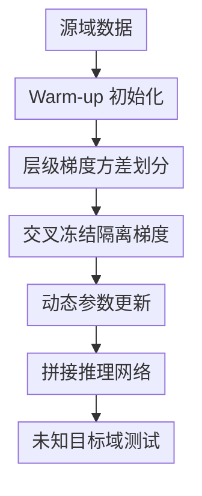

# LDT: Layer-Decomposition Training Makes Networks More Generalizable

**会议**: ICLR 2026  
**OpenReview**: [https://openreview.net/forum?id=jLpjcY1iry](https://openreview.net/forum?id=jLpjcY1iry)  
**代码**: https://github.com/ZaizuoTang/LDT  
**领域**: 优化 / 训练方法 / 域泛化  
**关键词**: 层分解训练, 域泛化, 梯度方差, 参数稳定性, 动态参数更新  

## 一句话总结
LDT 把网络层按梯度方差细分为稳定层和不稳定层，再用双分支交叉冻结与动态 EMA 更新切断不稳定层对稳定层的梯度扰动，从而在超分、分类、语义分割和 NLP 域泛化任务上提升跨域泛化能力。

## 研究背景与动机
**领域现状**：域泛化的目标是在只看到源域数据的情况下，让模型在未知目标域上仍然可靠。视觉任务里常见做法大致有两类：一类从输入或特征层面做增强，例如 Mixup、CutMix、频域扰动、风格扰动；另一类显式学习域不变特征，把域相关因素压下去，把对任务更稳定的表征保留下来。

**现有痛点**：这些方法大多围绕样本、特征或网络结构做文章，对“参数之间如何互相影响”关注不够。微调场景里已经有 LP-FT 和 DeFT 这样的工作指出，随机初始化的预测头会扰乱预训练 backbone 的特征，因而需要 warm-up 或解耦微调；但它们通常把 backbone 整体当成稳定部分，把预测头整体当成不稳定部分。

**核心矛盾**：这种 backbone/head 粗粒度划分并不可靠。论文的梯度统计显示，backbone 内部有些层的梯度方差甚至高于预测头，说明“预训练 backbone 就稳定、随机 head 就不稳定”只是一个过粗的近似。一旦不稳定层被误归入稳定层，它的随机梯度波动会沿反向传播影响其他层的更新，最终削弱网络对目标域分布变化的适应能力。

**本文目标**：作者要解决两个具体问题。第一，如何在层级粒度上识别真正容易波动的不稳定层，而不是只按模块名或网络位置粗分。第二，识别之后如何训练，让稳定层不再被不稳定层的梯度拖着走，同时又不把不稳定层彻底冻死，保留必要的学习能力。

**切入角度**：梯度本身记录了当前样本对参数更新方向和幅度的影响。若一个层在同一源域分布下对不同样本产生高度随机、方差很大的梯度，作者将其视为对输入分布更敏感的层；反过来，低方差梯度意味着更新方向更一致，更像是稳定可泛化的特征学习信号。因此，梯度方差成为 LDT 区分稳定层与不稳定层的核心依据。

**核心 idea**：用“层级梯度方差”替代“backbone/head 名义划分”来识别不稳定层，再通过交叉冻结的双网络训练和按方差排序生成的动态 EMA 系数，让不同稳定性的层以不同节奏更新。

## 方法详解

### 整体框架
LDT 的训练流程可以理解为三步：先 warm-up 预测头，避免随机 head 直接污染后续梯度统计；再在另一部分源域样本上收集每一层的梯度方差，并按方差大小把层分成稳定层和不稳定层；最后复制出 primary network 和 auxiliary network，用交叉冻结隔离梯度路径，并用动态参数更新（Dynamic Parameter Update, DPU）在两个分支之间交换被冻住部分的参数。

训练结束后，LDT 不保留两个完整网络一起推理，而是从 auxiliary network 取冻结稳定层，从 primary network 取冻结不稳定层，拼成一个 composite network 用于测试。因此它训练时有额外双分支开销，但推理阶段仍然是一条普通网络路径。

### 关键设计
**1. 层级梯度方差划分：把真正波动的 backbone 层也找出来**

LDT 首先把源域样本拆成两个子集 $D_S=\{D_{S1},D_{S2}\}$。在 warm-up 阶段，它用 $D_{S1}$ 初始化网络，主要是让预测头摆脱完全随机状态，避免随机权重让梯度方差统计失真。随后用 $D_{S2}$ 前向和反向，但不更新参数，只保存每一层在不同样本上的梯度。

对每一层，LDT 计算跨样本梯度方差 $Var_i$。方差越大，表示该层面对同一源域分布里的样本仍然产生更随机的更新方向，更可能对 domain shift 敏感。论文将方差排名靠前的一定比例层记为不稳定层 $Name_U$，其余层记为稳定层 $Name_S$：$Name_U=TopN(Var, Ratio_U, M)$，$Name_S=Name_{All}-Name_U$。这一步的关键不是“找大梯度”，而是“找更新方向不一致的层”：大梯度可能来自有效学习新模式，而高方差更接近随机波动。

**2. 交叉冻结双分支：让稳定层和不稳定层各走自己的梯度通道**

识别层集合后，LDT 复制出 primary network（PM）和 auxiliary network（AM）。在 PM 里冻结不稳定层，只让稳定层通过任务损失更新；在 AM 里冻结稳定层，只让不稳定层通过任务损失更新。这样，稳定层的梯度更新不再经过同一网络中剧烈波动的不稳定层，反过来不稳定层也可以在另一个分支中单独学习。

更具体地，PM 的可训练部分是 $PL^S$，冻结部分是 $\widetilde{PL}^U$；AM 的可训练部分是 $AL^U$，冻结部分是 $\widetilde{AL}^S$。两个分支各自前向得到 $y^P$ 和 $y^A$，损失梯度只更新未冻结层：$\Delta P_\theta^S=grad(y^P,y)$，$\Delta A_\theta^U=grad(y^A,y)$。这比 DeFT 的 backbone/head 解耦更细，因为它不是保护整个 backbone，而是只保护那些被方差统计判为稳定的层。

**3. EMA 跨分支补偿：隔离梯度但不切断参数协同**

如果只是交叉冻结，两个分支会变成各训各的半个网络，层之间的协同会被削弱。LDT 因此用 EMA 把一个分支中可训练层的参数传给另一个分支中对应的冻结层。稳定层在 PM 中通过梯度学习后，用来更新 AM 里的冻结稳定层；不稳定层在 AM 中通过梯度学习后，用来更新 PM 里的冻结不稳定层。

固定系数版本可以写成 $\widetilde{A}_{\theta,t+1}^S=W_f\widetilde{A}_{\theta,t}^S+(1-W_f)P_{\theta,t+1}^S$，以及 $\widetilde{P}_{\theta,t+1}^U=W_f\widetilde{P}_{\theta,t}^U+(1-W_f)A_{\theta,t+1}^U$。当 $W_f$ 越接近 1，被冻结层吸收对侧分支新参数的速度越慢，等价于参考更多历史时刻来平滑更新。这一设计让 LDT 同时做到两件事：梯度路径上隔离扰动，参数层面仍保持稳定-不稳定层之间的配合。

**4. 动态参数更新：让越不稳定的层更新得越慢**

论文进一步指出，同为稳定层或同为不稳定层，方差幅度也差很多；给所有层同一个 EMA 系数会浪费信息。DPU 因此先分别在稳定层集合和不稳定层集合内部按方差降序排序，得到每层的相对排名 $Rank_i^S$ 和 $Rank_j^U$，再把排名映射成层专属更新系数：$W_i^S=W^S_{Base}+Rank^S_{Base}Rank_i^S$，$W_j^U=W^U_{Base}+Rank^U_{Base}Rank_j^U$。

论文默认 $W^S_{Base}=0.99$、$Rank^S_{Base}=0.01$，不稳定层侧为 $W^U_{Base}=0.999$、$Rank^U_{Base}=0.001$。直觉上，方差越高的层越需要慢一点吸收新参数，让多步历史共同平滑它；方差较低的层则可以更快更新，以免泛化能力强的层被过度保守的 EMA 压住学习效率。DPU 的价值在于把“层稳定性”从一个二值标签扩展成连续的更新节奏。

### 损失函数 / 训练策略
训练过程包含两个主要阶段。第一阶段是 stable/unstable 层识别：冻结 backbone 名称对应的部分，只 warm-up 预测头若干步；然后解冻网络，在不更新参数的情况下对 $D_{S2}$ 收集每层梯度，计算方差并取前 $Ratio_U$ 比例作为不稳定层。论文在超分任务中发现 $Ratio_U=0.4$ 或 $0.5$ 较好，在语义分割任务中 $0.7$ 更合适，说明这个比例和任务、架构有关。

第二阶段是交叉冻结训练。每次迭代中，PM 和 AM 分别前向，PM 的 loss 更新稳定层，AM 的 loss 更新不稳定层；随后 DPU 根据方差排名给每层生成 $W^S$ 或 $W^U$，再用对侧可训练层的当前参数更新本侧冻结层。推理时构造 $M_C=Cat\{\widetilde{AL}^S,\widetilde{PL}^U\}$，只用这一条组合网络预测 $y=M_C(x)$。

作者还在附录给出单分支版本 LDT-S。LDT-S 不复制完整双网络，而是在一个网络里按时间段交替冻结稳定层和不稳定层，并用 CPU weight buffer 保存上一时刻权重。它的性能略低于 LDT，但训练显存和时间接近 baseline，适合资源受限场景。

## 实验关键数据

### 主实验
论文把 LDT 放在多个任务和架构上验证，包括超分辨率、图像分类、语义分割和 NLP 域泛化。主表中最充分的是 DRealSR 超分实验：以 Olympus 相机分支作为源域，其余相机作为目标域，MambaIR 作为基础网络，报告 PSNR/SSIM。

| 方法 | Pan | Sony | DSC | IMG | Canon |
|------|-----|------|-----|-----|-------|
| Baseline | 30.81/0.8688 | 30.81/0.8850 | 30.22/0.8753 | 30.01/0.8737 | 30.93/0.8617 |
| LDT | 31.20/0.8631 | 31.25/0.8746 | 31.23/0.8869 | 30.17/0.8730 | 32.33/0.9236 |
| LDT + DPU | 31.36/0.8611 | 32.15/0.8880 | 31.51/0.8865 | 30.57/0.8705 | 32.80/0.9246 |

与其他域泛化或域适应方法比较时，MambaIR + LDT 在五个目标相机分支上整体最强，尤其 Sony 从 DeFT 的 31.61/0.8801 提升到 32.15/0.8880，Canon 从 DeFT 的 32.40/0.9247 提升到 32.80/0.9246。

| 方法 | Pan | Sony | DSC | IMG | Canon |
|------|-----|------|-----|-----|-------|
| Wang et al. 2024 | 31.28/0.8626 | 31.53/0.8818 | 31.34/0.8875 | 30.42/0.8775 | 32.72/0.9269 |
| DTAM | 31.23/0.8615 | 31.29/0.8773 | 31.29/0.8864 | 30.32/0.8747 | 32.65/0.9256 |
| START | 31.28/0.8609 | 31.41/0.8774 | 31.29/0.8862 | 30.33/0.8743 | 32.70/0.9261 |
| MambaIR + DeFT | 31.27/0.8632 | 31.61/0.8801 | 31.34/0.8875 | 30.31/0.8726 | 32.40/0.9247 |
| MambaIR + LDT | 31.36/0.8611 | 32.15/0.8880 | 31.51/0.8865 | 30.57/0.8705 | 32.80/0.9246 |

### 消融实验
层划分标准的消融说明，LDT 的收益主要来自“按方差识别不稳定层”，而不是随机拆层或仅看梯度均值。随机划分虽然偶尔有提升，但不稳定/稳定层错分后，梯度隔离无法真正发挥作用。

| 划分标准 | Pan | Sony | DSC | IMG | Canon | 说明 |
|----------|-----|------|-----|-----|-------|------|
| Baseline | 30.81/0.8688 | 30.81/0.8850 | 30.22/0.8753 | 30.01/0.8737 | 30.93/0.8617 | 普通微调 |
| Random | 30.96/0.8619 | 30.88/0.8692 | 31.00/0.8858 | 30.02/0.8732 | 32.05/0.9217 | 随机稳定/不稳定划分 |
| Mean | 31.18/0.8598 | 31.86/0.8833 | 31.28/0.8854 | 30.47/0.8706 | 32.39/0.9226 | 按梯度均值划分 |
| Var/Mean | 31.27/0.8615 | 31.89/0.8849 | 31.37/0.8870 | 30.50/0.8717 | 32.59/0.9248 | 归一化方差 |
| Var | 31.36/0.8611 | 32.15/0.8880 | 31.51/0.8865 | 30.57/0.8705 | 32.80/0.9246 | LDT 默认设置 |

效率消融显示，LDT 和 DeFT 因为引入辅助网络，训练显存与训练时间都高于 baseline，但推理显存不变。LDT-S 则把训练成本拉回接近 baseline，同时保留部分性能收益。

| 方法 | 训练显存 | 推理显存 | 单图训练时间 | 推理时间 | 说明 |
|------|----------|----------|--------------|----------|------|
| Baseline | 15.27 GB | 2.7 GB | 0.6912 s | 658.3287 s | 单网络普通训练 |
| DeFT | 20.30 GB | 2.7 GB | 1.2566 s | 653.9900 s | 双分支解耦 |
| LDT | 20.25 GB | 2.7 GB | 1.2608 s | 643.6736 s | 双分支层分解 |
| LDT-S | 15.21 GB | 2.7 GB | 0.6920 s | 649.5462 s | 单分支近似版本 |

### 关键发现
- LDT 单独使用已经能在五个 DRealSR 目标相机分支上提升 PSNR，加入 DPU 后 Sony 分支又从 31.25 提到 32.15，说明“不同层使用不同更新系数”不是边角优化，而是显著影响泛化的部分。
- 方差划分优于均值划分，原因是大梯度不一定代表不稳定；它也可能代表模型正在有效学习新分布。高方差更能刻画更新方向随机、对输入分布敏感的层。
- LDT 的收益不局限于超分。语义分割中，从 Cityscapes 训练迁移到 BDD100K 和 Mapillary，DeFT 为 42.4037/48.3825 mIoU，LDT 进一步提升到 43.6769/51.6588。
- 图像分类中，ResNet-50 平均准确率从 FT 的 0.7949 提升到 LDT 的 0.8289；Vision Mamba 平均准确率从 0.8060 提升到 0.8324，说明它对 CNN、Transformer、Mamba 都有一定通用性。
- 超参数 $Ratio_U$ 对任务敏感。超分中 0.4 或 0.5 较优，分割中 0.7 最好，实际使用时需要把它当成任务相关的训练超参调节。

## 亮点与洞察
- 这篇论文最有价值的观察是把“泛化差”从样本和特征层面推进到参数更新层面：如果某些层的更新方向本身高度随机，那么它们不只是自己不稳定，还会通过反向传播污染其他层。
- LDT 对 DeFT 的改进很直接但有效：DeFT 的稳定/不稳定边界由网络结构先验决定，LDT 的边界由训练数据上的梯度统计决定，因此能发现 backbone 内部隐藏的不稳定层。
- DPU 的设计很朴素，采用排序而不是复杂投影函数，把层方差变成 EMA 系数。这个选择降低了调参复杂度，也解释了为什么归一化方差直接投影在消融中不如 rank-based 方法稳定。
- 方法具有较好的迁移性。只要任务有监督损失、能按层收集梯度，LDT 就可以插入普通训练流程；它并不依赖某个视觉结构或特定任务头。
- 推理阶段仍是单网络，这对实际部署很重要。很多训练技巧能提升泛化但推理成本翻倍，LDT 把额外成本主要留在训练时。

## 局限与展望
- LDT 需要额外的 warm-up、梯度统计和双分支训练，训练流程比普通微调复杂。对于大模型或显存紧张场景，双分支 LDT 的 20GB 级训练显存可能成为门槛，虽然 LDT-S 提供了折中方案。
- 稳定/不稳定划分依赖 $Ratio_U$，而最优比例在超分和语义分割中不同。论文验证了若干比例，但还没有给出自动选择比例的机制。
- 梯度方差统计来自源域样本。如果源域本身覆盖不足，某些在目标域会变得不稳定的层可能无法被提前识别；这仍是所有 source-only 域泛化方法很难完全避免的问题。
- 方法主要假设高梯度方差意味着对分布变化敏感。这个假设在实验中成立，但方差也可能受到 batch 采样、损失尺度、层参数规模影响；未来可以结合归一化、Fisher 信息或曲率指标做更稳健的层稳定性估计。
- 论文在 NLP 上给了 Amazon review 的结果，但整体展开仍以视觉任务为主。若要证明它是通用训练范式，还需要在更大语言模型、检索模型或多模态模型微调中检验。

## 相关工作与启发
- **vs LP-FT**: LP-FT 先线性探测初始化预测头，再全量微调，核心是避免随机 head 在一开始破坏预训练特征。LDT 保留 warm-up 的思想，但进一步指出不稳定层不只在 head，也可能藏在 backbone 内部。
- **vs DeFT**: DeFT 通过 primary/auxiliary 双分支把 backbone 和 head 解耦，防止 head 梯度扰动 backbone。LDT 把这个思路从模块级推进到层级，并用梯度方差决定哪些层该被隔离。
- **vs Dropout / DomainDrop**: Dropout 和 DomainDrop 是通过随机丢连接或抑制域敏感通道提升鲁棒性，主要作用在结构或特征通道层面；LDT 更关注训练中参数更新的相互污染。
- **vs 数据增强式域泛化**: Mixup、CutMix、频域增强等方法试图扩大训练分布，LDT 则不直接制造新样本，而是改变参数更新路径。两者理论上可以叠加：增强增加源域覆盖，LDT 减少训练过程中的不稳定扰动。
- **启发**: 这篇论文提供了一个可迁移的诊断视角：在做泛化训练时，不妨先按层统计梯度方差，看失败是否来自少数高波动层。如果是，局部冻结、分层学习率、层级 EMA 或 adapter 隔离都可能成为比全局正则更精准的手段。

## 评分
- 新颖性: ⭐⭐⭐⭐ 细粒度层分解并非完全脱离已有 DeFT 思路，但用梯度方差重定义稳定/不稳定层，并配合 DPU，切入点清晰且有效。
- 实验充分度: ⭐⭐⭐⭐⭐ 覆盖超分、分类、语义分割、NLP，以及 CNN、Transformer、Mamba 多类架构，消融也较完整。
- 写作质量: ⭐⭐⭐⭐ 主线清楚，图表和伪代码充分；不足是部分公式推导略显简化，$Ratio_U$ 等关键超参的选择解释还可以更深入。
- 价值: ⭐⭐⭐⭐⭐ 对域泛化和微调训练都有启发，尤其适合需要保持预训练特征稳定、但又必须适配新源域的场景。

<!-- RELATED:START -->

## 相关论文

- [\[ICLR 2026\] Rapid Training of Hamiltonian Graph Networks using Random Features](rapid_training_of_hamiltonian_graph_networks_using_random_features.md)
- [\[ICLR 2026\] Generalizable Heuristic Generation Through LLMs with Meta-Optimization](generalizable_heuristic_generation_through_llms_with_meta-optimization.md)
- [\[ICLR 2026\] Difference Predictive Coding for Training Spiking Neural Networks](difference_predictive_coding_for_training_spiking_neural_networks.md)
- [\[ICLR 2026\] Deep-ICE: The First Globally Optimal Algorithm for Minimizing 0–1 Loss in Two-Layer ReLU and Maxout Networks](deep-ice_the_first_globally_optimal_algorithm_for_empirical_risk_minimization_of.md)
- [\[ICLR 2026\] Weight Decay May Matter More Than µP for Learning Rate Transfer in Practice](weight_decay_may_matter_more_than_µp_for_learning_rate_transfer_in_practice.md)

<!-- RELATED:END -->
