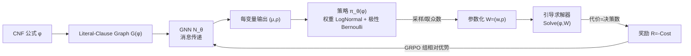

# Learning from Algorithm Feedback: One-Shot SAT Solver Guidance with GNNs

**会议**: ICLR 2026  
**OpenReview**: [https://openreview.net/forum?id=NfWrLOKnfk](https://openreview.net/forum?id=NfWrLOKnfk)  
**代码**: 待确认  
**领域**: combinatorial optimization / SAT solving / GNN + RL  
**关键词**: SAT solver, branching heuristic, GNN, reinforcement learning, GRPO, RLAF, one-shot guidance  

## 一句话总结
用一次 GNN 前向给 SAT 公式里每个变量打出"权重+极性"，把它乘进求解器现有的分支打分函数里，再用求解器本身的求解代价当奖励、拿 GRPO 这种策略梯度方法端到端训练这个 GNN——作者把这套范式叫 RLAF（Reinforcement Learning from Algorithm Feedback），在多种 SAT 分布上把基础求解器加速最多 2 倍以上，且超过基于人工启发式（backbone / UNSAT core）的监督学习方案。

## 研究背景与动机
**领域现状**：现代完备 SAT 求解器（DPLL/CDCL 系）的性能高度依赖分支启发式（branching heuristic）——即每一步搜索时"先选哪个变量、先试哪个取值"。VSIDS、look-ahead 等启发式都是手工设计的打分函数 $\text{Score}(x)$，哪种最好往往取决于具体公式分布，针对某个分布调优需要大量专家知识和试错。

**现有痛点**：用机器学习改造分支启发式有两条路，各有硬伤。一是**监督式预测预定义变量属性**（如 Selsam & Bjørner 预测 UNSAT core 成员、Wang 等预测 backbone 成员），但这些"人工定义的重要性"本身不一定是最优训练目标，而且在某些分布上根本失效——比如图染色问题因颜色置换对称性 backbone 恒为空，UNSAT 3SAT 上 core 又几乎包含全部变量，训练目标退化成常数。二是**纯 RL 端到端训练分支策略**（如 Graph-Q-SAT 的 Q-learning、Monte Carlo Forest Search），但它们**每做一次分支决策就要跑一次 GNN 前向**，而 GNN 通常比经典启发式慢几个数量级，导致这些方法只能在少数早期决策上用学到的引导，无法贯穿整个搜索。

**核心矛盾**：想要"学出来的、分布自适应的引导"覆盖每一步分支决策，又不想为每一步都付一次昂贵的 GNN 前向开销——监督式不够好、逐步 RL 又太慢。

**本文目标**：设计一个既能影响所有分支决策、又只需单次 GNN 前向、还能不依赖专家监督直接从求解代价学习的引导机制。

**核心 idea**：
- **一次前向引导全程（one-shot guidance）**：GNN 对整个公式跑一次，给每个变量产出一对参数 $(w,p)$（权重和极性），这套参数注入求解器后影响其后所有分支决策，把 GNN 开销摊销到几乎可忽略（~0.1 秒）。
- **算法反馈即奖励（RLAF）**：把"选权重"建模成单步 MDP，公式是状态、权重参数化是动作、奖励直接取负的求解代价（决策数），用 GRPO 训练，无需任何专家标注。
- **通用乘法权重注入**：不替换原启发式，而是把学到的权重乘进现有打分 $w(x)\cdot\text{Score}(x)$，对任何"argmax 打分"型分支启发式都通用。

## 方法详解

### 整体框架
输入 CNF 公式 $\phi$ 被建成 Literal-Clause Graph，交给一个可训练 GNN $N_\theta$ 跑消息传递，每个变量输出两个实数 $[\mu(x),\rho(x)]$；这两个数分别参数化该变量的权重分布（LogNormal）和极性分布（Bernoulli），整体构成策略 $\pi_\theta(\phi)$。从中采样（训练时）或取众数（测试时）得到参数化 $W=(w,p)$，喂给改造后的求解器 $\text{Solve}(\phi,W)$，它把权重乘进分支打分、用极性决定先试的取值。训练时对同一公式采样多组 $W$、各跑一遍求解器、用组内代价方差算优势，再用 GRPO 更新 GNN。

### 关键设计

**1. 乘法权重注入分支启发式：不替换、只调制。** 作者假设基础求解器的分支先选变量 $\hat{x}=\arg\max_x \text{Score}(x)$、再按次级启发式定符号，这覆盖了 VSIDS、look-ahead 等绝大多数主流启发式。改造方式极简——给每个变量配一个正权重 $w:\text{Var}(\phi)\to\mathbb{R}_{>0}$，把选变量改成 $\hat{x}=\arg\max_x w(x)\cdot\text{Score}(x)$（式 1），再配一个极性 $p:\text{Var}(\phi)\to\{0,1\}$ 决定该变量被选为决策变量时先赋哪个值。关键在于权重是**乘性缩放**而非替换：原启发式动态算出的分数（依赖当前部分赋值、历史冲突等）保留不变，GNN 只是注入"变量重要性先验"去调制它，既不破坏求解器原有逻辑，又对任意打分型启发式即插即用。

**2. 概率化策略：用 LogNormal × Bernoulli 让权重可微可采样。** 要用策略梯度训练，动作必须可采样、密度可微。作者把 GNN 输出的 $\mu(x)$ 当作权重的对数均值，定义 $\pi^w_\theta(x)=\text{LogNormal}(\mu(x),\sigma_w)$（式 2）——选 LogNormal 是因为它天然建模"严格正实数上的单峰分布"，保证采样出的权重始终是合法的正缩放因子，无需人工裁剪或约束（作者也试过 Truncated Normal、Poisson，但 LogNormal 更简单稳健）。极性则用 $\pi^p_\theta(x)=\text{Bernoulli}(\text{Sigmoid}(\rho(x)))$（式 3）。所有变量独立，联合策略 $\pi_\theta(\phi)=\prod_x \pi^w_\theta(x)\times\pi^p_\theta(x)$（式 4），整套 $W$ 一次性并行采样，密度可因式分解 $\pi_\theta(W|\phi)=\prod_x \pi^w_\theta(w(x)|\phi)\cdot\pi^p_\theta(p(x)|\phi)$（式 5），从而每个 GNN 参数对 $\pi_\theta(W|\phi)$ 都有偏导，可直接接策略梯度。测试时不随机采样而取众数 $\hat{W}$，消除测试方差且平均效果更好。

**3. 单步 MDP + GRPO：把"求解代价"直接当奖励。** 优化目标是最小化期望求解代价 $\theta^*=\arg\min_\theta \mathbb{E}_{\phi\sim\Omega,W\sim\pi_\theta}[\text{Cost}(\phi,W)]$（式 6），其中 $\text{Cost}$ 取决策数。作者把它建成单步 MDP：公式是状态、选 $W$ 是动作、转移后立即终止并给奖励 $R=-\text{Cost}$（用决策数而非 CPU 时间，因为 CPU 占用噪声会让训练不稳）。用 GRPO（PPO 的简化版，免去价值网络）训练：每轮对同一公式 $\phi_i$ 采 $M$ 组参数化、各跑求解器，用组内归一化的相对优势 $\hat{A}_{i,j}=\frac{R(\phi_i,W_{i,j})-\text{mean}(R_i)}{\text{std}(R_i)}$（式 7），再优化截断目标 $L_{\text{PPO}}=\frac{1}{M}\sum_j \min(r_{i,j}\hat{A}_{i,j},\text{clip}(r_{i,j},1-\epsilon,1+\epsilon)\hat{A}_{i,j})$（式 8），其中 $r_{i,j}=\pi_\theta(W_{i,j}|\phi_i)/\pi_{\theta_{k-1}}(W_{i,j}|\phi_i)$ 是新旧策略概率比，外加 KL 惩罚 $-\beta\cdot\text{KL}$（式 10）稳训练。这意味着训练信号完全来自"求解器跑得快不快"这一算法自身的反馈，故名 RLAF。

**4. 求解器在环训练 + 易问题泛化到难问题。** 由于是在线 RL，求解器必须在训练回路里：默认 $N=100,M=40$ 即每轮 GRPO 要做 4000 次求解器调用。这逼着训练数据必须是"单 CPU+GPU 上能秒解"的简单实例（如 3SAT(200) 训练）。作者的关键实证主张是——**训练用简单实例不妨碍学到的策略泛化到大得多、难得多的实例**（如测到 3SAT(400)、3COL(600)、CRYPTO(10)），因此"依赖简单训练问题"不构成实质限制，也为未来用分布式集群扩到工业级难题留了口子。

## 实验关键数据
两个基础求解器：CDCL 系 **Glucose**（EVSIDS 启发式，擅长结构化问题）和 DPLL 系 **March**（look-ahead 启发式，随机实例最强之一）；三类分布：随机 3SAT、图 3 染色 3COL、密码学 CRYPTO（HiTag2 解密）。GNN 为 10 层、维度 256，训 2000 轮 GRPO。

### 主实验表格（节选，决策数/时间，时间含 GNN 前向开销）

| 分布 | 结果 | Glucose 时间(s) | +RLAF 时间(s) | March 时间(s) | +RLAF 时间(s) |
|---|---|---|---|---|---|
| 3SAT(400) | SAT | 598.35 | **186.70** (-69%) | 7.27 | **5.51** |
| 3SAT(400) | UNSAT | 1895.62 | **1112.71** (-41%) | 27.49 | 27.51 |
| 3COL(600) | SAT | 25.03 | **11.59** | 27.16 | **18.71** |
| 3COL(600) | UNSAT | 193.96 | **155.23** (-24%) | 313.57 | **197.12** |
| CRYPTO(20) | UNSAT | 1.16 | **0.15** (~7.7×) | 0.82 | **0.41** |
| CRYPTO(10) | UNSAT | 162.45 | **64.95** | 467.38 | **169.22** |

### 对照实验：vs 监督式（backbone / UNSAT core 预测）
- 图 4 显示 RLAF 在 Glucose 上相对运行时间全面优于 backbone 预测和 UNSAT core 预测两种监督方案。
- backbone 引导仅在 3SAT(300) SAT 小实例上略胜 RLAF，到更大实例就被反超；UNSAT 3SAT 上 backbone 引导明显更差。
- RLAF 在图染色和密码学问题上均优于 core 引导。另在附录与 Graph-Q-SAT（Q-learning 无监督基线）对比。

### 关键发现
- **加速幅度依分布而异**：3SAT(400) SAT 上 Glucose 提速 69%、UNSAT 提速 41%；CRYPTO(20) UNSAT 上 Glucose 时间从 1.16s 降到 0.15s（近 7.7×）。GNN 前向墙钟开销通常 ≤0.1s，对难题可忽略不计。
- **唯一吃亏处**：March 在 UNSAT 随机 3SAT 上虽然平均决策数更少，但运行时间反而略增——因为 look-ahead DPLL 本就是 UNSAT 随机实例的极强基线，微小的决策数改善抵不过 GNN 前向开销（这类问题上 GNN 引导收益最薄）。
- **跨求解器一致性**：Glucose 与 March 各自学到的变量权重 Pearson 相关系数 $r\in[0.73,0.85]$，说明学到的是变量**固有的、求解器无关的结构属性**。
- **自发现人工启发式**：在 3COL/CRYPTO 上，高权重变量大多正是 UNSAT core 成员——RLAF 自己重新发现了与人工启发式相关的信号，且表现更好；但在 3SAT 上权重与 backbone 无明显相关，说明它学的是另一套同样有效却不像任何已知人工启发式的函数。

## 亮点与洞察
- **"one-shot"是把 RL 引导落地 SAT 的关键工程取舍**：之前逐步 RL 方法卡在"GNN 太慢只能引导几步"，本文用"一次前向给全图打权重、贯穿全程"绕开这个瓶颈，把昂贵的神经推理开销摊薄到可忽略——这是让学习型引导真正跑赢手工启发式的前提。
- **乘法注入的通用性很优雅**：不碰原启发式内部、只在 argmax 外面乘一个权重，使得方法对 VSIDS、look-ahead 等异构启发式即插即用，也为推广到 MIP/CSP 等"argmax 打分型"算法留了清晰接口。
- **"算法反馈"作为奖励的范式价值**：RLHF/RLVR 是从人类/可验证答案学，RLAF 则从"算法跑得快不快"学，奖励天然可计算、无需标注，给组合优化里的启发式设计提供了一条数据驱动的通用路径。
- **跨求解器权重高相关**是个漂亮的副产品证据，暗示学到的是 SAT 实例的内禀结构信息而非对某个求解器的过拟合。

## 局限与展望
- **原型规模**：受限于单机 CPU+GPU，训练只能用"秒解"级简单实例，每轮 4000 次求解器调用的代价限制了直接在工业级难题上训练；扩到分布式集群是明确的下一步。
- **GNN 可扩展性瓶颈**：大型工业实例的内存与计算开销在训练时尤其吃紧，标准消息传递 GNN 的表达力又被 color refinement（1-WL）上界卡住，"高表达力 + 高可扩展性"难以兼得。
- **未接 SOTA CDCL**：实验仅用 Glucose/March 做原型演示，未集成到最先进的工业 CDCL 求解器。
- **收益不均**：在求解器本就极强的分布（如 March 解 UNSAT 随机 3SAT）上，GNN 开销可能抵消甚至超过决策数改善。
- **跨域仅是设想**：作者指出方法不限于 SAT，MIP/CSP 等任何"argmax 打分型"启发式都能套同样的乘法权重 + RL 范式，但实际迁移留作未来工作。

## 相关工作与启发
- **监督式变量属性预测引导**：Selsam & Bjørner (2019) 预测 UNSAT core、Wang et al. (2024) 预测 backbone，本文将其作为主要对照并指出其训练目标在多类分布上失效。
- **逐步 RL 分支策略**：Graph-Q-SAT (Kurin et al., 2020) 用 Q-learning、Cameron et al. (2024) 用 Monte Carlo Forest Search，均受"每步一次 GNN 前向"开销所限，本文的 one-shot 设计正是针对此痛点。
- **图表示**：沿用 Selsam et al. (2019) 的 Literal-Clause Graph，但作者强调这一选择是模块化的，可替换为其他图表示。
- **RL 算法**：直接复用 LLM 微调中流行的 GRPO (Shao et al., 2024) / PPO (Schulman et al., 2017)，把 RLHF/RLVR 的思路迁移到"从算法反馈学"。
- **启发**：把"启发式 = 某打分函数的 argmax"这一通用模式，统一改造成"外部乘法权重 + 把推权重当 RL 问题"，为组合优化中各类选择启发式的数据驱动设计提供了可复用模板。

## 评分
- **新颖性**: ⭐⭐⭐⭐ — RLAF（从算法代价反馈学）+ one-shot 全图引导 + 乘法权重注入三者组合是清晰且少见的设计，巧妙绕开了逐步 RL 的开销瓶颈；单项技术（GNN、GRPO、Literal-Clause Graph）皆为现成，胜在组合与问题建模。
- **实验充分度**: ⭐⭐⭐⭐ — 两类求解器 × 三类分布、含决策数与墙钟时间、明确把 GNN 开销算进时间，且系统对比监督式与无监督基线、做了权重相关性与可解释性分析；不足是仅原型规模、未上 SOTA CDCL 与工业实例。
- **写作质量**: ⭐⭐⭐⭐ — 动机—机制—公式—实验链条清晰，图 1/2/3 把求解器改造、策略采样、GRPO 训练讲得很直观，诚实交代了 March-UNSAT 的反例。
- **价值**: ⭐⭐⭐⭐ — 给"学习型启发式设计"提供了一个可摊销开销、不依赖专家标注、可泛化的范式，且对 MIP/CSP 等 argmax 型算法有明确推广潜力，对组合优化 + ML 社区有较强参考价值。

<!-- RELATED:START -->

## 相关论文

- [\[ICML 2026\] Distribution Alignment for One-Shot Federated Learning via Optimal Transport](../../ICML2026/optimization/distribution_alignment_for_one-shot_federated_learning_via_optimal_transport.md)
- [\[ICLR 2026\] Error Feedback for Muon and Friends](error_feedback_for_muon_and_friends.md)
- [\[AAAI 2026\] PEOAT: Personalization-Guided Evolutionary Question Assembly for One-Shot Adaptive Testing](../../AAAI2026/optimization/peoat_personalization-guided_evolutionary_question_assembly_for_one-shot_adaptiv.md)
- [\[ICML 2026\] On the Expressive Power of GNNs to Solve Linear SDPs](../../ICML2026/optimization/on_the_expressive_power_of_gnns_to_solve_linear_sdps.md)
- [\[ICLR 2026\] COLD-Steer: Steering Large Language Models via In-Context One-step Learning Dynamics](cold-steer_steering_large_language_models_via_in-context_one-step_learning_dynam.md)

<!-- RELATED:END -->
