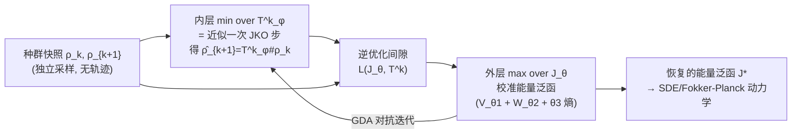

# Learning of Population Dynamics: Inverse Optimization Meets JKO Scheme

**会议**: ICLR 2026  
**OpenReview**: [https://openreview.net/forum?id=tVJIKd6CLF](https://openreview.net/forum?id=tVJIKd6CLF)  
**代码**: [https://github.com/MuXauJl11110/iJKOnet](https://github.com/MuXauJl11110/iJKOnet)  
**领域**: optimization / Wasserstein gradient flows / generative modeling  
**关键词**: JKO scheme, inverse optimization, Wasserstein gradient flow, population dynamics, adversarial training  

## 一句话总结
本文提出 iJKOnet，把"从离散时刻的种群快照反推能量泛函"这件事重写成一个**逆优化（inverse optimization）问题**——通过最大化 JKO 步的最优值与真实测度处取值之间的间隙，得到一个 min-max 目标，用常规对抗式端到端训练即可学到驱动 Wasserstein 梯度流的能量泛函，无需输入凸神经网络、也无需预先计算最优传输耦合。

## 研究背景与动机
- **领域现状**：很多科学问题（单细胞基因组、金融、人群流、流行病学）只能拿到不同时刻种群的边缘分布快照，拿不到单个粒子的连续轨迹，需要从这些"互相独立的截面"反推出支配演化的随机动力学（通常建模为 SDE / Fokker-Planck PDE）。Wasserstein 梯度流（WGF）+ JKO 隐式离散格式是建模这类演化的主流理论框架。
- **现有痛点**：JKO 方案每一步要在概率测度空间里解一个优化问题，计算昂贵。第一代方法 **JKOnet** 把任务写成双层优化，目标复杂、只能处理纯势能泛函（无法刻画扩散/随机性），且需要展开优化器步骤；后继 **JKOnet\*** 用一阶最优性条件替换 JKO 优化步，支持更一般能量泛函、降低复杂度，但**必须预先用离散 OT 求解器算好相邻快照之间的最优传输耦合 $\pi_k$**，因此并非端到端，且高维下离散 OT 不准、可扩展性受限。
- **核心矛盾**：想要"既能表达丰富能量结构（势能+交互+扩散）、又能端到端训练、又不被 ICNN/预计算 OT 这类限制卡住"——三者此前无法兼得。
- **本文目标**：设计一个不依赖架构限制、不依赖预计算 OT 耦合、可端到端训练、且带理论保证的能量泛函恢复方法。
- **核心 idea**：**逆优化视角**——既然真实序列满足 $\rho_{k+1}=\mathrm{JKO}_\tau\mathcal{J}^*(\rho_k)$，那么对任意候选泛函 $\mathcal{J}$，JKO 步在最优点的取值必然 $\le$ 在真实 $\rho_{k+1}$ 处的取值，两者之差恒 $\le 0$；**最大化这个间隙就把候选泛函逼向真实泛函**，从而得到一个 min-max 目标。

## 方法详解

### 整体框架
iJKOnet 用两组网络参数化：候选能量泛函 $\mathcal{J}_\theta$（势能 $V_{\theta_1}$ + 交互核 $W_{\theta_2}$ + 标量扩散系数 $\theta_3$）和把 $\rho_k$ 推向下一时刻的传输映射 $T^k_\varphi$。内层对 $T^k$ 最小化 = 近似执行一次 JKO 步；外层对 $\mathcal{J}$ 最大化 = 把推前分布 $\hat\rho_{k+1}=T^k_\varphi\!\sharp\rho_k$ 逼近真实 $\rho_{k+1}$，从而校准能量泛函。整体是一个标准的梯度下降-上升（GDA）对抗训练循环。

### 关键设计

**1. 把 JKO 恢复改写成逆优化间隙最大化：min-max 目标的诞生**。出发点是建模假设 $\rho_{k+1}=\mathrm{JKO}_\tau\mathcal{J}^*(\rho_k)$。由 JKO 步的定义（在 $\rho$ 上最小化 $\mathcal{J}(\rho)+\frac{1}{2\tau}d^2_{W_2}(\rho,\rho_k)$），对任意 $\mathcal{J}$ 都有 $\min_{\rho_k}\big[\mathcal{J}(\rho_k)+\frac{1}{2\tau}d^2_{W_2}(\rho_k,\rho_k)\big]\le \mathcal{J}(\rho_{k+1})+\frac{1}{2\tau}d^2_{W_2}(\rho_k,\rho_{k+1})$，且**当 $\mathcal{J}=\mathcal{J}^*$ 时取等**。把右边移到左边得到一个恒 $\le 0$ 的间隙，对 $\mathcal{J}$ 求最大就把候选逼向真值，扣掉与 $\mathcal{J}$ 无关的常数后得到 $\max_{\mathcal{J}}\sum_k \min_{\rho_k}[\mathcal{J}(\rho_k)-\mathcal{J}(\rho_{k+1})+\frac{1}{2\tau}d^2_{W_2}(\rho_k,\rho)]$。这是整篇方法的灵魂：不去解 JKO 优化、也不去写一阶最优性条件，而是**直接用"最优性意味着间隙为零"这一事实当损失**。

**2. 用 Brenier 定理把测度优化降成映射优化，得到可训练损失**。上式里对 $\rho_k$ 的内层最小化仍在概率测度空间，难以直接优化。借助 Brenier 定理，每个 $\rho_k$ 都能写成推前 $\rho_k=T^k\!\sharp\rho_k$，并利用上界 $d^2_{W_2}(\rho_k,\rho)\le\int_X\|x-T^k(x)\|^2 d\rho_k(x)$，把测度上的 $\min$ 换成传输映射 $T^k$ 上的 $\min$；又因为各时刻的最小化彼此独立，求和与最小化可交换，最终落到可计算的损失：
$$\max_{\mathcal{J}}\min_{T^k}\ \sum_{k=0}^{K-1}\Big[\mathcal{J}(T^k\!\sharp\rho_k)-\mathcal{J}(\rho_{k+1})+\frac{1}{2\tau}\int_X\|x-T^k(x)\|_2^2\,\rho_k(x)\,dx\Big].$$
其中内层最优映射 $T^k_{\mathcal{J}}$ 恰好把 $\rho_k$ 推成 $\hat\rho_{k+1}=\mathrm{JKO}_\tau\mathcal{J}(\rho_k)$——**内层即"用网络近似执行一次 JKO 步"**，这正是 iJKOnet 能甩掉预计算 OT 耦合的关键。

**3. 无架构限制的参数化 + 熵项的可计算处理**。由于目标 (11) 不再要求凸性，传输映射 $T^k_\varphi$ 可以直接用标准 MLP/ResNet，而不必像 JKOnet 那样用难以扩展到高维的输入凸网络（ICNN）；能量泛函沿用自由能形式 $\mathcal{J}_\theta(\rho)=V_{\theta_1}(\rho)+W_{\theta_2}(\rho)-\theta_3 H(\rho)$，把势能、交互核、扩散系数都做成可学参数。损失里除内部熵项外都能蒙特卡洛估计；熵项 $U_{\theta_3}(T^k_\varphi\!\sharp\rho_k)$ 通过换元公式展开成 $U_{\theta_3}(\rho_k)-\theta_3\int\log|\det\nabla_x T^k_\varphi(x)|d\rho_k(x)$，其中 $H(\rho_k)$ 用 Kozachenko–Leonenko 最近邻估计器（可训练前预计算），$\log\det$ 项可用 Hutchinson 迹估计或直接算全 Jacobian。

**4. 势能恢复的质量上界（理论保证）**。这是首个对 JKO-based 种群动力学求解器给出恢复质量分析的工作。在 $K=1$、纯势能、$X$ 凸、修正势 $V_q:=\tau V+\frac12\|\cdot\|^2$ 严格凸且 $\frac{1}{\beta}$-光滑等假设下，定理 3.1 证明存在常数 $C=C(\tau,\beta)$ 使
$$\int_X\|\nabla V^*(y)-\nabla V(y)\|^2 d\rho_1(y)\le C\,\varepsilon(V),$$
即逆 JKO 损失的间隙 $\varepsilon(V)$ 越小，恢复势能的**梯度**就越接近真值（忽略不影响动力学的可加常数）。这些假设并不苛刻：光滑性可用 CELU/SiLU/SoftPlus 等光滑激活保证，严格凸性在步长 $\tau$ 足够小时通常成立。

## 实验关键数据

### 主实验：单细胞 RNA-seq（Embryoid Body 数据集）

**5D leave-two-out（$d_{W_2}$ 距离，越低越好，移除 $t_1,t_3$ 用剩余时刻重建）**：

| 方法 | $t_1$ | $t_3$ |
|------|-------|-------|
| DMSB | 1.13 ± 0.082 | 1.45 ± 0.16 |
| MMSB | 1.27 ± 0.028 | 1.57 ± 0.048 |
| TrajectoryNet | 2.03 ± 0.04 | 1.93 ± 0.08 |
| JKOnet\* | 1.361 ± 0.257 | 2.557 ± 0.042 |
| JKOnet\*$_{t,V}$ | 4.414 ± 1.499 | 2.771 ± 0.197 |
| **iJKOnet$_V$ (Ours)** | 1.082 ± 0.011 | 1.147 ± 0.001 |
| **iJKOnet$_{t,V}$ (Ours)** | **0.983 ± 0.037** | **0.849 ± 0.021** |

时变势能版 iJKOnet$_{t,V}$ 取得全场最佳，明显超过 DMSB/MMSB 等非 JKO 基线及全部 JKOnet\* 变体。

**100D leave-one-out（MMD 距离，越低越好，3 次平均）**：

| 方法 | LO-$t_1$ | LO-$t_2$ | LO-$t_3$ | w/o LO |
|------|----------|----------|----------|--------|
| DMSB | 0.042 ± 0.020 | 0.033 ± 0.003 | 0.040 ± 0.020 | 0.032 ± 0.003 |
| MIOFLOW | 0.23 | 0.90 | 0.23 | 0.23 |
| JKOnet\*$_V$ | 0.220 ± 0.025 | 0.293 ± 0.018 | 0.235 ± 0.006 | 0.229 ± 0.052 |
| **iJKOnet$_V$ (Ours)** | 0.137 ± 0.001 | 0.123 ± 0.001 | 0.097 ± 0.002 | 0.085 ± 0.024 |

iJKOnet$_V$ 全面碾压 JKOnet\*，在 w/o LO 设置下与 DMSB 同档，但用的是**免仿真、无需缓存轨迹**的更简单优化流程，因而执行时间更优。

### 消融 / 对照（合成势能学习，§5.1）

| 对照维度 | 发现 |
|----------|------|
| iJKOnet$_V$ vs JKOnet$_V$（2D unpaired，EMD/Bd²W2-UVP/L2-UVP，15 个势能） | iJKOnet 在几乎所有势能上优于 JKOnet\* |
| 样本量 2K vs 10K | 多数情况下增样本提升性能，但某些势能即便加到 10K 也难学，凸显 unpaired 设置之难 |
| paired vs unpaired 设置 | 作者发现 JKOnet\* 原始代码无意中保留了粒子轨迹（paired），切换到真正无轨迹相关的 unpaired 设置会显著改变性能——指出了一个被忽视的评测一致性问题 |
| 能量分量组合（$V$ / $V{+}U$ / $V{+}W$ / $W{+}U$ / 全） | 仅势能 $V$ 的归纳偏置最稳；联合优化交互+内能 $(\theta_1,\theta_2,\theta_3)$ 易不稳定、收敛到不准的势能估计 |

### 关键发现
- 把 JKO 步从"显式求解/写一阶最优性条件"改成"逆优化间隙"后，端到端对抗训练即可工作，且摆脱了预计算 OT 耦合带来的误差与扩展瓶颈。
- 交互能与内能的直接从样本恢复确实困难（需对"本身要被估计的函数"再做积分），因此大规模实验上限制为纯势能 iJKOnet$_V$ 是务实选择。

## 亮点与洞察
- **视角创新**：把"反推能量泛函"明确归约为逆优化（最优性 ⟹ 间隙为零），由此自然导出 min-max 目标——这比 JKOnet 的双层优化、JKOnet\* 的一阶条件都更直接、更易扩展到一般能量形式。
- **甩掉两个历史包袱**：既不要 ICNN（凸性约束→可用普通 MLP/ResNet，利于高维扩展），也不要预计算离散 OT 耦合（去掉额外误差源，真正端到端）。
- **首个恢复质量理论**：定理 3.1 给出势能梯度恢复误差被损失间隙上界控制的保证，填补了 JKO-based 种群动力学求解器缺乏质量分析的空白。
- **诚实的工程发现**：指出 JKOnet\* 代码里 paired/unpaired 的隐性不一致，对社区评测的可信度有正面价值。

## 局限与展望
- 内能只能恢复熵型，无法处理熵以外的内部能量；交互能限于时间无关，无法刻画时变交互能。
- 不支持生死（birth–death）动力学，难以对接近期带细胞增殖/凋亡的轨迹推断方法。
- 依赖熵估计，高维下精度下降；联合优化全部能量参数 $(\theta_1,\theta_2,\theta_3)$ 易不稳定、收敛到不准势能——这也是大实验退回纯势能的根因。
- 理论保证目前只覆盖纯势能（$K=1$），扩展到交互/内能仍是 open problem。

## 相关工作与启发
- **JKOnet (Bunne et al., 2022b)**：双层优化恢复种群动力学，需展开优化器、只支持势能；iJKOnet 继承其参数化但去掉双层结构。
- **JKOnet\* (Terpin et al., 2024)**：用一阶最优性条件替换 JKO 优化、支持更一般能量，但要预计算 OT 耦合、非端到端；iJKOnet 直接通过内层最小化"求解 JKO 步"，免去预计算。
- **WGF / JKO 理论**（Jordan-Kinderlehrer-Otto 1998、Ambrosio et al. 2008）与 ICNN-based 求解器（Mokrov 2021、Alvarez-Melis 2022）为方法提供测度空间梯度流与变分时间离散的基础。
- **非 JKO 轨迹推断基线**（TrajectoryNet、MIOFLOW、DMSB、NLSB、MMSB）是单细胞动力学的主流对照；iJKOnet 在更简单、免仿真的框架下达到可比或更优结果。
- **启发**：当一个学习问题的真值满足某个"最优化过程的不动点/最优解"时，可考虑把"恢复目标"改写为"最优性间隙最大化"的逆优化，往往能换来更简单、可端到端、可分析的训练目标——这一思路可迁移到其它隐式建模/反问题场景。

## 评分
- **新颖性**: ⭐⭐⭐⭐ 把逆优化视角引入 JKO 种群动力学恢复，导出干净的 min-max 目标，并给出该方向首个恢复质量定理，概念上确有突破。
- **实验充分度**: ⭐⭐⭐⭐ 合成势能 + 5D/100D 单细胞真实数据、对多种 JKO 与非 JKO 基线、含能量分量与样本量消融；但大实验受限于纯势能、交互/内能恢复未能稳定验证。
- **写作质量**: ⭐⭐⭐⭐ 动机—推导—理论—实验脉络清晰，逆优化间隙的推导链条交代完整，并诚实指出基线代码的 paired/unpaired 问题。
- **价值**: ⭐⭐⭐⭐ 为从快照学习随机动力学提供了更简单、端到端、可扩展且带保证的工具，对单细胞基因组等"只有截面数据"的科学场景有实际意义。

<!-- RELATED:START -->

## 相关论文

- [\[ICLR 2026\] Neural Optimal Transport Meets Multivariate Conformal Prediction](neural_optimal_transport_meets_multivariate_conformal_prediction.md)
- [\[ICML 2026\] Learning Dynamics of Zeroth-Order Optimization: A Kernel Perspective](../../ICML2026/optimization/learning_dynamics_of_zeroth-order_optimization_a_kernel_perspective.md)
- [\[ICLR 2026\] COLD-Steer: Steering Large Language Models via In-Context One-step Learning Dynamics](cold-steer_steering_large_language_models_via_in-context_one-step_learning_dynam.md)
- [\[ICLR 2026\] LoRA meets Riemannion: Muon Optimizer for Parametrization-independent Low-Rank Adapters](lora_meets_riemannion_muon_optimizer_for_parametrization-independent_low-rank_ad.md)
- [\[ICLR 2026\] Predictive Differential Training Guided by Training Dynamics](predictive_differential_training_guided_by_training_dynamics.md)

<!-- RELATED:END -->
