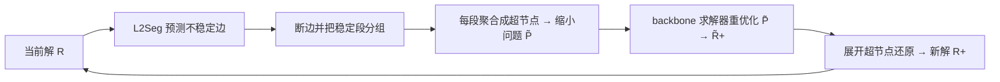

# Learning to Segment for Vehicle Routing Problems

**会议**: ICLR 2026  
**OpenReview**: [https://openreview.net/forum?id=pN261iTKvr](https://openreview.net/forum?id=pN261iTKvr)  
**代码**: 待确认  
**领域**: optimization  
**关键词**: 车辆路径问题, 神经组合优化, 迭代搜索加速, 问题分解, 自回归/非自回归模型  

## 一句话总结
作者发现迭代式 VRP 求解器在搜索过程中大量边其实早已"稳定不变"、反复优化它们纯属浪费算力，于是提出 First-Segment-Then-Aggregate（FSTA）分解框架把稳定段聚合成超节点、只让求解器去啃不稳定部分，再用神经网络 L2Seg（含自回归、非自回归及二者协同三种变体）学会判断哪些段该聚合，从而把 LKH-3/LNS/L2D 等 SOTA 求解器加速 2~7 倍。

## 研究背景与动机
**领域现状**：车辆路径问题（VRP）是物流、网约车等场景的核心 NP-hard 组合优化问题，目前最强的求解器——无论是经典启发式（LKH-3、HGS、LNS）还是神经求解器（LEHD、L2D 等）——几乎都依赖**迭代搜索**（ruin-and-repair 式的局部搜索）来逐步精炼解。

**现有痛点**：作者观察到一个被普遍忽视的现象——随着搜索推进，**解中很大一部分边会"稳定"下来**（即在连续若干轮求解调用之间始终保留在解里不再变化），尤其是大容量、长子路径的大规模 VRP。例如相邻子路径的内部边往往固定不动，只有边界边在频繁组合变化。求解器却对这些早已稳定的边一遍遍重复优化，造成大量冗余计算，严重拖累可扩展性。

**核心矛盾**：稳定性其实可以从客户空间分布和解的结构性质中端到端学出来，但**现有求解器没有任何机制去识别并利用这种稳定性**——它们要么全局重优化，要么靠手工规则（k 近邻裁剪、有界邻域）盲目缩小搜索空间，无法数据驱动地分辨"哪段稳、哪段不稳"。

**本文目标**：让求解器学会识别稳定段并跳过它们，把算力集中在真正需要重优化的不稳定部分上，且这套加速要**与具体求解器无关**（经典/神经/混合都能挂载）、并能覆盖多种 VRP 变体。

**核心 idea**：**先分段后聚合（FSTA）** + **学习分段（L2Seg）**。FSTA 负责"机制"——把稳定段聚合成固定超节点、缩小问题规模、只重优化不稳定部分，并在理论上证明解的可行性与单调性得以保持；L2Seg 负责"大脑"——用神经网络判断哪些边不稳定，且首次让**自回归（AR）与非自回归（NAR）模型协同决策**，兼顾全局视野与局部精度。

## 方法详解

### 整体框架
方法分两层。下层 FSTA 是一个**求解器无关的分解机制**：给定当前解，先识别出不稳定边、断开它们，把剩下的稳定连续节点组成段（segment），每段聚合成一个或两个携带合并属性（总需求、min/max 时间窗等）的超节点，得到规模更小的子问题，交给任意 backbone 求解器重优化，最后把超节点展开还原回原解。上层 L2Seg 是一个**编码器-解码器神经网络**，专门解决 FSTA 里"哪些边该断"这个组合判断难题，提供 NAR（一次性全局预测）、AR（序列化局部精修）、SYN（二者协同）三种变体。

### 关键设计

**1. FSTA 分解：用超节点固定稳定段，且理论保证解不退化。** 这是整套方法的机制基座。把 CVRP 的解记为路径集合 $\mathcal{R}=\{R_1,R_2,\dots\}$，每条路径是 $R_i=(x_0\to x_1^i\to\dots\to x_0)$。一旦识别出不稳定边集合（与 depot 相连的边强制纳入以保证 depot 合法），就断开它们，把每条路径切成若干不相交的稳定段 $S^i_{j,k}=(x^i_j\to\dots\to x^i_k)$，每段用一个超节点 $\tilde{S}^i_{j,k}=\{\tilde{x}^i_{j,k}\}$（或两个端点超节点）代替，其属性是段内属性之和（如需求 $d^i_{j,k}=d^i_j+\dots+d^i_k$）。这样原问题 $P$ 收缩成节点更少的 $\tilde{P}$，求解器只在不稳定部分上做局部搜索，自然更快。关键是作者证明了两条定理：**可行性**（聚合解 $\tilde{\mathcal{R}}_+$ 对 $\tilde{P}$ 可行 ⟹ 还原解 $\mathcal{R}_+$ 对原问题可行）与**单调性**（若 $f(\tilde{\mathcal{R}}^1_+)\le f(\tilde{\mathcal{R}}^2_+)$ 则 $f(\mathcal{R}^1_+)\le f(\mathcal{R}^2_+)$），意味着在缩小问题上改进一定映射为原问题上的改进，且该结论可推广到 CVRP、VRPTW、VRPB、1-VRPPD 等多种变体。正因为有这层保证，FSTA 才能放心地"冻结"大段解而不损失最优性。

**2. 编码器统一刻画图级与路径级结构。** AR 与 NAR 共享同一编码器。输入特征上，作者专门设计了两类有判别力的特征——节点相对 depot 的**角度（angularity）**与**内部性（internality，最近邻里属于同路径的比例）**——以更好地区分稳定/不稳定边；边则区分"当前解中的边"和"节点到 k 近邻的边"两种类型。节点初始嵌入由 MLP 嵌入与绝对位置编码拼接而成 $h^{init}_i=\text{Concat}(h^{MLP}_i,h^{POS}_i)$，先过带掩码的 Transformer 层（掩码阻止不同路径的节点互相计算，从而注入"当前解"的局部结构），再过若干层 GAT 注入全局图信息 $H^{GNN}=\text{GNN}(H^{TFM},E)$。这样得到的节点嵌入同时承载了解结构与空间分布，为两种解码器服务。

**3. NAR 与 AR 解码器各司其职、互补短板。** NAR 解码器极简——一个 MLP+Sigmoid 一次性输出每个节点不稳定的概率 $p^{NAR}=\text{MLP}_{NAR}(H^{GNN})$，全局视野好、速度快，但缺乏条件建模，常把某条不稳定边周围的边"一锅端"全标成不稳定，局部不够精细。AR 解码器则模仿经典局部搜索"删 k 条边再接 k 条边"的行为，**交替进行删除阶段与插入阶段**：删除阶段（$t=2k$）基于目标节点选出一条不稳定边（仅标记不删除），插入阶段（$t=2k+1$）从上一条边的端点出发选一条不在解中的伪边作为"桥"通向下一个不稳定区域，最终 $E_{unstable}=\{e_{\pi_0,\pi_1},e_{\pi_2,\pi_3},\dots\}$。两阶段都用 GRU 编码序列上下文、用多头注意力做节点选择，并考虑动作空间大小用浅层（删除 $L^{MHA}_{delete}=1$）/深层（插入 $L^{MHA}_{insert}=4$）解码器，还引入可学习终止候选 $h_{end}$ 让模型自行决定不稳定边数量。AR 局部精度高，但面对分散在远处的多个不稳定区域时全局视野不足。

**4. SYN 协同：NAR 圈定范围、AR 精修，让两种模型联合决策。** 这是论文最具开创性的一点——首次在神经组合优化中让 AR 与 NAR 联合决策。SYN 推理分四步：先把问题按相邻子路径对拆成约 $|\mathcal{R}|$ 个子问题；对每个子问题用 NAR 一次性预测全局不稳定节点 $\hat{y}^{NAR}=\{x_i\mid p^{NAR}_i\ge\eta\}$（$\eta=0.6$）；再对 NAR 预测出的不稳定节点做 K-means 聚成 $n_{KMEANS}=3$ 个簇、每簇取概率最高的节点作为 AR 解码的**初始目标节点**（既缩小 AR 的搜索范围、又避免在相邻节点上重复解码）；最后由 AR 在这些初始点附近局部精修出不稳定边。训练上采用**模仿学习**：用迭代求解器作 look-ahead 启发式，把一轮重优化前后变化的边 $E_{diff}=(E_R\setminus E_{R_+})\cup(E_{R_+}\setminus E_R)$ 的端点标为不稳定节点；NAR 用加权二元交叉熵（$w_{pos}>1$ 平衡正负样本）、AR 用加权交叉熵（$w_{insert}>w_{delete}$ 平衡两阶段），AR 的标签由 $E_{diff}$ 诱导的连通分量经深度优先搜索展成"删除-插入"交替的节点序列。NAR 的"全局粗筛"恰好补上 AR 的全局短板，AR 的"局部精修"又纠正 NAR 的过度标记，二者协同因而最优。

## 实验关键数据

### 主实验：加速三种 backbone 求解器（大容量 CVRP）
在 100 个大容量 CVRP 实例上，三种变体都能稳定提升每个 backbone，且 SYN 最好（Gain 相对各自 backbone）：

| 方法 | CVRP2k Obj.↓ | Gain↑ | CVRP5k Obj.↓ | Gain↑ |
|------|------|------|------|------|
| LKH-3 | 45.24 | 0.00% | 65.34 | 0.00% |
| L2Seg-NAR-LKH-3 | 44.34 | 1.99% | 64.72 | 0.95% |
| L2Seg-AR-LKH-3 | 44.23 | 2.23% | 64.67 | 1.03% |
| **L2Seg-SYN-LKH-3** | **43.92** | **2.92%** | **64.12** | **1.87%** |
| LNS | 44.92 | 0.00% | 64.69 | 0.00% |
| **L2Seg-SYN-LNS** | **43.42** | **3.34%** | **63.94** | **1.16%** |
| L2D | 43.69 | 0.00% | 64.21 | 0.00% |
| **L2Seg-SYN-L2D** | **43.35** | **0.78%** | **63.89** | **0.50%** |

搜索曲线显示 SYN 带来 **2~7 倍加速**，且加速后的弱求解器能反超未加速的强求解器（如 LKH-3+SYN 超过原版 LNS）。

### 对比 SOTA 经典/神经基线（gap 相对 HGS，越低越好）

| 方法 | CVRP1k Gap↓ | CVRP2k Gap↓ | CVRP5k Gap↓ |
|------|------|------|------|
| HGS | 0.00% | 0.00% | 0.00% |
| LKH-3 | 4.32% | 1.29% | 39.22% |
| SIL | 1.94% | -0.17% | -2.33% |
| L2D | 2.11% | 0.42% | 0.22% |
| NDS | -0.01% | -1.91% | — |
| **L2Seg-SYN-L2D** | **0.07%** | **-2.01%** | **-3.55%** |

VRPTW 上同样全面领先，且优势随规模增大（VRPTW5k 上 L2Seg-SYN-L2D 达 -3.14% gap）。

### 消融实验

| 方法 | CVRP2k | CVRP5k |
|------|------|------|
| LNS（backbone） | 44.92 | 64.69 |
| Random FSTA (40%) | 46.24 | 66.72 |
| Random FSTA (60%) | 46.89 | 65.92 |
| L2Seg-SYN w/o 增强特征 | 43.65 | 64.22 |
| **L2Seg-SYN** | **43.42** | **63.94** |

### 关键发现
- **随机分段反而变差**（Random FSTA 比 backbone 还高），说明"分得准"至关重要，盲目聚合会破坏解——这正是需要学习的理由。
- **增强特征（角度/内部性）有明确贡献**，去掉后掉点。
- **SYN > AR > NAR** 的稳定排序印证了"NAR 全局粗筛 + AR 局部精修"的互补逻辑。
- L2Seg 对聚类客户、异质需求等更真实分布也能 zero-shot 迁移（比 LNS 提升 0.82%~3.10%），具备实用泛化性。

## 亮点与洞察
- **从"求解器重复劳动"切入，把加速问题重述为一个学习问题**：识别稳定段而非直接构造解，视角新颖且实用。
- **机制（FSTA）与学习（L2Seg）解耦**：FSTA 带可行性/单调性理论保证，使"冻结大段解"在数学上安全；L2Seg 只负责判断，二者职责清晰。
- **求解器无关、即插即用**：能挂在经典 LKH-3、分解框架 LNS、学习引导混合 L2D 上，且对越弱的 backbone 收益越大，工程价值高。
- **首次让 AR 与 NAR 联合决策**：以往 NCO 里二者多用于"NAR 分问题、AR 解子问题"的分治，这里改成"NAR 圈范围、AR 精修同一判断任务"，提供了一种新的协同范式。

## 局限与展望
- **依赖 look-ahead 求解器生成标签的模仿学习**：标签质量受教师求解器上限约束，未探索强化学习等可能突破教师的训练方式。
- **稳定性假设偏静态**：方法建立在"相邻两路径之间发生精炼"的经验观察上，对结构剧烈变动或非局部式搜索的求解器是否同样成立，文中讨论有限。
- **超参（$\eta=0.6$、$n_{KMEANS}=3$）需人工设定**，跨问题规模/分布是否需重调未充分展开。
- 主要在 CVRP/VRPTW 上验证，更多复杂约束变体（如取送货、多车型）虽有理论覆盖，但大规模实证仍待补充。

## 相关工作与启发
- **VRP 求解器**：经典精确法/启发式（LKH-3、HGS、LNS）与神经构造/局部搜索求解器（LEHD、POMO、L2D 等），本文指出它们都忽视了迭代搜索中的冗余计算。
- **大规模 VRP 分解**：手工 LNS 有界邻域、子路径分组、空间分解、超图分解等。FSTA 区别在于**数据驱动地做边级、跨子路径的全局分解**，而非 LNS 的固定有界邻域或 L2D 的子路径级选择。
- **AR 与 NAR 模型**：NAR 擅长全局热力图预测但难建模约束依赖，AR 擅长序列依赖但易丢全局结构；本文把二者的互补性用于"联合判断不稳定段"，是对该方向的新拓展。
- **启发**：这种"识别并冻结已收敛部分、只优化活跃部分"的思路，对其他迭代式组合优化乃至更广的迭代算法加速（如带稳定性先验的求解器预热）有迁移潜力。

## 评分
- **新颖性**: ⭐⭐⭐⭐⭐ — "学习识别稳定段以加速迭代搜索"是未被探索的视角，且首创 AR/NAR 联合决策范式，配合 FSTA 的理论保证，原创性强。
- **实验充分度**: ⭐⭐⭐⭐ — 覆盖三种 backbone、CVRP/VRPTW 多规模、SOTA 经典/神经/分治基线、消融与泛化齐全；扣分在于复杂约束变体的大规模实证较少、训练范式较单一。
- **写作质量**: ⭐⭐⭐⭐ — 动机观察清晰、方法分层讲解到位、图表充分；公式与符号略密集，AR 解码细节对初读者门槛偏高。
- **价值**: ⭐⭐⭐⭐⭐ — 求解器无关、即插即用、2~7 倍加速且对弱求解器收益更大，对大规模物流路径优化有直接落地价值。
