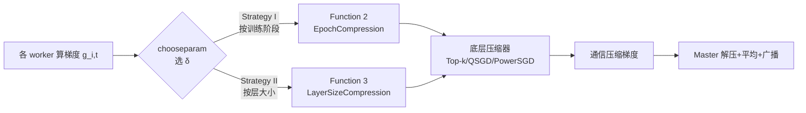

# LEGACY: A Lightweight Dynamic Gradient Compression Strategy for Distributed Deep Learning

**会议**: ICLR 2026  
**OpenReview**: [https://openreview.net/forum?id=DsBYEO3B8O](https://openreview.net/forum?id=DsBYEO3B8O)  
**代码**: [https://github.com/LEGACY-compression/LEGACY](https://github.com/LEGACY-compression/LEGACY)  
**领域**: optimization / 分布式训练 / 梯度压缩  
**关键词**: 梯度压缩, 通信瓶颈, Top-k 稀疏化, 动态调度器, 分布式训练, 联邦学习  

## 一句话总结
LEGACY 抛开需要调参或计算密集的自适应压缩器，仅凭"层大小"和"训练阶段"这两个免费可得的信号，为任意压缩器（Top-k、QSGD、PowerSGD 等）配上一个轻量动态调度器，在相同通信量下显著提升精度。

## 研究背景与动机
**领域现状**：分布式训练大模型时，节点间交换梯度的通信开销是主要瓶颈。学界提出了量化、稀疏化、低秩、混合等压缩技术，其中 Top-k 稀疏化只发送梯度中最大的一小撮元素（如 ResNet-50 在 ImageNet 上只发 0.36% 就能逼近无压缩精度），效果突出。

**现有痛点**：Top-k 引入近十年，业界仍没有一套清晰的"k 该怎么选"的配方；它每轮固定发送同样数据量，缺乏自适应。阈值稀疏化（hard-threshold）虽能随训练动态调整发送量、收敛保证更好，但又把问题转移成"阈值 λ 怎么调"。更糟的是，主流做法对整个训练、所有层都用同一个压缩率（uniform compression），而少数试图自适应的工作（CAT、Accordion、L-Greco 等）往往依赖昂贵的梯度统计或复杂搜索，难以落地。

**核心矛盾**：要在"压得狠（省通信）"和"压得准（保精度）"之间取得平衡，自适应方法理论上能做到，但代价是难调的超参或沉重的运行时计算——这与压缩本身要"省"的初衷相悖。

**本文目标**：遵循奥卡姆剃刀（"如无必要，勿增实体"），不靠复杂梯度统计，而是找一个简单且高效的策略，快速为每层选出合适的压缩参数。

**核心 idea**：作者通过画出 ResNet-18/NCF 训练中各层压缩率随迭代与层大小的变化，发现两条免费可得的规律——**(1) 训练初期对压缩更敏感、末期不敏感；(2) 大层冗余多可狠压、小层关键需轻压**。**基于这两条因子设计动态调度器**，无需任何在线梯度统计即可指导压缩参数选择。

## 方法详解

### 整体框架
LEGACY 不是一个新压缩器，而是套在任意 δ-压缩器（δ 越小压得越狠）外层的**调度器**：用户给定一组从松到紧的压缩级别 $\{\delta_i\}_{i=1}^p$ 和一组对应的阈值 $\{\lambda_i\}_{i=1}^p$（阈值代表"迭代数"或"层大小"），调度器通过 `chooseparam` 函数在每轮、每层动态挑选该用哪个 $\delta$，再交给底层压缩器执行。它建立在标准的无误差反馈压缩通信流程（Algorithm 1）之上，仅替换了"选参数"这一步，因此对优化器和压缩器都透明无侵入。

### 关键设计
作者先用压缩 GD 的收敛分析把直觉钉死，再落成两条可直接执行的调度策略与一个简化版。

**1. 用收敛分析钉死"何时该松、哪层该松"**：在光滑强凸假设下，压缩 GD 的迭代下降量为 $\mathbb{E}\|x_{t+1}-x^*\|^2 \le (1-2\mu\eta+\eta^2\mu L(2-\delta_t))\|x_t-x^*\|^2$，与无压缩理想下降的差距是 $\Delta = \mu\eta^2 L(1-\delta_t)\|x_t-x^*\|^2$。这个 $\Delta$ 同时被 $(1-\delta_t)$ 和 $\|x_t-x^*\|^2$ 两个因子放大——于是结论自然浮现：训练初期 $\|x_t-x^*\|^2 \gg 0$，必须让 $\delta_t \to 1$（轻压或不压）才能压住误差；训练末期 $\|x_t-x^*\|^2 \approx 0$，即便 $\delta_t \approx 0$（狠压）也无伤大雅。PL 非凸情形（Lemma 2）给出同样的结论，把"训练阶段"这条经验规律变成有理论支撑的设计原则。

**2. Strategy I（按训练阶段，EpochCompression）**：随训练推进逐级加大压缩强度。给定按迭代/epoch 递增的阈值 $\{\lambda_i\}$，Function 2 取"满足 $t \le \lambda_i$ 的最小阈值"对应的 $\delta_j$ 返回——即起步用最松的级别，越往后切换到越狠的级别。这正好对应"初期保真、末期狠压"的分析结论。

**3. Strategy II（按层大小，LayerSizeCompression）**：核心观察是少数大层主宰了通信量——实测中最大的 20% 层占了约 90% 的参数体积，剩下 80% 的层只占 10%。大层过参数化、冗余高，能承受激进压缩；小层虽不占通信量，但梯度对稳定收敛至关重要。于是 Function 3 对每层按其大小 $|L|$ 选 $\delta$：小层 $\delta_s \approx 1$（几乎不压），大层 $\delta_l \approx \delta$（狠压）。关键妙处在于**带宽再分配**：把大层从 $k=10\%$ 微调到 $k=9.95\%$，对大层而言量与精度都几乎无感，但省下的预算对小层可能意味着从发 10% 跃升到发 50%、甚至完全不压，从而在总通信量不变的前提下大幅提升小层梯度保真度与收敛稳定性。

**4. S-LEGACY 简化版与组合**：为进一步降低调参负担，作者提出 Simple-LEGACY（S-LEGACY），并展示两条策略可以组合（既按阶段又按层大小），让框架既能单用也能叠用，适配不同模型与数据集而无需重新搜索超参。

## 实验关键数据

### 主实验（相同平均通信量下的精度对比）

| 设置 | 基线（uniform Top-0.1%） | LEGACY 动态策略 | 提升 |
|---|---|---|---|
| ResNet-50 @ ImageNet-1K（Top-1 Acc） | — | +7 ~ +11% | 显著 |
| Transformer-XL @ WikiText-103（困惑度，层策略） | — | 相对降低 ~26% | 显著 |
| ResNet-18 @ CIFAR-100（动机实验，Top-1） | Top-k 73.04% / 阈值 73.32% | 接近无压缩 73.38% | — |
| NCF @ MovieLens-20M（HR@10） | Top-k 91.33% / 阈值 92.7% | 接近无压缩 95.59% | — |

### 消融与对比实验

| 维度 | 内容 |
|---|---|
| 模型架构 | 7 个：AlexNet / ResNet-9/18/50 / Transformer-XL / NCF / GPT-2 |
| 数据集 | 6 个：CIFAR-10/100、ImageNet-1K、WikiText-103、OpenWebText、MovieLens-20M |
| 底层压缩器 | Top-k、Random-k（稀疏）、QSGD（量化）、PowerSGD（低秩）均可套用 |
| 对比 SOTA 自适应压缩器 | 5 个：CAT、Variance-based、Accordion、AdaComp、L-Greco |
| 极端场景 | 资源受限（算力/带宽）、联邦学习、100 CPU worker 大规模配置 |

### 关键发现
- 同等通信预算下，"压大层放小层"的层策略与"先松后紧"的阶段策略都能稳定超过 uniform Top-k；困惑度任务上层策略增益尤其明显（~26%）。
- LEGACY 可扩展到 100-worker 配置，在激进压缩下仍保持强精度，证明其轻量调度不引入可观运行时开销。
- 无需任何在线梯度统计即可逼近甚至匹敌依赖昂贵统计的自适应方法。

## 亮点与洞察
- **把经验观察升华为理论原则**：从 $\Delta$ 的两个放大因子 $(1-\delta_t)$ 与 $\|x_t-x^*\|^2$ 同时读出"训练阶段"和"层大小"两条调度规律，逻辑闭环漂亮。
- **零成本信号**：层大小是静态已知、训练阶段是计数器，二者都不需要算梯度统计，几乎零开销，这是它"lightweight"的根本。
- **压缩器无关 + 优化器无关**：作为外挂调度器，可与任意 δ-压缩器、任意优化器组合，工程落地友好。
- **带宽再分配视角**：从大层"抠"一点几乎无感的预算补给小层，是性价比极高的免费午餐。

## 局限与展望
- 需要用户预先给定压缩级别列表 $\{\delta_i\}$ 和阈值列表 $\{\lambda_i\}$，虽比自适应方法好调，但仍是手工先验，跨任务迁移性待考。
- 理论分析基于 GD 在强凸/PL 假设下展开，与真实 SGD 训练大模型之间仍有 gap；"先松后紧"的阶段切换点本质仍靠经验。
- 主要在无误差反馈（EF-free）框架下设计，与 error feedback 类方法的协同效应未充分展开。
- 层大小作为冗余度代理较粗糙，未考虑层的功能/敏感度差异（如 LayerNorm、embedding 等特殊层）。

## 相关工作与启发
- **梯度压缩谱系**：量化（QSGD、signSGD）、稀疏化（Top-k、Random-k、阈值稀疏）、低秩（PowerSGD）、混合方法。LEGACY 站在所有这些之上做调度。
- **自适应压缩对手**：CAT、Accordion、AdaComp、L-Greco、Variance-based 等，多依赖梯度统计或搜索；LEGACY 用"免费信号"换掉它们的计算成本，是一种务实的"够用就好"哲学。
- **关键训练阶段研究**：Achille 2019、Agarwal 2021、Zhang 2022 关于 DNN 训练存在"关键期"的发现，为 Strategy I 的阶段敏感性提供旁证。
- **启发**：当自适应方法变得太重时，回头审视有没有"静态可得的结构性信号"能替代昂贵的在线计算——这种 Occam's Razor 思路对其它需要在线调参的系统（学习率调度、剪枝、混合精度）同样有借鉴价值。

## 评分
- **新颖性**: ⭐⭐⭐⭐ — 不是新压缩器而是新调度视角，用"层大小+训练阶段"两个免费信号替代昂贵自适应统计，并配有收敛分析支撑，角度新颖且实用。
- **实验充分度**: ⭐⭐⭐⭐⭐ — 7 模型 × 6 数据集 × 4 底层压缩器，对比 5 个 SOTA 自适应方法，覆盖分布式/联邦/100-worker 极端场景，相当扎实。
- **写作质量**: ⭐⭐⭐⭐ — 从动机图→理论引理→调度函数的推导链条清晰，主张明确；附录内容较多、主文略依赖补充材料。
- **价值**: ⭐⭐⭐⭐ — 即插即用、零额外开销、对任意压缩器/优化器透明，对大规模分布式训练落地有直接工程价值。

<!-- RELATED:START -->

## 相关论文

- [\[ICLR 2026\] DeepAFL: Deep Analytic Federated Learning](deepafl_deep_analytic_federated_learning.md)
- [\[ICLR 2026\] Enhancing Communication Compression via Discrepancy-aware Calibration for Federated Learning](enhancing_communication_compression_via_discrepancy-aware_calibration_for_federa.md)
- [\[CVPR 2026\] Dynamic Momentum Recalibration in Online Gradient Learning](../../CVPR2026/optimization/dynamic_momentum_recalibration_in_online_gradient_learning.md)
- [\[ICLR 2026\] Proving the Limited Scalability of Centralized Distributed Optimization via a New Lower Bound Construction](proving_the_limited_scalability_of_centralized_distributed_optimization_via_a_ne.md)
- [\[ICLR 2026\] Towards Dynamic Interleaving Optimizers](towards_dynamic_interleaving_optimizers.md)

<!-- RELATED:END -->
