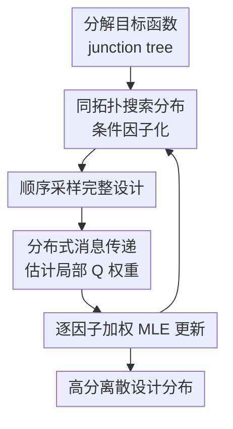

# Leveraging Discrete Function Decomposability for Scientific Design

**会议**: ICLR2026  
**OpenReview**: [https://openreview.net/forum?id=lndDn7i8W6](https://openreview.net/forum?id=lndDn7i8W6)  
**代码**: https://github.com/james-bowden/DADO  
**领域**: 离散优化 / 科学设计  
**关键词**: 离散设计, 分布优化, 函数分解, junction tree, 蛋白设计  

## 一句话总结
DADO 把科学设计中的离散目标函数分解结构显式放进分布优化过程，用 junction tree 上的消息传递为每个局部生成因子提供协调后的权重，从而比普通 EDA 更高效地在巨大离散设计空间里找到高分设计。

## 研究背景与动机
**领域现状**：AI 驱动的科学设计通常会先给定一个性质预测器 $f(x)$，再训练一个搜索分布或生成模型 $p_\theta(x)$，让它更倾向于采样出高性质分数的离散对象。这里的 $x$ 可以是蛋白序列、电路配置、材料组合或光学系统参数；优化对象不是连续向量，而是长度为 $L$、每个位置有 $D$ 种取值的组合空间。

**现有痛点**：如果直接枚举所有设计，复杂度是 $D^L$，在蛋白的 $20^L$ 序列空间里完全不可行。现有估计分布算法（EDA）或策略优化方法会把整个设计 $x$ 当作一个整体样本，用全局分数 $f(x)$ 给样本加权，再更新一个联合搜索分布。这个做法虽然避免了枚举，但它没有利用目标函数内部的结构：如果只有一小部分变量真的相互作用，联合更新仍然把所有位置绑在一起学，样本效率会被高维组合空间拖垮。

**核心矛盾**：许多科学目标函数并不是完全黑盒的。蛋白里一组活性位点可能主要决定催化或结合，另一些位置主要负责稳定结构；电路和望远镜设计也常有由拓扑或物理连接诱导的局部相互作用。换句话说，$f(x)$ 往往可以写成多个局部函数之和，但分布优化算法通常只看到一个整体分数，无法把“局部可分解”转化成“局部可学习”。

**本文目标**：作者要解决的是：在已知或可构造一个离散目标函数分解的情况下，如何训练搜索分布，使它既能像 EDA 一样输出高分设计的分布，又能像经典图模型消息传递一样利用局部结构降低有效搜索维度。

**切入角度**：论文观察到，经典 max-plus message passing 已经能在 junction tree 上用动态规划精确求解分解函数的全局最优设计；而 EDA 的分布优化本质上是在用加权最大似然移动搜索分布。DADO 的关键切入点就是把这两者拼起来：不用全局 $f(x)$ 给整个样本打一个权重，而是先在 junction tree 上计算每个局部因子需要看到的分布式 value / $Q$ 函数，再分别更新对应的条件搜索分布。

**核心 idea**：用 junction-tree message passing 生成局部、协调后的 $Q$ 权重，替代普通 EDA 的全局样本权重，从而让分解感知的 factorized search distribution 在离散科学设计空间里更高效地优化。

## 方法详解

### 整体框架
DADO 的输入不是一个完全无结构的黑盒目标，而是一个可分解的离散目标函数。论文把它表示为 junction tree $T=(N,E)$ 上的节点函数和边函数之和：$f(x)=\sum_{i\in N} f_i(\tilde{x}_i)+\sum_{(i,j)\in E} f_{i,j}(\tilde{x}_i,\tilde{x}_j)$，其中每个 $\tilde{x}_i$ 是原始设计变量的一组子集。

算法先把无向 junction tree 选根并定向，得到从 root 到 leaves 的树结构；然后把搜索分布也按同一棵树分解为 $p_\theta(x)=p_\theta(\tilde{x}_r)\prod_{(p(i),i)\in E'}p_\theta(\tilde{x}_i|\tilde{x}_{p(i)})$。每一轮迭代里，DADO 从这个分解搜索分布中采样完整设计，沿树自底向上估计分布式 value / $Q$ 函数，再用每个节点自己的 $Q$ 权重更新对应的搜索分布因子。

和普通 EDA 相比，DADO 的循环仍然是“采样、打分、更新”，但“打分”这一步从一个全局样本权重变成了 junction tree 上的一组局部权重。这样每个搜索分布因子都用同一批样本更新，却只需要学习自己负责的低维子问题，同时通过消息传递把 descendants 的影响折回来。

### 关键设计
**1. 用 junction tree 显式承载科学目标的可分解性**

这篇论文的第一步不是发明一个新的黑盒生成模型，而是要求把目标函数的结构讲清楚。若设计变量之间的直接相互作用可以表示为图，作者将其转换成 junction tree；每个 tree node 包含一组原始变量，邻接节点可以有重叠变量，于是目标函数可以拆成节点组件和边组件。这个表示比“几个不相交子问题”更一般，因为现实科学设计常常不是完全独立分块，而是局部子系统之间共享少量变量。

这种表示的好处是，它把“哪些变量需要一起看”变成了算法可以利用的拓扑约束。以蛋白为例，作者用 AlphaFold3 预测结构里的 residue contact graph 构造 junction tree，再训练一个遵守该分解的性质预测器；这样 $f(x)$ 的每个组件只看局部 residue 子集或相邻子集之间的交互。即便这个分解不是完美真实的物理规律，只要它在预测精度上没有明显崩掉，就能为后续分布优化提供足够有用的结构。

**2. 将搜索分布按同一棵树因子化，而不是学习一个联合分布**

普通 EDA 用一个联合搜索分布 $p_\theta(x)$ 覆盖所有设计变量，固定样本数 $K$ 下，每次更新都要从高维样本里估计整个分布的移动方向。DADO 选择让搜索分布模仿目标函数的 junction tree：root 因子负责 $p_\theta(\tilde{x}_r)$，每个非 root 节点负责 $p_\theta(\tilde{x}_i|\tilde{x}_{p(i)})$。采样时先采 root，再沿树向下条件采样，因此仍然得到完整设计 $x$。

这个因子化不是简单地把变量拆开独立学。由于相邻 junction tree 节点共享或耦合变量，子节点的好坏会影响父节点的选择，父节点的取值也会改变子节点的局部空间。DADO 保留条件依赖，使每个局部模型只承担较小的维度，同时又不会切断跨局部组件的协调关系。论文也用 FDA 作为对照说明：只有因子化搜索分布还不够，关键还要有能为每个因子提供合适权重的消息传递。

**3. 用分布式 value / Q 函数把全局目标转成局部加权更新**

经典 max-plus message passing 会对每个节点计算 $V_i^{\max}(\tilde{x}_{p(i)})=\max_{\tilde{x}_i} Q_i^{\max}(\tilde{x}_i,\tilde{x}_{p(i)})$，从叶子向 root 汇总最优子树值，再从 root 回溯得到全局最优设计。但 DADO 的目标不是直接输出一个 argmax，而是训练分布 $p_\theta(x)$；如果仍然对每个局部变量枚举最大值，就又回到了组合爆炸。

作者因此把 max 换成搜索分布下的期望，定义分布式 value 函数：$V_i^\theta(\tilde{x}_{p(i)})=\mathbb{E}_{p_\theta(\tilde{x}_i|\tilde{x}_{p(i)})}[Q_i^\theta(\tilde{x}_i,\tilde{x}_{p(i)})]$。对应的 $Q_i^\theta$ 包含本节点函数、与父节点的边函数，以及所有 child value 的贡献。直观地说，每个节点拿到的不是“这个局部片段自己的分数”，而是“在当前搜索分布下，选择这个局部片段会给整棵子树带来多少期望收益”。

这个 $Q$ 就成为该节点搜索因子的加权 MLE 权重。root 更新 $\sum_k W(Q_r(\tilde{x}_r^k))\log p_\theta(\tilde{x}_r^k)$，非 root 节点更新 $\sum_k W(Q_i(\tilde{x}_i^k,\tilde{x}_{p(i)}^k))\log p_\theta(\tilde{x}_i^k|\tilde{x}_{p(i)}^k)$。这样每个因子看似独立更新，实际权重已经把 descendants 的信息通过 message passing 汇入，所以局部更新仍服务于全局目标。

**4. 用蒙特卡洛估计和权重整形维持可扩展的 EDA 循环**

DADO 仍然保留 EDA 的工程形态：每轮采样 $K$ 个设计，估计权重，做固定步数的加权最大似然更新。区别是价值函数里的期望用同一批样本近似，而不是枚举 $\tilde{x}_i$ 的所有可能取值；这让算法可以处理蛋白这种 $D=20$、长度几十到几百的离散空间。

实现上，作者使用权重整形函数 $W(s)=\exp(s/\beta)$ 控制优化动态，并对 $Q$ 做均值平移以降低方差。论文强调每轮不能在同一批 $Q$ 上做太多梯度步，因为这些 $Q$ 只在当前 $\theta_n$ 附近有效；如果搜索分布因子已经变了很多，其他因子还按旧行为协调，消息就会失真。实验中采用每轮 $G=1$ 个梯度步，保持“采样—消息—更新”的节奏稳定。

### 损失函数 / 训练策略
DADO 的训练目标可以看成分解后的加权最大似然。给定第 $n$ 轮搜索分布采样出的样本，算法用当前参数 $\theta_n$ 估计所有 $Q_i^{\theta_n}$，再分别更新每个因子的参数：

$$
\theta_{r}^{n+1}=\arg\max_{\theta_r}\sum_{k=1}^{K} W(Q_r(\tilde{x}_r^k))\log p_{\theta_r}(\tilde{x}_r^k),
$$

$$
\theta_i^{n+1}=\arg\max_{\theta_i}\sum_{k=1}^{K} W(Q_i(\tilde{x}_i^k,\tilde{x}_{p(i)}^k))\log p_{\theta_i}(\tilde{x}_i^k|\tilde{x}_{p(i)}^k).
$$

搜索分布因子用 MLP-based autoregressive networks 参数化；DADO 和 FDA 使用按 junction tree 分解的条件因子，普通 EDA 和 PPO 使用不感知分解的联合自回归模型。优化器为 AdamW，主要实验中 EDA 迭代轮数为 $N=100$，每轮梯度步数 $G=1$。合成实验每轮采样 $K=100$，蛋白实验每轮采样 $K=1000$；学习率和温度 $\beta$ 对每个方法和目标函数单独扫参。

## 实验关键数据

### 主实验
论文做了两类实验：第一类是可控的合成离散函数，用来验证 DADO 是否真的随维度增大获得样本效率优势；第二类是基于真实蛋白数据训练出的分解性质预测器，用来检验这种优势能否迁移到科学设计场景。

| 实验设置 | 设计空间 | 对比方法 | 主要结论 | 解释 |
|--------|------|----------|------|------|
| 合成 tree，$L=25,D=20$ | $20^{25}$ | EDA / FDA / PPO / DADO | DADO 前期更快，100 轮末基线逐渐追上 | 低维时普通 EDA 尚可用足够迭代弥补结构劣势 |
| 合成 tree，$L=50,D=20$ | $20^{50}$ | EDA / FDA / PPO / DADO | DADO 最终显著高于最强基线 | 维度增大后，联合搜索分布的样本效率明显不足 |
| 合成 tree，$L=200,D=20$ | $20^{200}$ | EDA / FDA / PPO / DADO | DADO 与基线差距进一步扩大 | 分解后的局部子问题增长慢于完整组合空间 |
| 合成 tree，$L=400,D=20$ | $20^{400}$ | EDA / DADO | DADO 继续保持更高优化曲线 | 原文附录显示大规模下趋势延续 |

| 蛋白性质预测器 | 长度 / 字母表 | 每轮样本 | DADO 表现 | 备注 |
|--------|------|----------|------|------|
| AAV2 capsid | $L=28,D=20$ | $K=1000$ | 高于 decomposition-unaware baselines | junction tree 节点较小，分解结构有利 |
| Amyloid-beta | $L=42,D=21$ | $K=1000$ | 最终均值与最好基线的置信区间不重叠 | 双突变为主的数据，局部相互作用假设较自然 |
| Gcn4 | $L=44,D=20$ | $K=1000$ | DADO 收敛到更高预测分数 | 小数据但分解预测模型仍可用 |
| TDP-43 | $L=84,D=21$ | $K=1000$ | DADO 最终显著优于基线 | 长度更大时分解优势更有价值 |

### 消融实验
论文的消融更像机制分析：把“是否因子化搜索分布”“是否有 message passing 权重”“分解图是否准确”分开看。FDA 得到和 DADO 相同的 factorization，但不用局部 $Q$ message；PPO 稳定普通 EDA 的更新，但不利用任意 junction tree 分解。

| 配置 / 分析 | 关键指标 | 说明 |
|------|---------|------|
| EDA | 最终样本平均 $f(x)$ | 不感知分解，用全局 $f(x)$ 更新联合搜索分布，随 $L$ 增大更容易停在较低区域 |
| FDA | 最终样本平均 $f(x)$ | 只使用 factorized search distribution，不用 message passing；说明“拆分分布”本身有帮助但不是完整答案 |
| PPO | 最终样本平均 $f(x)$ | 用 clipped policy objective 稳定更新，但仍缺少任意 junction tree 上的局部协调 |
| DADO | 最终样本平均 $f(x)$ / AUC | 同时使用分解搜索分布和局部 $Q$ 权重，在多数合成与蛋白任务中最好 |
| GB1 contact threshold | holdout Pearson + 优化曲线 | 阈值 $t=2.75\text{A}$ 保留多数预测信号并降低 junction tree 复杂度，使 DADO 优势更明显 |
| 随机加边 / 删边 | holdout Pearson | 预测精度对温和图扰动较稳健，说明不一定需要完美先验分解 |

### 关键发现
- DADO 的优势随着完整设计空间变大而更明显；$L=25$ 时普通 EDA 还能追上，但 $L=50,200,400$ 时分解感知更新的样本效率优势开始主导。
- FDA 的对照说明，factorized search distribution 是必要但不充分的；没有局部 $Q$ message 时，因子更新仍然缺少对子树收益的协调。
- 在蛋白实验里，AAV、Amyloid、Gcn4 和 TDP-43 的 junction tree 节点较小，DADO 对 decomposition-unaware baselines 的优势最清楚；GB1、ynzC、CreiLOV 节点更大时，$Q$ 估计方差上升，DADO 相对优势变弱。
- 分解图不必完全正确。改变 AlphaFold3 contact threshold 或随机扰动边后，多个蛋白的 holdout Pearson 仍集中在较小范围内，支持“近似有用的结构”足以服务 DADO。

## 亮点与洞察
- DADO 最巧妙的地方在于没有把分解只当成模型压缩，而是把它变成了“给每个搜索分布因子分配不同训练权重”的机制。这样做比单纯拆分生成模型更强，因为每个局部因子的学习信号已经包含其 descendants 对全局目标的影响。
- 论文把经典 message passing 从“找一个最优点”改造成“训练一个高分设计分布”，这个转换很有启发性。科学设计常常不只需要单个 argmax，而需要一批多样、高分、可实验验证的候选，分布优化形式天然适合后续接 prior、entropy regularizer 或保守目标模型。
- 用 AlphaFold3 contact graph 构造蛋白性质预测器的分解，是一个实用但不过度承诺的选择。作者没有宣称这种结构就是绝对正确的生物机制，而是通过 threshold 和随机扰动实验说明：只要分解在预测上不太损失，就能在优化上提供收益。
- 这套思路可以迁移到其他离散设计：电路可由预设 wiring topology 给出变量交互，材料或器件设计可由物理局部耦合定义组件，组合化学库也可能用 scaffold / substituent 结构给出可分解函数。

## 局限与展望
- DADO 依赖一个可用的函数分解。论文展示了蛋白中用 AlphaFold3 contact graph 构造分解的可行性，但在电路、材料、组合药物等领域，如何稳定获得既准确又足够稀疏的分解仍需要专门研究。
- 当前实验聚焦“优化给定预测器”，没有处理预测器在设计空间远端不可靠的问题。真实科学设计里，$f(x)$ 通常只在训练数据附近可信；如果 DADO 很快把分布推到 OOD 区域，还需要和 conservative objective、prior、active learning 或 Bayesian optimization 结合。
- message passing 的 $Q$ 估计来自蒙特卡洛样本。junction tree 节点变大、子树变复杂时，局部 value 的方差会升高，GB1、ynzC、CreiLOV 上的结果也暗示了这一点。未来需要更强的 variance reduction 或更合适的 factor architecture。
- 论文为清晰起见没有加入 entropy regularization 或预训练无条件生成模型。实际设计常常希望保持多样性并靠近自然分布，DADO 如何和 CbAS、保守 diffusion fine-tuning 或 maximum-entropy objective 结合，是非常自然的下一步。

## 相关工作与启发
- **vs 普通 EDA**: 普通 EDA 用 $f(x)$ 给完整样本加权，本文把权重拆成 junction tree 上的局部 $Q$ 函数；区别在于 DADO 让每个局部搜索因子用更低维、更相关的学习信号更新。
- **vs FDA**: FDA 也使用分解的搜索分布，但它没有 message passing 来为不同变量或因子生成不同权重；DADO 的优势正是把因子化和全局协调绑在一起。
- **vs PPO / policy optimization**: PPO 稳定策略更新，但本身不解决任意 junction tree 分解下的局部协作；DADO 更像把 policy optimization 的加权回归思想推广到结构化离散设计。
- **vs additive Bayesian optimization**: 高维 BO 也利用加性分解和图结构，但通常优化 acquisition 或 surrogate，不是直接训练一个设计分布；DADO 可作为 BO 内循环优化 acquisition 的候选工具。
- **vs 蛋白 epistasis 建模**: 蛋白 epistasis 研究关心突变间相互作用的函数展开，DADO 则把这类结构作为优化器的输入；两者结合后，可以从估计 epistatic landscape 走向更高效的序列设计。

## 评分
- 新颖性: ⭐⭐⭐⭐⭐ 把 junction tree message passing 和 EDA 式分布优化结合得很自然，解决的是现有科学设计优化器少用结构信息的关键缺口。
- 实验充分度: ⭐⭐⭐⭐ 合成、真实蛋白、分解鲁棒性和运行时间都有覆盖，但缺少 wet-lab 验证，也没有和带 prior / conservative objective 的现代设计管线端到端比较。
- 写作质量: ⭐⭐⭐⭐ 论文从简单可分解例子讲到一般 junction tree，推导较完整；但符号密度高，算法细节对非图模型读者有一定门槛。
- 价值: ⭐⭐⭐⭐⭐ 对离散科学设计很有启发，尤其适合作为蛋白、材料、电路这类有已知局部相互作用结构的优化内核。

<!-- RELATED:START -->

## 相关论文

- [\[ICLR 2026\] Activation Function Design Sustains Plasticity in Continual Learning](activation_function_design_sustains_plasticity_in_continual_learning.md)
- [\[ICLR 2026\] Unleashing LLMs in Bayesian Optimization: Preference-Guided Framework for Scientific Discovery](unleashing_llms_in_bayesian_optimization_preference-guided_framework_for_scienti.md)
- [\[ICLR 2026\] Submodular Function Minimization with Dueling Oracle](submodular_function_minimization_with_dueling_oracle.md)
- [\[ICLR 2026\] DiffBED: Scaling Bayesian Experimental Design to High-Dimensions](diffbed_scaling_bayesian_experimental_design_to_high-dimensions.md)
- [\[ICLR 2026\] Towards Better Branching Policies: Leveraging the Sequential Nature of Branch-and-Bound Tree](towards_better_branching_policies_leveraging_the_sequential_nature_of_branch-and.md)

<!-- RELATED:END -->
