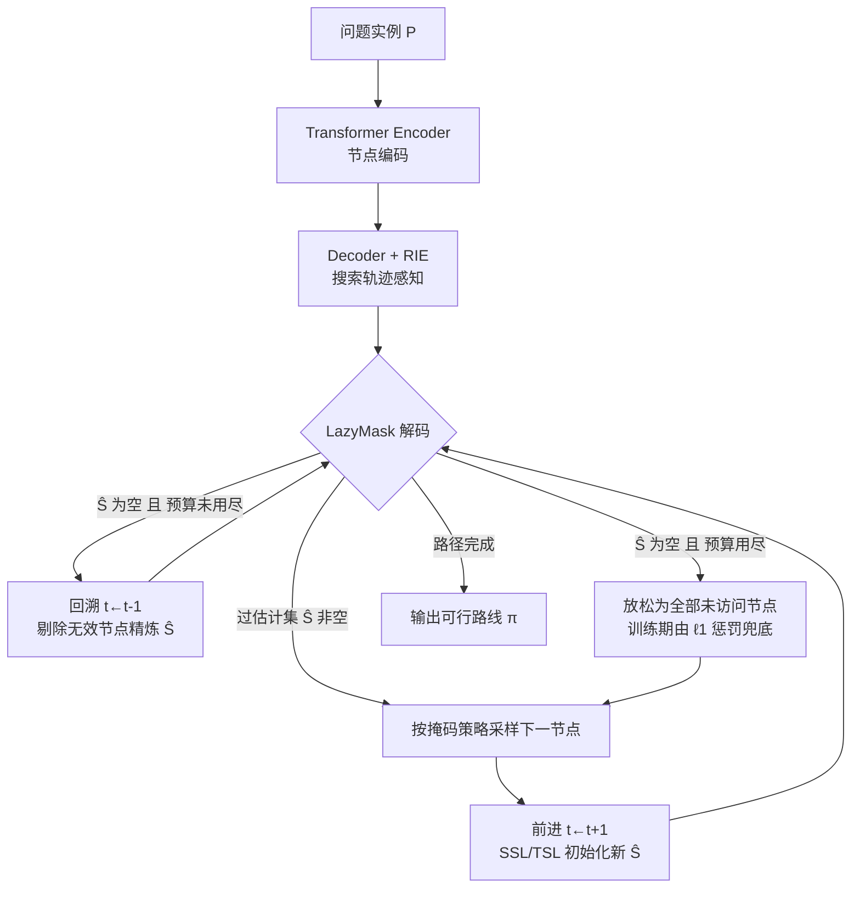

# LMask: Learn to Solve Constrained Routing Problems with Lazy Masking

**会议**: ICLR 2026  
**OpenReview**: [https://openreview.net/forum?id=zsNUc2iMzp](https://openreview.net/forum?id=zsNUc2iMzp)  
**代码**: [https://github.com/optsuite/LMask](https://github.com/optsuite/LMask)  
**领域**: optimization  
**关键词**: 神经组合优化, 约束路由, TSPTW, TSPDL, 可行性掩码, 回溯解码  

## 一句话总结
LMask 把神经路由求解器的「一次前向、不可回头」构造范式改成可前进可回溯的惰性掩码解码，配合搜索轨迹嵌入与训练期软约束惩罚，在带时间窗 / 吃水限制的约束 TSP 上把不可行率压到近 0%、同时拿到更优解。

## 研究背景与动机
**领域现状**：路由问题（TSP/VRP 及其变体）是组合优化的核心，神经构造式求解器（Pointer Network、AM、POMO 等）通过 Transformer 自回归地逐节点拼出一条完整路径，用「掩码」把违反约束的动作屏蔽掉。在无复杂约束的普通路由问题里这套范式很顺：每走一步，剩下的尾子问题仍是同类小问题（tail recursion），总能保证后续可行。

**现有痛点**：一旦引入复杂硬约束（时间窗 TSPTW、吃水限制 TSPDL），「掩码屏蔽即时违约动作」就不够了——某个节点此刻看着合法，往后却必然走入死胡同。要判断一个动作是否真的可行，理论上需要前瞻到整条路径建完为止，计算上不可承受。**核心矛盾**在于：现有方法是一次前向、每步不可逆，决策只基于当前部分路径；为弥补这种刚性，PIP 等方法靠多步 lookahead 预判未来不可行，但 lookahead 越深越贵，且无法保证一定找到可行解。更深层地，掩码机制本身缺乏系统的数学解释，沦为工程 trick。

**本文目标**：建立一个有理论保证、能端到端学习、对一般复杂约束都奏效的构造式框架，既保证生成可行解、又逼近最优解。

**核心 idea**：① **从概率逼近视角重新解释路由求解**——把找最优解写成逼近一族约束 Gibbs 分布，最优掩码集 $S(\pi_{1:t})$（potential set）由此自然导出；② **LazyMask 惰性回溯解码**——不强求一步算准精确掩码，而是先用轻量前瞻给个过估计集 $\hat S$，走进死路时回溯并增量精炼掩码；③ **搜索轨迹嵌入 + 训练期软约束惩罚**——让模型「知道」自己是在前进还是在纠错，并在回溯预算用尽时用 $\ell_1$ 惩罚兜底可行性。

## 方法详解

### 整体框架
LMask 在标准 Transformer encoder-decoder（AM/POMO 式）骨架上做三处改造：解码阶段用 **LazyMask** 算法替换一次性前向掩码，允许前进与回溯交替；decoder 输入额外注入 **精炼强度嵌入（RIE）** 以消除回溯带来的状态歧义；训练阶段以「硬约束（回溯）+ 软约束（$\ell_1$ 惩罚）」混合目标做策略梯度优化。理论侧给出 LazyMask 必出可行解、且概率逼近最优的双重保证。

### 关键设计

**1. 概率逼近视角与 potential-set 掩码：给掩码一个数学身份。** 论文先把求最优解形式化为逼近目标分布 $q^*$，并用约束 Gibbs 分布 $q_\lambda(\pi;P)\propto\exp(-(f(\pi;P)-f^*)/\lambda)\mathbf 1_C(\pi)$ 去近似它——当温度 $\lambda\to0$ 时 $q_\lambda$ 收敛到只压在最优解上的点质量分布。用参数化自回归策略 $p_\theta(\pi)=\prod_t p_\theta(\pi_{t+1}\mid\pi_{1:t})$ 拟合 $q_\lambda$，并最小化 KL 散度，得到训练损失 $L(\theta;P)=\mathbb E_{p_\theta}[f(\pi;P)]+\lambda\,\mathbb E_{p_\theta}[\log p_\theta(\pi;P)]$：第一项把概率质量推向低目标值，第二项是熵正则鼓励探索。在这个框架下，「该屏蔽哪些动作」不再是拍脑袋，而是由 potential set $S(\pi_{1:t}):=\{\pi_{t+1}:\exists\,\pi_{t+1:T},[\pi_{1:t},\pi_{t+1:T}]\in C\}$ 精确定义——只有「存在某种后续补全能让整条路径可行」的节点才允许被选，掩码即 $\mathbf 1_{S(\pi_{1:t})}$。问题在于 $S$ 往往要穷举式前瞻才能算出，于是引出下面的惰性近似。

**2. LazyMask 惰性回溯解码：用「过估计 + 回溯」逼近精确掩码。** 既然精确的 $S(\pi_{1:t})$ 算不动，LazyMask 改为维护一个**过估计集** $\hat S(\pi_{1:t})\supseteq S(\pi_{1:t})$，即「当前已知尚未被判死的候选节点」。每步先看 $\hat S$：非空就按掩码策略 $p_\theta$ 采样下一节点并前进，到新一步再初始化 $\hat S$；一旦 $\hat S$ 为空（说明当前部分路径走进了死胡同）且回溯预算 $r\le R$ 未用尽，就**回退一步**，把刚才那个害人的节点 $\pi_t$ 从上一层的 $\hat S(\pi_{1:t-1})$ 里剔除——这就是「惰性精炼」：不预先算准，而是撞墙后才把错误节点逐个删掉。前瞻与回溯的交替让模型既轻量又能纠错。论文证明（Prop. 4.1）：当 $R=+\infty$ 时 LazyMask 生成的任意解都可行，且对任意可行解都赋予非零生成概率——既不漏可行解、也绝不产出不可行解。这种「可前进可回退」的动态范式，是与以往一次前向神经求解器最本质的区别。

**3. 精炼强度嵌入（RIE）：消除回溯导致的状态歧义。** 传统自回归模型的动态特征（如 TSPTW 里的当前累计时间）只反映部分路径的聚合信息，隐含假设「一路前向」。可一旦发生回溯，同一部分路径既可能来自正常前向构造、也可能来自回退纠错，模型对二者状态无法区分，产生表征歧义、拖累学习。RIE 把搜索轨迹信息显式喂给 decoder：**局部特征**统计当前 $\hat S(\pi_{1:t})$ 被精炼过几次 $c_t$，编码成上限为 $N$ 的 one-hot（非零位在 $\min(c_t+1,N)$）；**全局特征**用 2 维 one-hot 标记总回溯数是否已触达预算 $R$。两者拼接投影成最终 RIE，让模型「意识到」自己在搜索轨迹中的位置，从而分辨前进与纠错。消融显示 RIE 把 medium TSPTW-50 的 gap 从 2.31% 降到 1.68%、解不可行率从 0.14% 降到 0.05%。

**4. 硬软约束混合训练：用回溯预算 + $\ell_1$ 惩罚两手兜底。** 训练早期若用很大的回溯预算 $R$ 会非常慢，所以训练时刻意取较小 $R$ 以提效；代价是预算用尽时 $\hat S$ 被放松为「全部未访问节点」，可能采出不可行解。为把 $p_\theta$ 拉回可行域，训练目标加入 $\ell_1$ 惩罚函数 $\Psi_\rho(\pi;P)=f(\pi;P)+\rho\sum_{j=1}^J\max(c_j(\pi;P),0)$，只惩罚时间窗 / 吃水限制这类复杂约束的违反量（节点恰好访问一次这类简单约束由 $p_\theta$ 设计天然满足）。整体目标 $\min_\theta\mathbb E_{\pi\sim p_\theta}[\Psi_\rho(\pi;P)+\lambda\log p_\theta(\pi;P)]$ 用标准策略梯度优化。这一设计把硬约束（回溯阶段强制可行）与软约束（预算耗尽后弹性惩罚）创新地拼在一条训练管线里：先硬后软，既稳又灵活。理论上 Thm 4.3 进一步给出概率最优性界 $P_{p_{\theta^*}}(f(\pi)\ge f^*+\epsilon)\le \frac{|C|\Delta(P)e^{-\Delta(P)/\lambda}}{|\Pi^*|\max\{\epsilon,\Delta\}}+\sqrt{c/2\lambda}$，刻画了熵系数 $\lambda$ 在「集中—探索—逼近误差」间的内在权衡。

## 实验关键数据

### 主实验表格
合成 TSPTW（greedy + 8× 对称增广，gap 相对 PyVRP）：

| 数据集 | 方法 | Sol. 不可行 | Ins. 不可行 | Gap | Time |
|---|---|---|---|---|---|
| Easy n=100 | PIP | 0.16% | 0.00% | 3.78% | 29s |
| | PIP-D | 0.05% | 0.00% | 4.62% | 31s |
| | **LMask** | **0.01%** | **0.00%** | **3.11%** | **17s** |
| Medium n=100 | PIP | 4.35% | 0.39% | 4.79% | 29s |
| | PIP-D | 3.46% | 0.03% | 5.76% | 31s |
| | **LMask** | **0.05%** | **0.00%** | **4.23%** | 18s |
| Hard n=100 | PIP | 31.74% | 16.68% | 0.37% | 28s |
| | PIP-D | 13.59% | 6.60% | 0.32% | 31s |
| | **LMask** | **0.00%** | **0.00%** | **0.21%** | 18s |

合成 TSPDL（gap 相对 LKH3）：

| 数据集 | 方法 | Sol. 不可行 | Ins. 不可行 | Gap |
|---|---|---|---|---|
| Hard n=100 | PIP | 29.34% | 21.65% | 12.87% |
| | PIP-D | 13.51% | 8.43% | 12.53% |
| | **LMask** | **0.80%** | **0.26%** | **4.34%** |

在 Hard 难度上对比尤其悬殊：PIP/PIP-D 在 TSPTW-100 仍有 13%–32% 解不可行，LMask 直接降到 0.00%；TSPDL-100 上 LMask 把 gap 从 12% 量级压到 4.34%。

### 消融实验表格

| 消融项 | 设置 | Gap | Sol. 不可行 |
|---|---|---|---|
| RIE（medium TSPTW-50） | With RIE | 1.68% | 0.05% |
| | Without RIE | 2.31% | 0.14% |
| 熵系数 λ（easy TSPTW-100） | λ=0 | 3.67% | — |
| | λ=0.01（最优） | 3.11% | — |
| | λ=0.05 | 7.38% | — |

### 关键发现
- **回溯预算 R**：推理时间随 $R$ 近似线性增长（每 +100 预算约 +2s），但不可行率在小 $R$ 时即急剧下降——少量回溯就能换来可行性的大幅提升。
- **回溯 vs lookahead**：用 TSL 初始化的 LMask 30 秒内即把解不可行率压到 0；PIP/PIP-D 把 lookahead 从 2 步加到 3 步带来一个数量级的时间暴涨却只有边际收益，仍劣于 SSL 版 LMask。说明「轻量前瞻 + 回溯」比「纯深度前瞻」高效得多。
- **泛化与可扩展**：在 Dumas TSPTW 真实 benchmark（n=20→80）上，LMask 全程 0.0% 不可行且 gap 最低，而 PIP/PIP-D 随规模增大不可行率飙到 20%–66%；Hard TSPTW-500 验证了可扩展性。

## 亮点与洞察
- **给「掩码」补了一个数学解释**：从 Gibbs 分布 / potential set 推导出掩码应该屏蔽什么，把工程 trick 升格为有定义、有保证的机制，这是相对 PIP 系列最大的概念贡献。
- **范式层面的突破**：把神经路由求解从「一次前向、不可回头」改成「可前进可回溯」，本质上把 backtracking 这一经典搜索思想以可微、可学习的方式接进 Transformer 解码，且证明了 $R=\infty$ 时的完备性与无误性。
- **工程上恰到好处的折中**：训练用小预算 + $\ell_1$ 惩罚提速，推理用大预算保可行——硬约束与软约束按阶段切换，避免了纯软约束求解器常见的「可行性无保证」与纯硬约束的「算不动」两难。
- 近 0% 的不可行率 + 比 LKH3/PyVRP 快几个数量级的推理，使其在「要快又要保证可行」的实际调度场景里有吸引力。

## 局限与展望
- **问题类型有限**：目前只在 TSPTW、TSPDL 两类单车辆硬约束 TSP 上验证，尚未扩到多车辆 VRP、带容量 / 取送货 / 优先级等更一般约束，作者自陈这是主要局限。
- **过估计集初始化依赖问题特定的前瞻实现**：SSL/TSL 的具体构造对每类约束都要手工设计（Appendix E），通用性受限。
- **回溯预算是超参**：预算太小退化为软约束求解（可行性无硬保证），太大推理变慢；当前需按数据集人工调，缺乏自适应预算机制。
- **理论保证带前提**：Prop 4.1 的完备性要 $R=+\infty$，而实际训练/推理都用有限预算，理论与实践之间存在缺口。

## 相关工作与启发
- **神经构造式求解器**：Pointer Network、AM (Kool 2018)、POMO (Kwon 2020)、LEHD (Luo 2023) 等确立了 Transformer 自回归 + 掩码的主线，LMask 是在这条线上对「掩码 + 解码范式」的根本性改造。
- **约束可行性处理**：DPDP（神经+DP）、neural k-opt（Ma 2023）、多步 look-ahead（Chen 2024）、以及最直接的对手 PIP/PIP-D（Bi 2024，proactive infeasibility prevention 用 PI 掩码 + 深度前瞻）。LMask 的对照实验主要打 PIP 系列，论证「回溯优于纯前瞻」。
- **变分退火 / 能量模型视角**：把 CO 求解看成逼近 Gibbs 分布（Hibat-Allah 2021、Sanokowski 2023），LMask 借此给训练损失和掩码定义提供了统一的概率推导。
- **启发**：① 当「一步算准」不可行时，「先粗估再撞墙纠错」（惰性 + 回溯）可能比「一步算更准」（深度前瞻）更划算，这一思路可迁移到其他需可行性保证的序列生成 / 程序合成任务；② 把经典搜索算子（回溯、分支）以可微方式嵌入神经解码器，是连接 learning 与 search 的有前景方向。

## 评分
- 新颖性: ⭐⭐⭐⭐⭐ 把回溯机制可学习地接进神经路由解码，并用 Gibbs/potential-set 给掩码补上数学解释，是范式级而非增量改进。
- 实验充分度: ⭐⭐⭐⭐ TSPTW/TSPDL 两类问题 × 多难度 × 多规模 + 真实 benchmark + RIE/熵/回溯预算消融，覆盖完整；略欠的是仅限单车辆硬约束 TSP，未触及一般 VRP。
- 写作质量: ⭐⭐⭐⭐ 从概率逼近到算法到理论再到实验逻辑清晰，理论与方法动机衔接自然；公式与符号偏多，对非 CO 背景读者门槛较高。
- 价值: ⭐⭐⭐⭐ 在「保证可行 + 高质量 + 快」三角上同时占优，对带复杂约束的实际调度有现实意义，且方法范式可迁移性强。

<!-- RELATED:START -->

## 相关论文

- [\[ICLR 2026\] Combination-of-Experts with Knowledge Sharing for Cross-Task Vehicle Routing Problems](combination-of-experts_with_knowledge_sharing_for_cross-task_vehicle_routing_pro.md)
- [\[AAAI 2026\] Bridging Synthetic and Real Routing Problems via LLM-Guided Instance Generation and Progressive Adaptation](../../AAAI2026/optimization/bridging_synthetic_and_real_routing_problems_via_llm-guided_instance_generation_.md)
- [\[ICLR 2026\] Learning to Solve Orienteering Problem with Time Windows and Variable Profits](learning_to_solve_orienteering_problem_with_time_windows_and_variable_profits.md)
- [\[NeurIPS 2025\] Rethinking Neural Combinatorial Optimization for Vehicle Routing Problems with Different Constraint Tightness Degrees](../../NeurIPS2025/optimization/rethinking_neural_combinatorial_optimization_for_vehicle_routing_problems_with_d.md)
- [\[ICLR 2026\] Neural Multi-Objective Combinatorial Optimization for Flexible Job Shop Scheduling Problems](neural_multi-objective_combinatorial_optimization_for_flexible_job_shop_scheduli.md)

<!-- RELATED:END -->
