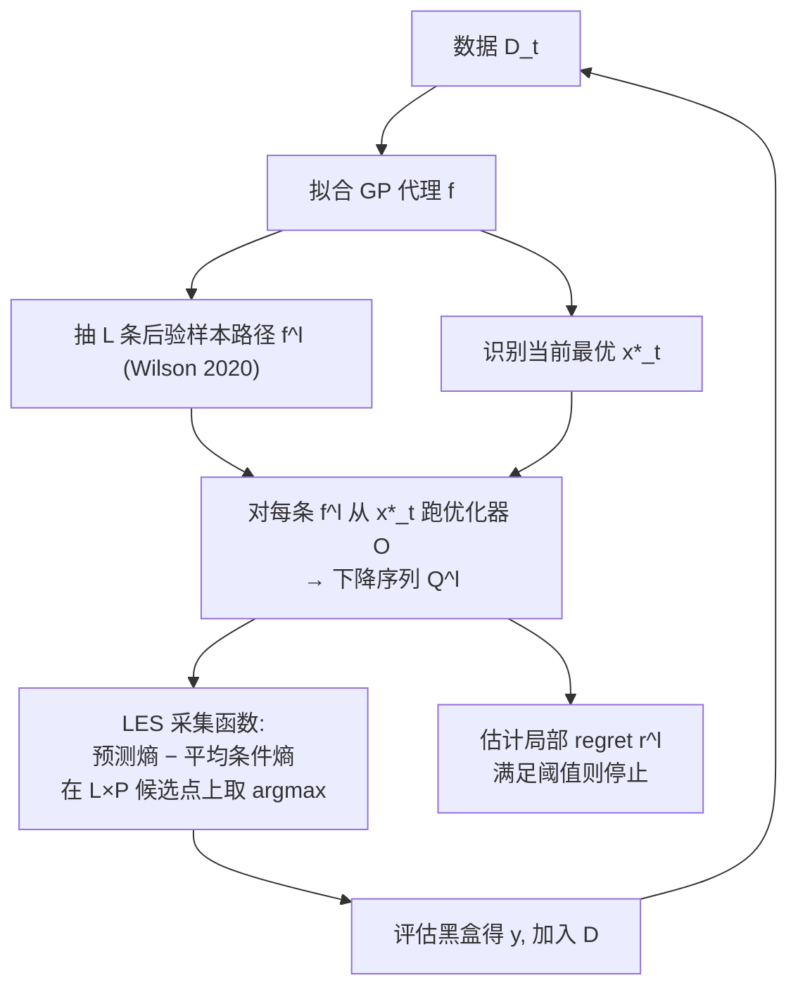

# Local Entropy Search over Descent Sequences for Bayesian Optimization

**会议**: ICLR 2026  
**OpenReview**: [https://openreview.net/forum?id=cPxmLZmFa7](https://openreview.net/forum?id=cPxmLZmFa7)  
**代码**: [https://github.com/Data-Science-in-Mechanical-Engineering/local-entropy-search](https://github.com/Data-Science-in-Mechanical-Engineering/local-entropy-search)  
**领域**: 贝叶斯优化 / 概率方法 / 信息论采集函数  
**关键词**: Bayesian Optimization, Entropy Search, Local Optimization, Descent Sequence, Gaussian Process, Mutual Information  

## 一句话总结
把熵搜索（entropy search）的"信息增益"目标从**全局最优点**改成**迭代优化器（如梯度下降）能从初始点走到的局部最优**，通过把 GP 后验"喂"进优化器得到一族"下降序列"分布，每步选择让该分布信息增益最大的查询点，从而在高维高复杂度黑盒优化上更省样本。

## 研究背景与动机
**领域现状**：贝叶斯优化（BO）是昂贵黑盒函数的主流方法，但经典 BO 以最小化相对**全局最优**的 regret 为目标，需要在整个定义域上削减不确定性；而梯度下降、拟牛顿、进化算法这类**局部迭代优化器**在高维复杂问题（如训练上亿参数网络）上恰恰是 state-of-the-art，只是因为样本效率低无法直接用于昂贵黑盒。

**现有痛点**：一边是"全局 BO 在高维上不可行"，一边是"局部优化在高维上很有效但不能直接用于黑盒"，二者存在明显张力。已有的局部 BO 大多走两条路——信赖域（TuRBO）或线搜索（GIBO 用 GP 学梯度 $\nabla f$ 来定方向和步长），但它们对"迭代下降的整条轨迹结构"只做了局部利用：GIBO 只看当前点的梯度一步，信赖域只是限制查询范围，都没有把"优化器从初始点会走出怎样一条序列、终点落在哪"作为信息论上的显式目标。

**核心矛盾**：熵搜索框架（ES/PES/MES/JES）天然适合"用信息增益指导采样"，但它们全都瞄准**全局最优的位置或函数值**，从未有人把这套信息论机器对准"一个具体优化器可达的局部最优"。

**本文目标**：提出第一个**局部版熵搜索**，显式以"从初始设计 $x_0$ 出发、由任意迭代优化器 $\mathcal{O}$ 生成的下降序列及其终点（局部最优）"为信息论目标，在昂贵黑盒设定下用尽量少的样本逼近这个可达解。

**核心 idea**：**【把优化器变成随机变量】** 用 GP 后验 $p(f|D_t)$ 表示对目标的信念，把这个分布通过优化器 $\mathcal{O}$ 传播（push-forward），就得到一个**"下降序列"上的概率分布** $Q_{x_0}$；然后选下一个查询点 $x$ 去最大化 $(x,y(x))$ 与 $Q_{x_0}$ 的互信息——序列搞清楚了，局部最优 $x^*$ 自然也就清楚了。

## 方法详解

### 整体框架
LES 把"全局最优"换成"下降序列"，整套流程是一个围绕 GP 代理的主动学习循环：拟合 GP → 从 GP 后验抽 $L$ 条样本路径 → 对每条样本路径从当前最优 $\hat{x}^*_t$ 跑优化器 $\mathcal{O}$ 得到一条下降序列 → 用"预测熵 − 条件熵"的采集函数在这些序列的候选点上挑出信息增益最大的点去评估 → 更新 GP，并用一个概率停止规则判断是否已收敛到局部最优。

### 关键设计

**1. 下降序列分布 $Q_{x_0}$：把"信念"通过优化器传播成"轨迹分布"。** 给定优化器 $\mathcal{O}_{x_0}(f)=(z_0=x_0,z_1,\dots)$，当 $f$ 已知时序列是确定的；但黑盒设定下 $f$ 是 GP 后验里的随机函数，于是把每条采样路径喂进优化器就得到一族随机轨迹 $Q_{x_0}=((z_0,R_0),(z_1,R_1),\dots)$，其中 $R_n$ 是优化器决定下一步所需的观测（梯度下降里 $R_n=\nabla f(z_n)$，爬山法里 $R_n=f(z_n)$）。这一步是整个范式的支点：它把"我对函数的不确定性"翻译成"我对优化器会走哪条路的不确定性"，而削减后者的熵就等于削减对局部最优 $x^*=\lim_{n\to\infty}z_n$ 的不确定性。作者特意指出，直接对终点 $x^*$ 定义随机变量 $O^*_{x_0}$ 再算互信息 $I((x,y(x));O^*_{x_0})$ 是**不可解**的（要把 GP 条件在"终点恰好等于某点"这种涉及整条序列的事件上），所以转而对**整条序列**做信息论目标才是可行路径。

**2. 互信息采集函数：预测熵减去条件熵的两项之差。** LES 选点准则是最大化 $\alpha_{\text{LES}}(x)=I((x,y(x));Q_{x_0}\mid D_t)$，按熵的可加性拆成
$$\alpha_{\text{LES}}(x)=\underbrace{H[y(x)\mid D_t]}_{\text{预测熵}}-\underbrace{\mathbb{E}_f\big[H[y(x)\mid D_t,Q_{x_0}]\big]}_{\text{条件熵}}.$$
第一项是 GP 在 $x$ 处的整体不确定性，有闭式 $H[y(x)\mid D_t]=\tfrac12\log(2\pi e\,\sigma_y^2(x\mid D_t))$；第二项问的是"如果我已经知道 $x$ 会怎样影响那些下降序列，还剩多少不确定性"。直觉上，采集函数会在**远离已有观测、且与高概率下降序列对齐**的点上取高值（论文 Fig.3）——既要探索又要贴着优化器真正会走的路，这正是它比 GIBO（只看一步梯度）信息利用更充分的地方。

**3. Monte-Carlo + 解析熵的混合近似：让不可解的期望可算。** 条件熵那项没有闭式（要把优化器 $\mathcal{O}$ 作用到整个后验分布上），于是用 $L$ 条样本做蒙特卡洛近似：先按 Wilson 2020 的 Matheron 规则高效抽 $L$ 条解析可微的后验路径 $f^l_t(\cdot)=\sum_i w^l_i\phi_i(\cdot)+\sum_j v_j k(\cdot,x_j)$，对每条跑优化器得到 $Q^l_{x_0}$，把这些"参数-观测对"当作虚拟观测加进数据集再解析算后验方差，最终采集函数变成
$$\alpha_{\text{LES}}(x)\approx\tfrac12\log(2\pi e\,\sigma_y^2(x\mid D_t))-\frac1L\sum_{l=1}^{L}\tfrac12\log\!\big(2\pi e\,\sigma_y^2(x\mid D_t\cup Q^l_{x_0})\big).$$
解析路径的好处是可对 $x$ 求导、能直接套梯度下降，把"采样函数→跑优化器→算熵"整条链路打通。

**4. 实用化近似：从无穷序列到有限候选集。** 要把它做成能跑的算法还需几处工程化：（i）实践中从当前最优 $\hat{x}^*_t$ 而非固定 $x_0$ 起步；（ii）不要求优化器真正收敛，跑有限步就停；（iii）只在插值后的序列上取 $P$ 个等距支撑点做条件，避免对整条序列条件化的高成本；（iv）用函数值代替梯度观测做条件，运行时间更短而性能相近；（v）高维下采集函数非凸难优化，干脆**只在 $L\times P$ 个序列候选点这个有限集合上取 argmax**——因为下降序列本身已经给出了"有前景的候选"。论文还顺带把 Wilson 2024 的停止判据适配过来：用蒙特卡洛估计局部 simple regret 低于容差 $\epsilon$ 的概率，满足即停，给出**局部最优性的高概率证书**，且因为"到达局部最优比全局更容易"，停得比全局版更早。

## 实验关键数据

### 主实验：GP 样本（不同复杂度 × 维度）
在用对数正态长度尺度先验采样出的 GP 目标上比较各方法（中位数终值，越低越好）。Out-of-Model（MAP 估超参）下高复杂度结果：

| 复杂度 | 方法 | d=5 | d=10 | d=20 | d=30 | d=50 |
|---|---|---|---|---|---|---|
| high | **LES** | −2.9 | **−5.0** | **−7.2** | **−8.5** | **−7.8** |
| high | TuRBO | **−3.7** | **−5.0** | −7.1 | −8.2 | −7.1 |
| high | logEI-DSP | −3.7 | −4.1 | −4.0 | −4.0 | −4.1 |
| high | Sobol | −2.4 | −2.7 | −2.8 | −3.2 | −3.0 |
| medium | **LES** | −3.0 | −4.6 | **−7.1** | **−8.6** | **−8.8** |
| medium | TuRBO | −3.1 | −4.9 | −7.0 | −7.9 | −8.0 |

关键趋势：**维度越高、问题越复杂，LES 优势越明显**；全局熵搜索基线 MES 完全不竞争，全局 logEI 只在 d=10 体现渐近优势。

### 消融实验

| 消融维度 | 设置 | 结论 |
|---|---|---|
| 内层优化器 | GD / ADAM / CMA-ES | LES-ADAM、LES-GD 视复杂度交替最佳；CMA-ES 更偏全局、利于低维 |
| 近似精度 | 样本数 $L$、支撑点数 $P$ | $L,P$ 越大性能越好，但运行时间越长（50 维 ADAM 中等精度约 17.8 秒/迭代）|
| LES 范式变体 | 局部 Thompson 采样 / 只条件最后一点 | 均更差，印证"条件整条序列 + 蒙特卡洛采样"才是关键 |
| 条件观测类型 | 梯度 vs 函数值 | 用函数值更快且性能相近 |

### 关键发现
- **累计 regret 更低**：局部搜索的保守探索行为让 LES 在几乎所有问题（除 d=5 且最低复杂度）上累计 regret 显著更小。
- **停止规则有效**：局部最优比全局最优更易达到，故 LES 停得比 Wilson 2024 全局版更早。
- **诚实暴露弱点**：在专门设计来坑局部搜索的高度多模态地形上，LES 频繁陷入局部最优、run-to-run 方差大、整体不如全局法。

## 亮点与洞察
- **范式转换干净利落**：把熵搜索"瞄全局"改成"瞄优化器可达的局部"，是一个概念上很小、效果上很大的视角切换——承认"全局最优不可达也没必要"，转而把成熟的局部优化器当成一等公民嵌进 BO。
- **优化器即先验**：下降序列分布 $Q_{x_0}$ 让"你信任哪个优化器"直接变成采集函数的归纳偏置，GD/ADAM/CMA-ES 可插拔，等于把"局部搜索的经验"注入信息论框架。
- **候选集即副产品**：跑优化器拿到的 $L\times P$ 序列点既是"条件信息"又是"采集函数候选集"，巧妙绕开了高维非凸采集函数优化这个老大难。
- **理论闭环**：附带的概率停止规则给出局部最优性高概率证书，且复用采集步的样本不增开销。

## 局限与展望
- **承诺即困局**：一旦进入某个盆地就没有内在逃逸机制，要覆盖全空间得靠多起点、更强的 incumbent 搜索或局部/全局切换启发式（作者列为未来方向，停止规则可改触发重启）。
- **复杂度难先验**：真实场景里很难事先判断问题复杂度，而 LES 的优势恰恰依赖"高复杂度高维"这一前提。
- **代理依赖**：所有决策由后验样本驱动，模型一旦 misspecified 就会放大错误信念；近似互信息每步要抽样并优化后验样本，开销随维度和复杂度上升。
- **理论缺口**：目前没有 GP-UCB 式的有限时间 regret 保证，只有局部最优性的高概率证书；范式仅限无约束单目标，多保真/约束/批量/异步留待扩展。

## 相关工作与启发
- **熵搜索谱系**：ES (Hennig & Schuler 2012)、PES、MES (Wang & Jegelka 2017)、JES 都瞄全局最优的位置/值/联合分布；LES 是第一个把这套机器对准局部最优的，直接建在 ES 原理之上但换了目标对象。
- **局部 BO 两大路线**：信赖域（TuRBO, Eriksson 2019）限制查询范围；线搜索/梯度（GIBO, Müller 2021 及 HCI-GIBO, He 2025）用 GP 学梯度定方向步长。LES 同样从 incumbent 起步，但不用学到的梯度更新一步，而是学习**整条下降序列**。
- **高效 GP 采样**：依赖 Wilson 2020 的 Matheron 规则解析路径采样，是"对样本路径跑优化器"得以可微、可算的技术底座；也可换成变分贝叶斯末层等其他可高效采样的概率模型。
- **启发**：这种"把下游求解器的轨迹分布当信息论目标"的思路，潜在可迁移到任何"代理 + 迭代求解器"的主动学习场景，比如把优化器换成 RL policy rollout 或物理仿真步进。

## 评分
- **新颖性**: ⭐⭐⭐⭐⭐ 第一个局部版熵搜索，"把 GP 后验传播过优化器得到下降序列分布并最大化其互信息"是一个干净且有原创性的范式转换。
- **实验充分度**: ⭐⭐⭐⭐ 跨 5–50 维、四档复杂度的 GP 样本 + 合成/应用基准 + 多组消融（优化器、近似精度、观测类型、范式变体），且诚实给出失败地形；缺有限时间理论保证。
- **写作质量**: ⭐⭐⭐⭐ 动机—范式—可解化—算法层层递进，图示（下降序列分布、采集函数热图）直观；公式与近似链路交代清楚。
- **价值**: ⭐⭐⭐⭐ 在高维高复杂度昂贵黑盒（机器人策略搜索等）上样本效率与累计 regret 双优，保守探索特性对真实世界优化有实用吸引力。

<!-- RELATED:START -->

## 相关论文

- [\[ICML 2026\] $α$-PFN: Fast Entropy Search via In-Context Learning](../../ICML2026/optimization/α-pfn_fast_entropy_search_via_in-context_learning.md)
- [\[ICLR 2026\] Incorporating Expert Priors into Bayesian Optimization via Dynamic Mean Decay](incorporating_expert_priors_into_bayesian_optimization_via_dynamic_mean_decay.md)
- [\[ICLR 2026\] From Sorting Algorithms to Scalable Kernels: Bayesian Optimization in High-Dimensional Permutation Spaces](from_sorting_algorithms_to_scalable_kernels_bayesian_optimization_in_high-dimens.md)
- [\[ICLR 2026\] Generative Bayesian Optimization: Generative Models as Acquisition Functions](generative_bayesian_optimization_generative_models_as_acquisition_functions.md)
- [\[ICLR 2026\] Improving LLM-based Global Optimization with Search Space Partitioning](improving_llm-based_global_optimization_with_search_space_partitioning.md)

<!-- RELATED:END -->
