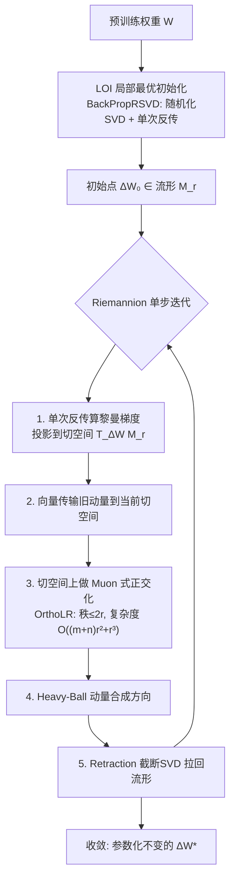

# LoRA meets Riemannion: Muon Optimizer for Parametrization-independent Low-Rank Adapters

**会议**: ICLR 2026  
**OpenReview**: [https://openreview.net/forum?id=WtbXgc9GVA](https://openreview.net/forum?id=WtbXgc9GVA)  
**代码**: [https://github.com/Bogachevv/RiemanianFinetune](https://github.com/Bogachevv/RiemanianFinetune)  
**领域**: 参数高效微调 / 优化方法  
**关键词**: LoRA, Riemannian optimization, Muon, fixed-rank manifold, transformation invariance, LLM fine-tuning, diffusion model  

## 一句话总结
把 LoRA 的低秩更新当作"固定秩流形上的一个点"来直接优化，从而把 Muon 优化器搬上黎曼流形（称为 Riemannion），从根上消除 LoRA 因子分解带来的参数化歧义，并配套一套梯度对齐初始化和单次反传实现，在 LLM 与扩散模型微调上同时提升收敛速度和最终精度。

## 研究背景与动机

**领域现状**：LoRA 用低秩修正 $\Delta W = AB^\top$（$A\in\mathbb{R}^{m\times r}$，$B\in\mathbb{R}^{n\times r}$）冻结主干、只训两个小因子，是当下最主流的参数高效微调（PEFT）手段。实践中几乎都用 SGD、Adam、AdamW 等欧氏优化器直接对因子 $(A,B)$ 做梯度下降。

**现有痛点**：同一个 $\Delta W$ 存在无穷多种等价分解——对任意可逆矩阵 $S$，$\tilde A=AS$、$\tilde B=BS^{-\top}$ 给出完全相同的 $\Delta W$。欧氏优化器对 $(A,B)$ 各自做更新，结果却依赖于"你恰好选了哪一种分解"。这种缺乏参数化不变性的表现，就是大家熟知的：两个因子一个学得飞快一个停滞、对学习率/缩放极度敏感、解依赖优化路径。

**核心矛盾**：理想的训练应该是**重参数化不变**的——对 $\Delta W$ 的实际更新不该取决于分解方式。已有的黎曼式 LoRA 要么只用 SGD 型更新（LORO），要么在所选参数化内部塞进 Adam（RPrecAdamW），都偏离了纯黎曼框架，又把对参数化的依赖带了回来；而近期在欧氏空间大放异彩的 Muon 优化器若直接逐因子套到 $A$、$B$ 上，其正交化同样依赖于任意缩放/旋转，仍不是不变的。

**本文目标**：构造一个**完全黎曼**的 LoRA 训练框架，直接在固定秩流形 $\mathcal{M}_r=\{X\in\mathbb{R}^{m\times n}:\mathrm{rank}(X)=r\}$ 上优化 $X=\Delta W$，从构造上消除分解歧义，同时把 Muon 的几何对齐优势继承过来。

**核心 idea**（**几何归位 + Muon 上流形**）：与其在因子空间里和分解歧义搏斗，不如把更新整体搬到 $\mathcal{M}_r$ 这个内蕴空间——所有计算只关心乘积 $X$ 而不是某种具体分解，于是不变性自动成立；再把 Muon 的"奇异值均衡正交化"改造成流形切空间上的版本，得到 Riemannion 优化器。

## 方法详解

### 整体框架
方法由三块拼成：**(1) Riemannion** —— 把 Muon 推广到固定秩流形的新黎曼优化器，是核心；**(2) LOI 局部最优初始化** —— 让初始 adapter 落在与全量微调梯度最对齐的流形点上；**(3) 单次反传梯度技巧 + 随机化 SVD** —— 让上述几何运算在小秩下几乎零额外开销地落地。三者都建立在固定秩流形的三件套（黎曼梯度=切空间投影、retraction=截断 SVD、向量传输=重投影）之上。

### 关键设计

**1. Riemannion：把 Muon 抬到切空间上做正交化，复杂度仍是 $O((m+n)r^2+r^3)$。** Muon 在欧氏空间的精髓是：先用带动量的梯度，再做正交化 $\mathrm{Ortho}(M)=UV^\top$（取 SVD 后把奇异值全压成 1），相当于一个逐层逐步的预条件子，均衡更新的奇异值、避免更新塌缩到少数主方向。本文要把这一步搬到流形：在固定秩流形上，动量 $M_t$ 是切向量、秩至多 $2r$（来自切空间结构式 $\xi=\begin{psmallmatrix}\dot A & A_L\end{psmallmatrix}\begin{psmallmatrix}B_R\\ \dot B\end{psmallmatrix}^\top$）。直接正交化会破坏黎曼几何，于是作者改成"先做只把前 $2r$ 个奇异值置 1 的 $\mathrm{Ortho}_r(\cdot)$，再投影回切空间"：$\tilde M_t=P_{T_{\Delta W_t}\mathcal{M}_r}\big(\mathrm{Ortho}_r(M_t)\big)$。妙处在于 $\mathrm{Ortho}_r$ 精确保留了 $M_t$ 的列空间与行空间，投影后奇异值虽不严格为 1，但实验里始终落在 $(0.9,1.1)$，与 Newton–Schulz 迭代的"近似正交"如出一辙。借助切向量天然的低秩 $2r$ 表示，整套正交化+投影只需两次 QR 加一次 $2r\times 2r$ 的小 SVD（算法 OrthoLR / ProjectLR），单步复杂度和欧氏 Muon 同阶。作者还在附录里把这步解释为切空间上线性最小化预言机（LMO）问题 $\max_{\|S\|_2\le 1,\,S\in T_{\Delta W_t}\mathcal{M}_r}\langle M_t,S\rangle$ 的近似解，给出更扎实的理论根。

**2. LOI 局部最优初始化：让初始流形点的切空间与全量梯度最对齐。** 既然要在流形上优化，初值也该照顾几何。作者把初始化写成优化问题 $\Delta W_*^{(0)}\in\arg\max_{\Delta W\in\mathcal{M}_r}\|P_{T_{\Delta W}\mathcal{M}_r}\nabla_W L(W)\|_F^2$——即在固定秩流形上找一点，使其切空间与全量微调的欧氏梯度方向最对齐，从而沿流形下降的方向与"理想的全模型调优方向"一致。定理 5.1 给出闭式解：用 $\nabla_W L(W)$ 的 SVD，最优解形如 $\alpha U_{1,r}V_{r,2r}^\top$（实验取 $S=\begin{psmallmatrix}\alpha I_r&0\\0&I_r\end{psmallmatrix}$）。这与 LoRA-GA"用损失梯度双倍秩 SVD 的左右奇异向量初始化"殊途同归，但本文是从黎曼框架推出来的，且**避免了对 Gram 矩阵求逆**，因此当 $\|\Delta W_*^{(0)}\|\to 0$ 时仍数值稳定；实验还发现初始范数取小一点反而更好。

**3. 单次反传梯度技巧 + 随机化 SVD：把"算全量梯度"这个最贵的环节绕过去。** 框架里到处要用到 $\nabla_W L(W)$，但显式形成这个 $m\times n$ 的全量梯度既贵又占内存。作者只需要它和小矩阵的乘积 $\nabla_W L(W)^\top M$ 或 $\nabla_W L(W)N$。技巧是：令可微参数 $Z_1=0\in\mathbb{R}^{m\times r}$、$Z_2=0\in\mathbb{R}^{n\times r}$，对 $L(W+Z_1N^\top+MZ_2^\top)$ 做一次前向反传，由自动微分一次性同时得到 $\nabla_{Z_1}L=\nabla_W L(W)N$ 和 $\nabla_{Z_2}L=\nabla_W L(W)^\top M$——而且这恰好是一次标准 LoRA 前向，不破坏现有训练管线。这一招既是 Riemannion 每步算黎曼梯度的核心积木，又被用来加速 LOI 里那个本该 $O(\min\{m,n\}mn)$ 的全量梯度截断 SVD：配合带幂迭代的随机化 SVD（BackPropRSVD），把初始化整体压到 $O((m+n)r^2)$ 加上 $2(q+1)$ 次反传。由于 LOI 全程只在微调前跑一次，实测仅占整段微调墙钟时间的 **0.25%**，几乎可忽略。

## 实验关键数据

### 主实验：Llama 3-8B 常识推理（LoRA rank=16，8 个子任务平均准确率 %）

| 方法 | BoolQ | PIQA | SIQA | HellaSwag | WinoGrande | ARC-E | ARC-C | OBQA | All |
|------|-------|------|------|-----------|------------|-------|-------|------|-----|
| Adam (LoRA) | 74.8 | 89.8 | 82.6 | 96.2 | 87.9 | 92.4 | 84.9 | 88.5 | 87.1±0.6 |
| DoRA | 74.8 | 89.4 | 82.4 | 95.9 | 87.8 | 90.7 | 83.8 | 87.8 | 86.6±0.3 |
| Muon (逐因子) | 72.9 | 86.4 | 80.8 | 94.1 | 84.4 | 84.2 | 77.3 | 83.9 | 83.0±0.6 |
| LoRA-RITE | 72.2 | 88.6 | 82.0 | 95.1 | 85.6 | 87.7 | 79.3 | 85.7 | 84.5±0.5 |
| RPrecAdamW | 75.8 | 89.5 | 82.4 | 96.1 | 87.7 | 90.6 | 84.1 | 87.7 | 86.8±0.4 |
| **Riemannion** | 75.7 | **91.2** | **83.5** | **96.7** | **88.6** | **93.6** | **86.4** | **89.3** | **88.1±0.2** |

### 子任务级对比（与扩散模型主题驱动生成）

| 设置 | 对比对象 | 关键发现 |
|------|----------|----------|
| Stable Diffusion 2 主题驱动生成（rank 4/8/16） | LoRA + Adam | 即便"robot toy"等复杂概念，Riemannion 仅需 **600 步**即可学到概念并保持文本相似度 |
| 不同学习率下 CLIP(文本相似度) vs DINO(图像相似度) | LoRA 各学习率 | 在不同学习率下都取得更优的概念保持精度；**秩越低收敛越快** |

### 关键发现
- **精度+稳定性双赢**：在常识推理上 Riemannion 全面超过 LoRA、DoRA、逐因子 Muon、LoRA-RITE、RPrecAdamW，平均 88.1% 为最高，且**方差最小**（±0.2，对照 Adam ±0.6）——印证了参数化不变性带来的训练稳定。
- **逐因子 Muon 反而最差**（83.0%）：直接把 Muon 套到 $A$、$B$ 上因不变性缺失而显著掉点，反衬"把 Muon 抬上流形"才是正确打开方式。
- **几乎零额外开销**：单步迭代复杂度 $O((m+n)r^2+r^3)$ 与欧氏 Muon 同阶、反传次数与原版 LoRA 相同；LOI 初始化仅占总时长 0.25%。
- **小范数初始化更好**：LOI 取较小初始范数时性能更优，且因避免 Gram 矩阵求逆而数值稳定。
- **扩散侧收敛更快**：在 SD2 主题驱动生成上，Riemannion 在多种学习率与多个秩（4/8/16）下都比 LoRA+Adam 更快收敛、更好保持概念，且呈现"秩越低收敛越快"的规律。
- **算力规模**：全部实验在 V100-32G / A100-80G 上完成，总计约 2000 GPU 小时。

## 亮点与洞察
- **把"分解歧义"这个老大难一刀切掉**：不在因子空间里打补丁（如 LoRA+ 调步长、LoRA-RITE 设计不变更新），而是换战场到固定秩流形，让不变性"从构造上"成立——这是更干净的解法。
- **Muon 与黎曼优化的首次正式联姻**：作者论证了 Muon 的正交化本质上是 LMO，于是能自然地搬到切空间的算子范数单位球上，给出 Riemannion 这一首个把 Muon 推广到固定秩流形的优化器。
- **工程落地的巧思**：单次反传同时拿到左右两个梯度-矩阵积、再配随机化 SVD，把"黎曼框架很优雅但很贵"的常见担忧化解掉，做到小秩下与 vanilla LoRA 同等开销。
- **跨架构通用**：同一框架在 LLM（Llama 3-8B）和扩散模型（SD2 主题驱动生成）上都见效，说明这是优化层面的改进而非任务特定 trick。

## 局限与展望
- **理论性质待补**：作者在结论中自陈，下一步是研究该方法的理论收敛性质——当前主要是几何动机 + 经验验证，收敛速率/界尚缺。
- **固定秩假设**：方法绑定在 $\mathcal{M}_r$ 上，秩 $r$ 需预先给定，未涉及自适应/动态秩；秩选择对扩散任务影响明显（低秩收敛更快）但缺乏自动化方案。
- **实验规模与广度**：LLM 侧主要在 Llama 3-8B 常识推理，未覆盖更大模型、数学/代码等更难任务；扩散侧限于 SD2 主题驱动生成。
- **近似正交化的精度**：$\tilde M_t$ 的奇异值只是近似为 1（落在 0.9–1.1），虽实验显示精确化（交替投影/精确解 LMO）收益甚微，但在某些场景下这层近似的影响仍待考察。

## 相关工作与启发
- **初始化谱系**：PiSSA / MiLoRA / CorDA / COALA / LoRA-GA 都在研究 LoRA 的好初值。本文 LOI 从黎曼视角推导，并证明与 LoRA-GA 的直接联系，还给出用单次反传技巧加速 SVD 的方案。
- **黎曼优化用于深度学习**：固定秩流形优化常见于矩阵补全/推荐系统（Vandereycken），Stiefel 流形用于缓解 RNN 梯度消失（Wisdom et al.）；本文把这套工具引入 LLM/扩散微调。LORO（流形上预训练）、RPrecAdamW（黎曼版 Adam）是最近邻工作，本文相对它们的关键差异是**避免 Gram 矩阵求逆**带来的稳定性。
- **Muon 一脉**：Muon 原版（Jordan et al., 2024）、其 LMO 解读（Bernstein, 2025）、流形最速下降视角（Cesista, 2025）共同支撑了 Riemannion 的推导。本文是把这股"正交化预条件"思潮接到几何约束优化上的代表。
- **启发**：当一个方法存在内在的对称性/冗余参数化（如低秩分解、各种 reparam），与其在参数空间里被歧义反复折磨，不如把优化问题搬到商流形/内蕴空间上——不变性从构造上获得，往往比逐点打补丁更稳更省心。

## 评分
- **新颖性**: ⭐⭐⭐⭐⭐ 首个把 Muon 推广到固定秩流形的优化器，"几何归位消除参数化歧义 + Muon 上切空间正交化"的组合切口干净、洞察深刻。
- **实验充分度**: ⭐⭐⭐⭐ LLM 与扩散双架构验证、对比 baseline 齐全（Adam/DoRA/Muon/LoRA-RITE/RPrecAdamW）且方差最小有说服力；但 LLM 侧任务偏单一、未覆盖更大模型与更难任务。
- **写作质量**: ⭐⭐⭐⭐ 从 Muon→LMO→切空间正交化的推导链条清晰，算法伪代码与复杂度标注完整；个别几何记号偏密，对非黎曼背景读者门槛略高。
- **价值**: ⭐⭐⭐⭐ 在主流 PEFT 场景下做到"几乎零额外开销 + 一致提升 + 更稳"，对 LoRA 训练实践有直接借鉴意义；理论收敛性补齐后潜力更大。

<!-- RELATED:START -->

## 相关论文

- [\[ICLR 2026\] Towards Efficient Optimizer Design for LLM via Structured Fisher Approximation with a Low-Rank Extension](towards_efficient_optimizer_design_for_llm_via_structured_fisher_approximation_w.md)
- [\[NeurIPS 2025\] Training-Free Bayesianization for Low-Rank Adapters of Large Language Models](../../NeurIPS2025/optimization/training-free_bayesianization_for_low-rank_adapters_of_large_language_models.md)
- [\[ICLR 2026\] The Power of Small Initialization in Noisy Low-Tubal-Rank Tensor Recovery](the_power_of_small_initialization_in_noisy_low-tubal-rank_tensor_recovery.md)
- [\[ICLR 2026\] Trion: FFT-based Dynamic Subspace Selection for Low-Rank Adaptive Optimization of LLMs](trion_fft-based_dynamic_subspace_selection_for_low-rank_adaptive_optimization_of.md)
- [\[ICLR 2026\] Error Feedback for Muon and Friends](error_feedback_for_muon_and_friends.md)

<!-- RELATED:END -->
